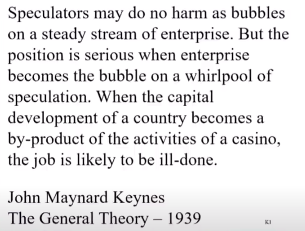

### **13、芒格：极端货币行为最终将导致灾难**

**Becky：接下来，Pat Kane问道，你对MMT经济理论有什么看法？特别是美元在作为世界储备货币的实践上？**

**芒格：**&#x597D;吧，我认为现代货币理论家过于自信了。我不认为我们中的任何人知道这些东西最终会发生什么。但我确实认为，这种极端行为很有可能超乎所有人的想象。但我也知道，如果你继续无限制地做下去，最终会导致灾难。

***

### **14、浮存金的价值随着利率下降而下降**

**Becky：**&#x5728;另一个相关的问题上，Elle Kandel也写到，“如果你能以更低的担保利率甚至是零利率借钱，那你还需要通过保险公司的浮存金借钱吗？”

**巴菲特：**&#x4F4E;利率环境大大降低了浮存金的价值。我已经在年度信函中写到了这一点，我们的浮存金有一种几乎没有人拥有的灵活性，但浮存金的价值已经大幅下降，因为这一切都逃不开无风险利率。

当你进入负利率，如果一个国家可以以负利率借贷，你就会陷入困境，这有点类似于圣彼得堡悖论（译者注：圣彼得堡悖论是决策论中的一个悖论。圣彼得堡悖论是数学家丹尼尔·伯努利（DanielBernoulli）的堂兄尼古拉·伯努利（Nicolaus Bernoulli）在1738年提出的一个概率期望值悖论，它来自于一种掷币游戏，即圣彼得堡游戏）。这是一堆抽象数学的疯狂结果。

但是，现在你完全失去了利率作为地心引力。如果你告诉我，我将不得不以每年-2%的利率借钱给政府，我说的是名义上的数字，而不是……那么你实际上是在告诉我，如果我一直这么做，随着时间的推移，我会最终破产。所以负利率会推动着你去做其他的事情，当然现在我们也看到了。好吧，我们看到世界上其他国家以更极端的方式做这件事，但包括才华横溢的Paul Samuelson在内，没有人认为应该会这么做。我们不知道后果是什么，但我们显然知道最终有事情发生。

***

**15、伯克希尔现在在收购市场中没有优势**

**Becky：这个问题来自Sam Butler，他说自己是伯克希尔的股东很多年了，他问，“这么多新SPAC的崛起对伯克希尔寻找和完成新收购的能力有什么影响？”**

**巴菲特：**&#x597D;吧，这是一个很关键的问题。按照我的理解，这些SPAC公司一般需要在两年内花完他们的钱。所以他们必须在两年内收购一家企业。

如果你用枪指着我的头说，你要在两年内完成购买一家大型企业，那我也会买一家，但那不会是一家真正的大企业。我们一直在关注收购机会，但我们看了又看，我们现在面临着许多来自私募股权基金的压力。我的意思是，如果你为别人运作资金，你会因此得到了报酬，然后你会因为收购公司而得到更多的好处却没有坏处，那么你肯定要去做收购。

我可以告诉你一个故事。有一个非常著名的人物很多年前打来的电话，打算进入再保险这个行业，想找我学习一下再保险的知识。我说，“嗯，我真的不认为这是一个很好的生意。”他说，“是的，但如果我在六个月内不花掉这笔钱，我就得把它还给投资者。”

所以这是一个不等的方程式。如果你用别人的钱工作，你会因此得到了好处，但如果你什么都不做，你就必须把资金还给他。坦率地说，（如果是这种情况）我们在这方面没有竞争力。

这不会永远持续下去。但这是现在的热钱所追逐的地方，华尔街会去任何热钱所在的地方。SPAC已经存在一段时间了，你在这些公司上贴了一个著名的名字作为标签，然后发现你可以因此而获得很多资金。我的描述可能有点夸张了，但这就是我们在赌博式的市场中所看到的。

事实上，我确实引用了凯恩斯的一句话，这可能是历史上最著名的名言之一，因为它确实总结了我们在市场中所看到的一个问题。

要知道，我们拥有世界上最大的市场。我的意思是，你们可以想象一下，如果你能够拥有世界上最大企业的一部分，你会今天投入数十亿美元，然后在两天后又拿出来吗？

我的意思是，平均而言，与农场、公寓、写字楼等需要数月才能完成交易的地方相比，现在市场提供了一个机会，让人们在一个非常非常低的成本基础上参与到这类资产中，获得即时的、巨大的反馈，这当中可能也存在各种各样的机会。但如果他们能让赌客进来，他们就能赚到真正的钱，因为他们为赌客提供了更多的工具，而赌客们愿意支付愚蠢的费用和各种各样的东西。

所以你有了SPAC这个不可思议的、规模巨大的资产，但它真正赚钱的时候却是因为人们在做愚蠢的事情。我的意思是，那才是真正的赚钱点所在。

**图：巴菲特引用凯恩斯名言**

凯恩斯实际上是在1936年写的这段话，但幻灯片上写的是1939年。他在1936年的《通论》中写道，“如果公司经营稳定，投机者只是依附其上的泡沫，不会造成伤害。但当企业自身成为投机旋涡上的泡沫时，情况就严重了。当一个国家的资本市场发展成为赌场活动的副产品时，这项工作很可能做得不好。”

去年我们有很多人把股票市场当作了赌场。你有数以百万计的人建立了帐户，他们每天在那里交易，他们在那里买卖期权……我想说的是赌客的数量增长非常大。我会说，赌博并没有什么错，他们得到的机会比他们玩彩票得到的机会更多。他们口袋里有政府发的钱，他们就是这么行动，但他们实际上没有多好的结果。如果他们只是买了股票并持有它们，他们可能会做得更好。

但是现在，全世界人民的赌博冲动都非常强烈，它偶尔会受到很大的冲击，导致在这个地方每天进入赌场的人比离开的人多，并且会在一段时间内自我强化。没有人会告诉你什么时候午夜钟声会敲响，然后一切都变成了南瓜和老鼠。

但当竞争对手在用别人的钱参与收购时，或者他们在愚蠢地用自己的钱参与收购时，特别是大额的收购却可以用别人的资金，那他们会把我们打败。

我的意思是，这是不同的游戏，他们有很多钱，因此，在这种情况持续发生的背景下，我们在收购方面不会有太多的运气。但这种事情以前也发生过。不过，现在是我们所见过的最极端的情况。是吗，查理？

**芒格：**&#x662F;的，当然，我称之为“费用驱动型收购”。换句话说，这不是因为它是一个好的投资而购买，他们购买它是因为这些顾问得到了一笔费用。当然你得到的越多，你的文明就变得越愚蠢。在某种程度上，这也是一种道德上的失败。

因为像SPAC和衍生品等这类东西赚的钱很容易，然后如果你把它推得太过分，它会给文明带来可怕的问题。同时，这也不会给做这件事的人带来任何影响，也不会对允许这项工作的监管机构和选民产生任何影响。因此，我认为，我们应该对目前的状况感到非常羞愧。

**巴菲特：**&#x4F46;资本永不眠。

**芒格：**&#x662F;的，但这些正在发生的事情是可耻的。

**巴菲特：**&#x6211;不认为这对很多来赌博的人来说是可耻的。我的意思是，赌博是人类的本能，他们口袋里有钱，他们知道别人赚了钱，而且他们不认为别人更聪明。

**芒格：**&#x6211;对这些参与赌博的可怜人没有意见。但我不喜欢接受这些傻瓜赌博的所谓专业人士。

***

### **16、巴菲特对其买入的一些股票不够了解，因而感到很不舒服**

**Becky：Moshi Levine写道，他是一个生活在以色列的美国人。他说，如果你认为股价被高估或存在泡沫，你认为最好的做法是把钱存成现金，同时等待股价回落到一个合理的价位吗？或者，将这笔钱以某种方式投资，等到股票价格回升时，再卖掉来购买股票，这是不是一个更好的主意？**

**巴菲特：**&#x597D;吧，查理和我讨论了很多类似的事情……我们买了一些我们真的不够深入理解的股票，但我们对此感到真的很不舒服。

**芒格：**&#x6211;们现在“打鱼”是越来越难了。

**巴菲特：**&#x6211;们的总资产中可能有10%到15%是现金，这超出了我的预期，但这只是作为一种保护股东和员工的方式。你知道，我们经营着伯克希尔，并确保我们不想失去别人的钱，因为他们多年以来一直投资我们。

但我们不能帮助那些今天买、明天卖的人。我们有这样一个基因：我们管理的700-800亿资产中，我们是真的愿意和这些资产的管理者携手经营下去的，这大概占我们的10%的总资产。在这些条件下，我们可能不会出售这些企业，即使有时候市场的条件发生了非常非常快速的变化。

确实有人想加入我们，但他们拥有的其他市场选择，对他们来说实在是太多了。如果他们是公开交易的上市公司，他们是很难和我们达成交易，因为别的股东是不同意的。虽然我们可能对我们700亿美元的投资不够满意，但我们对其他7000亿美元非常满意，所以我们不应该对此抱怨。

**Becky：沃伦，当我们在年度会议前谈话时，你说如果我问一两个后续问题是可以的，我想现在就做一个。你说你买了一些你不太了解的股票，它们是什么？**

**巴菲特：**&#x597D;吧，我不会告诉你具体的名字。正如我所说的，也许有一些公司我认为我知道，但我实际上并不知道。但我们买的股票，查理和我都知道它日常的业务，但我们并没有什么洞见。但整体而言，如果你告诉我，我不得不做选择的话，我宁愿拥有这些股票，而不是拥有国债。

但另一方面，如果我们把大量的资金，比如500亿美元，投资在一些我不放心的公司上（虽然收益比短期国债要好），那这事儿可能不做更好。

当机会真正吸引人的时候，我们也会卖出这500亿国债的。所以这是我们一直在谈论的事情。他们是很好的公司，但是我们对这些公司了解多少，或者有没有一种合适的评估方式，以让我们获得优势。这就是我的答案。查理，你有什么感觉？我们已经讨论过很多次了。

**芒格：**&#x5F53;然，这要困难得多。而我认为，目前形势的一个后果是，Bernie Sanders基本上说对了。这是因为，所有的东西都涨得很高，与我们这一代相比，利率又非常的低，千禧一代将会经历一段极其艰难的致富时期。因此，富人和穷人之间的差距，以及正在崛起的一代人之间的差距将大大缩小。所以Bernie说对了，他也许是偶然的，但他说对了。

***

### **17、伯克希尔回购股票并不是在操纵股价**

**Becky：这个问题来自匹兹堡的股东Danny Poland。一位知名参议员最近将股票回购归类为一种市场操纵行为。你经常说，以低于内在价值的价格回购股票有利于长期的股东，你和查理，能否详细说明这些股票回购对社会的更高层次的影响？**

**巴菲特：**&#x56DE;购它是一种把现金分配给那些想要现金的人的方式，而其他股东大多希望你再投资，这是一种对未来的储蓄。

如果我们坐在这张桌子上的四个人，决定我们要买一些冰雪皇后的特许经营权，那我们会成立一家小公司。我们都投入了100万美元或类似的资金，然后我们购买了冰雪皇后的特许经营权，并经营得很好。我们四个人中可能有三个人想继续购买更多的冰雪皇后特许经营权，但我们还没有为未来建设所需资金进行储蓄——我们从事的是不断创造财富的业务。然后第四个人说，“听着，我已经够有钱了。我宁愿卖掉然后换成钱退出来。”那只有两种方法。虽然我们四个人都可以分红，但其中三个人不想分红，那我们可以以公平的价格回购这些股份。因为总共只有我们四个人，所以我们挑出一个公平的价格，报价给第四个人，然后买走了他的股份。

我不太可能相信一些人的说法，即如果一个合伙人想要退出某项业务，那么从他那里回购股份是很糟糕的，而且如果你能够以对留下来的人有利的价格进行回购，这似乎对想退出的那个人更有利。

伯克希尔的大多数股东在过去的一次投票中，都赞同我们把资金留在公司账上继续发展。这部分是因为我们一直宣扬的理念。另外，这也是我们坚持了57年的成果，人们看着我们巨大的回报，然后把伯克希尔看作是他们将一直拥有的东西。虽然现在他们的环境可能会改变、他们的需求可能会改变，但他们通常还是会倾向于继续把钱留在公司。

最近有一些人，60年前加入我们，规模有数十亿美元。但他们没有为他们的晚年储蓄。在伯克希尔一直呆着，是他们喜欢做的事情，同时他们的慈善机构也会得到很多钱等等。但如果你的持有者中，有极少数人想要退出，而大多数人想要留在这里，那么还有什么比回购更符合逻辑的呢？

通过回购，我们把资金回报给了需要它的人，但我们不会把资金分派给每个人。在私下的交易中，人们往往以对大多数人都有利的价格进行回购。而在公开市场上，市场告诉你价值。

查理，有什么要说的吗？

**芒格：**&#x5982;果你要回购股票，只要价格高于内在价值一点儿，那就是非常不道德的。但如果你回购股票，是因为这是为了现有股东的利益而做的一件公平的事情，那这是一种非常道德的行为，而批评它的人都是疯子。

***

### **18、伯克希尔不会主动改变股东回报政策**

**Becky：Gary Gambino表示，他想知道伯克希尔是否会将其股东回报政策从股票回购转向股息。如果资本利得税率上升到43.4%，在这种情况下，股东将获得更多的股息税优惠。**

**巴菲特：**&#x662F;的，我们确实有股东这样建议。现在我们的股东群体，与REIT或MLP可能拥有的股东群体不同。我的意思是，股东与股东之间是不一样的。人们选择他们要做什么，而买入SPACs的人都希望下周股票能上涨。而基本上，我们有很多股东，他们在55年的时间里就一直和我们一起。这是一项终身投资。如果他们想套现，他们认为他们会得到一个公平的价格。但他们并没有这样做，他们购买的时候并没有卖出的意图。

所以我们对此进行了投票，大约97%的股东说他们不想要分红。而现在其他公司就不是这样了，像可口可乐那样定期分红是很疯狂的，它们已经这样做了很多年了。然后，如果突然改变政策，对数百万人已经购买了它股票的投资者而言，这可能是和他们最初所期待的很不一样。

但就资本回报政策而言，可口可乐不会变成伯克希尔，伯克希尔也不会变成可口可乐。我们有一群不同的股东，它将继续自我选择，因为人们每天都有选择。你想做什么，你想参与其中吗？伯克希尔在这方面非常尊重。

所以我们不会在税法上耍花招。这和我们的决定无关。我的意思是，我们有相当多的人不希望我们再投资这些钱。他们更关心的是我们是否能找到办法来处理这笔钱，这1000亿美元之类的，回购股票能帮助他们。

随着回购的进行，他们将持有更大比例的伯克希尔的股份。他们也喜欢看到我们收购另一家企业，但他们肯定也不介意我们增加他们在伯克希尔的权益。

***

### **19、芒格对新政府提高税收的政策表示担心**

**Becky：你收到了很多关于税收的问题。所以我将简要介绍其中的几个。这个来自丹佛的Arthur Lewis。请问你对新政府的资本利得、公司税和加大基本税率的想法是什么？**

**巴菲特：**&#x597D;吧，如果查理想要回答，我很乐意让他回答。我在很久以前，很多次说过，我不会把我的政治观点或任何东西放在保密信托中，但我也不会代表伯克希尔。我的意思是，有些人对税收有非常不同的看法，我过去也表达过一些观点。当我坐在伯克希尔哈撒韦公司的年度会议上时，我不喜欢代表伯克希尔哈撒韦公司发言。我一般不喜欢涉及政治问题。

我真的不认为我应该这样做，但我也认为，如果有人问我在过去的选举中以个人的方式投了谁的票。我的选票只能代表我自己。我也从来没有问过我们的员工他们投了谁的票，以及任何类似的问题，比如宗教什么的。

作为伯克希尔哈撒韦公司的董事长，我没有被授权讨论这些问题。但如果说是代表我自己，那我会试着把它说清楚。所以在这里，我不想利用会议来发表很多关于税收的观点。

查理？

**芒格：**&#x4F46;我认为新政府的税收政策可能是一个错误，这基本上是反资本主义。我认为资本主义的本质，是提高人均GDP。所以我有一种感觉，本杰明·富兰克林是对的。他说一个“空麻袋很难直立”。在某种程度上，美国主要公司的繁荣也能够帮助美国表现得更好。虽然，在过度融资浪潮中也有例外，但总的来说，富兰克林是对的。所以我对“因为别人有点钱就对他们发难”的观点表示担心。

***

### **20、芒格认为加州把富人赶出去是愚蠢的**

**Becky：查理，有个问题是专门问你关于税收的。多年来，特别是2020年，我们听到人们因为各种原因离开加州，比如高生活成本、高税收等等。我理解你认为各州制定税收政策和法律，使得富人离开的行为是愚蠢的，但你对那些离开的人有什么想法？是什么让你留在加州？**

**芒格：**&#x55EF;，这是一个非常有趣的问题。我经常说，我不会搬到街对面，只是因为要为我的孩子们节省5亿美元的税收。所以我认为，这是我个人对这个问题的看法。但我确实认为，各州把最富有的公民赶出去是愚蠢的。那些没有犯罪的老人，他们把钱捐给了当地的慈善机构。哪个头脑正常的人会把富人赶走？我的意思是，佛罗里达和类似的地方是非常精明的，而像加利福尼亚这样的地方是非常愚蠢的。这违背了国家的利益。

***

### **21、税率不会影响伯克希尔运营**

**Becky：还有一个问题，Jack Robbins问，25%至28%的企业税率将如何影响伯克希尔的公司？**

**芒格：**&#x597D;吧，我不认为这会是世界末日。我们已经适应了税率，不管它是多少。

**巴菲特：**&#x662F;啊。我会说，如果他们提高税率，联邦政府在商业中分得的蛋糕会更大。我不是说税率应该是多少，但我们有A类股票和B类股票，而美国政府拥有我所说的AA级股票，这是一种非常特殊的股票。

他们获得一定比例的收益，但他们不拥有资产，也不会投票决定谁来管理这个地方或其他任何事情。但如果政府想要拿走这一部分——当我刚开始投资的时候，他们拿走了52%，联邦政府拿走了绝大多数企业利润，那么，你愿意花多少钱买政府的AA级股票？

如果有一个美国财政部的公共上市证券，并被命名成像SPAC之类的名字，甚至比它更性感，它所能做的，就是拥有像伯克希尔公司未来收入的一部分。那么，这只证券现在应该值多少钱？

它将支付一大笔现金股息，并随着我们保留盈利和公司发展，它未来支付的股息将上升。它会值更多。如果税率是25%或28%，甚至52%，那么，这就是一种特殊的股票。

我的意思是，这是一家虚构的公司。当人们发表声明说，“提高税收，这对你们所有人来说都是可怕的，因为我们支付了更多的税，并且如果税率更高，这会伤害伯克希尔的股东”，这么说可能也是合适的。

但如果不这样说，那就没有任何意义了。我很乐意看到政府真正成立一家公司，比如就叫伯克希尔哈撒韦税务公司吧。我们每年交的税都要花在这上面。那么他们能以多高的价格出售这些资产？

人们总是在谈论政府的资金缺口。但我刚刚说的税收这部分，是联邦政府的一笔未上报的资产，他们实际上拥有伯克希尔的一部分，并且他们可以决定分走蛋糕的多少。这是一个有趣的问题。

***

### **22、巴菲特对遗产怎么处置并没更多的想法**

**Becky：最后一个关于税务问题。这一问题来自William Barnard。沃伦，在你的年度报告的一部分——股东手册中说，你声明，“在我死后，我的股票都不会被出售来满足我的现金需求或缴税。”拜登最近提议将未实现收益视为已出售，并在去世时按43.4%的税率征税。这改变了在你死后需要出售以纳税的股票数量吗？**

**巴菲特：**&#x597D;吧，税法明天就可以改变，你知道，它可以用很多不同的方式来完成，过去也用过很多不同的方式。我可以告诉你，我可以向社会承诺，我死后所有财产的99.7%要么捐给慈善事业，要么捐给联邦政府，而联邦政府可以决定这方面的规则。不过，我更希望我的绝大多数资产会去慈善事业。我认为，如果它被一些聪明人用于慈善事业，而不是简单地被用作缩小联邦赤字，那它实际上将实现更多的效用。

当我死的时候，会有1000亿美元或更多的资产。但我不认为联邦债务因为得到了我这1000亿美元会出现什么区别，它不会改变世界上的任何事情。

而在目前，这并不能真正为他们节省任何东西，因为他们可以很容易就借到1000亿美元。这不会让他们付出任何代价。

我没有在这方面考虑。只是就个人而言，我并不是在提倡这种公共政策，但如果他们把我的遗产全部拿走，也不会影响我。这是我真实的想法。

**芒格：**&#x6211;保证你不会介意。

**巴菲特：**&#x662F;啊，查理。你不会知道结果的。如果美国的民主决定应该全部拿走——虽然我不认为他们会，或者我不认为他们应该，但尽管如此，那又如何？

我希望看到我的遗产，为人类做更多的事，这意味要让聪明人得到适当的激励。更重要的是，不应当以一种不适当的激励方式来分配它。

然后谁知道10年、20年、30年或40年后会发生什么。我知道如果我的遗产都给了政府，那它基本上只是减少了国家债务的数额。而我不认为他们会因此改变最低工资法或其他任何东西。

对他们来说，我的遗产只是一个小数字的变化，也许它会出现在预算报告里的某一页，“收到来自巴菲特的遗产XX美元”，然后在报告后面会有一些更巨大的数字出现。所以我，我宁愿我的遗产被用作慈善，但这实际上取决于美国人民，他们通过他们选出的代表来决定。

* \-------未完待续--------
