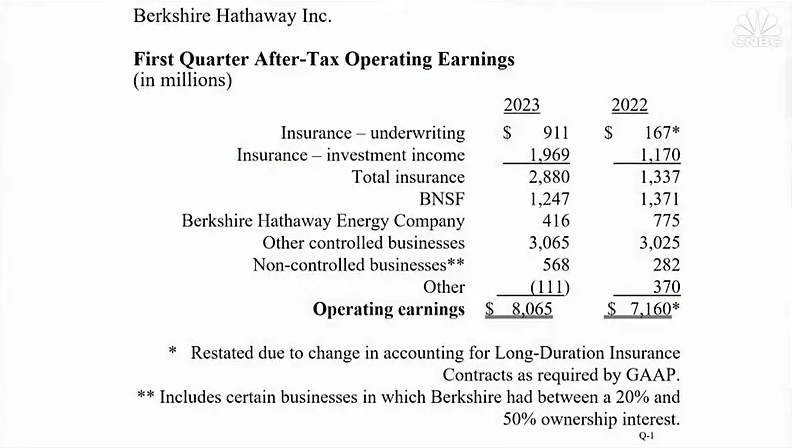
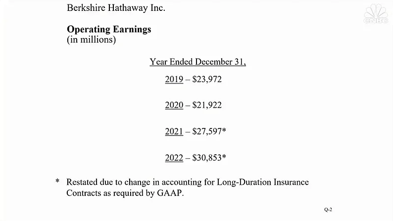
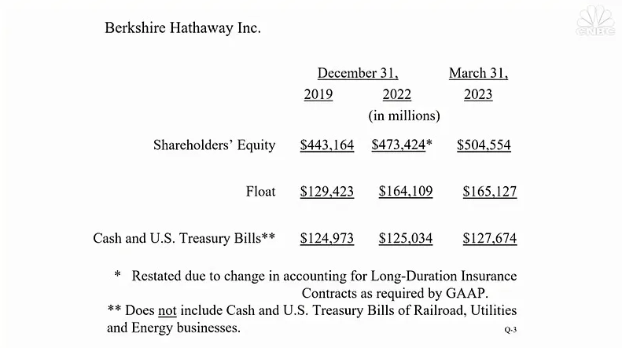
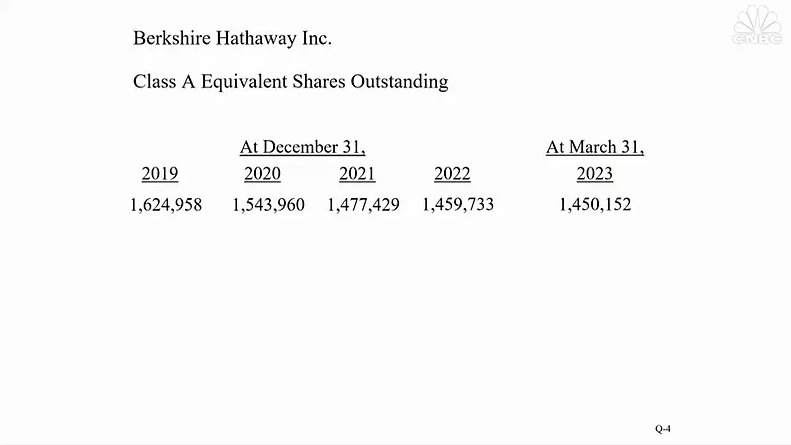

# **上午场**

### 1. **伯克希尔也有一位“查尔斯国王”**

**巴菲特：**&#x65E9;上好，欢迎你们。奥马哈欢迎你们，我欢迎你们，查理也欢迎你们。欢迎大家的到来。

开场白，我尽可能长话短说。我订了目标，至少回答 60 个问题。问题一半来自场外，一半来自场内。

在进入问答环节之前，我先介绍伯克希尔的各位董事，然后讲一下伯克希尔第一季度的业绩，我们今早刚刚发布了一季报。今天早上，起床之后，我突然想起来，还有另外一场直播节目，在英国，要和咱们的股东大会抢收视率。

英国庆祝查尔斯国王加冕，咱们这儿也有一位查尔斯国王，就坐在我旁边。（译注：芒格的全名是 Charles Thomas Munger。）（掌声和欢呼声）

坐在查理旁边的是格雷格·阿贝尔 (Greg Abel)，他负责除了保险业务以外的所有业务。（掌声）

坐在格雷格旁边的是阿吉特·贾因 (Ajit Jain)，他负责我们的保险业务。1986 年，我遇到了阿吉特，他来到伯克希尔之后，我们的保险业务风生水起。（掌声和欢呼声）

***

### 2. **介绍董事**

**巴菲特：**&#x6211;们的董事全部出席，他们已经在前排就坐。我按姓名的字母顺序介绍各位董事，请念到名字的董事起立一下。

霍华德·巴菲特 (Howard Buffett)、苏茜·巴菲特 (Susie Buffett)、史蒂夫·伯克 (Steve Burke)、肯·切诺特 (Ken Chenault)、克里斯·戴维斯 (Chris Davis)、苏珊·德克尔 (Sue Decker)、夏洛特·盖曼 (Charlotte Guyman)、小汤姆·墨菲 (Tom Murphy Jr.)、罗恩·奥尔森 (Ron Olson)、沃利·韦茨 (Wally Weitz)、梅丽尔·威特默 (Meryl Witmer)。

介绍完毕。

***

### 3. **感谢股东大会的组织者**

**巴菲特：**&#x5728;分析一季度的业绩之前，我还要向诸位介绍一个人。她的名字比较特别。梅利莎·夏皮罗·夏皮罗 (Melissa Shapiro Shapiro)。结婚之前，她叫梅利莎·夏皮罗，恰好她的丈夫也姓夏皮罗。整个股东大会，是她带领工作人员组织起来的，我和查理一点没操心。感谢梅丽莎。（掌声和欢呼声）

她的名字很好记，记住她名字中的第二个字，就能记住第三个字。梅利莎·夏皮罗·夏皮罗。

***

### 4. **大多数伯克希尔的子公司，今年的盈利可能不如去年。**

**巴菲特：**&#x4E0B;面，我们看一下一季度的业绩。我准备了几张幻灯片。请看第一张幻灯片。

第一季度，我们的经营利润为 80 亿美元多一点。我们这里所说的 80 多亿美元，只是伯克希尔·哈撒韦的经营利润，不包含资本利得。

从长期来看，我们能实现资本利得。我们投资股票就是为了获得长期收益。我们的股票投资，短期不好说，但长期一定行。单独拿出一天、一个季度、一年，甚至五年的时间，股价的波动都可能波澜诡谲。

我们买股票，其实是投资股票背后的公司。我们伯克希尔自己也经营着很多控股公司。伯克希尔的子公司，它们的业绩汇入到我们的损益表中，大家看不到它们的股价波动。如果伯灵顿铁路拿出一部分股票上市，伯克希尔的能源公司拿出一部分股票上市，大家就能看到它们的股价上下波动。

重要的是公司本身。我们一季度的经营利润为 80 亿美元左右。根据我从子公司得到的反馈，纵览经济大盘，绝大多数公司，今年的利润可能不如去年。

疫情期间，大量货币从天而降，人们手里的钱突然多了，商品短缺，一度出现了供不应求的局面。根据我的观察，上次出现这种经济局面，还是二战之后。

在过去六个月里，从公司的经营情况来看，经济的热度在逐渐消退。之前，经济火热，消费者不管打不打折，就是买买买。一件商品卖没了，消费者把另一件加到购物车里。商家只要手上有货，不愁卖不出去。

经济的热度已经消退了。并不是就业率出现了大幅下跌，只是经济的大环境发生了改变。很多经理人感到出乎意料。本来已经提高了库存，准备加大马力生产，没想到手里的订单交付完之后，客户的购买热情大不如前了。

之前是供不应求，用不着促销，现在我们要开始搞促销了。总的来说，今年，很多公司的利润可能不如去年。但是，我预期，我说的是预期啊，不是保证。

谁都不敢板上钉钉地说明天会怎样，明年会怎样。无论是市场涨跌，还是经济趋势，没一个预测是保准的。我们不理会市场的涨跌，不在乎各种预测。只有市场给我们提供了好机会的时候，我们才关注市场。

我有两个方面的预期。第一，我们今年的投资收益会比去年高很多。这是肯定的。在后面的幻灯片中，大家会看到，我们持有 1250 亿美元左右的短期投资。

也就一年多之前，我们买短期国债，只能拿到 4 个基点的收益率。1250 亿美元，根本没什么收益，一年只有区区 5000 万美元。同样是这 1250 亿美元，前天，由于担忧债务上限，市场突然发神经，我们买入了 30 亿美元的短期国债，债券等值收益率为 5.92%。以 12 个月为基数计算，短期投资，之前一年只能拿到 5000 万美元，现在每年大概可以拿到 50 亿美元。今年的投资收益肯定会增加很多。

我的另一个预期是关于保险业务的。保险业务与经济形势没有直接关系。保险业务的经营情况，主要和飓风、地震等灾难事件相关。从概率的角度来看，今年我们的保险业务可能比去年好。

制造业、零售业等行业的经营情况与经济周期密切相关。保险业务赚不赚钱，和经济周期没什么关系。万一真有一场地震或者一场飓风，发生在人口密集的区域，造成巨大的破坏，我的预期会落空。从概率的角度分析，我们的保险生意，今年会比去年好。

利润贡献的两大主力，投资收益和保险业务，今年会更赚钱。我预期，不是保证啊，我们今年的整体经营利润将高于去年。

请看第二张幻灯片。在这里，大家可以看到，疫情这几年，伯克希尔每年的经营利润。大家知道，伯克希尔始终把每年的利润保留在公司。

既然我们每年把 300 亿美元、350 亿美元的利润留在公司，我们每年的经营利润应该越来越高才是。留存收益增加了我们的基数，5 年、10 年、15 年之后，伯克希尔每年的经营利润应该比现在的数字高很多。伯克希尔成立初期，每年赚的钱很少，正是因为我们一直留存收益，才做到今天这么大的规模。

伯克希尔将来仍然会保留利润。每年的经营利润数字只是比去年高，那不算什么本事。我们必须要保持一定的增速。在伯克希尔的历史中，在很多年份，我们的增速非常高。

那时候，我们的钱很少。现在这么大的规模，不可能再有当年的高增长。请看下一张幻灯片。截止 3 月 31 日，按照美国通用会计准则，伯克希尔的净资产为 5040 亿美元。

各位可能想不到，以净资产规模计算，伯克希尔哈撒韦是美国最大的公司。我们是美国净资产最多的公司，但我们算不上价值最高的公司。有的公司，净资产规模完全可以超过伯克希尔，只是它们拿出了大笔资金，回购自己的股票。按照美国通用会计准则计算，我们已经是美国净资产最多的公司。如此之大的净资产基数，不可能实现很高的净资产收益率。

我们不求太高，只求稳健。在净资产下面的一行，列出的是浮存金。浮存金是归我们掌控的资金。浮存金比银行存款还好。银行的存款不是白来的，银行不是那么好经营的。银行吸收存款，要向储户支付利息。

最近，银行要支付更多利息，才能获得存款。浮存金，简单地说，就是还没有支付的理赔金。在保险行业，投保人先把保费交给保险公司。在我们的资产负债表上，浮存金列示在负债中，但是我们享有很大的自由，可以利用这笔资金投资。我们伯克希尔的净资产规模特别大，没有任何一家保险公司，有我们这么大的规模，所以没有任何一家保险公司，能像我们这样，这么自由地利用浮存金投资。

伯克希尔的浮存金达到了 1650 亿美元。1986 年，我们的浮存金少得可怜，是阿吉特，把我们的浮存金做到了现在这么大的规模。更妙的是，这么多年来，我们能利用这么大规模的浮存金投资，却不需要付出一分钱。这就好比我们开了一家银行，不用雇人、不用付利息，不用担心储户挤兑，就有大笔存款可供投资。

浮存金在账面上显示为负债，实则是我们的宝贵资产。这笔宝贵的资产，是阿吉特悉心经营的成果。在他的带领下，伯克希尔的保险业务傲视全球。在伯克希尔旗下，一大批保险公司和众多优秀的经理人，成长了起来，为我们的保险业务贡献力量。

伯克希尔的保险业务，始于盖可保险，如今已成参天大树。要理解浮存金，大家可以想象一下，一张资产负债表是什么样的。一边是负债，一边是资产，负债为资产提供资金来源。资产的资金来源包括长期债务，也包括股东资金。

实际上，股东资金的成本非常高。至于长期债务，短期内，成本可能较低，长期来看，成本可能上升，最后必须偿还，需要的时候，可能还借不到。浮存金也列在债务一边，但我们用不着付一分钱的利息。

浮存金将长期存续，不会一下子消失。浮存金就像股东资金一样，也为资产提供资金来源。别的公司，没有像我们这样理解浮存金的。我们一直这么理解浮存金，一直积聚浮存金。在最后一行，大家可以看到，过去三年，现金和短期国债的变化情况。

4 月份，现金和短期国债大概增加了 70 亿美元左右。一个是，我们没怎么回购股票。去年 4 月份，我们用了 4 亿美元左右回购。

回购股票会使现金减少。另外，我们卖出了一些我们投资的股票，获得了 40 亿左右的现金。再加上经营利润，大约有 25 亿美元左右。加起来，4 月份，我们的现金和短期国债多了六七十亿美元。

我这么一讲，相信各位可以对伯克希尔的现金流动有个大概的了解。最后一张幻灯片，大家看到的是，将伯克希尔 B 股折合为 A 股之后，伯克希尔的流通股数量。很明显，每一年，伯克希尔的股票数量都在减少。

伯克希尔的业务越做越大，赚的钱越来越多，各位股东所占的份额也逐年增加，也就是说，大家不用额外出钱，就能分得更多的资产和利润。有人提出，伯克希尔可以通过分红的方式与股东分享经营成果。我们不分红。正是因为我们始终保留盈利，伯克希尔才发展到了今天。

1967 年，伯克希尔派发过一次股息，每股派了 0.10 美元。我很后悔。每次提起这件事，我就和别人说，当时我去洗手间了，董事们趁我不在投的票。其实，没这回事，我当时在场。（笑声）伯克希尔把所有的盈利留下来再投资，我们这才积聚起 5000 多亿美元的净资产，才能实现 300 多亿美元的经营利润。

伯克希尔将继续保留盈利。开场白到此结束。一季报已经发布在伯克希尔官网上了。各位什么时候放假休息，可以把我们的一季报拿出来读一读。

关于伯克希尔的经营情况，我就讲到这。

***

### 5. **如果硅谷银行的储户存款没得到全额赔付，美国经济会受到灾难性的影响。**

**巴菲特：**&#x4E0B;面开始问答，贝琪·奎克 (Becky Quick) 和现场观众轮流提问，首先，有请贝琪。她整理了全国各地的股东发给她的问题。开始吧，贝琪。

**贝琪：好的，沃伦。第一个问题来自加州尔湾市 (Irvine) 的 Randy Jeffs。他的问题是：“如果硅谷银行 (Silicon Valley Bank) 的储户存款没有得到赔偿，美国经济会受到怎样的影响？”**

**巴菲特：**&#x90A3;后果肯定是灾难性的。所以，硅谷银行的储户得到了赔偿。联邦存款保险公司 (FDIC) 有规定，赔偿限额最高 25 万美元。规定是死的，美国政府不可能死守这个条款，眼看着经济陷入混乱。同样地，美国政府也不可能死守债务上限，让世界经济陷入动荡。

试想，无论是国会议员，还是美联储官员，或者是联邦存款保险公司的工作人员，谁敢站出来，向公众宣布，“我们坚决最多赔偿 25 万美元，哪怕整个国家出现全面地银行挤兑，哪怕全球金融系统陷入混乱。”谁都不敢。全额赔付是必然的。查理，你说呢？

**芒格：**&#x6211;没什么补充的。

**巴菲特：**&#x597D;的。

请各位注意，阿吉特和格雷格只参加上午的会议。有向他们两人提问的，请在上午提问。下午，查理和我留下来，继续回答各位的问题。

***

### 6. **在投资中，我们从来没因为受情绪影响而做出了错误的决策。**

**巴菲特：**&#x597D;的。第 1 区，请提问。

**股东：您好，我是来自马萨诸塞州的 Narav Patel Harel。巴菲特先生，芒格先生，在投资中，你们两位平和沉稳，既不保守，也不激进。请问你们在投资中出现过情绪化的情况吗？有没有因为受情绪影响，而做出了错误决策的时候？你们是如何避免受到情绪影响的？**

**巴菲特：**&#x6211;们做错了的投资，有很多。其中，大多数错是我犯的，查理犯的错比较少。我很想为自己开脱，我比查理做的投资决策多啊。这个理由不成立。公平一些，按错误率来算，我的错误率可能比查理高。我们犯过不少错，但是在伯克希尔的历史上，我不记得有什么时候，我们因为情绪化，在投资中，犯过错。

开场前放映的电影，好莱坞明星杰米·李·柯蒂斯 (Jamie Lee Curtis) 演的那段，很搞笑吧？杰米·李的诱惑力够大吧？面对她那么大的诱惑力，我和查理都不为所动。（笑声）（译注：开场前的电影中有一个片段，杰米·李劝说芒格买互联网股票。）查理，这回你一定有话要说了吧？

**芒格：**&#x54EA;有上市公司开股东大会，放这样的电影的？（笑声）

**巴菲特：**&#x4F60;说咱们做投资决策，有受情绪影响的时候吗？

**芒格：**&#x6CA1;有。（笑声）

**巴菲特：**&#x5728;投资中，在商场上，不能情绪化，不要受情绪影响。至于在生活中，那是另一回事。在生活中，不能做一个没感情的人。到了做投资的时候，到了生意场上，绝对不能受情绪影响。

可以说，我们也有受情绪影响的时候，特别是对待那些和我们共事已久的优秀经理人。有时候，他们岁数大了，能力明显退化，但我们却没有及早发现，仍然对他们充满信任。

主要是我们的生意本身特别好，有时候，经理人垂垂老矣，我们的生意竟然蒸蒸日上。举个例子，我们敬仰的路易斯·韦森特 (Louis Vincenti) 老了，但西科金融 (Wesco Financial) 丝毫没受影响。有段时间，西科金融的管理处于真空状态，可我们没受到什么影响。我和查理特别敬重路易斯，所以，过了很长时间才发现，原来路易斯真的老了。我们犯过类似的错误，但伯克希尔并没有因此遭受任何损失。你说呢，查理？

**芒格：**&#x6CA1;错。西科是我们做的很漂亮的一笔投资。最早收购西科，我们只花了几千万美元，后来，我们把西科发展到了二三十亿美元。

**巴菲特：**&#x5F53;年的储贷行业乱象丛生，多少储贷公司因为胡来倒闭了。路易斯的头脑很清醒，他把西科保住了。

**芒格：**&#x662F;啊，我们没胡来。

**巴菲特：**&#x6CA1;有，我们没胡来。

***

### 7. **阿吉特：盖可保险在科技方面欠账太多。**

**巴菲特：**&#x8D1D;琪？

**贝琪：这个问题来自明尼阿波利斯的 Ben Knoll。他表示，他是伯克希尔 30 多年的股东，参加了很多场股东大会，今天也来到了现场。**

**这个问题请阿吉特和格雷格回答。他说：“去年，我向两位请教了一个问题。在‘远程信息处理技术’(telematics) 方面，盖可保险不如它的竞争对手。在‘准确时刻铁路运输机制’(precision scheduled railroading) 方面，BNSF 铁路不如它的竞争对手。**

**阿吉特，您回答说，您预计盖可保险在一两年之内会有所改进。格雷格，您只是说您为 BNSF 铁路感到骄傲，但是您并没有直接回答如何面对竞争。请两位分别讲一讲，我们的盖可保险与 BNSF 铁路如何应对各自的挑战？”**

**阿吉特：**&#x6211;来回答盖可保险与远程信息处理技术的问题。在应用远程信息处理技术方面，盖可不如竞争对手。我们深刻地认识到了这一点，而且迎难而上，努力地缩小这方面的差距，也取得了很大的进步。就具体进度而言，现在，我们在 90% 的保单定价中纳入了远程信息处理技术。

问题是，只有不到一半的投保人愿意接受远程信息处理技术。在远程信息处理技术方面，我们取得了进步，缩小了与竞争对手的差距，但是我们的进步还没有为业绩带来实际的贡献。

主要是我们在科技方面的欠账太多。在科技方面，盖可保险欠缺太多。我们需要做的工作，超出了我原来的预期。目前，盖可保险有 600 多个形形色色的系统，各个系统之间无法相互通讯。我们争取把这些系统压缩到 15 个、16 个左右，并且把它们联系起来。

这是一项艰巨的任务。远程信息处理技术，我们用了，但是我们还有太多科技的欠账要补。一方面要补足科技的短板，另一方面要始终匹配费率和风险，盖可保险仍然在努力。

不知道各位是否看了一季报。今年一季度，盖可交出了一份不错的成绩单。它的综合成本率为 92.7%。这个数字很漂亮，但是大家要注意，这个数字背后有非经常损益的贡献。

首先，去年提取的未决赔款准备金，今年一季度转回了一部分。其次，对于车险企业而言，第一季度一般是一年中业绩最好的时候。

今年，盖可定下的目标是实现 96 的综合成本率。考虑到上述两个因素，我预计今年盖可的综合成本率应该接近 100，达不到 96 的目标。只要明年年底能达到 96，我就满意了。

希望大家明白，为了实现 96 这个目标，我们要付出代价，我们的投保人数会减少。利润和规模不可兼得，我们打算以利润为重，规模次之。利润上升，投保人数很可能下降，这是我们自己的选择。

我们现在强调利润，也许两年之后吧，我们会兼顾利润与规模。

***

### 8. **格雷格：BNSF 铁路始终在努力提升效率和安全。**

**巴菲特：**&#x683C;雷格，你继续啊？

**格雷格：**&#x597D;的。提到 BNSF 铁路，我还是要说，我深深地为 BNSF 团队感到骄傲。在首席执行官凯蒂•法默 (Katie Farmer) 的带领下，BNSF 的管理层兢兢业业、尽职尽责。我也相信，我们的 BNSF 团队很清楚，我们还有大量的工作要做。

“准确时刻铁路运输机制”，我们的一家主要竞争对手在用，两家加拿大的大型铁路公司也在用。我们很清楚竞争对手的动向，我们非常关注它们的经营指标。

我们的团队从来没松懈过，每一天都努力追求更高的效率。在追求高效的同时，我们必须全力满足客户的需求。2022 年之前的三年，也就是 2019、2020、2021 这三年，BNSF 团队在提高效率方面成绩显著，为股东和客户创造了更多价值，并且保证了铁路和员工的安全。我们一直在进步。即使是去年，我们也没停止努力。

2022 年，有一段时间，我们投入了大量精力“重启铁路”。

大家知道，那时候，疫情刚刚结束，我们面临供应链中断，人力短缺，港口货物积压等问题。

2022 年，我们把恢复铁路正常运转摆在了最重要的位置，无暇顾及短期的经营指标。我们很清楚我们的经营数据，很清楚我们是否达到了各项指标。

去年，我们的第一要务是尽快实现铁路安全运转，保证我们能长期创造价值，长期为客户提供服务。我们的 BNSF 团队始终着眼于长远。

从长期来看，我们一定会越来越好。在短期内，我们可能有时候没对手那么快，甚至还有效率退步的时候。就长远而言，BNSF 团队一定能取得优异的经营成果，我为他们感到骄傲。谢谢。（掌声）

**巴菲特：**&#x5927;家鼓掌了，掌声是给格雷格的，也是给阿吉特的，他们两位配得上掌声。

***

### 9. **托德·康姆斯在盖可保险工作。**

**巴菲特：**&#x6211;补充两句。

在我和阿吉特商量过之后，我们安排了托德·康姆斯 (Todd Combs) 去盖可保险工作一段时间，他主要负责匹配费率与风险的工作。匹配费率与风险是一家保险公司的重中之重。托德刚到盖可保险，疫情就爆发了，打乱了我们原有的节奏。

在盖可保险，托德的工作很出色。他与阿吉特密切配合。托德在奥马哈有房子，也经常在周末和我交流。在非常时期，托德取得了很大的成绩。托德还有很多工作要做，但是，他确实已经给盖可带来了巨大的改变。

还有一件事，想和大家说一下。过去十年，保险行业涌现了不少新的上市公司。这些上市公司，没一家是我想买的。它们千篇一律地在招股书中说“我们是一家高科技公司，不是一家保险公司。”

它们这些保险公司，和许多其它公司一样，用了高科技。不能说，你用了高科技，你就是高科技公司。它们本质上是保险公司，最根本的，要把匹配费率和风险的工作做好。这些宣称自己是高科技公司的保险公司，无一例外地陷入重大亏损，它们是吞噬资本的公司。

有一家公司，名不见经传。过去十年，新成立了那么多保险公司，据我所知，只有这家保险公司，获得了巨大的成功。这家公司是阿吉特带着四个人开创的，它的名字是伯克希尔·哈撒韦专业保险公司 (Berkshire Hathaway Specialty)。阿吉特，专业保险公司的浮存金现在有多少了？

**阿吉特：**&#x5C06;近 120 亿美元了。

**巴菲特：**&#x31;20 亿美元了。那些自称为高科技公司的保险公司，把它们所有的浮存金加起来，都没有我们这一家多。我们积聚起了 120 亿美元的浮存金，而且没出现承保亏损。从创业之初，只有 4 个人，现在规模已经达到了全球 1500 多名员工。我们新创建的这家公司，在保险行业独树一帜。我们的四位创始人能力卓著。

人才、资本、能力几个要素汇集到了一起，只有我们伯克希尔能提供这些要素。这家新的保险公司在伯克希尔诞生，毫不令人意外。

除了我们创建的这家新公司，没有一家新公司能在保险行业站稳脚跟。很多竞争对手，不愿看到我们的新公司崛起。我们说做，就做成了，没出现一点亏损。那些新上市的保险公司，和我们根本没法比。我们的成功无法复制。

伯克希尔·哈撒韦专业保险公司是在阿吉特的领导下创建的，目前，彼得·伊斯特伍德 (Peter Eastwood) 担任首席执行官。真是很了不起。我讲完了，咱们继续。对，我们要为他们鼓掌。（掌声）

***

### 10. **与人工智能相比，芒格还是更相信人类智慧。**

**巴菲特：**&#x4E0B;面请第 2 区提问。

**股东：您好，查理。您好，沃伦。我是来自新加坡的 Karen。**

**我想请教一个关于人工智能和机器人技术的问题。人工智能和机器人技术发展迅速，这将对整个社会以及股票市场产生哪些正面影响？哪些负面影响？有哪些行业和公司可能受到最大的冲击？（掌声）**

**巴菲特：**&#x4B;aren，谢谢你向查理提出这个问题。（笑声）

**芒格：**&#x5728;中国的比亚迪工厂，到处是机器人翻飞忙碌。机器人技术会越来越普遍。至于人工智能，现在被吹得神乎其神，我本人持怀疑态度。我还是更相信人类智慧。

**巴菲特：**&#x4EBA;工智能无法取代阿吉特，这是毫无疑问的。人工智能很厉害。前段时间，比尔·盖茨向我展示了一个比较旧的版本，不是最新版的。他知道，我接受能力差，不能一上来就给我最新版的。

那个版本已经很厉害了。可是，它不会讲笑话。除了不会讲笑话，它简直是上知天文下知地理，法律了，历史了，没有它不知道的。

这东西如此全知全能，我感到了一丝忧虑。我很清楚，开弓没有回头箭，这东西一旦发明出来，就放不回去了。二战的时候，我们迫不得已，发明了原子弹。当时，我们把原子弹发明出来了，解决了大问题。

如果不是我们先发明出了原子弹，后果不堪设想。但是，在原子弹问世之后的 200 年，世界会好吗？

原子弹发明出来之后，爱因斯坦说：“有了原子弹，世界不再是原来的世界，但人类的思维方式没有任何改变。”

在我看来，人工智能也是一样。它出现之后，世界不再是原来的世界，但人类的思维方式和行为模式不会发生任何改变。人工智能将产生深远的影响。你的问题提的很好，我们只能回答到这了。

***

### 11. ***芒格：商业地产低迷，可能造成严重后果。***

**巴菲特：**&#x8D1D;琪，该你了。

**贝琪：这个问题来自 Tom Seymour。他说：“最近，《金融时报》(Financial Times) 采访了查理，并发表了一篇文章。文章的开头说：‘查理·芒格警告说，随着地产价格下跌，美国银行业的坏账增加，美国的商业地产可能正在酝酿一场风暴。’**

**请查理展开讲一讲，美国的商业地产现状如何？出现风暴的话，损失可能有多大？哪些行业或地区受到的影响最大？”**

**另外，还有一位股东，也提了类似的问题，他想知道，伯克希尔是否可能借此机会进军商业地产领域。**

**芒格：**&#x4F2F;克希尔很少投资商业地产。从税收的角度考虑，个人投资者投资商业地产比较合适，伯克希尔这样的公司投资商业地产不合适。无论商业地产如何，伯克希尔应该都不会做这方面的投资。我主要是担忧，在美国，在世界很多其它国家，老城区出现“空心化”的现象，可能造成很严重的后果。这不是什么大问题，我们能迈过这道坎，只是不少房产要易主。

**巴菲特：**&#x5730;产本身不会消失。

**芒格：**&#x53EA;是东家换了人做。

**巴菲特：**&#x5F88;多人投资地产，他们专门通过“无追索权贷款”(non-recourse loan) 融资。有一次，我和查理与一个搞房地产的人谈生意。我问查理：“这样一栋大楼，他们搞房地产的，怎么确定这栋楼值多少钱？”查理告诉我：“这就看他们能从银行借到多少钱，不还也没事儿。”

总的来说，在房地产行业，大多数搞房地产发家的，用的都是这个套路。最后实在不行了，大不了把房地产甩给银行。

银行本身不愿接盘。开发商还不上钱，找银行谈，银行没办法，只好睁一只眼闭一只眼，能缓就缓。在商业地产领域，这种现象不是个例，而是普遍存在。

最后，一定要有人买单的。前几年，有些开发商以 2.5% 的低利率融资，现在利率上升了，他们吃不消了，直接把项目甩给银行了。查理更有发言权，他是搞房地产发家的。

**芒格**：房地产生意难做，还是我们的生意更好做。

**巴菲特：**&#x51E0;个月前，我去查理家看他，我们聊了两个多小时。查理和他的一个女儿在家。走的时候，我对他说：“查理，我还是继续做咱们一直做的事。”查理头也没抬，回了我一句：“沃伦，别的咱们也不会啊。”（笑声）他说的很对。

***

### 12. ***“投资中的机会是猪对手给的”***

**巴菲特：**&#x8BE5;第 3 区了吧？

**股东：大家好。我叫 Zolla Ji，来自加州圣克拉拉。我有一个问题，想请教查理和沃伦。如今，AI 等新兴科技的发展一日千里，不断带来颠覆性的变革。在新的时代背景下，价值投资将何去何从？我们投资者该如何改变？是否要遵守一些新的原则？在变化如此迅速的大环境中，如何才能继续成功地实践价值投资？谢谢。**

**芒格：**&#x6211;来回答。现在，价值投资者越来越多，他们之间的竞争越来越激烈，好机会越来越少。价值投资者将来的日子不可能像过去那么好过了。我的建议很简单，价值投资者要做好心理准备，接受钱不好赚了这个现实。

**巴菲特：**&#x4ECE;我认识查理那天起，他一直这么说。在很多问题上，我们持有不同观点，但我们的关系一直很融洽。

**芒格：**&#x6211;们赚的钱确实少了啊。

**巴菲特：**&#x4E3B;要是因为我们的规模大了。

**芒格：**&#x55EF;，我们年轻时赚的比较多。

**巴菲特：**&#x5E74;轻时，我们哪能想得到，有一天，我们管理的资产高达 5000 多亿美元。

**芒格：**&#x786E;实。

**巴菲特：**&#x6211;的观点是，投资者将来仍然能找到很多机会。为什么呢？能否找到投资机会，与科技的发展毫无关系。我从 1942 年开始做投资，一直做到今天。就拿我来说，我年轻的时候，对飞机、对发动机、对汽车，对电力，我一窍不通啊，影响我做投资了吗？没有啊。谁说新科技出现，市场中的机会就会消失？

投资中的机会是猪对手给的。（笑声）（掌声）我们管理伯克希尔 58 年了。在这 58 年里，傻子没有变少，而是越来越多了。现在的傻子比以前更傻，主要是现在的傻子比以前更容易融资，更容易得到大笔资金。

大家看到了，在过去 10 年，有十几家新上市的保险公司，无一例外都是亏损的。把公司搞上市了，圈到钱了，目的就实现了。承销商赚了、律师事务所也赚了。公司赚不赚钱，没人管。圈了多少钱啊！58 年前，圈钱哪有这么容易？

我们年轻时，也有做傻事的时候，幸好我们那时候融资不像现在这么容易。资本市场变的如此之大，谁都想进来分一杯羹，真正的投资者寥寥无几。都奔着圈钱去的，没几个有真本事的。我们规模太大了，你要是规模小的话，管理小资金，你会找到很多机会的。在这个问题上，查理和我各持己见。他总是用悲观的眼光看待未来，我总是说，“机会一定有”。我们各有各的道理。查理，我说服你了吗？没有吧？（笑声）

**芒格：**&#x73B0;在，很多聪明人管理大量资金。他们之间互相竞争，你比我精，我比你更精，你会宣传，我比你更会宣传，你会销售，我比你更会销售。现在的环境，和我们那时候，真不一样了。现在做投资，机会是有，但不可能像我们那时候那么容易。

**巴菲特：**&#x90A3;些基金经理，他们之间互掐是他们的事儿。他们玩他们的，我们玩我们的。刚才我提到了，前天，在国债市场，出现了一个机会，有一个品种的收益率高于其它品种，我们直接买了 30 亿美元。

人们的目光如此短浅，只盯着眼前短期的那点东西。在上市公司的投资者会议上，分析师总是追问短期业绩，这样他们才能在研报中给出今年的利润预测。上市公司的管理层也很配合，向分析师提供利润指引，描绘出一幅业绩逐年上升的增长曲线。

在如此短视的世界中，那些目光长远，着眼于 5 年、10 年、20 年的投资者，他们拥有巨大的优势。让我出生在今时今日的世界，只给我一小笔钱，我会非常乐意，我会把这一小笔钱变成一大笔钱。查理也一样。

让他出生在今天的世界，他也一定能找到投资机会。在今天的世界中，他找到的机会与过去的机会不一样，但是他一定能把小资金做成大资金。

**芒格：**&#x6211;现在有这么多钱，挺好的，我不想把大钱变成小钱，从头再来。现在就挺好。（笑声）

**巴菲特：**&#x8FD9;话我同意。

**芒格：**&#x90A3;是，还有谁比你更爱大钱？（笑声）

***

### 13. **与 AIG 的交易中规中矩，没赚特别多，但也不亏钱。**

（略）

### 14. **向子女隐瞒遗嘱不可取。**

**巴菲特：**&#x8BF7;第 4 区提问。

**股东：大家好。我叫 Marvin Blum，来自德州沃斯堡。我是一名律师，主要从事遗产规划工作。伯克希尔旗下的很多公司来自德州沃斯堡，包括 TTI 公司。沃伦，我还见过您呢，是在 TTI 公司创始人保罗·安德鲁斯 (Paul Andrews) 的追悼会上。很多人面临遗产规划问题。我想请教一下，您在这方面是怎么想的。**

**大多数父母没有做好遗产规划，下一代往往无法顺利接班。特别是家族企业，大多数创始人没有安排好接班，等他们去世的时候，家族企业传不下去。**

**第二代没有准备好……我有这么一个比喻。试想，在一场橄榄球比赛中，……（译注：提问者又接着说了 10 句话，讲他的比喻。）**

**巴菲特：**（译注：巴菲特打断了仍在滔滔不绝的提问者。）你的比喻，我懂了。（笑声）（掌声）我年纪这么大了，对遗产继承问题经过了深思熟虑，而且我也加入了“捐赠誓言”(The Giving Pledge)。我观察到了很多富裕家庭，看到了它们各自存在的问题。

就我家而言，在我签署遗嘱之前，我把三个子女叫到身边，我把遗嘱给他们看，让他们充分理解，听取他们的建议。我的子女都已经 60 多岁了，他们不是 20 多岁的年轻人了。因为我的子女岁数也很大了，我可以和他们讨论遗嘱，他们也能给我反馈。具体还是要看各个家庭自己的情况，还要考虑到孩子们之间的关系。

有很多因素要考虑，包括家族企业做的是什么样的生意。在我看来，如果子女已经是成年人了，父母不应该对遗嘱一字不提，非要等到自己离世了，才让孩子知晓遗嘱中的内容。父母这么做，非常不妥。

在遗产继承方面，我观察到很多现象。有的父母，对自己的遗嘱守口如瓶，完全不告诉子女。有的父母用遗嘱左右子女。在遗嘱方面，很多人犯了很多错。身后事交代不清楚，人都没了，惹出的乱子，怎么收拾？在这方面，查理也非常有发言权。

**芒格：**&#x4F2F;克希尔的股东，解决这个问题很容易。就让子女把股票拿住就完了。（笑声）

**巴菲特：**&#x67E5;理，你说的不适用于所有人。

**芒格：**&#x55EF;，只适用于 95% 的人。（笑声）

**巴菲特：**&#x4E00;个人，有几十亿美元，把这么多钱全部留给孩子，好吗？

**芒格：**&#x4F60;说的是另一个问题。我的意思是说，单纯从资产增值保值的角度来说，我就把钱放在伯克希尔。

**巴菲特：**&#x4F60;给的建议，解决了投资方面的问题。我们还要考虑到子女之间的关系。子女还是小孩子的时候，我们看到，他们之间就经常打起来，虽然只是为了鸡毛蒜皮的小事。在处理遗产继承问题时，我们还要考虑到如何维护好子女之间的关系。

谁不希望自己的子女之间关系融洽？无论是活着的时候，还是已经去世了，父母都希望自己的子女始终友好相处。遗产继承处理不好，子女之间可能起争执。很多有钱人家，留下了巨额财富。子女事先不知道遗嘱中怎么写的。

等到他们知道了遗嘱中的财产分配安排，他们马上各自找律师，对簿公堂，从此反目成仇。遗产问题，一定要谨慎地处理好。作为父母，想要让孩子具备某些品质，你要把道理讲给孩子听，也要率先垂范、以身作则。

有样学样，孩子从出生的第一天起，就开始向父母学习。你希望子女具备什么样的品质，主要靠一辈子的言传身教。简简单单一张遗嘱，改变不了什么。在遗嘱中，父母改变不了子女已经形成的价值观，只能最后再叮嘱子女几句。

你的子女再把家风家教传给他们自己的子女，把他们的价值观、他们的家产传下去，无论家产是什么，是农场，还是股票。

我知道有这么个富豪，每年，他把自己的子女召集到一起，让他们在空白的所得税申报表上签字，因为他想瞒着子女，不让子女知道他们自己有多少钱。

这个富豪的做法不可取，像他这么做，很难把自己的财富继承安排好。查理和我说过，反着来倒推，想想自己死的时候要得到怎样的结果，按着那样的结果去生活。TTI 公司的创始人保罗·安德鲁斯，他这个人，活的很明白。

当年，保罗也面临如何安排遗产的难题，后来，他找到了我。那时候，他 61 岁，钱多的花不完。他热心慈善，做了很多好事。保罗说：“我用了一年的时间，考虑如何安排我的公司 TTI。

我不缺钱，我的家人也不缺钱。唯一让我放心不下的，是我的公司。特别是那些员工，他们帮我打下了江山。我不能把公司卖给竞争对手。一旦竞争对手入主，他们必然把我们的人辞退，换成他们自己的人。

我不能把公司卖给私募股权基金。一旦公司落到私募股权的手里，就难逃被变卖的命运。”保罗接着说：“不是你们伯克希尔多优秀，实在是除了你们，没别的可选。”（笑声）

伯克希尔收购了 TTI。从那以后，我们一直过着幸福的生活。保罗·安德鲁斯，他活的很明白，知道自己想要的是什么。

***

### 15. **BNSF 铁路高度重视脱轨事件。**

**巴菲特：**&#x4E0B;一个问题，贝琪。（掌声）

**贝琪：来自西雅图的 Don Glickstein 问道：“最近，在接受采访时，沃伦批评诺福克南方铁路公司 (Norfolk Southern) 处理脱轨事件不力，但完全没有提及 BNSF 铁路的行为。三月份，法院判决，在华盛顿州，BNSF 铁路违反与土著部落签署的“地役权协议”(easement agreement)，违规超额运输原油。**

**BNSF 铁路的一列火车脱轨，在环境保护区造成了原油泄露污染。沃伦如何确保 BNSF 铁路等伯克希尔子公司遵纪守法地经营？”提问者表示，他是一位二十多年的老股东。他说，他担心伯克希尔没有一套监控制度，无法发现并制止子公司的违规行为。**

**巴菲特：**&#x683C;雷格，你来回答吧。

**格雷格：**&#x597D;。我们确实做错了，BNSF 铁路正在解决这个问题。我们的货车一直经过这片部落土地，运送原油。我们与土著部落签署过协议，规定了每天可以经过的车厢数量。我们的货车牵引车厢数量，超过了协议数量，我们违反了协议。我们的团队没有遵守协议规定，货车车厢数量超出了限制。

我们与土著部落进行了深入讨论，我们承认了我们通过增加货车长度，获得了更多利润。我们仍将与土著部落继续商讨。从这件事中，我们吸取了教训。签署了合约，我们必须严格遵守。

我们不能自己随意加车厢、加货物。我们必须遵守协议。我们吸取了教训。我们非常重视此次事故，并且正在尽力解决。我们希望能与土著部落达成一个双方都觉得公平合理的解决方案。

此次脱轨事件，我们正在进行善后工作。我们与土著部落密切沟通，尽可能在最短时间内将危害降到最低。我们双方都在朝着这个目标努力。此次原油泄露不会造成长期的环境污染。

正如我们在公告中所说，脱轨是铁路行业中的一部分。我们非常重视避免脱轨和减少脱轨造成的危害。不是所有的火车脱轨，都会造成严重后果。但是，我们始终努力避免脱轨事件。我们强调事先检测，防止脱轨事件发生。万一脱轨事件发生，我们强调要第一时间响应。我们的团队总能迅速响应，力争把对当地社区的影响降到最低。

**巴菲特：**&#x706B;车脱轨，一年会发生多少次来着？

**格雷格：**&#x94C1;路行业，一年有 1000 多次。

**巴菲特：**&#x55EF;。我们是一家铁路货运公司，是一家公用事业公司。我们大批量运输重型货物。天气有严寒酷暑，线路有弧度，有坡度。哪怕只有 1% 的坡度，重载列车下坡行驶，也非常难以控制。铁路生意不是那么好做的。

更何况，美国的铁路系统基本是 19 世纪晚期设计的，不算支线，总长度大约 35,000 公里。铁路生意很不好做，做这个生意，我们一定会犯错。

很多时候，发生脱轨，不是我们自己的错。今后 10 年、20 年、30 年，我们还会有脱轨事件。有些货物，我们并不想承运。但我们是公用承运商，我们别无选择。我们愿意运输氯气、氨气等危险品吗？我们不愿意。

社会需要运输危险品。作为一家公用承运商，客户选择我们，我们就得运输。

在安全方面，与过去相比，我们已经取得了长足进步。格雷格，我说的有什么需要补充的吗？

**格雷格：**&#x6CA1;有。

***

### 16. **伯克希尔旗下的能源公司非常重视发展清洁能源，但发展清洁能源需要全国上下共同努力。**

（略）

### 17. **选好公司的经理人非常重要。**

**巴菲特：**&#x8D1D;琪？

**贝琪：这个问题是费城的 Chris Freed 问的。他说：“我们已经知道了，格雷格·阿贝尔和阿吉特·贾因是伯克希尔的下一代领导者。格雷格和阿吉特之后呢？谁来继续领导伯克希尔？”**

**巴菲特：**&#x4E00;切正常的话，格雷格将接替我的工作。我选了格雷格接班，格雷格在很多方面比我强。格雷格继任之后，他也需要找到一个与他才能相当的接班人。

选择接班人，是他的工作中的一部分。到时候，阿吉特也会给他一些建议。选择接班人，是格雷格自己的工作，最后，应该他自己拍板。阿吉特会给一些建议。我相信，格雷格和阿吉特很可能会想到一块去。

选择接班人没那么容易。篮球比赛中经常讲“板凳深度”，换到公司管理层上，根本没有“板凳深度”这回事。伯克希尔的净资产规模全球第一，旗下的生意多种多样，能领导伯克希尔的经理人寥若星辰。

其实也不用多，找到一个就够了。最顶层的领导者，有两方面的工作：做好资本配置，选好各家子公司的经理人。按照我们的安排，我们把保险业务和其它业务分开。

我们认为，这么安排很合理。事情是不断变化的。现在让我们说，谁来接任格雷格和阿吉特，为时过早。查理，你说呢？

**芒格：**&#x6211;没什么补充的。我们很多高管是从伯克希尔子公司内部提拔的。同样是综合企业，为什么伯克希尔做得比较好？其中很重要的一个原因在于，我们很少更换经理人。

**巴菲特：**&#x4FDD;罗·安德鲁斯去世之后，我们明确知道，他选的接班人是谁。我们没必要提前宣布，我们希望我们的经理人长命百岁。前不久，我们的一位经理人去世了，加兰童装 (Garan) 的创始人，他岁数多大来着？

**格雷格：**&#x897F;摩，90 多岁。

**巴菲特：**&#x55EF;，西摩·利希滕斯坦 (Seymour Lichtenstein)。西摩 80 岁的时候，我给他写了封信祝寿，我说：“祝贺你 80 寿辰，等你 90 寿辰，再为你祝寿。”西摩 90 岁的时候，我又给他写了封信祝寿。可惜，他没活到 100 岁。

西摩一直在培养一位优秀的接班人。他的接班人跟着他学了很久。随着西摩年纪增加，他的接班人承担的责任越来越多。各个公司的情况不一样。找到合适的经理人管理公司，非常重要。

***

### 18. ***美国政治中存在“部落主义”倾向。***

**巴菲特：**&#x4E0B;一个问题，请第 6 区提问。

**股东：我叫 Hatch Okamamti，来自日本宫崎。巴菲特先生，您救了所罗门兄弟公司 (Salomon Brothers)，救了所罗门兄弟公司的 8,000 多名员工。我正是其中的一名员工。那时候，我还年轻，我在世贸中心上班。我一直想当面向您道谢，感谢您救了所罗门公司，救了它的员工，包括我和我的家庭。谢谢您，巴菲特先生。（掌声）**

**巴菲特：**&#x8FC7;奖了。其实，真要感谢德里克•莫恩 (Deryck Maughan)。德里克负责所罗门在日本的业务。头一天，我刚和他见面，第二天，就安排他掌管所罗门公司。没有他挺身而出，所罗门不可能得救。我倒要谢谢你们呢。德里克能在所罗门的危急关头大展身手，是因为他在日本学到了很多。

**股东：谢谢！我想向您请教的问题是：您多次表示，美国一定行。请问美国主要靠什么保持强大？如果美国走向衰落，原因可能是什么？（掌声）**

**巴菲特：**&#x7F8E;国经历了很多考验。我们是一个非常年轻的国家。日本的历史很长，美国的历史很短。从 1789 年算起，美国的历史只有短短 234 年。把查理和我的年龄加起来，就相当于美国历史的三分之二了。我们一共选出了 46 位总统，有的总统很不称职。我们还打过一场内战。美国一定有自己独特的优势。

1790 年，美国的人口只占全世界的 0.5%。如今，美国的人均国内生产总值大约为全世界的 25%。美国处于两大洋之间，海洋为美国提供了天然屏障。我们与邻国加拿大、墨西哥的关系很融洽。

美国有一定的地理位置优势，但美国能发展到今天，不是因为我们的土地比别的国家更富饶。美国的发展是一个奇迹。美国有很多缺点和不足，我们一路跌跌撞撞走到今天。总的来说，与我出生之时相比，今天的美国，生活水平有了极大的提高。

一个星期之前，我去看牙医，做了根管治疗。治牙的时候，我就想，幸亏麻药奴佛卡因 (Novocain) 已经发明出来了，要不可遭罪了。这只是一个例子，还有很多很多方面。过去的日子哪有想象的那么美好，可苦了。我们还发明了原子弹。如果现在世上没有原子弹，那该多好。

可惜，原子弹已经发明出来了。把魔鬼从瓶子里放出来，就塞不回去了。这是人类面临的巨大难题。1940 年代，我父亲是一名国会议员。那时候，因为二战，两党短暂团结，但党争仍然很厉害。现在的党争更严重，已经呈现出部落主义的倾向。部落主义有害。像部落一样对立，双方甚至根本不听对方在说什么。再往下发展，很可能涌现民众暴乱。

部落主义有溢出效应。我们看到过别的国家的动荡，也看到了美国受到的冲击。我们的民主制度存在一些问题，需要我们去解决。尽管如此，让我重新出生一次，我仍然会选择出生在美国，我愿意选择出生在今天的世界。现在的美国比过去好很多。只是现在的通讯非常发达，我们接触的负面信息也比以前多了很多。人类确实面临很多难题。1930 年，我出生的时候，全世界有 20 亿人。

现在，全世界有 77 亿人，而且还在增长。近代之前，人口增速缓慢。直到近代，才出现了人口的迅速增加。人类生产能源的能力有了巨大的飞跃。与全球只有 20 亿人时相比，现在我们生产的能源可供全球 77 亿人使用。

我们的世界充满希望，我们的世界也面临挑战。我不知道如何解决人类面临的种种难题。我只知道，人类面对的重大问题，我们必须着手解决，不能一味地逃避，不能幻想着到了 2050 年，全世界歌舞升平，所有的问题会自动消失。

未来如何发展，我们拭目以待。到目前为止，我感到比较忧虑。话说回来，美国内战时期，林肯不忧虑吗？历史上，美国有能力创造奇迹，它已经证明了自己。美国值得相信，它将来仍然会成功。查理，你怎么看？

**芒格：**&#x6211;不像沃伦那么乐观。我始终认为，幸福源于降低预期。将来的世界未必比现在更好。我们是怎么解决我们现在面临的难题的？最优秀的青年人，一窝蜂地涌入财富管理行业，怎么可能有利于文明的发展？我们不需要这么多基金经理。

**巴菲特：**&#x67E5;理，你是 1924 年 1 月 1 日出生的。你可不想回到那个时代吧？

**芒格：**&#x4E0D;想。现在基金经理多了，说明社会财富多了，这是好的一面。我只是不愿看到，那么多有才能的年轻人，纷纷去做基金经理。这不太正常。

**巴菲特：**&#x662F;像我一样，比较乐观，还是像查理一样，不那么乐观，各位自己选吧。（笑声）

***

### 19. **在后巴菲特时代，伯克希尔的规模会非常大，企图恶意收购的野蛮人只能望而却步。**

**巴菲特：**&#x8BF7;贝琪提问。

**贝琪：这个问题来自 Dennis DeJaniero。在 2022 年年报中，沃伦说了，伯克希尔将始终持有大量现金。伯克希尔将始终做好准备，持有大量现金，无论是发生金融危机，还是出现巨额保险损失，伯克希尔都能从容应对。**

**沃伦去世后，他持有的 A 类股将转换为 B 类股，并捐赠给多个基金会。这些基金会随后将出售股份，并将所得资金用于慈善事业。沃伦估计，将他的全部股份出售完毕，大概需要 12 年到 15 年的时间。**

**我担心，卡尔·伊坎 (Carl Icahn) 等野蛮人可能抢夺伯克希尔的控股权，瓜分伯克希尔的现金并出售伯克希尔的子公司。请问沃伦和查理有这个担心吗？**

**巴菲特：**&#x53EF;以说，伯克希尔将来可能遇到的各种问题，我们考虑了很多。我不是特别担心。在我的大部分股票出售完之前，投票权仍然在基金会手里，董事会不会向格雷格发难。等到我的股票卖完了，投票权归属市场，到时候，伯克希尔就必须靠业绩说话了。

如果我们将来 12 年到 15 年，继续不派息，我们的规模将增长到 1 万 5000 亿美元。这么大的规模，会让恶意收购者望而却步。野蛮人得掂量掂量，他们能不能借到足够的资金。伯克希尔太大，没人能收购伯克希尔。关键在于，我们伯克希尔不能成为国家的累赘，而要成为国家的中流砥柱。我们必须通过自己的经营，为国家创造价值。12 年、15 年之后，伯克希尔将拥有更多资金、更多子公司。

凭借我们雄厚的资金实力，我们将为社会创造更多就业岗位、生产更多产品，成为公司中的楷模。如果伯克希尔将来继续成功的话，那是因为我们自己配得上成功。伯克希尔能行，我相信伯克希尔。查理，你说呢？

**芒格：**&#x35;0 多年以后，我早死了，我可不操心那时候的事儿。把自己每天分内的事做好，把自己能想到的，都想到，能做到的，都做到。至于结果，顺其自然。我很想得开。提问的这个人，我觉得他有点杞人忧天了。

**巴菲特：**&#x597D;的。我们俩都不担心。我们从来没有停止谋划伯克希尔的未来，我们一直在谋划。伯克希尔一路是怎么走过来的，我心里非常清楚。在过去 58 年里，我们多次修正了伯克希尔的发展路线。我们做出的第一个重要判断就是，不能再搞纺织业了。

这是伯克希尔发展史上的关键一步。我们也是走一步、看一步，见招拆招、见步行步。关键的几步，我们走得很漂亮。我们绝对不会自己葬送伯克希尔。至于可能导致地球毁灭的灾难，那我们真没办法。

我们相信，我们建立起来的伯克希尔，不比任何一家公司差。我们不会让伯克希尔债台高筑，眼看着巨额债务到期，却无力偿还。我们不会随意承接大量保险，等到众多保单同时到期，才后悔莫及。伯克希尔将始终持有大量现金。

伯克希尔拥有大量现金，也拥有强大的盈利能力，拥有分散在各行各业的众多投资。将来，别人会拿伯克希尔与其它公司进行比较，我们不怕比。我们留下的伯克希尔是一家安全稳健的公司。

伯克希尔拥有独一无二的股东群体。有的公司，上市之前，员工持有股票，员工也是股东，它们的股东基础很稳固。在上市公司之中，没有一家，有伯克希尔这么稳固的股东群体。我们的股东群体是经过 58 年积聚起来的。58 年来，我们始终把股东视为公司的所有者。（掌声）

将来，伯克希尔该怎么做？我们要继续让顾客满意。我们要继续造福所在的社区，让人们欢迎我们，而不是讨厌我们。当发生金融危机时，有伯克希尔，政府感到放心。因为我们能挺身而出，做一些政府做不到的事。在金融危机之中出手，我们能稳定社会，也能获得经济利益。将来，我们一定还会经历种种危机。只要地球不毁灭，伯克希尔将继续为美国创造价值。只要伯克希尔能为美国创造价值，伯克希尔就能一直生存下去。（掌声）

***

### 20. ***关于阿吉特·贾因和本·罗斯纳的小故事。***

**巴菲特：**&#x8BF7;第 7 区提问。

**股东：**&#x5DF4;菲特先生、芒格先生，谢谢你们举办此次盛会。我叫 Beau Clayton，来自北卡罗来纳州达勒姆 (Durham, North Carolina)。

我们期盼参加伯克希尔股东会，因为你们经常讲一些意味深长的小故事。听了这些小故事，我们收获良多、久久难忘。

再给我们讲几个你们没讲过的小故事吧。请您讲几个关于格雷格和阿吉特的小故事，最好是能反映出他们的性格以及他们的领导能力的。（掌声）

**巴菲特：**&#x6211;先从阿吉特开始。阿吉特是 1986 年加入伯克希尔的。1969 年，我们开始做再保险生意。我摸索了 17 年。阿吉特来之前，负责保险业务的是另外一个人。

他人品、能力都没问题，只是他也像其他人一样经营保险公司，没有跳出保险公司旧有的藩篱。我们做了 17 年，还是没摸到门径。

我觉得，该变一变了。那是一个星期六，阿吉特来到了我面前，是我们原来负责保险业务的迈克·戈德堡 (Mike Goldberg) 找到他的。迈克为伯克希尔找到了阿吉特，迈克居功至伟。我和阿吉特聊了几句。我记得，我好像一边查邮件，一边和阿吉特聊。

那时，阿吉特还没接触过保险行业。之前，他是做管理咨询的，对美国公司的运作非常了解。和他聊了几句之后，我知道，我遇到千里马了。我立即请阿吉特管理我们的保险业务。

阿吉特上任没多久，恰好碰上保险市场的景气周期。阿吉特的才能有多大？保险行业，全世界前十位经理人加到一起，也抵不上一个阿吉特。以前，我和阿吉特每天都交流。

现在，我们也交流，但不像过去那么多了。阿吉特是独一无二的。像阿吉特这样独一无二的人，只要愿意一直工作下去，一个足够了。

保罗·安德鲁斯早就财务自由了，他还是留在 TTI 继续工作。每年，我和他谈加薪，他总是告诉我：“明年再说。”像保罗这样优秀的领导者，你从商学院的优秀毕业生里招聘，根本找不到。我招人的时候，从来不看这个人的毕业院校。

我看简历，不在乎这个人读过什么学校。阿吉特是名校毕业的。阿吉特之所以是阿吉特，并不是因为他读了名校。查理，你也讲两个。你是怎么找到路易斯·韦森特的？

**芒格：**&#x6536;购西科的时候，他就在那儿了。

**巴菲特：**&#x662F;在那儿了，但也得有你慧眼识珠啊。

**芒格：**&#x6709;一次，我问他，“你上大学时体重才 150 斤，怎么还能成为橄榄球校队首发？”路易斯说：“我速度快。”他速度快，呵呵。伯克希尔有很多人才以速度见长。

**巴菲特：**&#x6211;们有一位经理人，文化程度只有小学四年级。本·罗斯纳 (Ben Rosner)。你还记得吗？

**芒格：**&#x8BB0;得。他完全自学成才。本·罗斯纳做零售生意，在他那一片儿，没人比他更精。他的眼光像鹰一样敏锐，他是一位商业奇才。本·罗斯纳是很好的例子。他去世之后，我们找不到像他能力那么强的接班人。他的去世，是伯克希尔的损失。

**巴菲特：**&#x6211;想起了一个好笑的小故事。本·罗斯纳有个生意伙伴，叫利奥·西蒙 (Leo Simon)。利奥·西蒙娶了报业大亨摩西·安纳伯格 (Moses Annenberg) 的女儿。虽然利奥非常有钱，本·罗斯纳一穷二白，但他们两个人很合得来。

有一次，这还是在他们两人创建联合零售商店 (Associated Retail Stores) 之前，他们想到了一个点子。他们打算收购一个一战后废弃的潜艇，把潜艇拉到 1933 年芝加哥世博会上。他们没花几个钱，就把潜艇买下来了。

他们觉得，把潜艇放到世博会展示，一定有人愿意付费参观。潜艇是在佛罗里达州买的，他们要把潜艇拉到芝加哥。等潜艇进了芝加哥市区，在繁忙的马路上，他们拖着潜艇行驶。

因为潜艇是个庞然大物，他们造成了严重的交通拥堵。一位警察来到了本·罗斯纳面前，他说道：“谁让你们拖着这玩意在路上行驶的？”本·罗斯纳回答道：“你问我们的老大卡彭吧。”（译注：阿尔·卡彭 (Al Capone) 是芝加哥的黑帮老大。）

警察说：“哦，好好好，你们走吧。”（笑声）后来，1967 年，利奥·西蒙去世了。利奥去世之后，本·罗斯纳继续把联合零售商店一半的利润分给利奥的遗孀。摩西·安纳伯格生了 9 个女儿，后来生到第 10 个，才生出来一个男孩。利奥的遗孀是摩西·安纳伯格的大女儿埃丝特·安纳伯格 (Esther Annenberg)，她非常富有，根本不缺钱。埃丝特·安纳伯格不缺钱，罗斯纳照样把利润分她一半。罗斯纳让埃丝特出面在店铺的租赁协议上签字，这样，不至于显得她白拿钱。

埃丝特不需要这笔钱，罗斯纳觉得，这是他应该做的事。没想到，后来，埃丝特对罗斯纳横加指责。罗斯纳忍不下去了，他找到了埃丝特的律师，威尔·萨尔斯坦纳 (Will Salsteiner)。我不知道这中间发生了什么。

律师威尔给我打了电话，表示本·罗斯纳有意把公司出售给我。威尔说，罗斯纳想把公司卖了，甩掉埃丝特。我和查理去了律师威尔的办公室，谈这笔收购。罗斯纳说：“我留下来，干到年底。公司有 200 万美元现金，一两百万的房产，还有一两百万的利润，你给我 600 万美元就行了。”这个价格太低了。罗斯纳宁可自己吃亏，也要顺便让埃丝特吃亏。于是，他找到了我们。查理，你接着讲吧。

**芒格：**&#x672C;·罗斯纳说：“听说你是西部拔枪速度最快的。拔枪吧！”（笑声）

**巴菲特：**&#x5F53;时，我们在纽约的一家律师事务所里，他就这么和我说的。这公司可是他的心头肉啊。他赌气说，最多干到年底。我把查理拉到一边，我说：“他要真是年底就不干了，全世界的心理学理论就都失效了。他不可能抛下这家公司。”

我们收购了联合零售商店。从那以后，我们和本·罗斯纳一直过着幸福的生活。有一次，他带我去看布鲁克林的一处房产。在路上，我说：“本，一开始，我就向你保证过，我不会干预你如何经营公司。”他知道，我马上就要话锋一转，来个“但是”。他直接来了一句：“谢谢你，沃伦。”我到嘴边的话，只好咽回去了。（笑声）

本·罗斯纳的趣事有一箩筐。刚才讲的这个故事，是之前我们没讲过的。

***

### 21. **阿吉特对房地产灾害再保险投资组合感到乐观。**

（略）

### 22. ***“我们的智商没有提高，但我们的智慧增加了一些。”***

**巴菲特：**&#x7B2C; 8 区，请提问。

股东：**大家好，我是 Adal Flores，16 年的股东，来自墨西哥瓜达拉哈拉 (Guadalajara, Mexico)。我想向沃伦和查理请教一个问题。在追求短期利润，与建立长期竞争优势之间，公司总是很难取舍。只有极少数的公司能二者兼得，例如，谷歌。对于大多数公司而言，在短期利润与长期优势之间，难以选择。亚马逊选择了追求长期优势，它以“飞轮效应”(Amazon flywheel) 著称，早期不求利润，等到形成强大的规模效应，再获取利润。您讲过很多次，您愿意投资拥有强大护城河的公司。请您给公司的 CEO 提一些建议，该如何在短期利润与长期优势之间取舍？谢谢。**

**巴菲特：**&#x5173;键是把命运掌控在自己手里。伯克希尔能把命运掌控在自己手里。我们没有来自华尔街的压力。我们不开投资者关系电话会。我们用不着做出业绩承诺。我们可以放开手脚去做，全力寻找最好的机会。

我们很清楚，我们为来到了现场以及没来到现场的股东工作。我们的股东不是短视的群体，我们用不着紧盯着是否实现了季度业绩预期。我们拥有很大的自由。

好生意并不多，我们愿意长期持有好生意。经过长期的投资，我们学到了很多，对生意有了越来越多的了解。查理和我经常讲喜诗糖果的例子。从喜诗糖果中，我们学到了很多。

从本·罗斯纳开在美国东部的女装店，我们学到了很多。1966 年，我们收购了一家百货公司。这家百货公司也给我们上了一课。刚收购到手，我们就后悔了。

我们一直在观察和研究消费者的行为。具体技术方面的东西，我不懂。我要是能懂技术，那当然更好，但懂技术，不是必须的。我们投资了苹果公司。我们对苹果公司的投资，规模已经超过了我们的能源业务。

我们大概只持有苹果公司 6% 左右的股票。我们的持股数量每年都在增加。我完全不懂手机的技术方面。我能理解消费者行为。伯克希尔旗下有很多经销汽车的公司，我非常清楚，顾客购买二手车时的心理和行为。

伯克希尔旗下有很多子公司，我们从中学到了很多。人们愿意买加兰童装 (Garanimals)，换成别的，就不愿意买。喜诗糖果让我们开了窍。后来，我们经历的越多，学到的越多。我们看到了人们的种种行为，看到了有的好生意变成了烂生意，而有的好生意则长期保持竞争优势。

在伯克希尔，我们并没有什么神奇公式。生意值不值得买，我们确实十秒钟就能看出来。我从来不看那些预测利润的幻灯片，那些东西是投行的人收了钱做出来的，毫无意义。

谁能预测未来？我们没那个本事。我们靠的是我们对生意的了解。我们知道，什么价格买合适。我们知道，根据我们对消费者行为的认识，一家公司将来行还是不行。我们过去是这么做投资的，将来还是这么做投资。

做了几十年的投资，我们的智商没有提高，但我们的智慧增加了一些。投资是我们喜欢的工作，只要坐在办公室里，有部电话，就行了。查理，你说呢？

***

### 23. **巴菲特为何大手笔投资日本公司。**

**芒格：**&#x7ED9;大家讲讲伯克希尔对几家日本公司的投资。这笔投资做得很漂亮，值得再讲讲。

**巴菲特：**&#x5F88;简单。我刚走上投资之路的时候，还是个小伙子，那时候，我的同龄人翻阅《花花公子》(Playboy)，而我翻阅《穆迪手册》(Moody’s)。最近，新出了一个纪录片，《翻开每一页》(Turn Every Page)，莉齐·戈特利布 (Lizzie Gottlieb) 拍的。前几天，我看了第二遍。

我推荐所有人都看一看这个片子。我年轻的时候，也是一个“翻开每一页”的人。我捧着厚厚的《穆迪手册》，翻过一页又一页。我去波士顿的公用事业局查资料，翻过一页又一页。我去保险监管局查资料，翻过一页又一页。年轻时，有一段时间，我不停地读东西，不停地翻页。现在，伯克希尔的规模大了，我们需要更大的投资机会。

在日本做的这笔投资很简单。我喜欢看公司的数字。这五家公司，规模很大，业务能看明白。这五家公司，多多少少，我们都和它们有过业务往来。

离我们会场不远，有一座已经关停了的火电厂，是其中一家公司建设的。这五家公司，按照我们买入的价格计算，每年能实现 14% 的盈利。

它们的派息率还可以，也有回购。它们旗下的生意，我们了解得不是很深入，但整体上能看懂。这几家公司，就在我们眼前，看得见、摸得着，没什么问题。我们可以通过融资消除货币风险。我们的融资成本是 0.5%。一边是 14% 的收益率，一边是 0.5% 的长期融资成本。公司是经营良好、规模庞大的公司，我们直接就买了。

大概在我们开始买入六个月之后，我才告诉格雷格。后来，我们对这五家公司的持股比例全部达到 5%，我们发布了公告，那天恰好是我 90 岁生日。上个月，我们去日本拜访了这五家公司。我们的日本之行很愉快，我们更看好这五家公司了。现在，我们的持股比例上升到了 7.4%。除非征得几家公司的同意，否则我们的持股不会超过 9.9%。上个月，我们又发行了 1640 亿日元（约合 12 亿美元）的债券。

**芒格：**&#x5982;果我们伯克希尔的规模只有 50 亿美元，我们这笔投资就放卫星了。就这笔投资，我们已经赚了 100 亿美元了。如果伯克希尔只有 50 亿美元，我们凭这一笔投资就赚到 100 亿美元，那我们该多风光。现在伯克希尔规模这么大，100 亿美元的利润，扔到伯克希尔里面，连个响都听不着。

**巴菲特：**&#x6211;乐在其中。

**芒格：**&#x55EF;，你获得了快乐，也赚到了 100 亿美元。

**巴菲特：**&#x597D;像刚买这几家公司那年，我就和查理聊这笔投资。查理说，做这样的投资，我有事可做，不至于闲着。查理也看好这笔投资。

**芒格：**&#x6211;们想买更多，可惜只能买这么多，只能赚到 100 亿美元。

**巴菲特：**&#x5176;实，没 100 亿美元那么多。我们有四五十亿美元的资本利得，还收了股息。主要是我们的融资成本也非常低。这几家公司欢迎我们投资。这几家公司经营得很好，我们只做投资，不插手它们的经营。

我们承诺，持股比例不超过 9.9%。它们信得过我们。之所以去日本，也是为了介绍格雷格和他们认识。在今后 10 年、20 年、30 年、40 年，伯克希尔将与这五家公司长期合作。我们将来可能有一些合作机会，双方都表达了合作意愿。另外，伯克希尔在日本也有子公司，也可以和它们合作。格雷格，你有什么补充吗？

**格雷格：**&#x6211;简单说两句。沃伦，如您所说，我们这次去日本，与这五家公司建立了信任关系，期待将来有更多合作机会。从根本上来说，我们做这笔投资，主要是因为这五家公司非常值得投资。

我们与五家公司分别会面。我们了解了它们的历史、文化，他们为自己的公司感到自豪。此次日本之行，我们加深了对它们的了解。两天时间，我们拜访这五家公司，有很多收获。

**巴菲特：**&#x8FD9;次，我们本来只打算发行 560 亿日元的债券，没想到，市场认购热情很高，结果我们发行了 1644 亿日元的债券。一切很顺利。如查理所说，伯克希尔的净资产有 5000 多亿美元，我们在日本的投资并不能对伯克希尔产生特别大的贡献。

主要是这笔投资的融资成本很低，按买入价计算，公司的盈利能力很高，能持续为伯克希尔创造利润，大概每年可以贡献四五亿美元。我们会继续在日本寻找更多投资机会。不知不觉间，伯克希尔竟然成为了日元债最大的海外发行方之一。我们还没完，只要机会好，我们将继续做下去。伯克希尔在日本有子公司。现在，我们又有了几家优秀的合作伙伴。我们自己什么都不用做，多好啊。

***

### 24. ***苹果的生意比伯克希尔的生意好。***

**巴菲特：**&#x8D1D;琪？

**贝琪：这个问题来自 Ellie Amin Tebet。他说，有一次，他收听播客节目《像邓普顿一样投资》(Investing the Templeton Way)。在节目中，达莫达兰教授 (Professor Damodaran) 表示，当投资组合中的一只股票占比过高时，例如，占比达到 25%-35%，他会觉得非常不舒服。现在，苹果股票已经占了伯克希尔投资组合的 35%，这是否已经占比过高，有风险了？他想请沃伦和查理回答这个问题。**

**巴菲特：**&#x6211;先说两句，再请查理发表观点。

**芒格：**&#x6211;看他是脑子让门挤了。

**巴菲特：**&#x6211;就知道查理会这么说。（笑声）把苹果理解为占伯克希尔投资组合的 35% 是错的。伯克希尔的投资组合包括铁路、能源、加兰童装、喜诗糖果等很多生意。投资苹果，很大的一个好处是，我们的持股比例可以增加。

苹果一直在回购股票。苹果现在的股份数是 157 亿股，我们持有其中的 5.6%。随着它的股份数减少，我们的持股比例将增加到 6%。BNSF 铁路，我们持有 100%，无法继续增加。

加兰童装、喜诗糖果，我们也持有 100%，无法继续增加。我们多想持有 200% 啊，可是做不到。苹果、BNSF 铁路、加兰童装、喜诗糖果，它们都是一样的，都是好生意。我们投资苹果，与投资伯克希尔的其它生意，在标准上，并没什么不同。要说有什么区别的话，只能说，苹果的生意比伯克希尔的其它生意更好。

我们对苹果公司的投资，规模很大，但没有我们对铁路业务的投资规模大。我们的铁路业务是好生意，但苹果公司的生意更好。我们的铁路生意与苹果公司的生意没法比。苹果在消费者的心中有一席之地。一个消费者，他可以花 1500 美元左右，买一部苹果手机。

也可以花 35,000 美元，购买第二辆车。如果只能二选一，消费者宁愿放弃购买第二辆车，也要买苹果手机。苹果手机是非常了不起的产品。在我们 100% 控股的子公司中，我们没一家公司有这么了不起的产品。

我们很高兴，我们持有苹果公司 5.6% 的股票。我们愿意看到我们的持股比例上升。只要我们的持股比例上升0.1%，我们占有的利润就会上升 1 亿美元。苹果公司把利润用于回购，从现有股东手中买回股票。我们愿意看到别的股东把股票卖回给苹果公司。

苹果回购股票，它的股票数量减少，在指数中所占权重降低，指数基金必须相应减持。去年，我们的持股比例略有增加。前几年，我从资本利得税的角度考虑，卖了一些苹果的股票，那几笔操作做错了。

查理已经发表过意见了，不能说苹果占伯克希尔投资组合的 35%。伯克希尔的投资组合包括我们所有可用于投资的资金。我们愿意拥有好生意，也需要保持充沛的流动性。我卖出苹果犯了错，今后，还会犯别的很多错。查理，你有什么补充的吗？

**芒格：**&#x5728;大学里，教授告诉学生们，投资股票必须高度分散。这是误人子弟。好机会可不是遍地都是，说找就找到了。

我要是只找到三个好机会，我就投资这三个最好的机会。不投资三个最好的，难道投资三个最差的？有的人没判断力，分不清机会的好坏。有的人看到了好机会，但他们把好机会想得太好了。

在分析判断机会方面，我们犯的错比较少。这对我们做投资非常有帮助。不是说我们的智商有多高，只是我们对自己的能力有非常清楚的认识。清楚地认识自己的能力，才能做好投资。很多人，智商是非常高，但他们不知道自己几斤几两，聪明反被聪明误。

你要是非常清楚自己的能力圈，那就别理会那些专家的说法，过度分散只能适得其反。（掌声）

***

### 25. **中美之间应缓解紧张局势。**

**巴菲特：**&#x597D;的。请第 9 区提问。

**股东：查理，沃伦，你们好。感谢你们召开此次盛会。我叫 David Chung，来自香港，毕业于芝加哥大学布斯商学院 (Chicago Booth)。我还带了我的两个儿子 Aiden 和 Ashen 来参加股东大会。他们目前在芝加哥大学读书，一个大一、一个大二。**

**这是我第二次参加股东大会。第一次参会是四年前，2019 年，那次是应我的朋友安德鲁的邀请。2019 年参会之后，我决定买入伯克希尔·哈撒韦的股票。从 2019 年到现在，伯克希尔的股票给我带来了 62% 的收益率。谢谢你们。（掌声）**

**我听取了您的建议，在我的两个儿子过生日的时候，分别送给了他们一股伯克希尔的股票。他们很想要 A 类股的股票，我给他们的是 B 类股，已经很好了。（笑声）**

**我的问题是这样的。目前，地缘政治紧张，中美互联网企业大力压缩成本，请问你们如何看待中美互联网公司股票的估值差异？谢谢。**

**巴菲特：**&#x67E5;理，你来回答吧。

**芒格：**&#x5728;经济方面，中美之间的关系紧张。双方都有责任，中美都有错。美国绝对应该和中国搞好关系。我们应该与中国进行大量自由贸易，这符合双方的共同利益。（掌声）

还用说吗？双方相互合作，世界将更安全，更繁荣。以苹果公司为例，它在中国建立了供应链，苹果得到了好处，中国也得到了好处。美国应该加强与中国类似的合作。任何增加两国之间紧张局势的行为，都愚蠢至极。双方应该停止敌意。对方都应该学会以德报怨。这就是我的观点。

**巴菲特：**&#x4E2D;美是世界上的两个超级大国。一方面，双方都很清楚，一旦开战，必然两败俱伤，必须与对方搞好关系；另一方面，双方又进行激烈的竞争。只要保证对方不开战，双方难免互相试探，甚至极限施压。

现在的情况是，任何一方欺负对方，对方都得忍一忍，不忍的话，就两败俱伤。怕就怕，其中一方做的太过分，真可能导致冲突爆发。

双方陷入了博弈的困境。中美双方的领导人，两国的民众，应该面向未来，在今后一百年，中美两国需要长期和平共处。民众还应该清楚，某些政客夸下海口，最后，两国都要遭殃。

中国有自己的政治体制和选举方式。美国也有自己的政治体制和选举方式。双方都表现得很强势，互相较劲，生怕让步了，就显得自己懦弱了，这是在玩火。

我希望中美两国的外交官、发言人，能发挥建设性作用，传达正确的信息。“坚持原则，做该做的事。不能放弃自己的利益，但也不能只顾自己的利益。”

中美之间的博弈才刚刚开始。我们对这种博弈并不陌生。从前，美国和苏联冷战。当时，我们认为，“相互保证毁灭”(Mutually Assured Destruction) 可以避免核战争。美苏确实没打起来，但是出现了很多一触即发的情况，例如，古巴导弹危机。

几百年前，世界局势不像现在这么剑拔弩张。几百年前，大不了就是大不列颠占领法国或西班牙。现在的大国博弈，不容有丝毫闪失。两国的领导人，两国的民众，应当对现在的局面有深刻的认识。

双方打嘴仗，互相诋毁，只能增加风险。1945 年之后，虽然时有危机，世界维持了整体和平，并没有爆发核战争。

如今，除了核战争，人们还面临疫情、网络攻击等威胁。现在的世界，比以往更容易毁灭。中美两国应该认识到问题的严重性，停止针锋相对。

展望未来，中美两国将继续在竞争中共同发展。中国将更加繁荣昌盛，美国也将更加繁荣昌盛。两国可以和平共处。

中美关系与世界未来一百年的发展休戚相关。两国领导人应高度重视两国关系，化解敌意。1945 年以来，人类很幸运。能否继续保住这份运气，我们拭目以待。我们可以用自己的行动，保住这份运气。这个话题有点沉重了。贝琪，请提下个问题。

***

### **26.“对于在日本的投资，我很放心。投资台湾的公司，我没那么放心。”**

**贝琪：这个问题是 Roheet Bellany 问的。他说：“伯克希尔一贯的风格是长期持有，但是在台积电 (Taiwan Semiconductor) 这笔投资中，买入短短几个月之后，伯克希尔就将其全部清空。**

**在接受 CNBC 采访时，沃伦表示，卖出台积电，是基于地缘政治因素。但是，在伯克希尔买入之时，存在同样的地缘政治因素。**

**在持有台积电短短几个月时间里，是否还有别的什么情况，导致伯克希尔清空 50 亿美元的台积电股票？”**

**巴菲特：**&#x53F0;积电是一家行业领先的公司，也是一家治理良好的公司。我相信，5 年、10 年、20 年之后，台积电仍然会像现在一样优秀。

台积电的地理位置存在风险。我重新评估了这一因素。这家公司偏偏位于台湾。它已经开始在美国建厂，在亚利桑那州，伯克希尔旗下的阿勒加尼公司 (Alleghany) 参与了台积电的工厂建设。在我看来，在半导体行业，没有一家公司能与台积电比肩。

台积电的创始人已经 91 岁了，我和他在阿尔伯克基 (Albuquerque) 打过桥牌。台积电，公司是好公司，管理层也很优秀。可惜，在美国，在半导体行业，找不到竞争优势如此之强，管理层如此优秀的公司。

对于在日本的投资，我很放心。投资台湾的公司，我没那么放心。我也不想这样，但现实如此。我根据现实情况，重新评估了这笔投资。查理，有什么补充的吗？

**芒格：**&#x6211;就一句话，只要沃伦觉得放心就好。（笑声）

***

### 26. **本·格雷厄姆写的《聪明的投资者》长盛不衰。**

**巴菲特：**&#x7B2C; 10 区，请提问。

**股东：首先，请允许我感谢你们，谢谢你们，让我们的生活更美好。我叫 Bugomil Baranowsky，是纽约 Sicart Associates 的创始人，我们管理家族财富。我的问题是这样的。巴菲特先生，1976 年，您写了一篇纪念本·格雷厄姆的文章，其中的最后一句话是：“沃尔特·李普曼 (Walter Lippmann) 说：‘前人栽树、后人乘凉。’本·格雷厄姆为我们摘下了一颗参天大树。”你们两位也是像格雷厄姆一样的人。请两位展望一下百年之后的伯克希尔。**

**巴菲特：**&#x63D0;到本·格雷厄姆，我想说几句。本·格雷厄姆为我做了很多事，但从来不求回报。他为我做的事，太多了，多得数不清。但是，他从来没要求我有一丝一毫的回报。

1949 年，本·格雷厄姆写了一本书，《聪明的投资者》。这本书逻辑严密、论证有力，我读了之后犹如醍醐灌顶、豁然开朗，发现我之前八九年一直在瞎折腾，根本没走上正道。我经常关注这本书在亚马逊的销量排名。大家知道，亚马逊有个销量排行榜，按照销售数量，给书籍排名。

本·格雷厄姆写的这本书，稳居 300 到 350 名之间。没有一本关于投资的书，能像《聪明的投资者》这样长盛不衰。前段时间，哈珀柯林斯出版社 (Harper Collins) 打算出一个新版本，我给他们写了一封信，问他们《聪明的投资者》已经卖出去了多少本。出版社回复我说，太久远的记录已经没有了，有记录的是 730 万本。这本书，它改变了我的命运，而且仍然是最畅销的投资类图书。

有的投资类书籍，刚出的时候，销量排在 400 名，或 1000 名，没过多久，就看不着影了，掉到 2 万名开外，甚至 20 万名开外了。

在各个行业、各个领域，有几本像《聪明的投资者》这样的经典？有的书，1950 年排在前三位，1951 年，1952 年，你再去看，就找不到了。

大多数书只是昙花一现。关于厨艺的书，一两本风靡一段时间，然后就无人问津了。《聪明的投资者》则保持着旺盛的生命力。本·格雷厄姆 1949 年出版的这本书不是鸿篇巨制，只是一本几百页的小书。在投资方面，不断有新书出版，各种观点、各种声音此起彼伏。没有一本书，比格雷厄姆在《聪明的投资者》中讲得更好。

至于伯克希尔的未来，正如我们前面所说：我们希望伯克希尔是一家归股东所有的公司，我们希望伯克希尔造福社会，为社会做贡献，而不是给社会添麻烦。伯克希尔将拥有雄厚的资金、大量的人才。我们的基础稳固，不可撼动。

伯克希尔一定能传承下去，就像本·格雷厄姆的书一样。也许我们伯克希尔能成为其它企业的楷模。这就是我们对伯克希尔的期望。查理，请补充。

**芒格：**&#x672C;·格雷厄姆，他是一位优秀的老师。教师是一个光荣的职业。本·格雷厄姆以师者的身份留名于后世。有一件事，格雷厄姆晚年只是略有提及：他一生中超过一半的投资收益来自一只股票，一只成长股，也就是盖可保险，伯克希尔的子公司。

在格雷厄姆所处的时代，有大量质地很差，但价格极其便宜的公司，批量买卖这样的公司，能赚点小钱。格雷厄姆赚大钱，是在一只成长股上赚的。以便宜的价格买入好公司，才是王道。伯克希尔在无数次投资中印证了这个道理。

**巴菲特：**&#x5728; 1949 年版《聪明的投资者》的后记中，本·格雷厄姆坦然承认了这个事实，也从中总结了一些经验。他说：“生活就是这样，做好充分的准备，先保证不亏钱，赚钱的时候总会来到。”

盖可保险是利奥·古德温 (Leo Goodwin) 创建的，他持股 25%，还有一位沃思堡市 (Fort Worth) 的银行家，持股 75%。盖可保险寻求出售，主要是这位银行家想卖出，所以最后找到了本·格雷厄姆。

我记得，在这笔交易中，盖可保险的总价大概是 150 万美元。交易过程中，因为净资产差了 25,000 美元，差点没做成。大家现在知道，盖可保险是一家价值连城的公司。

本·格雷厄姆把这件事讲的很清楚。在学问上，他绝对诚实，毫不隐瞒地讲述自己的方法，有什么缺点，有什么优点，毫无保留。其实，查理和我也有类似格雷厄姆的经历。

我们始终做好准备，屏蔽一切噪音，不管别人怎么说，该出手时果断出手，最关键的决策不多，只有几个。

如果你选对了伴侣，你就是人生赢家。选择人生伴侣非常关键。在我那个时代，年轻人结婚很早。现在时代不同了，你们年轻人有足够的时间去考虑。

多少人婚姻不幸福？30%？反正是不少。

总之，始终保持头脑清醒，少做傻事，早晚有一天，用查理的话说，你会遇到你的“合奏效应”(lollapalooza)”。

***

### 27. 盖可保险正在与汽车厂商探讨合作的可能性。

**巴菲特：**&#x8D1D;琪，请提问。

**贝琪：这个问题是 Terafta 问的，他是来自亚利桑那州谢拉维斯塔 (Sierra Vista, Arizona) 的股东。这个问题请阿吉特回答。**

**他想知道，新能源汽车消费者是否会越来越多地直接从汽车生产商处购买保险，而不是像过去那样从车险公司购买。最近，《华尔街日报》刊登了一篇文章，文章指出，新能源汽车在汽车销售总量中占比还比较低，但呈现出增长趋势。特斯拉和通用汽车在销售新能源汽车的同时，也向消费者提供保险服务。请问盖可保险如何应对这一挑战？**

**阿吉特：**&#x76D6;可保险与很多汽车生产商进行了接触，探讨双方能否进行合作，在销售汽车的同时销售车险。目前，还没什么进展。

我们会继续探讨合作的可能性。显然，在销售汽车的同时销售车险，方便快捷。问题是，我们不但要收集关于车辆本身的信息，还要收集大量关于车主的信息。信息收集是一个需要解决的问题。

我们正在和一些汽车厂商接触，希望在不久的将来，能谈成一些合作。

特斯拉和通用汽车的声势很大，在媒体中高调宣布进军保险业。通用汽车预计，它将实现 30 亿美元的保费收入。很难想象，这么大规模的保费从何而来。总之，汽车厂商的声势很大。或许有的汽车厂商能敲开保险业务的大门，我们盖可保险也不会示弱。

**巴菲特：**&#x6211;补充两句。通用汽车不是刚进军保险行业，早在几十年前，它就开始做保险业务了。还有优步 (Uber) 公司，开始的时候，优步自己承保了大量车险。后来，它把车险业务转让给了一家保险公司。那家接了这笔业务的保险公司，亏了很大一笔钱。是哪家保险公司接的来着？我忘了。阿吉特可能记得。

**阿吉特：**&#x8A79;姆斯·里弗保险公司 (James River)。

**巴菲特：**&#x5BF9;，詹姆斯·里弗。汽车厂商想自己做车险业务，这不是什么新鲜事。在匹配风险和费率方面，它们怎么可能比得上前进保险 (Progressive)，怎么比得上盖可保险？

优步开始自己做车险的时候，我就不看好。我就知道，它要遭殃。后来，优步把大部分车险业务打包卖给了一家保险公司，接盘的那家保险公司遭殃了。

汽车厂商进军车险业务，华尔街喜欢这样的故事。伯克希尔旗下有 80 家汽车经销商。我们的汽车经销商有专门的营业场所，专门的销售人员，每年卖出很多辆汽车。虽然我们自己有汽车经销公司，我们还是另外经营车险公司，专门销售车险。行业已经形成了固有格局，现在的体系很难改变。

**阿吉特：**&#x662F;的。

**巴菲特：**&#x6C7D;车生产商进军保险业，让我投资的话，我一分钱不投。阿吉特，请继续。

**阿吉特：**&#x597D;。我只想补充一句，承销车险的利润率非常低，只有微薄的 4%。谁都想来分一杯羹，大家都涌入这个行业，大家都吃不饱，都赚不到钱。

**巴菲特：**&#x8F66;险行业最大的创新，发生在 1920 年。1920 年，州立农业保险公司 (State Farm) 成立。凭借它独特的模式，州立农业保险公司现在仍然是保险行业的翘楚。在保险行业，按净资产规模计算，伯克希尔排名第一，州立农业保险公司紧随其后。当年，州立农业保险公司的创始人发现，车险公司形成了同业垄断，于是，他成立了一家互助保险公司。有一本关于他的传记，书名是《来自默纳的农民》(The Farmer from Merna)。它成立的互助保险公司，把行业成本降低了 20%。

州立农业保险公司横空出世，这家公司不归股东所有，而是归投保者所有，它是资本主义社会中的一个另类。它的存在与一切商业理论背道而驰，没有股东，也不上市。

谁能想到，州立农业保险公司竟然成为行业龙头，净资产规模遥遥领先。它的商业模式在这摆着，其他人很难超越。

人们为什么不睁开眼看看呢？看不见州立农业保险公司吗？说白了，在华尔街，一个概念出来，主要看有没有人买单。

只要有人愿意出钱买单，那就行了。于是，一批保险公司成功上市，成功融资。概念股轮番登场。优步放出进军保险业的概念，股民很兴奋。说来奇怪，股民从来不长记性。

***

### 28. **指数基金学会低调了，不再随意行使投票权了。**

**巴菲特：**&#x7B2C; 11 区，请提问。

**股东：大家好，我叫 Jeff Merriam，来自明尼苏达州伊代纳 (Edina, Minnesota)。我们已经连续多年参加股东大会。前面有人说，有位教授，对苹果的仓位占比达到 35% 很紧张。我想说，我们家族财富的 50% 全放在了伯克希尔·哈撒韦。不知道，这位教授听了以后，是否会更紧张。（笑声）**

**我想请教一个关于投票权的问题。前面，有人提到了野蛮人。我想知道的是，将来谁会掌控伯克希尔的投票权？是机构吗？加州公务员退休基金 (CalPERS)？贝莱德 (BlackRock)？那些指数基金，在环保问题上，对伯克希尔紧逼不舍。到时候，它们是否将如愿以偿？我们是否应该考虑一下这个问题？**

**巴菲特：**&#x4F60;的担心不无道理。大部分投票权应该会集中到指数基金手里。现在，指数基金很清楚，它们不希望因为自己手握大量投票权，而引起社会的不满。从这两年的情况来看，指数基金已经学聪明了，怎么说呢？

**芒格：**&#x5B83;们基本不出声了。

**巴菲特：**&#x662F;的，它们学会低调了，基本不出声了，这符合它们自己的利益。在资产管理行业，管理的资产规模排在第一位，业绩是次要的。指数基金收费非常低。自从先锋 (Vanguard) 开创指数基金以来，各种指数基金层出不穷。

指数基金的管理费大概只有 0.02%。发行指数基金的公司，它们希望客户再买一些它们的其它基金，买一些其它产品，管理费更高的产品。

约翰·博格 (John Bogle) 发明指数基金的初衷，就是为了让客户少交管理费。现在，基金公司通过指数基金把客户吸引进来，然后，向他们进行交叉销售。

“我们向你推荐一只投资某个国家的基金，向你推荐一只投资某个行业的基金。”这些基金收费更高。

约翰·博格设计指数基金的初衷是好的，只是被基金公司玩坏了。通过发行五花八门的基金，基金公司掌握了大量上市公司的投票权。刚开始，基金公司很得意。没过多久，它们发现，再出风头，政府和民众就会觉得它们太跋扈了。

于是，它们学会低调了。只要我们看清楚它们的利益是什么，我们就知道它们会怎么做。查理？你说呢？你想为基金公司辩护吗？

**芒格：**&#x4E0D;想。你说的完全正确。我完全同意。

**巴菲特：**&#x597D;，那我们继续。

***

### 29. **巴菲特：格雷格像我一样懂得该如何配置资本。**

**（略）**

### 30. **疫苗怀疑论者是否无知？芒格只用了“当然”两个字回答。**

**（略）**

### 31. **伯克希尔拥有众多好生意，接班人水平如何，很难判断。**

**巴菲特：**&#x8BF7;贝琪提问。

**贝琪：好的。这个问题来自 Drew Estes，请沃伦回答。1969 年，在致合伙人信中，您写道：“无论是哪家公司，只要创始人和企业的核心人物仍活跃在舞台上，都很难评估接班人。要了解一个人能否经营好一家公司，只有一个办法，就是看他在实际经营中的表现。”**

**如今，伯克希尔到了接班时刻。请问，当您的接班人掌管伯克希尔之后，我们股东应该如何判断他们做得如何？他们的哪些行为，应当引起我们的注意？**

**巴菲特：**&#x6211;自己 99% 的财富在伯克希尔。将来伯克希尔表现如何，将影响 1000 多亿美元的慈善捐款。我本人应该比任何人更关心伯克希尔的未来。我很放心。我只能选出格雷格一个人，没有任何其他选择。堪当如此重任者，凤毛麟角。我亲眼看到了格雷格的工作成果，我对他一百个放心。

我说了，我只选出了格雷格一个人。万一格雷格出了什么事，那只能由伯克希尔的董事会再寻找合适的人选。除了格雷格，我找不到第二个人。即使董事会把一个人放在董事长的位置上，挂个虚职，伯克希尔也能自我运转，在很长时间里发展得很好。

伯克希尔有那么多好生意，伯克希尔的好生意不会消失。在好生意的光环笼罩下，接班人的水平到底如何，很难判断。即使接班人天天不上班，好生意也能在很长时间里继续赚钱。也许五年，也许更长时间，缺乏优秀领导者的问题才会显现出来。总之，好生意能自我运转很长、很长时间。

股东们只听分析师的话，盯着公司是否实现了季度盈利目标，怎么可能判断出管理层是否合格？判断管理层是否称职，非常难。我在 20 家上市公司当过董事。这 20 家上市公司的管理者能力如何，你让我给他们排个名次，我做不到。

有的公司本身生意就是好，管理者什么不做，公司都源源不断地赚钱。有的公司生意很差，管理者殚精竭虑，公司才能勉强生存下去。很久之前，汤姆·墨菲 (Tom Murphy) 和我讲过：“把生意做好的秘诀很简单，收购好生意，或者继承好生意也行。”

格雷格继承的是好生意，他将带领伯克希尔的好生意更上一层楼。挑选接班人，不可能找到十个候选人，从中挑一个，让他领导公司，三年之后，评价他做得怎么样。到时候，这项工作将由我们的董事会完成。

我们的董事会不能听华尔街怎么说。他们必须自己独立挑选伯克希尔的领导者。假如发生了意外，我和格雷格都坠机了，董事会要自己去评估新任领导者。他是否言谈过于浮华？他是否过于迎合华尔街？这些，到时候，要交给我们的董事会去判断。

我们的董事会中不乏能力出众者，当需要他们站出来挑选伯克希尔领导者时，他们也会觉得肩负重任。我有过类似的经历。我曾经在其它上市公司担任董事，一位卓越的领导者突然去世，参加完葬礼，回来的路上，大家都感觉茫然失措。

