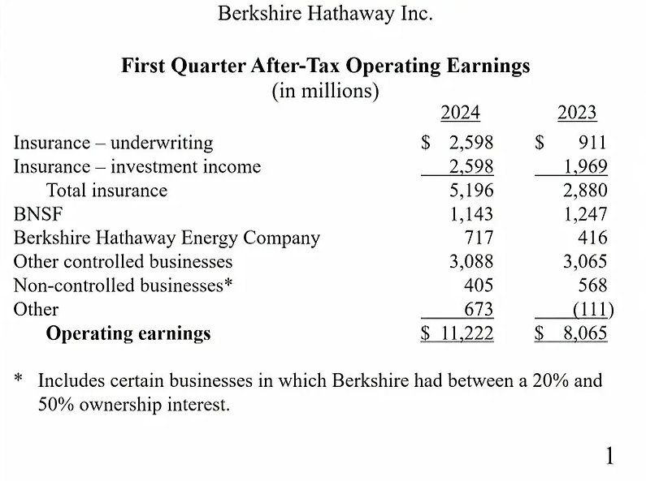
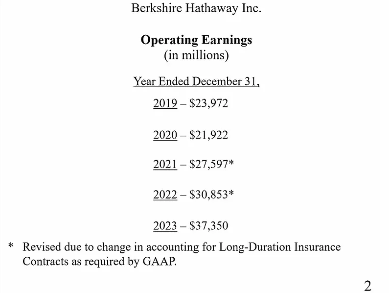
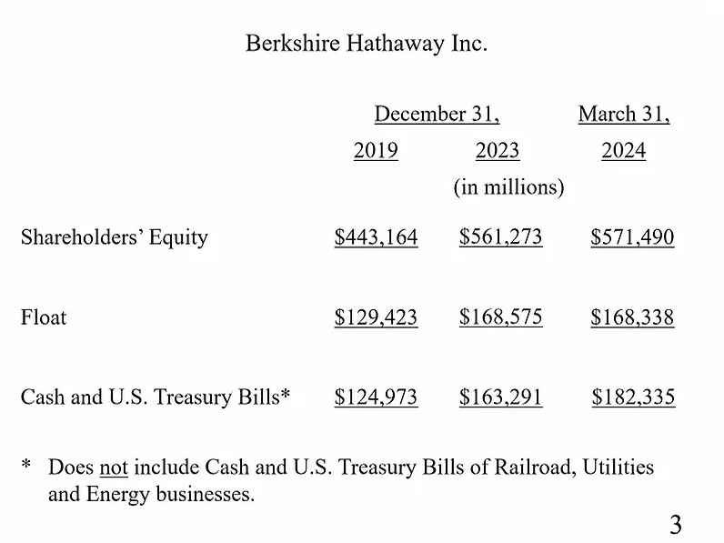
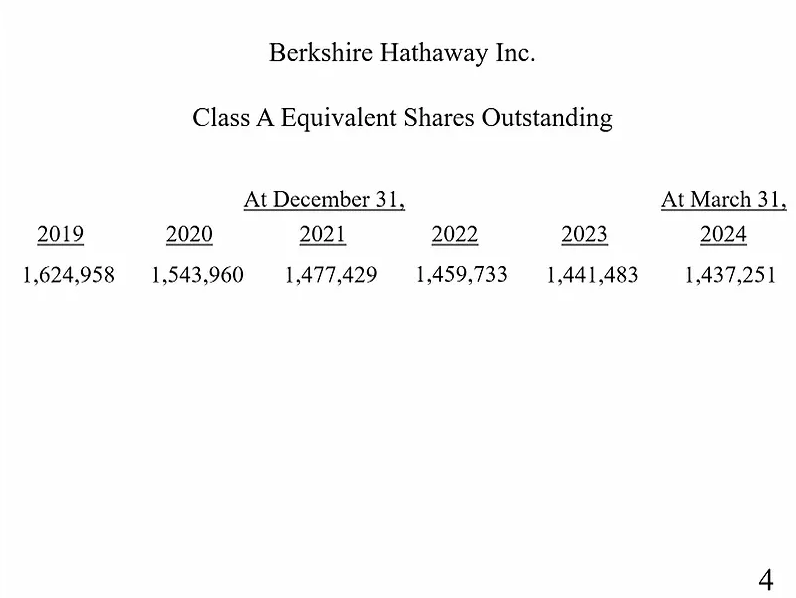

**上午场**

（现场播放了纪念查理·芒格的短片。）

**巴菲特：**&#x5927;家给查理的掌声太热烈了，给我们也留一些啊。出席本次股东大会的还有台上在座的格雷格·阿贝尔 (Greg Abel)、阿吉特·贾因 (Ajit Jain)。

台下就座的各位董事，在我念到您的名字时，请起立，介绍完所有董事之后，大家再坐下。按照姓名字母顺序，出席本次股东会的董事有：霍华德·巴菲特 (Howard Buffett)、苏茜·巴菲特 (Susie Buffett)、史蒂夫·伯克 (Steve Burke)、肯·切诺特 (Ken Chenault)、克里斯·戴维斯 (Chris Davis)、苏珊·德克尔 (Sue Decker)、夏洛特·盖曼 (Charlotte Guyman)、小汤姆·墨菲 (Tom Murphy Jr.)、罗恩·奥尔森 (Ron Olson)、沃利·韦茨 (Wally Weitz)、梅丽尔·威特默 (Meryl Witmer)。以上就是我们的全部董事。

在介绍第一季度业绩之前，我要特别感谢两个人。

首先，我要感谢梅利莎·夏皮罗 (Melissa Shapiro)，她是此次大会的组织者，她为筹办本次股东会付出了巨大的努力。

梅利莎告诉我，我们的喜诗糖果销售额再创新高。今年，我们准备了 6 吨喜诗糖果，应该会销售一空。还有一件事要告诉大家。今年，在 The Bookworm 书店，我们的书架上只有一本书。往年，我们一般挑选 25 本书，供大家选购。今年，我们的书架上只摆放了第四版的《穷查理宝典》(Poor Charlie’s Almanac)。昨天，《穷查理宝典》卖出了 2400 本。今年只准备了这一本书，是为了纪念查理，明年我们将恢复正常。

另一个要感谢的人，他为我们制作了开场前播放的短片。大家可以看到，在本年的纪念短片中，我们选了很多往年短片中的镜头。在我们的短片中，有多位好莱坞明星出场，也涉及若干电视剧中的桥段。往年，短片仅限会场播放。今年，我们则通过 CNBC 进行直播。为此，我们必须重新获得版权许可，其中涉及大量的联络协调工作。

几位参演《绝望主妇》的明星，还有杰米·李 (Jamie Lee)，为我们提供了大量帮助。涉及《绝望主妇》的桥段，我们需要获得迪士尼 (Disney) 的授权，这比较好办。我们还逐一联系了五位出演《绝望主妇》的女演员，分别获得了她们的许可。我要感谢的第二个人，他多年来一直为我们制作开场电影。请把追光灯对准布拉德·安德伍德 (Brad Underwood)，谢谢。

今天早晨 07:00 伯克希尔发布了第一季度的业绩。嗅觉敏锐的分析师和记者应该已经看过了，想问什么，已经心中有数了。我们先看第一张幻灯片。

我们讲过很多次了，在这里，我们看的是伯克希尔的经营利润。这个数字不受股市波动影响，没有大起大落，最能体现伯克希尔的经营情况。把资本利得算进去的话，在不同报告期之间，可能出现大赚大亏的波动。

我们和大家看的是伯克希尔的经营利润，没考虑股市涨跌的影响。总的来说，2024 年第一季度的业绩高于平均水平。阿吉特希望我给大家提个醒，今年一季度的保险业绩不错，但是我们不能把一季度的业绩乘以四，估算全年业绩。保险生意没这么稳。我们承保巨灾险。飓风是我们业绩的头号杀手。飓风总是在我们最不想看到的地方出现，造成巨大的破坏。

在保险业务中，评估飓风的风险是我们的一项重要工作。除了飓风，还有其它风险，例如，地震。一场地震，可能明天发生，也可能十年以后发生。伯克希尔也承接地震保险。一般来说，全年之中，保险生意一季度的业绩最好，三季度的业绩最差。在保险生意中，何时出险，谁都不知道。还好，今年一季度，保险生意风平浪静，承保利润同比大幅增长。

保险分部的投资收益增长，这再自然不过了。我在年报中说了，现在的利率比去年高很多。我们持有的大量固收类短期投资，对利率变化非常敏感。因此，我们一季度的投资收益大幅增长。预计保险分部的全年投资收益也将高于去年。我们用于投资的资金增加了，收益自然随之增长。稍后，我们再展开讲这个问题。所以说，投资收益将上升。

再看铁路分部。铁路的利润略微下降。按照现在的铁路运输情况，我们赚取的利润应该稍微多一些。利润的改善不能一蹴而就，但确实需要改善。铁路分部的利润与运输情况相关。

每周三，美国铁路协会发布上一周的铁路运量数据。谁闲着没事会订阅这个数据呢？我订了，每周都会看。从铁路行业运量数据来看，运输量略微下降，我们铁路分部的利润也随之略微下降。即使当前的装载量保持不变，我们的利润水平也应该比现在高一些。

再说能源分部，能源分部的利润比去年高。如同我在年报中所说，我们的能源分部受到了影响，我们的利润低于正常水平。稍后，我们再深入讨论这个问题。能源分部，去年的基数低，今年略有增长。总体来看，我们今年第一季度的经营利润为 112 亿美元，远高于去年同期。

伯克希尔每年的利润增长是正常现象。毕竟，我们把每年的利润留在伯克希尔。去年，我们留存了 370 亿美元。各位股东把 370 亿美元的利润留在伯克希尔，我们可动用的资金就增加了 370 亿美元，我们今年的利润自然要比去年高，这才对得起股东。伯克希尔追求的经济指标可以概括为两点：第一，提升经营利润；第二，减少流通股份数。说起来简单，做起来难。我们会继续努力。

请播放第二张幻灯片。

大家现在看到的是伯克希尔过去五年的经营利润。疫情之前的 2019 年，伯克希尔的经营利润将近 240 亿美元。疫情第一年，我们的经营利润下降。此后，我们一路上升，从 270 亿美元到 300 亿美元，再到 370 亿美元。这些数字是扣除了折旧摊销和所得税之后的净利润。

从这些数字中可以看出，一年 365 天，包括周末和节假日在内，伯克希尔可以配置的资金，每天增加 1 亿多美元。我们和大家讲过很多次，我们争取把这些资金配置好，这是我们的职责所在。

请看下一张幻灯片。

随着留存收益的增加，截止 2024 年 3 月 31 日，伯克希尔的净资产来到了 5710 亿美元。自从我们收购伯克希尔·哈撒韦以来，我们一直留存收益。只有一次例外，忘了是 1968 年，还是 1969 年了，董事会宣布每股派息 10 美分。决定派息的时候，我肯定不在场，可能去洗手间了，要不怎么可能有这次例外。我们一直把利润留下来，我们把股东的钱存在公司，一直在存钱，一直在投资。在投资中，我们犯过比较严重的错误，但从来没犯过致命的错误。我们也抓住了一些好机会。查理以前讲过，我们做过的 57 笔、58 笔投资中，真正起到关键性、决定性作用的就那么五六笔。一方面是抓住难得的大机会，另一方面是坚决不犯致命错误。我们将沿着这条路继续走下去。

日积月累，我们的净资产已经达到了 5710 亿美元。按照资产负债表中的净资产，我们已经稳居全球第一。第二和我们的差距有多大呢？去年年末，摩根大通 (JPMorgan Chase) 的净资产为 3270 亿美元，一季度，增加到了 3366 亿美元。与伯克希尔不同，摩根大通派息较高。摩根大通也回购股票。摩根大通的生意比较好，ROE 比伯克希尔高。摩根大通不像我们这样，把所有的利润都留下来。留或不留，各有各的道理，没有对错之分。

伯克希尔能取得今时今日的成就，靠的不是什么奇迹，而是持之以恒的储蓄。今天伯克希尔汇聚的股东群体，最早源于一批合伙人，他们希望长期储蓄，希望把钱交给我们打理。在开场前影片中出现的戴维斯夫妇一家，他们就是我们最早的合伙人之一，他们在伯克希尔的投资一直传承到他们的子辈和孙辈。我们的合伙人、我们的股东，有时候，他们也需要动用资金，但基本上始终把钱留给我们管理。

我们的股东通过伯克希尔进行储蓄。在长期储蓄的同时，我们的股东过着富足的生活。他们不是那种有了钱就炫富的人，住进宫殿一般的房子，让佣人前簇后拥。我不是想指责那些“炫富”的人，说他们做的有什么不对。我只是想说，我们的股东与伯克希尔气质相符，基本没有炫富的。那些炫富的，和我们不是一路人。我们的很多股东，他们用几十年的时间储蓄，积累了大量财富。最后，他们会把一辈子的积蓄用出去。我们的股东不是吝啬鬼，也不是守财奴。

我们储蓄，但我们也生活得很富足。是复利的威力，是长期储蓄的积累造就了巨额财富。在午休之前，我们将继续讲这个话题。我想通过一个具体的例子，告诉大家我们的股东拥有怎样的财富观。

言归正传，一季度末，我们的现金和短期国债为 1820 亿美元。二季度末，这个数字很可能接近 2000 亿美元。我们想把这些钱投出去，但必须有合适的机会才行。一个是风险必须非常低，另一个是能赚很多钱。

现在伯克希尔的股价水平，回购的话，并不能给股东创造什么价值。合适的话，我们愿意大笔回购。不是我们不愿意，而是我们买不到足够的量，没那么多人愿意卖。市场条件合适的话，我们会动用大笔资金回购。在最后一张幻灯片上，大家可以看到，在过去五年里，我们进行了回购。

很多公司的回购力度比我们大多了。我们也愿意大力回购，只是伯克希尔的交易量没那么大。伯克希尔的股东大多是投资者，也就是像你们在座各位这样的人，你们不但不愿意卖，可能还想买呢。你们中的很多人，根本不会隔三差五地看股价。天天盯着股价的人，赚不了几个钱。心中没有股价的人，才是长期赚大钱的人。

在伯克希尔，我们努力提升经营利润，价格合适的话，我们就进行回购。大机会不常见，希望真出现的时候，我们能把握住。伯克希尔势头良好，我们对伯克希尔充满信心。

我讲完了。下面进入提问时间。贝琪·奎克 (Becky Quick) 和现场观众轮流提问。

首先，有请贝琪。

# **问题 1**

**谢谢，沃伦。如您所说，伯克希尔一季报发布之后，引起了广泛关注。**

**从一季报中可以看出，在第一季度，伯克希尔又卖出了 1.15 亿股苹果的股票。苹果是伯克希尔的第一大持仓。我选的第一个问题与此相关。提问者为 Sherman Lamb，他来自马来西亚，今年 27 岁，持有伯克希尔·哈撒韦 B 类股。他是这么问的：去年，您提到了伯克希尔长期持有可口可乐、美国运通。在今年的股东信中，您又谈到了这两家公司的生意多么好。我发现，您好像没谈到苹果公司。2016 年，伯克希尔开始投资苹果。请问苹果的生意发生变化了吗？是否不像以前那么值得投资了？**

**巴菲特：**&#x4E0D;是。我们确实卖出了苹果的股票。这么说吧，我相信，在今年年末，在我们持有的股票中，苹果很有可能仍然占比最大。在别人眼中，股票是一种有价证券。在查理和我的眼中，我们看到的是股票背后的生意。

DQ 冰淇淋没有上市，伯克希尔拥有 DQ 冰淇淋。在我们眼中，DQ 冰淇淋是一个生意。可口可乐、美国运通是上市公司，伯克希尔持有这两家公司的股票。我们看可口可乐、美国运通，看的也是它们的生意。从生意的眼光考虑，我们在股市中能买到一流的好公司。我们没办法把好公司的股份全部买下来，想买 80%、90% 都买不到。

我们买了可口可乐、美国运通、苹果的股票。在我们眼中，我们买的是这些公司的生意。与直接拥有整个公司相比，通过买股票投资好生意，在税收、管理等方面存在很多差异。在进行资产配置的过程中，我们始终遵循买股票就是买公司的原则。我们不预测市场走势，也不猜测个股涨跌。

开始时，我走了很多弯路。我还是一个小孩的时候，就对股票很着迷。我如饥似渴地把市面上所有关于股票的书读了个遍。直到有一天，在内布拉斯加大学林肯分校 (University of Nebraska-Lincoln) 读书的时候，我偶然翻开了《聪明的投资者》(The Intelligent Investor)，读到了其中的几句话，我瞬间就悟了。书里写的比我说的好多了，大概意思是这样的：用买公司的眼光买股票，不能听市场的，不能被市场牵着鼻子走，而要自己掌握主动权，将市场为我所用。看 K 线、看移动平均线、听消息都不是正道。读到了这段话，我终于知道了怎么做才是对的。

多年来，我们配置资金的方式发生了变化。主要是我们的资金量越来越大，查理和我一直在研究怎么才能更好地进行配置。基本的投资原则始终没有改变，本·格雷厄姆早就在《聪明的投资者》中阐述的很清楚了。我花了几块钱，买了《聪明的投资者》，这本书告诉我，我以前一直在走弯路。从那以后，秉承格雷厄姆的理念，我走上了投资正途。后来，我遇到了查理。在他的启发下，基本的投资原则不变，但在具体应用方面，我达到了更高的境界。我认识到了买好生意的重要性。美国运通是好生意，伯克希尔将其收入囊中。可口可乐是好生意，伯克希尔将其收入囊中。苹果的生意比美国运通、可口可乐还要好，我们也将苹果收入囊中。没有极其特殊的情况，相信等到格雷格接班，伯克希尔将仍然持有苹果、美国运通和可口可乐。

我说的投资方法很简单，简单到说出来人们不相信。像数学了、物理了，可以一直往深了研究，越往深研究，探索到的新知识越多。投资则不然，投资没那么多新东西。做投资，关键在于思路要正。

将来，真出现了什么重大突发事件，我们有可能改变资本配置策略。一切正常的话，苹果将一直是我们最大的投资。卖出一些苹果的股票，是因为我想增加现金储备。对比摆在我们面前的各种选择，考虑到股市的估值，考虑到世界局势，我认为现在增加现金储备对我们有利。

我想再谈一点我的想法，可能和大家想的不一样。我发现我周围几乎所有人都琢磨怎么能少交税，这没什么不对的。伯克希尔则不同，我们心甘情愿地纳税。这次出售苹果股票，我们缴纳了 21% 的联邦企业所得税。2018 年之前，联邦企业所得税税率为 35%。伯克希尔早期，企业所得税一度高达 52%。在我们经营企业赚取的利润中，有联邦政府的一份。虽然联邦政府不是我们的股东，但是我们每年赚取的利润，都要分给联邦政府一份。具体分多少，政府说了算。

按照现行企业所得税税率，联邦政府分走 21%。依我之见，美国目前的财政政策无法持续，政府早晚要提高税收。政府必然要从你的收入中、我的收入中、伯克希尔的收入中多分走一些，政府有这个权力。将来什么时候，政府会发现，不能再让财政赤字这么高了，否则将导致严重后果。与此同时，政府又不愿大幅削减开支，那就很可能要求从我们赚取的利润中多分一些。政府让多交多少，我们就多交多少。

伯克希尔以多纳税为荣。美国是一块福地，它对我们的股东不薄。我能出生于美国是我的幸运。伯克希尔能诞生在美国是伯克希尔的幸运。去年，我们向联邦政府缴纳了 50 亿美元的税款。如果美国再有 800 家像伯克希尔这样的企业，那美国的所有人、所有公司都用不着交税了。无论是所得税、社保、遗产税，什么税都不用交了。

但愿伯克希尔基业长青，我们将来仍然是像现在一样的纳税大户，甚至再多交一些税。为国纳税，义不容辞。国家对你我不薄，我们依法纳税是应有之义。今年我卖了点苹果，交了 21% 的所得税。以后要是税率真涨了，大家回过头来想，可能就不怪我了。

好，下面请第 1 区提问。

***

# **问题 2**

**您好，巴菲特先生。我是来自中国香港的 Matthew Lai。感谢您向我们传授知识，给予我们指引。我的问题是这样的：您投资了新能源汽车公司比亚迪，请问在什么情况下，您会再次考虑投资香港的公司，投资中国的公司？谢谢。**

**巴菲特：**&#x6211;们的主要投资将始终在美国。我们的逻辑是这样的。

我们投资的美国公司，例如，美国运通，它在全世界做生意。还有可口可乐，它的产品遍布全球的每个角落。人们爱喝可口可乐。大概几年之前，在全球 200 多个国家和地区中，可口可乐就已经覆盖了 170 个、180 个左右。我想不出来，还有哪家公司的产品在全球范围内如此受欢迎。

美国运通的信用卡业务建立了强大的优势。我们的董事肯·切诺特为美国运通的发展做出了卓越贡献。在过去 20 年里，通过方方面面的努力，美国运通把信用卡业务的优势越做越大。所以说，我们将……

具体说到比亚迪这笔投资……

对了，五年前，我们投资了日本。那笔投资，机会非常好，特别有吸引力。我们赶紧进场扫货，花了一年时间，买入五家日本公司的股票，最后投入的资金只占我们投资组合的 1%、2% 而已。谁让我们规模这么大呢？

通过我们投资的公司，伯克希尔可以分享全球经济发展的红利。但是，伯克希尔不会在美国以外大笔投资。

主要是我熟悉美国，我知道美国的法律法规，美国有它的优点，也有它的缺点，是什么，我很清楚。对于世界上其它国家和地区，我就不像对美国那么了解。别的国家有别的国家的文化，文化障碍，我真跨越不了。好在这并不影响我做投资。美国很大，经济体量足够大。美国的发展堪称奇迹。建国初期，美国人口只占全世界的 0.5%。如今，美国的生产总值占全世界的 20%。我们将以美国为中心做投资。我们的大笔投资基本上会在美国进行。

查理和我搭档几十年，只有两次，查理告诉我，绝对是好机会，一定要买。一般情况下，查理听我的。每次我向查理讲完我找到的机会，他一般这么说：“这机会不算特别好，但估计你也找不到更好的了，那就它吧。”只有两次，查理主动提出他找到的机会，他坚决看好，力主买入。其中一个是比亚迪，另一个是开市客 (Costco)。在查理的督促下，我们买了开市客，也买了比亚迪。开市客买的比较少，比亚迪买的多一些。

当时，查理主张大胆地买。开市客，我买少了。不能说买少了就造成了多大损失，但查理真是火眼金睛，这两家公司，他看得非常准。

其实，大多数国家的股市如何，我一直关注着呢。但是，我们不太可能在美国以外的任何国家做大笔投资。也不是完全排除这个可能性，但基本上不太可能。伯克希尔投资了日本的几家公司，这笔投资我们将长期持有。将来，等格雷格接班了，我们将仍然持有对日本的投资，我们对这笔投资很满意。

伯克希尔不在美国以外大笔投资，主要是因为我们肩负着股东的重托。我们为股东管理资金，我们始终想着千万不能把股东的钱亏了。在美国投资，我们不太可能犯大错。去其它国家和地区投资，那就不敢保证了。

好的，贝琪，请提问。

***

# **问题 3**

**这个问题来自盐湖城的一位股东，Stanley Holmes。他的问题是：在 2024 年的股东信中，您指出，伯克希尔·哈撒韦能源 (Berkshire Hathaway Energy) 去年的业绩令人失望，您对公用事业行业的盈利能力和资产价值表示担忧。您谈到了，受气候变化影响，公用事业公司不得不承受额外开支，而监管政策仍不明朗。您认为有些地区倾向于由政府经营公用事业公司。目前，犹他州颁布了几项政策，有转为政府运营发展的趋势。**

**新政策规定，犹他州的发电厂所生产的电力只能由州政府独家购买，而且犹他州政府有权在发电厂关停之前，对发电厂进行收购。依据新的立法，犹他州政府有权优先收购电力和电厂，其中包括伯克希尔·哈撒韦能源下属的落基山电力公司 (Rocky Mountain Power)。考虑到将来可能被政府收购，伯克希尔·哈撒韦能源还会继续向公用事业公司投资吗？伯克希尔是否与犹他州政府进行了协商，电力公司真被收购的话，能否避免损失？**

**巴菲特：**&#x4E00;会儿，请格雷格回答这个问题。我先说一下我的想法。我认为，犹他州会公平地对待我们。我们在犹他州进行了投资，犹他州会允许我们赚取合理的收益。即使犹他州决定转由政府经营公用事业公司，也会公平合理地补偿我们。1930 年代，在内布拉斯加州参议员乔治·诺里斯 (George Norris) 的推动下，内布拉斯加州建立了由政府运营的电力体系。在爱荷华州，伯克希尔经营公用事业公司。我们的表现证明，与大多数州政府运营的电力公司相比，作为私营资本，我们能提供更高的效率。无论是政府运营，还是私人运营，公用事业公司都需要巨大的投资。政府如果选择私营模式，放眼美国，伯克希尔公司可能是最合适的候选者。

我们愿意投资公用事业公司，但是我们要求获得合理的收益率。我们不是说狮子大开口，要赚多少多少钱，我们只是要求合理的收益率。如果根本赚不到钱，那我们不做。在几个州，气候变化导致公用事业公司产生了额外开支，但这部分开支并没有得到认可。我相信，即使是政府经营公用事业公司，照样会产生此类开支。

公用事业关系到国计民生。在经营公用事业公司方面，伯克希尔资金雄厚、经验丰富。我们愿意为社会效力。但是，如果不赚钱，甚至亏损，那我们不可能继续投资。其实，我不太担心，一会就请格雷格详细讲讲他的看法。我相信犹他州政府对伯克希尔没有恶意，我相信犹他州政府会公平合理地对待公用事业公司。查理，你说呢？我怎么叫查理了呢，说顺嘴了。（笑声）

其实，已经好几次我要张口叫查理，都忍住了。口误，一时半会可能还改不过来。

**格雷格：**&#x5B8C;全可以理解，沃伦。沃伦，在股东信中，您讲到了公用事业公司面临的挑战。您刚才也说了，公用事业公司未来需要巨额投资。我想从这两方面出发，分析一下伯克希尔旗下的公用事业公司，特别是在犹他州经营的太平洋电力公司。

可以预见，伯克希尔旗下的公用事业公司，在不久的将来面临着电力需求的显著上升。为了满足急剧上升的电力需求，我们需要投入大量资金。正如您在股东信中所说，我们经营公用事业公司要投入大量资金。政府必须制定一套清晰明了的政策，让公用事业公司在政策的指导下为公众服务。犹他州也不例外，公用事业公司必须与政府的政策步调一致。以爱荷华州为例，伯克希尔在爱荷华州的投资规模很大，我们完全按照爱荷华州政府的政策和法律去投资，爱荷华州政府制定了清晰具体的法律法规，我们在法律框架内积极投资。爱荷华州的公用事业公司已经有 100 多年的历史了。

伯克希尔旗下的美国中部能源公司 (MidAmerican Energy) 在爱荷华州经营。随着 AI 的兴起、数据中心的增加，预计十年之后，爱荷华州的电力需求将翻倍。试想，用了 100 多年的时间走到今天，然后，在短短十年之内，将发电量翻倍。这需要美国中部能源公司的股东投入大量资金。这么大体量的投资，我们怎么能放心地去做？主要就是政府的政策要明确，给我们清晰的指引。我们再看内华达州，伯克希尔在内华达州经营两家公用事业公司，占据绝大部分市场份额。内华达州的电力需求上升速度更快，十年以后，预计发电量要达到现在的三倍，同样需要巨额投资。

伯克希尔能源分部的费率基数 (rate base) 已经很大了。为了应对电力需求的上升，我们可能需要再投入 60 亿美元到 100 亿美元的资金。要投入这么多资金，政府必须给予我们政策支持，保证我们能实现资本的保值和合理的收益。电力公司面临山火受害者索赔，已有先例。这次伯克希尔旗下的太平洋电力公司因山火导致亏损，引起了广泛关注。对于山火造成的损失，要我们承担多少？我们正在和相关方协商。让我们承担的部分是否合理，现在还未可知。关于山火索赔，现在要求我们赔偿的案子已经有很多起了。上周，我们刚收到通知，有一起追加诉讼，要求我们赔偿 300 亿美元，这可不是小数目。

首先，对于太平洋电力公司收到的所有起诉，我们将积极抗辩，坚决驳斥所有不合理的索赔。这个诉讼过程将持续很多年。其次，鉴于太平洋电力公司被告上法庭，遭受大量索赔，我们有必要改变我们的经营理念和经营方法。多年来，在各地政府的指导和监督下，我们始终把保证电力的持续供应作为重中之重。我们的团队、我们的员工，夜以继日的工作，克服飓风等恶劣天气的困难，始终致力于为千家万户持续稳定地供电。

2020 年的山火发生时，我们第一时间想到的不是断电，而是保持电力持续供应，确保医院、消防站正常工作。我们一直以保供为使命，当时就没想到要断电。从今以后，我们必须做出改变，不光是在太平洋电力公司，而是我们的所有公用事业公司。

现在，我们必须明白，在某些情况下，我们应该优先考虑断电。诚然，这是一种很大的转变，毕竟 100 多年来，我们始终以保供为最高目标。首先，从文化改起，不改不行。其次，在具体落实方面，我们已经改变了我们的运营机制，现在可以很快地切断电力供应。山火来袭，我们将关闭电力输送。等到安全了，再恢复供电。我们别无选择。第三，在防范山火风险方面，我们将加大投资。

再说回到犹他州以及太平洋电力公司，我们的太平洋电力公司陷入了困局。在诉讼缠身的同时，我们继续经营太平洋电力公司，现在赚到的利润全部用于再投资。

今后，我们是否追加投资，继续为公用事业做贡献，关键取决于各州政府在立法和监管方面能否做出一些改变。正如沃伦所说，不赚钱，甚至亏钱的话，我们不可能继续投资。我们将仔细权衡其中的利弊。实际上，无论在立法方面，还是监管方面，我们都能看到光明的因素。特别是在犹他州，犹他州的一些做法值得其它州借鉴。

如沃伦所说，只要公平合理，我们非常乐意在犹他州投资。太平洋电力公司的业务范围包括犹他州。犹他州的经营环境有利有弊，需要我们综合考虑。三月份，犹他州议会通过了一项法案，其中有几项规定令人鼓舞。

第一，该法案规定了“非经济损失”赔偿的上限。在 2020 年俄勒冈州山火引发的索赔中，有些原告遭受了实际的“经济损失”，要求得到经济补偿，这有合理之处。还有一些原告，对“非经济损失”提出索赔。俄勒冈州的法律明确规定，山火造成的“非经济损失”不予赔偿。然而，俄勒冈州的法院仍然判决公用事业公司赔偿大量“非经济损失”。诉讼仍在进行之中，犹他州颁布了法案，限制“非经济损失”的赔偿金额，这是一种积极的态度，定了一个很好的调子。

说到底，还是要看当地的营商环境。犹他州的营商环境可以，并不排斥私营公用事业公司。另外，犹他州还提出了，建立山火专项基金，专门用于赔偿山火造成的损失。犹他州的做法让我们眼前一亮，值得其它州借鉴学习。

伯克希尔·哈撒韦能源，具体而言，太平洋电力公司，都受到政策的影响。我们将密切关注政策动向，并审慎做出投资。相信太平洋电力公司能渡过难关。伯克希尔·哈撒韦能源、太平洋电力公司，既面临挑战，也有巨大的机遇。

**巴菲特：**&#x8FD1;些年来，公用事业公司的净资产收益率远低于美国的其它行业。公用事业公司的净资产收益率是一个比较稳定的数字，有些州略高一些，有些州略低一些。赚取比较稳定的收益，我们能接受。让我们破产，那就不合理了。我们投资的是股东的钱，我们不能拿股东的钱打水漂。

收益率在比较合理的范围内，略高一些，略低一些，我们都能接受。我们很清楚，公用事业公司的收益率与我们拥有的一些其它行业的公司没法比。拿净资产收益率来衡量，和可口可乐没法比，和美国运通没法比，和苹果更没法比了。公用事业这个行业决定了它的净资产收益率高不了。净资产收益率不高，但是比较稳，政府保证公用事业公司可以获得稳定的收益。

现在出现了一个变数，受气候变化影响，山火频发。山火造成的损失应当计为公用事业公司的成本。我们可以采取措施减少山火造成的损失。我们可以改变经营方式，该断电的时候就断电。这些都不成问题。关键在于，电力需求将增加，几百亿美元、上千亿美元的投资是必须的，这笔钱总要有人拿出来。应对气候变化的成本也要计算在内。政府投资可以，私营企业投资也行。让伯克希尔投资 1000 亿美元，我们也拿得出来。但不赚钱的话，我们是不会投的。

请第 4 区提问。

***

# ***问题 4***

**您好，我叫 Joe，来自旧金山。请问科技的发展，特别是生成式 AI 的诞生，将给传统行业带来怎样的影响？谢谢。**

**巴菲特：**&#x8FD9;次该第 2 区，我说错了，叫了第 4 区，一会再请第 2 区提问。

我知道 AI 现在很火，也知道 AI 的意义重大，但是我无法判断 AI 对未来的影响。去年，我讲了，二战时，美国人发明原子弹，把妖怪从瓶子里放了出来。幸好，过去几十年，这个妖怪没带来灾难。原子弹的破坏力让我惊恐忧虑。生米已经煮成熟饭，我真不知道如何消除原子弹的风险。我认为，AI 与原子弹有类似之处。

现在 AI 已经冒出头来了，必将产生重大的影响，早晚有人能发明出威力强大的 AI。将来，我们可能追悔莫及，也可能从 AI 的发展中受益。到底会怎样，我没能力判断。二战时，美国有必要研制 2 万吨 TNT 当量的原子弹吗？原子弹的问世，对人类的子孙后代有益吗？让我做这个决定的话，我不知道该怎么选择。在曼哈顿计划中，物理学家爱德华·泰勒 (Edward Teller) 发挥的作用不亚于爱因斯坦。在论证过程中，泰勒说，原子弹爆炸的过程可能引爆大气中的氮，将人类文明完全摧毁。最终，美国决定把妖怪从瓶子中放出来，眼前的问题得到了解决，未来如何，没人知道。

关于 AI，我遇到过这样一件事，让我对 AI 更担忧了。前不久，在我面前的屏幕上，我看到了我自己，长得和我一样，声音和我一样，穿的衣服也和我的一样。我的妻子和女儿都看不出来屏幕中的人和我本人有什么区别。屏幕中的巴菲特说的话，根本不是我说的。

AI 很可能成为电信诈骗的工具。它生成的视频让人真假难辨。比如说，有人给我发过来一段视频说，我是你女儿，刚出了车祸，需要 5 万美元，赶快打给我。在美国，电信诈骗一直相当活跃。我看有了 AI 的加持，电信诈骗行业倒是可能成为一个高成长的行业。

AI 也有好的一面。我对 AI 不了解。就拿前不久我看到的那个视频来说，遇到类似的诈骗，我可能真会把钱汇到国外去。原子弹的难题，还没答案，AI 的难题，我更不知道如何解决。我对 AI 一无所知。我知道有利有弊，但我不知道未来如何演化。贝琪，提醒你一下，阿吉特只参加上午场。有关于保险的问题，可以现在就问。

***

# **问题 5**

**好。这个问题请沃伦和阿吉特回答。提问者是 Ben Noll，来自明尼阿波里斯，1995 年的伯克希尔股东。问题是这样的：在去年的一次采访中，托德·康姆斯 (Todd Combs) 表示，2010 年刚加入伯克希尔时，他对您说过，盖可保险 (GEICO) 以营销和品牌见长，而前进保险 (Progressive) 在数据分析方面更胜一筹，从长期来看，数据占优者将从竞争中胜出。然而，过了十年，您才在盖可保险推动数据分析，并任命托德负责此项工作。**

**像盖可保险这样的公司，经过几十年的发展，可能有需要转型的时候，而伯克希尔一直采取放手的管理方式，这样的话，是否容易延误转型的时机？请问您后来怎么发现的盖可保险需要转型？如果旗下的子公司需要转型，伯克希尔的首席执行官能及时发现吗？另外，请阿吉特为我们讲讲，盖可在数据分析方面的短板弥补的如何了。**

**巴菲特：**&#x963F;吉特，你先回答啊？

**阿吉特：**&#x597D;的。沃伦以前讲过，在匹配费率和风险方面，在风险分级和产品定价方面，盖可保险没有竞争对手做得好。这个问题存在好几年了，我们一直在努力追赶。我们知道，我们在科技的应用方面存在不足，我们也清楚地看到了自己的进步。

我们聘请了擅长数据分析和风险定价的人才，提升了我们在数据处理方面的能力。确实，我们仍然落后于竞争对手，但我们已经采取了实际行动缩小差距。预计到 2025 年末，我们将与竞争对手并驾齐驱，在数据分析方面跻身行业一流，在定价、赔偿等影响保险生意的方方面面实现提升。

**巴菲特：**&#x6211;补充几句。在保险生意中，无论什么险种，评估风险与费率都至关重要。这是保险生意的核心。我们做保险生意，就是要分析费率是否合适，概率是否站在我们一边，承担了风险，能否赚取一些利润。有的保单，亏损的风险很小；有的保单，亏损的风险极大。

就盖可保险而言，我们的竞争对手前进保险暂时领先。盖可保险的核心优势在于，我们在整个行业中成本最低。我们的成本优势无人能及。经过长期努力，我们已经把承保费用率 (underwriting expense ratio) 压到了 10% 以下。全行业中，能做到我们这个水平的，寥寥无几。我们在数据分析上需要加强，但这个问题没那么严重。数据分析方面的欠缺，根本不至于影响盖可的生存，甚至都不怎么影响盖可的利润。

当然了，我们一直在努力争取增加市场份额。我们的保单持有人数没有减少。截止三月份，我们拥有 1600 万保单持有人。盖可保险的经营成本全行业最低。问题没那么严重，盖可保险活得很好，利润水平也很好。盖可保险拥有保险行业的最佳商业模式，它的成本最低，我们将继续发挥盖可保险的优势，把盖可做大做强。

1936 年，利奥·古德温 (Leo Goodwin) 创建盖可保险的时候，它还只是一家名不见经传的小公司。但是，从创立的第一天起，盖可保险就确立了优秀的商业模式，并且一直持续到现在。简单说，车险是每个人必须买的，只要你提供的产品足够好，而且比别家便宜，大家就会买你的。

另外，车险是一个庞大的市场，其中蕴藏着巨大的商机。盖可保险拥有良好的商业模式，它的优势在于成本最低。在匹配风险和费率方面，我们确实需要改进。但是，盖可保险通过低成本积聚了巨大的优势，即使在匹配风险和费率方面略有短板，也并不影响我们的发展，而且我们有充足的时间去弥补不足。目前，托德还在做这方面的工作，他投入了大量精力，取得了明显的成果。与此同时，盖可保险并没有停下发展的脚步。在车险行业中，就承保利润而言，盖可保险理应位列翘楚。

好的，刚才落了第 2 区，现在请第 2 区提问。

***

# ***问题 6***

**您好。我叫 Sebastian Sartre，来自德国慕尼黑。在德国，伯克希尔是一家令人尊重的公司。我想问您一下，现在您最信任的人是谁？是泰德和托德吗？是格雷格和阿吉特吗？还是您的妻子，或者您的子女？您信任的人为何能得到您的信任？谢谢。**

**巴菲特：**&#x90A3;得看是在什么方面，是在投资方面，还是生活方面。我百分百信任我的子女和妻子，但是我不会和他们讨论买哪只股票。

在投资方面，我和查理聊了几十年。我也和别人谈投资，但与查理谈的最多，我们之间最有共鸣。与别人交流探讨只是一方面，一笔投资，我自己没主见的话，我肯定不会做。可以这么说，在投资上，我自己和自己谈。

我的子女，他们随着年纪增长，越来越成熟稳重。在很多事上，我听他们的。

例如，在奥马哈本地的选举中该选谁，我听我女儿的，她比我更了解候选人的情况。在很多事上，我听我妻子的。具体是哪些事，我就不说了。（笑声）

人活着，要让自己的身边都是自己信任的人，只和自己信任的人打交道，这才能过得好。我很早就明白了这个道理。从我二十多岁起，我身边一直都是我信任的人。偶尔也有看走眼的时候，不值得信任的人，我慢慢就把他们忘掉了。吃一堑，长一智。刚认识查理，我就看出来了他值得我信任，不只是在投资上，而是方方面面。

我和查理合作这么多年，他从没说过谎，他甚至不屑于为了自己得利，而隐瞒或扭曲一丝一毫的事实。查理从不说谎，是因为他极其看重诚实这种品质。查理太诚实了，也有给自己带来麻烦的时候。例如，在宴会上，他对邻座的女士说，你今天的发型没以前的好看，没对面的那位女士的发型好看。

作为一个合伙人，查理真是无可挑剔。我和查理交往这么多年，他从来没有为一己之私而说假话的时候。总之，遇到值得信任的人，要珍惜；遇到不值得信任的人，就远离。

好的，贝琪，下个问题。

***

# **问题 7**

**这个问题请教阿吉特。提问者是 Meher Barucha。气候变化对保险行业的影响巨大。山火频发、洪水泛滥，赔偿金额增加，很多大型保险公司甚至退出了加州等地。请问阿吉特先生，保险公司是否会从更多的州退出？在气候变化的大背景下，保险行业的投资价值是否大不如前？**

**阿吉特：**&#x8FD1;年来，在保险行业，气候变化、气候风险确实引发了广泛关注。我们受的影响比较小，特别是我们的再保险业务，因为我们承保的大多数合同，我们只签一年期限的。一年之后，保单期限到了，我们可以重新定价。价格不合适的话，可以拒绝续签。每次只签一年期限的保单，我们这才能把这个生意做得长一些，要不真做不下去。

气候变化加剧，保单价格必然要提上来。具体提多少，很难说出一个准确的数字，但肯定要大幅度提高。我们一直在涨价，希望通过提价来覆盖日益严重的风险。然而，有时候我们仍然会亏损。

监管机构对我们要求很严：有些地区，我们想退出，不让退；有些产品，我们想提价，不让提。很多保险公司，包括我们在内，已经决定不在某些州接受新业务。在我看来，监管机构逐渐认清了现实。他们意识到了，保险公司投入资金，理应获得公允合理的收益。监管机构与保险公司之间始终在拉锯博弈。前几年，监管机构处于上风。最近，保险公司扳回一城。从最新披露的年报来看，保险公司的业绩普遍创出新高。

气候变化加剧、山火频发、洪水泛滥，保险行业的利润不可能一直这么高，这个势头再保持几个月，应该不成问题。

**巴菲特：**&#x6C14;候变化导致风险增加，也让我们的保险业务越做越大。关键在于我们把保单价格估算准了，估不准，不但做不大，还会破产。另外，我们提供的大多数保单，只签一年期限。

让阿吉特估算保单价格，我最放心。1000 个精算师或者 1000 个高管加起来，也顶不上一个阿吉特。

来自大西洋的飓风给我们造成的损失最大，我们就以大西洋飓风为例。我们可以测量大西洋海水的温度，研究海水温度上升与飓风之间的关系。问题在于，很难得出什么有用的结论。海水温度上升，飓风的风速、路径、强度、频率都有可能发生变化。总之，我们只签一年期限的保单，由阿吉特来评估风险。五年之后、十年之后会怎样，我不需要做出判断。

很多人纷纷发表他们对气候变化的见解，但是他们不懂保险生意的思维方式，他们讲的东西对我们没什么用。我们每年收到很多关于气候变化的信，写信的人智商肯定很高，他们对气候变化的看法未必不对，但是他们不懂保险生意。我根本不去研究气候变化。没有风险，就没有保险生意。保险生意是评估风险的生意，我们评估气候变化带来的风险，每次只签一年。有的风险，我们无法评估，因为需要判断在未来很长的时间里会发生什么。这种情况，我们不做。

总之，用不着大费周章地研究洋流温度。有一个擅长评估风险的人，就足够了。在伯克希尔，我们有阿吉特坐镇。

**阿吉特：我想补充一句。气候变化与通货膨胀有类似之处，它是一把双刃剑，用得好，可以推动保险业务发展壮大。**

**巴菲特：**&#x6CA1;错。以盖可保险为例，1950 年，盖可有 175,000 份保单，每份车险的价格为 40 美元，保费收入规模为 700 万美元。

现在，每份车险的价格涨到了 2,000 多美元。科技在进步，社会在发展，如果我们的保单没法提价，只能停留在 40 美元，那么我们的生意肯定做不下去。汽车更安全了，事故少了，但汽车也更复杂了，修起来更贵了。在通货膨胀等各方面因素的综合影响之下，我们有能力提高保单价格。

从我最初接触盖可保险到现在，它的保费规模从区区 700 万美元增长到 400 亿美元。没有通货膨胀，盖可保险也不会有现在 400 亿美元的规模。

好的，现在恢复正常提问顺序，该第 3 区了。

***

# **问题 8**

**大家好。沃伦，您好。我叫 Liam，今年 27 岁，来自加拿大安大略省 Newmark。**

**在我父亲的带领下，我投资了伯克希尔。今天，我是和我父亲一起来的。参加此次股东大会，我感到很兴奋。对于大多数 27 岁的年轻人来说，他们崇拜说唱歌手。我不一样，我追的星是沃伦、查理。去年真是多事之秋，查理离开了我们，您的表弟吉米·巴菲特也走了。我和格雷格一样，也是加拿大人。我对加拿大的经济比较关心，我想知道您对加拿大经济的看法。现在有几家加拿大银行的股价很低，不知道您是否感兴趣。**

**另外，您已经 90 多岁了，我听说您还吃麦当劳呢，这是真的吗？我也喜欢吃麦当劳。您 93 的高龄，还能吃麦当劳、喝可口可乐，我很佩服。我的问题讲完了。谢谢，沃伦。**

**巴菲特：**&#x683C;雷格是加拿大人，第一个问题，一会儿请格雷格回答。

至于我吃什么、喝什么，你看我前面放的这是什么\[喜诗花生糖]，你就知道了。（笑声）格雷格，你回答吧。

**格雷格：**&#x597D;的。伯克希尔旗下的很多子公司在加拿大开展业务。另外，如沃伦所说，我们的很多生意遍布全球，其中包括加拿大。伯克希尔已经在加拿大有不少投资，我们也一直在寻找继续投资加拿大的机会。加拿大的营商环境，我们很放心。刚才沃伦讲了，我们非常熟悉美国、熟悉美国的营商环境。在这方面，加拿大与美国类似，我们也熟悉加拿大、熟悉加拿大的营商环境。就经济发展而言，加拿大的经济基本与美国同步。

伯克希尔的一些子公司，在美国和加拿大都有业务，从按地区划分的经营数据来看，差异不是很大。以能源分部为例，我们在阿尔伯塔省 (Alberta) 投入了大量资金建设风电项目。我们在加拿大的投资，基本与加拿大的经济发展同步，基本与美国的业务发展同步。沃伦，您有补充的吗？

**巴菲特：**&#x52A0;拿大的经济体量没有美国这么大，加拿大的大公司比较少。有合适的机会，我们愿意在加拿大投资。前几天，我还看了一家加拿大的公司，也让格雷格看了。只要规模足够大，我们感兴趣，而且符合我们的投资条件，我们可以毫不犹豫地在加拿大做出大笔投资。

伯克希尔可以发挥所长，为加拿大的发展做出贡献。几年前，有一家加拿大的公司陷入了困境。我记得，30 多个相关方谈来谈去，犹豫不决。这家公司遇到了难题，被逼到了破产的边缘，但它的基本面良好。我们派泰德·韦施勒 (Ted Weschler) 去走了一趟。

大概是星期一，我听说了这家公司遇到问题。泰德·韦施勒去了一趟，只用了两三天时间，我们就拿出了解决方案，把这家濒临破产的公司救了回来。在加拿大投资，我们没有丝毫顾虑。刚才也说了，我们现在正在研究一家加拿大的公司。只要满足我们的条件，我们能获得公平合理的收益，我们愿意投资。

很多国家，我们真不了解。加拿大则不然，对于加拿大，我们不存在文化障碍。加拿大的经济体量不如美国，但也是一个很大的经济体，我们在加拿大投资很放心。

好的，贝琪。

***

# ***问题 9***

**沃伦，您刚才讲了，1000 个精算师或者 1000 个高管加起来，也顶不上一个阿吉特。**

**俄克拉荷马州塔尔萨的 Mark Blackley 提了一个相关的问题。他问道：巴菲特先生，多年来，您一直表示，阿吉特对伯克希尔居功至伟。您开玩笑说，如果您和阿吉特同时落水，只能救上一个人来，一定要救阿吉特。伯克希尔的下一任首席执行官是谁，大家问过很多次了，但是谁来接阿吉特的班，却很少有人提及。像阿吉特这样的人才寥若晨星，伯克希尔的保险业务未来将何去何从？关于这个问题，我也想请阿吉特亲自回答一下。**

**巴菲特：**&#x53EF;以肯定地告诉大家，我们找不到第二个阿吉特。好在阿吉特比我年轻多了，我还健在呢，大家还用不着那么担心阿吉特。

我们找不到第二个阿吉特了，但是阿吉特为我们打造了强大的保险业务。如今，在某些方面，我们的保险业务甚至令竞争对手望而生畏。我们的保险业务已经建立了独特的优势，竞争对手根本无法复制。阿吉特已经把他对保险生意的独特领悟注入了伯克希尔，形成了一套固定的机制体制。在领导伯克希尔保险业务的过程中，阿吉特很注重建立和完善制度。现在，阿吉特仍然在领导伯克希尔的保险业务，而且制度也建好了。

1986 年，阿吉特加入伯克希尔，那时，我们的保险业务微不足道。经过他几十年的努力，现在我们的保险业务已经成为行业巨擘。

保险业务是伯克希尔最重要的生意。投资业务也很重要，投资业务是一个引擎，保险业务是另一个引擎。

全靠阿吉特，我们的保险业务才有今天的成就。将来，阿吉特不在了，我们的保险生意仍然会是好生意，但肯定比阿吉特在的时候要逊色。

1986 年，阿吉特加入伯克希尔之前，我已经接触保险生意有一段时间了。1950 年，我初次拜访盖可保险。1957 年，我们买入了国民赔偿公司 (National Indemnity)。我们投资保险公司赚了不少钱，但是我们不懂如何经营保险公司，我们需要一个像阿吉特这样的人。

那是一个星期六，阿吉特来到了伯克希尔。他觉得之前的工作没什么挑战性。我对他说，我们这份工作非常有挑战性。我问他：“有保险行业的经验吗？”他说：“没有。”我说：“没关系，以后保险生意就交给你管了。”从那以后，伯克希尔的保险业务蒸蒸日上。（掌声）

**阿吉特：**&#x8C22;谢你，沃伦。谢谢各位。实际上，没有谁是无法取代的。今天，蒂姆·库克 (Tim Cook) 也来到了现场。我想，库克就充分地证明了继任者一样能做得非常出色。

**巴菲特：**&#x6709;道理。

**阿吉特：**&#x53E6;外，伯克希尔的董事会非常重视接班人的问题，不只是谁来接沃伦的班，也包括谁来接我的班。每年，董事会都安排我参加一次专门的会议，询问我关于接班的问题，让我告诉他们，如果我遭遇不测，无法继续履职，如何保证继续正常经营。

我们讨论多个解决方案。我给他们列出一份接班人候选名单，并介绍每个人的特点。另外，我还会具体指定一位接班人，如果我发生了意外，可以让这个人立即接班。当然了，我们只是在准备和安排，并没有定下来。大家可以放心，我们非常重视这个问题。

就像蒂姆·库克做的非常出色一样，终于有一天，大家会发现，接班的问题完全用不着担心。离了谁，地球都照样转。

**巴菲特：**&#x6211;们相信，我们能解决好接班的问题。阿吉特回答得很好，但我们知道，阿吉特只有一个。请第 5 区提问。

***

# ***问题 10***

**您好，我叫 Andrew Nickes。我想知道，如果您能再与查理共度一天，您会做些什么？（掌声）**

**巴菲特：**&#x5176;实，查理去世前，我和他一起待了一段时间，不到一天，但确实见面了。

我们俩的生活方式一样，我们每天都做自己喜欢的事。查理活到老，学到老。我在开场前的短片中提到了，查理的兴趣非常广泛。他比较“博”，我比较“钻”，我们各有所长，但多年来，我们一直相处的很融洽。我们一起打高尔夫球、打网球，一起度过了很多快乐的时光。

我们一起赚钱，有时候，我们找到的一个好机会，让我们在以后十多年的时间里躺着赚钱，我们能不高兴吗？我们一起患难，甚至可以说，患难更让我们体会到友谊的宝贵。在我们齐心协力克服困难的过程中，我们更加亲密无间。那种感觉，就好像在战场上兄弟之间形成的过命的交情。

查理的生活方式，大家知道。他说过，除了年轻当兵的时候，必须得训练，他从来不刻意锻炼身体。他也从来不认为这不能吃、那不能吃的。然而，他竟然活到了 99.9 岁。一个比他生活方式更健康的人，未必比他活的时间长。

我和查理有不同之处，他的兴趣比我广泛，但是我们之间的信任那是铁打的。如果我和他能再次度过一天的时间，我们可能还是像从前一样。其实，不知道最后一天来临更好一些，不知道自己哪天会死去更好一些。

查理经常讲，他想知道自己可能死在哪，这样他就知道不去那些地方了。其实，在精神世界中，查理走遍了世界的每个角落。99 岁高龄的查理，仍然关注着世界，而世界也关注着查理。

很少有人能像查理这样，在自己的晚年达到人生的巅峰。查理，一位 99 岁的老人，登门拜访求教者络绎不绝，北六月街 351 号 (351 North June Street) 门庭若市。人们排着队要见查理，其中包括埃隆·马斯克 (Elon Musk) 等名人。

大家都想找查理请教，而查理也乐于分享他的智慧。查理并不信奉佛教，但晚年的查理犹如一位高僧大德，得了大自在，一言一行，了无滞碍。我乐于传经布道，查理也乐于传经布道。

我刚才讲了，我们搭档这么多年，从来没红过脸。以前，打长途电话很贵，但我和查理天天打，一聊就聊个没完。近些年，我们打电话不像以前那么频了。不过，我们活到老学到老的劲头丝毫不减。几十年来，经过无数次成败的历练，我们的智慧与日俱增。我们相互砥砺、共同进益，一个 99 岁，一个 93 岁，仍然对世界充满好奇。

说来说去，我没法具体告诉你我会做哪些事，只能给你一个大致的回答。

在以前的股东会上，有人问我或者查理，如果能和过去 2000 年里的一个人共进午餐，我们会选择谁。查理的回答是，“我想见的人，我全都见过了。”查理博览群书。用不着约饭那么麻烦，一本书读完，他就和本·富兰克林相谈甚欢。查理就是这么倜傥不群。

他说过，他想见的人都见过了，书里都有。他最欣赏本·富兰克林。想见本·富兰克林，查理读他的书就行了，用不着亲自见到本人。

把这个问题换个问法，可能更有意义。你可以问自己，如果你的生命只剩一天，你希望谁来陪你度过。回答完这个问题，想好了这个人是谁，就尽快和他/她在一起，也许从明天就开始，多和他/她在一起，为什么非要等到最后一天呢？别把生命浪费在不值得的人身上。（掌声）

好的，贝琪，下一问题。

***

# ***问题 11***

**这个问题来自瑞士的 Carol de Gend，请巴菲特先生和阿吉特先生回答。如今世界动荡不安，多地发生武装冲突，贸易战频发，网络攻击的风险也日益加剧。请问你们如何看待网络安全保险业务？针对零售业、中小企业、大型企业，包括发电厂、港口、机场、核电厂等大型基础设施，开展网络安全保险业务是否有利可图？面临哪些困难？**

**阿吉特：**&#x597D;的，我先答一下。近年来，网络安全保险业务很流行。经过几年的发展，现在这块业务的全球规模已经不低于 100 亿美元，利润率也非常可观。我估计，在总保费中，至少有 20% 作为利润进了保险公司的口袋。

尽管如此，在网络安全保险业务方面，伯克希尔的态度慎之又慎。原因有两点：第一，一次大型网络安全风险爆发，可能造成的损失总量有多大，我们难以判断。网络攻击可能引发聚合风险，例如，云服务中断可能导致风险集中爆发，触发巨额损失。损失的上限难以估计，所以我们心怀畏惧。第二，承保网络安全风险，我们的损失成本是多少，也很难估量。不只是单一案例造成的损失，而是所有案例加起来可能造成的损失。最近四五年，保额损失率很低，大概不到 40%，保险公司赚到了保费中的很大一部分。近期的利润虽高，但是从现有数据中，无法确切知道损失成本到底是多少。

在我们保险分部，我告诉我们的员工，最好别接网络安全保险。如果客户提出了这方面的要求，不能不满足，那就要慎之又慎。我告诉我们的员工，接网络安全的单子，不管你把保费定多高，你都要告诉自己，这个单子是亏钱的。

首先把基准定好，亏钱是肯定的，区别只在于亏多亏少。这是我们做网络安全保险业务的出发点。大家都觉得，网络安全保险是一块很大的蛋糕。我觉得，有可能做得很大，也有可能引发巨亏。

由于尚未掌握可靠的数据，对于网络安全保险，我们持保留态度。

**巴菲特：**&#x542C;完阿吉特讲的这一番话，大家应该明白阿吉特有多难得了。做保险业务，必须首先清楚损失成本是多少。我第一次深刻认识到这个问题是在 1968 年。那年，先是马丁·路德·金 (Martin Luther King) 遇刺，美国多座城市陷入骚乱。一波未平一波又起，接着罗伯特·肯尼迪(Robert Kennedy) 遇刺，又引发了大规模的骚乱。

就每一笔保单而言，都设有赔偿上限。问题在于，每一笔保单的风险是孤立的吗？一位公众人物在一座城市被暗杀，全国几千家企业被迫中断经营。如果这几千家企业在一家保险公司买了保险，这家保险公司在接每笔业务的时候，以为每笔风险是孤立的，没想到却一下子集中爆发了。这种风险在网络安全业务中尤其难以判断。假设一家保险公司，为每笔保单设置了 100 万美元的赔偿上限。如果真是孤立事件，出险了，赔偿 100 万美元是赔得起的。怕就怕风险集中爆发，原以为孤立的风险聚合到一起，1000 笔类似的保单同时出险，而法院判决保险公司赔偿所有损失。

在这种情况下，保险公司忽视了聚合风险，把保单价格定得太低了，可能直接陷入破产。我很清楚，在保险行业，只要单子好签，总会有很多人趋之若鹜。网络安全保险很好签，签的单子越多，收到的保费越多。每签一单，就能得到提成，保险代理人何乐而不为。

所以说，保险公司的高层必须严格把关。否则的话，你以为自己接的大量保单都有风险上限，以为它们之间没有关联，一旦风险集中爆发，就傻眼了，造成的损失可能比一场地震还大。就网络安全保险而言，大多数保险公司和它们的代理人怎么可能放着眼前的钱不赚，这是人性使然。查理一定会说，“彼之蜜糖，我之砒霜。”

下一问题，第 6 区。

***

# **问题 12**

**您好。我的问题请沃伦·巴菲特和格雷格·阿贝尔回答。我叫 Maria Preenas，来自内华达州拉斯维加斯。我代表内华达州的一个拉美裔环保组织出席此次会议。**

**我想在此为内华达州众多的拉美裔家庭表达诉求。我们承受不起高昂的电费，我们希望能用上便宜的清洁能源。在内华达州，伯克希尔·哈撒韦旗下的 NV 能源公司 (NV Energy) 正在建设天然气发电厂。内华达州的光照充足，我想知道，你们为什么不建设太阳能发电厂？伯克希尔的管理层能否对削减化石燃料提高重视？谢谢。**

**巴菲特：**&#x8C22;谢你的提问，Maria。格雷格，你来回答啊？

**格雷格：**&#x597D;。谢谢。前面讲到伯克希尔能源时，我们说了，内华达州的电力需求上升很快，我们将在内华达州进行大笔投资。

太阳能是 NV 能源公司很重要的一个电力来源，我们将继续在内华达州投资包括太阳能在内的多种发电方式。目前，能源行业正处于转型阶段，从化石能源逐步过渡到可再生能源，这个转型过程不可能一蹴而就，需要很多年才能完成。光电和风电等新能源具有“间歇性”的特点，储能是解决这个问题的关键。目前，技术还不够成熟，我们无法完全摆脱对化石能源的依赖。

明年，我们将在内华达州关闭我们的最后两座火电厂，以一座天然气发电厂取而代之，在转型的同时保证可靠稳定的电力供应。建设天然气发电厂，是出于保供的考虑，得到了内华达州监管部门的授权和许可。

我们积极投资新能源。在爱荷华州，我们甚至有发电量 100% 来自的风能的时候。我记得，地球日那天，我们就达到了这个目标。爱荷华州的风力资源丰富，足以满足该州的电力需求。但是，当风力减弱的时候，我们需要天然气发电顶上来。这就是为什么我们要在内华达州建设天然气发电厂。我们将继续向新能源转型，无论是内华达州的太阳能，还是其它州的风能，与储能技术结合起来，都能做出巨大贡献。与此同时，在未来的很长一段时间里，天然气发电厂仍然必不可少，保证电力的稳定供应，并将电费维持在较低的水平。谢谢你的提问。

**巴菲特：**&#x4F2F;克希尔有足够的财力，支持内华达州向新能源转型。

各州有各州的监管机构，在向新能源转型方面，各州有各州的做法。公用事业行业规模庞大，在转型的同时必须保证电力的稳定供应。Maria，我觉得你想要的，也是监管机构追求的。但是，太阳能存在“间歇性”问题，不可能一下子全换成太阳能。一方面是向新能源转型，另一方面是保供，二者必须兼顾。

太阳能还无法作为主要电力来源，特别是储能的问题还没解决。对于这方面，格雷格比我更了解。是这样吧，格雷格？

**格雷格：**&#x60A8;说得对。目前，比较经济的电池可以储能四小时。

考虑到整个夜晚都没有光照，四个小时显然不够。现在的技术进步很快，只要投入资金，可以做到储存更长时间。问题在于，即使技术上能实现，成本太高也不行。电费高了，公众接受不了。所以说，这里有个平衡的问题。

**巴菲特：**&#x6211;的朋友比尔·盖茨，他投资了储能电池项目，正在研究如何延长储能时间。

现在，很多一流的人才在研究这个问题，只是不可能一夜之间就取得突破。很多人希望一夜之间变成现实，这种心情我很理解。向新能源转型，需要大量资金，需要大量人才，需要比尔和格雷格这样的人。我是不行，我连电灯怎么亮的都弄不明白。我不行，没关系，有人行。现在很多人在朝这个方向努力。伯克希尔财力雄厚，等技术成熟了，我们可以出钱投资。

总之，有些事需要时间。有个比喻很形象，我以前讲过。我女儿说不得体，不让我讲。一个女人十个月生一个娃，那是不是十个女人一个月就能生一个娃？不是你想一个月生出来，就能一个月生出来的，万事万物的发展有其自身的规律和节奏。

贝琪，下一问题。

***

# **问题 13**

**这个问题来自佛罗里达州达尼丁市的 Rich McCloskey。他的问题如下。**

**沃伦、阿吉特，请问你们如何看待佛罗里达州的车险和财险行业？作为一个本地人，我发现佛罗里达州的保险市场管理混乱。这是否可能成为伯克希尔的机会？**

**阿吉特：**&#x786E;实，佛罗里达州的保险市场，无论是车险，还是房屋保险，前几年一直很难做。在佛罗里达州，包括我们在内的保险公司主要面临两个困难。第一，在佛罗里达州，虚假索赔太多，过度诉讼严重，我们保险公司难以合理定价，难以获得利润；第二，在佛罗里达州，高强度飓风频发，这也让我们保险公司很难赚钱。尽管如此，我们去年运气比较好，在佛罗里达州收获颇丰。

去年，我们增加了佛罗里达州的业务量，恰好没发生巨灾，我们很走运。我们收取的保费，很大一部分直接变成了利润。

佛罗里达州的市场很大。过去，保险公司在佛罗里达州是亏损的，靠着其它州赚来的钱贴补，才能在佛罗里达州继续开展业务。我相信这种情况不会一直持续下去。佛罗里达州的立法机构正在采取措施改变现状。目前，佛罗里达州已经通过了法律，打压欺诈诉讼行为。相对而言，佛州的情况比加州和纽约州要好。佛州的监管机构比较支持自由市场竞争，佛州的保险市场能兴盛起来。佛州的保险市场以前存在弊端，这才导致如今的保费大幅上扬。相信经过一段时间的发展，佛州的保险市场能进入平稳健康的状态。让保险公司获得公允合理的利润，保险公司才能放心地开展业务。

**巴菲特：**&#x597D;的，请第 7 区提问

***

# **问题 14**

**沃伦，您好。我叫 Christine Hone Garcia，来自加州阿古拉山市。您是一位优秀的老师，多年来无私地向我们分享您的智慧。您能否给所有人提出一个他们都需要倾听的建议？**

**巴菲特：**&#x6211;可以提建议，但未必所有人都愿意听。

什么建议呢？我尽量试着回答啊。首先，我想说，出生在美国就很幸运了。在这个国度，我们有很多机会，换成在别的国家，可能根本没有。（掌声）

关于人生建议，查理讲过，“反着来，想想自己死的时候要得到怎样的结果，按照那样的结果倒推着生活。”以终为始，琢磨自己该受什么样的教育、选择什么样的职业路径、选择什么样的人交往。就我个人而言，我年轻时选择的伴侣对我帮助最大。不过，查理也说了，你要找到优秀的伴侣，你自己也得配得上人家。

可以说，美国机会遍地。把时间倒退几个世纪，世界一成不变，你是放羊的，100 年后，你的孙子孙女还是放羊的。过去 200 年里，随着工业革命的发生，科学、教育、健康等方方面面取得了突飞猛进的发展。生于这个时代，就已经很幸运了。能出生在美国，那更幸运了。

别辜负这最好的时代，何不与志同道合的人一起，发挥自己的才华，开创一番事业？我和查理运气好，我们年轻的时候就找到了自己人生的方向。年轻人，现在还没找到人生目标的话，没关系，继续找。在与年轻学子交流时，我总是告诉他们，做自己喜欢的工作，别计较太多别的。

有的人，很早就找到了心之所向。有的人，走了一些弯路，才知道了自己想要的是什么。无论如何，别迷失自我。美国的舞台足够大，机会足够多，总有属于你的一片天。在你的人生之路上，选择与谁携手同行，也非常重要。同样地，在选择伴侣方面，也是有人比较幸运，有人要经历一些波折。

总之，如果我是一个年轻人，我会反着来，想想自己死的时候要得到怎样的结果，按照那样的结果倒推着生活，并且做好充分的准备，迎接人生路上的种种困难。像我说的这样想、这样做，可能更容易过好一生。（掌声）

贝琪，下一问题。

***

# **问题 15**

**来自德国汉堡的 Axel Mayerseek 问道：“自从格雷格·阿贝尔和阿吉特·贾因升任董事会副主席以来，伯克希尔子公司的高管汇报情况是否发生了变化？子公司的高管仍然向沃伦·巴菲特直接汇报吗？”**

**巴菲特：**&#x8BF4;出来，大家可能不信，现在子公司的高管已经直接向格雷格和阿吉特汇报工作了。其实，这完全可以理解。我现在能做的事很少。我早就不像三四十年前那么年富力强了。我和伯克希尔现在的高管没那么熟，不像伯克希尔早期，我们规模小的时候，我经常和子公司的经理人打交道。再说我也老了，精力不如从前，不像以前那么能干了。

有格雷格和阿吉特在，也用不着我了。现在的安排非常好，伯克希尔的经营很顺畅。

我对现在的安排非常满意。格雷格精力充沛，他的工作效率比我高多了，他经常与高管见面，了解他们的问题，为他们提供建议。在保险方面，阿吉特的智慧是独一档的存在。伯克希尔旗下保险公司的高管有什么问题，可以请教阿吉特。其实，早在我们宣布任命阿吉特为副主席之前，他就一直在领导保险分部。格雷格当选为副主席之后，主管保险以外的所有其它业务，他的管辖范围扩大了很多。在格雷格管辖范围内，各子公司的高管直接向格雷格汇报。有些伯克希尔的经理人，工作做得不够尽职尽责。面对这种情况，我没什么办法，格雷格却能出手解决。格雷格的方法很高明，他知道如何与人沟通，把问题解决了，还不伤感情。

一个富裕的大家庭，有 20 个子女，其中肯定有奋发向上的，也有甘于平庸的。伯克希尔是一个财力雄厚的大集团，在我们的众多子公司中，也有得过且过的。按照以前伯克希尔的行事风格，对于得过且过的高管，我们从来不会严加管束。我们不管，但格雷格管。我和查理睁一只眼闭一只眼，不是因为我们不知道存在问题，而是我们不愿打破我们平静的生活，我们不愿指出别人的错误，不想和别人起冲突。再说了，我们年纪也大了，精力体力也不如从前了。

这么说吧，现在几乎没有高管给我打电话了。一切由格雷格全权处理。如此繁重的工作，做得这么好，格雷格具体怎么做到的，我不清楚，但我可以明确的告诉大家，我们已经找到了合格的接班人。阿吉特现在出差少了，但多年来保险分部的高管们一直在阿吉特的领导下工作。阿吉特升任董事会副主席，只是头衔变了，他仍然像以往一样领导保险分部。

商学院的管理理论高高在上，远非我的回答所能及，但这就是我们伯克希尔的做法。

**阿吉特：**&#x8BF7;允许我补充一下，我想从我的角度说几句。在我看来，接班工作非常顺利，主要归功于沃伦的推动。多年来，很多子公司的高管早已习惯了与沃伦直接沟通。正式宣布接班任命之后，他们遇到了问题，仍然直接给沃伦打电话。

沃伦巧妙地应对，他仍然热情地与打来电话的高管交谈，但并不直接回答他们的问题。这样一来，高管们心领神会，再不找沃伦，而直接找我们了，接班工作也就顺利推进了。接班的问题，现在大家完全没必要担心。（掌声）

**格雷格：**&#x5BF9;于接班，我最大的感受是，无论在非保险业务中，还是在保险业务中，伯克希尔确实拥有一批出类拔萃的经理人。接班得以顺利进行，与沃伦的推动密不可分，但也是因为我们的经理人本身就很优秀。他们对伯克希尔拥有强烈的归属感，他们认同伯克希尔的文化，希望伯克希尔成功。这些优秀的经理人是伯克希尔的财富。谢谢。（掌声）

**巴菲特：**&#x6211;的管理风格是放手，有时候，从格雷格那里，高管们能得到更多实际的帮助和指导。我的管理方式就是坐在办公室读《华尔街日报》(The Wall Street Journal)，格雷格则不同。格雷格的工作效率特别高，我不知他怎么做到的，他的一天好像不止 24 小时。格雷格与我们的经理人非常熟悉。

在判断生意好坏方面，在资本配置方面，格雷格和我的看法一致。格雷格年富力强，正值当打之年。我已经老了，不中用了。以前 2 个小时就能做完的工作，现在 8 个小时也做不完。阅读速度比年轻时差远了。我虽然老了，但接班已经安排好了。

就算哪天我走了，第二天伯克希尔照常运转。我现在也接不着电话了。甚至可以在电话里设置个语音留言，装成我还活着，也不会有人发现。（笑声）

总之，我讲的没商学院讲的那么高深，但我们伯克希尔有我们的做法。

好的，下面请第 8 区提问。

***

# **问题 16**

**沃伦、格雷格、阿吉特，你们好。谢谢你们举办此次盛会。你们不但教我们投资，还给了我们很多关于人生的启示。谢谢。我叫 Rajiv Agarwal，来自新泽西州。我管理一家投资印度的基金，DoorDarshi 印度基金。**

**我的问题是关于印度的。在过去 5 年、10 年、20 年里，印度经济增长迅速，印度股市气势如虹。印度现在是全球第五大经济体，几年之后，将上升到全球第三。请问伯克希尔是否关注了印度股票市场？在什么情况下，伯克希尔将在印度做出大笔投资？谢谢。**

**巴菲特：**&#x5728;印度，我相信一定有很多机会。问题在于，我们有什么优势。我们能看懂当地的企业吗？有合适的印度公司邀请我们参与交易吗？

是否有合适的机会，这要交给伯克希尔新一代的接班人评估了。伯克希尔声名远播，我们的声誉已经从美国走向了世界。最近，我们在日本做了投资，其中，伯克希尔的声誉发挥了很大的作用。印度可能有适合我们的机会，我不行了，这项工作要交给将来的伯克希尔管理层了。

机会肯定有，但伯克希尔未必能竞争得过别人，特别是那些拿着别人的钱投资的人。拿别人的钱投资，管理的资金量越大，拿到的薪酬越高。很多基金，它们为什么要收购一家公司，它们买下来之后怎么经营，它们的做法和我们伯克希尔完全不一样。很多掌管基金的人旱涝保收，不管买基金的人赚不赚钱，他们作为基金经理一定是赚大钱的。规模越大，赚得越多，业绩是其次。

很快，新一代管理层将登上舞台，他们将带领伯克希尔寻找新的机会。我身体很好，但是我对寿险精算中的生命表略有了解。这么说吧，一个人年事已高，四年后是否健在都不知道，还去签四年的聘用合同，那就不应该了。（掌声）

印度肯定有好机会，只要善于寻找，只要遇到合适的合作伙伴，是能找到的。在日本，我们找到了好机会。在印度，也可能有好机会。印度和日本又不一样。不同文化之间存在差异，有的人善于接受新的文化。我不行。对我来说，文化障碍很难跨越。我只是偶然在外国碰到了一两个机会。将来，在伯克希尔·哈撒韦的第二幕中，新一代管理层可能会在外国发现更多机会。

贝琪，下一问题。

***

# ***问题 17***

**这个问题来自西班牙的 Rafael DePino。**

**伯克希尔取得今时今日的成就，在很大程度上归功于总设计师芒格先生、总建筑师巴菲特先生。有你们的带领，与你们同行，是我们所有股东之幸。我们知道，你们尽心尽力地培育伯克希尔的文化，为伯克希尔打牢发展的根基。我们也知道，如今的伯克希尔人才济济，包括阿贝尔先生、贾因先生、康姆斯先生、韦施勒先生，他们将继续为伯克希尔这座大厦添砖加瓦。长期以来，仰仗巴菲特先生和芒格先生的美名，大批人才纷至沓来，愿意为伯克希尔效力。**

**然而，等你们两位都不再了，失去了你们强大的号召力，伯克希尔还能吸引那么多优秀的人才吗？另外，万一将来伯克希尔这座大厦需要翻新，还能找到一位新的设计师吗？**

**巴菲特：**&#x8FD9;个问题问得很好。关于伯克希尔的接班问题，我和查理谈过很多次。伯克希尔的业务非常稳，这可以保证我们的管理层同样具有稳定性，用不着频繁更换。伯克希尔的董事会负责挑选未来的领导者，我们有一个标准，任何打算 65 岁就退休的人，直接排除。

不称职的管理者，不能让他干到退休，应该马上让他走人；优秀的管理者，不能让他退休，一定要把他留住，直到他真的老了才放他走。人的衰老有快有慢，最终谁都有老去的一天。但是，对于优秀的管理者，一定要多留，能留多久，就留多久。我们的董事会肩负着重大任务。我们选择领导者的标准不囿于流俗。跳出俗套绝非易事，但我相信，我们的董事会能做到不走寻常路。

选择合适的领导者很难，好在我们的董事会用不着经常选。只要选对一次，董事会就完成了任务的 99%。剩下的那 1% 在于，如果选错了，董事会要想办法换人。按照当前美国的董事会制度，更换公司的领导者非常难。

不是说换不了，但是阻力重重。担任上市公司的董事是一个美差。试想，一位董事，他能拿到袍金，他需要用这笔钱，而且还希望被推荐到其它公司当董事，怎么可能指望他把公司的首席执行官赶下台？在这方面，美国上市公司的董事会制度存在缺陷。董事们不可能轻易得罪首席执行官。更换不称职的首席执行官没那么容易。

未来 20 年的接班问题，我们已经安排好了，除非发生什么意外。真发生意外的话，我们的董事会就要行动起来，找到一位新的领导者，很可能是从伯克希尔内部寻找，带领我们再走 20 年。很多事情发生的概率很小，但不能不考虑在内。总之，伯克希尔已经准备好了。

万一格雷格明天发生意外，怎么办？有些公司规定，高管不能同时乘坐一架飞机。在我看来，这样的规定没什么道理。飞机坠毁的概率很小，车祸倒是经常发生。不同时乘坐一辆汽车才对。

言归正传，格雷格会告诉董事会，万一他遭遇意外，谁来接替他。做这样的安排，并不容易。我不参与其中，选择谁，由格雷格自己决定，并最终由董事会决定。我相信格雷格会做出正确的选择。但愿今后的伯克希尔领导者待机时间超长。在这个世纪之内，可能需要三个领导者，也可能需要六个或七个。未来的领导者任期越长，对股东越有利。

伯克希尔是一家超大型公司，对于志存高远的经理人来说，伯克希尔正是他们施展才华的舞台。我们寻找优秀的领导者，我们也能为优秀的领导者提供用武之地。正如查理所说，谈恋爱是双向选择，你看上人家，人家也得看上你才行。伯克希尔秀外慧中，我们与贤明的领导者可谓佳偶天成。

如果将来的伯克希尔领导者不称职，董事会必须采取行动。需要换人的情况，基本不会发生，但我们必须把所有情况考虑在内。

我们一直在谈接班人的问题，格雷格，你的压力很大吧？公众一定很好奇，新闻媒体也在关注你，他们非常想知道你会指定谁做接班人，好在你现在用不着公开。

**格雷格：**&#x6C83;伦，我只想说一点。正如提问者所说，伯克希尔的文化是它的魂。在伯克希尔，我们的经理人始终把股东视为合伙人。公司属于股东，我们的经理人也是公司的主人翁。伯克希尔的文化永不褪色，将始终把志同道合的经理人凝聚在一起。

如沃伦所说，伯克希尔是一家超大型的公司，我们之所以发展到这么大的规模，是因为我们有独具一格的文化。伯克希尔的文化将继续引领它不断向前。（掌声）

**巴菲特：**&#x597D;的，请第 9 区提问。

***

# **问题 18**

**您好，我叫 Sherman Lam，是伯克希尔的股东。我在马来西亚吉隆坡的一个家族办公室工作。沃伦，见到您很荣幸。在马来西亚，您是很多人的偶像。您和查理对许多马来西亚人、东南亚人的生活产生了积极影响，包括金钱方面，也包括人生观、价值观方面。**

**非常、非常感谢您。**

**巴菲特：**&#x8C22;谢，谢谢。过奖了。

**提问者：我的问题是这样的。请问在新冠疫情三年中，在过去五年中，在经营、资本配置、选股、投资组合配置等方面，你们获得的最重要的经验是什么？沃伦，请您谈谈您的看法，也希望您代表泰德和托德说几句。我也想请格雷格和阿吉特回答这个问题。谢谢。**

**巴菲特：**&#x6211;不想在公开场合具体评论伯克希尔高管的表现。我有我的工作，我主要做资本配置，推销保险的事与我无关。

我们始终牢记，股东利益至上，我们是为股东服务的。在经营企业、资本配置等方面，伯克希尔的很多做法与一般的公司明显不一样，这是因为我们的价值观不同。

例如，在伯克希尔，盼着 65 岁就退休的人不适合担任我们的首席执行官。不称职的人，别等到 65 岁，第二天就别干了。有些事，我们就不想像一般的公司那么做。现在，我们的接班工作已经安排好了，运气好的话，未来 20 年将平稳发展。但是，我们必须做好应对意外情况的预案。我们已经安排好了，真出现意外，在伯克希尔董事会中，有几位董事知道该怎么做。我希望格雷格平安健康。万一我和格雷格一起没了，伯克希尔董事会将启动紧急预案。

我已经向几位董事会成员面授机宜。伯克希尔的董事会将挑起重担，选择合适的首席执行官。

无论首席执行官多能干，公司的生意不好，也白搭。汤姆·墨菲 (Tom Murphy) 是我一生中见过的最优秀的企业管理者。汤姆·墨菲说过，收购的生意好，管理者的工作才做得好。墨菲强调好生意的重要性，但他的管理才能让好生意如虎添翼。

就拿一家纺织厂来说，把汤姆·墨菲请来，或许能多支撑一段时间，最后还是难逃破产的命运。当年，我迟迟不愿退出纺织生意，主要是舍不得管理纺织生意的肯·切斯 (Ken Chace)。他人品好、业务能力也强。如果肯·切斯品性恶劣，我就不会拖那么久，早把纺织生意关了。

像肯·切斯这样有才干的经理人，应该去管理好生意才对。就像墨菲一样，他进入了广播电视行业，靠广告赚钱。墨菲入对了行。一开始，他在纽约州奥尔巴尼市 (Albany, New York) 经营 UHF 电视台。他的电视台很小，面对的是 GE 等强大的竞争对手。他的公司总部设在一所养老院。为了省钱，他只把办公楼朝向大街的一面刷了油漆。他的电视台只有一辆小破车，他称其为“六号新闻转播车”。凭借他杰出的管理才能，他把这样一家微不足道的小公司做成了大都会/美国广播公司 (Capital Cities/ABC)。

墨菲的经营能力是一方面，很重要的另一方面在于，他做的是好生意。我们从中可以得到一个启示：找到一位像汤姆·墨菲一样优秀的经理人，让他管理伯克希尔的众多好生意。这就是成功的配方。

我们的方式比较模糊，不像大多数公司那么精确。模糊的正确胜过精确的错误。大多数公司又是设置专门的委员会，又是从外部聘请顾问公司。汤姆·墨菲这么优秀的经理人，是顾问公司找来的吗？具体的数字，我记不清了，只能大概举例说明。刚开始做广播电视生意时，第一个星期，墨菲把销售目标定在了 2000。达到了 2000 之后，墨菲就把目标提升到 3000。就这样，他步步向前，很快超越了哥伦比亚广播公司 (CBS)、美国广播公司 (ABC)。

看到汤姆·墨菲一步步走向成功，从他身上，我学到了很多。从与他的交流中，我学到了许多。看他经营企业，我也学到了很多。看他经营企业，就像看一位伟大的高尔夫球运动员、一位伟大的网球运动员打球，他们的每次挥杆，一举手一投足，都让人凝神静气、认真观看、领悟模仿。

我说的比较宽泛、模糊，大家可能希望得到更具体的回答。但是，我相信我们的接班方案没问题。格雷格，我很放心。将来等我作古了，伯克希尔的董事会只需每过 20 年左右选一次领导者。我们的董事会基本上能做出正确的选择，一旦选错了，董事会将采取行动换人。这是我们的董事会职责所在。我们的董事会成员一定不负所托。我们的董事深知肩上责任重大，他们不带任何私心杂念，只是默默守护伯克希尔。

他们不会为了刷存在感而无事生非。他们也不谋求以伯克希尔为跳板进入其它公司的董事会。我们的董事与我们价值观一致。伯克希尔的未来，全靠他们维系。如果格雷格健康长寿，我们的董事会可以高枕无忧，只需 20 年后再做一次选择。以伯克希尔今时今日的实力，足以基业长青，实现平稳发展。

我们的净资产，从最初的 2000 万美元，积累到今天，已经高达 5700 亿美元。我们的规模大了，机会少了，但是当一些少有的大机会出现时，或许没人能比伯克希尔做得更好。大机会真出现时，可能只有伯克希尔愿意挺身而出。到那时，我们希望美国政府把我们当成中流砥柱，而不是累赘或负担。就像 2008 年、2009 年，大型银行名誉扫地，夹着尾巴向政府求救。我们希望，将来无论到什么时候，伯克希尔始终是一块金字招牌。在大机会中敢于出手、有能力出手的，非伯克希尔莫属。（掌声）

贝琪，下一问题。

***

# ***问题 19***

**这个问题来自 Johan Halen。他问道：伯克希尔坐拥 1680 亿美元现金。刚才，您说了，一季度末，我们的现金和短期国债为 1820 亿美元。请问沃伦在等什么？为什么不拿出一部分进行资产配置？**

**巴菲特：**&#x8FD9;个问题很简单。

我们台上坐着的这三个人，都不知道往哪投，所以我们就不投。现在利率 5.4%，我们不投。即使利率降到 1%，我们该不投还是不投。没有藐视美联储的意思啊，只是我们认为现在持有现金更合理。

就像打棒球一样，只有对手扔过来的球好打，我们才挥棒击打。不能来个球就打，或者放过两个球没打，手就痒痒了，投资不是那么做的。

这么说吧，现在给我 100 亿美元，我都觉得很难投资。1000 万美元，还可以。管理 1000 万美元的资金，查理和我能实现较高的收益率，一些比较小的机会，还是能找到的。

管理 100 亿美元的话，就基本找不到合适的机会了，更何况伯克希尔这么大的资金量。前几年，我们投资了日本的五家公司，这是一笔较大的投资。只有市值在 300 亿、400 亿美元以上的公司，才可能成为我们的投资对象。大家觉得好像我在绝食一样，其实不是。真有好机会，我能不为伯克希尔投资吗？

事情不是一成不变的，现在没有好机会，不代表将来没有，咱们拭目以待吧。

好，请第 10 区提问。

***

# **问题 20**

**巴菲特先生，首先，感谢您每年举办如此盛大的股东大会。我叫 Sean Cawley，是伯克希尔·哈撒韦家庭服务公司 (Berkshire Hathaway HomeServices) 的一名房地产经纪人。我的母亲、哥哥、两个姐姐都是伯克希尔·哈撒韦家庭服务公司的老员工了。能成为伯克希尔大家庭的一份子，作为公司 7 万名房地产经纪人中的一员，我深感荣幸。**

**巴菲特先生，上周，在关于中介佣金的集体诉讼中，家庭服务公司被判赔偿 2.5 亿美元。我们的赔偿金额比凯勒·威廉姆斯房地产经纪公司 (Keller Williams Realty) 多了 1 亿美元，比美好家园房地产经纪公司多了 1.66 亿美元。**

**我是伯克希尔·哈撒韦旗下家庭服务公司的员工，也是伯克希尔的股东，已经连续 15 年参加股东大会。正因为参加了伯克希尔股东大会，我才与伯克希尔结缘，并进入伯克希尔的房产经纪公司工作。请您结合最近的这笔赔偿，谈谈您对房产经纪业务的看法。**

**另外，我还想问一下格雷格和阿吉特，你们需要换房吗？需要的话，伯克希尔旗下的经纪人乐意效劳。（笑声）**

**巴菲特：**&#x6211;本人很少买房。有需要的话，我会请你帮忙。不过，基本上不太可能。还是谢谢你加入我们。至于赔偿这件事，格雷格和我讲过，但我让他全权处理了。格雷格，你来回答一下吧。

格雷格：好的。谢谢你和你的家人为伯克希尔·哈撒韦家庭服务公司做出的贡献。你提到的赔偿，这里面涉及几个问题。首先，毫无疑问，由于此次判决，整个行业必然发生一些变化，包括我们以及其它同行，大家都会受到影响。

全美房地产经纪人协会 (The National Association of Realtors) 被判赔偿 4 亿美元。此次判决席卷整个行业，必然影响我们的家庭服务公司以及整个房地产中介行业的经营方式。很多变化已经发生，或者正在酝酿之中。

但是，有一点，我相信不会变：在房产交易中，经纪人将仍然发挥重要作用。买房是一件人生大事，要花一大笔钱。在买房的时候，房产经纪人提供的咨询服务不可或缺。这是房产经纪生意赖以生存的基础。此次判决，主要是改变了佣金的分配方式。原来，买方直接向卖方经纪人支付佣金。现在，双方的佣金必须经过协商确定。佣金的分配方式将发生变化，但房产经纪人的重要作用没有变。我们的家庭服务公司以及整个房产中介行业的基本面不会变。

在此，我想向各位股东说明一下。这笔赔偿将完全由家庭服务公司承担，而且家庭服务公司完全具备承担这笔赔偿的能力。在此次集体诉讼中，法院也起诉了伯克希尔·哈撒韦以及伯克希尔·哈撒韦能源。我们向法院表示，你们可以起诉伯克希尔、伯克希尔能源，但是最终的赔偿肯定完全由家庭服务公司独自承担。现在，法院已经做出了判决。

我们将一如既往地把我们的生意做好。沃伦，您有补充的吗？

**巴菲特：**&#x6211;今年 93 岁了。我买过三次房，卖过两次房。最后一次买的房子，现在还住着。这几次买房、卖房，交给经纪人的佣金，我一点没讲价。包括最后一次卖房，房产总价 700 万美元，我也没在佣金上讲价。

我知道，为了少交佣金，很多人和中介讲价。其实，我心里有一本账，我觉得佣金的价格是合理的。大概在我大学毕业的时候，出现了一种“房主直卖”的方式，房主直接卖房，不需要中介参与。我观察了有中介和没中介两种模式的差异，我也很清楚我们的房产经纪人的收入水平。我知道，很多时候，房产经纪人付出了大量时间和精力，最后却没有成单。

其实，现在的房产经纪模式比较合理。今后如何发展，就看格雷格和家庭服务公司的了。伯克希尔的房产经纪业务是好生意，我们拥有数量众多的房产经纪人。我鼓励伯克希尔的房产经纪业务做大做强。当年，收购伯克希尔·哈撒韦能源时，房产经纪业务只有一两家小公司，如今伯克希尔家庭服务公司已经做得很大了。

房产经纪业务是一个与民生息息相关的生意。90% 的人在买房、卖房时离不开房产中介的服务。几十年来，我见证了房产经纪业务的发展，我认识很多做房产经纪这一行的人。没想到法院起诉了我们，我让格雷格全权处理。在我看来，格雷格办的很好。

最终法院的判决，让我感到出乎意料。其实，在保险生意中，让人出乎意料的法院判决，我们见过很多了。以 911 为例，祸从天降，恐怖袭击造成了巨大损失，是一次事件，还是多次事件，根本说不清楚。受恐怖袭击影响，纽约股票交易所关闭，一些交易所工作人员暂时失去了收入。一次事件波及范围很广，对于保险公司来说，到底应该按一次事件赔付，还是按多次事件赔付？

做生意总是要面对种种不测，我们只能见招拆招。此次佣金赔偿的判决，让我感到出乎意料。是密苏里州判的吧？

**格雷格：**&#x5BF9;，密苏里。

**巴菲特：**&#x55EF;。法院判决让我们出乎意料也不是一次两次了。我们将继续把我们的生意做好。格雷格，还有什么补充的吗？

**格雷格：**&#x6CA1;了。关于房产经纪的佣金模式，我想讲一个我的个人经历。刚才提问者问了，我可以肯定地说，我买房的话，会始终选择家庭服务公司的经纪人。

我在国外买过房。有段时间，我住在英国的纽卡斯尔 (Newcastle)，管理我们的一家公用事业分公司。在英国买房的体验，与在美国买房完全不同。我们的经纪人全程跟到底。

如沃伦所说，在美国，房产经纪人投入大量时间和精力跟单，直到交易完成为止，确保客户买到自己满意的房子。这可比一些国外的房地产经纪人强多了。在美国，也有更便宜的买房方式。俗话说得好，一分钱一分货。我们的房产经纪人提供的服务物有所值。如沃伦所说，房产经纪生意与民生相关，能一直做下去。佣金的分配方式可能会变，但房产经纪生意能一直做下去。

**巴菲特：**&#x662F;啊。价格合适的话，我们愿意继续收购房产经纪公司。希望 10 年、20 年之后，我们的房产经纪业务越做越大。刚才讲了，我卖过一个房子，总价 700 万美元。6% 的佣金，我没讲价。我是一个吝啬的人，不是我不在乎这笔钱，而是我认为这笔钱花得值。

好的，请贝琪继续提问。

***

# **问题 21**

**这个问题请沃伦和阿吉特回答，提问者是 Jeff Oyster。**

**他说：我既是伯克希尔股东，也是特斯拉股东。埃隆·马斯克要实现“完全自动驾驶”，这是否会影响盖可保险的业绩？在特斯拉最近的电话会上，马斯克表示，有足够的统计数据表明，与人类驾驶汽车相比，自动驾驶的汽车可以将事故率降低 50%。如果马斯克成功了，事故减少，车保的价格是否会下降？盖可保险的收入、浮存金和利润率是否会受到影响？**

**巴菲特：**&#x6211;们可以举一个极端的例子。假设明年全美国只发生三起交通事故，事故减少，保险公司的赔付成本随之减少。其实，发展到今天，想要显著减少交通事故的数量，已经不像从前那么容易了。交通事故的数量真下降了的话，我们会从数据中看出来，保费的价格将随之下调。

过去，很多人要颠覆车险行业。通用汽车在保险生意上砸了不少钱。优步 (Uber) 也曾试图进军车险行业。优步采取了与一家保险公司合作的方式。我没记错的话，那家保险公司差不多破产了，因为它们的定价有问题。阿吉特，我说的没错吧？

**阿吉特：**&#x6CA1;错。

**巴菲特：**&#x55EF;。保险生意看起来容易、做起来难。做保险生意，先收钱、后赔付。把钱拿到手之后，过一段时间，才知道自己是不是亏了。开一张保单，就能换来真金白银，很多人禁不住诱惑。

如果事故率降低 50%，那是社会之幸。保险公司的营收当然会下降。我们希望交通事故减少，希望社会越来越好。咱们对比几个数字。车辆每行驶 1 亿英里的死亡人数，在我出生的 1920 年代，这个数字是 15 人。二战后，降到了 7 人左右。

1960 年代，在拉尔夫·纳德 (Ralph Nader) 的推动下，政府颁布了一系列关于汽车安全的法律，汽车厂商也开发了更多安全功能。得益于拉尔夫·纳德的努力，汽车安全程度明显提升，现在每 1 亿英里的死亡人数已经从 7 人降到了 2 人以下。疫情期间，路上行驶的车辆少了，人们的驾驶行为却更危险了，交通事故死亡人数竟然有所上升。阿吉特，是这样吧？

**阿吉特：**&#x662F;的。特斯拉认为，凭借自动驾驶技术，它可以把交通事故的数量降下来，这完全有可能。但是，还有一个因素需要考虑在内，即每起事故的维修成本也大幅上升了。用事故数量乘以每起事故的维修成本，总保险成本未必像特斯拉想的那么低。特斯拉考虑做保险生意，不是一天两天了，它试过自己做，也试过与别的公司合伙。

到现在为止，还没成什么气候。未来能成吗？我们拭目以待。在我看来，实现汽车自动驾驶，最大的变化在于，损失成本的主要承担者将发生变化，从汽车驾驶人变成提供自动驾驶技术的汽车厂商。

**巴菲特：**&#x597D;的，快到午休时间了。有一个小小的要求，请各位注意。请各位在 1 点之前在座位上做好。我们将在 1 点准时播放另一个短片。播放完短片，我会简单讲几句话。我们将在 12 点准时休息。1 点之前，请各位务必就坐并保持安静。1 点钟还没进入会场，请在大厅中观看。

我们不希望影片已经播放，人们还在找座位或来回走动。现在我们继续问答，12 点结束。请第 11 区提问。

***

# **问题 22**

**我叫 Humphrey Liu，来自弗吉尼亚州夏洛茨维尔。去年，我请教了您一个问题，今年我还想再问您一遍。我想知道您的最新看法。**

**问题还是去年的问题，只是现在的世界又发展变化了。从全球趋势来看，零排放的新能源汽车终于突破临界点，即将大规模普及。请问你们是否在新能源汽车领域发现了投资机会？是否有新能源汽车制造商或研究新能源相关技术的公司值得投资？**

**据我所知，伯克希尔已经投资了领航旅行中心 (Pilot Flying J) 和比亚迪公司。谢谢。**

**巴菲特：**&#x4F60;说新能源汽车即将大规模普及，我希望你说的是对的。“大规模普及”，我们已经听说了很多遍，希望有一天真能实现。

在新能源汽车方面，伯克希尔一无所长。众多汽车厂商你追我赶，在竞争如此激烈的行业，我真不知道谁是最后的赢家。如果有汽车厂商胜出，我们乐见其成。但是，我们真没能力预测谁是赢家，也没能力预测新能源汽车何时大规模普及。

面对气候变化，我们只能被动应对。气候变化是威胁人类社会的严重问题，从过去这些年来看，政府的应对措施不尽如人意。

气候变化的威胁很大，美国是全球累计排放温室气体最多的国家。我们自己过上了优裕的生活，却让发展中国家改变生活方式，要求发展中国家加大减排力度。这样解决不了问题。我关注气候变化，但我真不知道如此重大的全球问题，该如何解决。

1930 年，我出生的时候，全世界只有 20 亿人。现在，全世界有 80 亿人。1930 年，即使是当时最聪明的人，恐怕也想不到，93 年之后世界会有 80 亿人。

人口增长到 80 亿，一些严重的问题摆在了我们面前。世界发展到现在，得到最大甜头的是美国，是发达国家。我们自己过好了，却不让别人过好。全世界 200 多个国家，气候变化的问题太难解决了。在这方面，我说出不来什么有用的东西。

我面前有一个屏幕，屏幕上出现提示了。现在，我要介绍一个特别的人。她是伯克希尔股东大会的常客，大家应该对她很熟悉，她就是我的朋友卡萝尔·卢米斯 (Carol Loomis)。

6 月 25 日，卡萝尔将迎来 95 岁生日，大家别忘了送卡萝尔生日礼物。

从 1977 年起，卡萝尔就开始为伯克希尔的致股东信做编辑润色工作。（全场掌声，卡萝尔站起致意）

在这里，我想说两件事。第一件事，每年我送卡萝尔一个手镯作为编辑股东信的纪念品，手镯上有一个小卡片，上面印着当年年报的封面，五颜六色的。从 1977 年起到现在，她已经有 47 个纪念手镯了。她应该左右手各戴 10 个，戴在一个手上肯定戴不下。

第二件事，我想公开一个小秘密。趁卡萝尔在场，我想问她一个问题。像我这个年纪的人，一定是看棒球长大的。我们知道，在棒球明星泰·柯布 (Ty Cobb) 的职业生涯中，他创造了 367 的打击率。这是棒球打击率的最高记录，至今没人能打破。泰·柯布的 367 已经封神了。

卡萝尔有个小秘密，大家可能不知道，泰·柯布请她吃过饭。（笑声）

当年，卡萝尔的工作地点位于第 50 大街、第 6 大道的时代生活大厦 (Time & Life Building)，与坐落于洛克菲勒中心的全国广播公司 (NBC) 只有一街之隔。那正是电视的黄金年代，知识问答节目收视率火爆。1950 年代，一次午休，天生聪慧的卡萝尔穿过大街，来到电视台，参加了一次知识问答。主持人问的全是关于棒球的问题，卡萝尔对答如流。她聪明的头脑如同一部百科全书。卡萝尔答对了所有问题，并成功晋级。当时，她还是单身。录完节目，卡萝尔就回到《财富》杂志的办公室工作了。

后来，她接到了一个电话，是一个年轻人从佐治亚州打来的。电话里说，“我的叔叔泰·柯布想请你去 21 俱乐部 (21 Club) 吃饭。”于是，卡萝尔应邀前往。后来，泰·柯布又请她吃了一次饭。再后来，卡萝尔就不去了。

如果你是像我一样的棒球迷，你可能知道，在 1990 年代，人们发现泰·柯布的统计数据有误。他的击球次数少算了。因此，泰·柯布实际的击打率应该是 366。

如果泰·柯布的击打率只有 300，卡萝尔应该不会答应和他一起吃饭。我希望卡萝尔告诉我，是不是因为泰·柯布是棒球击打率记录的保持者，才答应和他一起吃饭。我想问一下卡萝尔，泰·柯布的击打率降到多少，就不会答应和他一起吃饭？请把麦克风递给卡萝尔。

这个问题，我一直很好奇，一直萦绕在我的脑海里，所以特别想借此机会向卡萝尔问个究竟。

坐在卡萝尔旁边的是她的女儿，芭芭拉。芭芭拉嫁给了一位优秀的男士，约翰·刘易斯 (John Lewis)。估计芭芭拉也想问这个问题，只是她不好开口。（芭芭拉以手掩面）

我脸皮厚，当着这么多人的面都好意思问。卡萝尔，能告诉我吗？

**卡萝尔：**&#x5373;使他的击打率降到 0，我也会接受邀请。

**巴菲特：**&#x82AD;芭拉，你说呢？

芭芭拉：我母亲说了，与他的击打率无关，无论击打率高低，都会接受邀请。

**卡萝尔**：是的。

**芭芭拉：**&#x8C22;谢你，沃伦。（掌声）

**巴菲特：**&#x5361;萝尔是最优秀的财经作者。她来自密苏里州的科尔营 (Cole Camp)，一个只有 1000 人口的小镇。她没在学校学过会计课，却成为了全美国最优秀的财经作者。

在《财富》杂志，卡萝尔有很多升迁机会，但是她始终舍不得她钟爱的财经写作。卡萝尔凭借自己的努力，取得了了不起的成就。

1977 年，我请卡萝尔编辑和润色伯克希尔的致股东信。卡萝尔文笔了得，做编辑更是一把好手。从 1977 年一直到今年，伯克希尔的致股东信都经过了她的润色。有了卡萝尔的帮助，股东们获得了更好的阅读体验。我们把掌声送给卡萝尔。（掌声）

工作人员提示我，让我在午休之前播放短片，因为短片只有 30 秒钟的时间。我们先看短片，下午回来再谈。请把灯光调暗。

前段时间，一位伯克希尔股东向我们出售了她持有的伯克希尔股票，变现 10 亿美元。在短片中，我们将看到她把这 10 亿美元花在了什么地方。短片中这位伯克希尔股东是我们很多其他股东的一个缩影。她可以积聚更多财富，但是她没有那么做。

几周前，有一则新闻，露丝·戈特斯曼 (Ruth Gottesman) 向阿尔伯特·爱因斯坦医学院 (Albert Einstein College of Medicine) 捐款 10 亿美元，用于支付该医学院未来所有学生的学费。（掌声）露丝很低调，丝毫不求名。当她宣布向阿尔伯特·爱因斯坦医学院捐款，未来该医学院所有学费全免的时候，现场的反响如何，请看短片。

\[短片。在学校礼堂，露丝在讲台上发言。

“很高兴告诉诸位，从今年八月份起，阿尔伯特·爱因斯坦医学院学费全免。”

（话声刚落，学生们跳起来欢呼、鼓掌、尖叫、感动、兴奋到难以相信）]

**巴菲特：**&#x67E5;理和我悉心经营伯克希尔，有这样的股东，我们深感欣慰。（掌声）

露丝捐了 10 亿美元。她捐出了伯克希尔的股票。校方提出更改校名，用露丝·戈特斯曼的名字给学校命名。露丝说，“阿尔伯特·爱因斯坦这名字多好，不要改。”她没有一点私心，毫不求名。

她就是想让医学院的 150 名学子毕业后能轻装前进，不必背负沉重的债务负担。她是发自内心的行善，根本不想把自己的名字刻在大楼上之类的。露丝·戈特斯曼，我向您致敬。（掌声）

午休时间到了，下午回来我再讲两句。谢谢

