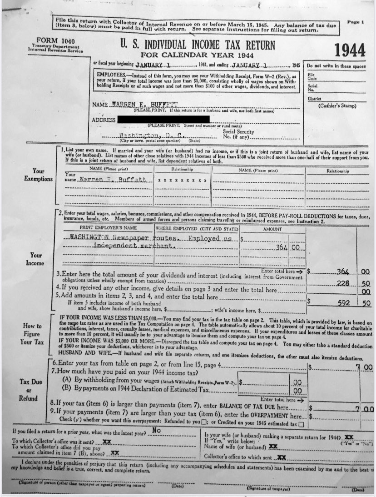
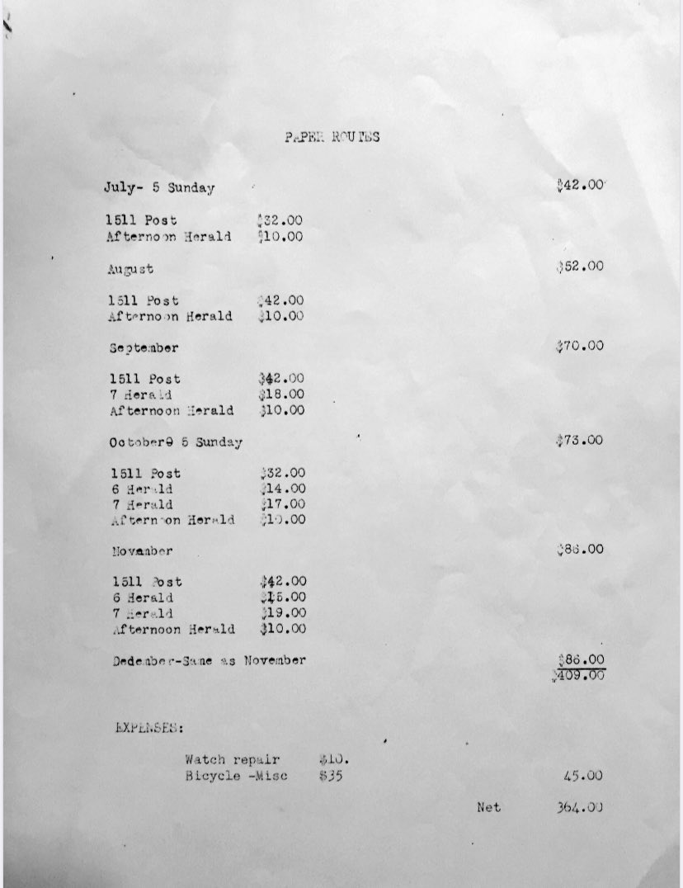

> 这是一份极具历史价值的文件：**沃伦·巴菲特（Warren E. Buffett）在1944年（他14岁时）填写的个人所得税申报表（U.S. Form 1040）**。我们还能看到第二张图是他的**送报工作收入明细单**，用于支持他的收入来源。

以下是这两页内容：

***

## **🧾** **第一页：1944年美国个人所得税申报表**

***

## **📊** **第二页：送报收入明细表（Paper Route Income Breakdown）**

***

### **支出项目（Expenses）**

***

### **净收入计算**

***

### **点评：**

* 这是巴菲特第一次缴纳联邦所得税，**他14岁时就有净收入并依法申报纳税**；

* 他以**送报纸**和**利息收入**赚取了近600美元；

* 报税金额为 $7，虽小却体现出他极早的理财习惯和纳税意识；

