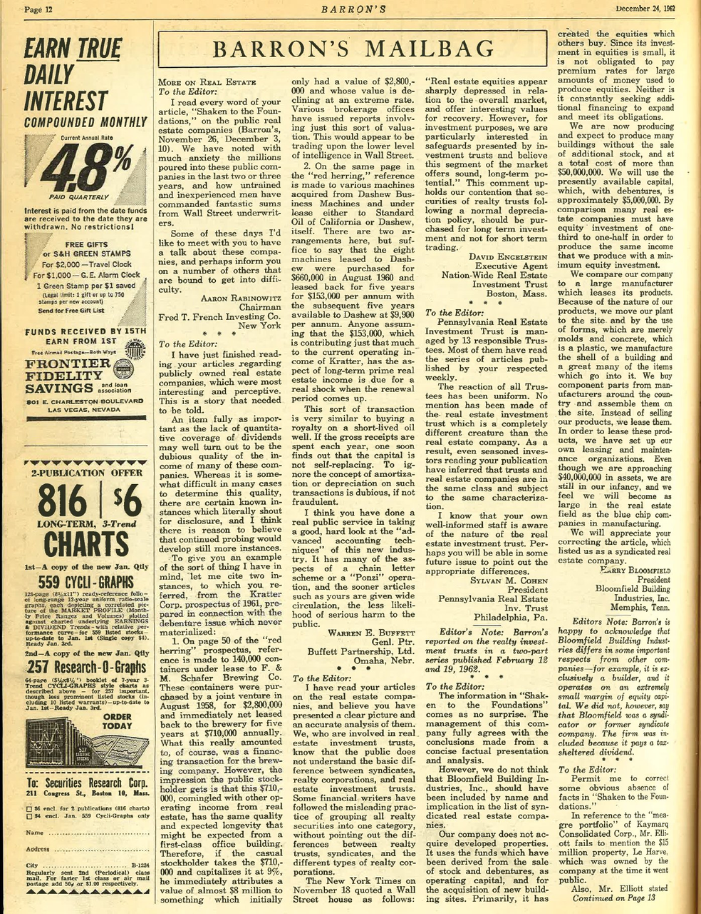

# 标题：《给编辑的一封信：房地产收购》

**1962年12月24日**

**致编辑：**

我刚刚读完您关于上市房地产公司的文章，非常有趣且富有洞察力。这是一个亟需被讲述的故事。

与股息的定量分析缺乏一样，许多这类公司的收入质量堪忧，这一点同样至关重要。虽然在很多情况下，判断这些收入的质量较为困难，但有些已知的案例却明确表明了这一问题，我认为有理由相信，继续深入探讨会揭示出更多类似的情况。

为了给您一个我所指问题的例子，我想引用您提到的1961年《Kratter公司招股说明书》中的两个实例，该说明书是为了未能成功的债券发行所准备的：

1. 在《招股说明书》的第50页中，提到了与F. & M. Schafer Brewing Co.（费尔曼·谢弗啤酒公司）签订租赁协议的14万个容器。这些容器由一个合资企业于1958年8月购买，价值280万美元，并立即以每年71万美元的租金回租给该啤酒厂，租期为五年。实际上，这不过是啤酒厂的融资交易。然而，普通股东所得到的印象是，这71万美元与其他房地产运营收入混合在一起，具有与一座顶级写字楼类似的收入质量和预期寿命。因此，如果一个随便的股东将这71万美元以9%的资本化率来计算，他会立即给这种最初只有280万美元价值且正在急剧贬值的资产估值近800万美元。多个证券公司已发布过类似这种估值的报告。这似乎是在利用华尔街投资者的低层次智慧进行交易。

2. 在《招股说明书》同一页中，还提到了从Dashew Business Machines（达修商业机器公司）收购的各种机器，并将其租赁给标准石油公司（California Standard Oil）或Dashew公司本身。这有两种安排，但可以说，租给Dashew的八台机器是在1960年8月以66万美元购买的，并以每年15.3万美元的租金回租五年，之后的五年，Dashew公司可以以每年9,900美元的租金续租。任何认为这15.3万美元对Kratter公司当前运营收入的贡献，具有长期优质房地产收入特征的人，当续租期到来时，将会受到极大的震惊。

这种交易类似于购买短命油井的权利金。如果每年都将总收入花光，就很快会发现资本无法自我替代。在这类交易中忽略摊销或折旧的概念，显得极为可疑，甚至可以说是欺诈性的。

我认为，您对这个新兴行业的“先进会计技术”进行了深刻的审视，确实为公众提供了很大的帮助。这个行业有许多类似于链式信件或庞氏骗局的特征，而越早让像您这样的文章得到广泛传播，公众受到严重伤害的可能性就越小。

**沃伦·巴菲特**

**普通合伙人**

**巴菲特合伙企业有限公司**

**内布拉斯加州奥马哈市**

[ 英文版](https://y4pc2g8csc.feishu.cn/wiki/V05SwwdcWikudWkB2QOcmJRenOh)
