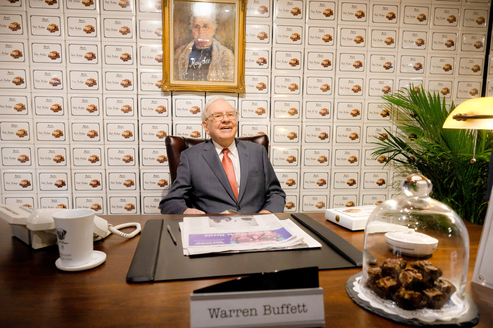

[1972-buffett-letter-to-sees-candies.pdf]()

> 彦鑫：在投资界，沃伦·巴菲特以其深刻的商业洞察、超常的判断力和极简的沟通风格著称。这封写于1972年12月13日的信，是他收购喜诗糖果不久后写给时任总裁Charles N. Huggins（Chuck）的亲笔信，短短几百字，却展现出他对品牌价值、商品定位、零售陈列和分销的深刻洞察。

**1972年12月13日**

**查尔斯·N·哈金斯 先生，总裁**

**喜诗糖果公司**

**洛杉矶加利福尼亚州塔霍尼加大道3423号，邮编90016**

**亲爱的查克：**

几天前我去了布兰代斯大学，对我们产品在那里的陈列和展示有一些强烈的感受，想和你分享：

1. **顾客对糖果的印象，不仅仅取决于它的味道，还会受到别人的评价以及它所处的“零售环境”的影响**。这个环境包括：商店的类型、包装方式、产品的摆放状态，以及周围陈列的商品等因素。正如一则登在《纽约客》的广告，与登在《村声》上的广告会给人完全不同的“编辑氛围”，我们的糖果所处的环境也会直接影响顾客在心理上——甚至味觉上的——对我们品质的认知。你当然比我更清楚这一点。

* 一直以来，我们**坚持极为纯粹的分销方式**，这在很大程度上塑造了公众对我们品牌的良好印象。

* 然而在布兰代斯，我们的产品在各方面都明显落后于Stover’s。他们的**陈列非常专业，展示区整洁有序，只放自家产品**。而布兰代斯则把我们几盒糖果，与另外25种廉价散装糖果和各种普通商品混在一个柜台上。他们还把自己展区原有的标准标识卡拿出来，随便写几行说明，比如“软糖豆，每磅99美分”之类的。我们唯一展示的一盒糖果，包装凌乱，里面还有空包装纸和一些杂物，整体看起来非常不专业，毫无档次可言。

4. 在布兰代斯，顾客对我们品牌的认知不是延续已有印象，而是从头开始建立认知。我认为，如果我们打算继续拓展百货商店渠道，那我们就必须对陈列环境进行非常严格的管控。**产品必须以一种能突出其“特别感”的方式呈现**。这可能意味着设立独立展示区，避免与廉价产品混放；要配有符合喜诗品牌形象的说明标识，还需要使用高质量的开放式展示盒，确保整体呈现足够专业、上档次。

当然，所有这些都体现了小规模试点的好处。如果我们决定推进，那我们就有充足的时间来为明年做好准备，确保我们在优质门店中以绝对高标准的方式呈现品牌。

当我们走出自己熟悉的区域时，确实需要一些宣传材料。也许我们可以出一本小册子，标题可以是“世界上最著名的厨房”之类的。Coors（科尔斯啤酒）就是一个很好的例子——他们把自己所有的啤酒都来自同一家酿酒厂这一点做成了品牌卖点。我确实认为，**人们对具有地理独特性的产品总有一种特别的偏好**。也许那些来自法国某个仅80英亩的小葡萄园的酒确实品质出众，**但我总怀疑，99%的魅力来自“故事”，只有1%靠的是“口感”。**

我们或许也可以讲出这样一个故事：讲述加州的一个小厨房如何成为“闻名全球”的地方。如果真要这么做，这个故事必须讲得极其出色，它也应该成为我们想要传播开来的品牌传说的核心。这本小册子如果再配合Marshall Field’s、Rich’s、Jordan Marsh等百货公司中高质量的陈列和广告，会大大提升我们的品牌形象——远比布兰代斯那种展示方式要好。

顺便说一句，**我认为我们也应该为加盟商销售设置区域限制**。比如 Younker’s（百货公司）不应该被允许来奥马哈卖糖果，布兰代斯也不该跑到得梅因去卖。

这种糖果应该给人一种“非常难买到”的感觉，只在特定时间段供应，而且消费者要觉得它&#x662F;**“限量发售”**&#x7684;，**买到是件特别的事。**

**致以最诚挚的问候，**

**沃伦·E·巴菲特**

**副本抄送：**

J.P. Guerin 先生

C.T. Munger 先生

（全）
