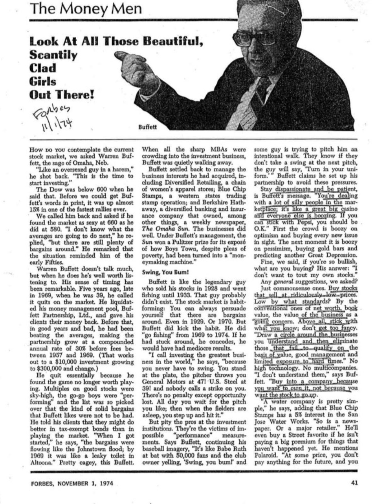
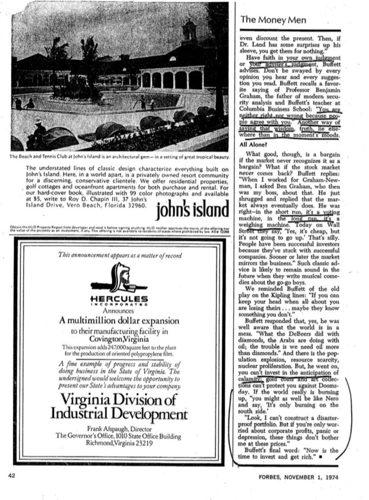

# 标题：《击球， 你个笨蛋！》

1974年11月5日

1974年，《福布斯》杂志刊登的标题为《看看那些漂亮、穿得很少的女孩！》，这篇文章展示了沃伦·巴菲特的个性，并记录了他在投资界开创的独特道路。尽管这篇文章已经有34年历史，但它仍然能够揭示出巴菲特这一人物的真实面貌，尤其是在本周末伯克希尔·哈撒韦股东大会举行之际。

罗伯特·伦茨纳（Robert Lenzner）和埃夫琳·鲁斯利（Evelyn Rusli）将全天候报道来自奥马哈的股东大会新闻。

> ### 沃伦·巴菲特对股市的看法

我们问沃伦·巴菲特——这位来自内布拉斯加州奥马哈的智慧人物——如何看待当前的股市。

他回了一句：“像是一个纵欲过度的家伙在后宫里。”他接着说道：“现在正是开始投资的时机。”

当他说这句话时，道琼斯指数还低于600点。在我们把巴菲特的话写下来之前，股市已经在一场快速反弹中上涨了近15%。

我们回电问他，股市从580点涨到660点后，他是否依然觉得市场像之前那么诱人。“我不知道接下来股市会如何，”他回答说，“但仍然有很多便宜的好股。”他还提到，当前的局势让他想起了1950年代初期。

> ### 巴菲特的投资哲学与时间把握

沃伦·巴菲特不爱多说话，但每当他开口时，言辞总是值得认真倾听的。他对时机的把握非常精准。五年前的1969年末，当时他39岁，巴菲特宣布退出股市。他清算了自己的资金管理公司——巴菲特合伙公司（Buffett Partnership, Ltd.），并将客户的资金返还给他们。在此之前，无论市场好坏，巴菲特都能击败大盘，在1957年至1969年间，巴菲特合伙公司每年复合增长率达到30%（扣除费用之前）。这意味着，如果你在1957年投资了1万美元，到1969年，投资额将增长至30万美元以上。

他之所以选择退出，主要是因为他发现市场已经不再值得玩下去。优秀股票的市盈率过高，投机者们正在“表演”，而市场中的优质资产已所剩无几，巴菲特钟爱的那种固守价值的便宜股票几乎找不到了。他告诉客户，投资税收豁免债券可能会比参与股市更有利。“当我刚开始时，便宜货像约翰斯敦洪水一样源源不断；而到了1969年，就像阿尔图纳的漏水马桶一样。”这番话真是充满智慧。当所有精英MBA们都挤进投资行业时，巴菲特却悄然选择了退出。

> ### 巴菲特的投资转型

巴菲特重新开始管理他所收购的商业资产，包括“多元化零售”（Diversified Retailing），一家女性服装连锁店；“蓝筹印花”（Blue Chip Stamps），一个西部州的交易印花公司；以及伯克希尔·哈撒韦（Berkshire Hathaway），一家多元化的银行和保险公司，除了这些，还拥有一家周报《奥马哈太阳报》。这些业务表现良好。在巴菲特的管理下，《太阳报》因揭露了男孩镇（Boys Town）尽管声称贫困，实际上已成为一台“赚钱机器”而获得了普利策奖。

> ### “挥棒吧，你这个笨蛋！”

巴菲特就像那个1928年卖掉股票、一直钓鱼到1933年才回来的传奇人物。其实，这个人可能并不存在。股市有一种让人上瘾的特质：你总是能说服自己周围有便宜的好股票。即使在1929年，或者1970年。但巴菲特确实戒掉了这个习惯。从1969年到1974年，他确实选择了“钓鱼”。如果他继续留在市场中，他坦承，自己会有平庸的成绩。

“我称投资为世界上最棒的生意，”他说，“因为你永远不必挥棒。你站在本垒打击区，投手给你投来通用汽车（General Motors）以47美元的价格！美国钢铁（U.S. Steel）以39美元的价格！没有人会判你‘三振’。唯一的惩罚就是失去了机会。整天你都在等着你喜欢的投球；然后，当外场手都在打瞌睡时，你上前击球。”

> ### 投资专业人士的困境

但可怜那些投资机构的专业人士，他们是无法避免“业绩”衡量的牺牲品。巴菲特继续用他的棒球隐喻来说：“就像贝比·鲁斯（Babe Ruth）在打击区，周围有5万人看着，而俱乐部老板大喊‘挥棒吧，笨蛋！’而投手却试图给他投一个故意四坏球。他们知道，如果他们不挥棒，老板会说‘交出你的球衣’。”巴菲特声称，他成立合伙公司就是为了避免这些压力。

> ### 巴菲特的投资理念

巴菲特的投资理念是保持冷静和耐心。他的建议是：“你在市场上遇到的很多人都很傻；这里就像一个大赌场，每个人都在喝酒。如果你能坚持持有百事可乐（Pepsi）的股票，你应该就没问题。”一开始，市场上的人们因乐观情绪而疯狂购买每一只新上市的股票；下一刻，他们又因悲观情绪而买进黄金条，并预测另一次大萧条的到来。

> ### 巴菲特的投资策略

我们问巴菲特，如果他如此看好市场，那他到底在买什么？他的回答是：“我不想宣传我自己的股票。”

> ### 一些普遍的建议

我们进一步问道：有没有什么通用的建议？

巴菲特给出的回答是一些常识性的建议：“买那些价格低得离谱的股票。”那么，什么样的价格算低呢？他提到：“按常规标准来衡量，比如净资产、账面价值、以及企业作为一个持续经营的单位的价值。”最重要的是，坚持投资你了解的领域；不要太复杂。“围绕你理解的业务画一个圈，然后剔除那些在价值、管理层和抗风险能力上都不符合标准的公司。”他强调：“不要投资高科技，不要投资多元化的公司。我不理解它们。”他说：“买入一家公司，是因为你想拥有它，而不是因为你希望它的股价上涨。”

> ### 选股的原则

巴菲特举例说：“一家水务公司很简单，”他补充道，“蓝筹印花公司拥有圣荷西水务公司的5%股份。报纸公司也是如此，或者是一家大型零售商。”如果不为那些尚未发生的事情支付高溢价，他甚至会买进市场上非常受欢迎的公司。他提到了宝丽来（Polaroid）：“在某个价格点，你实际上是没有为未来的任何预期支付任何费用，甚至连现在的价值都被打折了。然后，如果兰博士（Dr. Land）有些惊喜，那么你就能以零成本获得这些惊喜。”

> ### 坚信自己的判断

巴菲特建议，要相信你自己的判断，或者相信你的顾问的判断。不要被你听到的每个观点和读到的每个建议所左右。他回忆起现代证券分析学的奠基人、他在哥伦比亚商学院的老师本杰明·格雷厄姆教授（Professor Benjamin Graham）的一句名言：“你是否正确并不取决于别人是否同意你。”这话的意思是：智慧和真理并不局限于一时的情绪或市场的心态。

> ### 孤军奋战？

然而，如果股市永远无法识别出价值洼地，那有什么意义呢？如果股市再也没有反弹呢？巴菲特回答道：“当我在格雷厄姆-纽曼公司工作时，我曾经问过我的老板本·格雷厄姆关于这个问题。他只是耸了耸肩，说市场最终总会认出价值的。他是对的——在短期内，股市是一个投票机；但从长远来看，它是一个称重机。今天在华尔街，人们会说：‘是的，它便宜，但它不会上涨。’这简直是胡说八道。那些成功的投资者之所以成功，是因为他们一直坚持投资那些成功的公司。迟早，市场会反映出企业的真实价值。”这种经典的建议在未来依然适用，哪怕未来有一天，他们会写出关于那些投机者的音乐喜剧。

> ### 巴菲特的“逆境投资”哲学

我们提醒巴菲特，曾有一部作品改编自吉卜林的名句：“如果你能在四周的人都失去理智时保持冷静…也许是因为他们知道一些你不知道的事情。”

巴菲特回应道，他完全意识到世界现在的局势：“德比尔斯（DeBeers）是如何控制钻石的，阿拉伯人就如何控制石油；问题在于，我们比钻石更需要石油。”此外，还有人口爆炸、资源匮乏、核扩散等问题。但是，他接着说，你不能为了预期灾难而投资；黄金硬币和艺术收藏无法保护你免受世界末日的影响。如果世界真的在燃烧，“你不如像尼禄一样，冷静地说，‘只是在南面着火。’”

> ### 不惧市场波动，巴菲特的投资信念

“看，我无法构建一个防灾的投资组合。但如果你只担心公司利润、恐慌或经济衰退，这些问题在当前价格下对我来说都不成问题。”

巴菲特的总结： “现在正是投资并致富的时机。”

