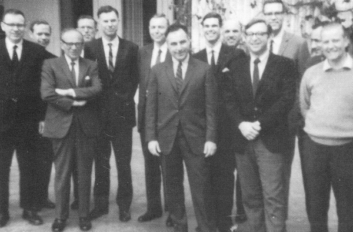

[本杰明格雷厄姆纪念悼文（巴菲特）.pdf]()

> 彦鑫：今天分享的信，是巴菲特亲笔撰写的缅怀文章《本杰明·格雷厄姆 **1894 - 1976**》。透过他饱含敬意的文字，我们得以感受到这位具有远见卓识的智者，在投资理念、教育精神与人格魅力上的非凡影响。

**本杰明·格雷厄姆 1894–1976**

**作者：沃伦·巴菲特**

**来源：**《金融分析师期刊》，第32卷，第6期（1976年11月–12月），第19页

**出版方：**&#x43;FA协会

**以下为全文：**

#### **本杰明·格雷厄姆**

**1894 - 1976**

几年前，本·格雷厄姆将近 80 岁时，曾对一位朋友表达过这样的愿望：

他希望每天都能“做一些愚蠢的事，一些有创意的事，以及一些慷慨的事。”

这句带点俏皮的愿望，正体现了他那种善于表达理念的本领——他总能用一种不说教、不自夸的方式来传递强大有力的思想。他的思想确实深刻，但表达方式却始终温和。

阅读这本杂志的读者，早已不需我再去阐述他在创造力方面所取得的成就。一个学科的创始人，其成果在他之后往往会被后继者所超越，这是常有的事。然而，在他那本划时代著作问世四十多年后的今天——那本将秩序和逻辑引入原本混乱无序的证券分析领域的书——我们仍难以找出一个人，哪怕是有资格争夺“亚军”的人选，来与他在这一领域比肩。

证券分析这个领域中，许多看似聪明的想法在出版后短短数月内就被证明站不住脚，而本的原则却经受住了时间和金融风暴的考验，不仅保持了其稳固性，甚至在理解加深之后愈发显出其价值。他主张稳健的方法，给予追随者持续而可靠的回报——即便是那些天赋并不出众的人，也因遵循其建议而优于那些追随时尚和天才灵感却迷失方向的从业者。

本在专业领域中如此卓越的一个重要原因，是他所拥有的非凡心智广度。不是那种把所有精力都集中于某一狭窄目标上的专注力，而是一种几乎难以定义的、广博才智的自然流露。

坦白说，我从未遇到过一个思维广度堪与他匹敌的人。他记忆力惊人，对新知识的渴望从未停止，并能将之重构为适用于不同领域的问题解决框架。他的思想广度使人们即便在毫无关联的领域中接触到他的理念，也能如沐春风、受益匪浅。

然而，第三个关键特质——“慷慨”——才是他超越所有人的地方。我既是他的学生、也是他的雇员，更是他的朋友。在这些关系中——就像他对待所有学生、雇员和朋友一样——他展现出一种绝对开放、毫无保留、不计较得失的慷慨精神。这种慷慨体现在思想、时间与精神的分享上。

若需要理清思路，没有比找本更好的选择；

若需要鼓励与建议，他总在那里。

沃尔特·李普曼曾说：“有些人种下树苗，供后来人乘凉。”

本·格雷厄姆正是这样的人。

——沃伦·巴菲特（签名）

