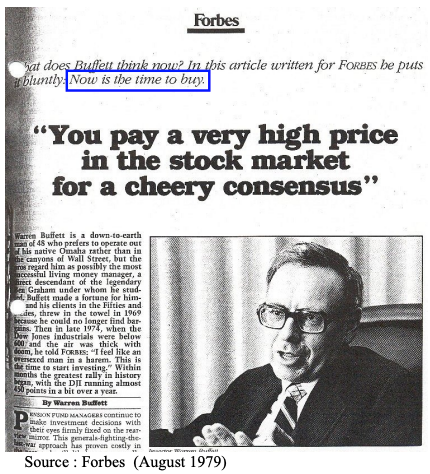

# 标题：《**当市场一片欢腾时，你将付出高昂的价格》**

沃伦·巴菲特《福布斯》杂志，1979年8月

**全文：**

养老金基金经理仍然倾向于根据过去的表现来制定投资决策。这种“将军打上一场战争”的思维方式在过去已证明代价高昂，而这次很可能也不例外。

目前，股票的估值水平表明其长期回报率应显著高于债券。然而，养老金经理却在创纪录的比例上将资金投入债券市场。这一行为通常受到企业赞助者的影响，而这些赞助者是养老金经理必须取悦的对象，正所谓“吃人家的嘴短”。

与此同时，投资股票的资金却以“滴管”方式缓慢注入。著名的“帕金森法则”的提出者帕金森或许会得出结论：专业人士对股票的热情与他们最近从股票持有中获得的收益成正比。这种行为原本被认为是普通投资者的典型表现，但专业投资者似乎也受到了类似的影响。以下是相关记录。

* **1972年的股市狂热**

* 在1972年，当道琼斯指数的收益为67.11美元，即相当于607点初始账面价值的11%时，股市以1,020点的价格收盘，养老金基金经理根本无法足够快速地购买股票。1972年股票购买量达到了可用资金的105%（即债券被出售），创下了除了上一年（122%）外的最高纪录。这两年的狂热使得养老金资产中股票的比例从61%上升至74%，创下了历史新高，并恰巧与道琼斯指数创下历史最高价的时点一致。投资经理越是为股票支付更高的价格，他们就越觉得这种投资是正确的。

* **1973-1974年市场暴跌**

* 然而，1973至1974年，市场突然崩盘。尽管道琼斯指数在1974年赚取了99.04美元，即相当于690点初始账面价值的14%，但年末其收盘价仅为616点。这个价格是否是一个“便宜货”？遗憾的是，虽然价格大幅下跌，但却没有激发投资者的购买热情，反而引发了恐慌。那一年，仅有21%的净投资资金进入了股票市场，创下了过去25年的最低纪录。私人非保险养老金计划所持有的股票比例下降至54%，相比道琼斯高点时下降了整整20个百分点。

* **1976年勇气回升，但股市估值不合理**

* 到1976年，养老金经理的投资勇气随股市价格回升而增强，56%的可用资金投入了股票市场。那一年，道琼斯指数的平均水平接近1,000点，约高于账面价值的25%。

* **1978年股市估值理性，投资依旧低迷**

* 到了1978年，股票的估值已更加理性，道琼斯指数大部分时间低于账面价值。然而，尽管如此，养老金经理的投资行为依旧低迷，年内仅有9%的净资金被投入股市，创下历史新低。1979年第一季度的投资比例几乎与1978年持平。

**养老金基金经理的矛盾心态**

通过这些行动，养老金基金经理实际上以创纪录的方式选择购买债券——年收益率在9%到10%之间——而拒绝以接近账面价值或更低的价格购买美国股票。然而，这些养老金经理可能会承认，长期来看，这些美国股票的总体回报大约为13%（近年来的平均水平），而他们的企业赞助者的经理们也会对此表示认同。

**公司经理的“双重标准”**

许多企业经理实际上在对待股票的态度上表现出一定的“精神分裂”。他们认为自家公司的股票极具吸引力。然而，与此同时，他们却批准养老金政策，拒绝购买一般的普通股。与此同时，这些经理在收购时可能会愿意支付企业账面价值的150%到200%来收购典型的美国企业，但当他们戴上养老金投资的“帽子”时，却会拒绝在账面价值时投资类似的公司。难道他的个人才能如此独特，以至于在收购某个企业时，他可以支付超过账面价值的200%，但如果企业由“商业圆桌会议”的同行管理时，就拒绝在账面价值上进行投资？

**帕夫洛夫式反应与投资行为的悖论**

一种简单的帕夫洛夫式反应可能是这种令人困惑行为的主要原因。在过去十年中，股票投资给企业赞助者和投资经理们带来了痛苦——无论是企业赞助者还是他们雇佣的投资经理，都不愿回到“事故发生的地方”。然而，这种痛苦并非源于企业表现不佳，而是因为股票表现逊色于企业的基本表现。股票的这种“落后表现”不可能无限期持续下去，就像早期股票相对于企业的过度表现一样，这种情况曾经促使养老金资金以高价进入股市。

**股票与债券的长期回报比较**

那么，假如我们持有一批1999年到期、利率为9.5%的美国领先公司债券，20年后能获得比一批以接近账面价值购买的道琼斯类股票更好的回报吗？后者预计总回报大约为13%。概率似乎异常低。只有在发生重大且持续的股本回报下降，或者在20年期末出现极低的收益估值时，股票选择才会证明不如债券。如果在20年期间市盈率扩大——并且这13%的股本回报率能够持续平均——那么即使以账面价值购买，现在的投资将实现超过13%的年回报。那么，为什么9.5%的债券会更具吸引力呢？

**道琼斯指数相当于债券的面值**

试想一下，将道琼斯指数的账面价值看作债券的面值，或者其本金。而将13%左右的预期平均收益率视为该债券的波动性利息——就像美国储蓄债券的利息一样，其中的一部分将被保留，作为增加本金的部分。目前，我们的“道琼斯债券”以显著折扣价进行交易（以840点购买，而非940点，即道琼斯的“面值”）。这些数字基于旧版道琼斯指数，若采用新版本，则回报会稍高一些，账面价值稍低一些。以折扣价购买的道琼斯债券，年均利息为13%——即使利息随着商业环境的变化而波动——我认为这是一项远超传统9.5% 20年期债券的长期投资。

**股票回报的不确定性与养老金经理的担忧**

当然，没有任何保证表明未来的企业收益将平均为13%。或许有些养老金经理回避股票，是因为他们预期未来十年股本回报将大幅下降。然而，我并不认为这种观点广泛存在。

**投资经理的主要反对意见**

相反，投资经理通常会提出两个主要反对意见，反对现在偏向股票而非债券。有些人认为，目前的收益被夸大了，扣除替代价值折旧后的实际收益远低于报告的收益。因此，他们认为，13%的实际收益并不可得。但这个论点忽视了在一些投资领域（如人寿保险、银行业、火灾伤亡保险、金融公司、服务业等）中的证据。

**替代价值会计与传统会计的对比**

在这些行业中，替代价值会计将产生与传统会计几乎相同的结果。然而，仍然可以组建一个非常有吸引力的投资组合，包括在这些领域的大型公司，预期的回报率为13%或更高，且整体价格接近账面价值。更重要的是，我并没有看到证据表明企业经理因为考虑到替代价值会计而在收购决策中回避13%的回报。

**“等待更清晰时机”的投资观念**

另一个常见的论点是，未来存在太多不确定性，是否应该等到情况稍微明朗一点再做决定呢？这就是典型的言辞：“在当前的不确定性得到解决之前，保持购买储备。”然而，在依赖这种“拐杖”之前，必须面对两个令人不悦的事实：未来永远不会完全明朗；在股市中，乐观的共识往往需要支付极高的价格。事实上，不确定性是长期投资者的朋友。

**养老金基金经理应具备长期投资的眼光**

如果有人能够在投资决策中拥有长期视角，那么这应该是养老金基金经理。尽管企业经理为了以溢价收购企业而承担大量义务，但大多数养老金计划的资金流动问题相对较小。如果他们愿意进行长期投资——就像他们现在投资20年和30年期债券一样——他们显然有能力这样做。他们完全可以并且应该以长期合伙人关系的态度和期望去购买股票。

**企业经理的错误决策**

那些通过做出容易、传统或追随潮流的决策来逃避养老金管理责任的企业经理，正在犯一个昂贵的错误。养老金资产大约占整个工业净资产的三分之一，当然，在许多具体的工业公司中，养老金的比例要大得多。因此，养老金资产的管理不善，往往意味着对整个企业最重要部分的管理不善。通过稳健的投资获得更高的回报将大大增加企业赞助商的利润，并增强养老金领取者的安全感和未来支付的前景。

**低股票比例的选择与未来预期**

那些目前选择较低股票比例的经理，要么对未来美国企业的业绩持极其负面的看法，要么希望他们足够灵活，能够在股市更低迷时重新进入股票市场。的确，在未来某段时间，金融市场可能会陷入低迷，股市将提供更好的买入机会；这种可能性始终存在。但可以确定的是，在这样的时刻，未来将既不可预测又不令人愉快。现在等待“更好时机”来投资股票的人，很可能会坚持这一立场，直到下一个牛市到来。

