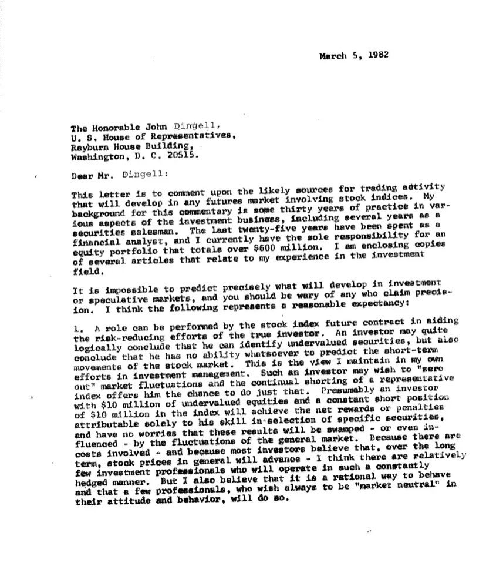
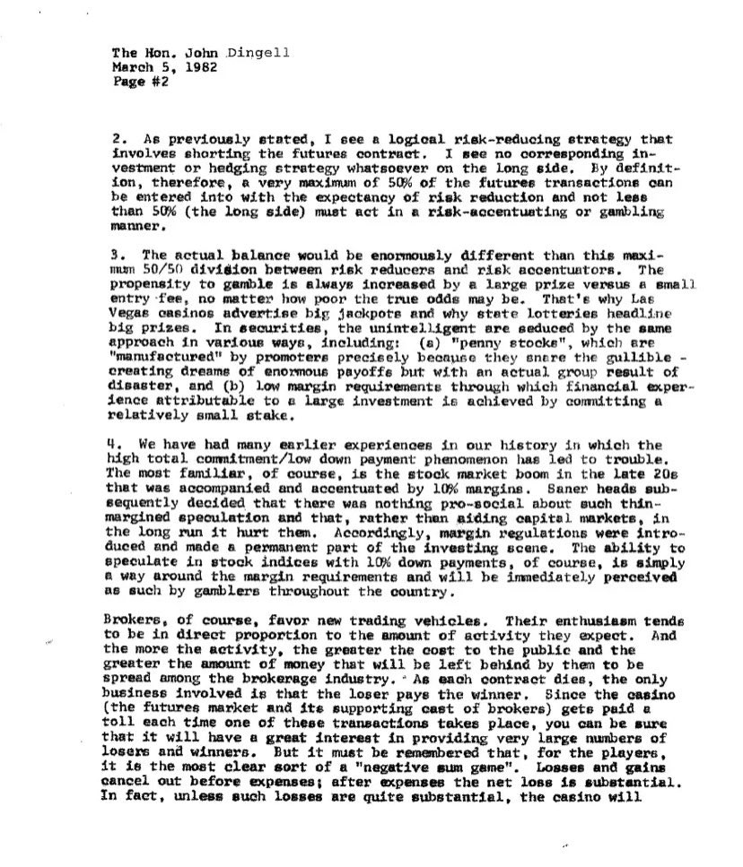
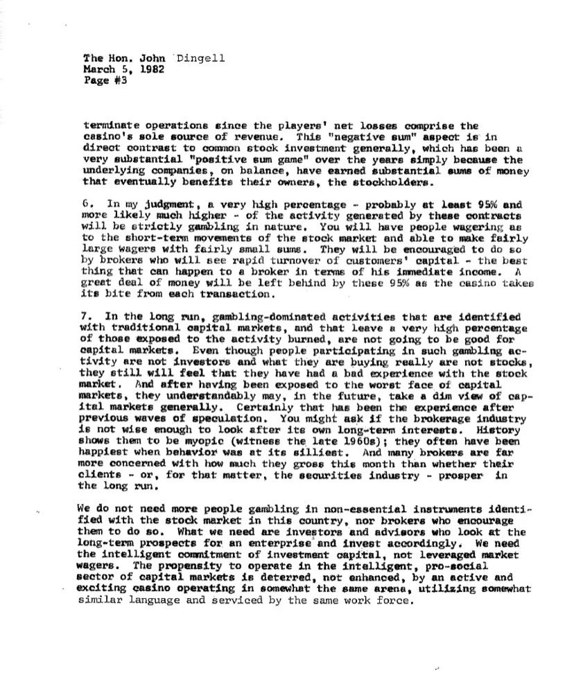
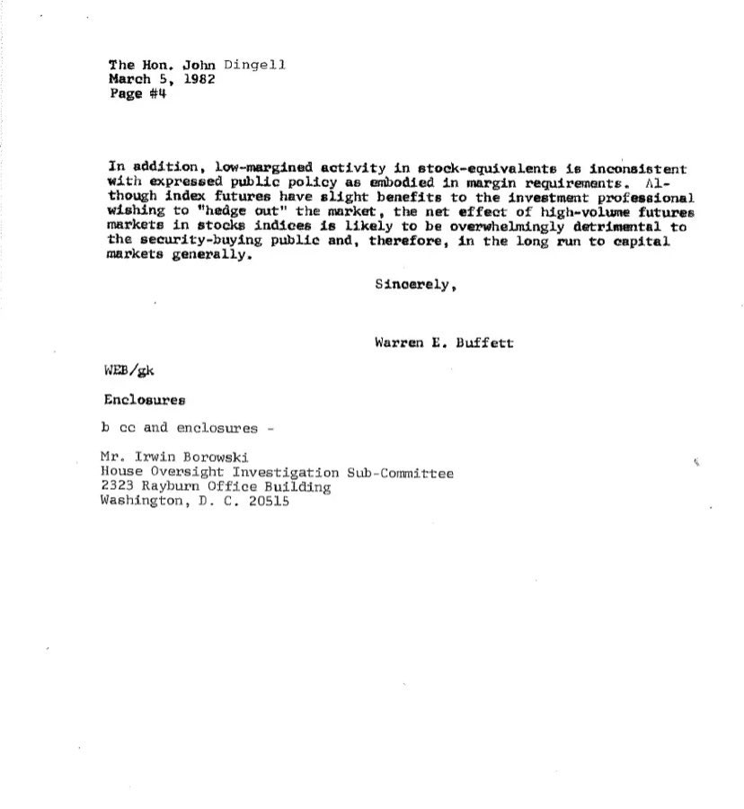

**全文翻译：**

**1982年3月5日**

尊敬的约翰·丁格尔先生

美国众议院议员

雷伯恩众议员办公楼

华盛顿特区，邮编20515

**亲爱的丁格尔先生：**

此信旨在就涉及股票指数的期货市场中可能出现的交易活动来源发表评论。作为本评论的背景，我在投资业务的多个方面已有大约三十年的实践经验，其中包括若干年担任证券销售员的经历。在过去的二十五年中，我一直从事金融分析工作，目前我独自负责管理一个总额超过六亿美元的股票投资组合。我随信附上几篇与我在投资领域经历相关的文章。

准确预测投资或投机市场将会如何发展是不可能的，任何声称能精确预测的人都应当引起你的警惕。我认为，以下观点代表了一个合理的预期：

1. 股票指数期货合约可以在协助真正投资者的风险降低努力中发挥作用。一位投资者可能会合乎逻辑地得出这样的结论：他可以识别被低估的证券，但同时也认为自己完全没有能力预测股市的短期走势。这正是我在自己的投资管理工作中所坚持的观点。这样的投资者可能希望“消除”市场波动的影响，并持续做空一个“具有代表性”的市场组合，以实现这一目的。假设一位投资者持有价值一千万美元的被低估证券，同时建立一个等值的一千万美元的指数期货空头头寸，他将能获得该组合净回报或惩罚，这完全取决于其在具体证券选择方面的能力。他无需担心这些结果会被——甚至仅仅是受到——大盘波动的影响。由于交易涉及成本——而且因为大多数投资者相信，从长期来看，股票价格总体将会上涨——我认为将会有极少数的专业投资者以这种基本对冲的方式操作。但我也相信，这是一种理性的行为方式，并且会有少数专业人士始终希望在其态度和行为上保持“市场中性”，他们将会这样做。

* 正如前文所述，我认为一种逻辑上的风险降低策略是做空期货合约。我在多头方面看不到任何相应的投资或对冲策略。因此，从定义上讲，期货交易中最多只能有50%可被认为是具有风险降低预期的交易，而不少于50%（即多头方）必须以加剧风险或赌博的方式进行操作。

* 实际上的比例将远远不同于这种风险降低者与风险加剧者各占50%的设想。人们的赌博倾向总是会因大额奖金对比小额入场费而被增强，无论真实的胜率多么低。这就是为什么拉斯维加斯赌场广告宣传大奖，为什么各州彩票都强调头奖金额的原因。在证券市场中，缺乏判断力的投资者也会被相似的方式所吸引，例如：(a) “便士股”，由推销者“包装”后销售，正因为它们价格便宜，因此很容易让人幻想巨额回报，但实际上整体结果却是严重亏损；(b) 低保证金要求的投资模式，使得通过承担较小本金投入来获取较大投资成果的梦想得以成真。

* 我们的历史中已有许多类似的例子，即“高杠杆/低首付款”现象导致了麻烦。最熟悉的例子无疑是20世纪20年代末期的股票市场繁荣，彼时10%保证金的交易加剧了这一现象。冷静的头脑则提出，如果不允许进行此类高度投机活动，而是通过提高保证金要求来抑制它，将对整个资本市场产生积极影响。相应地，保证金规定被引入，成为美国投资体系的核心组成部分。10%保证金制度的引入，使得市场的稳定性提升了，而在许多国家此类规定并未存在，结果是投资行为广泛被视为一种赌博形式。

* 当然，经纪商喜欢交易工具。他们的热情往往与预期活动量成正比。他们知道，活动越多，成本最终将由公众和未参与的人承担——即市场中最终留下的钱越少。赌场对这种业务结构再熟悉不过了：庄家是赢家。自助投机市场（如期货市场）和赌场类似，庄家（即经纪商）通过“转手费”获利。只要交易继续，赌场便能运营。你可以通过技术手段获得一小部分优势，例如在赌博中通过计牌，但这仍是一个“负和游戏”的最清晰表现形式。损益总是以净亏损告终。事实上，除非亏损非常巨大，否则赌场不会关门歇业，因为玩家的净亏损正是赌场的唯一收入来源。这一“负和”特性与普通股票投资形成鲜明对比。股票投资长期以来一直是一个非常显著的“正和游戏”，仅仅因为在整体上，那些上市公司赚取了可观的利润，而这些利润最终惠及了其所有者——股东。

* 在我看来，一个非常高的比例——可能至少是95%，甚至更高——由这些合约所带来的活动都将是纯粹的赌博性质。你会看到人们在股票市场的短期波动上下注，并能够以相当小的保证金进行相当大金额的交易。他们将被鼓励这样做，因为经纪商会看到客户资金快速周转——对一个经纪商来说，能发生的最好的事情，就是以立即的佣金计价的高频交易。对于这些95%的交易者来说，将有大量资金被遗留下来，就像赌场从每笔交易中抽取筹码那样。

* 从长远来看，那些由赌博主导、但却与传统资本市场挂钩的活动，其参与者中的大多数最终都会遭受损失，这将对资本市场产生不利影响。即使这些人最初参与时以为自己在做投资，买的也是“股票”，但当他们和股市“打过一场仗”之后，会意识到这其实是一种赌博行为。而在经历过一次糟糕的资本市场体验之后，他们今后可能会对资本市场整体持负面看法。毫无疑问，他们不会忘记之前的投机经验。你可能会问，券商行业是否足够强大以照顾投资者的长期利益。历史显示，当投机最盛时（如1960年代），客户最快乐，经纪商也最“快乐”——但这通常意味着他们最愚蠢。与此相对，那些真正在乎客户长期福祉的券商——或者说整个证券行业——在长期内才能繁荣。

我们不需要更多人在一些非必要的金融工具上赌博，也不需要经纪商去鼓励他们这样做。我们需要的是那些认真看待长期回报的投资者和顾问，并据此行事。我们需要的是有智慧的投资资本流向智慧的投资，而不是被用于赌博。愿意从事智慧型、具有正面社会价值的资本市场活动的人越多越好。赌博行为越少越好。我们希望市场变得更理性，而不是被那些披着“资本市场”外衣、语言和从业者却高度相似的“赌场型”机构所加强。

此外，低保证金的“准股票”交易行为，与公众政策所倡导的保证金规范不一致。尽管指数期货对于希望“对冲市场”的专业投资人可能有些微益处，但股票指数期货市场的大规模高频交易，其总体效果极有可能对广大买入证券的公众造成压倒性的伤害，并且从长远看，会对资本市场整体带来损害。

谨此敬礼，

Warren E. Buffett

