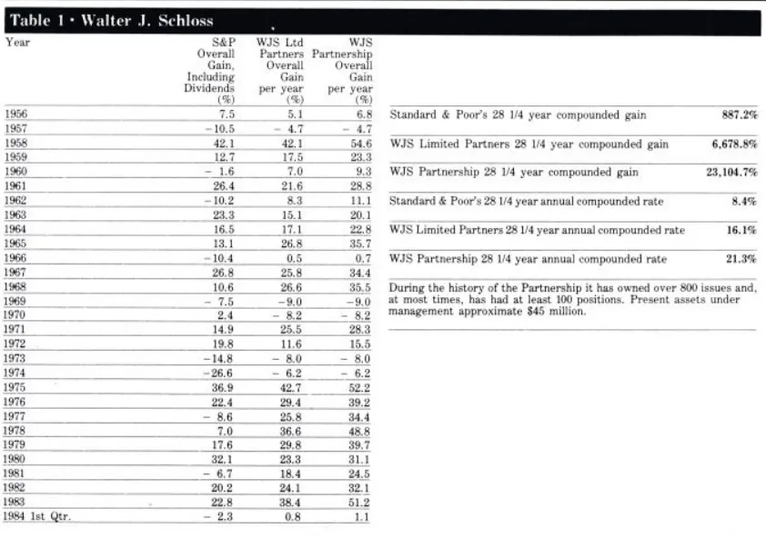
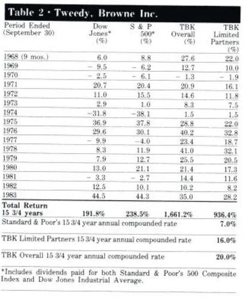
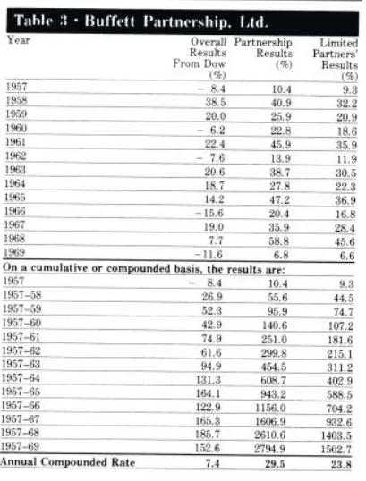
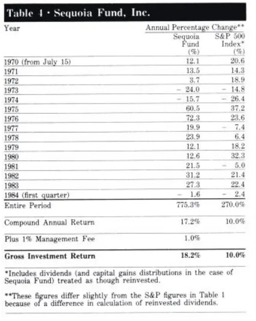
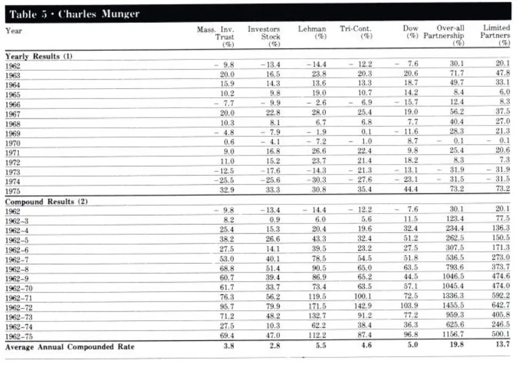
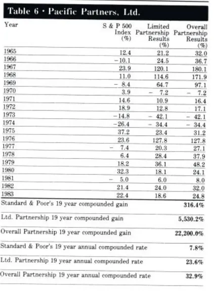
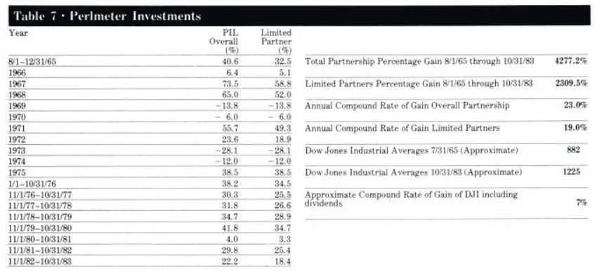
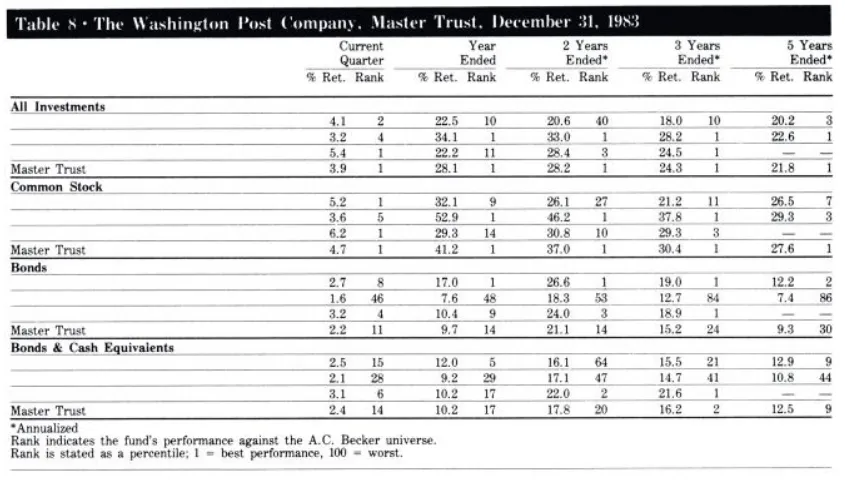
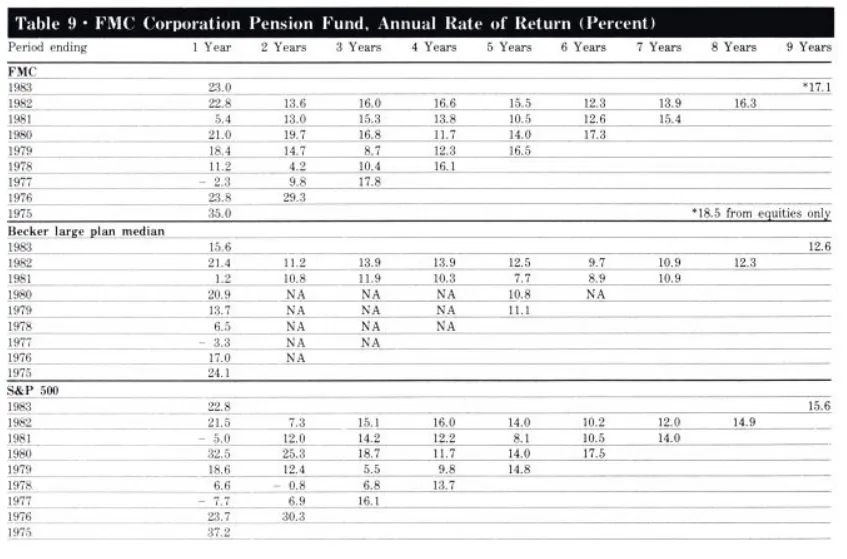

[巴菲特：1984年哥伦比亚大学演讲-格雷厄姆-多德式的超级投资者.pdf]()

# 标题：《格雷厄姆-多德式的超级投资者》

时间：1984 年

地点：哥伦比亚大学商学院

> 在庆祝格雷厄姆与多德合著的《证券分析》发行 50 周年大会上，巴菲特在哥伦比亚大学商学院进行了一次题为《格雷厄姆-多德式的超级投资者》（The Superinvestors of Graham-and-Doddsville）的演讲，**这也是巴菲特最精彩、最广为人知的演讲之一**。在这篇演讲里，巴菲特用他一贯风趣生动的语言，令人信服的展示了成功的股市投资者绝不是“黑猩猩蒙着眼睛抛硬币”的侥幸获胜者，因为他们年复一年的战胜市场，这无法用偶然性来解释，而这些成功者也并非服从随机分布，他们都出自于巴菲特所说的“格雷厄姆-多德都市”，也就是终身信奉格雷厄姆和多德投资哲学的价值投资者。每当有人质疑价值投资是否已经过时的时候，我们都可以回过头拿巴菲特这篇演讲来读一读。

全文：

格雷厄姆和多德 “**寻找价值相对于价格具有显著的安全边际**” 的证券分析方法难道已经过时了吗？

许多教授在他们编写的大部分教科书中都作出这一论断，他们口口声声地宣称股票市场是有效的，也就是说股价反映了所有关于公司发展前景和经济状况的所有信息。这些理论家们声称，由于聪明的股票分析师利用了所有可获取的信息进行分析判断，从而使股价总是正确无误地保持在合理的水平，因此根本不存在价值被市场低估的股票。

至于那些年复一年击败市场的投资者，只不过是类似彩票连续中奖的少数幸运儿。一位教授在他编写的当今十分流行的教科书中写道:如果股价完全反映了所有可获取的信息，这些投资技巧将毫无用处。

哈哈，也许如此。

但我想向大家介绍一群年复一年击败标准普尔500 股票指数的投资者，他们的经历无可辩驳地表明，那种认为他们持续战胜市场只是偶然事件的简单看法是很难成立的，我们必须深入探究其根本原因。

之所以如此，一个关键事实是，这些股市大赢家我都非常熟悉，并很早就被公认为超级投资者，其中成名最晚的那位也在 15 年前就名扬一时。如果事实并非如此，我只是最近搜索了成千上万的投资记录，从中选出几个业绩优秀的人在此向各位介绍，那么，你听到此处就可以把我赶走了。

我要补充说明的是，他们的投资业绩记录都已经过严格的审计。另外，我还要补充说明一下，我还认识许多选择这些投资管理人的客户，他们这些年来获得的投资收益与这些投资管理人公开的投资业绩记录完全相符。

“全美抛硬币**猜**正反面大赛”

在我们开始探究这些投资大师持续战胜市场之谜之前，我想先请在座各位跟我一起来观赏一场想象中的全美抛硬币猜正反面大赛。

假设我们动员全美国2.25 亿人明天早上每人赌 1 美元，猜一下抛出的一个硬币落到地上是正面还是反面，赢家则可以从输家手中赢得 1 美元。每一天输家被淘汰出局，赢家则把所赢得的钱全部投入，作为第二天的赌注。经过十个早上的比赛，将大约有 22 万名美国人连续获胜，他们每人可赢得略微超过 1,000 美元的钱。

人类的虚荣心本性会使这群赢家们开始有些洋洋得意，尽管他们想尽量表现得十分谦虚，但在鸡尾酒会上，为了吸引异性的好感，他们会吹嘘自己在抛硬币上如何技术高超，如何天才过人。

如果赢家从输家手里得到相应的赌注，再过十天，(将会有 215 位连续猜对20 次硬币的正反面的赢家，通过这一系列较量，)他们每个人用 1 美元赢得了100 万美元之多。215 个赢家赢得 225 个百万美元，这也意味着其他输家输掉了 225 百万美元。

这群刚刚成为百万富翁的大赢家们肯定会高兴到发昏，他们很可能会写一本书——“我如何每天只需工作30 秒就在 20 天里用 1 美元赚到 100 万美元”。更有甚者，他们可能会在全国飞来飞去，参加各种抛硬币神奇技巧的研讨会，借机嘲笑那些满脸疑问的大学教授们：“如果这种事根本不可能发生，难道我们这215 个大赢家是从天下掉下来的吗？”

对此，一些工商管理学院的教授可能会恼羞成怒，他们会不屑一顾地指出：即使是 2.25 亿只大猩猩参加同样的抛硬币比赛，结果毫无二致。但我对此却不敢苟同，在我下面所说的案例中的赢家们确实有一些明显的与众不同之处。

我所说的案例如下：

（1）参加比赛的 2.25 亿只猩猩大致像美国人口一样分布在全国各地;

（2）经过 20 天比赛后，只剩下 215 位赢家；

（3）如果你发现其中 40 家赢家全部来自奥马哈的一家十分独特的动物园。

那么，你肯定会前往这家动物园找饲养员问个究竟：他们给猩猩喂的是什么食物，他们是否对这些猩猩进行过特殊的训练，这些猩猩在读些什么书以及其他种种你认为可能的原因。换句话说，如果那些成功的赢家不同寻常地集中，你就会想弄明白到底是什么不同寻常的因素导致了赢家不同寻常地集中。

格雷厄姆和多德价值投资部落

当然，我和各位一样认为，事实上，除了地理因素之外，还有很多其他因素会导致赢家非常地集中。除了地理因素以外，还有一种因素，我称之为智力因素。

我想你会发现，在投资界为数众多的大赢家们却不成比例地全部来自于一个小小的智力部落——格雷厄姆和多德部落，这种赢家集中的现象根本无法用偶然性或随机性来解释，最终只能归因于这个与众不同的智力部落。我想要研究的这一群成功投资者，他们拥有一位共同的智力部落酋长——本·格雷厄姆。但是这些孩子长大离开这个智力家族后，却是根据非常不同的方法来进行投资的。

他们居住在不同的地区，买卖不同的股票和企业，但他们总体的投资业绩绝非是因为他们根据酋长的指示所作出完全相同的投资决策，酋长只为他们提供了投资决策的思想理论，每位学生都以自己的独特方式来决定如何运用这种理论。

**来自 “格雷厄姆与多德部落 ”的投资者共同拥有的智力核心是：寻找企业整体的价值与代表该企业一小部分权益的股票市场价格之间的差异。**

实质上，他们利用了二者之间的差异，却毫不在意有效市场理论家们所关心的那些问题——股票应该在星期一还是星期二买进，在 1 月份还是 7 月份买进等等。追随格雷厄姆与多德的投资者根本不会浪费精力去讨论什么 Beta、资本资产定价模型、不同证券投资报酬率之间的协方差，他们对这些东西丝毫也不感兴趣。

事实上，他们中的大多数人甚至连这些名词的定义都搞不清楚，追随格雷厄姆与多德的投资人只关心两个变量——**价值与价格**。

我总是惊奇地发现，如此众多的学术研究与技术分析臭味相投，他们关注的都是股票价格和数量行为。

你能想象整体收购一家企业只是因为其价格在前两周明显上涨——当然，关于价格与数量因素的研究泛滥成灾的原因在于电脑的普及应用，电脑制造出了无穷无尽的关于股价和成交数量的数据，这些研究毫无必要，因为它们毫无用途，这些研究出现的原因只是因为有大量的现成数据，而且学者们辛辛苦苦学会了玩弄数据的高深数学技巧。一旦人们掌握了那些技巧，不运用就会产生一种负罪感，即使这些技巧的运用根本没有任何作用甚至会有负作用。

正如一位朋友所言，对于一个拿着锤子的人来说，什么东西看起来都像一颗钉子。

九位格雷厄姆和多德部落的超级投资者

我认为，这群来自同一个智力家族的投资者们十分值得进一步的研究。顺便说一下，尽管所有的学术研究都关注类似于价格、数量、周期性、市值规模等因素对股价表现的影响，却从来没有证据表明学术界有兴趣研究这群非同寻常集中的价值导向的大赢家们所采用的投资策略。

关于投资业绩记录的研究，我首先要从 1954 年到 1956 年间我们在格雷厄姆—纽曼公司（Graham-NewmanCorporation）工作的四位同伴开始。我们总共只有四个人，我并不是从数以千计的投资人中挑选出这四个人的。我选修格雷厄姆的投资课程之后，要求进入这家公司无偿工作，但格雷厄姆却以我要价太高为由拒绝了我的要求，他对价值因素考虑得非常严肃和认真。在我一再恳求之下，他最后终于答应雇用我。

当时公司有三位合伙人，还有我们四位当时对投资还不太在行的 “小学徒”（the "peasant" level）。从 1955 年到 1957 年公司结束，我们四个人先后离开公司。目前我们能够追踪到其中三个人的投资记录。

1、 沃尔特·施洛斯 （Walter Schloss）

这是沃尔特·施洛斯（Walter Schloss）的投资记录。沃尔特没有上过大学，但他在纽约金融学院（the New York Institute of Finance）选修了格雷厄姆教授的夜间课程。沃尔特 1955 年离开了格雷厄姆-纽曼公司，在其后 28 年中，他取得了以下投资业绩记录。亚当史密斯（Adam Smith）经我介绍采访了沃尔特，他在他的著作《超级金钱》（Supermoney，1972）中对沃尔特是这样描述的：“**他根本不与外界进行沟通，也没有任何获取有用信息的渠道。事实上，华尔街上根本没有人认识他，他也根本不理会华尔街上的任何想法。他只是仔细查看股票手册上的有关数据，向公司索取年报，他所做的一切仅此而已**。”

沃尔特的投资组合是多元化的，他通常持有 100 多只股票。他知道如何发掘那些股票市值明显低于公司私有化价值的股票。这就是他要做的一切。他根本不考虑交易时间是不是 1 月份、是不是在周一、是不是选举之年。**他只是这样想，如果一个企业价值 1 美元，而我能够用 40 美分买入，我很可能会取得很好的投资回报**。他一次又一次地寻找这样的投资机会。他拥有的股票数目比我多得多——而且他和我不同的是，他对公司业务的基本特点几乎都不感兴趣。我对沃尔特来说根本没有什么影响力，这正是他非常强大的个人品质之一：**没有人能够影响他**。

2、**汤姆·科拿普**（Tom Knapp）

第二个案例是汤姆科拿普（Tom Knapp），他也是我在格雷厄姆-纽曼公司的同事。二战前，他是普林斯顿大学化学专业的学生，二战结束后，他退伍回来后终日在海滩上游荡。有一天，当他得知大卫多德将在哥伦比亚大学开设夜间投资课程，汤姆以无学分方式选修了这门课程。他很快对投资产生了浓厚的兴趣，以至于正式注册进入哥伦比亚商学院学习，后来他获得了 MBA 学位。

35 年后，我打电话给汤姆核实我以上所说的事情，这时他仍然在海滩上游荡，唯一的不同是，他现在拥有了整片海滩！

1986 年，汤姆科拿普与同样是格雷厄姆信徒的艾德贩安德森（Ed Anderson）以及其他几位有共同投资理念的人合伙组成了特维帝-布朗合（Tweedy,BrownePartners）。

3、**沃伦·巴菲特**（Warren Buffett）

格雷厄姆-纽曼公司第三位员工的投资业绩记录。他在 1957 年成立巴菲特合伙公司，他所作出的最明智的决策就是在 1969 年结束合伙公司。从某种意义上讲，从此以后，伯克希尔哈撒韦公司在某种程度上成为合伙公司的延续，我无法给各位一个能够公正衡量伯克夏公司投资管理水平的单一业绩指标，但我认为，不论采用任何衡量指标，你都会发现伯克希尔的投资业绩一直都令人相当满意。

4\. **比尔**·鲁安（Bill Ruane）

红杉基金（the Sequoia Fund）的投资业绩记录，该基金经理是比尔·鲁安（Bill Ruane），1951 年我们在格雷厄姆的课程中结识。他从哈佛商学院毕业后进入华尔街工作，他在工作中意识到自己需要接受一种真正的商业教育，于是报参加了格雷厄姆在哥伦比亚大学的投资课程，1951 年年初我们正是在那里相识。从 1951 年到 1970 年间，比尔所管理的资金规模相对于平均水平而言小得多，但投资业绩却远远超过平均水平。当我结束巴菲特合伙公司时，我问鲁安能否成立一家基金公司以吸收巴菲特合伙公司原来合伙人的资金，于是他就设立了红杉基金。他设立这只基金的时候恰恰在我结束合伙公司之时，这是一个非常糟糕的市场时机。他正好碰上了一个双重市场，并且遭遇了价值投资者相对业绩表现非常差劲的困难时期。我非常高兴地说，我原来的合伙人不但继续与他相守，而且追加了更多的资金，他取得如此优秀的投资业绩，当然让基金持有人非常满意。

我并非事后诸葛亮。比尔是我当时推荐给合伙人的唯一人选，当时我就表示，如果他能取得高出标准普尔指数 4 个百分点的投资业绩就非常不错了。但尽管他所管理的资金规模不断扩大，比尔的投资业绩却远胜于此。**资金规模越大，投资管理越困难，资金规模是投资业绩增长的绊脚石。虽然这并不意味着资金规模的扩大会使你的投资业绩无法超过平均水平，但超越平均水平的幅度会有所减小**。

如果你所管理的资金规模高达 2 万亿美元，这正好相当于整个股票市场的总市值，那么，你根本不可能取得超过平均水平的投资业绩。

5、**查理**·芒格（Charles Munger）

上表的投资业绩记录来自于我的一位朋友，他毕业于哈佛法学院，并且成立了一家律师事务所。我在 1960 年前后认识他，当时我对他说，律师作为一种业余爱好相当不错，但是他完全可以在投资中做得更好。于是，他成立了一家投资合伙人公司。**他的投资风格与沃尔特**·施洛斯完全相反，他的投资组合集中于非常少数的证券，因此投资业绩的波动性很大，但他遵循的同样是寻找价值被低估股票的投资策略。他愿意接受投资业绩从高峰到低谷的大幅震荡，正如结果所表明的那样，他正好是那种心理能力完全适合集中投资的人。不用多说，这正是我在伯克希尔公司的长期合作伙伴查理芒格的投资业绩记录。不过，当他管理他自己的合伙公司时，他的投资组合与我以及前面提到的投资人完全不同。

6、**李克**·古瑞恩（Rick Guerin）

上表投资业绩记录属于查理的一位好朋友，同样并非商学院毕业，他毕业于南加州大学数学系，毕业后进入 IBM，曾经做过一段时间的销售工作。在我认识查理之后不久，查理也认识了他。他就是这份投资业绩记录的创造者李克古瑞恩（Rick Guerin）。从 1965 年到 1983 年，标准普尔指数的投资回报为 316%，而李克古瑞恩的投资业绩为22200%，或许是由于没有商学院教育背景，他竟然认为这在统计上具有显著意义。

这里我们偏离一下主题，让我感到非常奇怪的是，对于以 40 美分的价格买进 1 美元纸币这种价值投资理念，人们要么是马上就接受，要么就是根本不接受。这种投资理念如此简单，可是他们就是无法领悟。像李克这样完全没有接受过正式商业教育的人，马上就领悟了价值投资策略，并且在五分钟之后就开始学以致用。**我从来没有见过一个人是在 10 年之内才逐渐地皈依价值投资理念的，这似乎和智商或学术教育无关，要么顿悟，要么永远无法领悟。**

7、斯坦·波尔米塔（Stan Perlmeter）

这是斯坦波尔米塔（Stan Perlmeter）的投资业绩记录。他毕业于密西根大学艺术系，是波泽尔雅各布斯（Bozell\&Jacobs）广告公司的合伙人之一。我和他的办公室恰好位于奥马哈市的同一栋大楼。1965 年，他发现我所从事的投资业比他从事的广告业前景更好，于是他离开了广告业。与李克古瑞恩一样，斯坦波尔米塔在五分钟之内就完全接受了价值投资理念。斯坦·波尔米塔所持有的股票与沃尔特·施洛斯不同，也与比尔持有的股票不同，他们的投资记录表明，**他们各自独立进行不同的股票投资，但斯坦·波尔米塔每一次买进股票都是由于他确信将来卖出所获得的回报高于他所支付的买入价格，这是他唯一考虑的因素。他既不关心公司季度盈利预测是多少，也不关心公司明年收益预测如何，他只关注一个问题：这个公司的价值是多少？**

8、华盛顿邮报公司退休基金（the Washington Post Company's Pension Fund）

上面的投资业绩记录分别属于我参与的两家退休基金，它们并非是从我所参与的十几种退休基金中选择出来的，他是唯一两家我能够影响其投资决策的退休基金。

在这两家基金中，我引导他们转变为价值导向的投资管理人，只有非常少数的基金是基于价值进行投资管理的。

表 8 是华盛顿邮报公司退休基金（the Washington Post Company's Pension Fund）的投资业绩记录。几年之前，他们委托一家大型银行管理基金，后来我建议他们聘请以价值为导向的基金经理，这样能够使投资业绩更好。

正如你在投资记录中所看到的那样，从他们更换基金经理之后，其整体投资业绩在所有基金中一直名列前茅。华盛顿邮报公司要求基金经理人至少保持25%的资金投资于债券，而债券未必是基金经理人的投资选择。因此，我在表中也将其债券投资业绩包括在内，而这些数据表明他们其实并没有什么特别的债券专业技巧，他们也从未这样吹嘘过自己，虽然有 25%的资金投资于他们所不擅长的债券领域，从而拖累了他们的投资业绩，但其基金管理业绩水平仍然名列前一百名之内。

9、FMC 公司退休基金

这份投资业绩属于 FMC 公司退休基金，我本人没有管理过这家基金的一分钱，但我的确在 1974 年影响了他们的决策，说服他们选择以价值为导向的基金经理。在此之前，他们采取与其他大型企业相同的方式来选择基金经理。在他们转向价值投资策略之后，其投资业绩目前在贝克退休基金调查报告（the Beckersurvey of pension funds）中超越其他同等规模基金而名列第一。

1983 年时，该基金共有 8 位任职 1 年以上的基金经理，其中 7 位累积投资业绩超过标准普尔指数。在此期间，FMC 基金的实际业绩表现与基金平均业绩表现的净回报差额是 2.43 亿美元，FMC 将此归功于他们与众不同的基金经理选择倾向，这些基金经理未必会是我个人中意的选择，但他们都具有一个共同的特点，即基于价值来选择股票。

上表这 9 项投资业绩记录都来自于格雷厄姆与多德部落的投资大赢家，我并非像事后诸葛亮那样以后见之明而从数千名投资者中挑选出这 9 个大赢家，也不是在朗读一群在中奖之前我根本不认识的彩票中奖者的名单。多年之前，我就根据投资决策的架构选择出他们进行研究，我知道他们接受过什么样的投资教育，在接触中也多少了解他们的智力、品质和性格，非常重要的是，我们必须要知道，这群人往往被大家想当然地认为只承受了远低于平均水平的风险，请注意他们在股市疲弱年份的投资业绩记录。尽管他们的投资风格不同，但其投资态度却完全相同——购买的是企业而非股票。他们当中有些人有时会整体收购企业，但是他们更多的只是购买企业的一小部分权益。不论购买企业的整体还是购买企业的一小部分权益，他们所持的态度都是完全相同的。他们中的有些人的投资组合中有几十种股票，有些人则集中于少数几只股票，但是每个人的投资业绩都来自于利用企业股票市场价格与其内在价值之间的差异。

价值投资风险更小却收益更高

**我确信股票市场中存在着许多无效的现象，这些“格雷厄姆与多德部落”的投资人之所以成功，就在于他们利用市场无效性所产生的价格与价值之间的差异。**

在华尔街上，股价会受到羊群效应的巨大影响，当最情绪化、最贪婪的或最沮丧的人决定股价的高低时，所谓市场价格是理性的说法很难令人信服。**事实上，市场价格经常是荒谬愚蠢的。在价值投资中却恰恰相反。如果你以 60 美分买进 1 美元的纸币，其风险大于以 40 美分买进 1 美元的纸币，可是后者的预期报酬却更高。基于价值构造的投资组合，风险更小，预期报酬却高得多。**

我举一个简单的例子：1973 年，华盛顿邮报公司总市值为 8,000 万美元，那时任何一天你都可以将其资产卖给十位买家中的任何一位，而且价格不会低于4 亿美元，甚至还会更高，该公司拥有华盛顿邮报、新闻周刊以及几家市场地位举足轻重的电视台，这些资产目前的市场价值高达 20 亿美元，因此，愿意支付4 亿美元的买家并非疯狂之举。

现在股价如果继续下跌，公司市值从 8,000 万美元跌到 4,000 万美元，其Beta 值也会相应地上升。对于用 Beta 值衡量风险的人来说，价格跌得越低，意味着风险变得越大。这真是爱莉丝仙境一般的人间神话，我永远无法了解为什么用 4,000 万美元会比用 8,000 万美元购买价值 4 亿美元的风险更高。事实上，如果你能够买进好几只价值被严重低估的股票，而且精通公司估值，那么，以8,000 万美元买入价值 4 亿美元的资产，特别是分别以 800 万美元的价格买进10 种价值 4,000 万美元的资产，基本上是毫无风险的。因为你本人无法亲自管理 4 亿美元的资产，所以，你希望并确信能够找到诚实并且能干的管理者共同来管理公司，这并非一件困难之事。

价值投资将继续长期战胜市场

你们当中的也许是那些商业头脑比较发达的人会怀疑我这番高谈阔论的动机何在，让更多的人转向价值投资必然会使价格与价值的差距更小，这会让我自己的投资获得的机会更少。我只能告诉你，早在 50 年前本格雷厄姆与多德写出《证券分析》一书时，价值投资策略就公之于众了，但我实践价值投资长达 35年，却从没有发现任何大众转向价值投资的趋势，似乎**人类有某种把本来简单的事情变得更加复杂的顽固本性。**

**船舶将永远环绕地球航行，但相信地球是平的（the Flat Earth Society）人仍旧很多。在股票市场中，价格与价值之间仍将继续保持着很大的差距，那些信奉格雷厄姆与多德价值投资策略的投资人仍将继续取得巨大的成功。**

