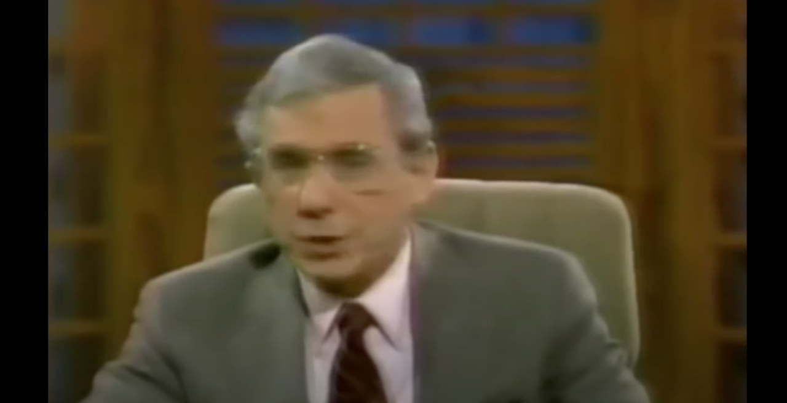
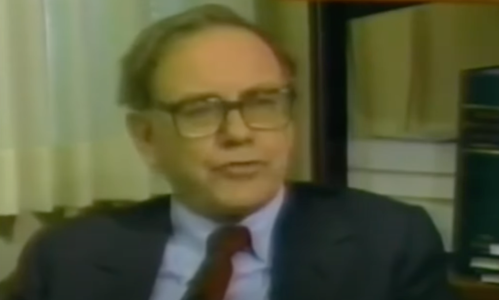
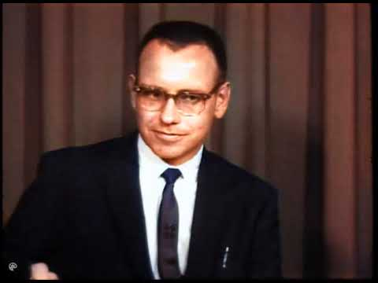

> 彦鑫：我重温了最喜欢的一次巴菲特采访。那段采访仅有七分钟，是1985年由乔治·古德曼（George Goodman）主持的。他是《机构投资者》杂志的创始人之一，并以笔名亚当·史密斯（Adam Smith）写了一本关于华尔街的书《金钱游戏》（The Money Game）。
>
> By the way：老巴第一次出现在电视上，其实是1962年，不过时长只有1分50秒，我把这段讲话放在末尾。

**视频时长7分半，以下是完整的内容**

**主持人：**

在那些以更为理性的长期策略取得成功的投资者中，有一位值得我们特别关注 —— 来自内布拉斯加州奥马哈的沃伦·巴菲特。

如果你在1965年向他的公司伯克希尔·哈撒韦投资1万美元，今天这笔钱将变成100万美元。

巴菲特是我1972年出版的《超级金钱》一书中的一个章节人物，所以我认识他很久了。他是跟随本杰明·格雷厄姆学习投资的，格雷厄姆是哥伦比亚大学证券分析领域的奠基人，被称为这门“学科”的元老。

我认为巴菲特在此之前从未上过电视，他也从未主动寻求媒体曝光，但最近他在资本城市公司收购ABC的交易中成为关键人物，因此获得了不少关注。

在新公司中，沃伦将是最大股东，他的个人净资产也已远远超过5亿美元。但当我去年秋天在奥马哈他的办公室与他交谈时，他依旧以极其朴素的方式描述了他的投资理念：

**“投资的第一条规则是不要亏钱，第二条规则是不要忘记第一条。这就是全部的规则。”**

也就是说，如果你买入的资产价格远低于其真实价值，而且你买的是一篮子这种资产，基本上你不会亏钱。

***

**主持人：你认为一个优秀的投资经理最重要的品质是什么？**

**巴菲特：** 最重要的是性格上的素质，而不是智力上的。这个行业并不要求你拥有极高的智商。我的意思是，你只需要有足够的智商能从这走到奥马哈市中心就行了，不需要能下三维象棋或打桥牌打到职业联赛那种级别。你需要的是一颗稳定的心态——既不会因为跟着大众而特别高兴，也不会因为逆势而感到满足。因为这不是靠投票决定胜负的行业，而是一个靠思考的行业。

正如本·格雷厄姆所说： “并不是因为一千个人同意你你就是对的，也不是因为一千个人反对你你就是错的。你是否正确，只取决于你的事实和逻辑是否正确。”

***

**主持人：你和市场上90%的基金经理有什么不同？**

**巴菲特：** 绝大多数职业投资人关注的是某只股票在未来一两年可能会怎么走，他们有各种复杂的方法来预测这个。

但他们并不真的把自己当作企业的部分所有者来看待。**你是否是真正的价值投资者的试金石，是看你是否在意明天股市是否开市**。如果你做的是一笔优秀的投资，那么哪怕接下来的五年市场关闭，对你也没有影响。

行情报价只是告诉我价格。我偶尔看看，看看价格是不是荒唐地高或低。但价格本身不能告诉我一家企业的任何实质。

企业的财务数据才能告诉我这家公司实际的情况。股票的价格并不能。我的做法是，先对一家企业或股票进行估值——甚至在不知道其价格的情况下，这样不会被价格干扰判断。之后再看价格，评估它是否偏离了我得出的价值。

***

**主持人：**

所以，巴菲特选择了留在这个世界的奥马哈，在市区几分钟车程外就是玉米地。

奥马哈是个好地方，但没人会说它是全球金融中心。奥马哈这儿可没有华尔街那种‘雷鸣般的牛群’，这里只有真牛在田地里走。

***

**主持人：你不觉得奥马哈离投资圈有点远吗？**

**巴菲特：** 相信也好，不信也罢——我们这里能收邮件，也能订期刊，我们能获取做决策所需的所有信息。而且与华尔街不同的是，你不会有五十个人凑过来在你耳边低语，说你今天下午应该这样那样。

**主持人：你喜欢这里缺乏刺激？**

**巴菲特：** 我喜欢刺激少。我们接触的是事实，而不是噪音。

**主持人：你怎么能一直待在离华尔街这么远的地方？**

**巴菲特：** 如果我在华尔街，我可能早就破产了。在华尔街你会过度兴奋、听到太多噪音，会让你缩短投资的视野。但短视不利于长期收益。

在这里，我能专注于企业的实际价值。我不需要去华盛顿也能判断《华盛顿邮报》值多少钱，也不需要在纽约才能分析某家公司的价值。

这是个纯粹的智力过程，而这个过程里“杂音”越少，对你越有利。

***

**主持人：什么是你说的“智力过程”？**

**巴菲特：** 智力过程是定义你擅长分析哪类企业，然后在你能力圈之内，去寻找价格最被低估的公司。有很多东西我不会评估，但也有一小部分我是有信心评估的。

**主持人：你有没有买过科技公司？**

**巴菲特：** 没有，真的没有。

**主持人：30年的投资生涯里一家公司都没有？**

**巴菲特：** 我从来都没搞懂它们。

**主持人：比如说 IBM？**

**巴菲特：** 我从没买过 IBM。这是一家非常棒的公司，绝对是家杰出的公司，但我就是没买过。

**主持人：所以，现在科技革命正如火如荼，而你却选择不参与？**

**巴菲特：** 它从我面前擦肩而过了。

**主持人：你对此感到没关系吗？**

**巴菲特：** 我完全没关系。我不需要在每一场比赛里都赚钱。我不知道可可豆价格会怎样，也不知道很多别的东西会怎样，可能有点可惜，但说实话，我也没花太多功夫去研究这些。

在证券市场里，每天都有成千上万家美国大型公司以不同价格供你挑选，而你完全没有必须决策的压力。没有人强迫你出手。

就像打棒球，不存在“好球不挥就被判出局”的规则。投手站在那一直投球。而在真正的棒球比赛里，只要球在膝盖和肩膀之间，你必须挥棒，不挥就算一个好球，累计多了就出局。

可在证券市场，你可以坐在那里，他们给你报价，比如美国钢铁25美元，通用汽车68美元。你完全可以不动手。即使这些球很好你也可以不挥。如果你还不了解，你就可以不出手。

你可以一直等，一直等，直到来了一个你真正懂得、你想要的“好球”，然后再挥棒。

**主持人：所以你可能半年都不“挥棒”？**

**巴菲特：** 甚至可能两年都不出手。

**主持人：这不会很无聊吗？**

**巴菲特：** 对大多数人来说确实会无聊。特别是职业投资经理，他们坐等一两个季度不操作，不仅自己会坐不住，客户也会在看台上开始大喊：“你倒是出手啊！”这确实很难做到。

**主持人：你这套方法看起来这么简单，为什么不是每个人都这样做？**

**巴菲特：** 我想部分原因就是它太简单了。比如学术界，他们关注各种变量，很大程度上是因为……

**主持人： ……因为教授有这些工具，对吧？**

**巴菲特：** 没错，商学院能接触到这些数据。他们研究“如果你周二买股票、周五卖股票是否更好”，或“选举年买、非选举年卖是否更划算”，或者“小公司是否更有潜力”……**因为数据可用，他们就研究这些。而且他们学会了如何处理这些数据。**

就像我一个朋友说的：“如果你手里拿着一把锤子，那你看到什么都像钉子。”

**一旦他们有了某种技能，就忍不住想用上**。但这些其实并不重要。

如果有人邀请我参与一个企业项目，我会在意我是星期二还是星期六买的吗？或者是不是选举年？当然不会。真正做企业决策的人不会那样想。

所以买股票的时候为什么要那样想呢？股票只是企业的一部分而已。

（全）

**延伸阅读：巴菲特1962年第一次在电视上露面讲话，时长1分50秒，以下是他的讲话内容：**

**1962年，年轻的沃伦·巴菲特在发言**

**巴菲特：**&#x6211;认为总统在钢铁问题上的行动，可能与这次下跌的时机有一定关系，但我不认为那是决定这次下跌幅度的主要因素。在一段时间里，股票价格一直在以相当快的速度上涨，但企业盈利并没有同步增长，股息也没有增加。因此，一些在上涨阶段出现的异常因素，出现一定程度的向下修正，并不令人意外。

**提问者：**&#x6709;些观察者不时会说，股市是对未来事件的预测工具。你能预测一下，或者愿意谈谈你认为这次下跌可能在预测什么吗？

**巴菲特：**&#x80A1;市在过去有时候确实是一个很好的预测工具，但有时候也预测得很差。

举个例子，过去四五年里，股市一路上涨，似乎在预测更好的经济形势，但实际情况并没有出现预期的改善。企业利润并没有比五年前更高，可是股票价格却高了大约50%。

所以，也许这一次，股市是在纠正它之前一个错误的预测，而不是在做一个新的正确预测。

**提问者：**&#x7B80;单地说，巴菲特先生，您能告诉我们您的看法吗？到底发生了什么？是什么导致了这次下跌？

**巴菲特：**&#x90A3;一周确实有一些被迫抛售的情况。在股市成为新闻焦点的前一周，平均股价下跌了大约6%。

一些股票因为经纪人的追加保证金通知被迫卖出，还有一些由于不当担保的银行贷款而被强行抛售，这反过来又在一段时间内形成了一个自我强化的下行机制，我们可能已经看到了这种情况的尾声，也有可能还没结束。

（全）
