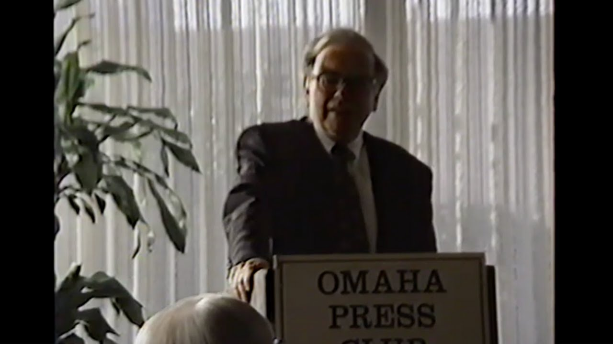

Warren Buffett | Lecture | Omaha Press Club | 1992

**开场：**

你们希望在六点准时开始。嗯，我代表奥马哈新闻俱乐部的教育委员会——成员包括温迪·卡拉汉、休·考登、沃伦·弗兰基、艾伦·加斯特、史蒂夫·墨菲、艾琳·沃斯，以及我本人克里斯·奥尔森——欢迎大家参加我们1992到1993年度首场教育研讨会。

今晚的形式主要是你们与我们嘉宾之间的问答交流。今晚的嘉宾是沃伦·巴菲特先生。我们今晚的主题是如何与新闻媒体打交道。我们希望大家的问题能集中在我们嘉宾与新闻媒体的接触（或缺乏接触）上，尤其是在一些特定事件中他如何成为新闻焦点的情况。

有一位记者从将近三十年前开始报道我们的嘉宾，他就是来自《奥马哈世界先驱报》的罗伯特·多尔，他将为我们介绍今晚的主讲人。

**罗伯特·多尔：**

谢谢。你们能听见我说话吗？嗯，我其实不知道该怎么说，在这个场合介绍沃伦·巴菲特，就像是在一场乡村音乐会上介绍加斯·布鲁克斯一样。

除了与新闻媒体打交道之外，我想大多数人也知道，他是新闻机构的拥有者之一，在《华盛顿邮报》、首都城市/美国广播公司（Capital Cities/ABC）都有大量股份，并且他还拥有《水牛城新闻报》。

作为一名曾多次与沃伦打交道的记者，我可以告诉大家，那是一种什么样的体验：他总是乐于接受采访、彬彬有礼、直率坦诚，但通常话不多。你一般需要通过与其他人交谈以及查阅公开资料，来拼凑你的新闻报道。

不过这并不是他鲜见于媒体的原因。我今天查了我们的数据库，自1983年以来，他在我们的报纸中已经被提及了862次。

沃伦说他会讲大约90秒，然后就进入问答环节。

【掌声】

***

## 应对媒体

**巴菲特：**

我感觉还好。霍华德·西蒙斯曾经在《华盛顿邮报》上说过一句话。霍华德·西蒙斯是“水门事件”时期本·布拉德利手下的常务编辑，后来领导了尼曼项目。他常常这样回应别人：在新闻行业，人们经常向你抱怨，说你又没做过生意，怎么能写商业报道？你又没打过橄榄球，怎么能写体育报道？他的回应是：“写讣告并不需要你死过一次。”

关于“如何应对新闻媒体”这个话题，我觉得可能我能给你们最好的建议是，这件事其实就像那句老话形容的——和豪猪做爱一样，要非常小心处理。但尽管如此，我对媒体依然有很深的感情。没有报纸行业，我可能今天就不会站在这里。

我祖父在1905年买下了内布拉斯加州西点市的《卡明县民主报》。信不信由你，那时候的西点市大概只有两千人，但却有两家报纸：《西点共和报》和《卡明县民主报》。他的孙子，也就是我，从祖父那里学到了一些在一个两报并存的小镇上经营报社的经验。

我祖父在那里办报，他的家人——包括我母亲、她的姐妹和兄弟——就住在报社楼上的小房间里。我母亲在11岁时，已经能够熟练地操作铅字排版机了。事实上，当时的铅字制造公司甚至希望她去得梅因市，向人们展示排字机的操作，以证明“连一个11岁的小孩都能操作这台简单的机器”。

我母亲还会每天两次到火车站——火车一天只停两次——在那里等火车，乘火车出发去采写新闻。因为在西点市新闻非常稀缺，她采访人，写稿子给报纸，还帮忙卖广告。这些都是她在高中时期做的事。她还创办了《西点高中校报》。高中毕业时她才16岁，但她在报社又工作了三年，为的是攒钱去内布拉斯加大学上学。

她一到内布拉斯加大学，第一件事就是去《每日内布拉斯加人报》申请工作。面试她的人是我父亲，他当时是那份报纸的主编。

几个月后，也就是第一个学期结束时，我外祖父失去了印刷厂的主管，因为那人自己买了一家报纸并搬去了内布拉斯加州的尤西斯。所以外祖父就打电话给我母亲，让她回来帮忙。她于是休学一个学期，回来帮忙，后来又回到了内布拉斯加大学。一年多以后，她和我父亲结婚了。

我两边的家族都对报业有着浓厚的兴趣，而这点，加上股市崩盘，我必须承认，对我的人生轨迹起了很大作用。其实我父亲本来也想进入报业。当时他还收到了来自——我想是《华尔街日报》吧——的一个工作机会，那是一家我可能现在记错了的公司。但我父亲脑子里有个过时的想法，就是他父亲为他的大学教育付了钱，所以第一份工作应该听从父亲的安排。

我祖父那边有不同的想法。于是我父亲在奥马哈成了一名股票推销员。我是在1930年出生的，但是在1929年11月左右受孕的。那些在1929年秋天还在推销股票的人应该会明白这是怎么回事。

所以，这就是我为什么会来到这里的故事。之后我一生的奋斗目标就是想办法让媒体离我的生活远一点，我想这也是我们今晚这个研讨会的主题。

我觉得最好的方式就是直接进入问答环节。我和报纸打交道已经很多年了。在大学时我曾在《林肯日报》工作，我在华盛顿时送过五条报纸路线。我当时掌握了《华盛顿邮报》全部发行量的0.2%。我还发明了一个绝妙的系统，因为我同时送《邮报》和它的竞争对手《时代先驱报》。所以即使我的服务有些不稳定，客户变动频繁，但他们总能在门口看到我微笑的脸。

曾经有位阿拉巴马的出版商说，他的成功全靠两种美国制度：垄断和裙带关系。大概我小时候送报的时候还忘了“垄断”的这一点。

好了，那我们现在就开始提问吧，问题越难越好。

***

## **国家债务**

**提问者：**

我从没想过能有机会向你提出这样的问题。我订阅了《华盛顿邮报》的全国周刊版。几年前，霍巴特·罗文在第二页的专栏中写道，美国真正的国家赤字、国家债务，大概是14万亿美元左右。那是三四年前的事了，我当时被这个说法震惊了。但好像从来没人真正去深入探讨它，我只是想知道，这说法根本站不住脚吗？因为我相信他讲的是对的。

**巴菲特：**

**哦，这是一个不错的数字，别停下来。**&#x6211;们在阿肯色州都经历了128次加税。霍巴特当时很可能说的是——他可能说的是**实际的债务总额**，那时大概是三万五千亿美元左右吧，再加上他可能还把社保体系中对人们作出的**精算承诺**的现值也计算进去了。

当你向几乎所有人承诺了一个**与通胀挂钩的退休收入**，并且你把这个承诺用**现值**计算出来时，就会得到一个庞大的数字。

但另一方面，联邦政府显然有能力在未来**对人民征税**，以某种方式完成这些**转移支付**。社会保障实际上并不是一个保险基金或保险机制，它最初确实是以这种设想开始的，但现在它被广泛接受为所谓的**代际转移支付机制**。

只要联邦政府有征税权，它可能会越来越多地征税——因为它现在的税收水平**不足以覆盖真实的精算成本**。但它同样拥有巨大的资产。

所有美国公司的总市值约为**4万亿美元**，政府从中获取34%的利润，而股东获得66%。（我这里没有计算州所得税）

你可以说，从企业盈利能力来看，政府拥有**这些公司34%的所有权**，而且它只需通过立法就能增加它的“持股比例”——例如把税率从34%提高到40%或50%。

所以，它拥有巨大的资产，也有巨大的负债。你可以从等式的任意一边去计算，但归根结底，这个国家还有很多**未被使用的征税能力**。这就是为什么人们对**4千亿美元的国家赤字**并不太担心，他们知道还有未动用的税收潜力。

当然，也许是政客们缺乏执行的意志力来动用这种能力，这种犹豫也正是为什么**美国国债依然能以全球最安全资产之一的地位出售**的原因。

***

**主持人：好，那我们换个“媒体相关”的问题吧。**

**提问者：《水牛城新闻报》会为候选人背书吗？您本人会参与这个过程吗？**

**巴菲特：**

《水牛城新闻报》是会背书候选人的。这项政策在我接手之前就已经存在了，我知道在我们1977年开始拥有它之后，这项政策也仍然保留了下来。

默里·莱特是《水牛城新闻报》的主编，他前不久刚刚退休。他每周写一篇专栏，通常情况下，报社会自行决定他们要支持谁。

很有意思的是，多年前我们从水牛城所在地区选出了五位国会候选人。我不确定现在还有没有这么多人，但当时整个SMSA（标准都市统计区）大概有一百三十万人左右。我们在1982年左右吧，给五位候选人做了背书，我记得那时杰克·坎普还是国会议员。

我们支持了：芭芭拉·康奈尔、杰克·坎普、汉克·诺克，还有另外两位。如果你去查这五位议员的投票记录，会发现**他们彼此之间几乎没有任何共同之处**。

所以我推断出，我们那时候的政策本质上就是**支持现任者（即“只要是现任就支持”）**。

不过，我们确实有一个背书制度。我们的想法是：既然我们每天都要就其他各种话题表达观点，那在选举问题上不发表观点就说不过去了。

我并不认为这种背书在总统选举中有什么影响力。**公众对竞选越不关心，报纸的背书才越有影响力**；而在总统大选这种全民聚焦的选战中，背书可能几乎没有作用。但即便如此，我还是认为我们该做这件事。

***

## **重大新闻**

**提问者：您觉得媒体现在在忽略哪些重要的新闻？**&#x6211;主要在想一些商业类的重大新闻，不过你也可以扩展到其他领域。你觉得媒体是不是有时候把某些事**夸大了其重要性**，或者有没有什么**真正重要但被忽视**、现在很适合曝光的新闻？

**巴菲特：**

这个问题我在过去20年里经常被问到。当我去《华盛顿邮报》参加他们所谓的“帕格沃什夏季聚会”时，他们总会问我：“有哪些重大新闻？”你告诉他们后，他们就会叹气。

问题在于，**重大新闻往往不是“飓风安德鲁”那种瞬间爆发的事**，而是那种**缓慢发生、日积月累**的事情。它们随着时间推进变得无聊，也没有一个特别吸引眼球的“新闻钩子”——一个能让你说“哇，这太戏剧化了”的切入点。

没人会写一篇报道说：“我今天多吃了500卡路里，比消耗多出了这么多，所以我体重增加了3盎司。”这不是新闻。但**如果20年后我比原来重了200磅，那可能就成了新闻了。**

可是，要报道那些对社会产生“冰川式影响”的事件真的非常难。

同样的问题也存在于立法事务上。人们常说，在一些重大问题上，**政策周期往往比选举周期更长**，**政策周期也比新闻周期更长**。所以这些事情在发生的过程中——因为它们是“一点点、一寸一寸地发生”——很难报道。

你看着它每天都差不多，并没有明显的变化，因此写起来非常吃力。比如说，**国家财政失衡**就是一个显而易见的重大新闻。但这个问题已经存在很久了——那你还能写出什么新意？今年赤字是3780亿美元，比去年少了10亿，又能说明什么？这样的题材真的很难写出吸引人的东西。

还有一种情况是：有些题材**过于复杂**。

20多年前，我和《奥马哈太阳报》的主编保罗·温谈过一起关于“工业贷款公司”的丑闻，这场危机在内布拉斯加可以预见地要爆发了。如果你看那些工业贷款机构的资产负债表——虽然信息很零散——再看看相关监管状况，你就会知道：这事迟早要出问题。

但我们《太阳报》内部没有任何人能够真正写这个故事。我们当时甚至讨论过：是不是应该**从外部聘请一位擅长会计和银行业**的人，来做这项特别报道。但这对编辑部士气影响很大（等于承认自己的人力不够）。

说到底，《太阳报》的记者人数也有限，我们**没有足够专业能力或人力储备**去写这类报道。事后写报道就容易了，比如“联邦储蓄危机”发生之后，写起来就顺手得多。可是在危机还在**一点点酝酿**时，写出一篇真正有分量的稿件就非常困难了。

再比如说“人口问题”。马尔萨斯两百年前就开始写这个问题了，他被人批评了两百年。可你看，现在谁愿意上电视说：“我们国家昨天又多了28000人。”五十亿人变成五十亿零几万人——你去为计划生育组织拉票，很难激起人们关注。

我认为，一些**优秀的新闻机构**——取决于他们的资源——可能最好的办法就是偶尔**做一些专题调查**、长篇报道。我记得《费城问询报》在过去五六年中做过两三次这类报道，收到很多退款申请——可能确实产生了一些影响。

但要找出真正的“大新闻”，比如尚未曝光的欺诈行为——如果我真的知道这类事情，我早就**做空那家公司**了，或者已经在行动了。

要找到**既重磅又能吸引观众/读者的新闻**，真的很难。

总的来说，这个问题没有一个完美的答案。

***

## **关于富国银行（Wells Fargo）**

**提问者：**

我想问的是最近在商业版上看到的一个具体新闻——伯克希尔·哈撒韦与富国银行的新关系。你对富国银行是否已经失去信心了？

**巴菲特：**

哦，我不对个别股票发表评论，我就此打住。我从来不会去**推荐**或者甚至是**评论**某一家具体公司。

***

**关于财务媒体的阅读偏好**

**提问者：**

如果你被限制只能订阅两份财经出版物，你会选择哪两份？

**巴菲特：**

五到十年前我可能会有不同的答案。现在我大概会选择——如果要一份日报和一份其他类型的——我可能会选《纽约时报》和《财富》杂志。我这里是**假设**我还能通过其他渠道获得类似《Value Line》这种数据统计类资料。

但就**新闻类出版物**而言，大概就是这两个。

我给你讲个有趣的故事。大概四五年前，《纽约时报》的年报里，在沙尔茨伯格（Salzburger）的致股东信的开头一段——也许是第二段——他写到：《纽约时报》已经能**实现当日发行**，覆盖美国几乎所有重要的大城市。

但那时候它根本**没在奥马哈发行**，所以我就写信给沙尔茨伯格。我写道：“亲爱的庞奇，很遗憾你在这段话里用了一个限定词（virtually 几乎）。而真正让我感到讽刺的是——我有一个住在得梅因的朋友（人口只有奥马哈的一半），他居然能**每天都拿到报纸**，而我们奥马哈却拿不到。”

我把信也抄送给了那个得梅因的朋友，他其实并不认识沙尔茨伯格，但他还是写了一封信给他，说：

“亲爱的沙尔茨伯格先生，我听说你在报纸的分发情况上有些不同的看法。得梅因的确人口比奥马哈少，而且他们拼州名的方式也挺古怪的（注：得梅因在Iowa，奥马哈在Nebraska，这是一句玩笑），但我觉得你应该考虑他的请求，可以把这件事当作你‘拓展受众’计划的一部分。最开始他可能只看星座运势，但谁知道后来会不会连头版都开始看了呢。”

就这样，《纽约时报》终于开始**当日发行到奥马哈**了。

***

**关于接受媒体采访的态度和策略**

**提问者：**

你似乎并不愿意接受媒体做“人物专访”类的采访。我想知道你是**从什么时候**开始采取这种做法的？**为什么**会这么做？你认为这种做法是个好主意吗？

**巴菲特：**

我得说，也许我不是最多，但我很可能是过去10年里在媒体上**花时间最多的CEO之一**。也许不是最多，但肯定靠前。

记者会觉得每次和我聊都要花不少时间。过去四年我被**主流媒体**做了五个专访，包括《洛杉矶时报》的琳达·格雷厄姆，《纽约时报》的L.J.戴维斯，还有几位我都记不住名字了。

此外，我还不断接到各种专门就某个话题来找我的记者的电话，比如关于**储贷协会（S\&Ls）**、**会计问题**或**银行业**等。我尽量愿意跟那些对相关主题**有一定了解的人**谈，因为如果对方完全不懂，你聊45分钟，说到底就像给他上了一堂“保险101”或“金融入门课”，最后他们可能还没搞清楚要怎么写。

这不是批评他们——只是有些议题真的非常复杂。如果记者本身对主题已经很了解，并想深入挖掘细节，那我很愿意花时间。但我必须**控制总量**，否则**可能每周要被占掉80小时**。

有些报道一出，我们可能会接到**上百个采访请求**。我们公司没有公关部门，而像所罗门公司，他们就有十几个人专门做公关。一旦出丑闻，他们还会雇很多临时帮手，公关部从12人变成30、40人也不奇怪，他们整天接电话。但我们没有这些设施，也**不觉得有必要去做这件事**。

我有时候觉得和一些记者聊天很有意思，但**不觉得有生产力**，也**没有持续兴趣**。我的标准就是：如果我知道这个记者是厉害的，那我就更愿意花时间；如果我不知道，就不太想冒险——我也不怎么愿意“试新餐厅”（比喻）。

**观众提问引用书中观点：**

书名《自由喂食狂潮》（*Freedom Feeding Frenzy*）中写道：“公众官员和许多观察人士认为记者**粗鲁、傲慢、愤世嫉俗，爱夸大其词、骚扰、炒作、极度缺乏同理心**。”

**你怎么看这个评论？**

**巴菲特：**

关于媒体的问题，我可能说得不够全面，但在全美大约1600家报纸中，我能想到的真正拥有专职媒体评论员、并且定期发表媒体批评文章的，大概只有《洛杉矶时报》，由戴维·肖（David Shaw）撰写。他写过不少很出色的内容。事实上，他们也许已经做过这件事了——我认为他们应该把戴维写的那些报道集结成一本书。几年前，他做过一次非常出色的专题，采访了四十位主编，几乎每一位都是你耳熟能详的名字，还包括像本·布拉德利这样的重量级人物。他请这些人谈一谈自己曾被媒体报道时的经历。这些主编当然也用了我们熟悉的形容词来形容媒体：粗鲁、傲慢、片面等等。但戴维发现，真正困扰他们的最大问题，是“不准确”，而第二大问题则是“记者带着预设立场采访”。

这种情况你跟任何一个打来电话的记者聊几次就会碰到。有些人心里早已写好了他们要写的故事，只是打电话来跟你聊45分钟，目的就是为了从你嘴里套出一句可以被拿去作为证据的话。对方并不关心你所讲事实的逻辑完整性，也不打算围绕问题深入探讨，他们只是“采集引语”——只想找一句能支撑他们既定观点的句子。他们可以花45分钟的时间，只为了拼出那一个可以用在稿子里的引号。

在戴维·肖的报道中，这些主编，比如《波士顿环球报》的汤姆·温希普等人，都谈到过这种现象。其中一位主编说，自从这种事发生在他身上之后，他变得更加敏感。他甚至会在完成一篇报道后，把报道中的人物换成自己家人来试读一遍——比如把受访者想象成自己的兄弟、儿子或母亲（取决于对方的年龄段），然后检查文章里有没有倾向性、有没有准确性上的问题。这是为了提醒自己不要让报道失去公正性。

说到底，这种问题很多时候是由时间压力造成的。在日报这种节奏紧迫的环境下，记者必须在很短的时间内完成采访和写作，这种时间限制造成了一种你在杂志领域或其他媒体中不容易见到的压力。在这样的条件下，记者这个群体，就像其他任何组织一样，呈现出一种“钟形曲线”：有非常有才华的人，也有毫无能力的人，大多数人都处在中间水平。你会遇到极端讲原则的人，也会遇到大多数“基本上守规矩”的人，但当故事足够大、压力足够强时，一些人可能就会在一开始的几分钟里“忘记”自己是记者的角色，甚至也有少数人是完全没有职业道德的。

总的来说，新闻行业并不比其他行业更糟，也不更好。这群人只是和你在其他地方遇到的人一样，比如内布拉斯加家具城、普通企业、教堂、军队……记者们和那些地方的人一样，有高低之分，有能力之分，有不同的道德标准。如果你和很多记者长期打交道，自然会遇到各种各样的经历。我已经不记得鲍勃刚才说过的具体数字了——我们报纸提到我好像有832次，我当然没有每次都接受了采访。但大体上，记者群体的构成和你在其他任何机构遇到的人差不多：他们大多数都努力想把工作做好，他们的能力和经验决定了他们的表现水平。你大多数时候会遇到好的经验，但也不排除会遇到一些买东西遇到麻烦的顾客，或者碰上态度糟糕的销售员。同样的道理，也适用于我们和记者的关系。

**关于新闻界**

我的意思是，我并不认为新闻界本质上和其他行业有太大不同。如果你跟媒体打交道得多了，你一定会经历一些不太好的情况，这很正常。但真正棘手的是，**几乎没有任何人——除了刺客之外——能像新闻媒体那样，在事情做错时对你造成那么大的伤害**。

当然，社会上还有其他一些角色也可能带来伤害，比如医生。根据具体情况，这种伤害有可能是**无意的**，也有可能是**蓄意的**。但通常情况下，那是一种**你自己发起的接触**——你去找医生，看诊，签署知情同意书，一切都是你“参与”进来的。所以，从整体上讲，你对这个过程有“选择参与”或“选择退出”的权利。

你走进一家家具店，可能会有一次不愉快的购物体验，但多数时候体验是好的。而在新闻行业里，**你却没有选择“退出报道”的权利**。你唯一能决定的，是你**将如何回应**这件事、如何表现自己，但你**无法选择不参与**。

如果你不幸遇到了一名记者，他的人性或专业素养都处于最差的状态，那你无论如何都被卷入其中，**你就成为了这件事的“参与者”**，不管你愿不愿意。这种情形，在社会上其实是非常罕见的。

还有一种类似的“社会权力结构”是**联邦检察官**或其他类型的检察官。他们有权决定是否对你发起起诉。仅仅是他们决定“起诉你”这件事本身，就可能对你造成巨大伤害——无论你最终是否被判有罪。他们只需启动一个程序，就能让你陷入一连串的麻烦，不论你是不是完全清白。

不过，检察官的这种权力并不会被大范围地使用。而新闻行业不同，它**天然就具备了这种影响力**。你无法从制度上彻底消除这种特性，它已经是**新闻职业本质**的一部分。

新闻业还有一个特别之处，尤其是报纸行业——那就是它**不再像我祖父那个年代了**。

**没有竞争**

全美现在有1600多家日报，而其中几乎没有哪座城市或大都市区有两家真正竞争的报纸。你能数得出来的例外屈指可数。这背后的原因其实很简单——**新闻业的经济结构天然地趋向“每个城市只保留一份报纸”**。这没什么邪恶的动机，也不是出于什么阴谋，而只是一个经济规律，是汤姆·温希普所说的“**适者生存**”。

这不是一个“红丝带”比赛（象征鼓励奖），而是一个“蓝丝带”比赛（象征冠军）。赢家能得到一切，输家什么也得不到。如果你在这场竞赛中只拿到第二名，那你就**等于没上场**。在美国，几乎找不到其他哪个行业有这样的结构。

试想一下：如果你有1600个小镇，每个小镇都只有一家汉堡店、一家银行、一家女鞋店……那么总会有人想进去竞争。做全国最好汉堡的老板，一定会盯上那些做得最差的汉堡店进场抢市场。但这种事在**报业**里是不会发生的。

比如十年前，很多人批评《曼彻斯特联合领导报》（*Manchester Union Leader*），说它是全美最差的报纸，甚至还指名道姓地讽刺老板谢恩·布雷格。但尽管当时有那么多资金充裕、人才济济的大型新闻机构，**却没有一家愿意真正地在新罕布什尔的曼彻斯特设立一家竞争报纸**。为什么？他们知道自己一定会赔得倾家荡产。

***

**优秀 vs 盈利**

大家都说“我们可以办出一份优秀的报纸”，对方办的是“糟糕的报纸”。可他们就是**不愿意进入竞争**，因为这个行业的结构**并不支持竞争**。所以，**不管你的报纸好不好，只要你是唯一的一家，你就能赚钱。**

一份办得非常棒的报纸可以赚很多钱，一份办得很差的报纸也同样可以赚很多钱，**两者之间没有本质差别**。你随便挑出一份你认为很差的报纸，我可以告诉你，它的利润率可能高达30%。

过去人们总嘲笑罗伊·汤普森（Roy Thomson），因为他一辈子从来不看自己报纸的内容。我曾在伦敦见过他，问他一个月有没有翻过一次《北安普顿邮报》。他没有，但他很清楚**这份报纸的财务数据**。对他而言，报纸只是一台印钞机。

所以那些说“我们很有钱是因为我们办得好”的说法，其实根本站不住脚。如果那逻辑成立，那汤普森就是所有人里最优秀的。但实际上，**报纸的盈利能力和它的办报水平之间没有任何相关性**。

这也就意味着，一份报纸的“好坏”，**完全取决于它的老板愿意把它办成什么样**。这在美国商业领域是很罕见的现象。你要是开一家汉堡店，做的汉堡很糟糕，那肯定马上就会有麦当劳或其他连锁品牌在你旁边开店，没过多久你就活不下去了。

如果你在一个行业中提供糟糕的服务、收高价、不守信用，那你肯定会被别的对手淘汰——除非你是政府管制的垄断企业，比如水电公司、电信公司之类的。可即便是那种垄断，**利润也是受到限制的**。

但报纸行业不一样：**你可以办得好，也可以办得烂，全看你自己愿意怎样。在这1600多份报纸里，它们的水平差距非常大，但盈利水平之间没有什么必然联系**。出版商们很讨厌谈论这个话题，但或许我们应该讨论。毕竟，如果你总是告诉编辑部“只有我们办得够好，公司才能活下去”，这其实也不失为一种有效的激励方式。

***

**电视新闻是否也一样？**

**提问者**：

“那电视新闻是不是也会走向‘一家独大’的结构？是否也会像报纸行业那样没有竞争？”

**巴菲特：**

电视是一个很有意思的例子。你去看全美前100个最大市场，看看哪个全国性电视新闻（网络新闻）最受欢迎，比如ABC、CBS、NBC。你会发现，不久以前，几乎是**100个城市中有100个**，现在可能还有**95个城市**，它们的“全国新闻收视冠军”，其实都是**当地新闻收视冠军的延续**。

换句话说，谁在**当地六点新闻**里做得最好，谁就能把观众带到**全国晚间新闻节目**中去。这是一个“引流效应”。

比如在纽约或费城，可能ABC的詹宁斯收视比CBS的丹·拉瑟和NBC的布洛考加起来还高。为什么？因为他们前面有一个强大的本地新闻团队，带来了流量。甚至《奥普拉秀》这样的节目也会极大提高接下来新闻节目的起始收视率。

这也说明了一点：一个本地新闻主播只要能多带来一两个百分点的收视率，在洛杉矶或纽约这样的城市，就**比报纸里的头号记者值钱得多**。这对我们这些热爱报纸的人来说，听起来有点悲哀，但确实是事实。

你可以是全世界最棒的评论员或编辑，也赚不到一个本地电视主播在大城市赚的钱。电视新闻节目可能都被“包装”过，有些我们也都见识过，但不得不承认，这种“包装”**确实有效**，能带来观众。

***

**电视与报纸的本质区别**

电视和报纸是**两种根本不同的业务模式**。人们每天只想看一份报纸，不会再去翻第二份——就算你把报纸从25美分降到15美分也没用。而电视则不同：你可以随意换台，看看哪个节目更吸引你。

想象一下：如果电视机像录像机一样必须选一种“格式”（比如VHS和Beta那种），你只能选一个频道，不能切换，那么一旦有一台频道胜出，它很可能就会独霸天下，把其他电视台挤死，就像VHS打败Beta那样。但现实不是这样的。

电视观众**可以自由切换频道，不需额外付费，也不需买其他设备**。这种自由的选择机制造就了完全不同的商业生态。它仍然是一个非常赚钱的行业，但**竞争逻辑完全不同**。

***

**关于财经纪实类书籍**

**提问者：**

“你会读像《老千扑克》（*Liar’s Poker*）那样的金融书籍吗？那本书讲的是华尔街，还有一些类似题材的作品。你会看这些吗？你怎么看这些书？”

**巴菲特**：

会的，我会看。我几乎什么都看。

**关于书籍**

我每天大约花七个小时在阅读上——我家人觉得其实远远不止这个时间。就像医生题材的电视剧那样，“纪实类”的新闻图书也是类似的感觉。我最近刚开始读《门口的野蛮人》（*Barbarians at the Gate*）的电影剧本，我认识里面很多角色，也读过原书。

我得说，有一两千万人，甚至三千万观众，会仅凭一个**编剧**的创作就对亨利·克拉维斯（Henry Kravis）、罗斯·约翰逊（Ross Johnson）等人形成完整印象。这个编剧虽然在一定程度上遵循了事实，但他仍然做了艺术加工，他让人物变得更戏剧化，有的甚至变成了某种 caricature（夸张的卡通化角色）。

我认识一个人，他买下了这部剧本的电影版权，那是编剧兄弟俩写的，他出价2.5万美元。他试图让亨利·克拉维斯配合拍摄，他跟亨利说：“如果你配合，我们会让施瓦辛格来演你；如果你不配合，就由丹尼·德维托来演你。”我不知道亨利最后有没有配合，但看来他最后是得到了“丹尼·德维托处理法”。

对于这种事——特别是我了解内情的一些书——你会变得非常怀疑书中所写的真实性。但我**仍然觉得它们有趣**，我还是会去读。

***

**关于《老千扑克》（Liar’s Poker）与信息失真**

我可以说，我知道里面有些内容是**严重失实的**。比如书的开头部分，迈克尔·刘易斯（Michael Lewis）描述的那段故事，**他当时根本不在纽约**，而我非常了解约翰·梅里韦瑟（John Meriwether），我几乎可以肯定那场景根本就没发生过。

但它是个好故事。而一旦故事被写出来，**你无能为力**。几百万人读了它，他们会认为那就是真实的。不管是梅里韦瑟本人，还是任何人，**都无法改变这种公众认知**。

我自己会拿很多钱去打赌那不是真的，但我也**无法证明**，因为我不可能每一分钟都站在交易大厅上亲眼目睹。但无论真假，它**的确成就了一本更吸引人的书**。

而且，这种“戏剧化”的诱惑实在太大了。我认识一些正在写书的作者，**他们的出版商明确要求他们把内容“炒作”起来**。毕竟，出版商想的是要卖书。当你给一个作者预付了50万美元、甚至一百万美元的时候，你自然期待他写出的书能**卖得出去**。

我自己曾收到过很高的预付款邀约，但我从来不会接受预付金。我也许将来会写一本书，但我不会提前拿出版商的钱，因为我不想欠他们什么。我要写什么、怎么写，得由我自己决定，而不是带着出版方的压力写出什么“畅销品”。

我对那些被书中“误写”或“夸张处理”的人抱有很大的同情，尤其是当这些内容被拍成影视作品时，**这种伤害的潜力就更大了**。

***

**关于肯尼迪（JFK）与影视化的影响**

一部书或电影的内容不需要完全错误，它**只要被搬上银幕**，其对公众认知的影响就已经足以改变一切。观众在看一部戏剧性、带有艺术加工的改编作品时，并不会去查证它是否真实。这就使得**被描写者，哪怕完全无辜，也可能被公众误解甚至“定罪”**。

所以说，这类作品拥有极大的力量，也因此承载着巨大的责任。

**关于荧幕与历史记忆的扭曲**

你知道，我也不知道尼克松在“水门事件”期间到底有没有真的和基辛格一起跪下祷告，这事真假无从查证。但关键是——**这已经不重要了**。一旦这样的画面被搬上荧幕，**成千上万的人就会相信那是真的**。

这正是我**非常反感电影《JFK》的地方**。我认为，那部电影与历史事实相符的可能性**极其之低**。但20年后，可能**会有比以往任何版本都多的人**把那部电影当作历史的真实记录。

荧幕的力量实在太强大了。书籍固然有影响力，但相比之下，**影视画面所能施加的影响要更直接、更深入人心**。

***

**关于所罗门事件：是否操纵媒体？**

有人批评说我在处理所罗门兄弟公司丑闻时“操纵了媒体”。但**毫无疑问，我们必须跟媒体沟通**——他们每天都会写点什么，如果你不说，那他们只能凭猜测。

我第一次去公司是在八月的一个星期天，我们召开了新闻发布会。当天来了两百多个记者，大多数穿着短裤，因为是周末。但我必须把我在过去48小时内了解到的情况，**如实地告诉他们**。虽然不能保证每个细节都完全准确，但我已经**明确地告诉他们我所知道的一切**。我对此没有任何保留。

这样一来，**至少他们能从我所掌握的事实出发，开始做判断**。

后来在国会听证会上，我们提交了五十到六十份正式陈述，把我们所掌握的**每一个事实**都写在里面，并承诺一旦有新信息会持续更新。毫无疑问，**一旦你手头有丑闻，最好的处理方法就是彻底摊开讲清楚**。

***

**不要撒谎，不要听律师**

我的看法是：**一定要把你知道的一切都讲出来，绝不能撒谎，不管在什么情况下都不要说假话**。**别听律师的**。

我知道在座有些人是律师，但我后面会讲给你们听。律师们常常建议你什么都别说，保持沉默。但外部世界已经在飞速做出判断，而公众对事件的了解往往是支离破碎的。他们不了解来龙去脉，甚至都还没搞清楚涉及了哪些人。

比如说水门事件，刚开始你甚至都叫不上这些人的名字。后来是在厄文委员会的调查下，事情才慢慢清晰起来，那些当事人开始互相甩锅，媒体也时常报道不准。

你只能尽可能**尽早建立一套事实框架**，并坚持在这个框架内透明公开。最大的风险在于：**如果你后来被某个你没预料到的事情打个措手不及，而且那件事与你此前的说法发生冲突，那你就麻烦大了。**

但如果你也能把这个情况**坦率讲清楚**，别人一看也会明白：你之前是真的不知道，只是后来才发现。整个过程中，我始终坚持一个原则：**讲你知道的一切，坦率面对每一件事。**

我们甚至主动放弃了律师与客户之间的保密权，把所有资料都交给了政府。很多内容很快就公开了。

当然，我们也遇到过有人利用这种危机牟利。比如当时有些做空我们股票的人打电话给国会小组委员会、打电话给媒体。我知道好几次是同一个人用不同的名字打来电话，向《所罗门兄弟日报》的记者报料，制造各种谣言，比如外汇交易问题之类的。

***

**媒体危机是一场多维“火灾”**

在那段时间里，**信息爆炸、攻击四面八方、真假难辨**，它就是一场**多维度的大火**。你不可能做到完美，但只要你始终保持透明，就永远不会把自己困死。

当然，这也要看你**是否是当事人之一**。如果你是像约翰·迪恩那样的“中心人物”，那肯定是另一回事了。

顺便说一句，我的朋友吉姆·伯克曾经面对泰诺止痛药的危机。当时有人投毒。他几乎完全**无视律师的建议**，把产品责任、所有信息**全都公开了出来**。他每天工作18小时，这场危机持续了五到六个星期，但他做得非常出色。

他的案例，其实就是一个非常好的榜样。

**关于“最低共识新闻”与媒体影响**

问题在于，你最终会陷入所谓的“最低共识新闻”（Lowest Common Denominator Journalism）。这意味着，某个人写了一个故事之后，它就会在媒体的“食物链”里逐层扩散。像亚瑟·阿什（Arthur Ashe）的那件事，我个人——如果我是某大报的主编，而全国其他媒体都在报道这个消息，或者我是某电视台的新闻总监——我恐怕也会倾向于报道它。**一旦新闻开始传播，惯性就会推动它不断向前。**

但我不觉得这是特别严重的问题。**宪法里并没有所谓“人民有知情权”的条款**。我们有时会把这句话拿出来，当我们做了一些事，心里觉得其实不太应该，但又想找个理由为自己辩护时，就说“人民有知情权”。但实际上宪法里根本没有这么说。宪法保障的是**言论自由的权利**，而不是“知情的权利”。

就我个人而言，Arthur Ashe的健康状况和我无关——他又不是要跟我打网球，也不是要约我女儿出去——那不是我应该关心的事。但这种新闻不会停止，它还会继续出现。

***

**媒体投资是否还有吸引力？**

**提问者：**

媒体今天是不是还值得投资？如果不是，有哪些领域可能值得关注（不涉及具体公司）？

**巴菲特：**

我在伯克希尔1991年的年度报告里专门写过一个章节谈这个问题，我们很乐意寄给你一份。**我说的是：媒体行业依然很出色——但没有以前那么出色了。**

和其他行业相比，它仍然是个好行业，资本回报率很高，是一个“非常不错的行业”，但它的吸引力确实比过去有所下降。

举个例子，这就是为什么“美国新闻出版协会”不喜欢电话公司自由竞争的原因。他们其实不怎么支持对方享有言论自由。

我和朋友汤姆·墨菲（Tom Murphy）有一次在我姐姐家看《星期一橄榄球之夜》，45英寸的大屏幕，很震撼。这是ABC的节目，我对墨菲说：“节目太棒了，画质也好。”当年我们还在用8英寸的黑白电视机，只有我们仨能看到节目。

以前像百威（Anheuser）或通用汽车想打广告，都要找我们，我们每年都能涨价，那生意真是太好了。

**那时，全美只有三条电子高速公路**，也就是三大电视网，它们覆盖了几乎每一个家庭。内容供给方很多，但只有三条通道，所以**通道本身就值钱**。而现在，有无数“高速公路”，真正值钱的是“内容”——是像迈克·泰森或者好莱坞那样的“天赋型资源”。

我们这些“通道方”就变成了“又一个电子通道”，而不再是唯一的。这让媒体公司的价值被稀释了。虽然它仍然是好生意，但和过去比，差距不小。

***

**美国邮政系统是报纸最大威胁**

邮政服务对报业的影响，比许多看得见的对手更大。我曾对《华盛顿邮报》说，你们担心的是《华盛顿星报》抢你们的连环漫画？你可以让他们先挑全美最棒的一百位记者，全都雇去也没关系，但那对《华盛顿邮报》的股价影响连**八分之一点都不到**。

但如果让**美国邮政将第三类邮件费率下调20%**，那对你们的财务影响就会相当明显。或者说，让电话公司进入分类广告市场，那才是报业真正的竞争对手。

***

**媒体对市场情绪的影响**

**提问者：**

你写过不少关于“情绪对市场影响”的内容。媒体能在多大程度上左右这种情绪？你怎么看媒体对具体股票价格的短期影响？

**巴菲特：**

媒体的节奏太快，很难说出什么对长期投资真正重要的事。我们真正想知道的是：下一支“可口可乐”在哪里？如果你在1990年花40美元买了可口可乐股票，到今天你可能已经拿到了180万美元的回报。

**这种投资机会不会被媒体挖掘出来**——因为它的“展开速度”太慢，不适合新闻节奏。

但媒体确实可以在短期里制造波动。比如有篇文章让某只股票大涨，随后有人在《今日美国》上说了几句话，股票又暴跌。这种影响确实存在，但主要是**短期情绪驱动**。

***

**媒体记者与投资的“故事选题”**

实际上，媒体记者和我做的是类似的事。**我每天的工作，就是“给自己布置一个采访任务”**，研究一家公司，评估它的管理层、产品、服务、成本、市场竞争力——这本质上是“报道一家公司”。

我每天早上来到办公室，都会“给自己一个新闻选题”，可能是某个事件引发的，核心问题就是：“X公司值多少钱？”这就是我要调查的故事。

1973年，当我们以8000万美元估值买下《华盛顿邮报》公司时，鲍勃·伍德沃德正在调查“水门事件”。如果那时编辑布拉德利对伍德沃德说：“你花一周时间，去调查《华盛顿邮报》值多少钱。”我敢说，**如果他认真做了，最后一定会得出‘值4亿美元’的结论**，因为它当时真的就是那个价值。

但他没选这个“故事选题”。如果他选了，早就发了大财了。

我经常对记者说：“你们都来问我该买什么股票，我的建议是——**给自己布置个选题**，每天早上六点到七点研究一个小时。剩下八九个小时，你可以继续为主编布拉德利干活。”

**找到正确的选题是90%的投资成功秘诀**。真正去研究其实没那么难。

很多记者研究伯克希尔20多年，报道我们的事，却从来不买我们的股票。其实他们完全可以，只要向编辑报备、不在刊发前买入，符合伦理规定就行。

**他们眼睛看到了，脑子却没行动**。

***

**总结：媒体偏好“赛马游戏”，但深度报道仍存在**

每四年一次的选举周期里，我总会看到这种现象：**人们喜欢看选举“赛马游戏”**，而记者们更爱写这些——哪怕它对国家有没有益处都说不清楚，但**就是好看、刺激、有趣**。

你每天抢报纸来看，那些狗血的新闻吸引你注意。但也有一些媒体，比如《纽约时报》和《华盛顿邮报》，它们仍在认真报道候选人的言行。你如果订阅那份《华盛顿邮报》每周版，其实里面信息非常丰富，记者也很认真。

只是说，这些**严肃报道的读者数量，远远比不上詹妮弗·弗劳尔斯这样的八卦新闻**。但这些报道**仍然存在，有人在认真做事**。

而你要在电视新闻里找这些内容？**22分钟的节目时长是远远不够的。**

***

**\[掌声]**

**主持人：**
今晚的活动就到这里。很多朋友接下来将与巴菲特先生一起前往俱乐部共进晚餐。请大家不要挤在一部电梯里，会有足够的时间上楼。

本次活动结束，再次感谢巴菲特先生。谢谢大家。
