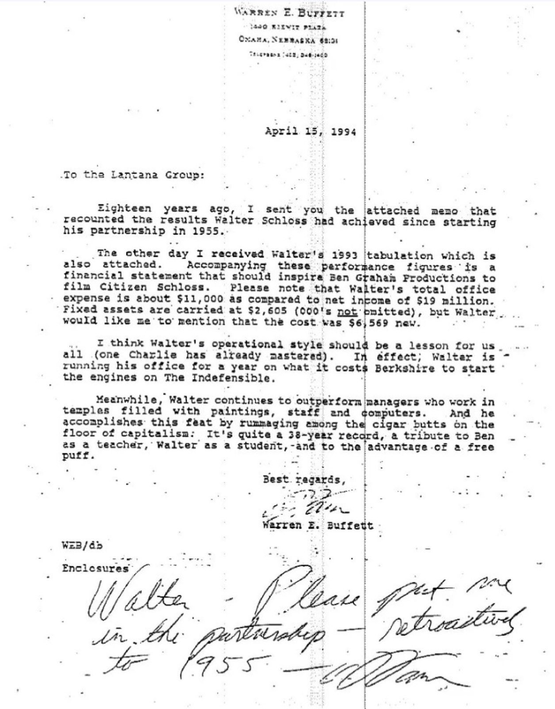

> “Lantana Group” 并非一家公开的公司或机构企业，而是沃伦·巴菲特在其私人通信中用来称呼的一个**投资者合伙人群体**，其背景和具体成员并未广泛公开。

沃伦·E·巴菲特

1440 基尤特广场

奥马哈，内布拉斯加州 68131

电话：1-402-346-1400

1994年4月15日

致 Lantana Group：

十八年前，我曾将附上的备忘录寄给你们，内容是回顾 Walter Schloss（沃尔特•施洛斯） 自1955年成立合伙企业以来所取得的投资成果。

前几天我收到了 Walter 的1993年收益汇总，也附在此信中。随这些业绩数据一同寄来的，还有一份财务报表，这份报表应该足以激励 “本·格雷厄姆影视制作公司”拍一部以“公民施洛斯”为题材的影片。请注意，沃尔特•施洛斯的全年办公室开支大约为11,000美元，而其净利润则为1900万美元。固定资产账面值为2,605美元（未取整至千位），沃尔特还特别让我说明：这些设备当初购买时的价格是6,569美元。

我认为 沃尔特 的运营方式应当成为我们的榜样（查理已经完全掌握了这一点）。事实上，沃尔特 一年的办公室运营成本，还不及 伯克希尔 启动一台喷气发动机所需的费用。

与此同时，沃尔特依然持续击败那些在豪华办公室中工作的经理人——那些办公室里摆满了画作、员工和电脑。而 Walter 靠的是在地板上的“雪茄烟蒂”中翻找机会来实现这些业绩。这正是“烟蒂式资本主义”的最佳诠释：这份三十年的成绩单，是对老师（本.格雷厄姆）的致敬、对学生（沃尔特）的肯定，也是对“一口免费的烟”的礼赞。

此致

敬礼

沃伦·E·巴菲特

WEB/db

附件：

（手写附注）

**Walter in the partnership since 1955 – Please put one – retroactive! – Ram**

（全）

