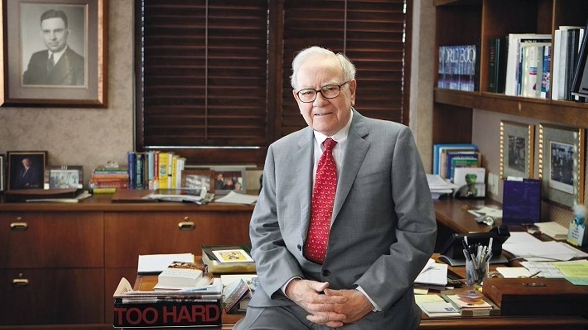

[ownman 股东原则.pdf]()

> 彦鑫：这本巴菲特撰写的《股东手册》浓缩了伯克希尔60余年的经营智慧。全书围绕13条“股东相关原则”和两条新增原则，深入阐述了公司与股东的伙伴关系、资本配置理念、风险与债务态度、衡量内在价值的方法，以及对管理团队的授权与接班安排。他用朴实直接的语言，分享了如何像对待自家资金一样使用股东资金，如何在诱惑面前保持理性，以及如何看待长期价值与短期波动。无论投资新手还是老手，都能从中收获长期主义的力量。

1996年6月，伯克希尔董事长沃伦·E·巴菲特向伯克希尔A类和B类股东发布了一本名为《股东手册》的小册子。该手册旨在阐述伯克希尔的整体经营经济原则。本页及接下来的页面刊载了更新后的版本。

**与股东相关的经营原则**

在1983年与蓝筹公司合并时，我列出了13条与股东相关的经营原则，我认为这些原则有助于新股东理解我们的管理方式。正如“原则”一词所体现的，这13条原则至今依然有效，并保持良好运作，现以斜体列出如下。

*1、虽然我们的组织形式是公司，但我们秉持的是合伙人的心态。查理·芒格和我，把股东视为共同的所有者，把自己视为管理合伙人。（因为持股规模的缘故，我们在好坏意义上，都是控股合伙人。）我们并不把公司本身看作业务资产的最终所有者，而是把它看作一个渠道，让股东通过它间接拥有这些资产。*

我们希望你不要把自己仅仅看作是持有一张每天价格起伏不定的纸，遇到经济或政治事件就紧张不安。更理想的方式，是把自己当作企业的部分所有者，并打算长期持有，就像你拥有一座农场或一栋公寓楼，与家人合伙经营一样。在我们眼中，伯克希尔股东不是一群随时会更替的陌生人，而是把资金托付给我们、可能与我们共度余生的合作伙伴。

事实表明，大多数伯克希尔股东确实接受了这种长期合伙理念。伯克希尔股票的年换手率，只有其他大型美国公司股票的一小部分，即便不计入我们自己持有的股份也是如此。

实际上，股东对伯克希尔的态度，正如伯克希尔对所投资企业的态度。比如持有可口可乐或美国运通时，我们把自己看作非管理型合伙人，以它们长期的经营成果来衡量成败，而不是盯着股票的短期波动。事实上，即使几年没有交易或报价，我们也不在意。只要长期前景乐观，短期价格变化对我们来说毫无影响，除非它们带来了以合理价格增加持股的机会。

**2、***秉持伯克希尔“所有者导向”的理念，我们的大多数董事都将净资产中相当大的一部分投入到公司里——我们自己投资自己经营的事业。*

查理的家族将其大部分净资产都投在伯克希尔股票上；我个人的比例超过 98%。另外，我的许多亲属——比如我的姐妹和堂表兄弟姐妹——也把很大一部分净资产放在伯克希尔。

我们对这种“鸡蛋全放在一个篮子”的情况很安心，因为伯克希尔本身拥有种类丰富、质量卓越的企业。事实上，我们相信伯克希尔在所持控股或重要少数股权的企业的质量和多样性上几乎独一无二。

查理和我不能向你承诺具体的投资结果，但可以保证，在你选择与我们合作的整个期间，你的财务状况会和我们同步起伏。我们不追求高薪、期权或其他从你身上占便宜的方式。我们只在合伙人赚钱时赚钱，而且比例完全相同。再者，如果我做了蠢事，希望你至少能从中获得一点安慰——因为我亏的会和你一样多。

**3、***我们的长期经济目标（稍后会有一些限定说明）是：在每股基础上，最大化伯克希尔内在商业价值的平均年增长率。我们不以公司规模来衡量经济意义或业绩，而是看“每股”的进展。我们很清楚，随着资本基数的大幅扩大，未来每股增长的速度会放缓。但如果我们的增长率不超过大型美国公司的平均水平，我们会感到失望。*

**4、***我们更倾向于通过直接持有一组多元化企业来实现目标，这些企业能够产生现金，并持续获得高于平均水平的资本回报。其次的选择是持有类似企业的部分股权，主要通过我们的保险子公司购买可流通的普通股来实现。企业的价格与可得性，以及保险资金的需求，将决定某一年资本的分配方向。*

近年来，我们完成了多笔收购。虽然也会有“空窗期”，但我们预期未来几十年会有更多收购机会，并希望它们和过去一样出色。如果能做到这一点，伯克希尔将持续受益。

我们的挑战在于能否以与产生现金同样快的速度找到投资机会。在这方面，低迷的股市往往会给我们带来显著优势：第一，它会压低整个企业的收购价格；第二，它能让我们的保险公司以合理的价格购买优秀企业的小额股份——包括那些我们已持有的企业的更多股份；第三，这些优秀企业往往会回购自身股票，这意味着它们和我们都能从更低的价格中受益。

总体来说，伯克希尔和其长期股东对下跌的股市反应，就像常年购买食品的人对食品价格下跌的反应一样——这是利好消息，而非恐慌或悲伤的理由。

**5、***由于我们采用双轨制的企业持有方式，加上传统会计核算的局限性，合并后的财报数据未必能准确反映我们的真实经营状况。查理和我既是所有者又是管理者，因此几乎不会参考这些合并数据。不过，我们会向你报告每家重要控股公司的盈利情况，并结合其他信息供你判断。*

简单来说，我们努力在年报中呈现真正重要的数据和信息。我们非常关注每家企业的经营表现，同时也会研究其所处的行业环境——比如它是顺风而行还是逆风前行。查理和我会据此调整预期，并将结论分享给你。

大多数时候，我们的实际表现超过预期，但偶尔也会失望。当我们采用非常规手段应对挑战时，比如年报里你会看到的保险“浮存金”部分，我们会如实解释原因和效果。我们相信，向你讲清实际结果和管理逻辑同样重要，这样你既能看到伯克希尔的经营成果，也能了解我们的管理方式与资本配置思路。

***6、**&#x4F1A;计结果并不会左右我们的经营或资本配置决策。当收购成本差不多时，我们更愿意用同样的资金，买入每股可带来 2 美元、但不会计入当期财务报表的收益，而不是买入每股 1 美元且会计上计入的收益。这种情况常见于收购整家公司与仅购入部分股权的选择中，因为部分股权（收益多为不可计入报表）往往只按全额比例价格的一半出售。从整体和长期来看，我们预计这些未计入报表的收益，最终会完全反映在我们内在价值的资本增值中。*

长期以来，我们发现，被投资企业留存的未分配收益，对伯克希尔的价值提升作用，与直接分配给我们再投资的效果几乎相同。这是因为大多数被投资企业会高效运用新增资本，不是投入业务扩大经营，就是回购股票。虽然并非每一笔资本运用决策都直接使我们受益，但总体来看，我们为每一美元留存收益获得的价值远超一美元。因此，我们将“透视收益”视为更真实反映年度经营成果的指标。

***7、**&#x6211;们很少举债。相比用更多杠杆压满资产负债表，我们宁可放弃一些机会。这种保守的做法虽然在收益上有时吃亏，但让我们心安——尤其是在肩负保单持有人、债权人和将大量净资产托付给我们的股东的责任时。正如印第安纳波利斯 500 赛车的冠军所说：“想冲到终点，首先得完赛。”*

查理和我不会为了多挣几个百分点而牺牲安稳的睡眠。我从不相信，要冒着失去家人朋友已经拥有并需要之物的风险，去追求他们并不需要的东西。

此外，伯克希尔还有两种低成本、低风险的融资来源，让我们能在自有资本之外安全持有更多资产：递延税款和“浮存金”。浮存金来自保险业务收取的保费，在支付赔款前可供我们使用。这两项资金如今合计约 1700 亿美元，而且大多情况下成本为零。递延税款不需要支付利息；只要保险承保盈亏打平或更好，浮存金成本几乎为零。它们虽然在会计上是负债，但没有契约限制或到期日，既能发挥债务的作用，又没有债务的弊端。

当然，未来我们未必还能以零成本获取浮存金，但我们相信，在这方面的实力不输给任何一家保险公司。自 1996 年收购 GEICO 以来，我们实现这一目标的能力明显增强。

目前，我们预计新增借款将主要集中在公用事业和铁路业务上，并会优先选择长期、固定利率、且不对伯克希尔本身追索的贷款。

***8、**&#x6211;们不会为了满足管理层的“愿望清单”而让股东买单。也不会忽视股东的长期经济利益，而去高价收购整个企业的控股权。我们花你们的钱，就像花自己的钱一样谨慎，并会仔细权衡——毕竟有时候，你们自己分散投资、直接在股市买股票，可能获得的回报和我们做的一样好，甚至更好。*

查理和我只对那些我们相信能提高伯克希尔每股内在价值的收购感兴趣。我们的薪酬或办公室规模永远不会与伯克希尔资产负债表的规模挂钩。

***9、**&#x6211;们认为，好意必须接受现实的检验。我们通过一个“五年滚动”的测试，来判断留存收益是否值得保留：长期来看，每留存1美元收益，是否至少带来了1美元的市值增长。到目前为止，这项标准一直被满足。但随着净资产的增加，要让留存收益发挥作用会越来越难。*

这个“五年滚动”标准在表述上我曾有失误。回顾历史，当股市连续五年下跌时，我们的市净率会收窄，导致测试失败。事实上，这种情况早在1971-1975年就发生过，比我1983年正式写下这个原则还要早得多。

五年测试应包括两点：（1）在此期间，我们的每股账面价值增幅是否超过标普指数的表现；（2）我们的股票是否一直以高于账面价值的价格交易，这意味着每1美元留存收益始终价值超过1美元市值。如果满足这两个条件，留存收益就是合理的。

***10、**&#x6211;们只会在获得等值业务价值时才发行普通股。这个原则适用于所有形式的发行——不仅是并购或公开增发，还包括以股换债、期权或可转债。我们不会在价值不匹配时卖出哪怕一小部分公司股份，因为那等于在贱卖整家公司。*

当我们在1996年出售B类股票时，我们明确表示股票并未被低估，这让一些人感到意外。这种反应并不恰当。真正应当感到震惊的，是我们在公司股票被低估时发行股票。那些在公开发行时声称公司股票被低估的管理层，其实是在用股东的钱做亏本交易：如果管理层故意以80美分的价格出售价值1美元的资产，股东几乎必然会受损。在我们发行B类股时，我们并没有犯这种性质的错误——但我们也没有反驳媒体关于我们股票被高估的说法，尽管许多媒体当时有这样的报道。

*11、你必须充分了解我和查理都持有的一种态度，这种态度会对我们的财务表现造成影响：无论价格多高，我们都完全没有兴趣出售伯克希尔所拥有的任何优质企业。对于表现不佳的企业，只要我们预计它们至少能产生一些现金流，并且我们对其管理层和劳资关系感到满意，我们也非常不愿意出售。我们不想重蹈当初资本配置失误、让我们陷入这类表现不佳企业的覆辙。对于那些建议通过大规模资本投入来让经营不佳的企业恢复到令人满意盈利水平的提议，我们会极其谨慎。（这些预测往往会很诱人，提议者也真诚，但最终，在糟糕的行业中追加巨额投资，通常就像在流沙中挣扎一样无果。）不过，我们不会采取“金拉米”式的管理手法（即在每一步中丢弃最不看好的业务），这并不是我们的风格。我们宁愿让整体业绩受到一点影响，也不愿从事这种行为。*

我们至今仍避免“金拉米”式的管理。没错，在与纺织业务周旋了 20 年后，我们于上世纪 80 年代中期关停了它，但那只是因为我们认为它注定会陷入无休止的经营亏损。

然而，我们从未考虑出售那些可以卖出极高价格的业务，也没有抛弃那些暂时落后的业务——相反，我们专注于解决它们落后的根本原因。为澄清 2016 年出现的一些误解，我们特此强调，这里的评论针对的是我们控股的业务，而非可流通证券。

***12、**&#x6211;们在向你们报告时会保持坦诚，着重强调在评估企业价值时至关重要的优缺点。我们的准则是：告诉你们那些在角色互换的情况下，我们希望从你们那里得知的业务事实。你们理应得到这样的信息。*

*此外，作为一家拥有大型传播业务的公司，如果我们在报告自身情况时，采用的准确性、平衡性和犀利程度低于我们要求新闻工作者在报道他人时所应具备的标准，那将是不可原谅的。我们还认为，坦诚对管理者本身也有好处：在公众面前误导他人的 CEO，最终很可能会在私下里也对自己撒谎。*

在伯克希尔，你们不会看到任何“大洗澡”式的会计操作或重组，也不会看到任何季度或年度业绩的“粉饰”。我们始终会如实告诉你们，我们在每一洞打了多少杆，从不在记分卡上动手脚。即便在保险准备金上，数字必然会带有很强的“估算”成分，我们也会尽量做到既一致又审慎。

我们将通过多种方式与你们沟通。通过年度报告，我尽量为全体股东提供尽可能多、且有价值的关键信息，同时保持篇幅适中。我们还会在网络上发布季度报告中精简但重要的信息（不过这些不是我亲笔撰写的——一年一次的年度总结就够了）。另一项重要的沟通机会是年度股东大会，在会上，查理和我乐意花上五个小时甚至更多，回答关于伯克希尔的各种问题。但有一种方式我们无法做到：与成千上万股东中的单个股东进行一对一交流——这在伯克希尔的规模下不可行。

在所有沟通中，我们都尽力确保没有任何一位股东能获得不公平的信息优势。我们不会像惯常做法那样，向分析师或大股东提供业绩“指引”或其他信息。我们的目标是让所有股东在同一时间获得最新的公司动态。

***13、**&#x5C3D;管我们一贯主张坦诚，但对于可交易证券的投资活动，我们只会在法律要求的范围内进行披露。好的投资理念十分稀缺、宝贵，并且同优质产品或业务收购理念一样，容易被竞争对手抢占。因此，我们通常不会谈论自己的投资想法。这个限制甚至适用于我们已经卖出的股票（因为我们可能会再次买入），以及那些被错误传闻称我们正在购买的股票。如果我们一味否认这些报道，而在其他时候又保持沉默，“无可奉告”反而会被当作确认。*

虽然我们依然不会谈论具体的股票，但我们乐于公开讨论公司的业务和投资理念。我本人从本·格雷厄姆——这位金融史上最伟大的老师——的慷慨分享中获益匪浅。我认为，将我从他那里学到的知识传递下去是理所当然的，即便这会为伯克希尔带来新的、强有力的投资竞争者，就像格雷厄姆的教诲曾为他带来的一样。

**新增两条原则**

***14、**&#x5728;可能的范围内，我们希望每位伯克希尔股东在持有期间，其市值收益或亏损能与同期每股内在价值的变化大致成比例。要做到这一点，伯克希尔股票的市场价格与内在价值之间的关系必须保持稳定，我们理想中的比例是 1:1。这意味着，我们宁愿伯克希尔的股价维持在一个合理水平，也不愿处于高位。显然，查理和我无法直接控制伯克希尔的股价，但我们可以通过公司的政策与沟通，来鼓励股东理性、知情地行事，而这反过来也有助于形成合理的股价。我们“不高估也不低估”的理念，可能会让一些股东失望，但我们相信，这能为伯克希尔吸引到最合适的长期投资者——那些愿意依靠公司业绩增长获利，而不是靠合作伙伴的投资失误赚钱的人。*

***15、**&#x6211;们会定期将伯克希尔每股账面价值的增长，与标普500指数的表现进行比较。长期来看，我们希望超越这一基准。否则，投资者又为何选择我们呢？不过，这种衡量方式也有缺陷，在下一节会详细说明。而且，如今它在年度的意义上比过去更弱，原因是伯克希尔的股权投资（价值随标普500波动）在我们净资产中所占比例已比早年小得多。此外，在计算标普500指数时，其成分股涨幅是全额计入的，但伯克希尔的股权投资涨幅会因为我们需缴纳的联邦税而按 79% 计入。因此，我们预计在股市低迷的年份能跑赢标普500，而在股市大年则可能落后于它。*

**内在价值**

现在，让我们关注一个我之前提到过的术语——内在价值，你也会在未来的年度报告中看到它。

内在价值是一个极为重要的概念，它提供了唯一合理的方法，用来评估投资和企业的相对吸引力。内在价值可以简单地定义为：在一家企业剩余的存续期内，可以从中提取的现金的折现值。

不过，计算内在价值并不简单。正如我们的定义所暗示的，内在价值是一个估算值，而不是一个精确的数字，而且它还必须随着利率的变化或未来现金流预测的调整而修正。即使是两个人在看到同一组事实的情况下——这同样适用于我和查理——几乎也必然会得出至少略有不同的内在价值估算。这也是我们从不向你们提供内在价值估算的原因之一。不过，我们的年度报告会提供的是我们用来计算该价值的事实数据。

与此同时，我们会定期报告每股账面价值，这是一个容易计算的数字，但其用途有限。它的局限性并不是因为我们持有的可流通证券（这些证券在账面上按当前价格计入），而是因为我们所控股的公司——它们在账面上列示的价值可能与其内在价值存在很大差异。

这种差异可能会向任一方向发展。例如，在 1964 年，我们可以很有把握地说，伯克希尔的每股账面价值为 19.46 美元。然而，这个数字大大高估了公司的内在价值，因为当时公司所有的资源都被困在一个收益不佳的纺织业务中。我们的纺织资产的持续经营价值或清算价值都低于其账面价值。如今，伯克希尔的情况则完全相反：我们的账面价值远远低估了公司的内在价值，这一点是真实的，因为我们持有的许多企业的实际价值远高于其账面价值。

尽管账面价值在反映真实情况方面有所不足，但它如今至少能够作为伯克希尔内在价值变化的一个粗略（但明显低估的）衡量标准。换句话说，某一年账面价值的百分比变化，很可能可以合理反映该年内在价值的变化幅度。

你可以通过一种投资形式——大学教育，来更好地理解账面价值与内在价值的差异。可以将教育的成本看作它的“账面价值”。如果要准确计算这一成本，就应当把学生因为选择上大学而放弃工作的收入也计算在内。

在这个例子中，我们将忽略教育带来的非经济利益，仅关注其经济价值。首先，我们必须估算毕业生在其一生中能获得的收入，然后从这个数字中减去如果他缺乏教育将会获得的收入。差额就是超额收益，这个数字需要用适当的利率折现回毕业那一年。折现后的金额，就是教育的内在经济价值。

有些毕业生会发现，教育的账面价值超过了其内在价值，这意味着支付教育费用的人并没有获得等值的回报。在其他情况下，教育的内在价值会远高于账面价值，这证明资本得到了明智的运用。不论哪种情况，账面价值都不能作为内在价值的有效指标。

**伯克希尔的管理**

我觉得有必要在结尾谈一谈伯克希尔现在及未来的管理。如我们的首条股东相关原则所说，查理和我是伯克希尔的管理合伙人。但我们几乎将所有繁重的执行工作外包给子公司管理层。实际上，我们的放权几近“退位”：伯克希尔约有 37.7 万名员工，但总部只有 26 人。

我和查理主要负责资本分配，以及照顾和支持我们的核心经理人。多数经理人在被完全放手时最快乐，而我们也一贯如此放手。这让他们全权负责运营决策，并将多余的现金上缴总部，由我们来投资，从而避免他们被各种花钱的诱因分散注意力。我们能接触到的投资机会范围，也远比任何单个经理人在自己行业内找到的更广。

我们的经理人多数都非常独立，因此我们要营造一种氛围，让他们宁愿为伯克希尔工作，也不去打高尔夫或钓鱼。这要求我们公平对待他们，并以换位思考的方式来处理与他们的关系。

关于资本分配，这是我和查理都乐在其中、并积累了不少经验的工作。总体来说，这个领域并不需要敏捷的手眼协调或强壮的肌肉（谢天谢地），只要大脑依然灵光，我们就能像过去一样胜任工作。

在我去世时，伯克希尔的持股格局不会出现剧烈变化：我名下的股票不必出售来支付遗赠或税款，这些费用将由我名下的其他资产承担。伯克希尔的全部股票将留给基金会，并在大约十年或更长时间里分批捐出。

在我去世后，巴菲特家族不会直接管理公司业务，但作为重要股东，会参与挑选并监督管理层。具体人选当然取决于我去世的时间，但我可以预见，管理架构将分为两部分：一位执行官担任 CEO 负责运营，另一位或数位执行官负责投资。如果有新的收购机会，这些高管会在董事会批准下协作决策。我们会继续保持一个利益与股东高度一致、且极具股东意识的董事会。

如果近期就需要这样的管理架构，董事会已经清楚我对两个职位的人选推荐。现有候选人要么已经在伯克希尔任职，要么随时可以加入，而且都是我完全信任的人。我们的管理团队从未如此强大。

我会持续向董事会通报接班安排。由于伯克希尔股票几乎占据我全部遗产，并将在我去世后很长一段时间继续构成基金会的主要资产，你们可以放心，我们已慎重考虑过接班问题，并且做好了充分准备。同样，你们也可以相信，我们在经营伯克希尔过程中所遵循的原则，会继续引导接任的管理者，保持我们强大且稳定的企业文化。为进一步确保这一点，我认为在我不再担任 CEO 后，由一位家族成员出任无薪的非执行董事长是明智之举。当然，这一决定将由董事会作出。

最后，为避免在沉重的话题上收尾，我要强调，我从未感觉比现在更健康。我热爱经营伯克希尔，如果热爱生活有助于长寿，那么“玛土撒拉”的寿命纪录恐怕要被我挑战了。(注：一位活了 965 岁的圣经人物)

沃伦·E·巴菲特

董事长
