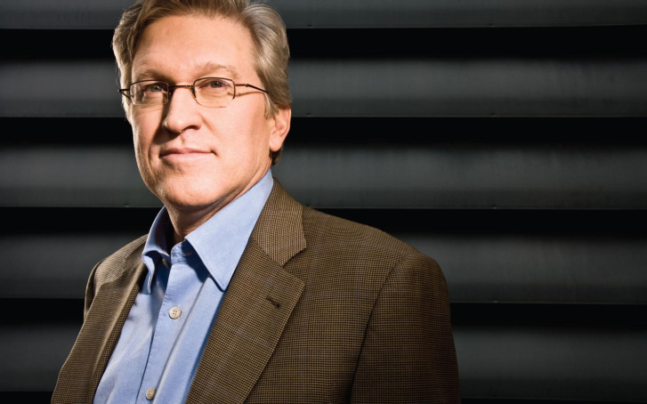

[杰夫·莱克斯和沃伦·巴菲特之间的电子邮件.pdf]()

> 彦鑫：今天分享的内容是巴菲特与微软前Office部门负责人、盖茨基金会前CEO 杰夫·雷克斯的邮件往来，这是一场跨界的思想碰撞。杰夫·雷克斯用极具说服力的逻辑，描绘微软业务的护城河与增长潜力，从操作系统到软件生态，再到战略协同，无不细致入微。而巴菲特的回信则延续了他一贯的投资哲学——只在“快乐区域”出手，宁可错过，也不贸然下注。他以可口可乐、比尔·盖茨和特德·威廉姆斯的棒球策略作比，阐释了自己不投资科技股的深层原因。这不仅是两位商业巨擘的交流，也是关于耐心、能力圈与风险判断的生动课堂，值得反复品味。

**Jeff Raikes&#x20;**&#x662F;微软（Microsoft）的前高管之一，全名 Jeffrey Scott Raikes。

* **背景**：出生于 1958 年，美国内布拉斯加州人。

* **微软时期：**&#x4ED6; 1981 年加入微软，最初负责多款办公软件的营销，后来成为 Microsoft Office 部门的负责人，对 Office 产品（Word、Excel、PowerPoint 等）的商业化推广起了关键作用。

* **职位：**&#x5728;微软工作了 27 年，最后担任微软业务部总裁，负责 Office、SharePoint 等企业生产力软件业务。

* **离开微软：**&#x32;008 年退休离开微软，同年接任比尔及梅琳达·盖茨基金会CEO，直到 2014 年。

### **第一部分：杰夫·雷克斯致信沃伦.巴菲特**

**致：沃伦·巴菲特，伯克希尔**

**发件人：杰夫·雷克斯**

**主题：Go Huskers！**

**日期：1997年8月17日 周日 晚上9:37**

沃伦，

我提前为这封长信向你道歉。我希望你会觉得它有趣，也请放心，我完全不期待你写长回复（事实上也不指望你回任何信）。也许哪天我们能抽几分钟聊聊，听听你对下面这些商业想法的看法。

> Go Huskers！（注：内布拉斯加大学橄榄球队的口号）

我们很期待几周后在橄榄球赛上与你见面。

如果我能做点什么让你这次在华盛顿的逗留更愉快（也更有“Husker风味”），请一定告诉我。我也会和比尔·盖茨确认一下计划，看看我能如何帮忙。

很遗憾地说，我对我们球队的前景非常悲观。你可能知道，华盛顿大学现在排名很高。他们拥有 Huard，可能是全美排名前2或3的职业型四分卫之一，还有一支出色的防守队伍。

与此同时，Huskers 仍在努力确定防守首发名单。我担心 Frost 不能投出有效传球。若进攻端缺乏平衡，我们会非常被动。Huard 已表现出他有能力在我们所面对的防守压力下完成传球——相当于“费城闪电战”，就像内布拉斯加对阵佛罗里达的 Fiesta Bowl 总冠军赛一样。

希望你那边听到的秋训消息更令人振奋。大家都知道我是个Husker的铁杆球迷——要是我们再输给华盛顿两场比赛，我简直无法想象那会有多痛苦。

> **《美国资本家的养成》…**

我和Tricia带孩子们去了迪士尼乐园，随后又短暂度假去了楠塔基特岛和Cuttyhunk（就是玛莎葡萄园岛以西的一小块地）。假期期间，我看了Lowenstein写的《沃伦巴菲特传---一个美国资本家的成长》一书——我非常喜欢！

从Cuttyhunk回波士顿洛根机场的路上，我们驱车走Cove Road去了New Bedford，想去找伯克希尔-哈撒韦的老厂房。虽然我看到了几座老工厂，但我不太确定哪一个才是当年那家——我是在找那座有钟楼的建筑。或许，它已经被拆掉了。

这本书让我想起你在高尔夫球赛后说的那句“去和沃伦聊聊”，也让我重新思考那个经典问题——你为什么不投资微软或其他高科技公司？书中的内容为我提供了新的视角，所以我想把一些想法与你分享。当然，我必须说明，我并不是想说服你改变观点（尽管我也希望你不会觉得我是在胡说八道）。我只是把这当作一次纯粹的思维交流。

虽然我们公司的业务在结构上比糖果复杂难懂，但我坚信一个聪明的分析师可以像你看喜诗糖果那样，在3到4小时（甚至比比尔·盖茨解释给你听的时间还短）内理解微软。

某种意义上，我觉得微软的商业特征与可口可乐或喜诗糖果非常相似。我想你会喜欢我们操作系统业务的简洁性。例如：

* 在FY96财年，全球卖出了5000万台PC，其中约80%的PC搭载的是微软操作系统。虽然我永远不会写下“收费桥梁”这种类比，但公司外部的人可能会这样形容我们的业务。这4000万个授权的平均价格是45美元，总收入大约为18.8亿美元。至于其余1000万台PC，其实也大多在运行微软操作系统，只不过我们没收到授权费。这种盗版问题——如果能减少——将是我们业务的重要上行机会之一。

* 到FY2000年，全球PC销量预计达到1亿台。我们认为可以将盗版比例降到10%，将授权比例提升到90%，也就是9000万台。但我们还有“定价权”——我记得这个词是你在谈喜诗糖果定价时用过的。

* 我们将过渡到新版操作系统 Windows NT。现在我们从NT授权中获得的收入超过每套100美元，但这只来自少数PC用户。而NT将更接近于70%的PC市场。

* FY2000年我们可以实现平均授权价格80美元，乘以9000万授权，就是72亿美元，比现在的不到20亿增长了3到4倍。并且由于我们基本没有生产成本，也不需要销售人员（销售团队也就100-150人），这是个毛利率90%的业务。当然还有R\&D支出，但利润率肯定和糖浆业务不相上下。

* PC销量本身其实还有增长潜力。类似你分析可口可乐时提到的那样，国际市场的渗透率是增长的源泉。美国每千人有PC的渗透率约为400台，我们相信一些国家将很快从100台的渗透率提升到400甚至更高，像一些欧洲国家就已经超过美国。

（很遗憾我现在不在西雅图，所以手头没有这些数据，但史蒂夫·鲍尔默可以倒背如流。）

上面描述的业务，我们称之为 OEM（原始设备制造商）业务，意思是我们的收入来自 PC 制造商。我们其余业务的大部分称为“成品”业务，指的是由企业或个人购买办公生产力软件、教育软件或娱乐软件等。同样地，其结构也非常简单。一台 PC 就像一把需要刀片的剃须刀，我们按每台 PC 的软件收入来衡量我们的营收。例如，在 1996 财年，销售的 5,000 万台 PC 中，约有 80% 安装了微软系统，平均每台 PC 的软件收入为约 140 美元，合计约 70 亿美元。这还不包括我上文提到的 OEM 授权收入。（史蒂夫·鲍尔默可以随口说出任何国家 PC 的数量和每台的收入；比尔盖茨也能做到，只不过他不会在这方面花像 史蒂夫 那样多的时间。）

从某种意义上讲，确实是这样。有一定数量的 PC 会安装越来越多的微软软件，品牌的力量也能推动销售更多软件，获得一定的定价权，以及借助国际市场增长和减少盗版来提升收入。显然我不会在这里展开所有细节——我们可以在一场四小时的冷酷会议上讨论这些内容，但这就是我们业务的核心。当然，我们在软件上的研发投入很大，但这就像迪士尼持续制作新内容，或者内布拉斯加家具商场持续维持其陈列格式的新鲜感一样，是一种投资，而比尔盖茨对这部分管理非常严格。

即使是一些“新媒体”业务，其实也不算特别新或不同。比如我们的 WebTV 收购或 Comcast 的交易。我看到有媒体文章在讨论这些投资，并称微软正转型为一家媒体公司。但真正的目标，是找到一种方式，让我们能为每台电视收取“操作系统”版权费。每台电视每年收取 10 至 20 美元的版权费，这就是一个不错的“小型操作系统”业务。

在“成品业务”和 OEM 操作系统业务之间，存在巨大的战略协同效应。例如，在办公生产力软件领域，我们的市占率约为 90%，这是一项了不起的业务（约 50 亿美元营收，85%+ 的运营利润率）。但更重要的是，这些软件高度依赖操作系统（操作系统对用户来说较为隐性，且用户不易转向其他品牌）。如果我们拥有建立在操作系统之上的关键“特许经营权”，我们就大大拓宽了保护操作系统业务的“护城河”。也就是说：如果我拥有布法罗最成功的日报，我绝不会把它留给我的竞争对手去办周日版。

让我们继续基于这个类比，探讨操作系统和运行其上的软件之间的战略协同关系。这也有助于理解我们在 Pete Higgins 所负责的业务（互动媒体，如 MSN、MSNBC、Expedia、Sidewalk 等）中的投资。一些媒体文章可能会说微软试图成为一家媒体公司，但我更倾向于认为，我们是在投资那些有潜力构建“用户特许经营权”的业务，这些业务能帮助保护我们的操作系统业务在未来的地位。我们希望从这些特许经营权中赚到很多钱，但更重要的是，它们能保护我们每台 PC 的 Windows 授权收入，以及每台电视的版权收入。而这些业务的成功，也会提升我们未来价格上的灵活性。

所以我并不认为我们的业务相比你所投资的其他伟大企业在理解上更难。但确实有一个潜在的差异让我担忧，也是我花时间与你分享这些想法的关键原因。这个我最担心的区别是“护城河的宽度”。对于可口可乐来说，你可以相当有信心地判断，用户不会迅速改变饮料偏好，尤其不会很快放弃可乐。但在技术领域，用户偏好变化可能更频繁，旧的领导者可能会因“范式转变”而被新技术取代。例如，图形化用户界面取代字符界面，互联网爆发等等。

如果没有技术领域的范式转变，市场份额通常不会在几年内剧烈变化。而一旦发生范式转变，股票价格可能会在短时间内波动几十个百分点。我在微软前十年主要负责开发 Microsoft Office。那段时间我们在市场份额上处于非常不利的地位（不到 10%）。但图形用户界面的兴起，正是那次范式转变，让我们成功取代了当时的领导者（Lotus 1-2-3 和 WordPerfect），我们的市场占有率如今已达 90%。当然，我们能获得这份市场份额，关键在于他们未能识别出计算领域的范式转变，也未能对此做出正确投资。他们本来可以选择自我颠覆，但因为行动不够快，也害怕投资新范式会蚕食现有业务，反而为我们打开了大门——讽刺的是，正是他们的迟缓给了我们机会。

我记得我们在1991年最初的几次对话中，你曾问我怎么看IBM发生的事情。我不记得我当时具体怎么说的。我认为他们对之前几代计算中所掌握的强大权力过于依赖，这让他们在PC和客户端-服务器计算的范式转变中措手不及。

在科技领域，护城河可能更窄。比如互联网爆发的速度令人惊叹，Java也迅速获得了关注。我们确实有一些很棒的护城河，但即便如此，仅仅18个月前还有分析师质疑我们是否能快速行动（显然，那时候正是买入微软的好时机！）

我对我们未来5到10年的业务非常有信心。不过我得承认，相比之下，对可口可乐未来10年的业务前景更容易抱有信心。总之，我一直有个隐约的感觉，就是你之所以不投资科技或微软，并不是因为你不了解这个行业。（事实上，比尔盖茨可能已经把我上面写的所有内容都解释给你听过了，为此我为重复啰嗦向你道歉——不过写下来对我个人也很有益。）

我的猜想是，你不投资科技公司或微软，是因为你认为这个行业的护城河更窄；风险太大，而且范式转变发生得太快，会迅速削弱你的持股地位。

由于微软是我了解的行业（也就是说，这是我能力圈中的一部分），而我也认同你对投资的看法，所以我超过90%的净资产都集中在微软。（多亏了比尔盖茨，这个数值已经进入九位数的区间。）我对自己90%+的资产投在微软感到安心。我们也有“安全网”——免税市政债券，所以我知道就算发生什么意外，我的家人也能得到保障。我们不打算把这些钱留给孩子，所以我只是在为将来某一天回馈社会积累大量的“筹码”。我确实会思考未来10年、20年或更久的时间段。如果将来某个时候微软的前景发生变化，我希望能从你的投资理念中学到足够多，从而具备识别新“内在价值”领域的能力，并持续快速地为自己的“筹码堆”添砖加瓦。

不过现在，我还是埋头卖软件吧……

我很好奇你对 Lowenstein 那本书的看法。我知道，把你一生中的经历铺陈在几百页书中可能不太容易；但另一方面，有太多内容值得你为自己感到骄傲。这本书非常适合理解格雷厄姆的投资方法，尤其是你对这套方法的巨大推进。我发现书中对“EMT”（有效市场理论）拥趸的批评极为有趣。他们应该去迪士尼待几天，亲眼看看群众行为理论在现实中的表现。相信我，最长的排队队伍并不一定代表那个项目性价比最高！但这本书最精彩的部分，是让我更深入理解了你的价值观，特别是那种促使你在投资上取得成功的纪律与品格。我真希望有种“魔法配方”可以把这种品质传授给我们的孩子！

最后还有一件事想说——我觉得我一直没有好好表达对你感激之情，感谢你带我一起在奥古斯塔、高尔夫球经典赛、Seminole 等场合打高尔夫球，尤其是有机会与你进行深入的交流并学习你的经验。我想让你知道，我一直非常感激你给予我的善意。如果将来我还有什么能回报你的地方，请随时告诉我。

谢谢你。

Jeff Raikes

***

### **第二部分内容：沃伦.巴菲特回信**

**发件人**：沃伦·巴菲特

**时间**：1997年8月21日，星期四，下午3:13

**收件人**：杰夫·雷克斯

**主题**：Re: Go Huskers!

嗨，杰夫：

我身边使用电子邮件的朋友实在太少了，所以我通常一周才看一次（通常什么都没有），所以请原谅我回复慢。

我的打字速度还可以，但准确率不高，准确性这方面我不太擅长。我发现与其不断修正，不如一口气写完——反正我写信的对象，一向都是那些把读懂稍微费点劲的内容，当成有趣挑战的人。

我得说，你对Husker与Husky比赛局势的判断很准确。我们需要奇迹，而这场奇迹不太可能在一个Frost无法听见教练喊话的体育场中发生。我希望奥斯本整个夏天都在让他练习手势指令。

你关于微软的分析、我为什么该投资它、以及我为什么没有投资它的理由，完全说到点子上了。

实际上，这家公司就像是对一条通讯流征收“版税”，而这条通讯流只会不断增长。就好比你在一条小溪上对每一加仑流动的水都收取费用，而随着支流的汇入，这条小溪变成了亚马逊河。

最难的问题是：价格该怎么提？

我去年12月见完比尔后就写了一封便条告诉他我的看法。贝尔公司早该预见到比尔的动作，提前做好部署，让别人来铺设电话基础设施，而他自己则靠分钟数和通话距离来收费（甚至可以根据电话的重要程度来设定等待时间以计费）——而这套系统可以“永续”收费。

现在可口可乐也在靠“吞咽”收取版税了，如果平均一口是一盎司，那每天大概是72亿口。我100%确定（也许是错的），只要可乐不会致癌，这种趋势会继续下去。

比尔手里握着的版税权利甚至更好——一个我永远不会对赌他失败的权利，但我觉得我也没有能力对它的概率进行准确判断。

但如果有人拿枪指着我脑袋逼我下注，我会选择押注“它会继续增长”，而不是相反。不过要是让我给这种确定性打分，是80%还是55%，放在 20 年的周期来看，那就显得太冒险了。

如果我必须做出这样的决策，我会尽力而为。但我更喜欢把投资当作一场“耐心等待好球”的棒球游戏，只等待那个“合适的球”出现。

前几天我在电视上看了特德·威廉姆斯的节目，他提到一本书，叫《击球的科学》。我随后找到了这本书，书里有一个他在节目中提到的击球区图，里面有很多小格子，标示出击球区的每一个角落。

他最喜欢的区域显示出打击率能达到.400，那意味着如果他只挥击那些区域的球，他能打出.400的成绩。而对低且偏外角、但仍在好球区的球，他的打击率只有.260。

当然，如果他已经有两个好球，那他也会挥击那个.260区域的球；但在其他情况下，他只等自己喜欢的“快乐区域”的球。我觉得这种策略在投资中也适用。

你的“快乐区域”是你每天看到的商业经验、你所拥有的能力和天赋所构成的——这与我的有所不同。

我相信你能在你的快乐区域打出本垒打；也不要只因为那些球是在好球区内你就非打不可。

我们见面时再好好聊聊这个。

作为初学者，我总觉得自己发的每封邮件都像一阵风，转眼就没了——我可不希望我脑子里的东西也跟着飘没了。

GO HUSKERS——沃伦

（全）
