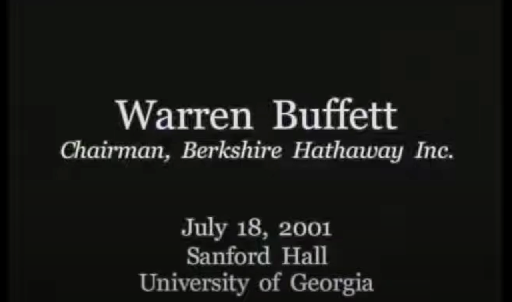

# 2001年：《巴菲特：2001年乔治亚大学特里商学院演讲》

沃伦.巴菲特  2001年7月18日

主持人：

早上好，欢迎大家。

对于商学院来说，没有比这更好的了。世界上最伟大的投资者来到你的校园是一种莫大的荣幸。沃伦·巴菲特是伯克希尔·哈撒韦公司的董事长，这家控股公司的投资范围从 Geico 保险、美国运通和可口可乐，到他家乡内布拉斯加州奥马哈的 Borsheim 珠宝店。

巴菲特先生被誉为价值投资者之神和投资界的迈克尔·乔丹。他在 20 世纪 50 年代中期用自己的 100 美元开始了他的第一个投资合伙企业。几年后，他开始投资一家名为伯克希尔·哈撒韦的陷入困境的马萨诸塞州纺织厂。通过伯克希尔，他开始将资金投入其他业务，主要是保险业，这为更多投资产生了现金流，众所周知，这些投资确实表现良好。

1965 年，伯克希尔的股价约为 18 美元，如今，其股价约为每股 69,100 美元。我想我赚了大约 500 美元。随着时间的推移，该公司的年化业绩是标准普尔 500 指数的两倍多，伯克希尔如今的市值超过 1000 亿美元。

但巴菲特先生以其谦逊的风格和崇高的成功而闻名。他已成为投资者的拥护者，并因其厌恶企业的双关语而闻名。在首席执行官中，他很少会欣然承认自己的错误。三年前，他在年度报告中写道，如果他只是去看电影，伯克希尔会做得更好。相信我，自 1965 年以来，这样的年份并不多见。

伯克希尔自豪地，甚至挑衅地，没有参与过去几年的互联网泡沫。如今泡沫已经破灭，众所周知，沃伦·巴菲特才是笑到最后的。在他最近致股东的信中，他写道，我们已经进入了 21 世纪，进入了砖、地毯、绝缘材料和油漆等尖端行业。尽量控制你的兴奋。

就我个人而言，阅读他的信是一种乐趣，这本身就是一堂商业课。我鼓励你，只要有机会，就把一封信放在一边仔细阅读，你会学到很多东西。他的智慧和洞察力如此受人重视，以至于一些投资者购买伯克希尔的股票只是为了在他传奇的年会上听到他的声音，或者用他的话说，伍德斯托克资本家。他不经常发表演讲，我们非常幸运今天能有他和我们在一起。可口可乐的Earl Leonard和我们杰出的常驻高管对此有很大贡献。Earl，我们非常感谢你帮助安排这次会议。

非常感谢。我们今天的形式主要是问答。巴菲特先生将在开始时发表一些简短的讲话，然后我们将转向你们。我们将在这里设置一个麦克风，希望你们过来提问。我们正在录像，所以请你们使用麦克风。请开始在那边排队提问。那么，请你们热烈欢迎奥马哈先知沃伦·巴菲特。

**巴菲特：**

我今天从内布拉斯加州来到这里，你们可能都熟悉我们，主要是因为我们的足球队。我们有那些戴着大白头盔的家伙，头盔上有红色的N。前几天我问我们的一个首发球员，N代表什么？他说，知识。不过，我们对他们很严厉。你不会因为你是一名足球运动员而轻易通过内布拉斯加州。他们主修农业经济学。所有球员都要参加两个问题的决赛。

第一个问题是，老麦克唐纳有什么？前几天，他们把这个奖杯颁给了我们其中一位潜在的海斯曼奖得主，他开始冒汗了。最后，他高兴起来，说，农场。教授当然很高兴。你不想让海斯曼奖候选人不及格。所以他说，现在你已经成功了一半。再问一个问题，农场这个词怎么拼写？现在这家伙真的开始冒汗了。他看着天花板，环顾四周。所以今年要小心那个家伙，他会很有前途的。

我真的很想谈谈你们在想什么，所以我们马上就要进行问答了。我总是被问到几个问题。人们总是说，好吧，我毕业后应该去谁那里工作？我的答案很简单。我们可能会在讨论过程中进一步阐述这一点。真正要做的是为你钦佩的某个机构或个人而努力。仅仅因为简历上看起来不错或者起薪稍高就接受临时工作，这太疯狂了。不久前我在哈佛，一个非常好的年轻人在机场接我，他是哈佛商学院的学生，他说，你看，我在这里读本科，然后为X、Y和Z工作，现在我来到这里。

他说：“我认为如果我现在去一家大型管理咨询公司工作，我的简历会非常完美。”

我问：“这就是你想要做的吗？”他说：“不，但那是完美的简历。”

我问：“你什么时候开始做你喜欢的事情？”他说：“好吧，我总有一天会做到的。”

我说：“你的计划听起来很像为你的老年储蓄性生活。这根本说不通。”

我告诉同一群人：“去为你最钦佩的人工作，你不会得到糟糕的结果。你会在早上从床上跳起来，玩得很开心。”

几周后，迪恩给我打电话。

“你告诉那些孩子什么了？”他说：“他们都开始自谋职业了。所以你必须稍微收敛一下这个建议。”

和我玩一分钟游戏，然后我们再回答你的问题。现在我想让你假装我给了你一个很好的提议。我告诉过你，你可以选择你的任何一个同学，在这里待了一段时间后，你们现在可能已经很了解彼此了。你有24小时的时间考虑，你可以选择你的任何一个同学，你将获得他们余生收入的10%。我问你，在决定选择哪一个时，你的脑子里想的是什么。你不能选择父亲最富有的人，那不算数。你必须根据成绩来做这件事。但你可能不会选择班上成绩最高的人。在班上取得最高分并没有什么错，但这并不是将大赢家与其他人区分开来的品质。想想你会选谁，为什么。我想你会发现，当你通过时，你会选到某个人。你们都有能力，否则你就不会在这里。

你们都有精力。你们有主动性。整个班级都充满智慧。但你们中的一些人会比其他人成为更大的赢家。有趣的是，这归结于一系列品质，这些品质都是自我造就的。这不是你有多高。这不是你是否能把足球踢出60码。这不是你是否能在10秒内跑完100码短跑。这不是你是否是房间里最漂亮的人。这是一系列真正源自本杰明·富兰克林或童子军准则或其他任何规范的品质。这是正直。这是诚实。这是慷慨。这是愿意做比自己分内的事情更多的事情。所有这些品质都是自我选择的。

然后如果你从另一个角度看，因为这些免费礼物和精灵笑话总是有陷阱的。所以，你还必须卖掉你的一个同学，并支付他们所做工作的10%。那么你认为谁会在班上表现最差？这更有趣。再想想。再说一遍，不是成绩最低的人或诸如此类的人，而是品格不合格的人。

我们在雇用员工时会寻找三样东西：智慧、主动性或活力以及正直。如果他们不具备后者，前两者就会杀死你。因为如果你要找一个不正直的人，你希望他们懒惰又愚蠢。你不希望他们聪明又精力充沛。所以这是第三个品质，但关于这个品质的一切都是你的选择。你不能改变你的思维方式，但你可以改变你用这种思维方式做的很多事情。

你现在养成的习惯就是基于这些品质，或者说那些消极品质。那些总是为自己没有做过的事情邀功的人，那些总是偷工减料的人，你不能指望他们。归根结底，这些都是习惯模式。而养成正确习惯的时间是你这个年龄的时候。现在上高尔夫课对我没有多大帮助。如果我在你这个年纪上高尔夫课，我可能会成为一名不错的高尔夫球手。

但有人曾经说过，习惯的枷锁太轻，难以察觉，直到它们太重而无法打破。我经常看到这种现象。我看到有些人在50岁或60岁时养成了自我毁灭的习惯，他们真的无法改变这些习惯。他们被这些习惯束缚住了。但你不会被任何东西束缚住。

所以，当你写下你想买入10%股份的人的品质时，看看那张清单，问问自己，清单上有什么我不能做的吗？答案是，没有，也不会有。当你看着你看空的人，看看那些你不喜欢的品质时，如果你在自己身上看到任何这些品质，自负，不管是什么，自私，你都可以摆脱它。这不是注定的。

如果你遵循这一点……本富兰克林就是这样做的，我的老板本格雷厄姆在他们十几岁的时候也这样做了。本格雷厄姆环顾四周，说，我钦佩谁？他自己也想被人钦佩，他说，我为什么钦佩这些人？他说，如果我因为这些原因而钦佩他们，也许如果我以类似的方式行事，其他人也会钦佩我。他决定自己想成为什么样的人。如果你坚持下去，最后你就会成为你想购买10%股份的人。这才是最终的目标。这也是这个房间里的每个人都可以实现的目标。

所以，布道到此结束。现在让我们谈谈你的想法。你可以问任何问题。我唯一不会告诉你的是我们在买什么或卖什么。我甚至都不告诉自己。我把它写下来，就像可口可乐的配方一样。只有两个人可以进入信托部门并找出这些信息，我不知道这两个人是谁。所以，我们不谈论我们在买什么或卖什么，但其他任何事情都是公平的。个人、商业，任何你想谈论的话题。事实上，问题越难，对我来说就越有趣。所以，不要顾及我的感受，把问题抛给我。

我有一个老派的信念，那就是我可以，也只能期望从我理解的事情中赚钱。当我说理解时，我的意思不是理解产品的作用或诸如此类的事情，而是了解10年或20年后的业务经济状况。我大体上知道，比如说，箭牌口香糖10年后的经济状况会是什么样子。互联网不会改变人们咀嚼口香糖的方式，也不会改变他们咀嚼的口香糖类型。如果你在很大程度上拥有口香糖市场，并且拥有Double Mint、Spearmint和Juicy Fruit，那么这些品牌10年后仍会存在。因此，我无法准确预测箭牌公司的数字，但如果我尝试展望这样的事情，我的预测不会偏离太远。评估这家公司属于我的能力范围。我了解他们做什么，了解其中的经济效益，了解商业竞争的方面。

可能有各种各样的公司拥有美好的未来，但我不知道是哪些。我过去发表演讲时随身携带一份70页的密密麻麻的清单，上面列出了2,000家汽车公司。现在，如果你在20世纪初就看到了汽车对这个国家的影响，看到了它对你子孙后代生活的影响，那么它改变了美国的面貌。但如果这2,000家公司中，只有三家基本能存活下来，而且它们的表现并不好。那么，你如何从2,000家公司中挑选出三家赢家呢？这并不容易。回顾过去很容易，但展望未来就不那么容易了。所以，你可能完全正确，事实上，你可能无法预测汽车行业会产生多大的影响。如果你全面收购了各家公司，你就不会赚到钱，因为该行业的经济特征很难定义。我一直说，最简单的事情是找出谁会亏损。而你真正应该做的是，在1905年左右，当你看到汽车行业将会发生什么时，你应该做空马匹。1900年有2000万匹马，现在大约有400万匹。所以，很容易找出输家，输家是马匹。但总体而言，赢家是汽车行业。

然而，2000家汽车公司几乎倒闭，一些公司合并了。20世纪20年代和30年代，道琼斯工业指数中有三家汽车公司：Studebaker、Nash、Calvinator和Hudson Motor。现在，这些名字我都很熟悉，也许你们也熟悉其中的一些。但他们没有制造任何汽车，也没有赚钱。然而，他们曾一度跻身道琼斯30指数，成为美国商界的贵族，但最终惨败。因此，要找出一个绝佳行业中的赢家的经济特征并不容易。

在北卡罗来纳州，奥维尔和威尔伯起飞了。好吧，我想奥维尔起飞了，威尔伯在一旁看着。我会成为威尔伯。如果你能看到从那时起航空业的未来，以及它将如何改变一切，你会大吃一惊。顺便说一句，从那时起，它就让人们兴奋不已。但如果有像Kitty Hawk这样的资本家，他应该击落奥维尔，因为它除了损失投资者的钱之外什么也没做。仅在20世纪20年代和30年代，就有400多家飞机公司。有奥马哈，有内布拉斯加州。显然，我们是飞机界的硅谷，但他们都消失了。这是一个糟糕的行业。

1991年底，由于威尔伯和奥维尔的存在，所有航空公司共计投入了数十亿美元。如果把这些航空公司的总收益加起来，结果还不到零。乘客数量逐年增加。十年来，电视行业的重要性急剧上升，但没人赚到钱。因此，我们要弄清楚经济后果。电视，我认为，美国每年销售的电视机有2000万到2500万台。我认为现在美国已经没有电视机了。你会说，电视机制造商真是一门好生意。1950年，没有人拥有电视机，大约只有45到50台。如今，每个人都拥有多台电视机，但在美国，没有人真正从中赚到钱，这意味着他们都破产了。您知道，像Magnavox、RCA这样的公司，曾经在市场上占据一席之地。

在20世纪20年代，有超过500家公司生产收音机，但现在几乎没有美国的收音机制造商了。相比之下，可口可乐自1884年在雅各布斯药房诞生以来，经历了多年的发展和复制。如今，这家公司每天在全球销售约1.1亿份8盎司的产品，虽然不全是可口可乐，还有光明等其他品牌。117年后，可口可乐依然在全球范围内畅销。

理解企业的经济特征与预测一个行业的成功是不同的。当我看到互联网企业或科技企业时，我会认为这是一件了不起的事情。我喜欢玩电脑，从亚马逊订购书籍和各种商品，但我不知道谁会成为最终的赢家。除非我知道谁会赢，否则我对投资不感兴趣，我只会在电脑上玩。

定义你的能力圈是投资最重要的方面。能力圈的大小并不重要，你不必成为所有领域的专家，但知道你知道什么和不知道什么的圈子的边界，并留在圈子里是最重要的。创办IBM的汤姆·沃森在他的书中说：“我不是天才，但我在某些地方很聪明，而且我会留在那些地方。”这就是关键。

如果我理解一些事情并且坚持在那个领域，我会做得很好。如果我不明白某件事，但因为邻居在谈论它、股票上涨等原因而兴奋不已，我就会开始在其他地方闲逛，最终我会得到回报。我应该这样做。

> 你好，巴菲特先生。我有两个简短的问题。一个是如何找到一家公司的内在价值？内在价值是多少？

**巴菲特：**&#x5982;果你对未来了如指掌，可以预测从现在到审判日，一家企业会给你带来的所有现金，以适当的折现率折现，这个数字就是一家企业的内在价值。换句话说，现在投资和花钱的唯一原因是为了以后能赚更多的钱，这就是投资的意义所在。

当你看股票、债券，也就是美国政府债券时，很容易知道你会得到什么回报，因为债券上就写着。上面写着你何时收到利息和何时能拿到本金。因此，很容易算出债券的价值。如果利率发生变化，明天债券的价值也会发生变化，但现金流是印在债券上的，而不是印在股票证书上的。

分析师的工作就是将代表企业权益的股票证书打印出来，并将其更改为债券，说明这是他们认为未来会支付的金额。当我们为 Shaw 购买一些新机器来生产地毯时，显然这就是我们考虑的。你们在商学院都学过这一点，对于大企业来说，情况也是一样的。

如果你今天购买可口可乐，该公司在市场上的售价约为1100至1500亿美元。问题是，如果你有1100亿或1500亿美元，你就不会听我的，但我会听你的。问题在于，你今天是否会付出代价来换取可口可乐公司在未来200年或300年内将为你提供的东西？贴现率越长，影响就越小。而问题在于他们会给你多少现金。

问题不在于有多少分析师会推荐它，股票交易量是多少，图表是什么样子，等等。问题在于它会给你多少现金。这是唯一的原因。如果你买的是农场，这是真的；如果你买的是公寓，这也是真的。任何金融资产都是如此。把石油埋到地下，你现在就拿出现金，以便以后获得更多现金。问题是，你会得到多少，什么时候能得到，你有多确定？

当我计算企业的内在价值时，无论我们是购买整个企业还是一小部分企业，我总是认为我们是在购买整个企业，因为这是我的方法。我看着它，然后问自己，这项业务什么时候会产生什么结果？当然，你真正喜欢的是能够使用他们赚到的钱，并在发展过程中获得更高的回报。

伯克希尔从来没有向股东分配过任何东西，但随着我们拥有的企业价值的增加，其分配能力也在提高。我们可以内部增加，但真正的问题是，伯克希尔现在的售价大约是1050亿美元。我们可以从这1050亿美元中分配什么？如果你现在要以1050亿美元收购整个公司，我们能否尽快向你分配足够的现金，使现在以目前的利率支付这笔现金是合理的？这就是问题的关键。如果你不能回答这个问题，你就不能买股票。如果你愿意，你可以赌一把，或者你的邻居可以买。如果你不回答这个问题，我无法回答互联网公司的问题。

有很多公司我都无法回答，但我只是远离那些公司。

你有一些公式可以用于确定某些公司的内在价值。你已经建立了一个数学系统，只是得到了未来现金的现值。

> 第二个简短的问题是，为什么你没有以书面形式写下你的一套公式或策略，以便与其他人分享？

**巴菲特：**&#x6211;想我实际上已经写过这方面的内容。如果你读过最近几年的年度报告，尤其是最新的年度报告，我会使用我刚才谈到的内容。我用伊索的例子。伊索生活在公元前600年，是个聪明的人。不过，他不够聪明，不知道那是公元前600年，需要一点先见之明。

伊索在乌龟和野兔以及其他事物之间，还抽出时间写了关于鸟类的文章。他说，一鸟在手胜过双鸟在林。现在这还不够完整，因为问题是，你有多确定林中有两只鸟？你要等多久才能把它们弄出来？他可能知道这一点，但他没有时间，因为他有许多其他问题要写，必须继续写下去。但他在公元前600年就完成了一半。

投资就是这么多，就是有多少只鸟在林中，你什么时候把它们弄出来，你有多确定？如果利率是15%，那么大致来说，你必须在五年内从林中弄出两只鸟才能等于手中的鸟。但如果利率是3%，而你可以在20年内弄出两只鸟，那么放弃手中的鸟仍然是有意义的，因为这一切都回到了对利率的贴现。

问题是，你通常不仅不知道有多少只鸟在林中，而且在互联网公司的情况下，林中没有任何鸟。但他们仍然会接受你给他们的那只鸟。实际上我已经写过关于这类东西的文章，并大量借鉴了2600年前伊索所写的内容，但我一直没有认真阅读。

> 早上好。我知道您因成功而闻名，但我很好奇，您生命中是否有任何特别的时刻、错误或失败让您特别难忘，您从中学到什么，以及您是否对这里的学生在应对令人沮丧的情况方面有什么特别的建议。

**巴菲特：**&#x662F;的，我犯过很多错误。最大的错误，不一定是最大的错误，但购买伯克希尔哈撒韦公司本身就是一个错误，因为伯克希尔是一家糟糕的纺织企业。我以非常便宜的价格买下了它。本杰明·格雷厄姆教我以定量为基础购买东西。我曾经四处寻找便宜的东西。这种习惯源于我在1949年或1950年接受的教育，他们给我留下了深刻的印象。因此，我开始寻找我所谓的“二手雪茄烟蒂股票”。

所谓的“雪茄蒂法”买股票，就是你走在街上，四处寻找被丢弃的雪茄蒂。当你发现一支看起来很糟糕、很湿、很丑的雪茄时，虽然里面只剩下一口，但你还是会捡起来抽一口。虽然这很恶心，但它是免费的，很便宜。然后你继续寻找另一支湿漉漉的、一口就够的雪茄。这就是我多年来所做的事情。

然而，这是一种错误的做法。虽然你可以通过这种方式赚钱，但你无法赚到大钱。买下优秀的企业要容易得多。因此，现在我宁愿以公平的价格买下优秀的企业，而不是以优惠的价格买下一般的企业。

但在那些日子里，我买的是廉价股票。伯克希尔的每股营运资本低于其每股营运资本，你白白得到了工厂和机器，还以折扣价得到了库存和应收账款。这些股票很便宜，所以我买了它们。20年后，我仍然经营着一家糟糕的企业，而且这些钱并没有增加。

你真的想从事一项出色的业务，因为时间是出色业务的朋友。随着时间的推移，出色的业务会不断增加，你会不断赚更多的钱。而时间是糟糕生意的敌人。我本可以卖掉伯克希尔，或者将其变现，然后快速赚点小钱，但继续持有这类企业是一个大错误。所以你可以说我从那个错误中学到了一些东西。如果我继续持有伯克希尔，并购买更好的企业，我会做得更好。

我创办了一家保险公司、种子糖果公司、野牛队等等。如果采用我亲自创立的全新小实体来做这件事，而不是使用伯克希尔作为平台，效果会更好。现在我已经从中获得了很多乐趣，生活中的一切似乎都变得更好了，所以我对此没有任何抱怨。但这确实是一件愚蠢的事情。

我还记得我去了美国航空公司。在1989年，我买了优先股。我的支票一兑现，公司就陷入了赤字，再也没有摆脱困境。这真的很愚蠢。现在我有一个800号码，每当我想买航空公司的股票时，我都会打电话给他们。我随时给他们打电话。幸运的是，我可以在凌晨3点给他们打电话。我只需拨号，说：“我叫沃伦，我是个航空迷，我正在考虑买这个东西。”他们说服了我。有时要花几个小时，但这是值得的。相信我。

如果您考虑购买航空公司股票，请给我打电话，我会给您800号码。您不想这样做。但我们最终还是很幸运的，但这是一个愚蠢的决定，全都是我的。

就机会成本、最终成本而言，我做过最大的事情，是我20岁左右的时候和一个国民警卫队的人一起购买了Sinclair加油站的一半股权。当时我大约有10,000美元，我投入了2,000美元，结果全部赔光了。所以那是20%，这意味着现在的机会成本是该加油站的60亿美元。这是一个很大的代价，为了擦几扇窗户和几块挡风玻璃之类的东西。

所以实际上我喜欢伯克希尔倒闭，因为它减少了机会成本上的错误成本。但迄今为止我们犯下的最大错误，是我犯下的，而不是我们犯下的。迄今为止我犯下的最大错误是疏忽大意的错误，而不是犯下的错误。那些我知道该做的事情，它们在我的能力范围内，而我却在吮吸自己的拇指。而这确实是那些令人痛苦的事情。它们在任何地方都没有出现。

例如，20年前或接近20年前，当房利美遇到麻烦时，我吮吸自己的拇指可能让伯克希尔损失了至少50亿美元，而我们几乎可以不花一分钱就买下整个公司。如果是微软，我不会担心这一点，因为我不了解它。微软不在我的能力范围内。所以我没有任何理由认为我有权从微软或可可豆或其他任何东西中赚钱。但我确实知道足够多的东西来了解房利美，但我搞砸了。这在传统会计中永远不会出现。但我知道它的代价。我知道，我放弃了。这些都是非常非常大的错误。我犯过很多这样的错误。

除非我在年度报告中告诉你这些，有时我会抵制这种诱惑，否则你不会知道，因为传统会计不会显示这些。但遗漏比委托要大得多。生活中的大机遇必须抓住。我们做的事情不多，但当我们有机会做正确而伟大的事情时，我们必须去做。即使是小规模地做，也几乎和不做一样是大错误。当机会来临时，你必须抓住它们，因为你不会有500次好机会。如果你毕业时能拿到一张有20个打孔的打孔卡，你会过得更好。每做一个重大财务决定，你都会用掉一个打孔卡。这样，你会变得非常富有，因为你会仔细考虑每一个决定。

在鸡尾酒会上，有人谈论一家公司，但你甚至不明白他们在做什么，或者无法读出公司的名字。即便他们上周赚了一些钱，还有另一家公司类似。如果你的打卡机上只有20个孔，你不会买它。人们很容易涉足其中，尤其是在牛市期间。股票交易很容易，现在比以往任何时候都容易，因为你可以在网上操作。只要点击一下，也许它会上涨一点，你会为此感到兴奋，第二天再买一张，依此类推。但这样做不会随着时间的推移而赚钱。

如果你的打卡机只有20个孔，你一辈子都不会再得到另一张。在做出每个投资决定之前，你会考虑很久。你会做出好的决定，做出大的决定。你一生中可能甚至不会用完所有20个孔，但你不需要。

> 巴菲特先生，早上好。在您谈到自己所犯的错误和失误时，能谈谈您的自律吗？当你处于一个位置，并且觉得它不再好时，当你最终放弃它时，你会使用什么标准？

**巴菲特：**&#x662F;的，当我刚开始的时候，自我状况多年来发生了变化。因为当我刚开始的时候，我的想法比钱多得多。我会阅读穆迪手册，一页一页地看，然后再一页一页地看。我发现里面有一些我能理解的股票，它们的售价是收益的两倍，甚至是收益的一倍。当你只有1万美元时，这可能会有点令人沮丧。如果你不喜欢借钱，我从不喜欢借钱。所以，我总是想出比钱更多的想法。我不得不卖掉我最不喜欢的东西来买一些对我来说有吸引力的新东西。很长一段时间，我都处于这种模式。

而现在，我们的问题是，我们拥有的钱比拥有的想法多。因此，如果您查看我们的年度报告，您会在报告的后面看到一份名为《伯克希尔经济原则》的文件。我相信这份文件应该为我的合伙人制定。他们是我的合伙人，我不将他们视为股东，而是视为一生的合伙人。因此，我想告诉他们我的想法。如果他们不同意我的想法，那也没关系，但我不想让他们对我失望。

我明确表示，就我们的全资企业而言，无论任何人出价多少，我们都不会出售。如果有人出价是某件商品价值的三倍，无论是在 See's Candy、Buffalo News 还是 Borsheim's，无论它是什么，我们都不会出售它。

我的做法可能不对，但我知道如果我拥有伯克希尔 100% 的股份，那我并没有错，因为这就是我想要的生活方式。我已经拥有了我可能需要的所有钱。这相当于报纸上关于我的讣告和基金会资金数额的报道发生了变化，并且断绝与我喜欢的人的关系，以及那些加入我的人的关系，因为他们认为这是一个永久的家，仅仅因为有人向我挥舞着一张大支票。这就像因为有人挥舞着一张大支票而卖掉我的一个孩子。所以我不会这样做，我想告诉我的合伙人我不会这样做，这样他们就不会对我失望。

对于某些股票，我们越来越多地采用这种方法。现在，如果我们长期资金短缺，并且有各种各样的机会出现，我们可能会采取稍微不同的方法。但我们倾向于不出售东西，除非我们对管理层感到沮丧，或者我们认为业务的经济特征发生了很大变化。而这种情况确实会发生。但我们不会仅仅因为价格看起来太高就卖掉。

我们现在每年至少能产生 50 亿美元的现金，所以每周有 1 亿美元。我们在这里聊了半个小时，我什么都没做。所以，真正的问题是你如何明智地把它说出来？如果我们卖东西，那会更多。所以也许有一天这种情况会改变。

但我们想……我有合伙人、股东、合伙人，他们会说，如果你能得到 See's Candy 价值的三倍，你为什么不卖掉它呢？这就是为什么我想在他们进来之前确保他们知道我的想法。他们有权知道这一点。

你真的想……想一想，如果你要结婚，你想要一段持久的婚姻。不一定是最幸福的婚姻，也不一定是玛莎·斯图尔特会谈论的婚姻，但你想要的是一段长久的婚姻。你希望配偶具备什么品质？一个品质。你希望配偶有智慧吗？你在寻找幽默吗？你在寻找性格吗？你在寻找美吗？不，你在寻找低期望。只有这样的婚姻才能长久，双方的期望都很低。我希望我的合作伙伴对即将到来的期望也较低，因为我希望婚姻长久。当他们加入伯克希尔时，这是一场金融婚姻。我不想让他们认为我会做我不会做的事情。所以这是我们的指导原则。这里的所有建议都是免费的，婚姻建议，其他一切。

> 早上好，巴菲特先生，我有一个关于投资合理性评估的问题。近年来，似乎使用避税公司的情况正在增加，像UPS和其他知名公司正在与美国国税局就避税问题展开诉讼。我们知道，这些交易大部分都是相当人为的，但其中还是有利润的。从投资者的角度来看，您认为投资者、他们所投资的公司参与这些避税活动是否有益？如果是，您认为在报表（即报表附注）中披露这些交易是否有帮助？您是否知道一家公司参与这种短期内有益的活动，您认为这对投资者有帮助吗？

**巴菲特：**&#x6709;完全合法的避税方式。我们过去和现在都在这样做，但我们是最早申请低收入税住房抵免的公司之一。事实上，我与布什总统就此事进行了会面。这在一定程度上对我们有利。这不是伯克希尔的一大优势。就伯克希尔的整体价值而言，这只是个小问题，但这是国会规定的税收优惠。我不会称其为庇护所。这是国会决定愿意向企业提供的税收优惠，因为他们认为这是建造低收入住房的最佳方式。所以我们参与了某项活动，但这并不是我们所做的重要因素。但这并没有什么错。

然后，如果你逃税，那完全是另一回事。那时，他们应该进监狱。但某些企业、一些保险公司在百慕大重新注册。你可以节省很多税款。你必须满足某些其他测试，而我们不想满足这些测试。但如果我们愿意满足这些其他测试，我们搬到百慕大就没有任何违法或不道德之处。我们不会这么做。但如果没有限制，税法就是规则手册，而你必须遵守规则手册。我认为人们做的一些违反规则的事情非常接近欺诈，有时甚至会越界。如果他们这样做，我认为他们应该受到起诉。但那是另一回事。

在过去五年里，这方面的压力更大。当然，这是我以前的经历。我认为在过去一两年里，这种情况有所减少。但几年前，一些审计公司进行了非常积极的营销。即使有百分比的收益要支付给审计师，我认为这些事情也变得相当可疑。特别是当他们寻求法律意见时，如果你被发现做这些事情，你可以说，好吧，我依赖这个法律意见。因此，我不应该进监狱，而应该补缴税款。

我不知道我们与之有关联的任何公司做过这样的事情。但显然，如果他们逼得太紧，我们就不想参与。

> 我很好奇，现在有这么多拥有巨额财富的人，您如何看待慈善事业的现状？

**巴菲特：**&#x597D;吧，我这周会出去。实际上，我要去参加可口可乐会议。我要飞往西雅图，和那里的联合之路组织交谈。我相信，西雅图联合之路的人均筹款额比全国任何一个联合之路都高。比尔·盖茨也会去。我们一起谈话。他的母亲在联合之路非常活跃。

比尔每年要捐出10多亿美元，以后还会捐出更多，但现在是10亿美元。这很有趣。他对此非常理性，而且他非常了解情况。事实上，他找到了一个人，我认为他在医学领域的主要顾问是一位曾在亚特兰大疾病预防控制中心工作的人。比尔每月读15本关于这方面的书。他可以吸收它。我无法那么快得到它。

但他只是说，有了10亿美元，他希望每年尽可能多地挽救生命。这就是他的目标。这就像衡量他的基金会的指标一样，就像衡量企业的资本回报率一样。他说，我每年要花10亿美元。这能拯救多少生命？所以他非常重视非洲的疫苗和艾滋病等许多事情。这是非常合理的。

我个人认为，在我和妻子去世后，我的净资产的99.5%将捐给基金会。所有资产都将捐给基金会。就我而言，我从社会上得到了这些。这些资产将捐给社会。我已经给我的受托人写了一封信，我的受托人很少。如果你有一大堆受托人，他们只会将自己同质化到最低公分母。一个房间里有30个人，都是有名望的人，但他们都有自己的母校和医院，这会成为一场巨大的权衡游戏。这有点像国会。

我的人手很少，而且我没有给他们任何具体的指示，因为我告诉他们，他们在地上的判断会比我在地下六英尺处的指示更好。我不喜欢这么想，但这是真的。

我告诉他们，社会问题是那些没有自然资金支持的问题，或者是非常棘手和难以解决的问题。如果他们在一些非常重要的问题上花大钱却失败了，我根本不会纠缠他们，因为他们正在解决棘手的问题。

当我购买企业时，我买的是容易的企业。但社会大问题之所以是大问题，是因为它们非常难以解决。所以，他们在坏球上挥杆。我在商业上对容易的球挥杆，但他们必须对坏球挥杆。我告诉他们，我希望他们尝试去做，如果他们失败了，我也不会介意。

我告诉他们，如果他们在这里捐一百万美元，在那里捐一百万美元，他们就睡不着觉，因为我会一直缠着他们。我每晚都会回来。我不希望慈善事业采用滴管式的方法。我希望他们用自己的判断力来看待没有自然资金支持的重大问题。如果政府要资助，那很好。他们应该资助重要问题，但我们不需要这样做。

在我看来，私人慈善事业的作用是资助没有自然资金支持的事物，这就是比尔正在做的事情。你周围没有一群人可以向你发出情感呼吁，让全世界数以百万计的孩子接种疫苗。这不会触动任何人的心弦。你不能用他们的名字来命名建筑物。这不是那种你可以通过情感筹集资金的事情。通过情感筹集资金并没有错，但这是一个无法通过对此作出反应的资助群体解决的问题。

比尔正在回应他心中最重要的事情，即拯救生命。他不在乎他的名字是否出现在建筑物上，是否发生了什么事情，或者是否有人知道这件事。他只是因为他的规模而受到关注，但他不在乎这些，我可以向你保证。

这就是我的理念。我得到这笔钱不是因为我是一个优秀的人，不是因为我为社会做的比其他人多。我天生就适合在这个时候来到美国。这是一个巨大的资本主义社会，我天生就适合，这不是我的功劳，但我生来如此，所以我在某种程度上比其他人更擅长资产配置。就像其他人在各种事情上更擅长一样，我和两位老师在太阳谷一起，他们为社会做出的贡献比我多，但市场体系对他们却毫无帮助。市场体系为我做了各种各样的事情。

盖茨说，如果我生在5000年前，我就会成为某种动物的午餐，因为我跑得不快，爬不了树。我能看出那只动物在追我，等着看我如何分配资产吧。这不会有什么不同。所以，我现在出生了，只是非常非常幸运。

当我出生于1930年时，我出生在美国的几率是50比1。这是一个可怕的几率。然而我却被扔在这里。如果我被扔在秘鲁某个地方，我根本就没有机会。所以，社会就是为你做这件事的。在我看来，它应该回归社会。

如果你足够幸运，进入一个社会，你的特殊天赋能给你带来巨大的回报，那只是运气而已。而且，幸运并没有什么不好。我对此并不感到内疚或其他什么，但我也不觉得……我觉得我做我所做的事情很有趣，但我觉得这些钱应该回馈社会。而且应该尽可能明智地回馈社会。

明智的做法是让高素质和聪明的人来管理它。你不知道10年后、20年后或30年后会出现什么问题。但我确实知道我是否有少数高素质、聪明的人。而高素质更重要。如果你给我20分额外的智商，但在高素质上作弊，我不会接受。因为有很多机会可以以卑鄙的方式做事，或者，试图……人们在自己的思想中被自己的利益所颠覆，而不是机构的利益。所以，我真的希望超高水平的人来做这件事。我已经找到了他们。

我认为这些钱可能会带来很多好处，也可能没什么好处。但它将在一些领域发挥作用，如果这些钱能带来一些好处，那么这些好处可能就不会产生。

> 我只是想知道，最近股市的繁荣与萧条与20世纪20年代的股市繁荣与萧条有很多不同之处，但也有很多相似之处。这些相似之处让人们得出结论，股价将在未来一段时间内低迷。你对这个结论有什么不同意见和同意意见？

**巴菲特：**&#x6574;个世纪都很有趣。如果你看看20世纪，你会发现这对美国来说是一个令人难以置信的世纪。人均GDP，这就是人均GDP的思路。有时他们会谈论我们的GDP与欧洲的GDP。但是，如果他们的人口每年都保持不变，而我们的人口每年增加1%，那么最终你需要考虑一个除数和一个分子。因此，美国20世纪的人均GDP增长了610%。

实际上，从质量上讲，增长幅度远不止于此，因为你无法真正衡量医学或其他领域的某些事物及其改进。但仅从数量上看，每十年它都在上升，包括20世纪30年代。因此，在过去的100年里，美国基本上一直在改善公民的命运。

30年代，股市上涨了13%。最好的十年是第二次世界大战期间，40年代股市上涨了36%。最糟糕的十年是第一次世界大战期间。所以，有时，类比会给你带来麻烦。但无论如何，那都是一个伟大的时期。

有趣的是，股市在两个方向上都有六个大时期。有三次大牛市。从1900年到1921年，道琼斯指数从66点涨到了71点，20年内涨幅不到10%，每年不到半个百分点。你也有股息，但只有半个百分点，所以它几乎没有动。

正如你所指出的，从1921年到1929年，它从71点涨到了1929年9月的高点381点，上涨了500%。很明显，在此期间，国家的福祉并没有增长500%。在最初的21年里，国家的福祉增长远不止10%。所以你看到了这种非常不平衡的发展。

然后从1929年9月到1948年底，道琼斯指数从381点跌到了180点左右，几乎被削减了一半。那是漫长的18年。然而，在这整个时期，人均GDP一直在上升，所以经济表现不错。

从1948年到1965年，道琼斯指数又从180点左右上涨至接近1,000点，再次实现了5比1的增长，远远超过了它。从1965年到1981年，道琼斯指数真的下跌了。好吧，再次提到人均GDP。

我们经历了最近这个时期，它大幅上涨。如果以整整100年来看，增长了180%。每1,000美元变成了180,000美元。

在这100年中，有43又3/4年是三个巨大的牛市，而56又3/4年是停滞期。这一切都发生在经济表现良好的时期，年复一年。道琼斯指数在56又3/4年期间下跌了几百点，而其他43又3/4年则弥补了这一跌幅，从66点涨到了11,000点，其中一些涨幅体现在道琼斯指数上。

所以你会问自己，怎么可能有一个国家越来越好，公民们生活得很好，每一代人都比上一代过得好，但却经历了这些巨大的变化？几次大涨，长期停滞。20年，这是一段很长的时间，什么都不做。

答案是投资者的行为非常人性化。他们在牛市期间非常兴奋，他们看着后视镜说，我去年赚了钱，今年我要赚更多的钱，所以这次我要借钱。或者邻居说，去年我不在家，那个邻居比我笨，赚了很多钱，所以我今年要进去。他们总是看着后视镜。当他们回首往事，看到过去几年已经赚了很多钱时，他们便纷纷投入其中，不断推高价格。当他们回头看时，发现没有赚到钱，他们就会说，这是一个糟糕的处境。所以他们不关心基础业务的情况。

这令人震惊，但这也带来了巨大的机会。从投资的角度来看，我经历了大约一半的时期。我经历了48年的长期停滞期，我的意思是从1965年到1982年，17年。我在1979年为《福布斯》写了一篇文章。我只是说，这怎么可能？

1970年，养老基金将100%左右的新资金投入股票，因为他们对股票很着迷。然后它们变得便宜了很多，在1978年，他们投入了创纪录的低点，净新资金的9%投入股票，当时股票便宜得多。人们的反应非常奇特，因为他们是人。当别人兴奋时，他们也兴奋；当别人贪婪时，他们也贪婪；当别人恐惧时，他们也恐惧。他们会继续这样做。你会在证券市场上看到你一辈子都不敢相信的事情。随着时间的推移，这个国家会发展得很好，但你会看到这些巨大的浪潮。如果你能在整个过程中保持客观，如果你能让自己在性格上与人群保持距离，你就会变得非常富有。

你不必非常聪明。我相信你很聪明，但这不需要大脑，需要性格。这需要坐下来观察某事的能力。当我在1950年刚开始创业时，我会仔细寻找市盈率两倍的东西。它们是非常不错的企业，人们想在这些公司工作。每个人都知道他们会存在，但他们不会以市盈率两倍的价格购买它们。那时的利率是2.5%。

我21岁时开始卖证券。堪萨斯城的一家人寿保险公司恰好是奥马哈一家相当知名的公司。如果您从他们那里购买人寿保险，他们向您出售的保单中已经内置了2%的利率假设。堪萨斯城人寿的股票售价还不到收益的三倍。如果您购买该股票，您将获得35%的收益。毫无疑问，这家公司的稳健性。

我去了当地的代理商。我想，该死，我应该可以卖给他几股股票。这个人应该明白，他把一生都投资在了这家公司。我去了当地的代理商，他已经和他们合作了20年。他的名字叫穆斯。我说，穆斯先生，你以2%的利率出售这些保单。你甚至可能有几个自己的家庭成员。你可以购买这家公司的股票，你每个月的薪水都依赖于这家公司的，你的人寿保险受益人的未来也依赖于这家公司的，而你向这家公司出售2%的投资。您还可以获得35%的收益。

他说，股票没什么用。而我却无法销售产品……我是一个糟糕的推销员。你必须从那开始。但它确实让我震惊。这让我震惊。有时我甚至怀疑自己是不是疯了。但那些事情，同样的事情发生了。

1964年，道琼斯指数收于864点。17年后，1981年，该股收于865点。17年来它只移动了一分。现在，这不是什么大举动。你无法相信那段时期人们有多么沮丧。人们的生活变得更好了，因此，毫无意义的事情可能会持续很长时间，但它们终究会结束。我指的是互联网的事情。这些公司的售价高达数十亿美元，但实际上却没有任何赚钱的前景。这是一个泡沫。

赫伯·斯坦曾经说过，“任何不能永远持续下去的事物都会终结。”现在看起来很漂亮，但请想一想。特别是当您下次试图做某事只是因为股票价格大幅上涨时，要考虑这一点。你的邻居赚了钱或做了其他事，你必须坐下来客观地思考：我会买下这整个生意吗？

这是一家互联网公司。该公司已发行1亿股股票，以100美元的价格出售，那就是100亿美元。它值100亿美元吗？如果它价值100亿美元，那么明年它就必须能够为你带来7亿或8亿美元的收入。如果明年它不能给你7亿或8亿的利润，那么后年它就必须给你比去年多10%的利润，并继续这样做。没有多少企业能做到这一点。

人们就变得疯狂。当然，这很有趣。这就像他们在经纪办公室里放置的标语，上面写着，避免宿醉，保持醉酒状态。继续玩下去真是太有趣了，但你必须采取明智的行动才能取得良好的结果。

> 早上好，先生。我想知道您对美联储及其最近采取的行动有何看法。您觉得他们为促进经济发展已经做出足够努力了吗？

**巴菲特：**&#x662F;的，我一直是艾伦·格林斯潘的粉丝。我认识他很久了。我们曾一起在Cap Cities担任董事。艾伦是一个非常聪明的人。我认为，他的动机完全是为了美国和美国人民的利益。所以你找不到比他更合适的人选了。

他可能存在的问题是，由于他的任期与这场令人难以置信的牛市有关，尽管他不会为此邀功，但人们可能会将其与美联储的重要性联系起来。他们可能会和他有联系，所以如果事情进展不顺利，他们也可能会责怪他。但我认为他的政策总体来说非常好。你必须了解美联储的一件事，那就是它并不像人们所想象的那么强大。它的刹车比油门踏板更好。当美联储想要踩刹车时，我们会感受到强烈的冲击，经济状况会变得很糟糕。

保罗·沃尔克通过踩刹车打破了通货膨胀，但在1980年左右那段时间，他因此被广泛批评。然而，这确实是正确的做法，他独自完成了所有工作。由于通货膨胀的势头越来越猛，这是唯一的办法，也是当时所需要的措施，尽管非常不受欢迎。

对于格林斯潘来说，踩刹车要困难得多，因为没人希望他这么做，而且他很显眼。他逐渐开始采取行动，但踩下油门并不一定能获得同样的结果。虽然这或许有帮助，但还有上千个其他变量在起作用。正如你在日本看到的那样，即使将利率降至零，也无法刺激任何行动。

日本人并不是没有读过我们所读过的经济学书籍。他们读过凯恩斯的书，而且读过他的全部著作。所以，我们并不比他们聪明，我们没有他们没有的秘密。但他们仍然不知道如何推动经济发展。过去五年来，他们的GDP一直没有任何变化，问题仍然存在。因此，轻松赚钱并不能解决所有问题。

格林斯潘很可能因未能解决所有问题而受到指责，但他没有能力解决这个问题。他可以通过多种方式提供帮助，但我不认为他能找到比他更好的人。我认为到目前为止他做的是正确的，但正确的做法可能并不像人们希望的那样有效。

在经济学中，你总是想问，然后呢？你会在报纸上读到，如果日本人开始出售我们的政府债券，会发生什么情况？或者如果他们抛弃美元会发生什么？他们不能抛弃美元，没有办法抛售美元。你至少可以拥有美元资产。

如果日本人想出售我们的政府债券，他们会在花旗银行获得定期存款或活期存款，他们仍然拥有美元资产。如果他们把债券卖给法国人，他们可能会从法国人那里得到一些资产，但现在法国人拥有了。减少美国外国投资的唯一方法就是改变现状，让外国从我们这里消费更多，而不是我们从他们那里消费更多。当我们从日本购买一台电视机时，如果我们从他们那里购买的电视机数量比他们从我们这里购买的等价消耗品数量多，那么在交易中，平衡的方式是我们给他们一些投资型资产，无论是现金还是美元、政府债券、股票、电影制片厂、房地产或其他不同的东西。

扭转这种局面的唯一方法是我们开始实现贸易顺差，但我们还远未实现。所以从逻辑上讲，如果你读过古典经济学，你会相信我们的货币在最近几年会变得更弱，而且现在也会变得更弱。

但还有其他因素在起作用，这就是经济学的问题之一，即变量从来就不只有一个。通常有数百个变量，它们在不同时间产生不同的影响。它不像物理公式。我想如果你了解海森堡原理或类似的东西的话就会是这样。

该公式年复一年地有许多相同的变量，但这些变量的相对重要性以及它们如何相互作用从来都不完全相同。这就是我们发现的、日本人发现的、每个人都发现的。而外币价值，或者说美元的汇率，正与历史预期背道而驰。

但正如有人所说，如果历史是一个完美的指南，那么福布斯400富豪榜上的所有人都将是图书管理员。他们只需去书上查找，就总是能知道所有答案。但正如马克·吐温所说，历史不会重演。历史不会重演，但总会押韵。事物会重新出现，但它们不会以相同的形式重新出现。

再过几年我们就会完全理解这一切，为什么美元会如此表现。但我认为这对美国来说还是有用的。如果美元不那么强势。

> 巴菲特先生，感谢您回答我的问题。我的问题涉及小企业，我的家人从事卡车运输行业已有大约50年了。正如您所谈论的航空业以及所有正在进行的并购和其它事情，许多小型企业被淘汰出市场，对于像在座的各位，对于想要创办小型企业的学生，您怎么看？他们可能想要创办某种商品类型的企业，但随着大型企业的规模不断扩大、效率不断提高，小型企业如何与这些人竞争？

**巴菲特：**&#x5728;很多领域，小企业都具有优势。在其他行业，规模具有巨大优势。你不想成为一家小型碳钢生产商。另一方面，当小型钢厂出现并学会如何比旧的炼钢方法更有效地利用废料时，它们实际上就具有了优势。因此，对于某些企业来说，规模是一个巨大的优势。

最大的航空公司尚未获胜。西南航空取得了胜利，最初只有几架飞机在休斯顿和达拉斯之间飞行。他们确实变得更大了，但他们的野心并不是成为最大。他们购买的燃油可能和联合航空一样便宜，而且他们购买的时候可能规模还小得多。沃尔玛是一个典型的例子。25年前、30年前，谁会想到，西尔斯在芝加哥拥有一座100多层的建筑，能够比山姆·沃尔顿更便宜地获得资金。山姆·沃尔顿的信誉不如西尔斯。每个供应商都想与西尔斯做生意，但没人听说过山姆。每个开发新购物中心的房地产开发商都首先与西尔斯合作，而山姆则处于劣势。

然而，山姆·沃尔顿从阿肯色州本顿维尔出发，随着时间的推移，逐步击败了他们。他在买房、借贷和房产方面都处于不利地位，但他的优势在于他本人。最终，他能够激励成千上万的人热情地工作并长期做正确的事情。因此，我对小企业总体上还是持乐观态度的。

现在，在某些领域，规模非常重要，但我认为这并没有什么坏处。顺便说一句，在伯克希尔，我们拥有112,000名员工，在佐治亚州的员工数量比联盟中任何其他州的员工数量都多。我们在道尔顿附近雇佣了很多员工，在梅肯和Geico也雇佣了很多人。我们有意为之，我们有112,000名员工，可能拥有很多业务部门，但我们总部只有13.8个人。顺便说一句，我不是那0.8。当人们有这样的想法时，我感到很不满。我很忙，但我们有一个女员工每周工作四天。这就是我们总部的全部员工，112,000名，市值1050亿美元。

我们有意将单位保持在较小规模。我们认为，我们希望他们拥有灵活性，特别是对客户的响应能力，这将使他们转变，从本质上讲，这将远远抵消规模可能稍微增加一点的购买力或其他东西的发展所带来的任何影响。

我们在犹他州拥有一家家居装饰公司，由比尔·柴尔德经营。大约一期前，他曾被《财富》杂志报道过。封面故事是上帝和商业，比尔是第一个例证。比尔从他岳父手中接过了这家公司，当时它的年营业额为25万美元。现在，他所在领域的业务有一半以上位于犹他州，价值约接近4亿美元。他构建公司时始终考虑着顾客的感受。事实上，他过去一直在与西尔斯和莱维茨竞争，后者是一家大型家具零售商。他正在与每个人竞争。但从早上起床那一刻起，他所想的就是：我该如何照顾我的客户？那就胜利了。

我们在奥马哈有一家公司，你们中的一些人可能听说过。它是世界上最大的家居装饰商店。奥马哈的SMSA（标准大都市统计区）仅有65万人，占地72英亩。它在一个地方筹集了3.25亿美元，相当于SMSA中每个男人、女人和孩子500美元，但它的筹集来源远不止这些。

该项业务的起步或发展源于一位1921年离开俄罗斯的妇女在1937年投资500美元。她登上一艘花生船，脖子上挂着标签抵达西雅图。她一句英语也不会说。美国红十字会看了看标签，写道：爱荷华州道奇堡。他们把她送到了爱荷华州道奇堡。她无法理解这种语言，在那里呆了两年。她说她感觉自己像个傻瓜。

于是她来到奥马哈，因为那里还有其他俄罗斯犹太人，至少她可以有人交谈。她的小女儿开始上学了。弗朗西丝晚上会回家，把当天在学校学到的单词教给妈妈。就是这样，这位名叫罗斯·布鲁普金（Rose Blumpkin）的女士从幼儿园开始就向她的女儿学习英语，教她单词。

她把七个兄弟姐妹依次从俄罗斯接过来。每次她省下五十块钱，就省下五十块钱。她出售旧衣服和其他作品。她有七个兄弟姐妹，还有她的父母。到了1937年，也就是她来到这里十六年后，她已经存了500美元。她乘火车去了芝加哥，来到了美国家具市场，那是一个巨大而令人印象深刻的地方。

她非常聪明，但在某种程度上她的思维方式却像农民一样。当她看到这座建筑时，她决定将自己的公司命名为内布拉斯加家具市场。她进去买了价值500美元的商品……她买了价值约2,000美元的商品。在返回奥马哈的路上，她一直很担心，因为她想，我欠了1,500美元，而她只有500美元的资产。

所以她到了奥马哈。她把床、沙发、冰箱从自己家里搬出去快速卖掉，以便能拿到钱按时付款。她接手了那项业务并从头开始发展。没有人愿意卖东西给她。她四次上法庭，因为地毯制造商试图阻止她以折扣价出售。她走进法庭，告诉法官她通过各种方式购买这些东西，用别人的邪恶手段让别人给她买。她说：“你看，我花3美元一码买这块地毯，布兰代斯以6.98美元的价格出售它，我以3.98美元的价格卖它。”她对法官说：“法官大人，你只要告诉我，你有多想让我抢劫别人就行了。”她为自己辩护，论文对此进行了说明。

第二天，法官从她那里购买了地毯，这真是太棒了。布兰代斯不再销售了，他们是奥马哈的大型百货商店。她使所有人都失业了。最妙的是，她一直工作到103岁。她89岁时把生意卖给了我，她也没有接受审计。

一天下午，我去了西尔。我带了一张支票，因为我知道她想做点什么。我说：“B女士，这是钱。”我说，我不需要审计，只要告诉我你是否欠钱。她说：“自从1937年欠过那些家伙的钱之后，我就没再欠过任何钱。”她说，一切都是免费且透明的。她从来没有见过资产负债表，也不知道会计术语是什么意思，但她了解这个生意的性质。

我告诉她，我宁愿相信你的承诺，而不是相信六大或八大或当时顶级审计公司的每一份审计报告。她一直工作到103岁。她去世，享年104岁。她的葬礼上还有三位兄弟姐妹，那些是一些基因。她的儿子现在在那里工作，他已经82或83岁了，并且三姐妹都还活着。

有趣的是，她不识字。这个女人不识字。如果你告诉她这个房间长68英尺，宽43英尺，她会告诉你它有多少平方码。她一生中一天也没上过学，但她会告诉你每码598美元多少钱，并且会增加税款。因为她喜欢你的长相，所以她会放弃某些东西。

就这样吧，那就是你无法打败的。这种现象在通用汽车是无法复制的，你不能将其制度化。一个人把这种干劲投入到事业中，日复一日地坚持做下去，心里想着他们的客户，这就是她所做的一切。在此过程中，她也养育了四个孩子。

它不可能错过。

在大多数领域，如果你是一名企业家，你就不必担心。在某些领域你无法做到这一点，因为它涉及规模方面。但在大多数领域，你都会取得成功。

鲍勃·肖震惊地这么做了。30年前，没有人听说过肖伯纳（Shaw）从事地毯行业。他占有全国40%的地毯业务。这是一个充满机遇的领域。

我不太了解卡车运输的具体情况，但我祝你一切顺利。如果你规模小，那么在很多领域你并不会处于劣势，实际上你还会有优势。

谢谢。

（全场掌声）

