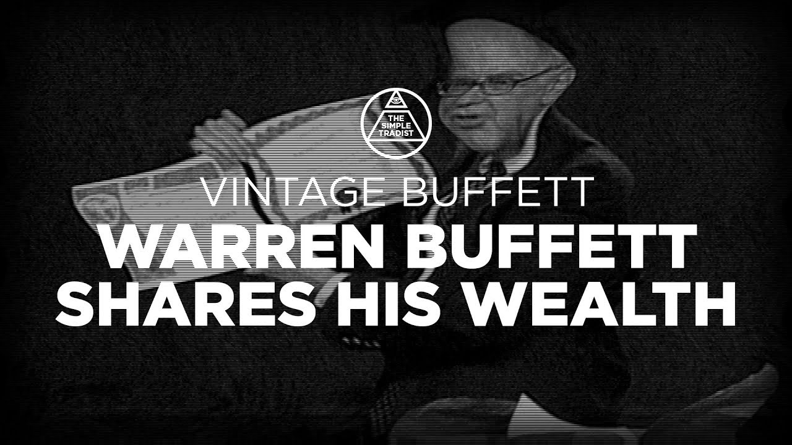

巴菲特田纳西大学工商管理学院演讲（复古录像）

田纳西大学商学院呈献：《Vintage Buffett：沃伦·巴菲特分享他的财富》

自1999年起，田纳西大学商学院的金融专业学生每年都会前往内布拉斯加州奥马哈，拜访并向“奥马哈先知”沃伦·巴菲特学习。2003年2月的访问中，学生们向巴菲特先生赠送了一份礼物，正是这份礼物促成了伯克希尔·哈撒韦公司以17亿美元收购总部位于诺克斯维尔的克莱顿住宅公司——一家制造房屋行业的领军企业。正如巴菲特先生所言：“这实在是非常不同寻常。我不确定历史上还有哪一桩收购案拥有如此背景。”

为感谢最初向他介绍克莱顿住宅公司的那些人，巴菲特先生于2003年秋亲自到访校园，出席商学院一年一度的MBA论坛，并与MBA及金融专业的学生们交流。在访问期间，他还给那群在2月访问过他的人一个惊喜——授予他们“伯克希尔·哈撒韦名誉博士学位”（即“非凡勤奋的交易推动者”），并赠送了伯克希尔·哈撒韦公司的股票，作为慷慨回馈。

沃伦·巴菲特被誉为世界第二富有的人，广受尊敬和钦佩，部分原因是他那充满常识、直截了当的投资理念。这在本片中展现得淋漓尽致。请尽情观看，向沃伦·巴菲特学习——在他回答学生提问的过程中，倾听他向田纳西大学师生传授的投资哲学与丰富经验。

制作单位：ETPTV 东田纳西公共电视台

片长：82分钟

演讲及问答时长1个半小时，共涉及16个问题，非常精彩，以下是完整内容精译：

#### **《巴菲特田纳西大学工商管理学院演讲及问答》**

**巴菲特：**

我们现在所看到的是一份学位证书，我被授权来正式颁发它。伯克希尔·哈撒韦大学授予这位勤奋不懈的交易撮合者Ron Allen一份荣誉博士学位，以表彰他在Clayton Homes收购案中所提供的独到见解和宝贵建议。这份荣誉由本校院长于10月14日正式颁发。在证书的另一面，还附有一股B类股份，作为本次毕业典礼的一部分将赠予Ron Allen。Ron，你是这里首位获得这一荣誉的人。

**主持人：**

本节目的主要资助来自Clayton家族基金会和Clayton Homes，这家公司致力于在美国各地为家庭和个人建造可负担的住房。田纳西大学商学院自1999年以来一直与沃伦·巴菲特保持着合作关系。每年，金融专业的学生都会在教授Al Aqsa的带领下前往内布拉斯加州奥马哈，与“奥马哈先知”沃伦·巴菲特面对面交流并向他学习。

在2003年2月的那次拜访中，学生们送给巴菲特先生一本由Jim Clayton撰写的书，正是这份礼物引发了后续一系列事件，最终促成伯克希尔·哈撒韦以17亿美元收购了总部位于诺克斯维尔、在制造住房行业具有领先地位的Clayton Homes。而关于这桩收购，巴菲特先生自己讲得最好。他说：“这真是件很不寻常的事，我不确定历史上有没有哪次收购像这次有如此的背景。之前几年，学生们来访时通常会带个橄榄球或篮球，而去年这批学生带来的是一本Jim Clayton写的书。结果就是促成了一笔17亿美元的交易。”

为了表达他对田纳西大学学生和教职员工的感激之情，巴菲特先生在2003年秋季亲自访问了校园，并在学院举办的年度MBA研讨会上与MBA及金融学生进行了面对面的交流。在校园访问期间，他还为那些在二月拜访过他的人送上了一份慷慨的礼物——伯克希尔·哈撒韦公司的股票。

沃伦·巴菲特被认为是世界第二富有的人，他之所以备受尊敬和仰慕，部分原因正是因为他那种以常识为基础、直截了当的投资方式。观看本视频之后，你将能更好地理解并欣赏他的投资理念。

请与我们一同观看沃伦·巴菲特的访谈，聆听他如何回答学生的问题，并向学生和教职员工们分享他在投资方面的哲学与宝贵经验。

#### **问题1:&#x20;**“巴菲特先生，你曾犯过最大的投资错误是什么？你从中学到了哪些可以与我们分享的经验？”

**巴菲特：**

“我犯过最大的错误其实并不是做错了什么，而是‘没做’的错。换句话说，那些由于没有采取行动而错失的机会，才是我人生中最严重的错误。这些错误在我们的财务报表中不会体现出来，除非我主动承认，否则没人知道。我曾提过几个例子，比如我们在80年代初没有买入Fannie Mae（房利美）的股票。但我并不认为没买微软是个错误。1991年7月5日，我认识了比尔·盖茨，他花了十个小时向我解释微软。他第二天还说，对一只猩猩解释微软都比对我容易。但我当时确实被微软吸引，我知道盖茨是个非常优秀的人，也是一位杰出的管理者，而微软是一家非常出色的公司。我后来买了100股，只是为了观察它的动向。但那时我对它的了解还不足以做出真正的投资决策。”

我当时确实不了解这个领域里其他人都在做什么，所以那已经超出了我所谓的“能力圈”。在投资中，一个重要的事情不是你的能力圈有多大，而是你是否清楚它的边界在哪里，这样你就能始终待在圈子之内，我们至今都努力遵守这一点。

Fannie Mae（房利美）在1980年代早期其实是在我的能力圈之内，所以当我错过那次机会时，我完全应该为此领一个“吸拇指奖”。如果我错过的是那些我本来就不懂的东西，那也就罢了，但我错过的偏偏是这一个，而它的代价是数十亿美元的损失，这些损失在我们的财务报表中根本不会体现出来。

我现在更常用的例子是更近些年的一个——更糟糕的是，我原本计划购买沃尔玛的股票。当时是在五六年前，我打算买下一亿股（未拆股前，相当于两亿股）沃尔玛的优先股，价格大约是每股23美元。我们如果买了，那可能要花23亿美元，但今天这些股票的价值大概是115到120亿美元。我对沃尔玛的了解已经足够深刻，我知道它是有史以来最强的零售企业。

问题是我确实买入了几百万股，随后股价上涨，大概涨到23又1/8。我本来买的是23美元一股，然后它涨了1/8美元——在伯克希尔，这已经算是大事了。我这个人确实很难调整心态，我的车牌号上写着“节俭”，设计它的人确实说得很对。结果我就像个蠢货一样说：“那我等等，等它跌回原价。”虽然多了不止1/8，但我就是犹豫了。于是，毫无悬念地，我错失了80到90亿美元的利润。

这就是一个典型的错失型错误。现在你已经是B类股东了，请在股东大会上不要为这件事发难。但确实，这些就是你看不到的错误。

至于你能看到的错误，伯克希尔·哈撒韦本身今天其实是三个公司的合并体：最初的伯克希尔·哈撒韦，我们在1965年初获得控股权；然后是Blue Chip Stamps，一家位于加州的消费券公司；以及Diversified Retailing，一家起初在巴尔的摩经营百货店的公司。Blue Chip和Diversified后来并入了伯克希尔。所以，伯克希尔现在的结构就是由这三个部分组成的。

而这三家公司，其实一开始都是错误。最初的伯克希尔是一家纺织公司，净资产约两千万美元，全部资产都在纺织业务上，但那是个糟糕的行业。我买它，仅仅是因为它便宜，不是因为它好。这就是个错误，我花了很长时间才从这个错误中走出来。

我曾在一位极其优秀的人身边学习——他不仅是一位伟大的人，也是一位出色的教师，为我做了很多事。他强调的是购买那些在量化上非常便宜的东西，这种投资理念源自三四十年代，我称之为“烟蒂投资法”。就像你走在街上，看见一个烟蒂，它又湿又恶心，让人反感，但它是免费的——也许还能吸上一口。你想：“我能亏什么呢？”于是你捡起它，从镜子里看，还有一口烟，但它不花你一分钱。所以你得到的只是嘴里一根湿漉漉的烟蒂。

这就是1965年时的伯克希尔·哈撒韦。那是一种错误类型的企业，它在前十年实际上亏损严重，但价格非常便宜，于是我买了进去。然后，我突然就拥有了一家纺织企业——一家位于新英格兰、新贝德福德的纺织公司，在那儿已经有大约100家纺织企业倒闭了，我们却是最后几个还愚蠢地试图盈利的企业之一。拿这样一个公司来作为日后伯克希尔的基础，是非常糟糕的选择。

我们拿着那2000万美元的资本（当时是我们全部的资本）苦苦挣扎了大约20年，试图让它运作起来，但它始终没能成功。如果我一开始就像后来那样去做，比如进入保险、喜诗糖果以及其他各种业务，而且是从零开始，而不是把它们装进伯克希尔，也许盖茨现在得往旁边挪一挪了（笑）。

至于Diversified Retailing，我们1966年去了巴尔的摩，收购了一家百货商店。我们当时以为自己是以三流价格买了一家二流百货，结果我们实际上是以三流价格买了一家四流百货。这一点在几年后我们才意识到，那毫无疑问是个错误。

Blue Chip Stamps（蓝筹印花）是一家消费券公司，你们大多数人可能太年轻，不记得了，但在60年代尤其流行，SNH（注：蓝筹印花的对手之一）当时是一家非常大的公司，而Blue Chip则是在加州设立的。1967或68年我们买入时，它的年营业额达到了1.2亿美元。而现在，在我们“精心管理”下，它的年销售额约为5万美元。我们花了不少努力，把它从1.2亿做到5万，不久之后应该就会完全归零。我们当时买进的是一股“呼啦圈热潮”，但我们当时并没有意识到。

所以，有了这样的背景之后，这三笔投资无疑都是错误的。把这三笔错误加在一起，一错再错，堆成一堆。但后来我们确实也进入了其他业务。

我后来意识到，**在商业中真正重要的事情，是进入优质的企业，与优秀的人共事**——这才是行之有效的策略。这比起去买那些看起来便宜但实际不佳的东西重要得多。那些便宜的标的偶尔可能有效，但绝不是长期建立一个伟大企业的方法。所以说，之前那三笔投资是“做错”的错误。而像沃尔玛、房利美这样的则属于“错失”的错误。

我们明年还会有新的错误。我今年的年报里会有一个章节叫“我今年做过的最蠢的事”，可能会占去整份报告的一半，谁知道呢？不过说实话，我从不会过多纠结这些错误，这根本不重要。整个过程我都很享受，我以后也会继续享受。如果你打高尔夫，每一洞都打出一杆进洞，这个游戏就没意思了。就好像洞里有磁铁，球自动会滚进去，你很快就会放弃高尔夫。更有趣的是去打三杆洞、五杆洞，偶尔进到长草区等等，这才好玩。所以今天我就讲到这里，很高兴见到你们。

#### **问题2:** “巴菲特先生，您能推荐一些有助于我们做出投资决策的书籍或资源吗？”

**巴菲特：**

当然了。对我而言，最好的投资书籍，也是彻底塑造我整个投资框架的那本书，是我19岁时读到的，叫做《聪明的投资者》。这本书是在我就读内布拉斯加大学期间，也就是1949年出版的。我11岁时就开始投资，其实从七八岁起我就琢磨这些事了——真可惜，我直到11岁才真正开始。我买的第一只股票是在11岁，然后我开始尝试各种各样的投资方式，比如择时、看图表、做些奇怪的策略，虽然没有利润，但过程挺有趣。

我持续这样做直到19岁，那时候我把图书馆里所有关于投资的书几乎都看了一遍，我如饥似渴地学习，这一切对我来说都太有吸引力了。但我当时没有任何系统性的框架，只是在四处寻找，试图从图表上的小波动中看出某只股票将会怎么走。

我当时的做法其实挺疯狂的，但因为大家都那么做，我也就跟着做了。有时候我甚至会把图表倒过来看，但还是没什么帮助。直到1949年，我读到了本杰明·格雷厄姆的《聪明的投资者》。在那之前我从未听说过他。这本书里其实真正核心的只有两个章节，但它们在三个方面为我构建了完整的投资哲学框架。它们非常基础，非常简单，以至于你可能难以想象它们竟如此重要——但就像十诫一样，最深刻的道理往往就是最简单的。

第一条原则是：股票是企业的一部分。你不能把股票当成一个独立的东西来看。你应该是去评估一家企业，然后再除以流通在外的股份数量。你必须思考的是你买的是哪种企业，它的经济特征如何，它的竞争对手是谁，管理层表现如何——这些都是关于企业的基本面，而不是一个代码。当我11岁、12岁时，我能说出纽约证券交易所几乎每家公司的股票代码，比如我知道“X”代表美国钢铁，“T”代表AT\&T，但我对这些公司背后的业务一无所知。我必须开始把这些代码、这些报纸上的名字，当作真正的企业来看待，并且思考：我该如何评估这个企业，它的价值体现在哪里。

第二个重要理念，是格雷厄姆在第八章提出的“市场先生”这个概念。他用一个非常精彩的比喻，说明投资者应该如何对待股市波动。在我看来，关于投资者应有的心态，从来没有比这更好的描述了。大多数人对股价的反应都是错误的——股票上涨他们高兴，股票下跌他们沮丧，他们把市场当成是一个老师，仿佛市场每天在教他们该怎么做。

但“市场先生”是你投资上的合伙人，而且是个极其随和的合伙人。他每天都会来告诉你：他愿意花多少钱买你在这个企业中的份额，或是以同样的价格卖给你更多份额。现实生活中没有人会这样做——比如我们合伙开一家加油站，我每天都要求你来报个价，要么你买我的那一半，要么我买你的那一半，而且价格还得一样，那你一定觉得很吃亏。而且，如果你在市场上这么做，那你会更加吃亏，因为市场每天都有人来给你报价——早晚两个价格还都不同。

但“市场先生”这个人，最大的优点在于：他疯疯癫癫，是个患有躁郁症的酒鬼。他整天神志不清地晃来晃去，给你报各种疯狂的价格。可你完全可以不理他，除非这个价格对你有利。不管是一年一次，还是五年一次，甚至是你在三千只股票中只选中一只，只要你抓住机会，你就赢了。你对这个人没有任何道义责任，他报这些价不是你让他报的，而你只需要在他极度抑郁、狂热或醉醺醺的时候出手。这就是股市的魅力。

如果你观察过去一年中美国各大公司的股价高低波动情况，你会发现一个个的例子，它们的最高价是最低价的两倍。而这些企业都是稳健运营、雇佣员工、持续销售产品的优秀美国企业。你要是看农田，就在这儿附近十英里范围内的土地，价格不会从“X”变成“2X”，了不起就是涨到“1.1X”或跌到“0.9X”。同样地，一个普通的公寓楼，价格一整年内变化都不到10%。可股票却上下翻飞，而你唯一要做的，就是在你愿意的时候参与，这才是关键。

格雷厄姆告诉你：市场不是来指导你的，不是来告诉你什么的，市场只是当你需要时，来为你服务的。

在股票投资中，一个非常重要但极难做到的理念是：股票并不知道你持有它。你可能坐在那儿，手里拿着伯克希尔的股票证书，公司根本不知道你是谁，股票更不认识你。它对你毫无情感，你却对它有各种情绪。但它只是一家企业的一部分而已。如果伯克希尔每股价值75,000美元，有150万股，总市值约1100亿美元，那它就是一项好投资；如果不是，那就是糟糕的投资。关键在于评估这家企业的价值，仅此而已。

在华尔街，很多人谈论的是“价格目标”之类的东西，却很少有人写一篇报告，从企业未来二十年的本质出发来分析它应有的价值，而不是它当前的价格。我自己在做投资分析时，非常喜欢一开始不看价格。因为一旦看到价格，它就会潜移默化地影响你的判断。我宁愿拿着公司财报，比如10-K报告，在不了解当前价格的情况下去评估它的真实价值。

你在寻找企业时，应该挑那些拥有“持久竞争优势”的。你不该仅仅因为某地方圆十英里内没有竞争对手，就去买下一家汉堡王的加盟店，因为麦当劳和温迪迟早都会开到那附近。你要看的，不是现在谁赚钱最多，而是哪些企业具有“长期可持续的竞争优势”。

这就意味着你要寻找的是那些有“护城河”的企业。因为资本主义的本质就是——每当某人建起了一座“经济城堡”，就一定会有其他人来攻城夺地。这是它的天然规律。如果你在某个城镇开了一家很成功的餐厅，很快就会有人照搬你的菜单，挖走你的大厨，降价吸客，扩展停车位，甚至做得比你更好。资本主义，就是你追我赶，互相攻击“城堡”。

既然如此，你就希望你的“城堡”有一条宽阔的护城河。护城河的形式可以有很多种，比如专利保护、地理位置优势，或是品牌在人们心中的地位。例如，可口可乐——世界上有六十亿人，几乎每个人对“可口可乐”这个词都有印象，而且大多是正面的。反观RC可乐，人们几乎没有什么印象。即使RC可乐砸下十亿美元做广告，它也很难在消费者心中种下品牌形象。而可口可乐在人们脑海中早已根深蒂固，这就是它的巨大护城河。

这也是为什么可口可乐总想出现在人们快乐的场合：电影院、迪士尼乐园、世界大赛……他们希望你一边喝着可乐，一边体验快乐，这样他们就能卖出更多饮料。而这时，即便有竞争对手的价格便宜半分钱，也丝毫不影响可口可乐的销售量——这就是“持久竞争优势”。

你也希望这些企业由诚实、能干的人管理。你不会想把钱交给一个骗子，或者一个蠢材。当然，最好的企业是那种即便由一个蠢材管理也照样能运营下去的企业。正如彼得·林奇所说：“买下那种傻瓜都能管理的企业，因为早晚会有傻瓜来管理它。”

这句话确实有些道理。前些天，有个学生团队问我：“巴菲特先生，当你老糊涂了以后，伯克希尔会怎么样？”我说：“伯克希尔好得连我老糊涂了都没事。”

事实上，我可能已经是“老糊涂”的那个了（笑）。但这也正说明了，那些企业之所以值得拥有，是因为即便由我这样的人来管理，它们也能运转得很好。所以，理想的企业是：拥有持久竞争优势，由诚实且有能力的管理层经营，同时以合理的价格买入。这就是你要寻找的目标。

如果你现在有一周时间去田纳西州到处考察企业，你会很快就筛掉一大堆企业——你一眼就能判断出哪些领域没有投资潜力。这种“排除”的能力非常重要。

三十年前，《纽约客》有一篇关于鲍比·菲舍尔与斯帕斯基下国际象棋的文章，那场比赛引起了全世界的关注。文章探讨了人的大脑是如何在面对亿万种可能性时，将选择范围迅速缩小到只有几个选项的。这是人类思维的一种神奇能力。

比如，当人类选手与“深蓝”这类超级计算机对弈时，电脑每秒能做几十万甚至上百万次计算，它会检视所有可能的走法。而人类的大脑却可以自动屏蔽掉99.999%的无意义选择，专注于最可能有利的三四个选项。投资其实也是这样。它并不复杂，因为世界上优质企业的数量其实并不多。你只需排除掉大量不合适的，就能聚焦于少数真正值得研究的标的。

如果有人对我说：“你的命运取决于从道琼斯指数中选出十只表现最好并跑赢指数的股票。”我会花大部分时间去思考哪几家公司最差，先把它们剔除。这个方法比直接去找“最好”的十家公司其实更有效。

你若真地以田纳西州为例，你会自动排除很多公司。比如你可能会觉得汽车经销商太难预测——市场竞争激烈，谁知道五年后福特或通用会不会还是主导者？谁知道外国汽车会不会因为关税而改变市场格局？那么你就干脆不研究车商，换个方向。你用在现实企业筛选上的方法，其实完全可以用在股市上。

你面对的是三千多家上市公司，每天它们的估值都在变化。而你一年只需要做一次决策，甚至终身只做几次也完全可以致富。有时候我会跟学生说，他们毕业时如果能拿到一张“打孔卡”，上面只有20个打孔机会，他们反而会更谨慎、更理性。他们不会因为鸡尾酒会上听了某人说什么，第二天早上就匆匆买股票，而是会在每一个决定前深思熟虑。

一生中只需做出20个正确投资，就足以非常富有。关键是——你不能为了轻率的理由用掉任何一个打孔机会。而我们在伯克希尔，不会去买一些小公司，因为那已经对我们不构成影响了。

我们在伯克希尔考虑投资时，都会专注于那些能“真正产生影响”的项目。随着我们管理的资本规模越来越大，找到这类机会变得越来越难，但这是我们做投资时的关注重点。

——“下一个问题是谁？”

#### **问题3:&#x20;**&#x5173;于“何时卖出”的问题，

**巴菲特：**

我踏入投资领域之初，在刚进入本·格雷厄姆的课堂时，手头只有9800美元。当时的问题是，我有太多的投资想法，但钱太少。我翻遍了Moody’s的手册，寻找各种便宜的股票，到处都是便宜货，但我的资金只有9800美元。所以我通常的做法是：买入一样之后，又发现了看起来更便宜、更好的东西，于是不得不卖掉第一个去买第二个。这种状态持续了很长一段时间。

到了1960年代末，我结束了我的投资合伙企业，因为那时我已经找不到投资标的了。不是因为没有好公司，而是因为整个市场已经疯狂。那时我在合伙企业中管理着大约一亿美元的资金，这笔钱还不是难以管理的规模，只是当时的市场根本提供不了任何合理机会。所以我把钱还给了合伙人。

但随着时间推移，我管理的资本越来越大，机会也变得越来越少。如今我几乎从不需要通过卖出某些资产来筹钱去买新资产——这种情况已经不复存在了。现在的情况是，我有的钱比我有的投资点子多，而且大概以后也会一直如此。

所以我会说，如果你手头资金有限，那么当你发现一个回报更高的机会时，你就应该卖掉当前的持仓，去换一个性价比更高的标的。当然，也得看你对两个项目的确定性：如果两个都看起来同样便宜，但你对其中一个把握更大（比如你对一个有100%的信心，另一个只有80%），那你就该选择那个更确定的。

而像我现在这样的情况，基本上是不会轻易卖出的。虽然回头看，我们在泡沫时期其实应该卖掉一些东西，因为那些企业虽然本身不错，但当时的估值实在是荒谬。但即便如此，我对没卖出也不太懊悔——因为就算我们当时把它们卖了，也不过是转成现金，可能之后能买得更便宜，也可能买不到。而从总体上说，当你资金非常充裕时，真正精彩的投资机会是非常稀缺的。

看看这个国家的大多数财富是怎么积累起来的——你会发现，真正的财富常常源自少数优秀企业的长期成长。

通常来说，大多数人的财富都是通过长期持有优质企业而积累起来的。长期持有一家优秀的企业，这并不是世界上最糟糕的选择。这也是上世纪50、60年代那些与我一起投资的人所采取的方式——他们买入之后就一直持有。

当然，有些人在伯克希尔股价过高的时候可能会选择卖出再买回，但这种“跳进跳出”的策略通常效果并不好。所以我会说，如果你对管理层失去了信心，或者这家企业的竞争优势已经不复存在，那就该卖掉。没有必要继续持有一家你不再相信的企业。如果你认为价格高得不合理，也可以考虑卖出，但这属于可选项。而前两种情况则是你“必须”采取行动的理由。

当我早年还在管理小额资金时，我常常能找到一些只有2倍pe的优质企业。如果我当时手上持有的是3倍pe的公司，我会卖掉3倍的那家去买2倍的。回头看，我或许应该借一点钱把两家都留下——但那并不是我的风格。

#### **问题4:&#x20;**“您在评估一家公司时，更看重本益比（P/E）还是‘市盈增长比’（PEG），或者您是否有其他主要评估指标？”

**巴菲特：**

最重要的，是学会如何评估一家企业的价值。这也是最难解释的一点。你需要寻找一些特征，让你可以像我刚才提到的费舍尔对弈斯帕斯基那样，快速缩小目标范围。

打个比方，如果我是篮球教练，走在校园里看到一个七英尺高的男生，我会立刻感兴趣。也许他协调性很差，也许学习成绩不行，也许晚上还干坏事，但不管怎样，他仍然值得我关注。我们可以试着培养他。

所以我会对七英尺或者至少六尺十的人感兴趣。但如果一个五尺三的小伙子跑来展示他花哨的运球技巧，对我说“教练，我就是你的人”，我可能会说：“对不起，你进场后遇到那些七英尺的大个子，恐怕就运不了球了。”他可能是个很有前途的球员，但我不会优先考虑他。

在投资中我也采取类似的方式。我寻找一些“信号”，就像教练看到一个大个子球员那样，先缩小范围。在最终的决策中，我会选择那些让我极度确信其具有竞争优势、让我非常信任其管理层诚实与能力的企业；同时，我要相信这家企业未来所产生的现金流折现值，相对于当前股价而言，是合理的。

你真正要寻找的，是那些你能“看到未来”的企业。这也是我们为什么不轻易涉足科技行业。不是因为我不喜欢电脑，事实上我非常欣赏它们对社会的种种贡献。但问题在于，我不知道十年后这项技术会变成什么样——谁会销售哪些产品、价格会如何、竞争对手会是谁，这些我都看不清楚。

相反，我可以非常确定，十年后人们仍然会嚼Wrigley’s（绿箭）口香糖。坐在电脑前嚼口香糖的人，他们的行为和现在这个房间里嚼口香糖的人不会有任何不同。这种需求不会受到技术变革的影响。

又比如吉列的剃须刀。在全球范围内，剃须刀和刀片市场的70%由吉列占据。这个市场已经存在了将近一百年，几乎每个人都知道剃须刀是干什么的，所有企业都知道如何采购钢材，也都知道如何通过沃尔玛或其他渠道销售产品。但吉列依然能占据主导地位。

其中一个原因是：男性不像女性那样容易改变习惯。一个男人只要对某样东西满意，他通常就不会再折腾。而女性则更可能去尝试新产品。但是，剃须这件事，是每天都要做的事情。每年只花二十五美元，就能获得吉列这种优质体验，这已经是目前世界上所能提供的最好产品之一。

最近有人宣传什么四层刀片的剃须刀，但你不必为此担心——吉列依然保持着70%的市场份额。

再看可口可乐——每年售出190亿箱可乐产品，全世界的人都在喝。你觉得在未来十年，这种状况会发生剧烈变化吗？我觉得不会。

我敢说，我的判断可以拿命来打赌。我们在加州销售See’s糖果——那可是一个有三千五百万人口的州。他们上周二做出了正确的选择，买了See’s，有人问我是怎么参与施瓦辛格竞选的，我说我赢了一场“长得像他”的比赛（笑）。

重点是，加州这三千五百万人，每个人的脑海里对See’s糖果都有印象。你能立刻想到哪些糖果？排在第一的棒棒糖是Snickers（士力架）——十年前是它，二十年前还是它。人们在糖果这件事上可不爱尝试新东西。你没法不断推出新款糖果就让消费者感兴趣，这不像香水或其他那些人们喜欢尝试的产品。

你去药店说想买一块Snickers，对方告诉你：“我这有个便宜五美分的替代品，叫‘Joe Schmo’s焦糖坚果棒’，味道一样好。”你大概率会转身走到街对面去找Snickers。也就是说，如果你能让顾客“为了你的产品走到街对面”，那么你就拥有一个真正的生意。这才是检验产品价值的标准。

而当一件产品的售价高出五美分却仍旧能稳稳卖出，那就说明它具备了强大的品牌力。你几乎没法用“价格”来击败Snickers。而这种优势同样存在于吉列剃须刀、See’s糖果、可口可乐等产品中。反过来说，还有很多产品并不具备这种优势。

这背后的核心，是“护城河”——可能体现在产品差异、服务差异、渠道差异、地理位置差异等各种方面。这种护城河至关重要。

#### **问题5: “**&#x5DF4;菲特先生，过去20年市场机制的技术变革和互联网的发展，是否显著改变了投资者的心理？或者说，投资者仍然在犯相同的错误？”

**巴菲特：**

（巴菲特一边喝着饮料一边回答）我刚刚喝的这饮料，如果观众中有人也在喝，无论喝哪种，只要你打开了易拉罐——我们每12罐大概能从中获得一罐的利润（笑）。

我认为，互联网和高科技浪潮只是人们“疯狂”的一个借口。人们会周期性地在市场中失去理智，你可以去读一读“南海泡沫”、“郁金香狂热”这些历史案例。人类在市场中，隔一段时间就会犯一次同样的错。哪怕是高智商的人，也会犯错。这是个很有趣的现象。

我读书时，会去找过去各种金融恐慌和繁荣时期的报纸文章来看。人们总是反复犯同样的错误，非常容易受“羊群效应”影响。每次市场疯狂的时候，人们总会找一个听起来“这次不一样”的借口。但真相是：如果我今天口袋里有10美元，那是我从一家企业获得的分红，那么这10美元无论是来自Wrigley’s口香糖还是一家互联网公司，意义完全一样。

我的意思是，钱花起来是一样的。所以，衡量一个企业好坏的标准，不在于它是否做了什么“光鲜亮丽”的新东西，而在于它未来能产生多少现金流。这是唯一的标准。投资的本质就是今天拿出钱，为了将来拿回更多的钱。换种方式投入就不叫投资了。

钱本身并不在乎它来自哪里。它的来源可能意味着某些与持久竞争优势相关的因素等等，但来自互联网公司的钱，与来自纺织公司或糖果公司的钱，本质上没有区别。

互联网只是“新鲜事物”中的一个。在1950年代是铀矿热潮，60年代末是计算机租赁，各种新鲜潮流不断冒出，而价格上涨常常伴随着这些光环。到最后，人们甚至会因为价格持续上涨而把它当作买入的理由。他们可能在头脑中用更“知识化”的方式为自己辩解，但实质上只是变得兴奋了而已。

人们总会兴奋。贪婪与恐惧是市场中的主导情绪。你在有生之年一定会再度看到极端的贪婪与极端的恐惧，程度不亚于历史上任何一次。人类在这方面并不会变得更聪明，也不会改掉这个毛病——这就是个“令人振奋”的消息（笑）。你要做的是：从别人的愚蠢中获利，而不是参与其中。

拥有正确的性格气质，比聪明的智力更重要。如果你智力中等，但有合适的投资气质，你将变得非常富有。如果你性格不合适，那你最终一定会出问题——不管你多聪明，任何数乘以零，结果还是零。1998年，长期资本管理公司就发现了这一点。他们的问题非常罕见，但确实发生了。

你知道美国本土历史上最大的地震发生在哪里吗？是在密苏里州的新马德里。那里的人今天并不会整天担心再来一次8.4级地震，但历史上确实在两个月内连发三次。这种“极小概率事件”确实存在。而在金融市场中，这类“不可能事件”发生的频率，远高于人们用统计回归模型所预测的频率。五个标准差的事件其实一点也不少见。

所以，你必须始终保持理智。简单的方法是：每次买股票时，在纸上写下来，“我正在买入某某公司，这家公司不管是做零件的，还是互联网企业，它总共发行一亿股，股价十美元，那我就是以十亿美元在买这个公司。”然后写下你买它的理由。

如果更多人这样做，市场上就不会有那么多泡沫。但事实是，他们不会这样做，因为人类几百年来的情绪都是一样的。

正如我所说，正是因为这种人性，股市才会充满令人难以置信的投资机会。

这也是为什么股票价格在一年内的最高点常常是最低点的两倍——即使大家都知道，一个企业的内在价值不可能在一年内发生那样剧烈的变化，除非出现了极端情况。

#### **问题6：**“我非常想知道，世界上最伟大的投资者到底是怎么安排他的时间的。能不能具体说说沃伦·巴菲特的一天是怎么过的？当然，在不泄露‘秘密武器’的前提下，您平时是如何开展投资活动的？”

**巴菲特：**

这个回答可能会让你有些失望。我现在每周至少花12个小时在网上打桥牌——这是我“致富秘籍”的一部分（笑）。白天我读很多资料，偶尔打几个电话。我们没有任何形式的会议，真的没有。我想了想，我们大概15年前有一次，把所有的CEO们叫到一起开了个会，谈了点事情。但有些人从没来过奥马哈——他们错过很多精彩（笑）。

你可能会惊讶我每天做的事情有多么少。现在你已经是伯克希尔的股东了，不许抱怨（笑）。

我读很多年报，虽然没有以前那么多，也读很多10-K报告。每天我都会翻几份出来看。我想尽可能了解更多的企业。

投资的好处就在于它是“累积性的”。三四十年前学到的知识，今天仍然存在于我的脑海中。你一直都在学习。这并不意味着你会了解市场上90%甚至80%的公司，但我过去学到的关于石油、房地产、百货业等知识，依旧存在。你持续不断地积累一点知识，然后某一天，你会“看到一个七英尺高的球员走过”，也就是一个真正的投资机会出现了——那时你就会集中精力去深入研究那个企业。

然后你需要果断行动。

我不会经常打电话给旗下公司的经理们，通常都是他们主动联系我。有些经理一年只打一次电话给我；也有一个，我几乎每晚都会和他通话。

我有一些经理每周和我通话一次，这更多取决于他们的个性。他们自己经营自己的业务，他们很了解自己的企业。我不会亲自去经营他们的公司，我们总部也没有人去插手这些业务的运营。所以我完全依靠那些用十几年时间建立起成功企业的人继续保持他们的做法——这并不是一个很高的要求。他们确实做到了。

有些人喜欢和我聊天，有些人现在并不太喜欢与我沟通，我也不介意。我通常晚上也会思考各种问题，但平时早上大概8:30到办公室，工作到下午5点左右。如果你给我计时，我每天大概有一小时到一小时半的时间在打电话，剩下的时间都在读资料。

对我来说，伯克希尔的一个美妙之处在于——我得以亲手“创造”了这家企业。我接手时基本是一张白纸，有的是纺织业务的负担，但我有机会自己“作画”。如果你能自己决定这幅画的模样，那你最好画出一幅你最终会喜欢的画。

而我不喜欢开会，也不喜欢繁琐的流程。所以我把伯克希尔打造成了适合我的“公司画作”。这种模式对我很有效，但可能对别人并不适用。如果让我去一周参加五次黑领结正式晚宴，或者频繁出席行业会议，我根本无法适应——我宁愿回去送报纸，那还更有意思。这是真心话。

伯克希尔就是这样为我而设计的——我可以打很多桥牌，读很多材料。我无法想象还有什么比这更让我快乐的生活。如果有，我早就去做了。

这就是我在伯克希尔的一天——听上去是不是很“激动人心”？（笑）

#### **问题7：**“巴菲特先生，您怎么看未来40年美国股市的平均回报率？”

**巴菲特：**

40年之后我可能还在，到时候再告诉你（笑）。不过，如果在那40年里，平均通胀率保持在2%到3%左右，也就是说宏观环境没有发生特别极端的变化，我认为普通企业的平均回报率大概是7%左右。

换句话说，如果我们所有人一起买下整个“企业版美国”，然后彼此之间从不交易，那么在这种环境下，我们这个群体的平均回报可能就是7%。

但现实中，美国投资者被教育成必须频繁买进卖出，你要把股票卖给旁边的人，他再卖给另一个人——这就引入了我所谓的“摩擦成本”。比如你买入共同基金，有管理费、销售手续费、12b-1费用等；你买个股，也有各种交易成本。

这些摩擦成本，加在一起大约每年会吞掉1%的年回报。当然你也可以尽量减少，比如你持有伯克希尔40年，除了最初一次很小的交易佣金外，几乎没有其他成本；我们的管理费用也非常低。

但因为大多数人把股市当成赌场看待，美国大众整体上每年会损失大约1%的回报。如果原始的年回报是7%，那么真正落到投资者手里的，大约只有6%。

想一想，这其实是个非常高的“抽成”——等于从企业赚来的每7块钱中，就有1块被各种中介机构拿走了，相当于14%的回报被抽走了。这就是我对未来大致的判断。

你可以自己控制住摩擦成本，然后让别人去为更高的成本买单。但如果你身处投资领域，每年承担2%到3%的摩擦成本——想想那些日内交易者承受的成本——那么你就把美国企业原本应带来的大量真实成果白白拱手让人了。

比如，通用汽车、埃克森美孚、美国电话电报公司等，它们的盈利能力，和它们的股东是否不断买卖股票毫无关系。我们这些人坐在一个房间里，假设我们集体拥有整个美国企业体系。如果你不停地与别人互换“座位”（也就是股票），那么每次交换你都要付出代价。如果你一直静静持有，那企业所赚的钱就是你的全部。但如果你频繁交易，那些收益就会转移给那些建议你频繁买卖、把你从一个“椅子”引导到另一个“椅子”的人。

#### **问题8：**“关于市场未来的运行方式……”

**巴菲特：**

从长期来看，市场大体上仍会如同以往那样运行。大多数时候，它们会在合理范围内为企业定价；但它们也会周期性地疯狂——或上涨过头，或下跌过头。

比如1974年，市场就完全在“下行”方面疯了。那段时间里，很多优质企业的价格低得令人难以置信。以《华盛顿邮报》公司为例，当时它的整体市值只有8000万美元。而这家公司拥有《华盛顿邮报》报纸、新闻周刊（Newsweek），还拥有四家大型电视台，其中包括位于华盛顿、迈阿密、杰克逊维尔和哈特福德的电视台。此外，它还拥有Bowater造纸厂的一半股份，80万英亩林地，还持有《国际先驱论坛报》的三分之一股份，几乎没有负债。

8000万美元买下一切？简直就是个笑话。那个时候，如果你宣布在大西洋正中央、凌晨2点开拍卖会来出售这些资产，仍会有一大群人愿意出价至少5亿美元来竞拍。也就是说，你可以用8000万美元的价格，买下市值实打实接近5亿美元的优质企业资产。

而这还是在一个遍布高智商金融专家、商学院毕业生的世界里发生的事。华盛顿邮报公司当时的管理团队——格雷厄姆家族——显然是既诚实又有才能的。他们所经营的企业基础也很扎实。

如今，这家公司并没有因为发现了石油才价值倍增。它的业务本质上没变，但今天它的市值已经达到了大约70亿美元。这是一个五亿美元价值的企业，在三十年里成长为七十亿美元，仅靠优秀的管理和优质资产。而当年你本可以用区区8000万美元将其收入囊中。

我们伯克希尔曾经持有一些《华盛顿邮报》的股票，当时花了不到一千万美元买入，现在价值大约十二亿美元，或者差不多这个数。而这一切没有什么玄妙的地方——只是人们有时会变得疯狂。

如果你问我对未来金融市场的看法，我可以非常自信地预测：你将会看到一些令人难以置信的市场异象。只不过我不知道它们会何时出现，也不知道顺序如何——我不知道人们是先变得贪婪还是先变得恐惧。但在接下来的三四十年里，你一定会见到一些极端现象。而在那样的时候，你必须具备独立思考的能力。

目前，美国股市的总市值大约是13到14万亿美元，接近全球股市市值的一半。所以，除非你手上的资金已经远超我的水平，否则你其实不需要非得去全球范围投资。

举个例子，如果你持有可口可乐股票，那么它超过三分之二的盈利其实都来自美国以外的市场。吉列、其他企业也一样。所以，如果你想扩大投资领域，那当然没问题，但单看美国市场，未来三四十年也会有非常不错的表现。

#### **问题9:&#x20;**“巴菲特先生，您能谈谈您对房地产投资的总体看法吗？”

**巴菲特：**

房地产，通常你说的是“直接持有”房地产，那基本上就是谈地方市场了。许多人在这方面是有优势的，因为他们最了解自己所在的本地市场。

对任何资产类别，都没有什么“魔法”，也没有什么可怕的地方。我怎么看股票？那取决于是哪支股票、什么时候、什么价格，等等一系列因素。房地产也是同样道理。

不过我会说，对于很多人来说，房地产是他们很容易理解的领域。而且有些情况下，小规模参与还能通过“汗水资本”（自己动手管理、修缮等）来获得额外收益。

人们通常在买房地产时会使用杠杆，这意味着他们的收益和亏损都会被放大。我并不建议在股票上使用杠杆，但在房地产上使用杠杆，相对更容易、也更安全。因为人们能看到实际的房产，而且能拿到长期贷款。而我把股票投资中的杠杆看作“毒药”，它可能毁掉的聪明人，比任何其他东西都多。

我几乎从不在股票上使用杠杆。但在房地产领域，适当使用是完全合理的。我认为很多人对他们所拥有的房地产——尤其是本地市场的那些房产——的了解，远远超过他们对所持有的股票或投资顾问的了解。

我自己过去几年也做过一些房地产投资，虽然不多，但我认为这完全是一个不错的资产类别。归根结底，关键还是预测你能从资产中获得的未来收入，并将其与当前价格作比较。

无论你买的是石油权利、房地产，还是任何形式的投资，本质上都是现在拿出钱，将来赚回更多。你对未来回报有多大把握？如果你觉得自己对房地产更了解，更有信心能预测它的收益流，那我建议你坚持在房地产领域进行投资，那是你能力圈的一部分。

我的意思是，你应该去参与那个你最了解的“游戏”。

#### **问题10：**“巴菲特先生，您觉得像汽车行业这样的本土制造业是否有可能再次成功地与外国生产商竞争？”

**巴菲特：**

这是一个非常棒的问题，我可能很快就会写一篇文章来谈这个话题。我们确实在一些非常重要的行业中失去了竞争力。

我曾经在纺织行业，那是一个非常艰难的行业。自从我退出之后，它变得更艰难了。事实上，我们在全球范围内的竞争力确实不强。比如说Fruit of the Loom内衣（这家公司属于伯克希尔旗下），大约两万个员工中，有一万六千人在美国以外工作（这个数字我大致估的，但很接近）。而且生产已经从墨西哥进一步转移到了成本更低的国家。

我们也涉足鞋类业务。美国人每年购买大约12亿双鞋——人均四双。对我来说这太不可思议了，因为我大概每十年才买一双鞋。我们简直就是“伊美尔达·马科斯的国家”（菲律宾前第一夫人，以买鞋成癖著称）。但问题是，我们几乎不再在美国制造鞋了。过去我们国内产鞋能满足大部分内需，而现在，这12亿双鞋中，在美国本土制造的可能还不到五千万双。这意味着损失了几十万的工作岗位。

现在你可以在家具制造业看到相同的趋势。我们的家具零售商正转向中国，当然也有其他亚洲国家。因为我们购买量大，所以可以派人过去直接采购。实际上，在很多情况下，你根本看不出这些家具和美国制造的有什么区别——除了价格。

而美国消费者总是会选择价格低、质量好的商品来投票。所以在全球市场中，美国产品必须面对强大的价格压力。

至于汽车行业，我们在这个领域仍有一定的实力。我们国内汽车公司最大的问题是“历史负担成本”（legacy costs）。在上世纪60年代，通用汽车几乎是全国最大的公司，人们都把它当作美国制造业的象征，当时它占据了50%以上的汽车产量。他们面临的最大问题不是“做得不够”，而是“做得太多”。

在那个时候，他们与工会（UAW）签订了一些合同，做出了许多未来承诺，尤其是在退休后的健康保险和养老金方面。而当时的会计制度，不要求他们把这些成本立即计入损益表。也就是说，他们可以承诺未来为员工提供这些福利，但不必在当年财务报表上显示这笔负债。

这说明，会计制度可以导致糟糕的决策。如果他们是保险公司，那就必须把这些承诺记为负债；但作为汽车公司，他们不用立即反映出来。

于是，当工会在谈判中需要在“提高工资”与“增加退休福利”之间二选一时，公司就更愿意答应那些不需要立刻反映在账面上的承诺，比如退休后的健康保障和养老金，从而避免直接提高计入当年成本的小时工资。

于是，他们做出了这些决策，最终开始付出代价。这些代价不仅体现在实际的支付上，后来会计规则也发生了变化，所以他们最终连会计上也逃不掉。最先是养老金方面，必须开始在账上体现，随后是退休后的健康保险。因此你看到像通用汽车这样的公司，现在的管理层本质上已经被迫经营一家保险公司——一家巨大的保险公司，要支付巨额的健康开支和养老金。

他们领取这些福利的人数，甚至多于还在公司工作的员工数量。而这部分支出必须计入每辆车的成本中，这就使得他们在全球市场上的竞争力远不如本可以达到的水平。

我们在投资时，尽量避免涉足那些“劳动密集度”很高的行业，特别是当这些劳动可以在其他地方被复制的时候。因为经过四十五年，或者多少年的经验，我终于明白了一件事：如果其他人支付给某个工人的工资是我们支付的四分之一或五分之一，而他们生产的产品和我们一样，那他们迟早会把我们击垮。

#### **问题11：**“大约一代人之前，人们可能一生只会有一两次职业变动，然后就退休。而我这一代的同龄人，职业生涯中平均要经历近八次的职业转换，更不用说换工作了。您认为这对美国的劳动市场产生了怎样的影响？是好是坏？”

**巴菲特：**

我只能从我们自己的角度来讲一点。我不会接受一份让我感到不快乐的工作。学生时代的暑假，我也打过一些工，但我不会想要一份让我不喜欢的长期工作。我的想法是，我愿意接受一份工作，并期望随着时间推移获得晋升，而不是接受一份我根本不喜欢的工作。

我认为那种“先干一堆自己不喜欢的事，是为了将来能美化简历”的逻辑是很荒唐的。你换六份工作之后，才终于找到那个你真正想做的位置？那也太迟了。

我记得有一位学生在送我去学校的路上跟我说，他本科在这所学校读书，然后去了一家审计公司工作，现在在读研究生。接下来他想加入一家管理咨询公司，他说这样能让自己的简历更“完整”。他说完后问我：“您怎么看？”

我对他说：“我的看法是——这听起来就像是在为老年时期存‘性生活’。你到底什么时候才真正去做你喜欢的事情呢？这太荒唐了。”

所以，首先要做的是找一份你喜欢的工作，一份你尊敬那个人或那家公司的工作。你可能会在那儿干上一辈子，也可能不会，但你应该以“我会在这里待一辈子”的心态去选择。

我们伯克希尔有很多员工，他们一生都投入到自己热爱的事业中。Alo Shee（注：即Al Ueltschi）经营FlightSafety公司，他1951年用一万美元起家。如今这是世界领先的飞行培训学校，拥有很多校区和模拟器设备。他现在大约85岁了，还在做着自己热爱的工作。

这才是明智之举。你大概只活一次（当然雪莉·麦克莱恩可能知道得更多（笑）），但人生的时间不会回头。所以你应该从事让你感到快乐的工作。

我认为，那些频繁跳槽的人，其实在生活中错失了一些东西。如果如今更多人都这么做，那我觉得这可能是个错误。当然，这不代表你不能换工作——你肯定会遇到新机会，也许你会发现原来那份工作并不是你真正热爱的。但你进入一份工作时，就该以“每天早上都想跳下床、迫不及待去上班”的心态开始。

即便我现在73岁，我仍然有这种感觉。每天我都很兴奋。而另一方面，有很多工作，即使我没钱，我也不愿意做——哪怕给我任何报酬。我宁可去送报纸，也不愿整天做那些让我不愿意做的事。

举个例子，如果我每年能赚7万5千美元，并且每周可以玩12小时桥牌，而换成年薪30万美元却得放弃桥牌时间，那我绝不会去换。绝对不会。

#### **问题12：**&#x5DF4;菲特先生，在考虑收购一家公司时，您最看重管理团队的哪些品质？最重要的，或者说您首先考虑的管理团队的哪些素质？

**巴菲特：**

嗯，你希望管理团队里的人……我是说，你不希望他们只是爱钱，你希望他们是真正热爱自己的事业。我在收购一家企业时首先看的就是这个，因为通常，卖给我的人接下来还会继续运营这家公司——并不是每次都这样，但大多数时候都是。所以我必须观察他们，判断他们是爱钱，还是爱这份事业。我从不会依赖合同来留住某人。所以我在寻找的是那些热爱自己事业的人。

比如Alyosha，他热爱自己的事业。他做这件事，是因为他真正喜欢培训人，他觉得自己是在拯救生命。而且确实如此，美国的飞行员培训在过去五十年有了巨大的进步——现在更安全了，因为飞行员的培训更好了。他对此很有成就感，而且他现在对这份事业的感受和五十年前一样。他热爱这份事业，尽管他也因此赚了不少钱，但他工作不是为了赚钱。

所以我在找的管理层是那些真心热爱自己所做事情的人。当然，我也在寻找诚实的人，但通常两者是相伴而来的。我常说，本质上我们在寻找的管理者或者员工，是那些有智慧、有活力、并且有诚信的人。如果他们没有最后那一项——诚信，那么前两项反而会害了你。因为如果你有一个没有诚信的人，那你可千万别让他聪明又有活力，你倒宁愿他又笨又懒，这样至少不会闯太大祸。

但如果你找到这三种品质都具备的人——而我们确实找到了不少这样的人——那你就非常幸运。比如一个人如果已经成功经营一家公司三十年，你就知道他对这门生意非常了解，他精力充沛，否则他根本不会成功。而且说实话，无论他是否仍拥有这家公司，他都不会想伤害它——对他来说，这家公司就像是他的孩子，就像是一幅他亲手创作的画。所以如果他后来做出任何有害的事情，那就等于是毁了自己的作品。

我们很幸运，找到了很多这样的人。伯克希尔是他们的好归宿，而且这一点已经被广泛认可。所以我们自然而然地有了一个筛选机制，让这样的人来到伯克希尔。如果他们因为某种原因需要处理自己的公司，那伯克希尔就是一个非常理想的去处，而事实也是如此。这也意味着我们得以迎来一批极优秀的“住户”。

#### **问题13：**&#x5DF4;菲特先生，请问如果要从一千家公司中挑选，您会优先关注哪三个领域或行业？

**巴菲特：**

嗯，我会关注我了解的领域。比如汽车，我懂保险，我在这个行业干了很久了；我也懂得大多数金融类业务；我也了解零售业的某些方面。零售业可能有点复杂，但我确实对它有理解。所以我只会关注那些我最了解的事情。

当然，有些投资是偶然出现的，是它们自己跑上门来的。比如几年前我并不是刻意要去做内衣生意——可能你们当中有人一辈子梦想进入内衣行业，但我并没有特别想过。但Fruit of the Loom破产了，而我其实对这家公司非常熟悉——比你想象中还熟悉。我第一次了解它是在四十五年前。而且我明白那家公司当时的情况，其实这不是一个复杂的生意。你去沃尔玛看看，基本就是Fruit of the Loom和Hanes。

这家公司之前有很糟糕的财务历史，因为他们借了太多钱，后来也有一段时期管理不善，但这都是可以解决的问题。所以我的头脑已经有所准备，加上我过去的背景让我能够理解这家公司当时在出售什么。

此外，我们还有一位非常出色的管理者愿意回来，他就是John Holland，曾经在这家公司表现良好时负责运营。我知道，有了John Holland，再加上品牌的实力以及这类生意的性质，这就是一笔值得我们去做的交易。

但我并没有预先列好什么行业清单——这事是自己冒出来的。之所以冒出来，是因为有人借了太多的钱，然后公司破产了。如果他们当初没有犯错误的政策决策，我可能永远都不会注意到它。而如果我不能请回John Holland来重新管理这家公司，我也不会买它。因为说实话，我又不懂怎么做内衣。

所以关键是你是否理解某个行业。你可能能理解一些我无法理解的事情，反之亦然。我做过很多零售方面的事，现在我们也拥有一批家具零售企业。我觉得，凭借我已有的经验，我大概可以轻松评估另一个家具零售商的情况。而且我还有一个由五位优秀管理者组成的团队，他们可以告诉我一个新企业的管理层表现如何，也能告诉我他们在行业中的市场地位等等——当然，我自己也能学到很多。

所以我脑海中并没有列着三个明确的行业说“我明天就要去研究这三个”。事实上，我们正在收购一家破产中的公司，这家公司主要销售地震勘探数据——他们拥有一个地震数据资料库。他们出问题是因为借了太多钱，还搞了些疯狂的冒险行为。但这家公司本身的业务非常扎实，虽然规模不大，但我能理解一个拥有地震数据资料库的企业在向希望在特定地区钻探的人出售或租赁这些信息方面能做些什么。

这家公司原本完全不在我的视野里，直到五月或六月，我有机会购买它的整笔债券，从而可能控制整个公司，所以机会才出现了。

所以你必须做好准备，然后你必须知道自己能了解什么，不能了解什么。你必须清晰地知道自己的能力圈在哪里——这点非常重要。

#### **问题14：** “巴菲特先生，关于石油和能源投资，您更偏好炼油、石油服务还是石油勘探？”

**巴菲特：**&#x20;

嗯，我在所罗门工作的时候，我们曾拥有每天数十万桶的炼油能力。炼油业务很有趣，因为它总给人一种“过紧”的感觉。这是个商品业务，你把油加到油箱里，你根本不会关心它来自哪家炼油厂——对你来说，加油就是加油。所以，炼油什么时候能赚钱？就是它供应紧张的时候。一个助于形成紧张局面的因素是：在美国，人们现在几乎不再新建炼油厂，因为这是个艰难的行业，环境问题多。

你会想，随着油料需求不断增长，而炼油厂不再增加，总有一天会供应紧张。我等了很久，但他们有一种“产能爬升”（capacity creep）的现象：也就是你通过技术手段把20万桶/天的炼油厂提升到21万桶/天。这种“微调”使产能模糊，所以我不会试图“选择时机”。炼油唯一有利可图的时候就是在供应真正紧张的时候，而那时你也很难介入。

至于石油勘探，在美国这个国家并不是很赚钱。你钻井、产生各种成本，然后根据油田的寿命——大概十年——卖油，这是一种“前期投入，现在花钱，十年后逐步收回”的模型。它的库存周期很长，从理论上看，如果你现在花的钱希望在十年内收回来，就得赚很高的倍数。

如果你看全球情况，美国以外的公司（像埃克森、荷兰皇家、BP）在资本回报率方面算是还不错的。霍华德·休斯靠的是一种专有技术起家——他父亲在休斯工具公司开发了一项独特产品。如果你提供的是第一步钻井成本10万美元，而你的产品能解决其中价值4万美元的问题，这就是一个非常好的机会。你总想找这样的机会：在一个非常大的项目中，你只拥有其中关键的一小部分；那就不是“小利润”——因为你拥有唯一的关键部分。

石油服务也得看具体产品，以及专利还能持续多久、你能如何保护这个专有技术。

我们也投资石油行业。例如，我们是中国石油（PetroChina）的第三大股东。这家公司出产量约是埃克森石油的80%，日产约200万桶，约占全球油产的3%，规模很大。一年前，它的股价非常低。加上油价上涨，而中国在国内的油价是与国际价格挂钩的，所以其盈利随着油价波动。它的年报以英文披露，内容清晰易懂，盈利倍数远低于其他大型石油公司，看起来他们用钱的方式和其他油企一样理智，因此我们就买入了。中国政府拥有其90%的股权，就像你在伯克希尔持有那么点牛肉股票似的——如果我和中国政府一起投票，我们就掌握控制权。

炼油行业有时候确实能赚钱——看所谓的“裂解价差”（crack spread）：汽油、取暖油等产品的价格减去原油价格，如果差价放大，炼油厂就赚得多。但他们对这个差价几乎没控制权，只要市场不紧，他们就难以赚大钱。

我们纺织业务过去也只能靠偶尔的“涨价机会”赚钱。那一年我们生产全国一半的西装衬里。没人买衬里时，我们还是供应商年奖得主，但我们试图涨价一四分钱一码，却被客户无情拒绝——他们根本不在乎我们是谁。那就是典型的商品业务。唯一赚钱的时候是“人棉紧张”那几天——因为我们当时能从杜邦拿到配额，当人棉供不应求时，就能涨价，一天之内就赚到钱，可一旦供应回归正常，又恢复原状。我们的利润并不取决于那些纺织机或棉纱，而完全取决于人棉配额。如果值钱了，那我们就赚钱；如果不值钱，就没钱赚——这就是商品生意，对不起，残酷但真实。偶尔很赚钱，但大多数时候都是干不长的。

#### **问题15：**&#x4F60;好，很高兴见到你，你谈了很多关于你的投资哲学，能否总结一下，只给我们一个投资建议？哪一条是最重要的？

**巴菲特：**

人们总是想要那个“最重要的”建议。你知道，我倒真希望有那么一个万能的方法能一劳永逸地解决所有问题。但我想说的是，如果你能真正把我之前提到的那三个原则深植于骨髓里，让你以后每一个决策都基于它们来思考——那三个原则分别是：股票是一门生意；市场是为你服务的，而不是指引你；永远保持安全边际——如果你始终按这三个标准来过滤所有想法，你就不会做出糟糕的投资决定。

不过，真的没有什么魔法公式。我真希望有，但事实上不可能。这是一件非常现实的事。我并不相信市场是完全有效的，但它们在大多数时候还是相当有效的。毕竟有那么多聪明人拼命想赚钱，他们很努力，这就使得这是一个极具竞争性的游戏，所以不可能存在什么简单的小窍门，唯一的方法就是努力工作。

我可以告诉你，我刚从学校毕业那会儿，市场上有很多非常便宜的股票。可没人告诉我任何一个。我是真的一个个翻阅了《穆迪银行与金融手册》《工业手册》《运输手册》《公用事业手册》——这些书加起来大概有一万五千页，我每一页都看了。因为没人会告诉我哪里有那些极度便宜的股票，我只能自己去一个个找。

如果我现在只有一小笔资金，我还会再做一次同样的事情——在那些小公司里重新找一遍。我是说，只要你努力去做，你就一定会找到机会。

#### **问题16:&#x20;**&#x6700;近，《财富》杂志将您评为商界最具影响力的人。我想知道，您是如何衡量“成功”的？您会如何看待这类排名？

**巴菲特：**

好吧，我会给你一个你可能意想不到的回答。关于“成功”这件事，如果你说的是“商业成功”的话——我并不认为那是“唯一的成功”或“最重要的成功”——但如果只是就商业而言，那成功就是：长期经营好一家企业，从而你自己表现出色，你的股东受益，你与你共事的人也受益。

但如果你真的谈论的是“作为一个人”的成功，那么——你知道的——在我这个年纪，如果你有一个标准，那就是：你是否拥有一群“愿意藏起你”的人。

我有一个朋友，1942年时曾在德国的集中营里失去了家人。她现在住在奥马哈，今年七十多岁。她跟我说，看一个人，最终要问的是：“他们会不会藏起我？”你知道的，这才是真正的检验。

如果你在人生的这个阶段，还有许多人——比喻地说——愿意藏起你，那你会觉得自己活得很不错，那你就是成功的。反之，如果你过了一生，连自己的孩子、邻居、同事都不会为你这么做，那你就是失败的。我是这么看的，我也见过两种人的下场。

这是一个终极的衡量标准，而它是买不来的。说实话，这让我有点烦，因为你知道的，要被爱，其实只要“值得被爱”就行了。可悲的是，你不能开张一百万美元的支票去换来别人爱你。

我有很多朋友，其中一些已经去世，但每个人都爱他们。你在他们身边的行为举止比你在其他人身边更好——你从他们身上学到东西，而他们走的时候，都是带着“成功”离开的。这个公式其实很简单。

可惜的是，很多人直到太晚才懂。他们养成了一些让人反感的习惯——如果这些习惯出现在别人身上，他们自己也会厌恶。可是他们却没有意识到。

我的老板本·格雷厄姆在十几岁时曾经坐下来，问自己：“我喜欢别人身上哪些特质？我钦佩什么样的人？”他把这些都写了下来。然后他看着这张清单说：“上面有没有什么我自己做不到的？”没有。这些都不是“能扔出六十码橄榄球”或者“打出三百码高尔夫球”那种身体本事，而是人格特质。

你想想那些你喜欢和钦佩的人。把你欣赏他们的地方写下来——你会发现，那些特质你自己都可以拥有。

反过来也一样。你也可以列出那些你讨厌的特质，是那些让你避之不及的人身上的特点。然后你意识到：如果你有那些特点，别人对你也会一样避之不及。

到了六七十岁时再做选择就太迟了。正如那句老话：“习惯之链，在感觉不到时就已经牢不可破。”

你现在养成的习惯，将伴随你一生。但你可以选择成为你欣赏的那种人，摆脱那些你厌恶的习惯。从你这个年龄开始，你可以选择成为任何你想成为的人。

这也是为什么我喜欢跟学生说话。我不怎么跟其他群体讲——如果是跟我同龄的一群人，他们只是想听个乐子，听点预测而已。但学生就不一样了，你们从现在起，可以决定未来要成为什么样的人。而到了七十岁那会儿，你最在意的，其实是：“谁爱你？”

好啦，我从没做过这样的总结，但我们差不多也就是这样结束这次对话。

顺便一提，有次棒球教练卡西·斯滕格尔（Casey Stengel）对球员们说：“你们按字母顺序按身高排队。”（笑）（注：这句话本身是一个 逻辑悖论式的笑话，因为“按字母顺序”和“按身高顺序”是两种完全不相干的排序方式，根本无法同时满足。巴菲特引用这个笑话，是为了制造幽默效果，展现他一贯风趣的风格，同时也在提示听众：有时候人们提出的要求本身就是矛盾的、不合理的。笑点就在于荒诞感和卡西·斯滕格尔的“无厘头”）

——

本次演讲很有意义，希望能带给各位伙伴一些新的思考和灵感。

（全）
