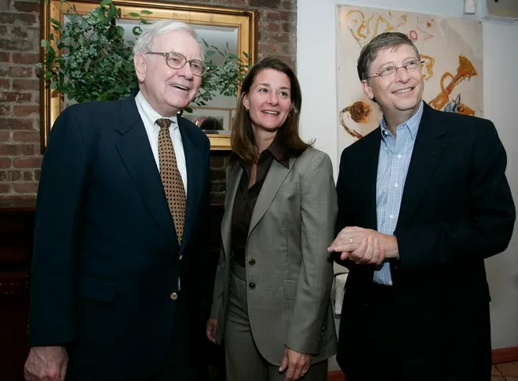

[Warren Buffett with Bill and Melinda Gates （2006） (1).pdf]()

> 彦鑫：老巴还有两天就正式退休了，退休后如何分配巨额资金是大家谈论的一个重点，如何做慈善？本篇内容来自2006年巴菲特宣布捐赠计划后，和比尔盖茨、梅琳达·盖茨共同接受查理·罗斯专访的珍贵实录。让我们跨越时空，一同探寻这位“奥马哈先知”最本质的慈善哲学。

# 沃伦·巴菲特与比尔及梅琳达·盖茨（2006年）访谈实录

**查理·罗斯：** 沃伦·巴菲特，伯克希尔·哈撒韦公司首席执行官、全球第二富豪，昨日宣布将其400多亿美元财富的大部分捐赠给全球规模最大、或许也是最受赞誉的基金会——比尔及梅琳达·盖茨基金会。本质上，他正通过该基金会将财富回馈社会。这意味着，该基金会目前每年在全球健康、教育和图书馆领域投入15亿美元，今后每年投入将增至30亿美元。试想这对贫困、患病和未受教育的人群而言意义何在。这意味着比尔、梅琳达和沃伦能让“人人生而平等”这一指导原则更切实地落地。这意味着沃伦·巴菲特将跻身商业史和慈善史上的伟人之列——洛克菲勒、福特、卡内基和盖茨，他们均将财富回馈给了社会。想象其中的可能性，你便会明白为何这是慈善史上最重要、最具历史性的公告。我很高兴沃伦、比尔和梅琳达今日仅在本节目中亮相。沃伦是我的挚友，我对比尔和梅琳达也怀有极大的敬意与好感。我和比尔曾合作过多次电视访谈，这是梅琳达的首次亮相，希望不会是最后一次。最后，要介绍《财富》杂志杰出的商业记者卡罗尔·卢米斯。她昨日在《财富》杂志封面故事中率先报道了这一消息，文章标题为《沃伦·巴菲特慷慨捐赠》。我很高兴能邀请到沃伦、比尔和梅琳达来到演播现场。谢谢大家。这是我许久未见的双赢局面。

**沃伦·巴菲特：** 是啊，这再好不过了。

**查理·罗斯：** 谈谈你认为这件事的意义所在。

**沃伦·巴菲特：** 嗯，这是我一直计划好的事。我和妻子苏西早就约定，我所赚得的一切都将回馈社会。起初，我以为她会比我长寿，届时由她来决定捐赠的具体方式。但她去世后，我不得不重新思考如何以最有效的方式将财富回馈社会，让其发挥最大价值。而答案其实近在眼前。我目睹了比尔和梅琳达在他们的基金会所做的一切——他们用自己的钱投入其中，全身心地付出，做出的决策十分出色，目标也与我高度契合。所以，现在正是时候。

**查理·罗斯：** 比尔已经给了你一本书，让你开始了解这些相关议题了吧？

**沃伦·巴菲特：** 他确实给了我一本。说不定节目结束后还要考我呢。

**查理·罗斯：** 那你对疟疾、肺结核还有什么了解？

**沃伦·巴菲特：** 我觉得他是想让我染上这些病，这样我才能全身心投入解决它们。

**查理·罗斯：** 你们两位如何看待这件事的意义？对你们自身、对你们所投身的事业而言，它意味着什么？

**梅琳达·盖茨：** 对我们来说，这简直太棒了，因为这相当于让我们的影响力翻倍。我们长期以来致力于应对的疾病、关注的教育问题以及社会不公，都将因沃伦的捐赠而获得双倍助力。在一些全球健康议题上，我们如今能够深入推进的程度，实在令人难以置信。

**查理·罗斯：** 比尔，你的看法呢？

**比尔·盖茨：** 这是一份巨大的责任。在某种程度上，用自己的钱犯错，感受不会像用别人的钱犯错那么沉重。所以现在，我们更决心要把这件事做好。这也是一个令人无比振奋的时代——医学领域的进步以及其他各类缓解贫困的举措，我们已经取得了不错的进展。而资源翻倍后，我们认为产生的影响力甚至会远超两倍。所以这既令人激动，也肩负着重大责任。

**查理·罗斯：** 我之前提到，你们两位秉持着“人人生而平等”的指导原则。就这一原则对你们的影响以及你们看待世界的方式而言，它具体意味着什么？

**比尔·盖茨：** 其实很简单。这和沃伦常说的一个观点有关——你出生在世界上的不同地方，所能获得的机会会截然不同。

**查理·罗斯：** 也就是你说的“卵巢彩票”。

**比尔·盖茨：** 没错。在许多国家，我们只需花几百美元就能拯救一条生命，却没有这么做——我们既不研发相关药物，即便有了药物，也无法送到有需要的人手中，这其实是不公平的。但令人意外的是，拯救这些生命竟然能有效减缓人口增长，之后人们就能有更多资源投入改善营养和教育，进而形成富裕国家已经经历过的良性循环，这真是一件了不起的事。这种良性循环应该惠及全世界。

**查理·罗斯：** 你提到苏西的去世让你开始重新考量这件事，因为她无法再比你长寿、掌管巴菲特基金会了。能说说这一决定的来龙去脉吗？比如，是你主动找到比尔说“我已经决定要这么做了”，还是经过了一系列对话？整个过程是怎样的？

**沃伦·巴菲特：** 我一开始考虑了多种可能性，核心是希望这笔钱能被有效利用。查理，我研究过很多基金会，其中有不少我很钦佩，但在我看来，没有任何一家能与比尔及梅琳达·盖茨基金会相提并论。这不仅仅是因为规模，更因为他们看待世界的视角——不受性别、肤色、宗教、地理的限制，始终在思考如何为最多的人、尤其是那些人生中遭遇不公的人带来最大的益处。所以，好几个月前我就跟比尔提过我有这个想法，但我一直在琢磨最佳的执行方式，因为我既想让伯克希尔·哈撒韦的股东们受益，也想让这笔财富的受助者们真正得到帮助。最终，我想出了这个方案。而我一旦下定决心，就会立刻行动。

**查理·罗斯：** 说得太对了。

**梅琳达·盖茨：** 确实如此。

**查理·罗斯：** 所以当你第一次听到这个消息时，第一反应是什么？心里在想什么？

**梅琳达·盖茨：** 一开始真的很难相信这会成真。但我们立刻意识到了身上的责任。你知道，花自己的钱做慈善时，已经会感到责任重大；而这笔钱是沃伦一生的心血，花别人的钱做慈善，我们的责任感更是加倍的。但紧接着，我们就会转而思考：我们能为这个世界做些什么？能带来哪些积极的改变？一想到凭借这样一笔捐赠，能让无数人摆脱贫困，就觉得这是一件无比了不起的事。

**查理·罗斯：** 比尔，在具体操作层面有没有遇到什么问题？比如沃伦决定向五个基金会捐赠，其中六分之五流向比尔及梅琳达·盖茨基金会，你们需要克服哪些后勤方面的困难吗？

**比尔·盖茨：** 过去几个月里，我们可能花了一些律师费来确保捐赠结构合理。但说到底，尽管有一些文书工作之类的流程，整体其实相当简单。还有一件让我们非常激动的事是，沃伦将加入我们担任受托人，这样基金会就有三位受托人了，对我们来说这是一个很棒的补充。

**沃伦·巴菲特：** 但这并不是捐赠的附加条件，查理。即便我不担任受托人，我也完全乐意——而且基金会主要还是由他们两位来管理。不过……

**比尔·盖茨：** 即便没有这笔捐赠，我们也很乐意邀请沃伦担任受托人。

**梅琳达·盖茨：** 没错，情况就是这样。

**查理·罗斯：** 那唯一的条件是，万一他们出了什么事，比如你之前说的飞机失事，那该怎么办？

**沃伦·巴菲特：** 这种可能性非常非常低，但如果他们真的无法继续管理基金会，我会重新评估当时的情况。

**查理·罗斯：** 重新考量。

**沃伦·巴菲特：** 是的，重新考量。这并不意味着我会改变现在的决定，但我这么做的前提是，我看到了两位极具才华的人正全力以赴地应对世界上的重大问题。如果真的发生意外，我会看看接下来该如何推进，但我相信这种情况不会发生。

**查理·罗斯：** 这也是一种无私的举动。你难道不想看到以“巴菲特”命名的基金会、图书馆或者其他各类机构吗？

**沃伦·巴菲特：** 不想，完全不想。我喜欢奥马哈公共图书馆。

**查理·罗斯：** 那你的角色是什么？你会担任受托人，但具体会做些什么？

**沃伦·巴菲特：** 如果我有什么想法，他们可以把我当作参谋，想怎么用我都可以。

**查理·罗斯：** 他们现在已经这么做了吧。

**沃伦·巴菲特：** 嗯，确实是这样。所以其实也没什么特别的。但只要我能帮上忙，我很乐意。我不会参与他们的投资决策，那会让事情变得复杂，所以我完全不插手这方面的事。

**查理·罗斯：** 他们的优先事项和你的一致吗？

**沃伦·巴菲特：** 是的，绝大多数都高度契合。否则我也不会这么做。

**查理·罗斯：** 而且你还有苏珊·汤普森基金会，专注于其他一些议题。

**沃伦·巴菲特：** 没错。

**查理·罗斯：** 你的孩子们也有自己的基金会，涉及多个领域。

**沃伦·巴菲特：** 我知道他们感兴趣的方向，也看到了他们全身心投入的样子。2001年，也就是9·11事件刚过不久，比尔在雷恩巴德（音）做过一次演讲，那是我听过的最精彩的演讲之一，真希望当时录下来了。后来我还鼓励他去参加比尔·莫耶斯的节目。那次演讲真的让我们所有人都为之震撼，当时有四五十人在场。当你看到两位杰出的人才，满怀热情地做着你也希望能实现的事，这其实是一件理所当然的选择。

**查理·罗斯：** 你形容他们的智慧“超凡脱俗”。

**沃伦·巴菲特：** 对，没错。

**查理·罗斯：** 这件事会带来哪些影响？会改变基金会的优先事项吗？显然会扩大员工规模吧？还能让你们做一些以前做不到的事吗？

**比尔·盖茨：** 当然能。在某种程度上，我们面临着“成功带来的挑战”——比如每次研发出一种新药，更大的问题就来了：如何分发药物？如何确保它能达到我们预期的效果？如果你看看全球前20大疾病，其中至少有10种我们正在取得显著进展，预计未来5到10年内就能找到解决方案。所以扩大规模至关重要。在教育领域，当你打造出一所成功的高中作为示范模型，就希望它能在全国推广。而现在，有了这笔捐赠，我们终于有机会深化工作、加快推进速度。我们会增加一些与贫困相关的项目，但首要目标仍然是应对健康和贫困问题，教育是第二大优先事项，这一点不会改变。

**查理·罗斯：** 你们发现，改善健康状况其实会影响人们的生育数量，除了健康本身，还会对一系列其他事情产生影响，对吗？

**梅琳达·盖茨：** 完全正确。我认为这笔捐赠能让我们在健康领域的工作更加深入。比如，我们原本就在研发疟疾药物、肺结核疫苗和艾滋病疫苗，现在还能围绕这些项目开展更多配套工作。如果一个人肚子里没有食物，或者没有干净的饮用水，给他们药物也无济于事。所以我们会关注一些相关领域，比如农业——帮助非洲的小农获得高粱抗旱种子，或者能防止香蕉病毒连年传播的种子，帮助他们将产品推向市场，获取更多信息。在我们努力攻克这些疾病的同时，帮助他们找到获得干净水和健康食物的方法，改善家庭生活，这样才能深化我们在健康领域的影响力。

**查理·罗斯：** 在资金投入方面，你们是否曾面临这样的两难选择：是像“大挑战”项目那样为未来投资，还是投入资金解决当下的实际问题，比如将现有药物送到人们手中？

**比尔·盖茨：** 当然面临过。我们的资源是有限的，因此一直存在着非常有益的讨论——有些人认为应该更多地投入到即时解决方案中，另一些人则认为，我们愿意资助这类研究的态度是独特的，所以应该更侧重于长期研究。这种持续的讨论非常有价值，吸纳持不同意见的人以及专业顾问的观点，对我们帮助很大。以艾滋病为例，投入资金用于预防能产生巨大影响，因为每预防一例病例，就能避免后续可能引发的更多病例。但当你亲眼目睹那些患病者的痛苦，又会希望能为他们提供治疗。这些都是需要大量资金投入的重大问题，这也是为什么我们需要与政府合作，确保他们参与进来。我们很高兴看到世界上许多政府都在全球健康领域加大投入、采取更多行动。

**梅琳达·盖茨：** 而且我认为，有时候我们会寻找一些示范项目来验证想法，之后再推广到其他地区。比如，我们很早就开始在博茨瓦纳开展抗逆转录病毒药物相关项目——我们知道无法为非洲所有需要的人提供这种药物，但如果能证明一个国家可以成功实施这项工作（当时还没有国家这么做），那就很有意义。1999年，我们与默克公司合作启动了这个项目，双方各投入5000万美元。2003年，我和比尔第一次去博茨瓦纳考察时，当时我们的项目仅覆盖了约3000人。但现在，整个国家已有6.2万人通过这个项目获得了抗逆转录病毒药物，它成了一个示范项目。后来，当美国政府通过总统防治艾滋病紧急救援计划（PEPFAR）提供资金时，这个模式就得以在其他国家推广。我们很多时候都是这样推进工作的。

**查理·罗斯：** 相关研究是一项长期的重大投入，回报可能需要很长时间才能显现，对吗？你提到了20种疾病，能说说哪些疾病即将迎来突破性进展吗？疟疾、肺结核、艾滋病？

**比尔·盖茨：** 还有一系列腹泻类疾病，包括我们已经有了新疫苗的轮状病毒，以及另外两种导致腹泻的病原体。5岁以下儿童的两大头号杀手就是腹泻和呼吸道疾病。我们认为，通过大约五种不同的疫苗，就能大幅减少这类死亡病例。每年有超过1000万儿童死亡，而这两种疾病是主要原因。所以，排名前五的疾病——艾滋病、肺结核、疟疾以及这两种儿童常见疾病，我们正在这些领域取得重大进展。另外15种疾病，比如内脏利什曼病（黑热病），因为只发生在……

**查理·罗斯：** 而且名字还很难发音。

**比尔·盖茨：** ……热带地区，所以不太为人所知。

**沃伦·巴菲特：** 查理，他以后可以当我的家庭医生了，我希望手术时他能在手术室里。

**查理·罗斯：** 你也成了热带疾病专家了。对于他们所做的这些事，对你而言，进行这项慈善捐赠并希望立即看到成效，这一点重要吗？

**沃伦·巴菲特：** 当然，我希望这笔钱能立刻被明智地使用，但成效不一定能马上显现。坦白说，这也是他们比我更擅长做慈善的原因。我喜欢即时反馈——我就是那种走进冰淇淋店，就想立刻吃到三层冰淇淋圣代的人。但做慈善很多时候需要更长远的视角，要接受延迟的回报。他们虽然也迫切希望取得最佳效果，但在这方面，他们比我更合适。

**查理·罗斯：** 你并不认为自己擅长做慈善，对吗？

**沃伦·巴菲特：** 我觉得我会做得很糟糕。

**查理·罗斯：** 为什么？

**沃伦·巴菲特：** 嗯，首先……

**查理·罗斯：** 除了……

**沃伦·巴菲特：** ……我喜欢即时反馈之外，其次，做慈善在某种程度上需要对更多人负责，这不是我喜欢的方式。我更愿意问心无愧，自己评判自己做得好不好。而且有很多人的意见，我其实并不想听取。所以做慈善可能需要比我更圆滑的处事方式。查理，就像我在那篇文章里说的，如果人生中有一件重要的事要做——比如我要参加一场至关重要的高尔夫比赛，要是能让泰格·伍兹来替我，我随时都愿意；如果我要上电视唱歌，要是能让辛纳屈在后台替我代唱，我也会这么做。我们在这个世界上都肩负着各种责任，这笔财富也是一种责任。如果能找到比自己更擅长的人来做这件必须做的事，我向来愿意这样做。

**查理·罗斯：** 你知道，长期以来人们一直猜测你为什么以前不做这件事。你说苏西的去世是一个原因，还有其他原因吗？

**沃伦·巴菲特：** 查理，追溯到最早，我和苏西在20多岁时就决定，财富最终要回馈社会。

**查理·罗斯：** 就是在你告诉她你会变得富有那会儿。这一点你当时很确定。

**沃伦·巴菲特：** 我当时确实很确定，但她觉得我在异想天开。不过随着时间推移，我慢慢说服了她。但无论如何，财富回归社会这一点是毫无疑问的。我的逻辑是——虽然这也符合我个人的意愿——慈善需求在今天、明天、20年后、100年后都会存在，而且规模巨大。如果人们要把钱用于慈善，那么那些善于让财富复利增长的人，应该负责20年或40年后的慈善事业。

**查理·罗斯：** 你说的就是你自己吧。

**沃伦·巴菲特：** 是的。我真的认为，30年前如果我把当时仅有的100万美元捐出去，不如让它复利增长来得更有意义。而那些不擅长让财富增值的人，应该负责当下的慈善需求。比如，如果我管理一所大学，有两位富有的校友愿意提供全部资金，我会让那个不擅长理财的人提供当下所需的资金，让另一个人负责让财富复利增值。所以这一直是我的理念，而现在，正是时候付诸实践了。

**查理·罗斯：** 你觉得人们会对你的这个决定感到惊讶吗？

**沃伦·巴菲特：** 可能会吧。

**查理·罗斯：** 做出这个决定时，你有没有问过自己，这会不会影响伯克希尔·哈撒韦一直以来的高复利增长？会不会对公司股东产生影响？

**沃伦·巴菲特：** 我考虑过，但我认为这完全不会有任何影响。事实上，伯克希尔·哈撒韦赚的钱中，31%会通过我的股份用于慈善——如果公司再赚1亿美元，其中3100万美元就会投入慈善事业。所以，如果说这么多年来我有什么动力能让我更加努力，那现在肯定有了。想到公司价值越高，就能为全世界的人带来越多好处，这种感觉非常棒。

**查理·罗斯：** 为了让观众更清楚，比尔及梅琳达·盖茨基金会目前的规模大概是300亿美元左右，对吗？

**沃伦·巴菲特：** 承诺捐赠的股票按当前市值计算，大约是300亿美元。

**查理·罗斯：** 而你这次承诺捐赠的金额，按目前的股价计算约为370亿美元。

**沃伦·巴菲特：** 按今天的股价算，没错。

**查理·罗斯：** 捐赠从2006年开始，立即生效。

**沃伦·巴菲特：** 是的。

**查理·罗斯：** 会分多年捐赠。

**沃伦·巴菲特：** 从某种意义上说，会无限期捐赠下去。也就是说，只要伯克希尔·哈撒韦的价值持续增长（我认为一定会），这笔捐赠的总额会远超370亿美元，而且越多越好。可能会持续20年、30年甚至40年。

**查理·罗斯：** 比尔和梅琳达肯定同意这一点。我从没见过比他更热爱工作的人了。

**梅琳达·盖茨：** 完全同意。

**查理·罗斯：** 就像他说的，他每天都开开心心地去上班。这种状态会一直持续下去。

**沃伦·巴菲特：** 是的。

**查理·罗斯：** 你会回到奥马哈，继续开开心心地去工作，做决策，而现在你知道，这些决策不仅能让伯克希尔的股东受益，还能改变远方人们的生活。

**沃伦·巴菲特：** 我一直知道这些财富最终会用于慈善，但现在，这种影响变得非常切实可见。

**查理·罗斯：** 切实可见。

**沃伦·巴菲特：** 非常切实。我希望每年承诺捐赠的股票都能增值，而且我认为长期来看一定会的。所以这笔捐赠的影响力会越来越大，而我会努力让这一切发生。

**查理·罗斯：** 但做出这个决定，知道财富的去向，你一定感到非常满足吧？

**沃伦·巴菲特：** 是的，查理，绝对是这样。其实，这相当于财富的“第二人生”——你积累了这些相当于社会“债权凭证”的财富，然后要找到它的最佳用途。

**查理·罗斯：** 好的。比尔，你的角色会有什么变化？大约一个月前，你宣布不再担任微软的首席软件架构师，不再承担管理职责，但仍将担任董事长。这是否意味着你在比尔及梅琳达·盖茨基金会的角色会发生变化？

**比尔·盖茨：** 是的。2008年6月，我将全职投身基金会工作。这一决定其实是与沃伦的想法同步形成的……

**查理·罗斯：** 但两者并无关联？

**比尔·盖茨：** ……确实没有关联，但实际上是相辅相成的。令人振奋的是，就在我即将全职投入基金会工作之际，沃伦的捐赠让基金会的资源增加了一倍多。我的角色将是帮助基金会不断学习进步。我和梅琳达本来就经常出差，以后我会有更多机会去学校考察、参与更多实地走访，阅读更多关于健康领域的长篇著作。基金会的负责人帕蒂·斯通西弗做得非常出色，她一直在思考如何扩大规模、增加员工人数，同时保持我们都重视的工作效率。所以我会比以前更多地参与战略制定。

**查理·罗斯：** 所以以前可能一个月只投入一天时间，现在会投入更多时间，成为更紧密的合作伙伴。

**梅琳达·盖茨：** 这太棒了。我们很喜欢一起做这项工作。

**查理·罗斯：** 有一点必须说明——沃伦每次和我聊天都提到，这个基金会之所以命名为“比尔及梅琳达·盖茨基金会”，是有充分理由的，因为梅琳达从一开始就深度参与其中。能说说你们的具体分工吗？作为受托人，你们将如何与执行团队一起做决策、制定愿景，未来这种模式会如何发展？

**梅琳达·盖茨：** 我觉得你用“发展”这个词很准确——过去10年，我们在基金会的角色就是这样不断发展的。很难准确预测每个人会投入多少时间，但这些年来，比尔投入的时间越来越多。显然，我相对有更多时间，因为我没有全职工作，而且孩子们现在都到了上学的年纪。这让我们有更多机会一起出差。我认为，当你亲身走进孟加拉国的贫民窟、走进印度、走进非洲，与当地民众接触，才能真正深入了解他们面临的问题，让工作更有深度。比如，有一个长期开展的肺结核治疗项目，患者需要连续六个月每天来领取药物。我最近在赞比亚亲眼看到了这个项目的实施情况，但你会不禁思考：一个人要连续六个月，每天空腹排队两小时领取药物，这很难算得上是成功的健康项目。所以有时候，你必须亲临现场，才能理解那些数据背后的实际情况。我们已经在研究如何将领取药物的时间缩短一半，以及如何最终研发出疫苗。我认为正是这些实地走访和深入讨论，让我们的工作更有意义。如今，每次我出差回来，或者我们一起出差时，都会对基金会的发展方向以及如何深化工作进行更深入的讨论。

**查理·罗斯：** 很多人认为，你们将商业运作模式——追求结果、设定目标并确保达成——引入了慈善领域，开创了新的慈善模式。你认为比尔及梅琳达·盖茨基金会的独特之处在哪里？你认为它的指导原则应该是什么？

**比尔·盖茨：** 我认为，注重结果导向，秉持乐观精神——相信汇聚优秀人才、设定宏伟目标就能创造奇迹，这一点很重要。但这并非全新的理念。回溯到洛克菲勒时代……

**查理·罗斯：** 洛克菲勒，没错。

**比尔·盖茨：** ……你会发现他也愿意挑战传统观念，勇于攻克艰巨的问题。我们多次发现，洛克菲勒基金会在很多事情上的做法都是正确的。

**梅琳达·盖茨：** 完全正确。

**比尔·盖茨：** 还有卡内基在《财富的福音》中阐述的理念。沃伦在一次聚会中给我们分发了这本书，它确实帮助我深入思考了慈善的意义，以及如何设定高远的目标。

**查理·罗斯：** 这是在你们成立基金会之前吗？

**比尔·盖茨：** 是的。关于“将财富留给子女并非对社会或子女最有利的选择”这一理念，正是在我们认识沃伦前后，从他的谈话中得到的启发。当时我开始意识到，这是一个我未来必须面对的问题，而他的建议非常宝贵。现在，我们走到了今天。但我确实认为，充满热情地凝聚各方力量、以新的方式开展合作，正是我们能够快速推进工作的关键。

**沃伦·巴菲特：** 查理，在商业领域，我和我的合伙人查理·芒格有着非常棒的合作关系。我见过当两个人目标一致、视角不同但携手共进时能创造出怎样的成就。而管理基金会，没有比比尔和梅琳达更合适的搭档了。

**查理·罗斯：** 那么，你认为沃伦会更多地参与进来，加深投入吗？

**比尔·盖茨：** 可能会有一点。我认为沃伦会成为一名出色的慈善家，但他热爱自己的工作，会全职投入其中。

**查理·罗斯：** 我知道。但你也热爱自己的工作，离开微软会不会有不舍？

**比尔·盖茨：** 当然会。这是一个艰难的选择。能同时热爱两份既重要又有挑战性的工作，其实并不常见。所以我为此纠结了好几年，现在我想明确地做出改变。虽然不确定未来会怎样，但我非常激动。而沃伦的捐赠更凸显了充分利用时间、做好基金会工作的重要性。大约一个月前，我们邀请沃伦参加了一场关于小额信贷的讨论，他和银行家们聊得很投机，还询问了他们的成本以及贷款偿还情况。所以我们会试着让他多参与一些，我们会尽力的。

**查理·罗斯：** 我相信你们会的。沃伦，你曾说过关于子女的著名观点——你为自己的孩子做了很多事，还为他们成立了基金会……

**沃伦·巴菲特：** 我为他们感到非常骄傲。

**查理·罗斯：** 没错，你很为他们骄傲，他们也同样敬重你。你曾说，想留给孩子们足够的钱，让他们能做任何想做的事，但又不至于让他们无所事事。

**沃伦·巴菲特：** 是的。他们可以做任何事，但不能什么都不做。我不相信“王朝财富”——把农场或自己创办的小企业留给子女，我能理解，但“王朝财富”意味着后代仅凭出身就能不劳而获，这与这个国家的核心价值观背道而驰。我们信奉精英治国和机会平等，而“王朝财富”恰恰违背了这一点。所以我一直认为，如果有选择，与其让财富留给所谓“幸运精子俱乐部”的后代，不如让这样的基金会为全世界的人带来巨大益处。

**查理·罗斯：** 也就是你说的“卵巢彩票”。你提到了查理·芒格，你打电话告诉他你在考虑这件事时，他的反应是什么？

**沃伦·巴菲特：** 他说“你终于想出了一个好主意”。我等这句话等了好几年了。

**查理·罗斯：** 真的吗？

**沃伦·巴菲特：** 我花了40年才从他嘴里听到这句话，但终于听到了。

**查理·罗斯：** 一个好主意。

**沃伦·巴菲特：** 是的，一个好主意。他应该不会再期待我有其他好主意了。

**查理·罗斯：** 但他确实认可这件事，认为这是正确的选择。

**沃伦·巴菲特：** 哦，他非常支持，当然认可。

**查理·罗斯：** 比尔，据说沃伦让你开始思考慈善事业，后来在1993年或1994年，你读了一份《世界发展报告》。这份报告对你产生了什么影响，让你此后的很多行动都与此相关？

**比尔·盖茨：** 读那份报告之前，我一直认为，世界会优先将资金投入到这些低成本的救死扶伤领域，不会有一种我从未听说过的疾病——比如每年导致50多万儿童死亡的轮状病毒——得不到关注。我以为如果有这样的疾病，制药公司都会全力研发相关药物。但我没想到的是，由于贫困人口无力购买药物，没人愿意研发这些药物；而这些疾病又不存在于富裕国家，所以也无法通过“先为富人研发、再惠及穷人”的方式解决。

**查理·罗斯：** 因为你之前不知道这个情况，所以……

**比尔·盖茨：** 没错。我原本以为，进入慈善领域时，所有重要的问题都已经得到解决，我们只能做一些边缘性的、影响不大的事。但读完那份报告后，我意识到，这里存在着巨大的悲剧——这些重要问题并未得到解决，而这正是我们可以倾注精力、全力攻克的核心优先事项。这一点立刻引起了我的关注。

**沃伦·巴菲特：** 查理，我和比尔都有着市场经济的思维背景。市场经济非常有效，在美国取得了巨大成功，但在全球贫困人口的健康问题上，市场经济却失灵了——一种本应廉价可得的疾病治疗手段，却因为贫困人口无力支付而无法普及。

**查理·罗斯：** 因为他们无法参与到市场体系中。

**沃伦·巴菲特：** 是的，这种情况下市场经济就失效了。这就需要我们介入，建立一个能够将资源送到有需要的人手中的体系。我95%的时间都信奉市场经济——它让我受益匪浅，也让世界变得更好。但有些问题是市场经济无法解决的，而比尔正是在这些领域挺身而出。

**查理·罗斯：** 在之前的谈话中，你曾说过，当你考虑将资金投入某个基金会时（不是选择基金会本身，而是考虑资金的用途），你希望选择那些被忽视的领域。

**沃伦·巴菲特：** 是的。如果某个领域已经有大量资金和人才涌入，就没有必要重复投入了。世界上有无数有意义的事可做，我们要找的是那些重要、自己有能力实施相关想法，并且确实需要更多资金支持的领域。而这正是比尔和梅琳达处理问题的方式。

**查理·罗斯：** 比尔、梅琳达，你们肯定也认同，苏西会为这件事感到高兴。

**沃伦·巴菲特：** 是的。

**查理·罗斯：** 因为她曾对我说，她一直希望你能做更多慈善。

**沃伦·巴菲特：** 没错。她在这方面的直觉非常好，她本来希望能更早地大规模开展慈善工作，我完全理解她的想法。她总是能看到身边那些当下就有需求的人，深受触动。如果我在60岁左右去世，当时已经有了很多财富，她肯定会全力以赴地投身慈善事业。

**查理·罗斯：** 你也会很欣慰看到她掌管基金会，投身这项事业。

**沃伦·巴菲特：** 当然，非常欣慰。

**梅琳达·盖茨：** 苏西非常关注这些议题。她经常谈论女性如何自我赋能，尤其关注女性获得计划生育相关的渠道和工具。她经常出差，尤其是去越南和东南亚的很多地方。所以她非常关心这些社会不公问题。我一直觉得，沃伦做出这个决定，苏西一定会非常高兴。

**查理·罗斯：** 是的。还有生育权利、为人父母等相关议题。

**梅琳达·盖茨：** 完全正确。

**查理·罗斯：** 除了我们已经谈到的，还有哪些重要的议题或事业是你们目前因为专注于现有优先事项而尚未涉足的？

**梅琳达·盖茨：** 嗯，我不认为是因为太忙而无法涉足，而是我们一开始选择聚焦于最迫切的需求——那些药物和疫苗能发挥作用的领域。但有一个问题我们一直放在心上：当你在世界各地旅行，遇到那些需要药物的人时，会发现他们大多生活在贫民窟。这些国家未来的人口增长将主要集中在城市。贫民窟的情况各不相同——有些完全没有干净的饮用水、卫生设施和道路，房屋是用芦苇搭建的；有些则相对完善，有厕所、垃圾处理服务，甚至有部分铺设的道路。所以我们一直在思考，如何为这一群体做好规划，推动政府提前建设基础设施，让那些日收入不足2美元、移居到城市的人们能够获得基本服务。

**查理·罗斯：** 现在，一方面你们会投入更多时间，另一方面有了更多资源——就像你说的“更多武器”，你们是否觉得更有紧迫感，要与政府开展更多合作？我相信你们能接触到世界各国的国家元首，推动他们更多地参与进来。因为尽管有了这笔捐赠，但要实现可持续的影响，还需要其他人挺身而出。

**比尔·盖茨：** 当然。过去三年的情况不错，美国政府在布什总统的领导下，通过总统防治艾滋病紧急救援计划（PEPFAR）投入了更多资金用于艾滋病防治；包括英国、法国在内的许多欧洲国家也加大了对疫苗研发的资金支持，挪威在这方面也做得很好。我们需要继续保持这种势头。波诺一直是我们的重要合作伙伴，他推动了相关对话，提高了议题的关注度。事实上，我和沃伦昨天下午就给了他打电话，告知了这件事。

**查理·罗斯：** 是昨天晚上、一周前，还是……

**沃伦·巴菲特：** 昨天下午。

**比尔·盖茨：** 就在消息公布后不久……

**查理·罗斯：** 又一个可能的“泄密”。继续说，你们打电话给他，然后……

**比尔·盖茨：** 我们希望推动富裕国家的政府以正确的方式更多地参与这些议题，同时推动发展中国家的政府将这些议题列为优先事项，建设必要的基础设施。这将对我们工作的有效性产生重大影响，我们必须这样做，而且未来会有更多时间专注于这一点。

**查理·罗斯：** 并且会更有紧迫感。在那些最贫困、条件最艰苦的国家，向贫困人口提供医疗服务的过程中，存在多少腐败问题？

**比尔·盖茨：** 事实上，像修路、建水坝这类项目，由于层级繁多，容易出现资金挪用的情况。但疫苗领域的透明度更高——没人会囤积疫苗，因为所需数量并不多。

**查理·罗斯：** 而且疫苗需要冷藏等特殊处理。

**比尔·盖茨：** 而且核实疫苗是否真正送达、覆盖率如何，相对来说比较简单。所以我们必须保持警惕——比如采购的吉普车最终去向不明这类问题确实可能发生。但与大多数发展项目相比，疫苗分发系统更简单，因此我们应该能确保95%的资源准确送达目标人群。可能会有少量资源流失，但如果无法接受这一点，就不应该……

**查理·罗斯：** 如果不承认存在资源流失，问题就无法解决。沃伦，你希望这件事能以何种方式激励其他富人？

**沃伦·巴菲特：** 查理，这是一个很有意思的现象。人们积累财富时，常常会向那些他们认为更懂行的人求助、加入他们的行列。50年前的上个月，我成立了一家合伙企业，七个人给了我10.5万美元。他们为什么这么做？因为他们认为我比他们更擅长为他们积累财富。

**查理·罗斯：** 真是明智的选择。

**沃伦·巴菲特：** 嗯，确实效果不错。但为什么在分配财富时不采用同样的思路呢？人们往往会把财富交给老同事、乡村俱乐部的朋友，或者让专业团队来主导，但其实分配财富和积累财富一样，都可以找比自己更擅长的人来做，这一点显而易见。所以我希望，即使是那些财富超出预期、又没有特定捐赠目标的普通人——如果他们有特定目标，比如捐赠给母校，那当然很好——如果他们不确定该如何处理这笔意外之财，可以四处寻找那些目标相似、比自己更擅长做慈善的人，把钱交给他们。我认为这是完全合理的做法。

**查理·罗斯：** 盖茨基金会有一项很多人可能不知道的工作——搭建合作伙伴关系。有些事情，制药公司因为身处市场体系而不愿或不能做，政府也无法迈出第一步，而你们会搭建合作桥梁。能说说这是如何运作的吗？

**梅琳达·盖茨：** 我举个例子来说明吧。我们与一个名为“全球健康研究所”的组织合作。有一种疾病影响着很多人，约20万人，主要发生在印度的部分邦和孟加拉国。全球健康研究所发现了一种药物，在非洲的一个地区被证明有效，但这种药物已经有50年历史了，是在意大利研发的，目前只有马耳他的一个实验室还在研究它。他们表示，如果能完成这种药物的最终阶段试验，证明它对黑热病（内脏利什曼病）有效，并推广开来，就能拯救很多生命。所以我们与他们合作，帮助他们完成试验，现在正在帮助他们通过印度监管机构的审批——这需要一套全新的知识和基础设施。最终，我们将与大卫及露西尔·帕卡德基金会合作，通过他们旗下的一个名为“吉纳尼”（音）的组织，在印度的这些邦和孟加拉国分发这种药物。这就是一个典型案例：这种药物在发达国家完全没有市场，但在发展中国家却是一种致命的寄生虫病，导致很多人死亡。而我们通过搭建不同组织之间的合作，将药物送到了有需要的人手中。

**查理·罗斯：** 基金会之间以及从事重要领域研究的顶尖人士之间，信息共享多吗？

**比尔·盖茨：** 非常多。

**查理·罗斯：** 和软件行业不一样。

**比尔·盖茨：** 是的，完全没有竞争。我们都在为同一个目标努力。而且我们自己不做科研工作——制药公司擅长研发和测试药物，比如葛兰素史克（GSK）就是我们的合作伙伴之一。我们利用他们的专业知识，同时提供资金支持，这样他们就能对股东说：“这是负责任的做法——我们在研发抗逆转录病毒药物，同时有资源投入疟疾研究”。这是我们与他们的重要合作之一。所以在某种程度上，我们只是拼图中的一小块，真正发挥作用的是我们搭建的这些合作伙伴关系。

**查理·罗斯：** 这些合作能为未来提供所需的人力和资金。你们知道盖茨基金会的工作已经拯救了多少生命吗？人们有没有告诉你，哪些孩子因为你们的工作而活了下来？

**梅琳达·盖茨：** 最容易衡量的是疫苗相关工作。我们早在1998年、1999年就开始投身这一领域，向我们参与创立的全球疫苗免疫联盟做出了大量承诺，还推动其他国家政府加入进来。

**查理·罗斯：** 这也是你们资金投入最多的领域。

**梅琳达·盖茨：** 没错。我们最初捐赠了7.5亿美元，2005年又宣布在未来10年再捐赠7.5亿美元。我们已经吸引了富裕国家的政府向该基金捐款，还有75个发展中国家的政府申请资金支持。通过疫苗接种工作，我们知道——据估计，仅通过为儿童接种那些在美国被视为理所当然的基础疫苗，就已经拯救了170万人的生命。美国的每位母亲都会在孩子1岁前为他们接种白喉、破伤风和百日咳疫苗，而我们正在将这些疫苗以及 Hib 疫苗、黄热病疫苗等新疫苗送到发展中国家的儿童手中。据估计，在该项目的10年周期内，这些疫苗将拯救约1000万儿童的生命。

**查理·罗斯：** 1000万。

**梅琳达·盖茨：** 是的。

**查理·罗斯：** 这已经说明了一切，不是吗？

**沃伦·巴菲特：** （听不清）

**查理·罗斯：** 确实如此。比尔，你现在50岁，沃伦75岁，正是因为能拯救这么多生命，你才愿意离开自己热爱的工作，将余生投入基金会事业，对吗？

**沃伦·巴菲特：** 我也注意到了我们的年龄差距。

**查理·罗斯：** 卡罗尔·卢米斯的第一个问题是，你是不是生病了？你做这件事是因为生病吗？

**沃伦·巴菲特：** 我的身体棒极了，考虑到我的饮食习惯，这真是个奇迹。

**查理·罗斯：** 你爱吃冰淇淋和可口可乐。

**沃伦·巴菲特：** 没错，但这饮食习惯很适合我。

**查理·罗斯：** 比尔，你曾经说自己以前是“全身心投入软件、目不旁骛”的人，当时有没有想过自己未来能拯救这么多人的生命？

**比尔·盖茨：** 做软件是一件非常有趣的事，它带来的赋能感让我一直热爱，以后也会保持联系。但正如你所说，从两年后开始，我的余生将全职投入基金会工作。这很令人振奋，因为我能遇到很多杰出的人，给他们带去一点希望，为他们指明可能未曾看到的方向；我能走进实地，见证挫折，然后努力寻找解决办法；我还能和梅琳达、我的父亲、帕蒂·斯通西弗这些了不起的人一起工作。所以，能同时拥有微软和基金会这两份有意义的工作，我觉得自己非常幸运。当我们向朋友描述沃伦的捐赠时，他们觉得这两个人相遇、促成这件事是理所当然的，但对我来说并非如此。沃伦第一次提到这个想法时，我心里想：“哇，他是认真的吗？我们准备好了吗？”直到今天，我才真正感受到这件事的分量——今天，沃伦就要正式签署这些捐赠文件了。

**查理·罗斯：** 比尔，你还记得他第一次跟你提这件事是多久以前吗？

**比尔·盖茨：** 大约一年半前，他偶尔会提到，说我们的基金会做得不错，我们一直保持着这样的对话。直到过去几个月，我才意识到他是认真的。而沃伦一旦下定决心，就会雷厉风行。

**查理·罗斯：** 我还知道，你一旦做了决定，就不会回头。你不会因为担心“可能做错了”而失眠，对吗？

**沃伦·巴菲特：** 完全不会。

**查理·罗斯：** 你有没有后悔没有早点做这件事？

**沃伦·巴菲特：** 没有，真的没有。我觉得现在正是时候。

**查理·罗斯：** 现在是做这件事的最佳时机。

**沃伦·巴菲特：** 是的，查理。我已经充分看到了他们的工作成效，也相信伯克希尔·哈撒韦的未来比以往任何时候都更稳固。另外，如果我一次性捐赠全部股票，可能会有人认为基金会的资产过于集中在单一股票上。但我希望基金会的发展与伯克希尔紧密相连，因为我相信公司会发展得很好。我不希望他们被迫出售股票去购买政府债券之类的资产。所以现在这种方式，我认为是最好的。

**查理·罗斯：** 所以他们会持有这些股票，根据需要兑现部分股票来筹集资金。

**沃伦·巴菲特：** 是的，但他们会根据实际情况逐步兑现，其他基金会也是如此。而我还有很多年的时间可以让这些股票增值——这本来就是我一直想做的事，现在做起来会更有动力。

**查理·罗斯：** 回到之前的问题，这件事会如何改变你日常生活？

**沃伦·巴菲特：** 完全不会改变。

**查理·罗斯：** 完全不会？

**沃伦·巴菲特：** 是的。

**查理·罗斯：** 你会回到奥马哈，继续开开心心地去上班，打电话、阅读、打桥牌，还有看你喜欢的有线电视节目——比尔曾经说你每天就做这几件事。

**沃伦·巴菲特：** 人生还有比这更美好的事吗？

**查理·罗斯：** 当然有。那种在有生之年亲眼看到自己的决定正在改变他人生活的满足感——不是在去世后，也不是通过遗嘱执行人，而是亲眼见证这一切发生。

**沃伦·巴菲特：** 而且是看到这件事被做得很好。

**查理·罗斯：** 没错。比尔，自从1994年投身慈善以来，你的想法有没有发生变化？

**比尔·盖茨：** 当然有，而且我们还会继续学习。在慈善领域，确保资金用在刀刃上其实更难，因为没有像市场那样直接的反馈。所以你难免会犯错，还要处理各种合作伙伴关系和激励机制，需要做出很多选择。比如，一开始我们并没有想到要与政府对话，因为当时我们对自己的工作还不够有信心，不敢去建议政府加大对疫苗或艾滋病防治的投入。直到四五年后，我们才意识到，仅凭我们的资源是远远不够的，必须开展倡导工作。这是一项我们正在不断提升的新能力，我们也在与波诺这样的合作伙伴合作推进。我们需要不断学习。

**梅琳达·盖茨：** 在教育领域也是如此。一开始，我们对美国的教育体系有些天真，认为只要建立足够多的小型优质学校，整个教育系统就会看到它们的优势并加以推广。但随着经验的积累，我们意识到，要推广这些模型，不仅需要优秀的中间机构，还必须与州政府和地方政府合作——在学区层面、州层面开展工作，才能确保这些学校持续运营并不断发展。这是我们学到的一个重要经验，我们会把这样的经验运用到所有工作领域。

**查理·罗斯：** 据我了解，盖茨基金会60%的资金用于全球健康，40%用于教育，尤其是高中教育和图书馆建设。未来的资金分配比例会大致保持不变吗？

**比尔·盖茨：** 是的。全球健康领域现在还包括全球发展项目，比如金融、农业、贫民窟改造和卫生设施建设，这部分将占60%以上的资金。教育领域主要聚焦于美国——我们认为，既要解决世界上最大的不公问题，也要关注我们有幸成长的这个国家的重大议题，以维持其领先地位和巨大贡献。所以教育将继续作为第二大优先事项，占约三分之一的资源。随着沃伦这笔令人难以置信的捐赠，这两个领域的投入都将大幅增加。

**查理·罗斯：** 有人说全球健康领域获得了更多关注，是因为它更引人注目，还是因为在这一领域取得的成功比教育领域更切实可见？

**梅琳达·盖茨：** 我认为，首先要意识到全球健康是一系列复杂的问题，包括疟疾、肺结核、艾滋病、轮状病毒等，不能一概而论。我和比尔对消除贫困、改善相关议题同样充满热情，也经常讨论美国的教育问题——只是教育领域可讨论的具体事项不像全球健康那么多，但我们一直在各个领域不断推进。而且我相信，随着比尔投入更多时间、我们更多地走进学校，未来会有更多人听到我们关于美国教育体系的讨论。我们对此充满热情——比如，我们提供了很多奖学金，其中一个项目每年资助1000名学生。当你与这些学生交流时，会听到很多感人的故事。

**查理·罗斯：** 谢谢你们的到来。非常高兴能在节目中与你们探讨这件事，希望以后能再次邀请你们。比尔，每次见到你都很开心，我想我们一起做的访谈比任何人都多，每次有你在节目中都很愉快。今天对你来说是个伟大的日子。

**沃伦·巴菲特：** 这是美好的一天。

**查理·罗斯：** 确实如此。

**沃伦·巴菲特：** 是的。

**查理·罗斯：** 这件事让人感到兴奋，因为它关乎未来，关乎改变生命。非常感谢你们能来这里，因为这是这个时代最令人难以置信的故事之一，而且正如我们所说，你已故的妻子苏西也与今天发生的一切息息相关。

**沃伦·巴菲特：** 谢谢。

**查理·罗斯：** 谢谢大家的参与。从今天起，比尔及梅琳达·盖茨基金会将迎来全新的发展——目标不变，但正如比尔所说，“武器库”更加充实，能够为全世界人民的生活带来更大的影响。人人生而平等。感谢收看。

（全）
