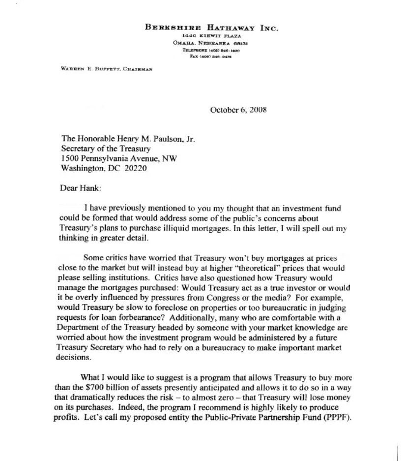
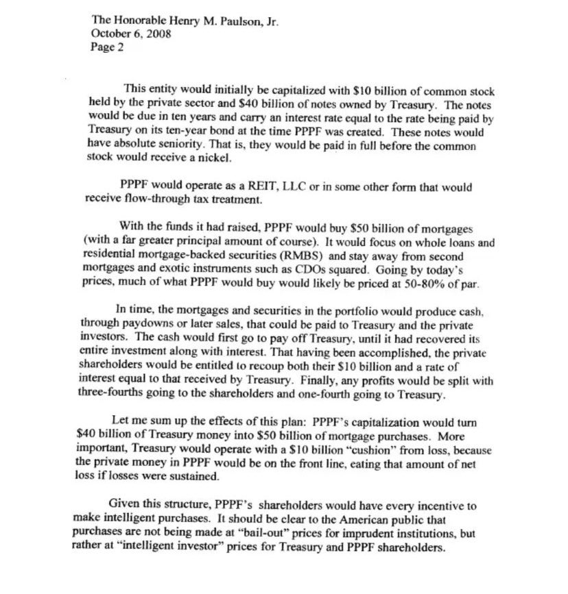
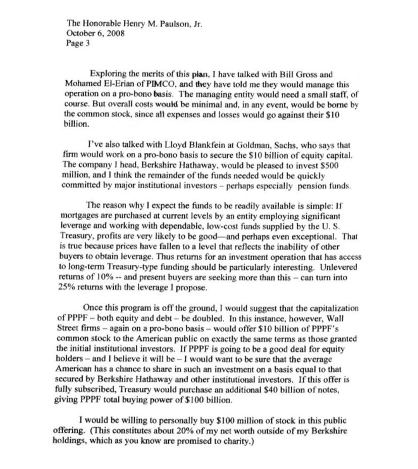
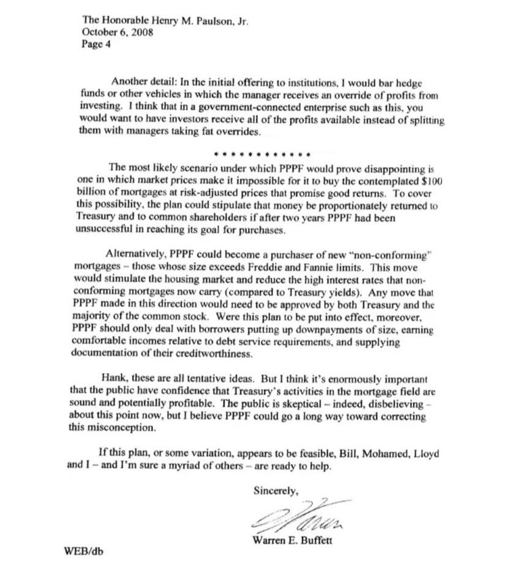

全文：

伯克希尔·哈撒韦公司

1440 基维特广场

内布拉斯加州 奥马哈市 68131

电话：(402) 346-1400

传真：(402) 346-0476

沃伦·E·巴菲特，董事长

2008年10月6日

尊敬的亨利·M·保尔森先生

财政部长

宾夕法尼亚大道1500号，西北区

华盛顿特区 20220

亲爱的亨克：

我之前曾向您提及过这样一个想法：可以组建一个投资基金，以应对公众对于财政部购买非流动性抵押贷款计划的一些担忧。在这封信中，我将更为详细地阐述我的想法。

一些批评者担心，财政部不会以接近市场价格购买这些抵押贷款，而是会以较高的“理论价格”购入，从而取悦出售这些资产的机构。批评者们还质疑财政部将如何管理所购买的抵押贷款：财政部会像真正的投资者一样运作，还是会受到国会或媒体压力的过度影响？例如，财政部是否会在房产上启动止赎程序，或在判断贷款延期请求时过于依赖官僚机制？此外，尽管一些人对于由您这样具备市场知识的人领导的财政部感到放心，但他们也担心未来的财政部长在没有投资背景、只能依赖官僚体系的情况下，如何管理这一投资计划并做出关键的市场决策。

我希望提出的建议是：建立一个项目，使财政部能以远高于目前所预期的7000亿美元资产规模进行购买，并以一种大大降低财政部在购买中发生损失风险——几乎降至为零——的方式进行。事实上，我推荐的这个计划极有可能产生利润。我们可以将我提出的这个实体称为“公私合营伙伴基金（PPPF）”。

该实体最初将由10亿美元的普通股本构成（由私营部门出资），以及财政部持有的40亿美元债券组成进行资本化。这些债券将于十年后到期，利率与PPP基金（PPPF）设立当时财政部十年期国债的利率一致。这些债券具有绝对优先权，也就是说，它们将优先于普通股获得全额偿付，普通股在此之后才有可能分到一分钱。

PPPF将以REIT（房地产投资信托）、有限责任公司（LLC）或其他形式运作，以获得可流通的税务待遇。

PPPF将利用筹集到的资金购买500亿美元的抵押贷款（当然，本金总额将远高于此）。该基金将专注于整笔贷款和住宅抵押贷款支持证券（RMBS），并避免投资于二级抵押贷款和复杂金融工具，例如CDO（债务担保证券）等。根据当时的市场价格，PPPF所能买到的资产，很可能以面值的50%到80%被购入。

随着时间推移，PPPF投资组合中的抵押贷款及相关证券将会产生现金流，可能通过分期偿还或后续出售形成，这些现金将用于偿还财政部和私营投资者。首先，这些现金将用来偿还财政部的投入，直至其收回全部投资本金及利息。在此之后，私营股东才有权收回其10亿美元本金及等同于财政部所收利息的回报。最终，如有剩余利润，分配方式为：四分之三归股东，四分之一归财政部。

我来总结一下该计划的效果：PPPF的资本结构将把财政部投入的40亿美元，转化为500亿美元的抵押贷款购买力。更重要的是，财政部将在此过程中拥有一个10亿美元的“缓冲垫”以应对损失，因为PPPF中的私人资本将首先承担风险——一旦发生损失，将由私营部门先承担。

考虑到这种结构，PPPF的股东将具备强烈动机去进行理性的购买。这一点应当向美国公众明确传达：财政部的购买行为并非对轻率金融行为的“救助”，而是在“理性投资者”的价格水平下进行的，为财政部和PPPF股东创造回报。

为了评估该计划的可行性，我与PIMCO的比尔·格罗斯（Bill Gross）和穆罕默德·埃尔-埃利安（Mohamed El-Erian）进行了交流。他们告诉我，他们愿意在公益基础上管理该项目的运作。管理实体可能需要一个小型的工作人员，当然。但总体运营成本将极低，并且在任何情况下，这些成本最终将由普通股股东承担——因为所有费用和亏损都将从他们的10亿美元出资中扣除。

我也与高盛的劳埃德·布兰克费恩（Lloyd Blankfein）进行了沟通，他表示该公司愿意在公益基础上帮助落实10亿美元的股权资本。我所领导的公司，伯克希尔·哈撒韦，愿意出资5亿美元，我相信其余所需资金将很快由大型机构投资者（尤其可能是养老基金）补足。

我之所以认为资金会迅速到位，有一个简单原因：如果按当前价格购买抵押贷款，由一个具备杠杆能力并能获得财政部低成本、可靠资金支持的实体进行操作，那么利润极有可能是良好的，甚至可能是出色的。原因在于，目前的价格已降至反映“其他买家无法获得杠杆”的水平。因此，对于一个能够获得长期国债类融资的投资实体来说，其潜在回报非常有吸引力。无杠杆的回报率可达10%——而当前买家寻求的远超于此——而我所提议的杠杆方式，能够将其转化为25%的回报。

一旦该计划启动运作，我建议将PPPF的资本规模——无论是股本还是债务——翻倍。在这种情况下，华尔街公司（同样在公益基础上）将代表公众出资10亿美元，购买PPPF的普通股，并与最初的机构投资者享有同等条款。如果PPPF确实能为股东带来良好回报（我相信它将会如此），我希望确保普通美国人也能在与伯克希尔·哈撒韦和其他机构投资者相同的基础上参与其中。如果此方案获得全部认购，财政部将另外购买400亿美元债券，从而使PPPF的总购买力达到1000亿美元。

我本人愿意在此次公开发行中出资1亿美元购买PPPF的普通股。（这约占我在伯克希尔持股之外可支配净资产的20%，而你知道，这些资产最终都承诺将用于慈善用途。）

另一个细节是：在最初向机构投资者公开发行股份时，我会排除对冲基金或其他类似结构的投资工具——这些工具的管理者会从投资收益中抽取超额回报。我认为，对于这样一个与政府相关联的企业来说，我们应该让所有的利润都归属于投资者，而不是被管理人抽成分走。

PPPF最有可能失败的情形，是市场价格变动使其无法以合理的风险调整价格购买计划中的1000亿美元抵押贷款，从而难以获得良好回报。为应对此类可能性，方案可以规定：如果PPPF在成立两年内未能完成既定采购目标，则该资金应按比例退还给财政部与普通股股东。

另一种选择是，PPPF可以成为“非常规贷款”的买家——即那些贷款金额超过房利美和房地美限制的抵押贷款。这一举措将刺激住房市场，并降低“非合规贷款”目前所面临的高利率（与国债收益率相比）。PPPF在此方向上的任何行动都需获得财政部和普通股大多数股东的批准。若该计划得以实施，PPPF应仅与那些能支付大额首付款、收入水平足以覆盖债务偿付要求，并且能提供良好信用证明的借款人合作。

亨克，这些都还是初步想法。但我认为，让公众相信财政部在抵押贷款领域的行动是稳健的、且具有潜在盈利能力，这一点极为重要。当前公众态度是怀疑的——甚至是不信任的——但我相信，PPPF可以在纠正这一误解方面发挥重要作用。

如果这个计划，或其某种变体，最终被证明可行，比尔（Bill）、穆罕默德（Mohamed）、劳埃德（Lloyd）和我——我相信还有无数其他志同道合者——都已准备好协助推动这件事。

此致

敬礼！

沃伦·E·巴菲特
