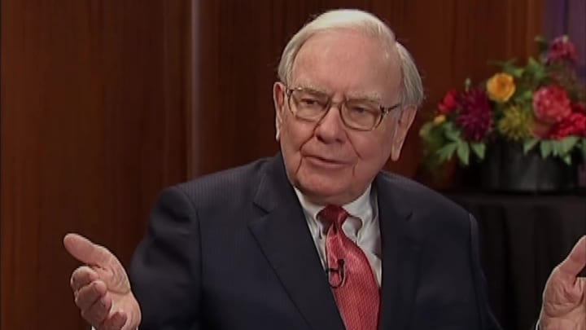

[2014-03-03 Ask WarrenBuffett complete transcript.pdf]()

> 彦鑫：今天的信件内容来2014年沃伦·巴菲特接受CNBC“Ask Warren”的直播访谈实录，时长3小时，此次访谈恰逢乌克兰危机，在这三小时对话中，巴菲特毫无保留地分享了 71 年投资智慧 —— 养老金问题、乌克兰局势下的投资心态、淡化宏观波动、聚焦企业核心价值、坚持长期持有，更拆解了指数基金配置、成本控制等实操建议。

# 沃伦·巴菲特CNBC“Ask Warren”直播访谈完整版 （2014）

## 开场与宏观投资观点

**贝基·奎克**：卢布兑美元汇率触及历史低点，今日大幅下跌，兑欧元汇率同样走低。投资者正密切关注这一情况，俄罗斯MICE指数也承受着巨大压力。目前美国市场波动虽未超过150点，但全球市场正出现重大变动，投资者都在努力应对。

再次强调，如今没有比沃伦·巴菲特更适合探讨这一话题的投资者了。我们身处奥马哈，因为伯克希尔·哈撒韦的年度股东信——沃伦·巴菲特致股东的年度信函已于周六上午发布。沃伦，我们花了些时间研读这份内容丰富的年度信函。

**沃伦·巴菲特**：我可是按字数领薪水的。

**贝基**：确实，这封厚重的年度信函给人们带来了诸多思考。和往年一样，你阐述了对投资的总体看法以及对市场的分析。我本想问问你对市场的宏观观点，但你在信函中指出，你并不太相信那些提供宏观观点的人。

**巴菲特**：没错。我购买企业和股票已有很多年了，投资股票71年，投资企业的时间也差不多。我从未真正基于宏观因素做过投资决策。如果找到心仪的企业，我就会买入。我第一次买股票是在1942年春天，当时的宏观形势并不乐观。

你知道，那是珍珠港事件刚发生后，我们在南太平洋战场节节败退，战争局势不容乐观。虽然几乎所有美国人都相信我们最终会赢得战争，但我买入第一只股票时，投入了全部资金——120美元，全力以赴。我做这个决定并非基于新闻头条，而是基于这笔投资能给我带来的实际价值。

**贝基**：但你之前也有过关注宏观影响的情况。比如在股市低迷时，你曾呼吁美国人大举买入股票。

**巴菲特**：嗯，只有在极少数情况下——当股票确实便宜到离谱时。我1974年接受《福布斯》采访时，以及2008年为《纽约时报》撰稿时，都提到过这种情况。确实有那么几次，股票价格低得荒谬，但大多数时候，股票都能提供不错的价值。

只是在那些极少数的极端时刻，我觉得有必要站出来说几句。

**贝基**：显然，自那些时期以来，股市已经上涨了很多。人们分析你的年度报告后发现，你并没有像几年前那样表示股票显然比黄金更具投资价值。

这次你几天前在《财富》杂志上发表的摘要中，举了两个房地产相关的例子：一个是你在内布拉斯加州购买的农场，另一个是你在纽约大学对面投资的房地产。这让人们猜测，你是否认为目前房地产和其他领域比股票更适合投资？

**巴菲特**：不，他们的猜测是错误的。我用这些例子是因为我对房地产和农场了解并不多，但即便如此，我仍然成功地进行了投资。我想表达的是，普通人投资股票也是如此。即使你不是会计专家，不了解资本结构的所有细节，也能在股票投资中拥有长期良好的体验。

我对农场运营和纽约那栋建筑的实际情况的了解，可能比大多数人对股票的了解还要少，但我仍然能够做出明智的决策，确保这些投资不会亏损，而且很可能会获得丰厚回报。

**贝基**：我之前确实有这样的疑惑。最近很多人对股市提出质疑，担心参与股市投资是愚蠢的行为，普通投资者无法获得公平待遇。我最近听到比尔·奥莱利等人说，他不信任股市，认为股市被操纵了。你想对这些人说些什么？

**巴菲特**：股市根本没有被操纵。当然，确实有个别股票曾被操纵过，但要操纵一个规模超过20万亿美元的市场，难度极大（笑）。人们甚至不应该把它称为“股市”，而应该称之为“美国商业”。

如果你认为未来50年美国商业的生产力会比过去大幅下降，那么你可以对股市持负面看法。但我购买那座农场时，判断它的产量会逐年增加，农作物的价格也会随时间上涨，而且我买入时的收益率就有10%。

所以，当你购买一项能产生收益的资产时，不应该被它的名称所局限，也不应该根据报纸上的消息判断它的涨跌，而应该关注其背后的业务本身。

如果你购买隔壁的房子用于出租，你会考虑租金收入、税费，以及对这个社区长期发展的预期，然后将这些与购买价格进行权衡。购买价格至关重要。而股市为你提供了众多机会，有成千上万家不同的企业可供选择。

你不必成为每家公司的专家，甚至不必了解其中10%的公司。你只需要确信，无论是某一家公司还是一组公司（我建议大多数人选择一组公司），它们在未来5年、10年或20年的盈利水平很可能会比现在更高。做出这样的判断并不困难。

## 遗嘱规划与投资建议

**贝基**：你在今年的年度信函中还透露了遗嘱的相关内容，说明了留给妻子的财产安排。这是我之前从未了解过的。

**巴菲特**：是的。不过我并没有公布整个遗嘱，那些还没被提及的人仍有希望（笑）。我之所以说明这一点，是因为我想告诉那些不是股票专家的普通人应该如何投资。

我的遗孀不会是股票专家，我希望确保她能获得不错的投资回报，不一定是惊人的回报，但要稳定可靠。由于我所有的伯克希尔股份都将捐赠给慈善事业，所以问题就变成了她该如何处理留给她的现金。

其中一部分现金会直接交给她，另一部分由受托人管理。我已经告知受托人，将90%的资金投入标准普尔500指数基金，10%投入短期国债。将10%投入短期国债的原因是，如果市场遭遇极端低迷时期，而她每年需要提取3%到4%的资金，就可以从这部分国债中支取，避免在错误的时机出售股票。这样的配置会让她过得很好，任何人这样做都会有不错的结果。这种投资方式成本低，涉及众多优质企业，而且无需过多打理。

**贝基**：你特别提到了先锋集团（Vanguard）的指数基金？

**巴菲特**：没错。那是一只成本极低的指数基金，当然还有其他类似的低费率基金，但也有很多基金的费率并不低。将成本降至最低在投资中至关重要，无论是投资农场、纽约的建筑，还是尤其是股票投资。如果你每年要支付投资组合1%或2%的费用，这相当于一笔你本不必支付的巨额税款。

**贝基**：那么普通观众只需要关注费率比率就可以了？

**巴菲特**：是的。你大概能找到费率在20到25个基点的基金，而不是那些100到200个基点的基金。

实际上，先锋集团的指数基金费率甚至略低于20个基点。如果40年前所有持有伯克希尔股票的人都从未进行过交易，只是长期持有，那么他们的总体回报将与我们公司的回报完全一致。

但如果他们频繁交易，花钱咨询他人的投资建议，那么他们的回报就会是我们公司的回报减去这些费用。所以，你应该选择成本极低的方式参与投资。顺便说一句，伯克希尔超过1000亿美元的投资组合，相关费用也非常低。

**贝基**：我们也为观众提供了提问的机会。有一位观众问道，你为什么决定将留给妻子的资金投入先锋集团的指数基金，而不是重新投入伯克希尔的股票？

**巴菲特**：伯克希尔的股票当然也可以，但正如我所说，我会将所有伯克希尔股份捐赠出去。先锋集团的指数基金很不错，伯克希尔的股票也很好，但我不想向普通人推销伯克希尔的股票。不过，我非常愿意推荐低成本的标准普尔500指数基金。

## 美国经济形势

**贝基**：让我们谈谈你对当前经济形势的看法。通过你旗下的众多企业，你肯定对经济状况有非常清晰的了解。你不仅拥有五大核心业务，还有大量投资和零售业务。总体而言，你认为美国经济目前正走向何方？

**巴菲特**：根据我所掌握的信息——我关注着至少80家公司的运营数据，而且能及时获取这些数据——自2009年秋季以来的经济态势一直在持续。也就是说，我们已经经历了四年半的温和但稳定的增长。期间，我们时而对经济加速增长感到兴奋，时而又担心出现二次衰退，诸如此类的情况时有发生。

在这四年半里，你肯定听到过各种各样的评论，但经济增长实际上一直非常稳定。国内生产总值（GDP）数据可能会有小幅波动，但就我们观察到的情况而言，经济增长几乎呈直线上升趋势，只是增速没有人们期望的那么快，但也绝非停滞不前。到目前为止，我看到的情况就是这样。

**贝基**：那么，我们在第四季度是否过于乐观，而现在第一季度又过于悲观了？

**巴菲特**：很可能是这样。我们之后会得到确切答案。但在我看来，我们从未陷入极度乐观或极度悲观的状态。在这段时期内，确实出现过一些乐观和悲观的小浪潮，但总体而言，经济一直在稳步改善。

**贝基**：事实上，过去两个月的数据相当糟糕，天气因素在其中起到了多大作用？

市场一直将此归咎于天气，称“不用担心，这是全国范围内的恶劣天气导致的”。

**巴菲特**：天气确实是一个因素。比如，我们的铁路业务在遭遇大雪和极端严寒时，运营效率会受到影响，NetJet航空服务在极端寒冷天气下也会面临同样的问题。而且这些影响会相互叠加。如果美国某个地区天气恶劣，飞机调度等都会受到影响，进而产生连锁反应。所以，天气无疑是导致数据不佳的一个原因。

**贝基**：但每次我们将数据不佳归咎于天气时，总会有人指出，“加州的房地产市场也出现了放缓，而那里的天气并没有问题”。你对此有何看法？

**巴菲特**：我无法给出确切答案。但我们在加州有几家大型房地产经纪公司，实际上，我们拥有加州南部三个县最大的房地产经纪公司，而且我们正在圣何塞收购另一家。加州的房地产市场情况还不错，房价一直相当强劲。不过，房地产市场在冬季的活跃度通常都会较低。我们去年收购了几家房地产经纪公司，今年已经收购了一家，而且还会继续收购。我很看好这个行业。

**贝基**：好的。我们将继续与沃伦·巴菲特的对话，他将在接下来的三个小时里与我们共处。不过，乔，现在我得把画面切回演播室，因为我们需要插播一段广告。

**乔**：好的。我经常会想到沃伦的遗嘱。

**巴菲特**：乔，你的名字怎么拼写来着？

**乔**：我的意思是，说我把你当成父亲一样的人物，或者直接叫你“爸爸”，可能有些太过了。但你知道，过去你送过我几瓶番茄酱、一块砖头，还有一张毫无用处的NetJet航空卡——里面一分钱都没有。我在想，你是不是在等一个合适的时机给我一个大惊喜？我会不会在你的遗嘱中看到我的名字？但愿如此。

**巴菲特**：当然会，当然会。不，乔，我一直在考验你。你会在我的遗嘱中看到这样一句话：“致希望在我遗嘱中被提及的乔，嗨，乔。”

**乔**：爸爸，这对我来说就足够了。我真的不需要其他东西，这样就很好了。

**巴菲特**：我会把这一条记录下来。

**乔**：好的。你今天登上了《纽约邮报》的第六版。我想稍后再谈谈这个话题，因为我……

**贝基**：哦？

**乔**：是的，他登上了第六版。你知道，他总是让人出乎意料。所以，这都在八卦专栏里，我们稍后再详细说。接下来……

**贝基**：这真是个不错的悬念。

**乔**：没错。接下来是特别版的“Ask Warren”环节。我刚刚请求他把我列入他的遗嘱。还有“高管视角”以及对未来的展望。说真的，这有什么关系呢？毕竟你有600亿美元的财富，这真的很重要吗？无论如何，《早盘速递》与沃伦·巴菲特的特别节目稍后继续。

## 伯克希尔的收购与投资

**贝基**：欢迎回来。现在是“高管视角”环节，这是特别版的“Ask Warren”节目。今天早上，传奇投资者沃伦·巴菲特将回答观众的一些问题。

沃伦，我们收到了很多观众的提问。我想先聚焦于伯克希尔以及你在信函中提到的一些内容。来自新泽西州里奇伍德的罗恩·罗杰斯问道：2013年秋季有消息称，你即将完成一笔数十亿美元的重大收购，目标是另一家“巨头”企业。我猜你不会透露收购目标的名称，但能告诉我们它属于哪个行业吗？

**巴菲特**：嗯，我最好连行业也不透露。因为这个行业的公司数量并不多，根据收购规模，大家可能会缩小范围到两三家公司。不过，这笔收购最终没有成功。

但你知道，市场上总是有各种风声，无风不起浪。目前我们没有特别热门的收购项目，但确实有一些正在推进中的事情。

**贝基**：你在致股东的年度信函中还提到，亨氏（Heinz）的收购案将成为伯克希尔未来可能进行的类似交易的模板。你是否与3G资本谈过再次进行类似亨氏这样的收购？

**巴菲特**：我们进行过一般性的讨论，是的，但目前还没有具体的目标公司。

但我和我的合作伙伴乔治·保罗·莱蒙都很愿意再进行一次这样的收购。3G资本有强烈的收购意愿，而且他们敢于进行大规模收购。

**贝基**：你也是如此。

**巴菲特**：没错。我们在这方面是很好的合作伙伴。他们负责具体的运营工作，我们负责提供资金支持。这种合作模式我很满意。所以，亨氏收购案的所有环节——从合同谈判到收购执行，每一次经历都非常令人满意。我非常期待能与他们再次合作，而且我认为我们一定会有下一次合作。

**贝基**：你在信函中提到了亨氏的收购案，目前进展如何？

**巴菲特**：一切都非常顺利。贝尔纳多·海斯于6月接手管理亨氏，他推行的零基预算策略非常合理。正如我在报告中所说，我预计亨氏今年的收益将显著超过历史上的任何一年。

**贝基**：你指出，与私募股权交易不同，伯克希尔计划长期持有亨氏。

**巴菲特**：永远持有。是的。

**贝基**：永远持有。但如果亨氏在未来五到七年内进行首次公开募股（IPO），你会感到惊讶吗？

**巴菲特**：嗯，这有可能发生。因为3G资本之前就曾让汉堡王（Burger King）进行过IPO，而且他们有很多投资者——具体数量我不知道，但我知道主要的投资者。毫无疑问，其中一些投资者会想要退出。

如果亨氏的业绩表现良好——我认为一定会的——这些投资者可能会有机会获得丰厚的利润后退出。他们没有义务将股份出售给我们，这完全是他们自愿的。但如果他们打算出售股份，而且我认为价格合理，我肯定会提出收购他们的股份。

**贝基**：因为目前你们是平等的合作伙伴。

**巴菲特**：是的。我们是平等的合作伙伴，即使股份数量有所不同，在心理层面上我们仍然是平等的。但我希望随着时间的推移，能够增加我们在亨氏的持股比例。当然，亨氏是我们喜欢的那种企业——我们会永远持有它，它会是一家盈利的企业，而且应该会成为一家全球性的企业，事实上它现在已经是了。它非常契合伯克希尔的发展战略。我们目前面临的问题是如何让资金发挥作用，所以我们不会想着从现有投资中抽离资金，而是希望投入更多资金。

**贝基**：但让曾担任汉堡王首席执行官、现在仍担任副董事长的人，同时负责向麦当劳这样的竞争对手销售番茄酱，这会不会产生问题？

**巴菲特**：不会。我这么说吧，麦当劳的产品本身就很有竞争力。我不确定消费者是否会在意，但据我了解，麦当劳的一些特许经营商确实对此表示反对，因为对面卖汉堡的竞争对手的首席执行官（现在是副董事长）来自汉堡王。

**贝基**：但麦当劳是一个大客户，对吧？

**巴菲特**：确实是一个大客户。但随着伯克希尔规模的不断扩大，类似的“利益冲突”情况会越来越多。有时，一个子公司的行为可能会惹恼另一个子公司的竞争对手，这种情况是不可避免的。

**贝基**：好的。我们将继续这场对话。现在，让我们把画面切回演播室的乔。

**乔**：好的，贝基。好莱坞昨晚举行了奥斯卡颁奖典礼，可谓是星光熠熠。《为奴十二年》获得了最佳影片奖，同时还斩获了最佳改编剧本和最佳女配角奖。但《地心引力》成为最大赢家，共获得七项大奖，包括最佳导演奖。

沃伦，你登上《纽约邮报》第六版的消息也与奥斯卡有关。我告诉你，你的报道夹在金·卡戴珊和布拉德·皮特、安吉丽娜·朱莉（“布拉吉丽娜”）的照片之间。金·卡戴珊穿着低胸礼服，报道称她有自己版本的“金球奖”；而你的报道在中间，上面写着……

**巴菲特**：乔，他们可能是特意这样排版的。

**乔**：是的，肯定是他们特意安排的。报道称，哈维·韦恩斯坦邀请你参加奥斯卡前派对，但你却有些冷淡地回应说，非常感谢邀请，但由于今年没有获得提名，所以不会参加奥斯卡颁奖典礼，而是会待在家里。

**巴菲特**：我是个输不起的人。

**乔**：确实如此。我还在互联网电影数据库（IMDB）上查了你的资料，上面写着：“沃伦·巴菲特于1930年8月30日出生在奥马哈，全名沃伦·爱德华·巴菲特。他是一名演员，代表作包括《华尔街：金钱永不眠》以及一部德国影片《Das……》（某个德国影片名称）。”上面还列出了你所有的出镜记录，其中《早盘速递》被列为你最精彩的出镜之一（笑）。你是否收到过很多演艺邀约？是不是一直都拒绝了？是因为没有合适的角色，还是其他原因？

**巴菲特**：实际上，我目前可能正在考虑一个小角色。但我已经告诉我的经纪人，要把《早盘速递》的出镜经历放在我的简历首位，因为这最有可能吸引好莱坞的关注。

**乔**：是的。但我在想，你可以尝试不同的角色。如果你愿意，你可以塑造一个全新的形象，比如詹姆斯·邦德电影中的反派。虽然这不是你的专长，但我相信你肯定收到过很多这样的邀约。你甚至可以出演《绝命毒师》……

**巴菲特**：乔，实际上我更想出演魅力十足的角色。这可能就是为什么至今还没有合适的邀约的原因。

**乔**：男主角，男主角。

**巴菲特**：我可能很容易就能得到很多反派角色。

**乔**：男主角类型的角色，没错，这也是个不错的想法。好的。接下来，我们将继续与沃伦和贝基的对话。但首先，让我们关注一下今天早上乌克兰的局势，这对市场产生了重大影响。稍后，《早盘速递》与沃伦·巴菲特的特别节目将继续，我们还会讨论更多适合他的电影角色。

**乔**：市场显然在密切关注乌克兰的最新动态。俄罗斯总统弗拉基米尔·普京已下令向克里米亚地区派遣军队，他称此举是为了保护当地的俄罗斯公民。西方领导人几乎一致谴责这一行为，并誓言将采取经济和外交手段，迫使俄罗斯撤军。

周末发生的这些事件也给全球市场带来了压力。今天早上，期货市场大幅下跌，欧洲市场也遭受重创。道琼斯工业平均指数目前下跌超过150点，欧洲各大市场全线走低。

俄罗斯市场目前也处于下跌状态，跌幅高达12%，这是一个相当大的数字。此外，美元汇率也出现了波动，兑日元、欧元，尤其是兑俄罗斯卢布的汇率，卢布汇率触及历史新低。黄金价格近期呈现小幅牛市态势，自去年12月以来已上涨23美元，涨幅相当明显。让我们把画面切回奥马哈的贝基和沃伦·巴菲特。贝基，你身边的这位“投资圣手”，想必乌克兰局势也是大家关注的焦点。

## 乌克兰局势与投资策略

**贝基**：没错。沃伦之前提到过，要判断这些宏观事件对市场的影响是很困难的。但沃伦，你今天不会因为乌克兰局势而出售任何资产吧？

**巴菲特**：不会。如果股票价格变得更便宜，我反而更有可能买入。我想我们上周五就一直在买入一只股票，而今天这只股票的价格更低了，这真是个好消息。

**贝基**：是富国银行（Wells Fargo）吗？

**巴菲特**：猜得不错。

**贝基**：我只是试着猜猜看。事实上，很多观众和伯克希尔的股东都提出了与你的投资相关的问题。你在年度信函中详细说明了你的一些重大持仓以及你对这些投资的看法。但让我再问你一些观众提出的问题。

来自弗兰克·罗尼的提问：“你持有可口可乐、富国银行和美国运通的股份已有20多年了。既然你在90年代末的大泡沫时期和上一次金融危机期间都没有减持这些股份，那么是否可以说你永远不会出售这些股票？你能想象出任何会让你出售这些持仓的情况吗？”

**巴菲特**：可以说，在任何给定的年份，我们出售这些股票的可能性都非常小，在任何五年期间内出售的可能性也不大。但如果我们需要资金来收购运营企业，我们可能会出售其中任何一只股票，或者一组股票。伯克希尔的偏好是持续收购大型运营企业。

我们也喜欢持有股票，股票投资可以作为一种替代选择，为我们带来收益。但就伯克希尔的长期发展而言，我们更倾向于通过收购运营企业来增加盈利能力——这些运营企业将为我们带来大量的、持续的盈利能力，而且我们会永远持有它们。因此，没有任何一只股票是我们会永远持有的，但我们通常会长期持有。

**贝基**：有很多观众的问题都与IBM有关。让我们来看一个来自香港的提问，提问者是罗杰什·帕德瓦尼。他说：“自从你买入IBM的股份以来，IBM的表现大幅落后于标准普尔500指数。虽然你在之前的采访中明确表示，你更希望IBM的股价不要表现得太好，这样公司就能以更低的价格回购更多股份，但IBM的财务表现，尤其是营收趋势，是否让你感到失望？你是否觉得，投资IBM是你罕见的一次超出自己能力圈的错误决策？”

**巴菲特**：嗯，IBM的营收趋势确实没有达到预期，虽然没有大幅低于预期。财务数据总体上还不错，但这在一定程度上得益于较低的税率等因素。IBM的业务正处于转型期，尤其是在云计算领域。

所以，公平地说，我对IBM未来的了解，不如我对富国银行、可口可乐或我们旗下其他企业未来的了解那么深入。但我认为我对IBM的了解已经足够让我对持有它的股票感到放心。不过，我对IBM这样的公司的理解程度，确实不如对富国银行或可口可乐的理解程度高。

至于股价表现，这对我来说并不重要。IBM去年回购了大量股票，如果股价更低，他们就能回购更多股份。流通股数量越少，我就越满意。而且他们一直在持续回购股份，回购速度也很不错，我很看好这一点。但我确实希望IBM的营收能够有所增长。

**贝基**：你如何评价IBM首席执行官吉妮·罗梅蒂的工作表现？

**巴菲特**：我认为她接手IBM时，公司正处于业务转型的关键时期。目前来看，她的表现还不错，但她的最终业绩还需要五年后才能评判。IBM的业务面临着很多挑战和变化，我认为他们目前做得不错，但最终的结果还需要五到十年的时间来证明。

**贝基**：你是否会增持IBM的股份？

**巴菲特**：我们去年增持了少量IBM的股份，数量不多。而且我认为我们今年也增持了一些。

**贝基**：好的。让我们再来看一个问题，这是第32号问题，来自丹·扬伯格。他问道：“你仍然对铁路行业持乐观态度吗？除了你旗下的伯灵顿北方铁路公司（Burlington Northern）之外，还有哪些铁路公司值得投资？铁路车辆制造公司呢？”

**巴菲特**：是的。美国有四家大型铁路公司，堪萨斯城南部铁路公司（Kansas City Southern）是另一家重要的铁路公司，其中两家位于东部，两家位于西部。从长期来看，铁路行业将是一个非常不错的行业，它是美国的一项巨大资产。

未来可能会出现更多的高速铁路客运服务等，但就基础的货运铁路而言，美国目前的铁路布局将长期存在。铁路运输能够以较低的成本长途运输重物，而且与公路运输相比，对环境也更友好。因此，铁路行业的未来非常光明。

我认为这四家铁路公司的前景都很不错。

**贝基**：还有一个来自柯蒂斯·卡特的问题。他说：“你是否计划利用伯灵顿北方圣达菲铁路公司（Burlington Northern and Santa Fe）的铁路用地，为美国中部地区的能源项目服务，将电力从东海岸输送到西海岸？你是否在考虑将铁路电气化？”

**巴菲特**：这两个问题的答案都是否定的。

**贝基**：好的。这也是我之前听到其他人问过的问题，所以我也有些好奇。

**巴菲特**：如果有人能想到利用铁路用地赚钱的好方法，而我们还没有想到，我很乐意听取。但目前来看，这两个方案都不可行。

**贝基**：不过，你确实详细说明了铁路行业的运营情况。伯灵顿北方铁路公司确实从美国部分地区的页岩气繁荣中获益良多。

**巴菲特**：是的，它确实受益了。而且最近所有的铁路公司都表现不错，事实上，我们的直接竞争对手联合太平洋铁路公司（Union Pacific）的表现也非常出色。所以，如果你考虑燃料成本、公路运输司机的工资等因素，铁路运输行业具有真正的经济优势。只要美国各地的货物运输需求持续存在，铁路公司就会获得相应的市场份额，而且这应该会是一个利润丰厚的行业。

**贝基**：那么关于基斯顿输油管道（Keystone Pipeline）呢？很多股东和其他人都提出了这个问题，他们说：“等等，你真的希望基斯顿输油管道项目获批吗？因为它可能会成为伯灵顿北方铁路公司的直接竞争对手。”

**巴菲特**：它算不上什么强大的竞争对手。这条管道将把原油从加拿大输送到美国南部，我认为基斯顿输油管道对美国来说可能是一个不错的项目。

**贝基**：你预计总统会在某个时候批准这个项目吗？

**巴菲特**：我不知道。

**贝基**：我最近看到国务院的一项研究表明，如果基斯顿输油管道建成，与通过铁路运输石油相比，每年可能会挽救大约六条生命。

**巴菲特**：嗯，双方肯定都会提出类似的观点。管道确实可能会发生泄漏，偶尔还会发生爆炸，但这种情况非常、非常罕见。但如果从长远来看，在一百年的时间里运输数百万桶石油，铁路运输和管道运输的安全性对比结果如何，我并不确定。

而且这还取决于各种具体情况。显然，铁路车辆将会进行改进。特别是来自巴肯页岩区和伊格福特区的石油，其挥发性比人们预期的要高。这就要求我们采取一系列措施，比如我们已经降低了该地区的铁路运输速度，而且还需要使用特定类型的铁路罐车。

**贝基**：是的。伯灵顿北方铁路公司刚刚宣布，他们将购买5000辆新的铁路罐车，这些罐车的安全标准更高……

**巴菲特**：是的，这些罐车已经在生产中了，我们已经下了订单。所以这需要时间。我们旗下的另一家公司马蒙集团（Marmon）从事铁路罐车制造业务，相关的改进将会实施，而且也应该实施。

公平地说，在过去一年左右的时间里，我们发现运输某些类型的原油确实比之前认为的更危险，这一点是毫无疑问的。

**贝基**：很多铁路罐车制造公司在听到伯灵顿北方铁路公司计划购买更多罐车的消息后，股价都上涨了。他们会从马蒙集团购买这些罐车，还是会外包给其他公司？

**巴菲特**：他们会从……嗯，他们会从各种渠道购买。但问题是，不仅马蒙集团的铁路罐车子公司有大量的订单积压，特里尼蒂集团（Trinity）和其他罐车制造公司也是如此。我们的订单已经排到了2015年年中。这些订单并不都是用于运输原油的罐车，大多数铁路罐车并不运输原油。

**贝基**：没错。

**巴菲特**：当你看到一列有很多罐车的火车时，大多数罐车都不是用来运输原油的，但其中一部分是。而且近年来，运输原油的罐车数量有所增加。所以，你不能一下子就弄到5000辆罐车。我相信肯定会有一些罐车需要进行翻新改造，而且我猜测，由于这些改造工作非常紧急，一些订单可能会被优先处理。但铁路罐车的问题确实存在，而且应该得到解决，目前相关工作正在进行中，但你不可能在一夜之间改变所有的铁路罐车。

**贝基**：好的。我们将继续与沃伦的对话。乔，现在我把画面切回演播室。

**乔**：贝基，巴菲特是克瑞顿大学（Creighton）的球迷吗？喜欢篮球吗？因为克瑞顿大学就在奥马哈。

**巴菲特**：当然是。下周六，克瑞顿大学将与普罗维登斯大学进行比赛，这是我们本赛季的最后一场比赛。我会去现场观看麦克德莫特（McDermott）砍下大约60分。

**乔**：哦，是吗？嗯，我想你可能错过了上周末我们泽维尔大学（Xavier）的比赛……

**巴菲特**：哦，不，不，别提了。别告诉我结果。

**乔**：泽维尔大学排名第九……我希望现在不是了，我的朋友。要进入辛塔斯中心（Cintas Center）比赛可不轻松。不过，那场比赛确实很精彩。无论如何，我猜你是个篮球迷，这两所都是优秀的耶稣会大学，对吧？我很喜欢这样的对决。

**巴菲特**：当然。1942年我还是个孩子的时候，我们有一支“灰姑娘”球队（指意外取得好成绩的球队），我一直期待着能再次看到这样的辉煌。

**乔**：哇，我都不记得了。好的，接下来……今天早上苹果和微软的新闻也备受关注。期货市场目前的跌幅有所收窄，之前下跌了约150点，现在下跌了146点。稍后，《早盘速递》与沃伦·巴菲特的特别节目将继续。

## 伯克希尔的监管与政治经济观点

**贝基**：好的，乔。我们今天早上将继续向沃伦·巴菲特提问。我们已经收到了很多观众的问题，而且今天早上还在不断收到新的问题。但沃伦，过去几个月有一则消息称，负责评估系统重要性金融机构的委员会正在考虑将伯克希尔纳入其中。

这则消息的消息源并不明确，但我想知道，你是否收到过相关部门的通知？此外，来自俄勒冈州塞勒姆的威廉·安德森问道：“考虑到伯克希尔保持大量资本盈余的政策，如果伯克希尔被认定为‘大而不能倒’的机构，你会感到担忧吗？为了避免被授予这一称号，加快衍生品的平仓速度，使其低于阈值，由此可能带来的额外监管，对伯克希尔来说是否值得？”

**巴菲特**：是的，我们从未收到过负责所谓“系统重要性金融机构”（SIFI）评估的部门的任何通知，我已经向我们的律师确认过这一点。我认为我们不太可能被纳入其中。首先，我们的衍生品业务本身就正在逐步缩减。

但就名义价值而言，我们的衍生品规模非常小。例如，德意志银行的衍生品名义价值为60万亿美元，而我们的衍生品规模还不到德意志银行的0.1%。而且我们拥有充足的流动性，有多种收入来源。所以，我认为我们被认定为系统重要性金融机构的可能性非常小。

**贝基**：这些衍生品大概会在2020年左右全部平仓，对吧？

**巴菲特**：是的，股票相关的衍生品会在2020年左右平仓。信贷相关的衍生品已经全部平仓了，而且我们的抵押品要求非常低。我们没有任何重大的短期债务，总是持有大量现金，而且每个月都有稳定的现金流入。

所以，我们被归类为系统重要性金融机构的可能性似乎非常小。我们的规模确实很大，但埃克森美孚、苹果等公司的规模也很大。是否被认定为系统重要性金融机构，并不取决于公司的规模，而是取决于公司是否有可能陷入财务困境。

**贝基**：让我们继续关注华盛顿的动态。奥巴马总统将于明天公布他的预算提案，根据我们目前得到的初步消息，这份预算提案可能对共和党不太友好。总统认为他过去已经做出了很多努力，但都没有取得成效。你认为这会对华盛顿的政治环境产生什么影响？

**巴菲特**：华盛顿的政治环境已经很难再变得更糟了。你知道，目前华盛顿基本上处于僵局状态。虽然可能有一些缓和的迹象，但共和党的相当一部分人能够牵制整个共和党，而共和党又能够牵制立法进程。因此，除非各方的态度发生真正的改变，否则很难取得任何实质性的进展。

**贝基**：我们收到了很多与政治相关的问题。其中一个通过“Ask Warren”推特话题标签发来的问题是：“沃伦，我知道你很关注贫富差距问题。你支持提高最低工资标准，并将其与通货膨胀挂钩吗？”

**巴菲特**：我已经关注最低工资标准问题60年了——我曾经也拿过最低工资。我第一次拿最低工资时，每小时只有75美分，而且是用硬币支付的。但这个问题其实是一把双刃剑。一方面，你希望人们能获得更高的工资；但另一方面，你也希望有尽可能多的人能够就业。所以，我可以从正反两个方面来论证这个问题。

我认为有一件事是有意义的，那就是提高劳动所得税收抵免。这确实能增加劳动者的收入，而且毫无疑问，市场体系虽然是迄今为止生产大量商品和服务的最佳体系，但随着它变得越来越专业化，也会让越来越多的人被落在后面。这是一个富裕国家应该解决的问题，但我认为劳动所得税收抵免是更好的解决方式。

**贝基**：我的意思是，当我问彼得·奥斯扎格这样的人这个问题时，他会说他希望同时提高劳动所得税收抵免和最低工资标准。

**巴菲特**：我不会反对提高最低工资标准，但我认为通过劳动所得税收抵免，能够在不产生负面影响的情况下，更有效地实现增加低收入劳动者收入的目标。我的意思是，如果能将最低工资标准提高到每小时15美元，而且不会对就业等其他方面造成任何负面影响，我会非常支持。但显然，情况并非如此。所以，提高最低工资标准存在权衡取舍，而且这些权衡取舍很难量化。人们总是会拿出各种研究数据来支持自己的立场，但实际上他们也并不确定。

**贝基**：但国会预算办公室最近的一项研究表明，如果政府在2016年将最低工资标准提高到每小时10.10美元，可能会导致50万个工作岗位流失，他们称这个数字可能在0到100万之间。你认为实际情况会更接近哪个数字？

**巴菲特**：我同意他们的观点，他们也不确定，我也不确定。你只能大致判断出趋势。否则，如果提高最低工资标准不会影响就业，我们早就将最低工资标准提高到每小时15美元了，我也会100%支持。但显然，提高最低工资标准会对就业产生影响。所以，我不确定，而且这些权衡取舍很难量化。通常，支持和反对双方都会拿出一些数据来证明自己的立场。

我认为劳动所得税收抵免的效果要明确得多。它能直接增加低收入劳动者的收入，而且不会对市场体系造成太大的扭曲。这就是我倾向于选择的方式。

**贝基**：伯克希尔大约有33万名员工？

**巴菲特**：大约33万名。

**贝基**：其中有多少人拿最低工资？

**巴菲特**：非常非常少。我无法给出确切的数字，但肯定是极少数。

**贝基**：好的。让我们再来看一个来自推特用户伊恩·M的相关问题。他说：“如果你在为奥巴马提供经济政策建议，你认为他的政府现在最应该做什么来加速就业增长？”

**巴菲特**：嗯，我认为进一步的财政刺激措施显然会促进就业增长，但这也需要付出一定的代价。我认为市场体系会随着时间的推移创造更多的就业机会，就像过去四年所做的那样。只是五年前我们的经济遭受了巨大的冲击，当时真的处于危急关头，所以复苏过程一直很缓慢。我想大多数人都预料到了这一点，但当这一切真的发生时，人们仍然会感到失望。

**贝基**：你知道，上周五萨姆·泽尔也参加了《早盘速递》节目，他提出了一个非常有趣的比喻。他认为，目前的零利率政策就像篮球比赛中没有计时钟一样，人们没有强烈的动力将资金投入到投资项目中，因为他们觉得时间很充裕。

**巴菲特**：嗯，我不同意这种观点。我的意思是，如果我的资金处于零利率环境中，我会急于将其投资出去。我一直在寻找各种投资项目，去年我们在厂房和设备方面的投资超过了110亿美元，这对我们来说是一个创纪录的数字。但任何能带来合理回报的项目，无论是爱荷华州的风力发电场，还是其他任何项目，比如建造更多的货运车厢，我都很感兴趣。

零利率政策确实会推动我进行投资。我的意思是，如果利率是15%，我就会有一个15%回报率的替代选择，那么那些资本项目就很难吸引我的注意力了。所以，我的观点恰恰相反。

**贝基**：让我们再来看一个政治方面的问题。斯坦·杜齐问道：“你如何比较美国总统和布莱恩·莫伊尼汉在过去五年的表现？”显然，你持有美国银行的大量股份，而布莱恩·莫伊尼汉是美国银行的首席执行官。

**巴菲特**：美国政府和美国银行都面临着非常艰巨的任务，而且他们都在脚踏实地地去应对这些挑战。做事要一步一个脚印。布莱恩·莫伊尼汉接手美国银行时，公司正处于一个巨大的混乱之中，规模之大几乎让人难以应对。但他有条不紊地逐一解决这些问题。不过，他不需要获得美国国会的同意就能采取行动，这一点与总统不同。

**贝基**：我们将继续这场对话。再次强调，沃伦·巴菲特将在接下来的节目中与我们共处。乔，现在我把画面切回演播室。

**乔**：你看，我一直梦想着沃伦·巴菲特能回应我。我不知道我是否还能再讨好他一下……

**贝基**：你是不是又想让他把你列入遗嘱？

**乔**：我的意思是，我们之前已经谈过遗嘱的话题了。现在我满脑子想的都是这件事。贝基，该你了。

**贝基**：如果你好奇的话……

**巴菲特**：我已经把你写进遗嘱了。上面写着：“致希望在我遗嘱中被提及的乔·科宁，嗨，乔。”

**贝基**：给你。乔·科宁，他甚至还问了你的名字怎么拼写，确保不会出错。说到财富，《福布斯》2014年全球亿万富豪榜已经公布了。

如果你今天早上想看看这份榜单，我们这里就有一位上榜的顶级富豪。比尔·盖茨以760亿美元的身家位居榜首，卡洛斯·斯利姆以720亿美元位居第二，阿曼西奥·奥特加以640亿美元位居第三，沃伦·巴菲特以582亿美元位居第四。沃伦，我们刚才在谈论你过去几年捐赠的财富，你已经捐赠了多少？

**巴菲特**：嗯，我已经捐赠了大约16万股A级股票，所以……

**贝基**：相当于多少美元？

**巴菲特**：大约160亿美元……

**贝基**：你比我擅长数学。

**巴菲特**：大约270亿美元左右。

**贝基**：270亿美元。所以即使捐赠了这么多，你在榜单上仍然拥有582亿美元的身家，位居第四。这就是榜单，我们这里有一份。

**巴菲特**：别太当真。

## 保险业务与极端天气

**贝基**：我想再问一些观众继续提出的问题。你每年在年度报告或致股东的信函中都会详细说明每家保险公司的运营情况，以及每家业务部门的表现。来自M\&G的LatticeWork问道：“最近极端天气事件的增多，如何改变了阿吉特·贾恩（Ajit Jain）在再保险业务中的决策考量？”我知道你几乎每天都和阿吉特交流。

**巴菲特**：是的，这很有趣。我认为公众有一种印象，由于关于气候变化的讨论很多，所以过去十年中与气候相关的保险事件是不寻常的。但事实并非如此。

我的意思是，你现在会看到很多关于极端天气事件的新闻，但在30年、40年或50年前，你也会看到类似的新闻。在过去五年里，美国几乎没有遭受过飓风的袭击，所以如果你从事飓风保险业务，这段时间以来一直都是盈利的。虽然龙卷风的数量比正常情况多了一些，但到目前为止，气候变化（如果确实存在的话）并没有对我们的保险市场产生任何影响。

**贝基**：也就是说，你们完全没有因此改变决策考量？

**巴菲特**：没有任何改变。我对灾难发生概率的计算，与几年前相比没有任何不同。

**巴菲特**：这种情况可能在十年后会发生改变。

**乔**：我认为距离上次二级飓风登陆美国已经有3000天了，这是历史上最长的一次。而且你提到了龙卷风，去年龙卷风的数量实际上远低于平均水平。我不知道最近几年的总体情况如何，但在阿尔·戈尔（Al Gore）大肆宣扬气候变化的那一年，飓风频发，他说这样的情况会年复一年地发生，甚至会用完整个希腊字母表来命名飓风。但我观察到，你当时就知道，那将是提高保险费率的机会，而且之后并没有出现太多的飓风事件，事情的发展完全如你所料。我不知道你是怎么做到的。

**巴菲特**：嗯，我喜欢那些关于世界末日的预测，因为正如你所说，这可能会影响保险费率。事实是，过去五六年里，美国的飓风保险业务一直非常盈利。现在保险费率已经大幅下降，所以我们在美国几乎不再承接新的飓风保险业务。我们目前最大的单一灾难性风险是新西兰的地震。

**乔**：是的，但你如何看待目前的公众认知？我认为这主要来自主流媒体，人们觉得极端天气事件每隔几天就会发生一次，而且历史上从未有过这样的情况。不知为什么，大家都这么告诉我。

而且，你知道，把所有这些情况都归为一类是很方便的，比如干旱、洪水、大雪、少雪等。当你把所有这些都归为一个大的类别时，就会让人觉得你很聪明。

**巴菲特**：乔，到目前为止，事实并非如此。

**乔**：是的。好吧，谢谢你……

**巴菲特**：而且你知道，我们总是觉得现在的冬天很冷，但50年前的冬天也一样冷。

**贝基**：让我问你一个问题……

**乔**：唯一奇怪的是，五大湖几乎完全结冰了。我不知道我们是否曾经见过这种情况。我想可能还需要一段时间才能完全解冻。所以这有点不寻常。

**巴菲特**：嗯，我们不承保这类风险。

**贝基**：你知道，吉姆·克拉默今天早上也在观看我们的节目，他也提出了一个问题。他说，你在致股东的信函中总是对出色的货物运输方式给予高度评价。你认为基斯顿输油管道应该获批吗？我知道我们之前稍微谈过这个话题，但我没有明确地让你表明立场。你认为基斯顿输油管道应该获批吗？

**巴菲特**：我会投赞成票。

**贝基**：你会投票支持基斯顿输油管道项目。他还总是关心就业创造的问题，所以能源项目和就业创造确实是吉姆所关注的，管道项目和能源复兴就是他所指的。

**巴菲特**：嗯，是的，但我支持基斯顿输油管道项目，并不是因为建造它能创造就业机会。我的意思是，你可以建造任何东西来创造就业机会。但我认为这是一条有用的管道。

**贝基**：你真的这么认为？好的。太好了。我们将继续这场对话。再次强调，乔，沃伦·巴菲特将在接下来的节目中与我们共处。

## 乌克兰局势与投资、比特币、养老金问题

**贝基**：乔，我想不出比今天更适合让沃伦·巴菲特坐在我们身边的日子了。沃伦·巴菲特，伯克希尔·哈撒韦的董事长兼首席执行官，将与我们一起探讨当前发生的各种事件。沃伦，我知道你是一位长期投资者，但当人们早上醒来看到期货市场因乌克兰局势下跌150点，对经济状况产生担忧，担心乌克兰的局势会蔓延到美国时，你想对他们说些什么？

**巴菲特**：嗯，我会告诉他们，今天早上我起床后，在电脑上查看了我们正在伦敦市场买入的一只股票，它的价格下跌了，我感到很高兴。

**贝基**：是什么股票？

**巴菲特**：是一只英国股票。

**贝基**：所以，无论期货市场是否下跌，你都会这么做吗？你仍然会买入？

**巴菲特**：嗯，我之前对这只股票设定了一个价格上限，我们上周五就一直在买入，但今天早上它的价格更便宜了，这真是个好消息。

**贝基**：所以你会增持？

**巴菲特**：当然。

**贝基**：当人们开始认为“哇，这可能是一场大灾难的开始，甚至可能引发第三次世界大战，或者回到冷战时期”时，你会有这样的想法吗？

**巴菲特**：嗯，如果你告诉我所有这些事情都会发生，我仍然会买入股票。你最终还是要把钱投资到某个地方。有一件事是肯定的，如果我们卷入一场非常大规模的战争，货币的价值将会下跌。

我的意思是，在我所知的几乎每一场战争中，这种情况都发生过。所以，在战争期间，你最不应该做的事情就是持有现金。你可能会想要拥有一座农场、一栋公寓楼，或者一些证券。但你知道，在第二次世界大战期间，股市是上涨的，而且从长期来看，股市总是会上涨。

美国企业的价值将会越来越高，美元的价值将会下降，所以现金的购买力将会减弱。但在未来50年里，持有能产生收益的资产，会比持有现金或比特币等虚拟货币好得多。

**贝基**：你知道，我一直想问你对比特币的看法。你觉得比特币怎么样？

**巴菲特**：它不是一种货币。我的意思是，它不符合货币的定义。我毫不惊讶它在十年或二十年后可能就不复存在了。

**贝基**：为什么它不符合货币的定义？

**巴菲特**：嗯，因为人们会说“我可以用比特币向你出售商品”，但每当比特币兑美元的汇率发生变化时，他们就会调整商品的比特币定价。他们实际上是根据美元来定价的。他们也可以说“我可以用石油桶向你出售商品”，但如果每次石油价格变化时，他们都调整你需要支付的石油桶数量，那么石油就不能被称为货币。

**贝基**：是的，但人民币也是如此，人们仍然把它视为一种潜在的货币。

**巴菲特**：你说的是哪种货币？

**贝基**：人民币，中国的货币。

**巴菲特**：嗯，是的，人民币确实是一种货币，但它并不是一种稳定的交换媒介，也不是一种价值储存手段。

**贝基**：你刚才说你毫不惊讶它在十年后可能就不复存在了？

**巴菲特**：我不会感到惊讶。我并不确定，但这对我来说很有趣。我的意思是，它一直是一种非常投机性的东西，有点像巴克·罗杰斯（Buck Rogers，科幻人物）式的幻想，人们买卖比特币只是因为他们希望它的价格上涨或下跌，就像很久以前人们炒作郁金香球茎一样。

**贝基**：你说你并不担心乌克兰的局势。但你在致股东的信函中提到了一个你一直关注的问题，那就是养老金计划所做出的承诺。来自Disher的问题问道：“无资金支持的政府养老金和福利，将在未来10到20年内对经济健康产生什么影响？”

**巴菲特**：嗯，政府养老金并不是问题所在，私人养老金才是。政府拥有征税权和印钞权。美国目前的财政状况并不危险。我们确实需要停止债务占国内生产总值（GDP）的比例持续上升的趋势。五年前经济状况非常糟糕时，债务增加是合理的，但现在我们需要改变这种趋势。

但我们可以在一定程度上允许赤字存在，从而导致债务增加，只要债务的增长速度不超过GDP的增长速度。例如，如果实际GDP增长率为2%，而美联储的政策目标是将通货膨胀率控制在2%左右，那么名义GDP增长率大约为4%。因此，只要债务的年增长率控制在4%左右，它与名义GDP的比例就会保持不变。

我们目前的趋势确实不太好，如果这种趋势持续下去，将会存在一定的风险，尽管很多国家的债务水平已经远远超过了我们。但我不希望看到债务占GDP的比例继续上升。不过，美国的总体状况仍然很好。

**贝基**：如果你说政府养老金不是问题，因为政府有征税权，那么对于那些拥有私人养老金的人，你会怎么说？他们应该担心吗？他们应该认为自己退休后能拿到养老金吗？

**巴菲特**：嗯，如果他们拥有的是企业提供的私人养老金，那么这些养老金会受到养老金福利担保公司（Pension Benefit Guaranty Corp.）的保护。

**贝基**：是的，有担保。

**巴菲特**：而且这家公司已经为很多养老金计划提供了担保。但州和地方政府的养老金计划——比如奥马哈当地的养老金计划，虽然奥马哈是一个资源丰富、经济健康的社区，但它的养老金计划状况非常糟糕。

我的意思是，我们能够逐步解决这个问题，但无论是做出承诺的人，还是当选的官员，他们在做出养老金承诺时，通常都没有真正理解自己在做什么。而且这个问题的影响具有长期性，所以在一段时间内不会显现出来。

但随着时间的推移，这个问题将不可避免地爆发。我们现在已经开始感受到几十年前养老金计划埋下的隐患所带来的影响，而且未来你会听到更多关于这个问题的报道。当然，在底特律，他们已经不得不削减之前承诺的养老金福利。

**贝基**：你如何看待底特律的决策？目前来看，所有相关方都将遭受损失，但债券持有人的损失将大得多。这也引发了加里·甘比诺的一个问题：“考虑到你对公共养老金的担忧，市政债券是否安全？”

**巴菲特**：嗯，有些市政债券是安全的，有些则不是，就像有些公司债券安全，有些不安全一样。这取决于发行债券的实体的偿债能力。例如，奥马哈电力区负责当地的电力运营，它发行的债券就是安全的，因为它有足够的偿债能力。但像加利福尼亚州的斯托克顿市（Stockton）这样的城市，由于借了太多的钱，它发行的市政债券就不安全。

**贝基**：但在底特律的案例中，目前来看，市政债券持有人的损失将比养老金持有人大得多。他们没有得到平等的对待。

**巴菲特**：是的，相对而言，养老金持有人受到的冲击可能会更大。我的意思是，如果有人每月能拿到1500美元的养老金，现在被削减到750美元，这将是一个巨大的打击。债券持有人也会遭受重大损失，但债务规模与税收基数已经完全不成比例。而且对于一个城市或州来说，如果财务状况变得极其糟糕，就会引发恶性循环——人们会选择离开，前往没有这些问题的地方。所以，市政金融领域未来还会面临很多问题。

**贝基**：好的。我们将继续这场对话。但乔，现在我把画面切回演播室。

## 伯克希尔的“三T”团队

**贝基**：大约15分钟后，我们将向观众介绍伯克希尔·哈撒韦的“三T”团队：投资经理特德·韦斯勒（Ted Weschler）、托德·库姆斯（Todd Combs），以及沃伦·巴菲特的财务助理特蕾西·布里特·库尔（Tracy Britt Cool）。这三位都是沃伦经常提到的人物，公众对他们非常感兴趣。这也是他们三人第一次一起坐下来接受电视采访。所以，接下来还有很多精彩内容。我们现在回到奥马哈的沃伦·巴菲特身边。沃伦，让我们谈谈你为什么选择这三位“T”，你是如何找到他们的？

**巴菲特**：嗯，当我不再担任目前的职位时，我的工作将分为两部分：一部分是公司的运营管理，由首席执行官负责；另一部分是投资业务，由其他人负责。因此，招募合适的投资人才变得非常重要，我和查理已经讨论过这个问题。嗯，我记得我们第一次去中国旅行时，我在旅途中阅读了数百份申请材料。

我们找到了两位非常出色的投资经理，他们不仅投资能力出众，而且经过了时间的考验，让我非常认可。更重要的是，他们都是非常合适的人选。我的意思是，他们愿意留在伯克希尔，并且会永远留在伯克希尔。他们都是那种你愿意让他们娶你女儿的人。

我的意思是，我和查理都非常看重这一点。至于特蕾西，我之前也尝试过聘请助理，但特蕾西的表现非常出色。我的意思是，伯克希尔有很多我应该做但又不想做的事情，所以我会把这些事情交给她去做。这三位都为伯克希尔带来了巨大的价值。从投资业绩来看，托德和特德的贡献是显而易见的。

但特蕾西在管理那些交给她的子公司时，表现也非常出色。

**贝基**：托德和特德目前每人管理着大约70亿美元的资金？

**巴菲特**：现在是70亿美元。

**贝基**：每人70亿美元。他们一开始管理的资金规模较低，大约是20到30亿美元，然后你逐渐增加了他们的管理规模？

**巴菲特**：是的，是的，他们最初的管理规模大多是30亿美元左右。

**贝基**：那么，你在他们身上看到了什么，让你认为他们在投资方面的思路和你一致？

**巴菲特**：嗯，我和他们进行过一些交流，但我更看重他们过去的实际表现。让我印象深刻的不仅仅是他们的投资业绩，还有他们取得这些业绩的方式。有些人可能只适应特定类型的市场，当市场发生变化时，他们就无法适应了。

但托德和特德看待投资的方式与我非常相似。我的意思是，他们不把股票仅仅看作是股票，而是把它们看作是企业的一部分，并且会对企业进行评估。归根结底，他们是真正的企业分析师，然后将这种分析转化为投资决策。

他们既有扎实的基本面分析能力，又有出色的智慧，这两者都是不可或缺的。而且他们会提前考虑可能出现的问题，而不是幻想一些不切实际的宏伟项目，他们总是会考虑下行风险。他们已经为伯克希尔创造了数十亿美元的价值，这些价值是我们原本无法获得的，而且他们未来还会创造更多的价值。

特蕾西参与了各种各样的项目——通常是那些由于某种原因需要采取行动的小公司，有时是需要更换管理层的公司。她的表现比我能做到的要好得多。她做得非常出色，以至于几年前当一位女士接手约翰斯·曼维尔公司（Johns Manville）时，她请求让特蕾西担任该公司的董事会主席。

而子公司的董事会主席，实际上是代表伯克希尔进行监督，在某种意义上，他们代表着股东的利益。所以，特蕾西已经担任了四家子公司的董事会主席，而且随着时间的推移，她还会担任更多子公司的这一职务。此外，她还将成为我继任者了解所有这些公司的重要信息来源。

**贝基**：你知道，我们来谈谈你在年度信函中提到的继任计划。你总是会向股东和董事会谈论这个话题。你说董事会知道如果你需要立即指定一位首席执行官继任者，你会选择谁，但你也说这些候选人要么目前在伯克希尔工作，要么可以为伯克希尔所用。这让我产生了一个疑问，你是否在考虑从公司外部寻找继任者？

**巴菲特**：不，不，不。继任者将来自公司内部。所有的候选人一直以来都是来自公司内部，未来的继任者也将从伯克希尔内部产生。你知道，我们拥有众多业务，有机会评估大量的人才，而且我们确实有很多优秀的人才。

其中一些人有能力全面管理公司，而另一些人则更擅长管理自己所在的业务领域。但特别是当托德和特德能够提供投资视角，这对于收购决策和收购分析非常有帮助时，我认为我们为下一个世纪做好了充分的准备，就像其他任何公司一样。

**贝基**：你提到了托德和特德，所以我猜你认为你工作中负责投资的部分（首席投资官），可以由不止一个人来接任？

**巴菲特**：嗯，这两个人完全有能力共同承担这项工作。

**贝基**：他们可以一起负责。

**巴菲特**：这并不排除会有第三个人加入，但我目前没有寻找第三个人的计划。

**贝基**：另外，关于首席执行官的继任者，我过去问过你是否会是一位女性，你说当时的候选人中没有女性。

**巴菲特**：目前也没有。

**贝基**：目前也没有。

**巴菲特**：不，我的意思是这并不排除未来会有女性候选人。我希望我能活得足够久，看到有女性进入候选人名单。但目前来看，主要的候选人都是男性。

**贝基**：这些候选人名单在过去一年里有变化吗？

**巴菲特**：变化不大。这种名单不应该经常变化。如果一份候选人名单经常变动，那么这些人可能就不应该出现在名单上。

**贝基**：好的。让我们再谈谈人们提出的其他问题。事实上，关于托德和特德，来自博拉·科斯蒂克的问题问道：“你在信函中提到，托德和特德在与投资组合无关的事务中也创造了巨大的价值。你能举一些例子吗？”

**巴菲特**：嗯，在媒体综合集团（Media General）的收购案中，我们收购了一批报纸，并对该公司进行了投资，所有这些工作都是特德完成的。在RESCA破产案的处理中，特德也发挥了重要作用。他做这些工作完全没有额外的报酬，我的意思是，这些都是额外的工作。

我们最近在一周左右的时间里完成了一项交易，用我们持有的菲利普斯66公司（Phillips 66）的股票，换取了现金和一家特种化学品公司的股权。这项交易是托德负责的。我的意思是，这个想法可能是我最初提出的，但我把具体的执行工作交给了他。

如果这些事情让我自己去做，可能就无法完成了。因为当事情多到一定程度时，我就会放弃。所以，有他们在身边非常有价值。我的意思是，除了他们在投资组合上为我们创造的数十亿美元价值外，这些额外的工作也为我们带来了数亿美元的价值。

**贝基**：你也多次提到了他们的薪酬。他们两人之前都管理着自己的对冲基金，而伯克希尔的薪酬结构与对冲基金经理通常获得的“2%管理费+20%业绩提成”有很大不同。

**巴菲特**：没错。如果他们去年每人管理着大约50亿美元的资金，按照标准的对冲基金薪酬结构，即使他们把这些钱放在床垫下不用，每人也能赚到大约1亿美元。我的意思是，这足以说明这种薪酬结构是多么不合理。

但他们确实可以仅仅通过把钱放在床垫下，就赚到1亿美元。如果他们把这些钱投入指数基金，按照“2%管理费+20%业绩提成”的结构，每人能赚到超过3亿美元。他们所要做的就是买入先锋集团的指数基金，每人就能赚到超过3亿美元。而且他们通过这种方式获得的税收待遇，也比从伯克希尔领取薪水要好。

所以，想象一下，有了3亿美元，你可以退休享受一辈子了。所以，只要花一年时间，把钱投入指数基金，就能赚到这么多。这说明，有些对冲基金经理之所以能赚大钱，是因为他们管理的资产规模大，而不是因为他们的投资管理能力强。我的意思是，尽管近年来很多对冲基金的业绩并不理想，但它们仍然收取高额的费用。

但我们的薪酬结构是，他们首先会获得一份薪水，然后会获得一笔对冲基金经理可能认为微不足道的奖金，最后，他们会根据投资业绩获得额外的报酬——如果他们的投资业绩超过标准普尔500指数的表现，他们将获得超出部分10%的奖励。但这一奖励是基于三年的滚动周期计算的，所以他们不能仅仅凭借某一年的出色表现，或者在某一年表现出色后，接下来几年表现不佳，就能获得奖励。

这和我过去30年里与GEICO的卢·辛普森（Lou Simpson）采用的薪酬结构是一样的。所以，只有当他们的投资业绩超过我把钱投入标准普尔500指数基金所能获得的回报时，他们才能获得业绩奖励。在我看来，这是非常合理的，但这并不是对冲基金行业普遍推崇的薪酬结构。

**贝基**：他们去年的业绩都超过了你，对吧？

**巴菲特**：很遗憾你提到了这件事。他们不仅超过了我的业绩，而且远远超过了。

**贝基**：接下来，我们将讨论市场对乌克兰局势的反应，以及开盘时需要关注的一些股票。在整点时分，我们将带您深入了解伯克希尔·哈撒韦的运营情况。我们将邀请沃伦·巴菲特的财务助理特蕾西·布里特·库尔，以及伯克希尔的投资经理托德·库姆斯和特德·韦斯勒，一起来到演播室。《早盘速递》稍后继续。

## 激进投资者与企业策略

**贝基**：欢迎回到《早盘速递》特别节目，我们正在内布拉斯加州奥马哈与伯克希尔·哈撒韦的沃伦·巴菲特对话。沃伦，我们继续接收观众的提问。杰夫·伯顿问道：“你对所谓的‘激进投资者’有何看法？你真的认为他们的行为符合目标公司和股东的最佳利益，还是他们更感兴趣于为自己快速获利？”

**巴菲特**：嗯，一般来说，他们不仅仅是为了快速获利——而且快速获利本身也是违法的——但我们经营自己业务的态度，以及我们希望看到所投资公司的发展方向，是为那些打算长期留下的人着想，而不是为那些即将退出的人。在任何时候，出售公司通常都比经营公司能赚更多钱。

我的意思是，大多数时候（并非所有时候），股票的售价都低于当天实际出售公司的价格。所以，激进投资者的一些行为可能只是推动公司出售——我认为这将是一个巨大的错误。

我见过一些案例，一些非常优秀的公司在出售时，价格仅为其实际价值的三分之一或四分之一。但解决问题的方法不是出售公司，而是继续好好经营公司。当股票以如此低的折扣出售时，公司可能应该回购自己的股票。近年来，由于激进投资基金的业绩不错，资金正流入这些基金。这些资金将会被投入使用，所以我认为这个领域将会出现更多活动。你知道，我可以采取一些措施在短期内推高伯克希尔的股价，但这对公司未来五到十年的发展没有好处。

**贝基**：比如什么措施？

**巴菲特**：比如，你可以分拆某个热门的业务部门。我的意思是，我们的某个部门可能规模很大、很热门，但如果它是一项真正优秀的业务，我更愿意将它留在伯克希尔。从税收和资本配置的角度来看，将业务整合在一个伞形结构下有很多效率优势。所以，我经营公司是为了那些愿意长期坚守的人，而不是为了那些想要退出的人。

**贝基**：让我们将你刚才所说的应用到一些具体案例中。纳尔逊·佩尔茨目前正在推动百事可乐分拆公司，认为分拆后会比合并时更有价值。

**巴菲特**：是的。如果我是百事可乐的唯一股东，或者我的家人是唯一股东，我不会选择分拆公司。

**贝基**：为什么？

**巴菲特**：我认为菲多利（Frito Lay）是一项极其优秀的业务，比软饮料业务还要好，但软饮料业务也很不错，我认为没有必要将它们分拆。

**贝基**：说到这里，让我们来看一个来自尼尔·哈格斯特伦的问题。他说：“你担心可口可乐在不久的将来会衰退吗？”仅针对可口可乐本身的业务。

**巴菲特**：嗯，与十年或十五年前相比，可口可乐面临着更大的压力，尤其是在美国市场。但正如几乎每年一样，他们去年的销售额有所增长，即使是碳酸软饮料业务也是如此。你知道，目前全球70亿人口饮用的所有液体中，有3%是可口可乐产品，我认为这个比例可能会随着时间的推移略有上升。

而且我认为他们拥有出色的品牌和全球范围内的广泛认可。我记得可口可乐品牌本身去年的销量比前一年增加了1亿箱，前一年的销量也比更早一年有所增长。

这是一项非常、非常优秀的业务，但它正面临着更多的挑战。他们在墨西哥的税收问题，当然还有很多团体的行动——这些行动肯定不符合可口可乐的利益。有趣的是，在这个国家，无糖软饮料的销量下降幅度实际上比含糖饮料更大，这是你意想不到的——

**贝基**：所有的瓶装水和非碳酸饮料的销量都大幅上升了。

**巴菲特**：嗯，瓶装水的销量确实大幅上升了。但即便如此，美国消费的所有液体中，仍有近四分之一是碳酸软饮料。

**贝基**：哇。

**巴菲特**：你知道，我每天喝五瓶可乐，而且感觉很好。

**贝基**：是的，你今天早上在演播室里就有两瓶。

**巴菲特**：没错，而且我会把它们喝完。

**贝基**：让我们回到激进投资的话题，我想将其应用到另一个案例中。

**巴菲特**：当然。

**贝基**：苹果也成为了激进投资者卡尔·伊坎的目标，他一直推动苹果采取措施回购股票，以提升股东价值。实际上，他已经撤回了他的代理请求。苹果公司已经花费了大量资金回购股票。你如何看待整个事件？

**巴菲特**：嗯，我认为他们所做的可能相当合理，但股东价值并不意味着要做一些能让股价在明天上涨的事情。我的意思是，股东价值意味着利用你所掌握的资源，在五到十年的时间里创造最大的价值——这并不意味着要每天都试图让股价上涨。

而且，我对所谓的“股东价值”有点困惑。我的意思是，伯克希尔创造股东价值的方式是在49年的时间里不断提升盈利能力——你知道，在任何特定的一天，拆分股票之类的事情可能都没有什么意义，但我在这方面有很多建议。

所以，股价上涨又能怎样？我的意思是，这对那些即将卖出股票的人来说是好事，但对那些即将买入股票的人来说则是坏事。你真正想要做的是建立可持续的盈利能力，随着时间的推移不断增长。我猜，苹果公司正在为此付出巨大的努力。

**贝基**：是的，我们收到了一个来自西蒙·周的问题，我们知道你是《绝命毒师》的超级粉丝。他写道：“你认为《绝命毒师》中的哪些教训或场景最适用于投资？”

**巴菲特**：我不确定，但我知道如果我遇到麻烦，应该打电话给索尔（《绝命毒师》中的律师角色）。

**贝基**：好的，我们稍后将继续这场对话。再次强调，沃伦·巴菲特今天将与我们共处，乔，现在我把画面切回演播室。

**乔**：好的，好的，贝基？我想问他现在在关注什么，但也许我们需要先插播一段广告。

## 收尾问答与经济展望

**贝基**：欢迎回到《早盘速递》特别节目，我们今天早上与伯克希尔·哈撒韦的沃伦·巴菲特进行了长达三个小时的对话，他回答了观众的众多问题。沃伦，我们还有一些其他问题，虽然我们无法全部回答，但本·西格尔针对伯克希尔旗下的一家公司提出了一个具体问题。他想知道：“在最近的政策变更之前，沃伦和查理是否知道商业资讯社（Business Wire）向高频交易公司出售信息访问权限？”

**巴菲特**：我不知道。但重要的是要意识到，商业资讯社向数千人提供服务，而且所有服务都是同步的，所以没有任何高频交易公司能比其他人早千分之一秒获得信息。但显然，他们在收到信息后处理速度更快一些。所以，当我们发现这件事后，就终止了与他们的合作。但他们获得的是同步交付的信息，而不是提前交付的信息。

**贝基**：我想问题在于，如果他们能像通讯社一样获得同步交付的信息，那么任何依赖通讯社的人都会面临慢千分之一秒的信息延迟。

**巴菲特**：慢千分之一秒。

**贝基**：是的，也许这就是他们从中获利的地方。另一个问题来自我们CNBC的记者罗伯特·弗兰克，他专门报道富豪群体。他提出的问题是：“你和盖茨多年来一直占据《福布斯》美国富豪榜的前两位，你认为什么时候会有其他人打破这种双雄垄断的局面？最有可能是谁？”

**巴菲特**：我真的无法告诉你是谁——你知道，排名第三、第四或第五的人——我一直在捐赠股票，比尔过去捐赠了很多，未来还会捐赠更多。所以，打破垄断的很可能是那些捐赠不那么多的人。但我不知道具体会是谁。

**贝基**：好的，乔有一个问题。

**乔**：是的，只是一个快速的问题，再回到之前的话题。你知道，如果你问谁最能感受到气候变化的影响，我认为伯克希尔会是其中之一，尤其是因为我们的人口规模大幅增长，而且我们在一些多年前可能不会出现财产损失索赔的地区进行了建设，而现在这些地区似乎会出现索赔。

考虑到目前的二氧化碳水平，你是否对没有看到气候变化的影响感到惊讶？如果他们不得不调整二氧化碳气候敏感性模型，你会感到绝对震惊吗？我的意思是，你是否坚信未来会出现相关事件？

**巴菲特**：我认为——我不是物理学家，乔，你知道，所以我所做的只是阅读——

**乔**：你看，气候科学家也不是物理学家，这一点我们可以肯定。

**巴菲特**：是的，但我认为这是一个值得高度关注的问题。就我们的保险业务而言，气候变化没有产生任何影响，我们今年收取的保费与五年前相比没有变化，而且我认为未来三到五年也不会有任何变化。但我确实认为，我们只有一个地球，我们应该高度关注正在发生的事情——

**乔**：我同意，我同意。

**乔**：不过，我们必须确保我们关注的是正确的事情，以保持地球的宜居性，我完全同意，谢谢你，沃伦。无论如何，在我们列出的25位将彻底改变商业和世界的人中，有没有遗漏的人？你认为有哪些冷门人物应该被列入？你可能已经看过这份名单了，你肯定会以格雷厄姆和多德（价值投资学派代表人物）式天才的身份入选。

**巴菲特**：嗯，查理·芒格是我的人选。

**乔**：是的，这很好。你有没有考虑过我？也许没有——但很可能，无论是在你的遗嘱中还是在这份名单上，你都没有考虑过我，对吧？我只是个无足轻重的人——

**巴菲特**：我告诉你，我同意要么把你列入我的遗嘱，要么把你列入这份名单，二选一。

**乔**：好的，好的。

**巴菲特**：但决定权在我。

**乔**：好的。

**贝基**：沃伦，在我们结束之前，对于那些没有在东部时间早上6点节目一开始就收看的观众，你对当前的经济形势有何看法？因为可能很多人最关心的经济问题是，与去年第三和第四季度相比，经济是否出现了显著放缓？根据你从旗下企业看到的情况，你认为目前的经济形势如何？

**巴菲特**：我不这么认为，除非某些特定行业受到了影响。但我的印象是，美国经济在过去五年里一直以相当稳定的速度增长，虽然增速没有人们希望的那么快，但这种增长趋势目前肯定还在继续。

我的意思是，我认为我们每年的经济增长率在2%左右；顺便说一句，如果人口增长率为1%，产出增长率为2%，那么这意味着在一代人的时间里，该国的人均产出将增长20%。

这已经很不错了。我的意思是，在世界历史上的任何其他时期，这几乎都可以说是天堂般的景象。所以，如果我们的后代能比我们现在多拥有20%的财富，再下一代又能再多20%，这已经很不错了，而且我们目前的发展趋势甚至比这更好一些。

**贝基**：最后，看看今天的股市，很多人因为乌克兰的局势而感到紧张。你想对他们说些什么？

**巴菲特**：我会告诉他们，这不会改变任何事情。如果你在伊利诺伊州皮奥里亚拥有自己的优秀企业，为什么会因为乌克兰发生的事情而在今天出售它？如果你拥有一座能为你带来收益的农场，或者一套完全出租的公寓或房子，为什么会因为乌克兰发生的事情而在今天出售它？

如果你拥有一家优秀企业的一部分股份，或者多家优秀企业的股份，情况也是如此。人们在股市中对短期事件的反应往往过于激烈，而在进行其他投资时，他们的行为却相当理性。

**贝基**：好吧，沃伦，非常感谢你今天抽出宝贵的时间与我们交流。

**巴菲特**：谢谢你们。

