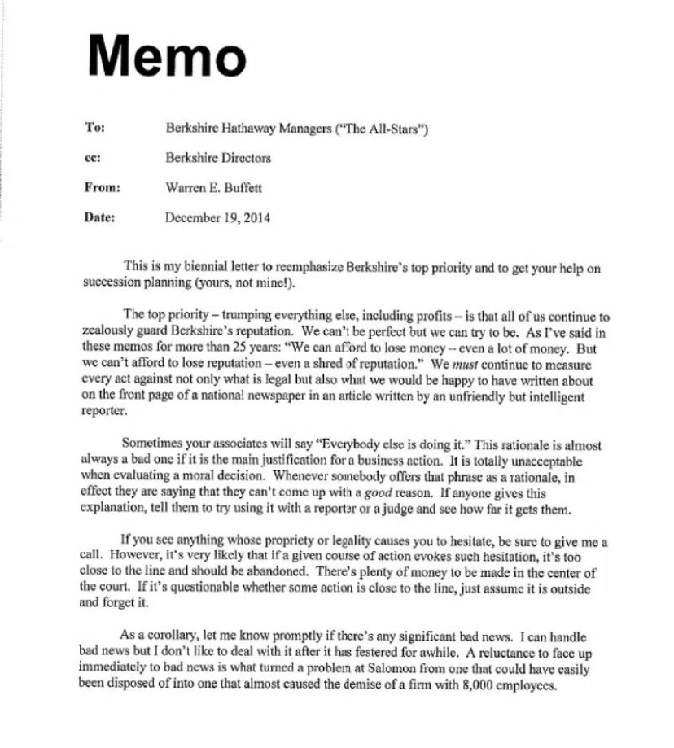
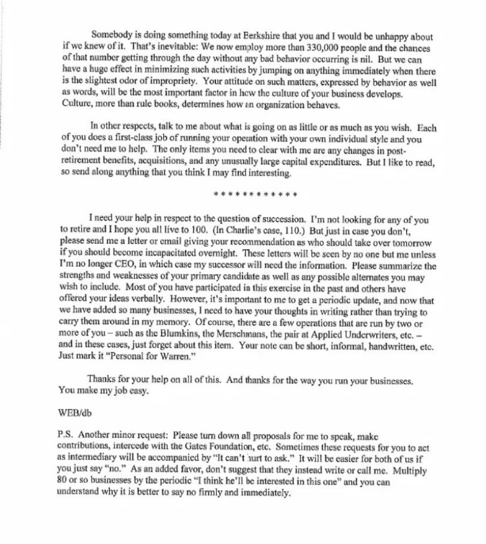

**备忘录**

**收件人：** 伯克希尔·哈撒韦的经理们（“全明星阵容”）

**抄送：** 伯克希尔董事会

**发件人：** 沃伦·E·巴菲特

**日期：** 2014年12月19日

这是我每两年一次的来信，重申伯克希尔的首要任务，并请你们协助处理接班计划（你们的，不是我的！）。

最重要的事情——高于一切，包括利润本身——是我们所有人都要极其严格地维护伯克希尔的声誉。我们无法做到完美，但我们必须力求接近完美。我在过去25年里写的类似备忘中反复强调：“我们可以承受亏损——即使是巨额亏损。但我们不能承受声誉的损失——哪怕是一丝一毫。”我们必须反复衡量我们的每一个行为，不仅要看它是否合法，更要看我们是否愿意看到这件事被一个聪明但不友善的记者写在全国性报纸的头版。

有时候你们的同事会说：“大家都在这么做。”如果这句话是某个商业行为的主要理由，那它几乎一定是个糟糕的决定。在做道德判断时，这是完全不可接受的。每当有人用这个理由为自己辩解时，其实就是在说“我也找不到一个好理由”。如果有人真这么解释，请让他们试着在法官或记者面前讲讲这个理由，看看结果如何。

如果你在面对某件事时，对其正当性或合法性有所犹豫，请告诉我一声。不过，通常情况下，如果某个行为让你犹豫不决，那它很可能已经**太接近红线**，应当被放弃。市场上赚钱的机会很多，不必去冒险。如果你对某件事是否“越线”感到疑问，那就默认它已经越线，干脆忘了它。

作为补充说明，如果有任何重大坏消息，请务必尽快告诉我。我可以应对坏消息，但我不喜欢处理那些已经拖延发酵过久的问题。正是因为有人不愿意及时面对坏消息，当年所罗门公司的一个本可以轻松解决的小问题，最终演变成几乎导致这家拥有 8000 名员工的公司倒闭的大危机。

今天在伯克希尔，一定有人正在做一些你我若知道了都会感到不快的事情。这是不可避免的——我们如今雇佣了超过33万人，这么大规模的员工队伍几乎不可能在一天中完全没有任何不当行为发生。但我们可以通过在任何不当迹象初现时立即采取行动，大幅减少此类行为的发生。

你在这类问题上的态度，不论是通过言语还是行为表达出来的，都会成为塑造你企业文化的最关键因素。**文化**，而非规章制度，才是真正决定一个组织行为方式的核心。

其他方面，你愿意分享多少信息、多频繁都由你决定。你们每个人都在用自己独特的方式一流地管理业务，不需要我来帮忙。你们只需要向我报告三件事：**退休福利的变动、并购事项和非常规的大型资本支出**。当然，如果你觉得有什么事情我会感兴趣，也欢迎随时发给我，我爱看这些。

我需要你们在接班人问题上给予帮助。我不是希望你们有人退休，我希望你们都能活到 100 岁。（查理的话是 110 岁。）但万一你们没能如愿，请给我写封信或发封邮件，告诉我你们推荐谁在你们突然无法继续工作时接手。这些信件除了我本人不会有别人看到，除非我不再担任 CEO，而那时我的继任者将需要这些信息。

请总结你首选候选人的优点和缺点，以及你可能想要提供的其他备选人。你们中的大多数人以前都口头参与过这个讨论，也有人提出了自己的看法。但对我而言，定期收到一份更新非常重要，尤其是现在我们新增了这么多业务，我更需要你们把想法写下来，而不是让我凭记忆记住所有内容。

当然，也有些业务是由两人或多人共同负责的，比如 Blumkins、Merschmans、Applied Underwriters 的那对搭档等——在这些情况下，就不需要回复这封信了。你写的内容可以简短、随意，哪怕是手写的便条都行，只需注明“给沃伦的私人信件”。

感谢你们在这件事上的帮助，也感谢你们经营公司时展现出来的方式。你们让我的工作变得轻松。

WEB/db

***

**附言：**

还有一个小请求：请帮我拒绝所有邀请我演讲、捐款、与盖茨基金会联络等提议。有时这些请求会附带一句“问问又没坏处”。如果你直接说“不”，对我们双方都会轻松些。额外拜托一下，也请不要建议他们给我写信或打电话。将我们大约80家公司的“我觉得他可能会对这个感兴趣”乘起来，你就能理解为什么果断、直接地说“不”更好。

