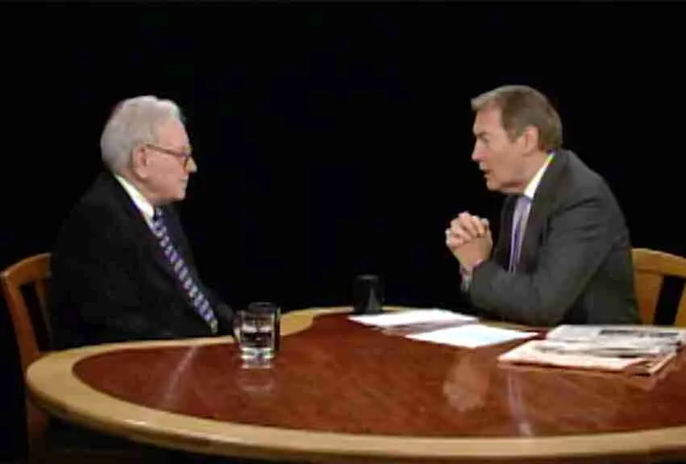

[Transcript of Warren Buffett on America, Life and Money （2008）.pdf]()

> 彦鑫：2008 年金融危机席卷全球之际，查理・罗斯对沃伦・巴菲特的这场访谈，堪称 “危机中的理性之声”。巴菲特以直白语言拆解危机根源 —— 房地产泡沫、衍生品风险与过度杠杆，更点明 “信心如氧气” 的核心逻辑。专访涵盖了他对政府救援计划的辩证看法、“别人恐惧时贪婪” 的投资哲学，以及对美国经济长期潜力的笃定，无论是想理解金融危机本质，还是学习价值投资思维，或是探寻经济困境中的破局之道，这篇访谈都值得一读，能让人在复杂局势中收获清醒与启示。

### 沃伦·巴菲特谈美国、人生与金钱（2008年）访谈实录

**查理·罗斯：**

沃伦·巴菲特将于2025年底卸任伯克希尔·哈撒韦公司首席执行官，届时他将年满94岁。大多数人认为他是我们这个时代最伟大的投资者，有些人甚至称他为有史以来最伟大的投资者。他将伯克希尔·哈撒韦打造成了一家市值达万亿美元的公司，个人净资产超过1600亿美元。但他的故事远不止金融天赋和这些数字那么简单。

这并非一篇讣告，只是借此机会聚焦这位人物，探寻他对我们所有人的意义。巴菲特将自己视为艺术家，将公司比作一幅画作。他代表了资本主义的精髓，也代表了美国的精华。他深知自己对股东肩负着重大责任，而这些股东也因他而变得非常富有。他清楚自身信誉的价值，并恰当运用这份信誉——如果巴菲特信任你，那如同银行里的存款般可靠。他的天赋不仅在于智慧，更在于常识、历史洞察力和风趣幽默。

正如《哈姆雷特》中对国王（哈姆雷特父亲）的描述，“这样的人，我们再也见不到了”，巴菲特亦是如此。能与巴菲特成为朋友，是我人生中最大的幸事之一。我珍视他给予的支持，也珍视从他身上学到的人生智慧。

在我们多次的访谈中，他最看重的是2008年这次——正值金融危机最严重的时期。当时，他坚定的品格和对美国的信心，帮助许多人重拾了对未来的信心、挽回了积蓄，也重建了对未来的信念。

#### **2008年专访全文实录：**

今天下午，我们在加利福尼亚州圣地亚哥，与沃伦·巴菲特展开对话。

他是国会领导人、政府部门和美联储都希望沟通的人物。作为伯克希尔·哈撒韦传奇的董事长兼首席执行官，公司的成功让他成为全球首富。长期以来，他的投资业绩令人钦佩；他的常识判断和多年来在致股东年度信中对引发美国及全球经济危机因素的预警，更让他赢得了人们的信任。

正因如此，我们专程来到圣地亚哥与他会面。他此次前来是为了出席《财富》杂志举办的“最具影响力女性峰会”，之后还将在峰会上接受《财富》记者、他的老朋友卡罗尔·卢米斯的采访。今晚，我们的节目来自圣地亚哥公共电视台附属机构KPBS的演播室。非常感谢我的朋友沃伦·巴菲特在繁忙的日程中抽出时间与我们交谈。

**沃伦·巴菲特：**

查理，我很乐意。

### 金融危机期间的投资

**查理·罗斯：**

我们先从今天的新闻说起。你宣布向通用电气（GE）投资30亿美元，投资条款与对高盛的投资基本一致。

**沃伦·巴菲特：**

是的，几乎完全相同。

**查理·罗斯：**

为什么选择通用电气？

**沃伦·巴菲特：**

今天早上，我在高盛的一位朋友打来电话，说通用电气可能有这样的投资需求。我对通用电气很熟悉，也了解它的管理层——无论是现任管理层，还是杰夫·伊梅尔特之前的杰克·韦尔奇，我认识他们已有数十年了。所以我清楚通用电气的业务，我们与该公司也有很多业务往来。

而且，通用电气肯定会继续存续下去。我记得它是道琼斯工业平均指数成分股中存续时间最长的公司，到现在差不多有100年了，未来也会一直存在。我也希望自己能活到那个时候（见证它更长久的发展）。这是一项有吸引力的投资，而且过去几年我们手头有大量现金，现在也确实看到了一些值得投资的机会。

**查理·罗斯：**

你还在关注其他投资机会吗？

**沃伦·巴菲特：**

查理，我关注所有机会，这是我的工作，我确实会这样做。我的意思是，每天我都会考虑各种可能的投资。

**查理·罗斯：**

我知道，但现在人们都说“现金为王”。伯克希尔·哈撒韦和你本人是不是手握大量现金，等待这个时机谨慎寻找更多投资机会？

**沃伦·巴菲特：**

是的，我们确实想动用现金。两年前我们没有动用现金，是因为当时没发现那么有吸引力的投资标的。但人们说“现金为王”，前提是现金能发挥作用——如果现金只是闲置着，那它算不上“王”。有些时候，现金的购买力会更强，现在就是这样的时期，现金能买到更多有价值的东西，所以我们会选择动用现金。

**查理·罗斯：**

看来确实有“积累现金的时机”和“动用现金的时机”之分。

**沃伦·巴菲特：**

完全正确。别人恐惧时我贪婪，别人贪婪时我恐惧，道理就是这么简单。

**查理·罗斯：**

那现在市场处于哪种状态？

**沃伦·巴菲特：**

人们现在相当恐惧。事实上，在我成年后的人生中，从未见过人们在经济层面如此恐慌。

### 经济危机

**查理·罗斯：**

为什么会出现这种情况？

**沃伦·巴菲特：**

因为人们看到信贷市场陷入停滞，开始担心货币市场基金——不过政府最新推出的方案应该能解决这个问题。过去几周，美国有8%的银行存款被巧妙地从一些机构转移到了另一些机构，而就在几个月前，人们还认为那些被转出存款的机构状况良好。所以，人们有担忧是正常的。

**查理·罗斯：**

就像人们常说的，这场危机已经影响到普通民众了吗？

**沃伦·巴菲特：**

当然有影响。我今天看到了汽车销量数据，如果你是汽车经销商，肯定能感受到危机的冲击；如果是像我们旗下这样的家具零售商、珠宝零售商，也能感受到。我了解这些行业，因为我们就身处其中。没错，危机已经产生影响，但如果我们不采取行动，影响会更大。

**查理·罗斯：**

参议院今晚将进行投票，你对这项救援计划满意吗？

**沃伦·巴菲特：**

我觉得这项计划并不完美，但我也不确定自己能否制定出完美的方案。不过，“大致正确”总比“精确错误”要好，而拒绝这项计划就是“精确错误”的做法。

美国经济原本非常强劲，就像一位突发心脏病、倒地不起的优秀运动员，而医护人员已经赶到现场。此时，他们不该争论除颤设备该放偏四分之一英寸还是那四分之一英寸，也不该因为患者之前没做血压检查就指责他，而是应该立即采取必要的抢救措施。

我认为国会最终会采取正确行动。虽然现在他们之间有一些争论，有人开始纠结于追究责任，也有一些煽动性言论，但面对如此重要的事情，他们最终会做出正确选择。这确实是一场“经济珍珠港事件”，听起来可能有些夸张，但我以前从未用过这个说法，这次危机确实配得上这样的形容。

**查理·罗斯：**

请详细说说为什么是“经济珍珠港事件”？除了信贷冻结、无人放贷、银行间互不拆借，还有国债收益率走低这些情况之外，还有其他原因吗？

**沃伦·巴菲特：**

是的。上周，400亿美元的国债被抢购，7天期国债的收益率只有1/20%。这意味着整个国家，或者说大部分地区，几乎都到了“把钱藏在床垫下”的地步——因为收益率仅1/20%，和把钱藏起来几乎没区别。但我们绝不能让3亿美国人都把钱藏在床垫下。

没有信贷和信任这两种“润滑剂”，经济就无法正常运转，而现在这两者都已缺失，这是个巨大的问题。当前，全球主要金融机构都在去杠杆，它们想减少资产和负债规模。一年前，借贷对它们来说还很容易，现在却像“老鼠药”一样避之不及，所以它们都在努力去杠杆。而世界上唯一有能力通过加杠杆来对冲这种趋势的机构，就是美国财政部。

### **政府对危机的应对**

**查理·罗斯：**

从贝尔斯登、雷曼兄弟、AIG，到房利美和房地美，再到你对高盛等公司的投资，你对政府在这些事件中的应对措施满意吗？

**沃伦·巴菲特：**

总的来说，我认为政府采取了正确的措施，但没人能完全预见这场“金融海啸”的到来。比如贝尔斯登出问题时，人们以为在那个节点阻止危机蔓延，就能避免后续风险，但事实并非如此。我觉得美联储当时的做法是对的，原本以为这能阻止其他大型机构出现挤兑，但没能如愿。

危机一波接一波，政府的应对确实有些“临时拼凑”，但有应对总比毫无作为要好。而且，三四个月前，财政部即便向国会说明当前的危机情况，也很难让人信服，更无法获得必要的授权。我认为，正是这场危机的爆发，才让人们意识到采取行动的必要性。

**查理·罗斯：**

那你觉得政府当时要求的权力范围和规模合理吗？

**沃伦·巴菲特：**

如果当时提出，肯定不会获批。所以到目前为止，整个过程就像一场悲剧，但现在，国会多数议员应该已经清楚问题的严重性，美国民众也应该明白：面对金融机构持续抛售资产、信贷市场枯竭的局面，唯一能对冲这种趋势的，只有美国财政部。

**查理·罗斯：**

但我从国会议员那里听到，全国各地都有反对声音。因为人们认为，这本质上是对华尔街的救助，而他们自己在经济困境中却无人问津，没人会对他们说“我们来帮你”。

**沃伦·巴菲特：**

但实际上，那位“突发心脏病倒地的患者”不是华尔街，而是美国经济。

**查理·罗斯：**

你觉得人们现在明白这一点了吗？我感觉可能存在沟通问题。

**沃伦·巴菲特：**

我觉得他们可能还没明白。而且，只要把“华尔街”和“救助”这两个词放在一起，人们就会反感——我也不喜欢华尔街现在的一些做法，也不认同高管的薪酬水平，但现在不是向“心脏病患者”说教的时候，而是要让它重新运转起来。

实际上，贝尔斯登的股东损失了90%到95%的资金，很多人丢了工作，失去了优渥的生活；雷曼兄弟的情况也是如此；AIG的股东同样损失惨重。而这些股东不只是华尔街的巨头，还包括全国各地的养老基金和普通投资者。我们不必过于纠结“公平与否”，毕竟无法做到绝对公平。你可能会对那些拿着巨额“金色降落伞”（离职补偿金）的人感到愤怒，但这不是当下最重要的事。就像珍珠港事件爆发时，你可以指责军方之前的部署失误，或者抱怨战舰不该都停在港口，但这些都无济于事。当下的首要任务是应对危机，不能花数周时间追究责任，也不能等着委员会制定完整的作战计划、决定战舰部署位置，而是要立即行动，动用最优秀的人才。

### **危机的严重性**

**查理·罗斯：**

你这辈子从没见过这样的危机吧？

**沃伦·巴菲特：**

是的，从没见过。

**查理·罗斯：**

有人认为我们正走向衰退，而人们最担心的是陷入大萧条。

**沃伦·巴菲特：**

确实有这种担忧。

**查理·罗斯：**

如果救援计划失败，这种担忧有可能成真吗？

**沃伦·巴菲特：**

是的，有这种可能。目前美国失业率约为6.1%，从常识来看，我们已经处于衰退之中。美国民众拥有约20万亿美元的住宅资产和20万亿美元的股票资产，这是美国家庭最主要的两类资产，且两者的价值都大幅下跌（不同家庭的跌幅不同）。但至少95%的人，无论是从住宅财富还是股票财富来看，都比一两年前更穷了。

这种财富缩水正逐渐影响实体经济，比如汽车销量、珠宝销量、家具销量都受到了冲击，而且这种冲击才刚刚开始。如果信贷市场持续瘫痪，如果所有公司都只想着缩减资产负债表、出售资产，那后续的影响会更严重。

无论如何，失业率还会上升，目前6.1%的失业率肯定会更高。但失业率最终停在7%，还是升至10%、11%甚至12%，很大程度上取决于国会的决策是否明智，以及后续执行计划的力度。

**查理·罗斯：**

你强烈呼吁参议院和众议院通过这项计划，是不是因为这是目前唯一可行的方案——虽然你可能没有更好的想法，但它对国家和市场信心至关重要？

**沃伦·巴菲特：**

是的。我担心的是计划的力度是否足够，但随着时间推移，我越来越觉得有必要推出这项计划。就像珍珠港事件发生后，如果一两周甚至三周都不采取应对措施，后续的战争就会陷入被动。所以，美国国会本周必须通过行动表明，他们会采取必要措施应对危机，大多数议员也应该支持这一立场——当然，不可能所有人都同意。

**查理·罗斯：**

你为什么相信这项计划会奏效？

### **危机中的领导力**

**沃伦·巴菲特：**

因为我认为，目前的财政部长汉克·保尔森是最佳人选。虽然他在错误的时间接手了这个职位，可能当初不该接受这份工作，但他是我的朋友，而且他懂市场、懂企业运作、懂资金管理，更重要的是，他心系国家。所以，我们有合适的人在负责。

希拉·拜尔也是一位非常出色的人，大多数观众可能没听过她的名字。过去两周，她成功将美国8%的银行存款无缝转移到了稳健的机构，这些机构也因此获得了更多资金。她做得非常出色——要知道，这涉及美国8%的存款、数千万储户，而她却默默无闻，也不会获得“金色降落伞”或高额离职补偿。我们有很多优秀的公职人员，我认为现在负责此事的人都能胜任，他们只是需要更多授权。

**查理·罗斯：**

也就是说，除了这项计划中的内容，他们可能还需要更多支持？

**沃伦·巴菲特：**

他们需要充足的资金，也需要足够的灵活性来执行计划。在我看来，他们还必须将计划与市场价格紧密挂钩。查理，我曾说过，如果政府以当前市场价格收购抵押贷款相关证券或抵押贷款本身，长期来看肯定能盈利，因为美国政府有“持久力”，借贷成本也低。

如果我能从这7000亿美元中拿出1%，和政府一起投资，共享收益、共担风险，而且政府按市场价格收购资产，我肯定能赚很多钱。要知道，对冲基金等机构现在都在收购这类资产，预期收益率能达到15%或20%，它们就是那些急于出售资产的机构的买家。

美国财政部的借贷成本是其他机构无法比拟的，它可以借到几乎无限量的资金，也可以长期持有这些资产。随着时间推移，这些资产的价值肯定会上升。比如一个月前，美林证券以面值22%的价格出售了一批抵押贷款相关资产，买家肯定能盈利；如果买家是美国政府这样借贷成本极低的机构，盈利会更多。

**查理·罗斯：**

所以你是在告诉那些担心7000亿美元去向的纳税人，当政府出售这些证券时，他们很可能能收回大部分资金，甚至全部收回，还可能有额外收益？

**沃伦·巴菲特：**

我是这么认为的。

**查理·罗斯：**

甚至可能收回全部资金，还有盈余？

**沃伦·巴菲特：**

我敢打赌会这样。如果有机会参与其中1%的投资，无论结果如何，我都会下注。今天伯克希尔·哈撒韦向通用电气投资30亿美元，不是“花费”，而是“投资”；政府收购抵押贷款资产，同样不是“花费”，而是“投资”。

这些是困境资产，但如果以市场价格收购，就是值得投资的标的——这正是我喜欢的投资类型，只是我没有7000亿美元的资金。或许我们可以合作，用你的资金加上我的判断力，说不定能取得很好的效果。

**查理·罗斯：**

我愿意合作，你怎么安排都行。不过有个问题：有人提出，美国为什么不效仿伯克希尔·哈撒韦的做法？对美国来说，这难道不是更好的选择吗？

### **其他解决方案**

**沃伦·巴菲特：**

我认为成立一个以“复兴金融公司（RFC）”为蓝本的机构并非不可行。复兴金融公司成立于1932年，1933年在杰西·琼斯的主导下正式运作，最初主要投资银行、优先股等领域。

当前金融体系需要解决两个核心问题：首先是流动性——当机构急于出售资产时，必须有人接手，不一定非要高价收购，但必须有买家；其次是部分机构的资本充足率问题，我们最近就向几家机构注资了。20世纪30年代，美国政府通过复兴金融公司也做过类似的事情，我认为政府现在在这方面也可以发挥适当作用。

**查理·罗斯：**

那现在成立这样的机构会不会更好？

**沃伦·巴菲特：**

现在成立的话，规模不够大，速度也不够快。即便现在成立复兴金融公司，给它1000亿美元用于注资，申请流程也会非常繁琐。而当前，资产每天都在被抛售，商业票据也面临无法续期的问题。

要知道，商业票据市场一旦枯竭，就像抽走了美国经济的“血液”，而现在这种情况正在发生。所以我认为，类似复兴金融公司的机构或许有意义，换作我可能也会这么做，但不能把它和当前的紧急应对措施混为一谈——现在最需要的是注入流动性。

**查理·罗斯：**

有人认为，现在是沃伦·巴菲特响应国家号召的时候了，毕竟美国曾给予你很多。除了运营伯克希尔·哈撒韦，你还准备为国家做些什么？

**沃伦·巴菲特：**

运营公司是我的本职工作，但只要政府需要我提供建议，我随时愿意帮忙——实际上，我已经提过一些建议，只是在关键时刻可能没被采纳。不过，今晚我来这里谈论这些话题，对伯克希尔·哈撒韦其实没有直接好处（当然也不是完全没有），因为任何能让美国经济正常运转的措施，对公司都是有利的。

美国现在的工厂数量和两年前一样多，住房数量也没减少，人们的生产效率比美国历史上任何时候都高，我们拥有绝佳的经济发展模式。但目前，经济因为一些事件陷入停滞，说到底，就是当前的去杠杆进程引发了信贷危机。

### 衍生品的作用

**查理·罗斯：**

我之前在介绍中提到过，你每年都会亲自撰写致股东的信，由卡罗尔·卢米斯编辑，而且你曾说，撰写时会想象是在和你妹妹沟通，向她解释公司情况。

**沃伦·巴菲特：**

是的，我会想象在和妹妹伯蒂·阿多丽丝解释。

**查理·罗斯：**

你在信中谈到过衍生品，而衍生品正是此次危机的核心诱因之一。

**沃伦·巴菲特：**

没错。如果AIG从未接触过衍生品，现在肯定一切安好。AIG曾是美国市值前十的公司，市值超过2000亿美元，也是全球最受尊敬的保险公司之一。如果没有衍生品，他们现在还能正常运营，员工每天都能安心上班，不会有任何麻烦。

但衍生品业务的诱惑太大了——在纸上写写数字，就能操纵利润，而且没有资本要求等限制。我之前就说过，衍生品可能是“金融大规模杀伤性武器”，现在果然如此。它摧毁了AIG，也很可能是贝尔斯登和雷曼兄弟倒闭的推手之一（尽管雷曼还有其他问题）。

**查理·罗斯：**

我很好奇，人们会问：为什么有人能肆意妄为？是不是有人操纵系统、从中渔利，导致过度投机，最终引发了当前的危机？

### 房地产泡沫

**沃伦·巴菲特：**

确实存在这些问题，但我认为最大的诱因是美国房地产泡沫的破裂。这让我想到400年前荷兰的郁金香泡沫——人类在恐惧、贪婪等情绪的驱使下，总会制造泡沫。之前有互联网泡沫，20世纪80年代美国中西部还有农田泡沫，都引发了惨痛后果。

而这次，3亿美国人、贷款机构、政府和媒体都相信房价会持续上涨，这种预期催生了规模达20万亿美元的住宅市场。贷款审批基于这种预期，很多人都做出了愚蠢的决策，甚至有人存在欺诈行为，这些问题日后会被追查。

但这不是当前的核心问题，只是危机的源头——过度杠杆化放大了泡沫破裂的影响。如果20万亿美元的资产贬值20%，就是4万亿美元的损失，而当这些损失集中在经济的薄弱环节时，整个经济体系就会陷入停滞。

**查理·罗斯：**

而且房地产市场的低迷还在持续，有人认为要想美国经济长期复苏，必须解决房地产市场的问题。

**沃伦·巴菲特：**

毫无疑问，当前房地产库存过剩，但好消息是美国的家庭数量仍在增长——我不知道每年新增家庭是100万户还是更多，但这些新增家庭能逐渐消化库存。只是目前库存过多，而且很多地区的房价之前涨得离谱，贷款方式也很不合理，甚至有人在贷款申请中造假，各种乱象层出不穷。但说到底，这就是引发当前危机的最主要原因。

**查理·罗斯：**

明智的人当初应该能预见这些问题吧？

### 金融泡沫的自然发展过程

**沃伦·巴菲特：**

理论上，人们本该预见，但面对贪婪这种本能，人们往往不够理性。看到邻居变富，你会觉得自己比他聪明，却没他有钱，配偶也会因为你“不作为”而不满，久而久之，你也会跟风投机。

这就是我所说的“泡沫自然发展三阶段”：创新者、模仿者和傻瓜。所有人都会盲目跟风，如果你提出反对意见，反而会显得格格不入。比如20世纪90年代末，互联网公司估值高得离谱，但市场却持续推高股价，人们会说“不参与进去就是傻子”，这就是人性的体现。

而房地产泡沫更具煽动性，因为大多数人都渴望拥有自己的房子。如果你真的相信房价会逐年上涨，就会觉得“今年不买，明年就更买不起了”——这和互联网股票不同，房子是刚需。而且如果有人告诉你“不用付首付”“可以稍微隐瞒收入”“能申请100%抵押贷款”，你肯定会动心，因为之前这么做的人都赚了钱，这就是所谓的“社会认同”。如果你不这么做，明年房价涨了，你就会觉得自己是“傻子”。

**查理·罗斯：**

就像“天上掉馅饼”一样。

**沃伦·巴菲特：**

没错，人们会觉得这是“不劳而获的钱”。

**查理·罗斯：**

所以现在来看，有两个问题很明显：风险意识缺失和过度杠杆。我们当时完全忽视了这两点。

### 杠杆的危险

**沃伦·巴菲特：**

是的。人们之所以会使用杠杆，是因为短期内能带来回报。但杠杆也是聪明人破产的唯一途径——如果你欠了钱，明天还不上，就会陷入危机；如果你不借钱，做明智的投资，最终肯定能致富。即便你做明智的投资，但如果加了杠杆，只要一次失误，就可能一无所有，因为任何数乘以零都等于零。但当你身边的人都靠杠杆成功，你自己也尝到甜头时，就会觉得杠杆是“好东西”，这就像灰姑娘参加舞会——午夜一到，一切都会打回原形，但随着夜晚推移，你会觉得舞伴越来越迷人，音乐越来越动听，会想“为什么要在11点45分离开？我可以等到11点58分再走”。但问题是，舞会上没有时钟，所有人都觉得自己能“卡点离开”。

**查理·罗斯：**

而且11点58分的时候，你还玩得很开心。

**沃伦·巴菲特：**

没错，肯定很开心。

**查理·罗斯：**

所以你希望这项救援计划能起到什么作用？缓解信贷紧张、阻止经济下滑和市场恐慌，让人们重拾信心？

### 信心的重要性

**沃伦·巴菲特：**

信心是关键，至关重要。如果你不信任我能把钱还给你，就不会把钱交给我。当前7天期国债收益率只有1/20%，人们买国债不是为了这点收益，而是相信财政部下周能把钱还给他们。

我们即将在10月6日完成对玛氏箭牌（Mars Wrigley）的收购，需要支付65亿美元。从现在到10月6日，我必须谨慎选择存放这笔钱的地方，因为对方等着我付款。但如果我对其他机构失去信心——现在确实有很多机构让我不信任——它们的资金可能无法及时支取，整个经济就会陷入停滞。

市场和机构的信心就像氧气：拥有它时，你不会在意；一旦失去哪怕5分钟，它就会成为你唯一关注的东西。当前信贷市场的“氧气”（信心）已经被抽干，必须立即“重启”信心。

**查理·罗斯：**

所以这就是救援计划的目的？

**沃伦·巴菲特：**

我希望它能成功。

**查理·罗斯：**

如果计划失败了呢？

**沃伦·巴菲特：**

就像打开水龙头却没水流出一样。我和一些参议员、众议员谈过，他们必须明白“力度不足、行动过晚”的危害。在我看来，现在已经有些“行动过晚”了，但好在他们终于要采取行动了。就像珍珠港事件爆发后，不能花几周时间争论“是不是日本人干的”“要不要派出战舰”，力度不足同样是个错误，这项计划必须推行。

**查理·罗斯：**

你说的“力度不足”，是指措施不够激进，还是资金规模不够？

**沃伦·巴菲特：**

是指人们最终会觉得计划力度不够。7000亿美元是一大笔钱，能收购很多困境资产——如果价格合适，甚至能收购面值2万亿美元的资产。

关键在于，不要在意出售方当初的买入价或账面成本，必须按市场价格收购。比如，某机构想出售10亿美元的抵押贷款资产，可以让它先在市场上出售1亿美元，政府再按同样价格收购剩下的9亿美元。而且，一旦计划获得授权，本身就能在一定程度上稳定市场，这是好事，但绝不能人为抬高收购价格。

### 美国未来前景

**查理·罗斯：**

你认为哪些事情会彻底改变？

**沃伦·巴菲特：**

我认为信心终将恢复。可以肯定地说，10年后美国人的生活水平会比现在更高，20年后会比10年后更高。美国能成为“世界奇迹”，靠的是一系列关键因素——20世纪，美国人均生活水平提高了7倍，这是前所未有的成就。

期间，我们经历了大萧条、两次世界大战、流感大流行、石油危机等诸多灾难，但美国的制度总能不断释放人类的潜力，让我们在百年间实现了7倍的生活水平提升。要知道，在历史上的很多世纪里，生活水平能提高1%就已经很了不起了。

所以我们的制度非常出色，现在的生产能力也比以往任何时候都强，美国工人的生产效率达到了历史峰值，人口规模也在增长，拥有实现美好未来的所有要素。当前的经济困境，就像优秀运动员暂时倒地，但它终究是“超级运动员”。

**查理·罗斯：**

那这位“倒地的运动员”会对全球产生什么影响？

**沃伦·巴菲特：**

影响会很大，我们现在已经感受到了。而且全球很多地区都面临类似问题，比如欧洲银行的做法和美国银行如出一辙。

**查理·罗斯：**

现在欧洲银行也在倒闭。

**沃伦·巴菲特：**

是的。比如，奥马哈某个人的抵押贷款，会被华尔街的人多次证券化，然后卖给欧洲银行。那些华尔街人士拿着高学历，看起来很专业，还会用“伽马”“阿尔法”“西格玛”等术语包装产品，但我想说的是：警惕那些拿着公式的极客。

### 全球投资

**查理·罗斯：**

关于“经济脱钩”或美国经济的全球影响力，我们有什么教训吗？比如你在中国有投资，对吧？

**沃伦·巴菲特：**

是的，而且几天前我们刚在中国做了一笔新投资。

**查理·罗斯：**

是哪家公司？

**沃伦·巴菲特：**

一家叫比亚迪（BYD）的公司，我希望它能研发出真正优秀的电动汽车。

**查理·罗斯：**

除了“看价值、看管理层、看能否容纳大额投资、看前景、看价格”，你的投资还有其他核心逻辑吗？

**沃伦·巴菲特：**

现在我们的投资规模需要足够大，才能对公司业绩产生影响，所以会关注体量较大的标的。我只投资自己能理解的领域——很多业务我都不懂，比如有人知道怎么靠可可豆赚钱，但我不懂，所以我会避开这类投资。

但核心原则不变：业务必须是我能理解的；公司要有良好的基本面；管理层必须是我喜欢、信任且钦佩的；价格必须合理。最近，很多资产的价格已经变得很合理了，甚至非常有吸引力。

**查理·罗斯：**

所以现在是投资的好时机？

**沃伦·巴菲特：**

是的，而且我对我们的投资毫不担心。美国目前的人均GDP约为4.6万至4.7万美元，已经非常高了，未来还会更高。我不担心美国的未来，只担心那些阻碍美国发挥潜力的因素——目前来看，这些因素确实让经济陷入了困境。

### 展望未来

**查理·罗斯：**

假设我们成功度过这次紧急危机，明年1月将迎来新总统、新财政部长和新国会。他们的首要任务是什么？面临的挑战又是什么？毕竟他们有更多时间从长计议，或许那时“患者”已经起身，他们需要让“患者”更快恢复活力。

**沃伦·巴菲特：**

只要信贷市场恢复流动，经济就会加速复苏。但我不想给人们虚假希望——即便推出救援计划，经济也不会在几个月内奇迹般好转，衰退还会加剧。具体需要多久恢复，我也不确定，可能6个月，也可能两年。

**查理·罗斯：**

更有可能是两年？

**沃伦·巴菲特：**

我不确定，但肯定不会是一两个月，无论采取什么措施都一样。

**查理·罗斯：**

我能想象，6个月后，如果条件具备，经济可能开始复苏。

**沃伦·巴菲特：**

这是最好的情况，没错。最坏的情况是需要更长时间，如果我们不采取正确措施，甚至可能需要5年。

**查理·罗斯：**

那除了当前的计划，我们还应该做些什么？

**沃伦·巴菲特：**

我了解到，最新的法案计划先投入3500亿美元，后续再根据情况追加。但核心是，我们需要投入必要的资源。而且要明确，这不是“花钱”，如果政府明智地收购资产，美国财政部最终会盈利——政府的借贷成本只有几个百分点，而这些资产的收益会高于借贷成本。

**查理·罗斯：**

但这有个很大的前提，就是财政部长能明智地收购资产。所以，能否明智地收购资产，是关键问题。

**沃伦·巴菲特：**

我认为，财政部长的人选比副总统更重要。如果要辩论，我更想看到两位潜在财政部长的辩论，而不是副总统辩论——这对总统候选人来说，也是展示自身判断力的好机会，比如告诉民众他们会听取谁的建议，可能会任命谁担任财政部长。

**查理·罗斯：**

总统候选人当然会说“会听取你的建议”。我猜他们肯定这么跟你说过，对吧？

**沃伦·巴菲特：**

没有，但他们没必要提前确定候选人名单。

**查理·罗斯：**

现在很多人都会给你打电话吧？比如你的朋友，还有美联储的人。你之前也经历过类似危机，比如长期资本管理公司（LTCM）危机，还有其他很多困难时期。他们找你谈话时，会问些什么？我指的是那些负责解决危机的聪明人，他们想从你这里得到什么？

**沃伦·巴菲特：**

我确实经历过很多事。

**查理·罗斯：**

所以他们会说“你之前应对过危机，沃伦，我们想和你聊聊”，但具体会问什么问题呢？

**沃伦·巴菲特：**

最近他们问得最多的是“这项计划会奏效吗？”

**查理·罗斯：**

是吗？

**沃伦·巴菲特：**

是的。

**查理·罗斯：**

那你会向他们保证，只要推行计划就会奏效？

**沃伦·巴菲特：**

我会说“只要他们正确执行，就会奏效”。我不认识下一届财政部长，但我想说，虽然华盛顿的人可能不喜欢这个说法，但我愿意给汉克·保尔森这样的人近乎“空白支票”的授权。

**查理·罗斯：**

也就是“给你7000亿美元，去投资吧”？

**沃伦·巴菲特：**

是的，“去投资”。

**查理·罗斯：**

“去投资”。

**沃伦·巴菲特：**

去投资。如果让他和我一起投资，我甚至会让他也投入一些自己的钱。

**查理·罗斯：**

没错。

**沃伦·巴菲特：**

但实际上，让535名国会议员一起做投资决策是很困难的，所以我认为应该给执行者更多自主权——当然，这不会完全实现，而且必须有监督，监督是必要的。

**查理·罗斯：**

但不要让议员们直接做决策。

**沃伦·巴菲特：**

是的。监督是好事，但监督的核心应该是“是否按市场价格投资”——也就是说，要确保政府不做愚蠢的投资，但不必在意资金流向哪个国会选区，也不必纠结“是否偏袒银行”。

**查理·罗斯：**

但我们怎么判断投资是否明智呢？这是个大问题。

**沃伦·巴菲特：**

我认为，投资过程会受到充分监督。比如当年的复兴金融公司，人们都知道它投资了哪些机构的优先股，效果很好。

**查理·罗斯：**

那这次和“ Resolution Trust Company（重组信托公司，RTC）”有什么不同？因为这次涉及的是证券，不是房地产。

**沃伦·巴菲特：**

有很大不同。重组信托公司是为了清算政府接管的资产——储蓄贷款机构倒闭后，政府介入并偿还储户，然后接手这些机构的资产并进行清算。而我们现在讨论的不是“清算”，而是“明智地收购”。重组信托公司处理的是储蓄贷款机构愚蠢操作留下的资产，任务是“清仓”；而当前的计划是“主动投资”，两者性质完全不同。

### 资本主义与市场

**查理·罗斯：**

你之前跟我说过，资本主义不是完美的制度，虽然它可能比其他制度都好，但仍有缺陷。现在人们看到危机，会说“这是资本主义的过度投机导致的”“市场失灵了”，有些国家甚至会指责我们“看吧，我们早就说过市场不能解决所有问题”。

**沃伦·巴菲特：**

市场本身没有问题，问题出在人身上。只要有市场，就会有过度投机——从荷兰郁金香泡沫、南海泡沫，到互联网泡沫、铀矿泡沫，都是如此。我刚开始投资时就见过类似情况，人性不会轻易改变，也不会变得更聪明。当然，我们可以通过制度（比如银行资本充足率要求）来约束过度投机，但银行总能找到规避监管的方法，比如通过复杂结构加杠杆。人们在杠杆奏效时总会偏爱它，因为“以X利率借钱，以X+1利率放贷”看起来很容易。

**查理·罗斯：**

而且当时所有资产都在上涨。

**沃伦·巴菲特：**

但如果收不回X+1的本息，还欠着X的本金，就会陷入麻烦。

**查理·罗斯：**

还有会计问题，你对会计制度有很强烈的看法，尤其是“按市值计价”原则。你怎么看待这个问题？

**沃伦·巴菲特：**

很多人不同意我的观点，但我支持“按市值计价”。1974年到1975年，伯克希尔·哈撒韦持有一批普通股，当时我就告诉股东这些股票的市场价值，并说明“我认为它们的内在价值远高于市场价值，未来会盈利”，但同时也会如实披露当前市值。我认为，如实披露不会伤害任何人；但如果开始编造“非市场价格”，就会引发各种财务争议。

**查理·罗斯：**

反对你的人会说“这些资产的价值远高于市值，当前市值不能反映真实价值”。

**沃伦·巴菲特：**

但市值就是当前的真实价值，也是政府收购这些资产时会参考的价格。如果开始编造资产价值，就会陷入大麻烦。你可以解释“这些资产价格目前处于低迷状态，未来会升值”，在某些情况下，这种说法是合理的，但不能说“突然之间，1美元现金就值2美元了”——它就是1美元，这是事实。过去20年，我们见过太多编造财务数据的案例，不能让情况变得更糟。

**查理·罗斯：**

那在会计改革方面，你认为应该怎么做？比如是否保留“按市值计价”原则？

**沃伦·巴菲特：**

“按市值计价”的规则变得极其复杂，执行起来很麻烦，但我会如实告诉伯克希尔·哈撒韦的股东：只要我们持有的证券或资产有市场报价（即便市场低迷），我都会披露真实情况。事实上，我已经为明年的年度信写了一个章节，解释为什么我认为某些资产的资产负债表数据（按标准方法计算）是错误的——但这是行业惯例，也是SEC要求的做法，我们会遵守，但我会解释背后的逻辑，股东可以自行判断是否认同。

### 美国的国际地位

**查理·罗斯：**

谈到美国的前景，有人认为，尽管美国很强大，但现在处于一个“多极世界”，有书籍称美国的“霸权地位”将不得不与其他国家分享——或许美国在全球经济中的“份额”不会减少，但其他国家的“份额”会大幅增加。

**沃伦·巴菲特：**

这是好事。我希望美国的“蛋糕”能不断变大，但如果其他国家的“蛋糕”增长得稍快一些，从长期来看对美国也是有利的。全球有65亿人口，3亿美国人能持续享受繁荣当然很好，但如果剩下的62亿人也能过上更好的生活，那就更棒了。如果他们能从美国的制度中借鉴经验（事实上他们已经在借鉴了），学会如何释放民众的潜力，生产更多本国和美国民众需要的商品和服务，这是非常积极的事。而且，当某些拥有核武器的国家民众生活改善时，我们的世界会更安全。

**查理·罗斯：**

那你怎么看中国和一些亚洲国家持有大量美国债务的情况？在当前经济环境下，这会让你担忧吗？他们是否对美国失去了信心？这会给我们带来大问题吗？

**沃伦·巴菲特：**

现在还有人在以1/20%的收益率购买美国国债，这说明市场仍有信心。目前，美国每天消费的商品和服务比生产的多20亿美元，也就是说，其他国家每天要向美国净出口20亿美元的商品，我们必须给他们“回报”——这些“回报”就是一张张纸质凭证（国债、股票等）。当然，我们希望他们把这些凭证“藏起来”，但他们终究会用这些凭证购买资产，比如美国国债、设立主权财富基金，或者收购美国公司。只要美国消费超过生产，每天都在“用资产换商品”，其他国家就会不断持有更多美国资产。但另一方面，他们也无法完全“逃离”美国资产——因为只要他们还在向美国出口商品，每天就会新增约20亿美元的美国资产持有量。

**查理·罗斯：**

因为我们每天要借20亿美元。

**沃伦·巴菲特：**

是的，而且他们想向我们出售商品。

**查理·罗斯：**

但你不认为这是好事，对吧？你觉得经常账户赤字扩大是坏事，反映了美国“重消费、轻储蓄”的观念。那这种情况该如何改变？

**沃伦·巴菲特：**

几年前，我提出过一个有些复杂的计划，我自己也不是很满意，但它比当前的现状要好。不过，美国的出口表现其实不错——目前出口占GDP的比重约为12%，而很多年前，这个比例只有5%（而且当时的GDP规模比现在小得多）。所以其他国家其实很喜欢美国的商品，问题在于我们进口的商品太多了。我认为这是政府需要解决的问题，但目前它不是最紧迫的。美国确实在通过“出让部分资产”来换取超额消费，长期来看这不是好事，甚至可以说很糟糕，但美国的生产能力增长足以支撑这种模式，民众生活水平仍会提高——只是如果没有这种超额消费，生活水平会更高。

**查理·罗斯：**

这会对美元汇率产生什么影响？

**沃伦·巴菲特：**

可能会引发严重的通胀。当前，我们实际上是在“未来通胀”和“经济复苏”之间做选择，而为应对当前危机所采取的措施，很可能会导致未来通胀上升。

**查理·罗斯：**

你支持的奥巴马参议员提到了另一项经济刺激计划，现在有必要推出吗？

### 税收政策与经济不平等

**沃伦·巴菲特：**

我认为当前最紧迫的是打通信贷市场，如果需要推出另一项刺激计划，资金应该流向中低收入人群。事实上，我现在的纳税税率是这辈子最低的，这很不合理。你可以看看《福布斯》400富豪榜，算上薪资税，这些人的平均税率甚至低于他们的秘书或办公室职员。

所以我认为，像我这样的高收入人群应该缴纳更多税款；奥巴马提到“95%的人税负会降低”，我认为剩下5%的人（高收入群体）税负甚至可以再高一些。刺激计划应该聚焦普通民众——美国约有2400万户家庭（占总家庭数的1/5）年收入低于2.1万美元，这些家庭平均有2.5到3口人（甚至接近4口人）。

想象一下，靠每年2.1万或2.2万美元生活是什么样子？有20%的美国人正过着这样的生活，他们不需要担心我这样的人，而刺激计划应该提升他们的购买力。如果给这些人每人发放1000美元，他们肯定会花掉这些钱——他们需要这些钱，而这笔钱应该部分来自像我这样的高收入人群。

**查理·罗斯：**

那你怎么看待资本利得税？

**沃伦·巴菲特：**

目前资本利得税税率是15%，对吧？我在办公室里靠资本利得赚了很多钱，只需要缴纳15%的税，而且不用交薪资税；但来办公室倒垃圾的女工，仅薪资税就要交15.3%。我这辈子从没享受过这么低的税负。

**查理·罗斯：**

所以你认为资本利得税应该提高到18%、20%、25%还是30%？

**沃伦·巴菲特：**

我认为“投资所得税率远低于劳动所得税率”是很不合理的。今年美国政府支出约3.1万亿美元，但税收收入只有约2.6万亿美元，差额需要有人来填补——要么向我和你这样的人征税，要么向送我来这里的出租车司机这样的普通人征税，总有人要承担。

而且，每个人都不愿意自己多交税，我也一样，这是人之常情。但如果想让政府提供我们需要的服务，就必须有人纳税。尤其是过去六八年，像我这样的高收入人群缴纳的税款占比越来越低。

人们总说“最富有的1%人群缴纳了多少比例的所得税”，比如个人所得税总额约为1.3万亿美元，而薪资税超过9000亿美元——这9000亿美元几乎和我无关（我只需要为前10万美元收入缴纳薪资税），主要来自普通工薪阶层，比如我办公室的员工。但没人会谈论这一点。

当人们说“1%的人承担了多少税负”时，会刻意强调“我们（富豪）在受苦”，比如“1%的人缴纳了25%的个人所得税”，但实际上，他们没有缴纳25%的“个人总税负”，只是25%的“个人所得税”。而薪资税占联邦政府收入的1/3以上，却不会对我的资本利得或股息征税，只对倒垃圾的女工征税。

### 经济政策与利率

**查理·罗斯：**

你提到了通胀风险，那你对利率政策有什么看法？美联储应该如何调整利率？

**沃伦·巴菲特：**

我认为目前应该先把利率问题放一放，等“经济患者”站起来、能走路了再说。不过很有意思的是，当前利率水平已经非常低，包括长期利率也是如此。

**查理·罗斯：**

我们今天谈话时，参议院今晚就要投票，众议院可能也会跟进。我今天交流过的人都认为计划会通过。不知道是因为计划本身做了调整，还是因为上次投票失败让人们意识到“不行动的危险”，才改变了想法。不管怎样，我们该如何衡量计划是否有效？有哪些关键指标？

**沃伦·巴菲特：**

这确实很难衡量，因为即便计划通过，经济短期内仍会恶化；但如果不通过，经济可能会“断崖式下跌”——可如果计划通过了，没人会知道“不通过的后果”。所以，不会有立竿见影的效果，就像抢救“心脏骤停患者”时，不能指望他立刻跳起来。

这对议员来说很棘手——他们投票支持计划后，人们可能会说“你花了这么多钱，却没看到效果，你怎么能这么做？你根本没帮到我”。所以，需要有真正懂行、能清晰解释计划的领导者，让民众理解背后的逻辑。

**查理·罗斯：**

现在似乎缺少这样的领导者。我之所以邀请你做这次“炉边谈话”，就是因为人们还没真正理解危机的严重性和计划的必要性。你继续说。

### 危机中的领导力

**沃伦·巴菲特：**

当美国总统早上8点发表讲话，结果自己所在的政党在众议院以2:1的比例反对他提出的计划时，就说明信息传递出现了严重问题。这需要真正的领导力——比如罗斯福，他上台时并没有印更多钱（或许印了一点），也不是什么“最伟大的经济学教授”，但他成功重建了民众的信心。

当时他们采取了很多措施，这些措施都是必要的，是为了“重启”经济，尽管花了很长时间——1933年或1934年时，情况并没有立刻好转。但他们建立了联邦存款保险公司（FDIC），我认为FDIC是美国最伟大的制度创新之一。

**查理·罗斯：**

在这次的救援计划中，他们是不是也对FDIC做了调整？

**沃伦·巴菲特：**

是的，方向是正确的。

**查理·罗斯：**

罗斯福还说过“我们唯一需要恐惧的就是恐惧本身”，而当前市场正被恐惧笼罩。过去三周（甚至一个月），有没有某个时刻让你觉得“天啊，我从没想过情况会这么糟”？

**沃伦·巴菲特：**

从某种程度上说，我并没有那么恐惧，因为我坚信美国经济的韧性——只要不被“卡住”，它就能高效运转，而且我相信国会最终会采取正确行动。但我可以告诉你，当看到众议院上次投票否决计划时，我虽然仍相信最终会有解决方案，但也意识到我们正经历一个极其艰难的时期。我从没想过，像AIG这样的公司会面临“支票无法兑现”的风险。

### AIG危机

**查理·罗斯：**

如果AIG破产，高盛会面临风险吗？摩根士丹利呢？

**沃伦·巴菲特：**

所有人都会面临风险，查理，没有例外。

**查理·罗斯：**

当时为什么会有人讨论“不救助AIG”？

**沃伦·巴菲特：**

我认为那些懂行的人，当时可能希望私营部门出手救助。如果我是财政部长或美联储主席，也会这么做——先“吓唬”私营部门，告诉他们“你们必须救AIG，否则会一起完蛋”，尽可能拖延政府出手的时间；但如果私营部门不出手，政府就必须介入。

**查理·罗斯：**

所以财政部长当时是不是真的对私营部门说过“你们必须救AIG，否则我们都会完蛋”？

**沃伦·巴菲特：**

我认为他肯定说过“你们必须拿出钱来”。

**查理·罗斯：**

“现在就拿出钱来”？

**沃伦·巴菲特：**

我认为政府确实希望私营部门介入，私营部门也尝试过，但当他们意识到问题的规模后，就放弃了。那个周末，有人以为能找到解决方案，但AIG的“窟窿”越算越大——200亿美元不够，300亿不够，400亿也不够。最终，问题的规模超出了任何私营机构的短期应对能力。

**查理·罗斯：**

也就是说，当时没有足够的私人资本可用？

**沃伦·巴菲特：**

而且情况不明朗。AIG旗下有个“金融产品部门”，专门做衍生品业务，之前没人听说过这个部门，却没想到它曾是利润大户——靠这些业务“制造利润”。我敢保证，即便是AIG的高层管理（我不是在指责他们，换作我可能也做不到），也无法完全搞清楚这个部门的风险。1998年，我收购了通用再保险公司（General Reinsurance），它也有类似但规模小得多的衍生品业务，当时有2.3万份合约。

**查理·罗斯：**

后来你不得不剥离了这块业务？

**沃伦·巴菲特：**

是的，我必须退出，即便在市场环境平稳的情况下，这也花了我4亿多美元。而当前市场环境并不平稳，如果AIG试图清算它的衍生品组合，后果会波及全球所有金融机构。

**查理·罗斯：**

也就是说，当时没有足够的私人资本能承接这个烂摊子？

**沃伦·巴菲特：**

规模太大了，没有足够的私人资本。

**查理·罗斯：**

连伯克希尔·哈撒韦也不行吗？

**沃伦·巴菲特：**

不行，即便对我们来说也太大了。如果我认为50亿或100亿美元能买到一个好交易，而且能搞定，我肯定会做，但我也有“胆怯”的时候。

**查理·罗斯：**

100亿美元还在你们的能力范围内，但850亿美元就不行了？

**沃伦·巴菲特：**

而且美联储的交易结构设计得非常好，他们让自己处于一个“很可能收回资金，甚至获得更多收益”的位置——比如持有AIG 80%的股份。他们的谈判条件很苛刻，我真想聘请那个负责谈判的人，他很适合在伯克希尔工作。

**查理·罗斯：**

很多人看到你对高盛和通用电气的投资，也会想“要是能请到帮你做这笔交易的人就好了”。

**沃伦·巴菲特：**

在AIG这笔交易上，蒂姆·盖特纳（Tim Geithner）做得更好。

### 前进之路

**查理·罗斯：**

我们的谈话即将结束，你之前已经多次警示过一些风险，今天的谈话也让我明白：这项计划现在至关重要，否则我们会陷入更糟糕的境地；而且每拖延一周不行动，情况就会更严重，甚至可能无法挽回。

**沃伦·巴菲特：**

没错，有句话说“一分预防胜过十分治疗”，但在这里，“十分治疗”如果拖延六个月，后续可能需要“一百分治疗”。所以不推行这项计划是极其愚蠢的，但人们必须明白，它不会让经济立刻出现戏剧性好转。失业率还会上升，很多企业的盈利会很糟糕，这些都是不可避免的。

**查理·罗斯：**

会有更多人失业。

**沃伦·巴菲特：**

是的，会有更多人失业。但关键在于，如果我们采取正确措施，失业率可能停在7%，否则可能升至9%——这之间相差300万人。在我看来，如果因为我们决策失误，让300万人不必要地失去工作，那是不可接受的。我从没失业过，也没真正“全职工作”过，但我能想象：一个人要还房贷，家里有孩子要养，却突然失业，那种感受有多难——我父亲在20世纪30年代就经历过这些。我们不该让300万人陷入这种困境，但这并不意味着会重现大萧条，失业率上升一些是不可避免的。我不希望观众看完节目后认为“国会有魔法棒，能立刻解决所有问题”，未来仍会有坏消息，但只要我们推行这项计划，就是在做正确的事，假以时日，经济体系一定会恢复运转。这一点毫无疑问，因为我们的制度非常出色。

**查理·罗斯：**

好的，但最后我还想问：除了应对当前的紧急危机，明年1月之后，我们是否需要改革现有体系？现在有很多关于“监管”的讨论，比如如何找到“监管与自由市场的平衡”；也有很多人在讨论“是否需要更多政府干预，而非更少”，重新审视里根总统时期确立的“小政府”理念。

**沃伦·巴菲特：**

等“经济运动员”恢复健康后，我们可以建议他“调整饮食”或“增加锻炼”，这些改革都可以往后放。如果我有好的改革想法，肯定会提出来，但制度改革很可能会“矫枉过正”。民主体制的特点就是，在危机过后，人们会对“类似事件再次发生”产生强烈反感，进而采取各种不合理的应对措施。但这就是国会的职责，也是顾问的价值所在——提供理性建议。

我完全支持让最优秀的人才来参与制度改革，就像我之前说的，改革不可能完美，但最终可能会让体系变得更好一些。长期来看，我们的制度其实很不错，但这次我们在房地产市场上“失去了理智”，引发了一系列连锁反应，就像多米诺骨牌一样接连倒下。

**查理·罗斯：**

感谢你的到来。

**沃伦·巴菲特：**

谢谢你，查理。

**查理·罗斯：**

很高兴见到你。

**沃伦·巴菲特：**

我也很开心。

**查理·罗斯：**

这里是圣地亚哥，我们正在与沃伦·巴菲特对话。非常感谢KPBS的工作人员提供支持。这次谈话聚焦我们共同面临的危机，能听到这位“众人想听其见解”的人物的观点，我感到很荣幸。感谢大家的收看，我们下期再见。
