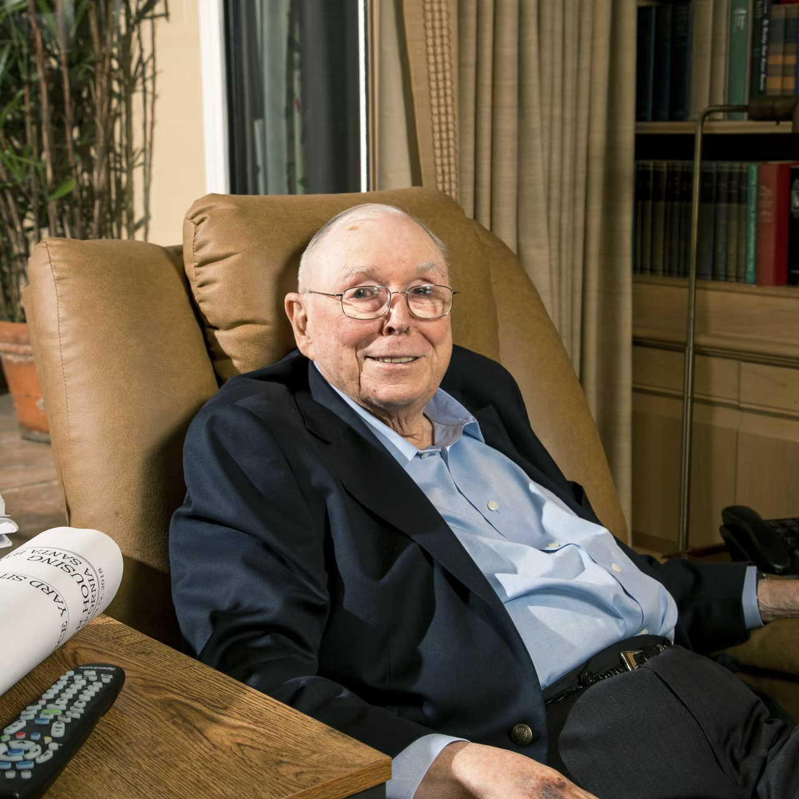

[2019 Charlie Munger, Unplugged.pdf]()

> 彦鑫：2019 年 4 月 23 日，查理·芒格在位于洛杉矶的家中，与《华尔街日报》记者妮可·弗里德曼和贾森·茨韦格共进晚餐，并进行了长达六小时的交流。他谈到了许多话题。以下是此次谈话以及之后一次电话访谈的整理版内容。
>
> 由于文章很长，分成两部分分享。

## **《查理·芒格，原汁原味的对话》**

> 发表于 2019 年 5 月 7 日，作者：布赖恩·兰吉斯
>
> 转载自《华尔街日报》
>
> 作者：贾森·茨韦格 和 妮可·弗里德曼

**第一部分**

#### **问：您怎么看待您和沃伦·巴菲特在全球范围内所吸引的“粉丝俱乐部”？**

**查理·芒格：** 嗯，这个世界确实很奇特。而喜欢我的这些人，大多是来自中国或印度的“书呆子”。他们对我们有一种非常深厚的情感依附。他们极其热衷于自我提升。有些人只是想通过某种简单的方式变得富有，但更多的人，**其实是在努力让自己变得更好。**

很多顶尖工程学院的毕业生都成了投资者。不过，我不会把那种用计算机科学去筛选海量数据、找出其中的相关性，然后基于这些相关性进行交易——如果有效就继续，没效就停手——的人称作投资者。实际上，那样的人应该被称作交易员。而且这些相关性本身就非常奇特……当然了，一旦越来越多的人开始交易同一个相关性，那它的效果就会大打折扣。

***

#### **问：如果您现在才开始做投资，您会采取怎样的方法？**

**查理·芒格：** 嗯，本杰明·格雷厄姆最初提出的那种投资方法——寻找那些你所得到的价值高于你所支付价格的机会——是正确的。**所有优秀的投资本质上，都是以较低的价格获得更高的价值。你只是换不同的地方去寻找**，就像渔夫可以选择在不同的水域捕鱼一样。但他永远都在寻找“花得少，收获多”的机会。这种方式永远不会过时。我的意思是，这就是投资的基本原则和根本逻辑。

有些人会从那些收益不断增长的股票中去找，有些人关注消费品，有些人研究破产案例，还有些人看重困境债券。投资的方式多种多样，就像捕鱼有很多种场所一样。这就是投资的本质。

在理解这一点的基础上，当然，其中一个关键的技巧就是知道该“在哪儿下网”。李录（来自西雅图的喜马拉雅资本管理公司）就用格雷厄姆的训练方法去寻找更深层次的价值，作为投资人赚得盆满钵满。但如果他不是在中国和韩国做这些事，他的业绩可能就没那么好了。他是在“鱼多”的地方钓鱼。那边有许多优秀、实力强大的公司，价格却非常便宜。

我给你举个例子。在韩国有个家伙，他“垄断”了调味酱市场。所谓垄断，就是他控制了韩国大约95%的调味酱。他完全无法容忍任何其他人卖酱。所以如果他愿意，他通过提价可以赚到两到三倍的钱。

李录看懂了这一点。那家公司叫“Ottogi”。当然我们从这笔投资中赚了20倍。在美国，没有类似的机会。

***

#### **问：经纪人和银行家应该如何获得报酬？**

**查理·芒格：&#x20;**&#x6211;认为销售人员确实有很强的激励机制。另一方面，如果你让一个靠佣金养家的男人去做销售，那他干出来的事情可能会非常糟糕。这也是为什么券商需要配备那么大的合规部门：没有这些人管着，销售人员为了维持生活、保住地位、付账单等等，到月底了，他可能会为了完成业绩，把任何狗屁不通的东西卖给一个盲人。

这真让人作呕。我已故的妻子有一位亲戚，是她母亲的表兄弟，他是一位盲人医生。他收养了两个孩子。失明之后，他靠着自己从医前当药剂师时辛勤工作攒下的积蓄生活。他工作非常刻苦，后来转行成为医生，靠多年积蓄维持生计。

结果，他那个收养的女儿的丈夫，也就是他“名义上的女婿”，是个该死的经纪人，硬是反复倒腾他的账户，直到把老人所有的钱都亏光了。那个医生是盲人啊！而他竟然如此对待自己的岳父！

他们就是觉得，只要自己有足够的“需求”，干这种事就可以被原谅。这种事到处都在发生。富国银行的事件就是另一个例子。你如果把激励机制搞得太过火，就会有太多人忍不住去越界。

富国银行的错误在于：当事情爆发后，他们只是开除了那些实施行为的人，几千人被裁掉，**却完全没有改变激励机制。**&#x8FD9;简直疯了。但这又是一个愚蠢官僚体系、一个自以为是的 CEO 所犯下的错。

***

#### **问：您希望谁来担任富国银行的新任 CEO？**

**查理·芒格：** 嗯，我本来希望由（即将离任的 CEO）蒂姆·斯隆继续担任。以富国银行的运作方式来看，他对各业务部门几乎没有任何控制权。

他根本没有做出那些决策的权力。而那些决策本身也并非出于恶意，只是非常愚蠢。他们根本没意识到激励机制太强烈，会导致员工行为失范。你看，经纪公司干的就是和富国银行一样的事，只不过他们有合规部门。所以富国银行把问题看作是“合规问题”。他们从来没想过，自己的激励制度本身可能就是个错误。

***

#### **问：但富国银行以前和之后也都有丑闻。**

**查理·芒格：** 当你制定了非常严苛的激励机制，每个人都被逼着去完成指标，那当然会出问题。他们现在正在废除所有那些激励计划，这本该一开始就做的。

***

#### **问：您和沃伦·巴菲特是否因为与富国银行关系太近，没能看清问题？您觉得自己应该承担一些责任吗？**

**查理·芒格：** 嗯，我不想逃避责任。\[但]如果一个 CEO 自大又愚蠢，而你站在我们的立场去批评他，那完全是徒劳无益的。那不会带来任何好处，也不会改变什么。更何况我们现在持有的股票已经有了巨大的收益，如果卖掉要交非常高的税。所以我们通常不会去插手——当初是科瓦切维奇在那里。他总是不停地说话，自以为是，不愿意听任何人的意见。\[编者注：富国银行前 CEO 理查德·科瓦切维奇拒绝对此置评。]

他后面的接班人也差不多，同样糟糕，只是没那么吵、没那么执着。\[编者注：科瓦切维奇的继任者约翰·斯坦普夫的律师代表其拒绝置评。] 而且没人真正解决过问题。所以我不记得我们有什么时候——我们确实在觉得有希望的情况下，会试图劝人别做某些事。

***

#### **问：也就是说富国银行根本不听劝？**

**查理·芒格：**  科瓦切维奇从来不听任何人说话，他只会讲。而后面的那位虽然不总是讲话，但他也完全没意识到激励机制太过强硬。他的问题是认知上的，而不是出于恶意。

这是个很有意思的问题。我个人认为，世界上遭受的许多伤害，其实更多是来自“认知偏差”而不是“恶意”。

***

#### **问：蒂姆·斯隆已经担任 CEO 超过两年。有批评者说他没有做出足够的努力来改变企业文化，或应对新的丑闻。**

**查理·芒格：**  嗯，我知道的比他们多。斯隆是个非常正派、非常好的人，也是个很出色的银行放贷人。而所有这些银行，基本都是利用政府信用来融资，所以它们普遍会做出一些愚蠢的贷款决定。而如果你有一个真正懂得放贷的人，那是最不该被踢掉的。所以我自己是会留下斯隆的，但没人问我意见。

***

#### **问：那现在会是谁接手这份工作呢？**

**查理·芒格：**  这是个非常有意思的问题。我希望能是个真正的银行家。

***

#### **问：巴菲特不是说，他希望新 CEO 不是来自华尔街吗？**

**查理·芒格：**  那正是“华尔街”。我完全同意不要来自华尔街的人。但我希望是个银行家。我们两个都希望是那种已经被证明是个好银行家的那类人。不是来自华尔街。我们不喜欢华尔街那一帮子做决策的人。他们就只想干简单的事、赚大钱。他们是金融工程师和搞销售的类型。

***

#### **问：除了您、沃伦·巴菲特和杰克·博格尔（先锋集团创始人、指数基金先驱），您认为还有谁能够在推动商业行为更高标准方面接替你们的位置？**

**查理·芒格：** 你得记住，博格尔之所以有影响，是因为他刚好在一个非常重要的问题上是对的。但那是他唯一的优势。他是个一根筋的人。这是一个很奇怪的性格特征。要让我选，我不会让博格尔来管理全局。他只是恰好在一个非常关键的问题上——也就是“降低投资成本的重要性”——非常正确，所以他非常有价值。

你这个问题要求很高。你把一个庞大的（企业）官僚体系放在那里，让工业运转起来，最终浮上高层的人是怎样的，我们都清楚。他们通常个子高，智商还不错但不是特别聪明，是那种会被选为兄弟会会长的类型。大概百分之八十的时间，浮上来的人就是这样。当然，这种机制并不完美。你是在期望一个既像哲学家，又能真正干活的领导人，这个要求太高了，这种人极其罕见。

有一点，大多数人都不理解——这是我一生的经验所得——我和沃伦得出的结论完全一致：在最高层管理位置上，你需要一种特定类型的头脑，这种头脑天生就能在投资和金钱问题上做出有逻辑的判断。**沃伦称之为“金钱感知力”或“金钱头脑”**。而我在长年累月中发现，这种能力要么你有，要么你没有。如果你没有，是无法后天培养出来的。这不是你可以通过教授来灌输的知识。**它就像一种天赋——你要么天生具备，要么没有。**

我们在伯克希尔的一个“秘诀”就是：我们会把权力交给那些拥有这种天赋的人。这几乎就像是遗传的一样，是种天赋，自动就能生成这种判断力。

一旦你意识到：有些人天生有这种本事，有些人没有——而且很多智商很高的人也未必有这种本事——你就明白，如果你只是想找“会正确思考”的人，靠招聪明人并不能解决问题，因为聪明人也常常会做出非常愚蠢的事情。

一旦你明白了这个道理——这是一个很重要的洞见——那么接下来的结论就是：如果你不是天才，但你恰好有这种判断力的“本能”，而你又能靠它避免生活中那些典型的愚蠢行为，只要你把常规思维问题“倒过来想”（反向思考），比如说：“我不去找最聪明的答案，我就去避免所有愚蠢的事”，而你在这一点上做得比别人都好——那你就会变得非常有力量。

***

#### **问：您的工作日是怎样的？**

**查理·芒格：**  从1965年我离开律师职业开始，我一直追求每天都能留出大量时间读书和思考。偶尔也和几个朋友聊聊这个那个。我这么做，并不是为了多赚点钱，而是因为我天性如此。我必须利用自己的天性去谋生——因为我需要养活一个大家庭。但本质上，这是我自身的性格使然。

沃伦也是一样。我们俩都讨厌一天排太多事情。我们每天都有大段空闲时间。从外人看来，我们的生活方式就像学者一样。

***

#### **问：我有点惊讶您居然还用电脑？**

**查理·芒格：**  那不是电脑！是一个放大器。我特地弄了这张桌子来放那个放大器，好让我视力退化之后还能读读报纸、看看东西。

***

#### **问：您一天中大概花多少时间在读书上？**

**查理·芒格：**  哦，非常多。我每天晚上都是读着书入睡的。我读得非常多，我很喜欢读书。

而且我很早就发现，一旦我掌握了阅读能力和基本的数学知识，我基本就不需要老师了。我几乎能靠阅读材料自己搞明白我想学的任何东西，因为老师讲得不是太快就是太慢，要么讲我已经知道的东西，要么是我根本不感兴趣的内容。所以，我当然更喜欢靠阅读去获取知识。

你看看安德鲁·卡内基、富兰克林，他们只受过几年的小学教育，全靠阅读自学成才。他们需要什么就学什么。这并不难。你想象一下，他们是在炉火旁学习的——没有灯，没有电，每天干完体力活之后还在自学。我们的祖先过得可真不容易。

***

#### **问：有没有哪些公司可以在与像亚马逊这样的竞争中建立起可持续的“护城河”？谁是真正不怕亚马逊的？**

**查理·芒格：**  我认为，**亚马逊更应该害怕的是好市多，而不是反过来。因为好市多的仓储模式更好，成本更低，而且公众完全相信它销售的商品一定是高品质、低价格。所以——他们就像一个沉睡的巨人**，虽然在配送体系方面起步较晚，但最终他们会变得更高效，而且他们已经更值得信赖。所以我会说，从所有数据来看，好市多根本不需要担心亚马逊。

***

#### **问：那伯克希尔怎么样？**

**查理·芒格：** ： 亚马逊是其他公司都应该担心的对象。我可没说伯克希尔，我说的是好市多。

***

#### **问：大型科技公司能否挺过政治上的“拆分”压力？**

**查理·芒格：**  我的答案是：能。我不认为当那种“变革的潮流”来临时，政客能挡得住。那就像逆流而行，根本无济于事，潮水太强大了。

我外祖父当年是做批发干货的。在美国，那行业曾经持续存在了至少二十五年，是经济体系中的一个固定部分。但当20世纪20年代连锁商店和西尔斯·罗巴克兴起时，全国所有的批发干货公司都破产了。可没人怀念它们！谁也挡不住这股潮流。就像没人能阻止互联网，它让我能用100美元就买到那张桌子。每个人都受到互联网的威胁，但它不会消失，也不该被消灭。这种潮流很重要。

对那些业务受到冲击的人来说，这是坏消息。但对整个世界来说，这是一件好事。要不然，我们都还在一起挖土豆呢。

***

#### **问：我们可以去客厅聊吗？**

**查理·芒格：**  我不喜欢。但我会照做——我是闷闷不乐，不是反抗。\[笑声。芒格在朋友彼得·考夫曼的帮助下站了起来。] 我现在走路很不稳，几乎走不了。

***

#### **问：您对建筑的兴趣并不仅仅是个业余爱好，对吧？**

**查理·芒格：**  对。建筑师们可不喜欢我。

***

#### **问：为什么？**

**查理·芒格：**  因为我总是照自己的方式来。这倒不是说我从建筑师那里得不到好点子，我当然能。但最终我想要的是控制权。

***

#### **问：您有学习过建筑的基本原理吗？**

**查理·芒格：**  当然。我一直有一个想法，我想这可能来自18世纪英国作家塞缪尔·约翰逊——“一个人能往西走，就能往东走。”也就是说，那些我不懂的东西，我总能想办法弄明白。当然，我不会把这种态度用在脑外科手术这类事上，但像是在一块地上规划一堆形状，这可不是火箭科学……

我必须得做一些能触动我兴趣点的事。这就像IBM的托马斯·沃森老先生说的那样：“我只在某些地方聪明，但我一直待在那些地方。”

***

#### **问：那您有没有读过任何关于建筑的书？**

**查理·芒格：**  没有，从来没有。我只是看了很多不同的做法，然后雇了一些做过我喜欢的项目的人。

***

#### **问：在建筑设计方面，您认为自己有哪些突破性的发现？**

**查理·芒格：** 这花了我好一阵子时间。说实话，我都不好意思告诉你我是多久才搞明白的……这也印证了那句德国老话：“我们变老得太早，变聪明太晚。”……我曾在加州大学圣塔芭芭拉分校为学生宿舍空间设计付出过大量努力。那是一个非常有趣的建筑难题。

***

#### **问：怎么个有趣法？**

**查理·芒格：** 他们的土地不够。当然了，在一个拥挤的地方，做任何事都不容易。所有大学在想要扩招时，基本就是“硬塞”。所以我做了设计，我跟你说，我至少花了一年半时间研究各种方案。

但唯一无法实现的，是让每个卧室少于两名学生入住，因为经济条件决定了这个限制。但我始终讨厌这个安排。因为每个学生都讨厌和别人共享自己的睡眠空间。

终于有一天，我还在做这个设计的时候，突然看到一个方法，能让每个学生拥有一个属于自己的小睡眠间。就在那一刻，我意识到：这才是正确的解决方案。之前我所有的想法，简直就是愚蠢透顶。而我为那些想法竟然花了一年半！

你说，有什么比把船上的建筑原则应用到陆地上更简单的吗？如果这种设计在船上能行得通，那在陆地上当然也行得通。一旦这么做，你就可以更高效地利用土地，获得巨大的经济优势，而且学生之间距离更近，有助于彼此之间的教育，因为他们可以互相学习。

我当年上密歇根大学的时候，整个该死的学校里，我除了兄弟会里的人，基本谁都不认识。这可真是个进入一所顶尖大学的愚蠢方式。那时候大家都这么做，确实挺傻的。而我到现在还在试图纠正这种愚蠢——要想办法把学生们以一种愉快、有建设性的方式组合在一起，让这帮“小可爱们”互相教育。

另一个让我震惊的发现是：在每所校园里，教室在非上课时间基本完全空着，这太愚蠢了。我意识到，那些用于上课或研讨会的空间，其实完全可以在课余时间拿来举办小型私密聚会或娱乐活动；而那些大教室，同样可以用于放映电影或举办音乐演出。

于是我决定，在学生住宿区里引入可以灵活变换用途的讲堂和教室空间，用于课余的娱乐或社交活动。

这其实是全世界最显而易见的想法。你想想这多合理。而除此之外的做法，都可以说是愚蠢至极。

但几百年来，在这个问题上，整个大西洋两岸的做法几乎都是愚蠢的。三百年了？我现在正在改变这一点。而且我很清楚自己是对的。

不过我并不是靠什么灵光一闪想到这些的。我花了很长时间去琢磨、去犯错、画图、重画图，一步一步搞出来的。

**我之所以比大多数人稍微成功一点，部分原因是我擅长推翻自己最钟爱的想法。**&#x6211;很早就知道，这是一个很有用的本事。多年来我不断磨练它，所以每当我能彻底否定掉一个自己长期投入过的大想法，我反而很高兴。大多数人可做不到这点。

***

#### **问：大多数人都讨厌这种事。**

**查理·芒格：** 是的。但我很清楚，这背后藏着巨大的力量和财富，所以我喜欢这样。更何况，这就是开悟。力量、财富与觉悟——这组合也不赖吧。

***

#### **问：为什么颠覆根深蒂固的观念这么难？**

**查理·芒格：** 这太荒唐了，我现在就在纠正很多荒唐事。但这就是我一贯的做法。我不会做什么复杂的事情，但我知道怎么避开荒唐的东西——即便它是“约定俗成”的。那就是我所擅长的全部。**我甚至不追求“聪明”，我只是尽量别犯傻**，完全不理会所谓的传统。

你应该让建筑去适应这个世界的现实状态和它正在演变的方向，而不是迎合过去的世界——这其实并不难，只是最基本的常识。但你必须摒弃一些愚蠢的老规矩。

有趣的问题是：当一切已经非常明显，而且像建筑这样高度专业化的行业都存在时，为什么人们还是集体犯傻？答案是：**理性是很难做到的**。人的大脑总是给自己使绊子，犯傻正是由此而来。想想你自己有多少次会说：“我他妈当时怎么会做出这种事？”

这就是“集体愚蠢”的体现。我讨厌“集体愚蠢”。**伯克希尔的做法，是尽量把关键决策权从那些不擅长思考的人手里拿出来，交到那些真正会思考的人手里。这就是我们的“秘诀”。**

我们跟\[已故UCLA传奇教练] 约翰·伍登（John Wooden）当年的篮球队一个思路——世界上最好的球队。**他用七个顶尖球员打全部比赛，其他人只是陪练、辅助训练。等他建立起这样的体系之后，他赢遍所有对手。我们也是一样。**&#x6BCF;个年轻人都想买证券，但我们不希望年轻人来买证券！我们要的是那种一开始就高于常人的人，而且还具备像沃伦那样的丰富经验。沃伦可不需要一群年轻人来帮他买证券，也不需要每个人来凑热闹。所以我们采用了伍登那套体系。它运转得更好。你看看我们的业绩，比那些有成千上万人互相开会讨论的机构好太多。

***

#### **问：您认为伯克希尔未来的回报会下降吗？**

**查理·芒格：**  嗯，我觉得这个问题就像是在担心变老和死亡一样。你当然不会喜欢，但这是必然的。当你管理的是成百上千亿的资金时，从百分比来看，投资回报当然会下降。我对此并不担心——我从一开始就预料到了，我知道迟早会发生这种事。你不可能一直维持那种高回报水平。用几百亿美元买进卖出证券，还想保有漂亮的业绩记录，几乎是不可能的。如果你还在乎税务问题，那就更难了。**随着管理资产规模不断增长，那些伟大的业绩最终都会收敛趋平。**

不过，目前为止，李录在喜马拉雅资本的投资记录，哪怕管理了大量资金，也跟他当年管理少量资金时一样出色。但这简直就是奇迹。这也不是巧合——李录是我唯一一次雇过的外部投资经理。所以我现在的“打击率”是1.000（满分）。我如果再试一次，我知道会发生什么——我的记录就会“跌到地狱里去了”。（笑）

我们未来赚的钱肯定比早期少。不光是因为钱太多不好操作，还有一个原因是：我们年轻时面对的是傻瓜对手，现在的竞争者个个都强，几乎把每一个角落、每一个小细分市场都盯得死死的。是的，现在难太多了，但这不是悲剧。换个角度看，如果事情不变难，反而显得不合理了。

\---未完待续

