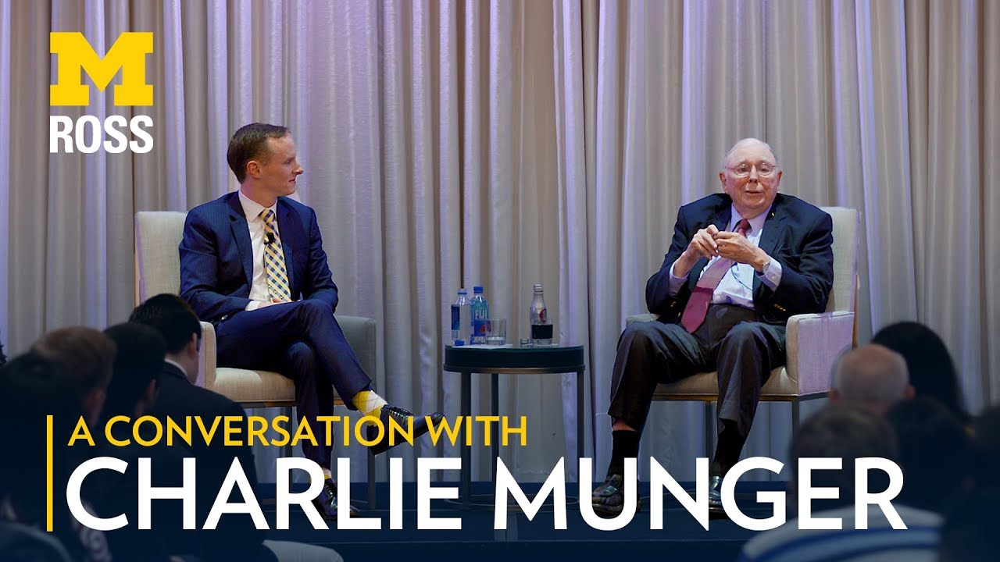

[Charlie Munger Talk at Ross University 2017 - Full Transcript.pdf]()

# 标题：《查理芒格：2017年密歇根大学罗斯商学院演讲》

2017年12月20日

### **查理·芒格在罗斯大学2017年演讲文字稿**

我们发现了一场非常精彩的2017年查理·芒格（Charlie Munger）在罗斯大学（Ross University）的演讲，觉得非常值得整理出完整的文字稿与大家分享。这次演讲涵盖了多个有趣的话题，包括：

* **芒格早年在大萧条时期的成长经历**

* **从法律行业向投资领域的转变**

* **他对比特币的看法**

我们希望您会觉得这次分享有价值。

### **查理·芒格与斯科特·德鲁的对话：**

***

> 对本杰明·富兰克林的敬意

**斯科特·德鲁（Scott DeRue）**：查理，今天早上我在飞机上思考和准备今晚的对话时，翻阅了一些笔记。我意识到，我们都很欣赏一位历史人物——本杰明·富兰克林（Ben Franklin）。

**查理·芒格（Charlie Munger）**：确实如此！

**斯科特·德鲁**：富兰克林曾说过，人生有两件值得做的事情：要么写些值得阅读的东西，要么做些值得书写的事情。而你两者都做到了。

**查理·芒格**：噢，但肯定不及富兰克林那样。

**斯科特·德鲁**：几个小时前，我在亚马逊的图书搜索栏中输入了你的名字“Charlie Munger”，结果显示有超过一百本关于你的书。

我最喜欢的书名是《查理·芒格之道》（*The Tao of Charlie Munger*），相当有趣。所以，我想今晚我们就以你的生活为切入点，探讨那些塑造你思维方式的时刻，以及你在人生中取得的成就。

我会问一些问题，希望之后还能有时间让现场的观众提问。到目前为止，提问中关于比特币的内容占了两次，这或许能让你感受到大家现在关心的事情（笑）。

不过，我想先从你的童年说起，你的家乡内布拉斯加州的奥马哈（Omaha）。你在奥马哈长大，能否谈谈在奥马哈成长的经历？有哪些让你难忘的瞬间或经历，对你今天的思维方式和人生产生了深远的影响？你能聊聊你在奥马哈的成长故事吗？

> **成长于奥马哈的经历**

**查理·芒格（Charlie Munger）**：

是的，我非常喜欢奥马哈。那是一个不算太大的地方，我认识很多人，不管他们是做什么的——不像在大城市里那样容易迷失。我非常幸运，有一对好的父母，还有他们那些优秀的朋友。而且，我在就读的公立学校按当时的标准来看也相当不错。

当然，我的大部分教育是在大萧条时期（Great Depression）完成的。我可能是少数还活着并对大萧条有深刻记忆的人之一。这对我来说非常有帮助。那个时期极端得令人难以想象——你们完全无法体会那种情景。

当时，几乎没有人有钱，甚至连富人都没钱。人们会上门乞讨一顿饭。而在我祖父家附近不远的地方，有一个“流浪者聚居区”（hobo jungle）。我被禁止走近那里，但我却经常偷偷溜进去。我在那片流浪者聚居区里，即便是在30年代经济最糟糕的时候，人们几乎饿死，我都比现在晚上在洛杉矶自己的社区里行走要安全。当时的犯罪率很低，这一点和今天的世界完全不同。

因此，我经历了一段非常独特的生活，从文明的不同阶段一路走过，包括经历了**六百年来英语世界最严重的经济衰退之一**。这真的是一次非凡的经历，能够亲眼目睹那种困境，以及后来经济是如何恢复的。而这种恢复要归功于第二次世界大战期间的“偶然凯恩斯主义”（accidental Keynesianism）。

希特勒通过“刻意的凯恩斯主义”（deliberate Keynesianism）解决了德国的大萧条问题，不过他的目的并不是为了刺激经济，而是为了向他仇恨的人报复。他借了大量的钱，建造了许多军备。到了1939年，希特勒的德国已经成为欧洲最强大的经济体，没有任何国家能够与之相比。

如果你没亲身经历过，你很难像我一样理解这些事情。我亲眼看着情况逐渐好转，一点一点地修复，然后问题就解决了。当然，那时候我的家庭里有很多人相信金本位和硬通货，还反对福利制度等等。从现代标准来看，他们有些落后。

但这种“落后”带有一种自力更生的品质，我认为这非常有帮助。我从不后悔自己没有在一个更“自由”的环境中成长。我有一位自由派的姨妈（严格来说是我母亲的表亲），她是芝加哥大学的第二位女性院长。她的博士论文研究的是煤矿工人的生存状况，因此她是一个彻头彻尾的左翼人士。如果我目睹了过去煤矿工人所经历的那种待遇，我可能也会是一个极端的左翼人士。

她每年都会寄一本左翼书籍给我作为圣诞礼物，但我一直觉得她有点疯。

*（笑声）*

这表明，有时那些极端而鲜明的证据会误导你。这是你一生都需要警惕的事情。

实际上，人生的全部诀窍就是确保自己的大脑不会误导自己。我发现，这是一场有趣的终身游戏。老实说，我无法记起有哪一刻我不是在努力做到这一点。我不是天才，但我对成人世界的兴趣很早就表现出来了。我一直想知道什么有效、什么无效，以及为什么。我能看出，那些我敬爱的人中有些人有些地方很“疯”。比如，我会说：“我很喜欢戴维斯医生，但他有点古怪，我可不想变得像他那样。”我很善于评判，而我认为这对我很有帮助。

而且，随着我学习到更多事实，我不断调整自己的判断。这种习惯对我来说非常有益。

> **家族背景的影响**

另一件对我帮助很大的事情是，特别是在我父亲这一边的家族，我的祖父是内布拉斯加州林肯市（州府）唯一的联邦法官。他在这个职位上待了很长时间，直到退休时，他可能是全国任职时间最长的联邦法官。

他是一个非常聪明的人，完全从一无所有中崛起。他的父母是两位贫困的教师，而他小时候在内布拉斯加的一个小镇长大。他们给他一枚五分钱硬币去买肉，而他只能去肉铺买那些没有人愿意吃的动物部位。那就是当时两位教师的生活条件。

这种生活的屈辱感深深困扰着他，于是他决心摆脱贫困，并且永不回头。他做到了。他像亚伯拉罕·林肯（Abe Lincoln）一样，自学成才，在律师事务所中接受教育。他曾因付不起学费而不得不离开大学，但因为他的自学能力和非凡的聪明才智，这对他来说并不是太大的阻碍。 他有一种非常极端的态度，我会说他的态度是：**你有道德责任让自己尽可能地摆脱无知和愚蠢。这几乎是他最高的道德义务**——当然，照顾家庭可能是第一位的。他是一个传统的宗教信徒，因此这对他来说或许也是一种宗教义务。但他真正相信**理性是一种道德责任**，并且为之努力。他蔑视那些不努力追求理性的人。 作为一名法官，他最初的态度是相当严厉的，比如“为什么有人会去抢火车”之类的联邦犯罪。在那些日子里，他对犯罪者非常严厉。但我注意到，随着他年龄的增长，他开始更容易认可一个人是“好人”。他比刚开始时对人们宽容了一些，我认为这是一个正确的变化。他仍然很严格，但他稍微放松了一些，这对我来说是恰当的。

> **家族的经济困境与应对**

到了大萧条时期，家庭中的成员面临许多挑战。例如，我的一位姑父是个音乐家，而在经济困难时期，音乐家根本无法谋生。我的祖父虽然自己没有太多钱，但仍然资助他上了药剂师学校，挑选了一个无法失败的职业。之后，祖父找到一家破产的药店，借钱给他买下这家药店。很快，我的姑父变得富有，并在接下来的岁月里始终保持了富足的生活。

我另一个叔叔在内布拉斯加州斯特罗姆斯堡（Stromsburg）的一家银行工作，而这个小镇只有968人，却有两家国家银行。他所在的银行资本化规模仅为25,000美元。当然，他是个可爱的人，但他是个乐观主义者——而**银行家不该是乐观主义者**。

*（笑声）*

1933年，当银行关闭时，银行审查员进来后表示，他的银行不能重新开业，而那是他唯一的生计！

祖父一直很节俭，总是存钱。他手中有许多优质的头等抵押贷款，借给了那些住在好街区的、戒酒的德国屠夫和他精心挑选的其他人。他从未经历过贷款违约。这些房子位于正确的街区，而借款人是勤奋且严谨的人。

于是，祖父拿出他三分之一的优质贷款，把它们投入银行，并将银行的所有不良资产剥离出去。他成功地拯救了他三个孩子中的两个家庭。我认为这是一个非常聪明且周全的举动。而且，令人印象深刻的是，

他在接下来的10到15年里，通过二战期间经济的复苏和资产的升值，他在二战期间从银行的那些“不良资产”中大部分收回了资金。这是一个很好的教训。

我的外祖父的另一边，他的主要生意在1922年破产了，和其他所有的批发干货公司一样。他的儿子也破产了，外祖父把他的房子一分为二，将那个家庭搬了进来。在另一个家庭里，有一个人是哈佛建筑学院的荣誉毕业生——他在20年代的奥马哈非常繁荣，过着很美好的生活。

然后到了30年代，奥马哈的建筑许可证总额有时只有25,000美元一个月，这些钱基本上都用来修炉子之类的事情。几乎没有任何工作——什么工作都没有，零。

他搬到了加利福尼亚，住了几年，最终让洛杉矶县雇用了这个伟大的哈佛建筑师，他每月的薪水扣除后只有108.08美元，工作内容是做绘图工作，但他们为了省钱，把他归类为洗衣工。他实际上能以25美元租房、自己做饭、开辆旧车。他一个月只需要109美元就能活下来。真是难以想象当时大家有多贫困。

然后发生了那位外祖父的转折，FHA（联邦住房管理局）来了，他们有一个竞争激烈的公务员考试。他是个非常聪明的人，当然考试成绩第一，这让他成为了洛杉矶FHA的首席建筑师，并在那里度过了余生。

我目睹了整个家族如何应对这些困难，我想说的是：听起来可能很糟糕，但他们并没有那么不快乐。人们可以很好地应对困境，因为你会习惯它。这是人类条件的一个美好之处。我的意思是，你到了我这个年纪，经历了许多可怕的事情，已经习惯了。

（笑声）

其实，年纪大了，最好的日子就是早上醒来，什么地方都不疼。

（笑声）

> **奥马哈的生活价值观**

所以，这就是我在奥马哈的经历。但那时候的背景是，所有这些人都受过教育，文明、慷慨和正直。很多人有着很好的幽默感。那是个相当不错的地方，我的记忆中周围都是非常优秀的人。我觉得整个背景都是特权的，我看待我的背景是绝对的特权，我为自己是奥马哈人而感到骄傲。我有时会用一句老话，“他们把男孩从奥马哈带走了，但他们永远带不走奥马哈的男孩”，因此那些老式的价值观——家庭至上；在别人需要帮助的时候要有能力伸出援手；有谨慎的判断力和责任感，做事要合情合理。这比任何事都重要，比财富更重要，比名利更重要。这是一种绝对的道德责任，因为我的那些聪明亲戚并没有因未能更高升职而遭受太大的痛苦。

> **从奥马哈到密歇根大学**

**斯科特·德鲁**：是的，我的意思是，这是20年代和30年代的事情，你所回忆的那些经历细节，以及它们如何塑造了你的经历……

**查理·芒格**：我试图给人们传达一些别人已经无法记得的事情。

**斯科特·德鲁**：我意思是，你是那些你所经历的人们的学生。所以你在内布拉斯加州的奥马哈长大，后来却到了密歇根州的安阿伯，这其中是怎么发生的？

**查理·芒格**：非常简单。我想去斯坦福。

（笑声）

我父亲对我说，查理（我是家里唯一的儿子，家里有两个姐妹），我还有两个女儿需要在你之后接受教育。我没有无限的钱，他说，如果你真的非常想去斯坦福，我会送你去。但我宁愿你选一个比我那所大学（内布拉斯加大学）更好的学校，而那显然就是密歇根大学。我能说什么呢，难道我会说“去你的，让我去斯坦福”？

（笑声）

其实，我没有这么说，我去了密歇根。

**斯科特·德鲁**：所以你来到密歇根……

**查理·芒格**：我从来不后悔这一点。30年代的人们去斯坦福时是带着一串马球马！那是一个非常高档的兄弟会姐妹会文化。我曾经称它为西部的“共学普林斯顿”。人们都喜欢它，等等，但你真的去斯坦福是带着一串马球马吗？我现在带给你们这些年轻人一个你们记不住的时代。你在大学里认识过谁是带着一串马球马来的？！

**斯科特·德鲁**：很少有人……

**查理·芒格**：对，他们会参加ROTC（预备军官训练团），但他们有自己的马球马。如果你有自己的马匹，你会赢得更多。

**斯科特·德鲁**：所以你来到密歇根，学习了数学一年。

**查理·芒格**：是的，但我并没有为此获得学分。年轻时，我可以在任何数学课上拿到A，根本不做任何作业。所以我总是选数学，因为它意味着我完全不需要做任何题目集。我只是做数学题，所以我不应该被当作什么数学天才。我选择了对我来说最简单的方式来思考我想做的事，而不是别人希望我做的事。

**斯科特·德鲁**：结果证明，这最终成了一个我认为回报颇丰的学科？

**查理·芒格**：没错！是的，但这会让你感兴趣，在如今这个充满算法、计算机科学和高深数学的世界里……

无论是沃伦还是我，从未在商业中使用过任何复杂的数学，贝恩·格雷厄姆（沃伦的老师）也没有。我的所有商业工作都可以用最简单的代数和几何学来完成，像加法、乘法之类的。我在整个一生中，从未为任何实际工作使用过微积分。我当时学微积分时非常得心应手。顺便提一句，既然从19岁以后我就再也没接触过微积分，现在我连符号都看不懂。但我认为，如果你真的掌握了基础的数学知识，它会非常有用，只有极少数人会需要用到微积分。

> **战争与职业选择的转折**

**斯科特·德鲁**：所以你在密歇根大学学习数学，之后战争来临了？

**查理·芒格**：是的。

**斯科特·德鲁**：你搬到加利福尼亚，开始学习气象学。

**查理·芒格**：嗯，那是因为我太笨，没做应该做的事。凭我那时的背景，我本应该参加海军ROTC（预备军官训练团），因为我讨厌步兵ROTC，我在高中时已经做过很多年，升到了二等军官……那是一个很低的军衔。

（笑声）

而且那时我身高大概只有五英尺二寸，我长得晚，所以在高中时，我并不是理想中的壮实军人。

**斯科特·德鲁**：那么，当你去了哈佛法学院，为什么选择法学呢？

**查理·芒格**：嗯，我的祖父和父亲都是律师，我知道自己不想做其他事情，这很简单。我不想做医生。我不想面对那些血腥、痛苦和重复的工作。

我知道自己不想在一个大组织的底层爬升。我是一个天生的反叛者，那样的环境对我来说行不通。我发现，大家告诉我，当我认为他们是傻瓜时，我不能在一个大组织中上升，所以我做不到。因此，我只能选择法学。我崇拜我的父亲和祖父，他们过得不错，所以我自然就走上了这条路。

我认为，现在很多人也因为这个原因上了法学院，这对于他们的兴趣和能力来说，是最不坏的选择。我猜现在人们去商学院……我想在这个房间里很多人也会去商学院，那对他们来说是最不坏的选择。我只能说，这对我来说是可行的，可能对你们也会有用，结果是不错的。

**斯科特·德鲁**：所以，你搬到加利福尼亚，实际开了一家律师事务所，并且做了一段时间的律师。

**查理·芒格**：我没有选择，几乎立刻就有了一大堆孩子。

（笑声）

我把自己推到了一个相当尴尬的境地。

**斯科特·德鲁**：是的，所以“零选择”的确是很有力量的，对吧？

**查理·芒格**：是的，当然。

> **从律师到投资的转型**

**斯科特·德鲁**：所以你做了律师，然后离开了你曾经帮助创办的律所，转向投资？

**查理·芒格**：嗯……这听起来好像很神奇。

（笑声）

其实，这件事很有趣。我的前13年做律师的收入大约是35万美元。那时，我有一大堆孩子，手头并没有资本。一开始我选择了另一个职业时，我有超过30万美元的流动资产，这足够支撑10年的生活费用。所以，我并不是一个勇敢的冒险家或值得钦佩的人。我只是一个小心翼翼的松鼠……储存了比我实际需要的更多的坚果，却不敢深挖我的坚果堆。

这并不算勇敢，而是我在尝试资本家职业的同时，依旧保留了一只脚在律师事务所里。但一旦资本家职业成功，我就打算把另一只脚也抬起来，因为我认识到，按照我当时的看法（我没预见到大公司后来出现的繁荣），我认为法律行业的潜力正在变得越来越难。我想要更多的独立性，而不是像律师那样依赖他人。我讨厌给别人开账单，向富人要钱。我觉得那不体面。我想要自己的钱，不是因为我喜欢安逸或者社会地位，而是为了独立。

> **创办惠勒、芒格公司与投资经历**

**斯科特·德鲁**：你创办了惠勒、芒格公司，这是一家投资公司。

**查理·芒格**：是的，我同时也做了五个房地产项目，这些事情并行了好几年。几年后，我积累了三四百万美元。

**斯科特·德鲁**：多年来，你的业绩是市场的2倍、3倍，那么，为什么后来你离开了惠勒、芒格公司，转而做现在的事业？

**查理·芒格**：那时我有三四百万美元，那对当时来说是很多钱。我也知道怎么很好地处理这笔钱。那时，我知道我不需要从其他投资者那里收取费用和提成。我发现，当你遇到像1974-75年那样的经济困境——那是自30年代以来最严重的一次——我并没有感到痛苦，因为我知道一切都会好起来。但这些东西的市场价格却下跌到了荒谬的程度。

我知道我的一些投资者正在遭受损失，因为他们急需用钱。当然，我有足够的受托责任基因，这让我感到非常痛苦。于是，我说，“就像我祖父曾经被问到，如何看待我姨妈与我叔叔离婚时，他说他感觉就像被切开了一个脓肿。”我的受托责任基因让我感到痛苦，于是我切开了那个脓肿，就用我自己的钱生活。没有费用，没有提成，没有工资。这在我知道一切都会好的情况下，感觉更像是个男人该做的事。

> **与沃伦·巴菲特的合作起源**

**斯科特·德鲁**：那么，你是在什么时候遇到沃伦·巴菲特的？

**查理·芒格**：1959年。

**斯科特·德鲁**：那么，伯克希尔·哈撒韦这个合作关系是怎么产生的？你们现在合作了二十多年。

**查理·芒格**：沃伦曾受到本·格雷厄姆的影响，学会了以低于其内在价值的价格购买资产，无论这些生意多么糟糕。你无法想象比新英格兰的纺织厂更糟糕的生意了。

纺织行业就像是凝结的电力，而新英格兰的电价比田纳西河谷的电价高出60%。所以，这个生意注定会倒闭。现在，沃伦应该知道不该投资这种注定失败的企业，但它便宜得令人难以置信。我们可以以一个大折扣从清算价值中买进。

所以他买了一大块，最终控制了这家公司。但是，这个生意注定要死，所以唯一的办法就是从这个衰退的纺织业务中榨取足够的资金，使得我们比买进时付出的更多，然后用这些资金去买其他东西。

这是一条非常间接的道路，我并不推荐你们走这条路。仅仅因为我们做了一些傻事，结果却成功了，并不意味着你们也得重复我们走过的路。当然，我们最终学会了不再购买这些廉价的“雪茄屁股”，也不再进行这些痛苦的清算，所以我们开始投资于更好的生意。

伯克希尔的成功之道，就是我们尝试去购买那些不需要总部太多管理才能运作的生意。

其他公司都认为他们在总部有大量的管理才能，这是很大的自负。如果一个生意本身很糟糕，但找到了一个优秀的经理人，而这个生意又口碑不佳，经理人的声誉却很好，那么，最终这家公司的声誉仍然是无法修复的。

你无法修复这些真的很糟糕的生意。你可以从它们的清算中榨取所有可得的资金，再去做其他的事，但大多数糟糕的生意是无法修复的。

**斯科特·德鲁**：但在那个时候，沃伦就是在做这些事情，那么，你是怎么说服他的呢？

**查理·芒格**：我帮了他一个忙。他买了一家位于内布拉斯加州小镇的风车公司！

沃伦当时对经营风车公司一无所知，他买下这家公司是因为它很便宜！他说，“你能做些什么，为什么不能帮我修理我的风车公司，谁能帮我呢？”我说，“我有一个人，正好适合你。”他是我以前在变压器业务中的一位老同事，是个会计师——我说，“他会修好你的风车公司。”

沃伦当时非常迫切，几乎当场就聘用了他。哈里第一天走进这个小镇，这里有大量的风车和相关设备。一个哨声响起，整个工厂停工15分钟。哈里问：“这是什么情况？”工作人员回答：“每当镇上有葬礼时，我们会吹响哨声，工厂停工15分钟。”哈里说：“那将是最后一次！”他就这么解决了问题，而且他还剔除了所有不必要的浪费。接着，他发现有些零部件是唯一供应商，于是他提高了这些零部件的价格。你可以看到，我们是多么具有商业天赋。

> **如何改变沃伦·巴菲特的投资策略**

**斯科特·德鲁**：那么，你是如何说服沃伦停止购买那些糟糕的“烂苹果”，开始投资更好的“好苹果”呢？

**查理·芒格**：沃伦给了我一些功劳，但他迟早会学到这一点。他在其他领域赚了很多钱，而且他是本·格雷厄姆的门徒。对于他来说，在赚钱的情况下，很难放弃这种做法。

但他终于看明白了，不能扩大那个业务。那种生意非常困难且令人不愉快，尤其是在裁员时。于是，我们把资金撤出，开始购买更好的生意，从那以后我们就一直这样做了。我们做生意不是像商学院毕业生那样做，而是像拥有证券投资组合的资本家那样思考：我们总是站在股东的角度看问题。

很多经营公司的人，往往更像职业经理人。相信我，如果你在职业生涯中，你在某种程度上必须像职业经理人那样思考，但也必须从公司主人的角度看待商业战略问题。我的建议是，你永远不想成为一个过于依赖职业生涯的人，以至于看不到作为主人的视角。

**斯科特·德鲁**：这就像是通用汽车当时的情况吗？他们有一群职业经理人，作为一个公司老板，他们本应该很早就意识到局面已经无望。

**查理·芒格**：是的，正是这种方式让他们的情况变得无望。那些经理人不考虑公司的长远利益，最终公司破产了。世界上最强大的公司也会破产。如果那些“杰出”的高管能像公司主人一样思考，他们就会知道这种情况是绝对无法挽救的。

> **人力资源的战略：从股东视角出发**

**斯科特·德鲁**：查理，你们在伯克希尔管理总部以及你们所收购的各个公司时，都是通过培养那些像股东一样思考的人才。那么，在收购一家公司或将人才引入现有公司时，你们是如何评估这些人才的，如何判断他们是否能够像股东一样思考？

**查理·芒格**：私募股权公司通常会收购一家公司，然后让创始人离开，再去找新的人才来经营。这种做法赚钱非常困难，我不喜欢。

我们通常是收购时就已经有了合适的人才。也许有某个人在公司里是二把手，我们将他提拔为一把手。但我想不出哪里是我们收购后还需要寻找合适人选来填补职位的，除了哈里·博特尔在登普斯特钢铁公司（Dempster Mills）时的情况。我们不做这种事。值得一提的是，很多时候我们收购后的员工仍然在公司里待得很久。沃伦常说，“我们不能教新狗老把戏。”

**斯科特·德鲁**：不能教老狗新把戏是什么意思？如果我们看今天的商业环境，大家都看到人才的流动和“新狗”的涌入，你们却采取了与之相反的做法，管理伯克希尔的方式有很大的不同。

**查理·芒格**：我们当然还是会雇佣一些年轻人进入业务，但伯克希尔的成功，很多来自于那些我们收购时已经在公司里的“老狗”。你难以想象这些人有多么出色。

关于“新狗”，有一个巨大的例外。我几乎不喜欢高管猎头公司，因为我觉得他们总是试图向你推销市场上最好的那批人，即使他们根本不怎么样，我不喜欢这种做法。但伯克希尔最值得的单笔开销，就是我们付给高管猎头公司，找到了阿吉特·贾恩来管理我们的小型保险业务。

他当时完全没有保险行业的经验，他是印度一所主要技术学院的荣誉毕业生——非常聪明。他加入后，建立了我们整个再保险业务，这是我们唯一一个从零开始创造的大型业务，阿吉特做了一切。当然，他每天晚上都会和沃伦讨论，像父子一样。

这是一个非常儒家风格的公司，这简直不可思议。所以，我们雇了一个高管猎头公司，找来了一个完全没有保险经验的印度人，他每天晚上与沃伦讨论，现在，他所建立的再保险业务是全球最大的一家。这是一个金矿，伯克希尔现在的净资产中，有至少600亿美元是阿吉特创造的，没有他，这些财富是不可能产生的。而且这个价值远不止600亿美元，除了这些液态资产外，整个业务的价值远远超过600亿美元。

> **关于比特币和加密货币的看法**

**斯科特·德鲁**：哇，查理，我接下来要问一些观众的问题，作为总结。大约一半的问题都关于比特币和加密货币。

**查理·芒格**：我可以很快回答这些问题。

【笑声】

我觉得思考这些东西简直是荒谬的。你知道，认为黄金有某种奇妙的价值储存功能是可以理解的，因为人类无法轻易创造更多黄金，它具有稀缺性，这是它的优势。

相信我，人类完全有能力创造更多比特币。那些告诉你不能这么做的人，他们的意思是，除非他们想这么做，否则他们不会这样做。这就是他们所谓的“不能做”的意思。当有足够的动机时，坏事会发生。比特币本质上是一种疯狂的泡沫，一个疯狂的想法，吸引人们进入这种“轻松财富”的概念，几乎不需要任何深刻的洞察或努力。你应该避免它，因为如果它有效，那对你也不好，因为你会再次尝试这样做。

【笑声】

这简直是完全疯狂的。而顺便说一句，我刚刚给你们提供了一条宝贵的人生经验：远离很多事情，它们根本不存在，比如骗子、疯狂的人、极度自负的人、充满怨恨和自怜的人、那些觉得自己是受害者的人——有很多事情注定不会对你有好处。弄清楚它们是什么，并像瘟疫一样避免它们。比特币就是其中之一。

【笑声】

如果你真的赚了钱，那就更糟了，因为你会再次去做！这完全是疯狂的，而且从这些不值得你关注的事物中简化生活非常容易。我甚至不想认识那些推销比特币的人，他们不是我喜欢的人。

**斯科特·德鲁**：所以，查理，我听到你的意思是，你不会投资比特币，是吗？

**查理·芒格**：我觉得这很公平。

> **对税收政策的看法**

**斯科特·德鲁**：那我转到另一个可能同样具有争议的话题，如果你最近读新闻的话，关于税收政策的讨论在加利福尼亚州以及全国范围内都很热烈。你怎么看待税收政策的最终走向？

**查理·芒格**：我认为我们会得到一项税收法案，我认为它会通过，最后会做出必要的调整来获得最后几票。

我并不觉得每年给年收入7万美元、且有很多孩子的人发2000美元有什么疯狂的。对我来说，这既是一个好的政治决策，可能也是一个好的政策。

我也不觉得降低C型公司的企业所得税有什么疯狂的。如果你看看世界上许多做得最好的地方，比如新加坡等等，很多地方都有这样的政策。它甚至可能带来良好的宏观经济效应。

很多在这方面大声疾呼的人，他们确信这种政策不会奏效——他们可能错了。它可能会非常奏效。它使公司的资本价值上涨，带来了由市场价值增加带来的财富效应。每个人都意识到这个效应，但有些人说它很小，也有些人说它会很大。而我可以告诉你们，他们共同的特点是：没有人知道。

它是否会奏效，并非完全不可想象，而且世界上这么多地方都在实施类似的税收政策取得了成功。民主党人在这个问题上非常激烈，但我认为他们错了，这可能实际上对他们有好处。所以，我不确定它会奏效——它可能不会，但它并非完全疯狂。

**斯科特·德鲁**：这让我想起了你曾经给我的一条建议，那就是：人们常常会有一种观点，问题在于当你有了这个观点时，你就开始确信自己是对的。

**查理·芒格**：完全正确！这简直是完全疯狂的。

**斯科特·德鲁**：我想你的观点是，我们确实需要有自己的观点……

**查理·芒格**：等一下，这里有个非常重要的主题，我一直在思考。你问我我的看法，我说实话，我并不完全知道它会如何运作。我也不认为其他人知道。我认为它会在某种程度上有效，但到底能有效到什么程度，我不知道。

现在，公平吗？从大体上来看，企业是由一大堆慈善基金和退休金计划所拥有的。整个世界正在朝着一个方向发展，就是让公司的商业利益支持那些日益增长的巨大退休金义务。

中国正在做的事情正是共和党人所做的。中国希望让中国的主要企业更多地由养老金计划拥有，并让股票表现得更好。我认为中国这么做一点都不疯狂，共和党人这么做也不疯狂。这可能会相当奏效。这不仅仅是一些邪恶的事情，某些人正在密谋它。这是两方的政策分歧，双方对对方充满了激烈的仇恨和轻蔑——他们是错的。

这是一个政策上的分歧，应该文明地对待。当我在电视上看到国会时，看到他们的仇恨程度——真的是非常严重，远超以往——我觉得这种仇恨是邪恶的。恨是错误的，这一直都是真理：愤怒来了，理智就走了；这是一条真理。那么，你愿意采取一个让你永远愤怒的政治立场吗？如果你愿意，那就欢迎来到痛苦的房子，顺便说一句，你的世俗成就也会很低。那如果你想要这样，那就去模仿你在电视上看到的那些人吧。

**斯科特·德鲁**：另一件事，也回到之前提到的，是职业主义心态与股东心态的区别。在政治中，我们也看到了职业主义心态的兴起，这影响了人们的行为，因为他们正在试图生存下去。

**查理·芒格**：不仅如此，他们还像“月亮教”（Moonies）那样产生集体思维，因为他们总是聚在一起，我们的政客也是如此。你想变疯吗？如果这就是你的人生抱负，那你就去做一个极端立场的政客吧——无论是支持哪一方，你的脑袋就会变成一颗卷心菜。你只有一个大脑，为什么要把它变成卷心菜呢？

> **技术的影响与经济理论的局限性**

**斯科特·德鲁**：查理，我这里有个问题，问你最兴奋的新技术是什么？

**查理·芒格**：嗯，我通常不会对某些事物过于兴奋。我认为技术的确改变了世界——这让我想起了另外一件事。

如果我问你，亚当·斯密的工作中最严重的错误是什么？亚当·斯密在市场、贸易的优势和劳动分工等方面是完全正确的，但他错过了一个重要的方面，那就是技术的持续进步将如何推动财富和生活水平的提高。在18世纪，斯密的生活方式与罗马帝国时期差距不大，他根本没有意识到这一点。但事实上，技术已经有了巨大的进步，只是他没能看到，他并不太关注技术方面的问题，这一点非常愚蠢。

现在我问你一个更难的问题：大卫·里卡多犯了什么错误？

我告诉你答案，大卫·里卡多完全正确地理解了贸易的第一阶后果，这不是一个显而易见的洞察，它是一个伟大的成就。但他没有考虑到第二阶后果。他的数学思维不够强，没能看到，假如一个国家的生活水平远远高于另一个国家会发生什么。就像亚当·斯密一样，他错过了关键问题。

比如在美国这样一个先进的国家，和另一个国家进行自由贸易，尽管这个国家人口众多，但他们的生活水平低，像中国一样，生活在贫困中，处于马尔萨斯陷阱。如果你突然进行自由贸易，里卡多证明了双方都会生活得更好——但那些吸纳了世界经济伟大力量的国家将会进步得更快。你可能每年增长2%，而他们每年增长12%，很快他们就会成为世界的另一大强国，而你则失去主导地位。那么，你真的更好吗？答案是否定的。里卡多从来没有考虑到这些事情，所以我现在告诉你这些，是为了纠正你对里卡多的理解。

> **技术与全球贸易的影响**

有一个有趣的问题是，如果你想理解里卡多的理论，就不能不考虑美国与中国的自由贸易问题，也不能不思考公地悲剧（Tragedy of the Commons）。

假设我们是世界上唯一的一个国家，除了中国之外，我们可以说：我们不与他们进行贸易，我们就让他们保持在那种农业贫困中……我们可能会做到这一点。但其他国家都会与中国进行贸易，他们仍然会崛起。我们没有办法通过停止与中国的贸易来阻止中国的崛起。

所以我们必须做出我们做的事情，一旦你这么做了，中国将成为一个比我们更强大的国家。我们两国会足够强大，以至于可以实现我们想做的几乎所有事情，所以我们必须与中国保持友好关系。

> **关于美国与中国的关系**

你可以想象我有多么不喜欢特朗普抱怨中国的问题。这简直是愚蠢的。这是一种强制性的友谊。如果你不这样做，那就是不理智的。为什么不想和全球最大的另一个大国保持亲密、友好的关系呢？

特别是当他们拥有大量的原子弹时，这完全是荒谬的。我们别无选择，只能这么做。而一旦这样做了，你就会看到，一定会有一些痛苦，尤其是那些与中国竞争的群体，他们的崛起带来了贫困的改变，和贸易等等。这是不可避免的，不是那些所谓“不爱穷人”的邪恶共和党的错——那完全是胡说八道。这只是发生了，而我们并没有那么多选择。

**斯科特·德鲁**：查理，在我们结束之前，今晚我们大约有250到300人参加这个活动，很多人正在展望自己的未来和职业生涯，他们面前还有许多的岁月。

**查理·芒格**：我真希望我能再活几十年。如果能买到更多的寿命，我愿意用一大笔钱交换。

**斯科特·德鲁**：回顾您的生活经历，您会给在场的每一位未来充满几十年人生的年轻人什么样的建议？

**查理·芒格**：嗯，有一些显而易见的建议。它们都是古老的智慧。婚姻是你做出的最重要的决定——而不是你的事业。它比任何事情对你产生的影响都要大，不论是好是坏。 本·富兰克林给出的关于婚姻的建议是最好的：婚前要睁大眼睛，婚后要半闭眼。

【笑声】

如果你每天早上都能起来，坚持不懈地做事，保持纪律，不断学习，最终事情往往会顺利地发展。我的建议是，不要把成为美国总统或亿万富翁作为你的志向，因为这种可能性太小了。最好把目标设得低一些。我当时并不打算变得富有，我只想变得独立，结果只是有些“超出预期”。

【笑声】

顺便说一下，虽然大家在鼓掌，但实际上，我的“超出预期”部分也是偶然的。你可以非常聪明、非常有纪律，并且非常值得拥有成功，但这个过程当中也有运气的成分。那些获得非凡成果的人，往往既有纪律和智慧，也有良好的品德，再加上一大把运气。世界为什么不能这样运作呢？所以，你不应该对那些不寻常的成就给予过多的赞誉。

我有一个朋友曾经说起他在兄弟会中的一位同学：“老乔治就像一只坐在池塘里的鸭子，当池塘的水位上涨时，他就自然升起了。”很多人恰好走进了合适的地方，事业就蒸蒸日上；然而，也有许多显赫的人，他们拥有很多优势，但却因为一个小小的缺陷或一点点坏运气，而一生困顿。但这也是生活有趣的地方——人们的命运总是充满变数。

**斯科特·德鲁**：查理，代表在场的每一个人，我要感谢您。正如我常说，作为一个教育机构，我们不仅要提供知识，更重要的是帮助大家获得智慧和判断力。我知道您的这些话不仅对我有启发，也对在场的每一个人都充满了智慧和启示。非常感谢您。

