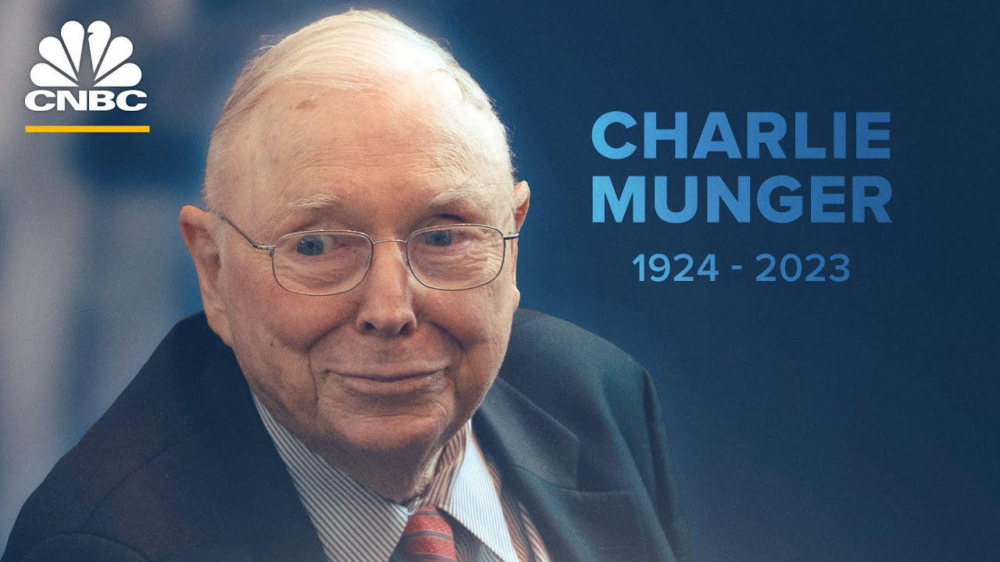

> 彦鑫：亿万富翁投资者查理·芒格于11月28日去世，享年99岁。在去世前两周，也即2023年11月14日，他在洛杉矶与CNBC的贝基·奎克进行了一场近两小时的专访。这次采访旨在纪念他即将迎来的百岁生日，回顾他卓越的一生和传奇的职业生涯。本期信件将继续分享这次珍贵访谈的内容。由于篇幅较长，将分为两部分呈现。

[2023-Charlie-Munger-s-Final-Interview-with-CNBC-s-Becky-Quick.pdf]()

### 查理芒格：2023年《最后的访谈CNBC》part 2

**采访者：**&#x6211;记得在2015年伯克希尔成立50周年的时候，你在致股东的信中写道，除了其他许多事情之外，你当时手上有600亿美元的现金。你当时认为那堆现金会随着时间的推移而减少，因为你会逐步买下更多的东西。而现在你们手头的现金已经接近1600亿美元了。那么，这是否意味着有机会进行一笔非常大的收购？你认为你们会看到这样的机会吗？

**查理·芒格：**&#x55EF;，当然，有机会进行比1600亿还要大得多的收购。我们现在有1600亿美元的现金，还有我们理应拥有的优质信用评级——谁还有这个？几乎没有人，是吧。

但是以后会发生什么，我也无法告诉你。不管它有多好，它不能是一个太小的交易。因为以我们现在的体量来看，我们太大了，小交易根本无法撬动大局。所以我们需要一个足够大的交易，才能用掉我们全部的现金以及一部分借款。

但试想一下，谁比一个手握1600亿美元、又有长期买便宜货经验的人，更可能找到这样的机会？我并不觉得没有希望。也许，这事最后得由其他人来完成。你知道，也许这一次我们不能仅仅是从旧柠檬里再榨出一点汁水。我们可能还能够榨出一些汁，但也许得榨新的柠檬了，也就是说，可能需要由新的人来做出这些决策。

但还有谁比那些在早期就全程参与过这个过程，了解其运作之好坏，并继承了1600亿美元现金资产的人，更适合来做这个决定？

**采访者：**&#x6240;以你指的是格雷格·阿贝尔（Greg Abel）、某个“G·Jane”，是吧，或者任何一个“Ted 和 Todd”，甚至是还未确定的人？

**查理·芒格：**&#x4F2F;克希尔展现出的主要技巧，是我称之为“伍登效应”的力量。伍登是整个时代最著名的篮球教练，你会搞清楚他到底是怎么做的，当然沃伦和我也了解这一点，我们会自然而然地这么做。他把大约90%的上场时间集中在七个球员身上，而其他人只是陪练。

这套系统之所以最终成为了赢得篮球比赛的绝佳方法，是因为你认出了你最优秀的球员，并把大量的上场时间集中在这个球员身上，更多的比赛经验带来的是更好的表现。你通过比赛所学到的东西，永远不是靠在练习场上投篮所能学到的。所以他把所有上场时间都集中在他最强的球员身上。这个想法很简单。伯克就是这么干的。当然，这方法后来变得更有效，也被大家学会了。

如果靠支持国际象棋选手来赚钱这条路更清晰一些，可能大家早就都选这条路了。但问题是，象棋比赛几乎赚不到钱，根本不足以养活人。我们都能意识到必须进入那前七名左右的顶级选手行列，否则就根本没有赢的机会，就像国际象棋比赛，是吧。每个人都会试图模仿伍登的方式来赢。但投资选股这件事，人们并不能仅靠上哈佛或哥大或其他学校就学会，当然，也不是所有人都能学会的。

这就像下象棋、机械技能，或其他某种天赋领域一样：只有那些经常练习、又具天赋的人，才能真正掌握它；只有在这方面投入很多、又有天赋的人，才能取得巨大成果。这就是投资世界的现实 —— 真正能赚到大钱的，往往是极少数的异类。

但现在我们也创造出了一大批被称作天才的人，他们经营着风险投资基金等等，而且看上去过得还不错，因为他们挣的钱确实很多。但他们实际上并没有真正获得那80%的成果——如果不是当初碰巧有机会接触红杉资本，很多人可能连涉足都不会。

所以他们只是碰巧在正确的时间闯入了红杉资本。他们在红杉还没有试图扩张的时候就进来了，然后从中获利，那是很罕见的。而现在情况完全不同了。

我不认为风险投资还会像红杉资本当年那样赢得未来。我也不认为红杉未来还能像过去那样赢得胜利。这太难了，太他妈难了。

这意味着什么呢？意味着世界上风险投资领域的失败率实在太高了。而且，现在很难像红杉那样持续那么长时间地取得成功。现在每个人都想模仿它们的方式来获取同样的成果。这就像你去和约翰·伍登的学生竞争。你可以模仿伍登的样子来打球，而你实际上却不是伍登，而你也不会得到他那样的成果，当然，结果也不会好看。

**采访者:&#x20;**&#x4F60;提到过，Burke 做的一些投资给你带来了一些快乐。我想到《华盛顿邮报》，谁不喜欢与极具魅力的人们一起享受极致成功的喜悦呢？那就是沃伦和我曾经拥有的。

**查理·芒格：**&#x54E6;，当然，那真的很有趣。Sequoia（红杉资本）里的很多人也玩得很开心，因为他们做了很多类似的事情。

**采访者:&#x20;**&#x4F60;在1995年的一次演讲中还提到过那是最好的投资之一，除了《华盛顿邮报》之外，还有哪些投资是你最喜欢的？我在想的是，比如比亚迪或者好市多。

**查理·芒格：**&#x597D;市多嘛，他们当然都是我喜欢的，但再次强调，比亚迪是一个很好的教训。

我不是找到比亚迪的那个人，是李录发现了比亚迪。他鼓励我，也鼓励自己去建立这个合作关系。他最终做了这笔投资——这是他早期投资生涯中的一次冒险。虽然我偶尔也会这么做，但我从不会告诉他该不该去做。

而他确实也去做了，还做了一两笔和 Sequoia（红杉）非常相似的交易。他投进去的时候，比亚迪实在太小了，哪怕是红杉在早期也不太会投那么小的公司。它虽然是上市公司，但实质上只是个壳公司，几乎算不上真正的公众公司。

他投进去了，而这家由王传福领导的小公司，我们那时候能看到两件事：

第一，他每周工作70小时；

第二，他是个天才。

当然，有一个拥有天赋的人，加上沃伦和我所缺乏的机械天赋，这样的想法对我来说特别有趣。所以我愿意拿出那些正在“摸索中”的钱，按较长周期的一部分，交给李录投资。

但接着，他来找我说：“哎，芒格，王传福想要收购一家中国的破产汽车工厂，然后开始做汽车。”

我说：“天啊，我的天哪，这是个糟糕透顶的主意。谁曾经在与那些老牌公司（像丰田、福特、奔驰等等）竞争的情况下，还能成功建立一家汽车公司？没人知道怎么做汽车，没人会让你抢到领先地位！”

我还说：“我们去劝劝王传福别干了。”于是我们确实去劝他放弃。他完全没理我们。

他坚持要这么做。

而现在呢，今年，他将会卖出200万辆汽车，并且在汽车利润方面赚得盆满钵满，李录的眼光简直太厉害了。真是令人垂涎欲滴的投资成果，李录干得太棒了。我和沃伦也分享了这个成果，我真是太高兴李录当时没有听从我们的劝阻。

**采访者：**&#x8C22;天谢地他当时没听你的劝。

**查理·芒格：**&#x4ED6;确实没听。这就是天才的行为。他们不会听劝。

他所取得的成就真的令人惊叹。当然，他很幸运，但所有的伟大成绩都部分来自努力，部分来自天赋，还有一部分是运气。这正是你所期望的成功之道。

在投资这个领域里，有这么多人参与，最终的大赢家当然是那些既有运气，又肯努力，还有天赋的人。我们就是那样的人。

伯克希尔历史上有趣的一点，是我们是如何把最初的3亿美元净资产变成30亿美元的。现在，有些人已经回过头去仔细核算了全部数字，也有人已经搞明白了这背后的原因。但实际上，正是我们在把这3亿美元迅速变成30亿美元的过程中所做的那些事，给了我们极大的推动力。

那是什么呢？我也说不上来，也许是蓝筹邮票（Blue Chip Stamps）、喜诗糖果（See’s Candy）、布法罗新闻（Buffalo News），还有 Ajit Jain 加入我们时开展的早期保险业务。

所有这些事情几乎同时生效，让我们从这些原本不那么出色的杂七杂八的生意中获得了惊人的利润。这真的是一件非常不寻常的事，而且其中确实包含了运气的成分。

**采访者：**&#x6C83;伦曾说，他做过的最糟糕的一笔交易是收购伯克希尔·哈撒韦本身，也就是那家纺织厂。

**查理·芒格：**&#x662F;的，当然。

**采访者：**&#x90A3;你自己做过的最糟糕的交易是什么？

**查理·芒格：**&#x6211;想，我做过的最糟糕的一笔交易，是为芒格家族买入阿里巴巴的一大笔股份，虽然这家公司本身还不错，但我认为它被过度炒作了，而且马云在与中国政府打交道时也犯了错误。我也有过糟糕的投资，每个人都会遇到糟糕的一天。最顶尖的网球选手有时上场也会表现失常。人们有时反而能从错误中学到的比从成功中更多。

**采访者：**&#x662F;的，是的，但那时候的情况真的是“惨败”。有时候一天就会很糟糕。

**查理·芒格：**&#x4E0D;要以那种方式生活——那种会让你在“倒霉的一天”就被击垮的生活方式，这意味着在投资方面要确保你不使用杠杆。有些人总是瞄准“全垒打”，但这就像棒球比赛里那个每一球都想挥棒打出全垒打的球员——真正伟大的击球手并不会每一球都出手。

而我们则恰恰相反，我们很擅长等待。我们只在遇到真正合适、把握十足的球时才会挥棒——这才是一个优秀选股者该有的做法。

**采访者：**&#x4F60;是怎么知道的？因为我知道你们一直在避免在某些情况下使用过多的杠杆。但你们其实……嗯，是的，但也并不是说你们一点也没用。

**查理·芒格：**&#x55EF;，保险浮存金确实给了我们一些杠杆。这就是我们为什么会使用它，对吧？总体来看，在我们的一生中，我们确实从保险浮存金中受益不少。这其中的区别在于，一方面我们不想在某些情况下用太多杠杆，但另一方面我们也知道，如果你觉得一个机会真的非常好，那就应该重仓出手，因为人生中你能遇到的“完美机会”也就那么几次。

我们现在不是在为了1999年那种繁荣而囤积现金，我们也许会有那种时机，但主角可能会换人——不过那也没关系。

**采访者：**&#x6211;觉得你给人们的人生建议中，有一些经验，比如你谈到现在做事情更难了。你说过，现在这一代人想买房子、想赚到一样的钱、想要出人头地，会比过去更难。

**查理·芒格**：当然了，现在要实现过去那一代捐赠基金经理在税后和通胀之后还能取得的收益率，会变得更难。他们教会了所有大学预期6%的年回报率，因为这是他们想要的，他们希望能以此来覆盖支出所需。但问题在于，6%的年化回报并不是注定会实现的。对一个时代的优秀投资者来说，如果回报率不到6%，那将会是个不小的挑战。

我的意思是，对于普通人来说，比如现在想着买房的年轻人，他们会觉得美国梦越来越遥不可及。对某些人来说确实如此，但对另一些人来说则未必。

过去从来没有哪家公司能给刚从计算机专业毕业的年轻人一份薪水、一个现金奖金和一堆便宜的股票。这些几乎是白送的，而且这些公司有些真的很优秀。如今，也有越来越多这样的公司给那些刚进入计算机行业的人提供这类福利。所以在某种意义上，对一些人来说生活变得更容易了。

在一个富裕的文明中，情况总是这样——有些人越来越好，有些人则差一点。而今天那些在计算机行业发迹的人，大多数站在了正确的位置，因此也就繁荣得更多。

**采访者：**&#x67E5;理，我们聊聊官僚主义吧。你曾指出过不论是大公司还是政府机构，官僚主义的问题都很严重。

**查理·芒格：**&#x6211;说过吧？

**采访者：**&#x5BF9;啊，那你会怎么改革这些臃肿的官僚机构呢？我们从政府开始谈起吧。

**查理·芒格：**&#x8FD9;种事对我来说属于“太难堆”里的事了。我也不知道该怎么做。这事太难了，因为你得先解决A问题：把问题搞清楚；再解决B问题：真正把它做成。而这两个问题都特别难，就像你决定要攀登珠穆朗玛峰的主峰，然后说，“我今天就要上去。”但你也知道，不可能当天就上得去，这可是要花好几天时间的。

**采访者：**&#x6700;近有一位总统候选人说，他的解决办法就是开除所有联邦政府中社会安全号以奇数结尾的员工。您觉得这是个好主意吗？

**查理·芒格：**&#x4E0D;，我不觉得。这太随意了。而且，可能你其实需要的是更彻底的改革，甚至可能根本永远都做不到……也许这就像“老龄化”一样，是我们永远无法摆脱的事情。

**采访者：**&#x4F46;您仍然相信政府存在的必要性，对吗？

**查理·芒格：**&#x5F53;然。如果你要深究，我就是那种热爱“文明进步”的人。这类事情会让我感到兴奋。

有意思的是，我名字的由来——我父亲的父亲，以及我父亲的母亲，也都完全相信这一点。他们带我去长老会教堂，去主日学学教义学道德。但是，当他们真的想教我一些他们觉得能“点燃内心”的东西时，他们教我的是——丹尼尔·笛福笔下《鲁滨逊漂流记》的传奇。他们就是那么崇拜这个人——一个孤岛上创建英格兰文明的家伙，而且他确实做到了。

他们想教给孙辈的，就是这个道理。我当时还小，但我真的被吸引了。我立刻就明白他们在教什么，也马上意识到他们是对的。的确，即使你被扔到一个荒岛上，只要有机会，你就会去创建一个文明。我接受了他们灌输的这些道德观念。他们从没明确说“我们要教你这些ABC”，但他们确实让我每天晚上都读《鲁滨逊漂流记》。我当时还只是个小男孩，但确实被这本书影响至深。直到现在，我依然遵循鲁滨逊的方式生活。

我模仿了鲁滨逊·克鲁索。我祖父的教育起了作用。这是一种很特别的孙辈教育方式。我是我们那一边家族的第一个孙子，所以我会去他家待上几周，有时是几周一连住下去。于是我一遍又一遍地接触到主日学教的东西，也一遍又一遍地接触到鲁滨逊·克鲁索的故事。可以说，我彻底吸收了丹尼尔·笛福的那一套教育理念。

而我母亲那边的祖先也很给力。我非常擅长向死人学习。这也是我认为每个人都应该学会的能力。

我还有一位祖父，在我出生前就已经去世，他是他所在小镇上最富有的人，有一幢极大的老宅，每年夏天都会邀请所有孙辈前来住下，想住多久就住多久。你可以想象，一个富有的老祖父把所有孙辈召集起来，是多么令人兴奋。他是小镇主银行的主要股东，而且还有一大票孙子孙女。他是个拓荒者，曾在东部的一家银行倒闭中赔光了钱，后来来到爱荷华州，最终在小镇上变成最富有的人。你能想象吗？在爱荷华一个山洞里养大孩子，住在草房里过冬天？

你能想象住在山洞里抚养几个小孩吗？这就是他婚后带给他妻子的生活起点。然后，他们从那样的困境出发，靠自己的能力获得了巨大的成功。在他那个年代，这样的成绩已经非常惊人。他常常谈起早年的经历，说自己在印第安战争中幸存下来，并以此为豪。

我祖母英格拉姆却不愿意跟孙辈谈论那些早年的困苦。她告诉我们不要在她面前谈起那些事。她不让人提“艰难的日子”，觉得那是“痛苦的记忆”。

但祖父英格拉姆却完全相反。他会滔滔不绝地讲述那些困难时期，讲他是如何克服重重困境，又如何教育孙辈们具备财政纪律感。他常说：“很多人觉得爱荷华是世界上最好的农田，我拥有很多这样的土地，这是开银行的好地方，我也确实拥有这家主银行。”

他回顾一生时觉得一切都“看起来还挺简单的”，但他想让我们知道——实际上那段日子非常艰难。

他说，他教孙辈的道理是：人生中真正的好机会寥寥无几，也许一辈子只有三四次。一旦机会来临，你必须毫不犹豫地抓住它。

他说：“拜托了孩子们，别以为一切机会都会自动来。不是这样的。”

他基本上是说：当你有十足把握的时候，就要“加杠杆”下注。但你要确定自己真的看准了，真的对了。而这个‘确定’的过程，本身就是困难所在。

你怎么知道你真的看准了呢？你不能经常那样做，一辈子也就那么几次。即使你是个“老查理”或“沃伦·巴菲特”，你也就那么几次“去柜台领票”的机会。

如果你从巴菲特人生中挑出最重要的10次买入决策，去掉那些，整套投资成绩就会一落千丈，毫无价值——我们很清楚，正是那少数几次下注成就了今天的伯克希尔。

我们最终并没有使用那么多杠杆。我们可以轻易承担那些额外的风险，而且如果回头看——以现在的眼光我们当然知道能成功，我们也确实错过了“翻倍”的机会。

但我们当年并不敢赌，因为有太多信任我们的人把钱交给我们，我们不想在年轻的时候，在人生早期“赔掉四分之三”的钱。

即便我们赔掉了四分之三，我们依然很富有，但那样的损失对每一个投资者来说都可能是毁灭性的。所以我们当时非常谨慎——没有任何“赌一把”的操作，我们也很高兴自己没有那么做。现在想来，如果我们用了一些杠杆，可能赚得更多，但我们还是庆幸当年没有。

**采访者：**&#x6700;近有人说，由于当下全球多个战争同时爆发，比如你看看以色列，看看乌克兰，再看看俄罗斯的局势，人们说我们现在可能正处于一个最糟糕的时代。如果你再看看中国，有人说它有可能接管世界、甚至毁灭人类文明。

**查理·芒格：**&#x6211;本人非常热爱生活，自然也不希望人类毁灭。我从祖父芒格和祖父金那里继承了一种基本态度——我一点也不想看到航空业被炸毁，因为要恢复它已经非常不容易了。当然了，我不想看到它被炸成废墟。

**采访者：**&#x4F60;现在会担心这些问题吗？

**查理·芒格：**&#x662F;的，我当然会担心。

但我不会花太多时间去担心这类事情，因为有些事我自己也解决不了。我通常会把这种问题归入我所谓的“太难处理”的档案夹，然后就不去多想了。所以我会说，核战争就是属于那个“太难”的档案。我确实认为，我们离那种风险已经比我希望的要近得多了

**采访者：**&#x67E5;理，沃伦·巴菲特曾说过，他能解决华盛顿的财政赤字问题，只需提出一个规定——如果国家赤字超过GDP的3%，那么国会议员就不得连任。你怎么看？

**查理·芒格：**&#x662F;的，这种事在一些陷入麻烦的地方确实干过，而且效果不错，尽管乍一看它根本无法执行。他的意思是，这事是可以做到的，虽然我无法告诉你具体要怎么干，但至少我们知道要创造合适的激励机制，事情才有可能成真。也许我们终将回到某种方式，那种方式更像亚当·斯密的经济逻辑——直接处理收入不平等的问题，而不是贫困问题。

**采访者：**&#x6211;的意思是，现在的“现代货币理论”已经被滥用到失控的程度，你对此担心吗？

**查理·芒格：**&#x5F53;然担心。现代货币理论原本是一种在战时才会出现的高债务理论，现在却成了应对经济底层家庭困境的常规手段。我不确定整个系统是否还能正常运转，毕竟一些家庭甚至无法维持在经济体系中的最底层。也许我们只能走这条路来维持文明的发展，而这可能是我们唯一的出路。

在这种情况下，我们就必须承担财政责任，不管那是否让人感觉良好，也不管它暂时是否有效，也许我们只能硬着头皮去做。这一天可能迟早会到来。

**采访者：**&#x6700;新的消息是，过去一年美国借贷成本大幅上升，利率上涨了87%，利率确实很高。

**查理·芒格：**&#x662F;啊，但他们之前把利率压得太低了。

**采访者：**&#x6211;是说，这些利率虽然高，但放在历史里也算不上离谱。

**查理·芒格：**&#x4ECE;经济的角度看，是的，比如在19世纪，英格兰的国债收益率大概在2%到2.5%左右，当时并没有丢失购买力。所以我们现在普遍认同“3%的通胀率是命中注定的”这一说法，其实我并不这么认为。

我不认为3%的通胀是注定的。我们也许最终会被迫做一些非常不愉快的事情。

这听起来很像当年中国人对俄罗斯农民说的：“去耕你自己的地，粮食不够是你自己的问题。”——这当时看起来像是一场苦难教育，但实际上却成了通往富裕的邀请。就像他们说的：“吃下这碗菠菜吧，对你有好处。”

**采访者：**&#x8FD9;就是资本主义的方式，而你也一直说：资本主义是最好的制度。

**查理·芒格：**&#x55EF;，这种方式是成立的，比如我喜欢你那个小纪念章，而你喜欢我的7美元手表带，我们就可以互相交换。我可能觉得你的小纪念章值X美元，而你觉得我的小手表带值7美元，我们可能会找个平衡来交易。但如果你的东西值1.1万美元，而我的值1000美元，我们还是会同意交换，因为这就是我们赋予它们的价值，而这种自愿交换对政府没有任何成本，GDP就增加了1000美元。

比如我在圣地亚哥，我愿意用我的手表和你换纪念章，只要我们双方愿意，就可以完成这个交换。除了资本主义，没有其他机制能自动做到这一点。你需要一个能创造稳定货币、提供中介交易媒介的体系。当你拥有这两个要素后，我们就可以用一种简单的方式进行交换，比如手表换纪念章，我们双方都愿意，事情就完成了。这是我们能做、也愿意做的事。

这也是像 Ron Fuller 这样的人曾经探索过的领域。MH 那时也对这类事情感兴趣，他试图让自己的工作变得更有意义，他努力去理解它。我能看出他为此在挣扎。这是经济学发展的早期阶段，当时学科的一些核心思想尚未被发现，在法学院也还没有普及。Lon Fer 是为数不多对经济与法律之间关系有模糊理解的人之一，而正是这种结合让我取得了现在的成就。

**采访者：**&#x4F60;曾经说过，公共政策的激励机制也必须设计得当，需要非常小心地思考。如果你想进入公共政策领域，就应该在行动之前仔细想一想最终会造成什么样的结果。

**查理·芒格：**&#x4E00;旦你进入了这个体系，你就必须处理“如何让生活中的苦难被更公平地分担”这个问题。你可以说要让它更公平，也可以说要更慷慨，嗯，这两种说法其实差不多。

他们希望减轻人们生活中的困难。这意味着其他人可以向政府出售物品，用于帮助不幸的人们。而每个人对政府的看法都不一样。有些人认为这是在“轻度作弊”，政府没问题，它就是个愚蠢的官僚体制。每个人都在想办法操纵政府，好让自己过得好一点。当然，我们可以“轻微作弊”，只要能活得好，就可以把对政府的欺骗合理化。而这种对政府的欺骗是如此极端。如果我能挥一挥魔杖，把所有这些制度中的欺诈都清除掉，我当然会这样做。

就拿工伤赔偿制度来说——如果你在工作中受伤，无法继续履行职责，这项制度应该给予你帮助，让你能继续养家糊口、生活下去。

政府最初就是为了这个目的而设立了强制性的工伤保险，因为有些人因为自己无法控制的事情受到严重打击，这让人觉得不公平。

但这个本来不错的制度，现在却充满了欺诈。他们夸大自己的伤情，只为了请假领钱，再夸大伤情领额外补助、永久伤残津贴，还有医生和律师配合他们做这些事——欺骗政府、欺骗不公平的父母们。

而为了纠正这些不公平，我们可能发现，在某些领域里，由于人性，我们不得不承受更多的艰难和不公。比如，有些富人就是想牢牢控制自己的财富，让普通人越来越穷。

但这并不奏效——他们的孩子终将“回归平均值”。

**采访者：**&#x770B;看洛克菲勒家族，1924年他们是世界上最富有的，而现在是埃隆·马斯克，这是系统中新一批成功的人。

**查理·芒格：**&#x6211;不认为马斯克是真正的“富有”，因为我不相信他所做的一切都真的能奏效。我承认他能力出众，但我不会投资他的公司。你可能很欣赏他的成果，但对我而言，那只是另一堂课：

马斯克的课题是：一个有着荒谬资金规模的人，如果不断“加倍下注”，那就会把自己带到灭绝边缘。他用的杠杆如此之大，一次又一次地“加倍下赌注”。这也许是两三倍于一般人所能承受的风险，换作别人，可能早就灭亡了。

他这么做过三次，也许还能做六次，我不知道。我把马斯克放在一个“我不会考虑”的档案夹里。我从未与他争执，但在我看来，他根本不存在。就算他活着，我也会像他没活过一样对待他。

**采访者：**&#x6211;们来聊一些文化方面的事情。我知道你曾说过阅读是唯一真正能让人变聪明的方式。你不认识哪个变聪明的人是不大量阅读的。

**查理·芒格：**&#x55EF;，是的，即使是世界上的虚构文学——包括大量的《圣经》、莎士比亚、伟大小说以及其他这些东西——人们擅长通过描绘画面、讲故事来传达信息。当人们通过一个故事来学习时，学习效果最好，故事看起来就像是活的。所以，这是有效的。

**采访者：**&#x4F60;现在在读什么书？

**查理·芒格：**&#x55EF;，现在我生活的状态是，大家都知道我对书很痴迷，有点像“查理年鉴”那种。所以他们会怎么做？他们会送我书，作为礼物。所以我家现在收到了大量这样的书。我现在不再自己买书了。我只从别人送给我的书中挑选，然后我还挺喜欢这么做的。我觉得他们好像也挺喜欢送我书的。这很古怪。

**采访者：**&#x6211;想我听说你最近一直在狂看《宋飞正传》，是吗？

**查理·芒格：**&#x55EF;，我现在终于看完了很多次重播的剧集。我不想看第三遍了，但我确实喜欢看那种一群以自我为中心的人不断做出错误决定的节目。这类内容对我有吸引力，虽然它本身很荒唐，甚至可以说是非常荒谬。节目中的人会通过幽默的方式来逃避焦虑和烦恼，顺便也借此解决一些问题。

**采访者：**&#x662F;的，那部剧什么也不讲。

**查理·芒格：**&#x662F;的，是那种所谓“什么都不讲”的剧，但其实并不是真的没内容。它讲的是如何用生活中的幽默，让生活变得更容易承受。人们在节目里互相开玩笑，实际上他们也在开观众的玩笑，逗乐我们所有人。

**采访者：**&#x8C08;到年龄问题，呃，现在很多公司都取消了强制退休年龄，董事会也取消了很多强制退休的规定。但现在也有个问题是，乔·拜登或唐纳德·特朗普是不是太老了，不适合在81岁或77岁时当总统？

**查理·芒格：**&#x55EF;，也许美国现在所有人当总统都太老了。也许总统这个职位真的太难做了，事情的发展方式也太复杂了。也许只是这一手牌太难打了，你不会允许玩下去。

**采访者：**&#x6211;不确定你是指年龄因素，还是成为总统的整个想法。

**查理·芒格：**&#x6211;说的是核战争，当然还有当总统本身的想法，如果你把一个国家搞得满目疮痍，这可不是什么有趣的差事。

所以这是我会说“把它放到我‘太难处理’的文件夹里”的事情，不值得花太多时间去担忧。甚至如果你给我全部的权力，我也无法解决它。如果你让我写下全世界的法律，我会坐下来，哪怕花上一整天努力去写。我会觉得：这是人类历史上最重要的事之一，因为太多愚蠢的法律会导致糟糕的后果。

而如果你知道哪些法律是这样的，或者你只是去废除那些你不喜欢的法律，再添加一些对人们真正有帮助的法律——我想，像沃伦（巴菲特）这样天生在这个议题上和我想法一致的人，他会很乐意为整个美国立法，而你也会一样乐意。

**采访者：**&#x662F;的，我觉得我有责任试一试。那么你觉得应该先废除哪一个，还是应该先设立哪一个？

**查理·芒格：**&#x6211;有各种各样想要废除的东西，因为欺诈实在太多了。有些职业完全就是骗局。有一整类职业应该被取消，比如脊椎指压治疗师这个行业。那就是一派胡言——它根本不是事实，根本没用。

如果你是某家医院的董事长，你应该见过不少院长试图去做事，但也无能为力；你也应该看到，现代医学并不真的认可这种东西。你不能用脊椎指压治疗师的执照开药，比如我是脊椎治疗师，我没法给贝琪你开青霉素，对吧？但如果我是医生我就能开。

我认为打击欺诈也是非常重要的。因为整个人类文明的一个重要步骤，就是把伪造货币视为重罪。而早期的立法者就真的这样做了，他们创造了一种伪造的货币——你假装是真的，他们就把你杀了。

这可能是人类文明一个非常好的规则：杀掉伪造者。

我敢保证，那些已经死了的伪造者不会再伪造了。他们不会再制造伪币。

现在在我们那些自由派文科学院里，有人觉得杀人太残忍了，因为这些人已经不能再做坏事了。但我认为有些人实在太恶劣了，死掉是他们最好的归宿，越快越好。

**采访者：**&#x6240;以你是想让死刑更普遍？

**查理·芒格：**&#x662F;的，在某些地方我可能希望少一点，在另一些地方我会希望多一点。最近有篇文章是关于俄勒冈州的，说的是他们将所有非法毒品的使用都“不再视为犯罪”了，而现在又在重新评估这一决定所带来的后果。

他们原本以为，只要为人们提供帮助、让他们能够戒毒，这就足够了。可现在他们发现，这些地方已经被毒品使用者占据，让人们的生活变得非常艰难。

你得看你遇到的是什么问题。那些伟大的统治者，比如李光耀和伦·富勒，就是那种会找出什么有效，然后去做的人。这就是他们的核心信条：找出什么有效，然后去做。

当然，从数学角度讲，你必须要找出什么行得通，什么不行，对吧？两者都要明确。你必须做到接近正确，因为人类只能做到这么接近了。

**采访者：**&#x4F60;给人们提的人生建议其实挺简单的，但如果真的照着去做，其实非常有用。我记得你的第一条建议是“不要有太高期待”。第二条是“保持幽默感”，第三条是“要被爱包围——身边要有朋友和家人”。

**查理·芒格：**&#x6CA1;错，确实是这样。

**采访者：**&#x4E0D;过我很难想象你什么时候对自己设定了很低的期待。

**查理·芒格：**&#x662F;的，我确实有。

**采访者：**&#x600E;么说？

**查理·芒格：**&#x8BA9;我给你举个例子。这个例子正好合适。

在我小时候，我的父亲，还有我母亲最好的朋友住在我们家两个街区外。他有两个儿子，我的年龄正好在他们两个之间。我比一个稍微大点，比另一个稍微小一点。

小埃迪·戴维斯算是个机械天才。他能把任何东西拆开再装好，完全对齐。他还一直在读书，整天都在读书。他是个书呆子类型的小天才，机械能力很强。

而他的父亲，大埃迪·戴维斯，是内布拉斯加大学数学教授的儿子，那时候他家里很穷，家人很多，他赚的钱根本不够养家。他不得不想尽办法应付，比如他会自己用油布做雨衣来省钱——没人会这么干，连30年代都没人这么干，但他就是这么做的。他是个极有天赋的人，写了数学教材，思维和动手能力都超强。

他能在三维空间中“看见”事物，他能做任何事。所以当时很明显，任何需要机械技能的事情，我都比不上这两位戴维斯。我清楚地知道：我不可能凭努力或增加工作时间超过他们，哪怕我拼命工作，也不会成为像他们那样的“钓鱼高手”。

所以我决定要远离那些我会和像小戴维斯、大戴维斯这种人竞争的行业。

**采访者：**&#x4E86;解自己的能力圈。

**查理·芒格：**&#x4E86;解你的能力边界——这让我完全避开了那些行业。

**采访者：**&#x4F46;我觉得你人生建议的一部分是：要明白变化会伴随人生而来，你必须适应它。我自己常常这么想。大家都知道，如果我当初更聪明一点、更快一点，我本可以做得更好。你这一生做什么都很成功，那你有没有想过，有什么是你想做却没做的？

**查理·芒格：**&#x662F;的，我确实会想，我差点因为自己不够聪明，或者不够努力，而错过了什么。

**采访者：**&#x5982;果可以回到过去重新来一次，你会做什么改变？

**查理·芒格：**&#x4F60;会选择回到过去，回到你知道将要发生什么的时刻，对吧？如果那样，我现在可能是地球上最富有的人。

**采访者：**&#x90A3;你到底错过了什么？是某件事你晚开始了？

**查理·芒格：**&#x6211;本可以早点开始投资复利，我也可以做得更好，我就能更早开始复利，而且我会复利得更久、更好。结果当然就是会更富有。我打算活到100岁，而我也经常提醒自己，其实我搞砸了，虽然我手里的牌不算差，但我本可以做得更好，轻松做得更好。

**采访者：**&#x4F46;你并不是那种在自己身上花很多钱的人。我们现在坐在一栋漂亮的房子里，但这是你住了70年的房子。

**查理·芒格：**&#x662F;的，我知道沃伦在他家也住了60年。我们很像。而且你看，我们都足够聪明，能够看到我们那些致富的朋友建造了非常豪华的房子，我想说，几乎在所有情况下，那些人并没有因此更快乐，反而更不快乐。

**采访者：**&#x4E3A;什么？

**查理·芒格：**&#x62E5;有最基本的东西真的能帮到你，但拥有一个可以同时招待100人的豪宅是件代价非常高昂的事，而且它并不会真正让你变得更快乐。

**采访者：**&#x6211;记得你多年来一直说的一件事，至少我是听别人说的，那就是：困难的不是变富，而是保持清醒。

**查理·芒格：**&#x5BF9;，当然了。大多数人都会以某种方式变得有点疯狂。你得避免它们，反过来思考，想清楚哪些地方你不该去。

我认识的所有人，还有我朋友认识的所有人，都从来不碰酒精。他们觉得那太危险了，根本不会靠近，连试都不试。你知道，我在“特雷尔深处”（Deep Trel，可能是误读或地名）确实认识过不少非常优秀的人，他们曾在那里生活了很长时间，后来也散落到各行各业。随着我年纪渐长，也遇到了各种类型的人。我注意到，那些从很早开始就走上正轨的人，几乎都有一个共同点——他们从小没有遭遇严重的父亲问题。

**采访者：**&#x662F;指？

**查理·芒格：**&#x4ED6;们全都抽了很多烟。

**采访者：**&#x54E6;哦，

**查理·芒格：**&#x6240;以我很早就能看出来会有那样的结果。这挺有意思的，我当时试着学抽烟，好让我像高中里那些“酷孩子”一样。我试图毁掉自己的人生，但烟味让我反胃，所以我心想，“这到底是什么鬼东西？”是别人把我哄骗进了一个糟糕透顶的事情里。

**采访者：**&#x4F60;现在偶尔还会喝点酒，对吧？

**查理·芒格：**&#x662F;的，我偶尔会喝一点酒。但其实我并不怎么喝。年轻的时候尝过几次，但我身边有不少亲戚是酗酒或接近酗酒的人，这让我对酒精一直很警惕。我非常小心地对待喝酒这件事。虽然偶尔我也会喝醉、呕吐，但正是这种呕吐感让我远离了酒精。你知道，大家都想知道我的秘诀是什么。

**采访者：**&#x79D8;诀到底是什么？你是怎么做到的？

**查理·芒格：**&#x6211;不知道所谓的秘诀。我只是避免了所有标准的失败方式。我的人生目标就是——避免所有标准的失败路径。如果你教我用错误的方式玩扑克，我会避免它；如果你教我用错误的方法做事，我也会避免。

当然，我也吃得很克制，因为我非常谨慎。

**采访者：**&#x4F46;是，你会做你喜欢的事，比如你会吃太妃糖，或者喝可乐。

**查理·芒格：**&#x6211;也喝可乐，没错，我知道有人说那会缩短寿命，但我一点也不在乎，就算最后一周躺在床上，我也不在乎。那时候人已经没有意识了，那部分人生我本来就不想要。

你看，现在有那么多亿万富翁，尤其是硅谷那些人，他们拼命想延长寿命，做各种疯狂的尝试，结果却发现自己得了帕金森病。当然了，我母亲和妹妹都死于帕金森病，我对这种病非常了解。这是一种非常可怕的病，不光是对患者本人，对身边的人也一样。

也许我喝可乐真的帮我避开了帕金森病最后阶段的折磨，谁知道呢？

而且现在还有一些更疯狂的做法，比如通过给自己输年轻人的血液来延长生命，还有什么硅谷的生物科技……这都太疯狂了。你得记住，我父亲小时候，医学这门行业其实充满了江湖骗子。人们只是想尽力做点事来帮病人，但其实很多做法都毫无意义。

如果有人问我最好的生活方式是什么，我的回答就是：避开那些疯狂的事情。避开那些会拖垮你人生的东西。

疯狂比你想象得更常见，你很容易就会陷进去。所以避开它，避开它，避开它。

**采访者：**&#x6211;记得你说过一句话：一个人无论本性如何，财富和年龄只会让他愈发显露本色。

**查理·芒格：**&#x662F;的，没错。

**采访者：**&#x4F60;已经捐出了很多钱。

**查理·芒格：**&#x662F;的，但不像沃伦那样。芒格家族的一半以上财富已经传给了后代。而我，我基本上做了相反的事情——虽然我这边的钱本来就少一些，但我做出了完全相反的决定，我们把大部分的钱都捐出去了。他的大部分财富则是捐给了波士顿大学的基金会，这些基金还能继续运作上百年。那也不能完全说是“捐出去”，也不能说是“浪费掉”，从某种意义上来说，那算是一种安排吧。

**采访者：**&#x90A3;你还有什么还没完成的愿望吗？

**查理·芒格：**&#x55EF;，这是个有趣的问题。我现在又老又虚弱，已经完全比不上我96岁时的状态了，我再也不想去钓一条200磅重的金枪鱼了。那实在是太辛苦了，要花太多体力……所以我不钓。我年轻的时候要是能钓到一条，我愿意付出一切。但现在就算机会来了，我也不会去了。我不会再追那些东西了。

人随着时间会慢慢放弃很多事情。

**采访者：**&#x4F60;还是挺活跃的嘛，你的社交行程满满的，在 Zoom 上有早餐有午餐的聚会。

**查理·芒格：**&#x6211;喜欢现在这个状态。对我来说，这就是理想的晚年生活。我并没有刻意安排它，它只是发生了，而当它发生时，我也接受了它。

我确实非常擅长识别不公平的优势，而我也在年老的时候得到了这些不公平优势。而当这些机会到来时，我一下子就抓住了，“砰砰砰”地拿下它们。

我唯一一次错过的机会，是太晚结第三次婚了。为什么？因为实在太晚了。有些人出于需要才结婚，而对他们来说更舒适的婚姻状态其实在他们视野之外。他们并不知道自己真正需要的是什么。

对于这些人，我推荐“百岁婚恋App”，你会发现如果你上线了，会有数百位百岁老人等着你。他们都还在那等着。

**采访者：**&#x4F60;和南希的婚姻呢？就是你的第二任妻子。

**查理·芒格：**&#x662F;的，是段很棒的婚姻，56年，也就是52年的婚姻。是的，这段婚姻很长，她活到了86岁，这是很长的寿命。当然，她晚年的确也有一段很艰难的时期，但大多数人生都会经历一些难关，她的难关是在生命最后才遇到的。

**采访者：**&#x67E5;理，说真的，很多人可能觉得你非常富有，拥有那么多机会和资源，但其实你的人生也有不少挣扎。

**查理·芒格：**&#x5F53;然，人人都会挣扎。生活的铁律就是——人人都挣扎。

我经常回想起那些最艰难的时刻，以及我是怎么度过的。我们都知道如何挺过那些阶段，那是现实主义哲学带给我们的东西。对我而言，生活就是“坚持到底”。

如果你能坚持住，就几乎没有什么不能度过的事，而你唯一需要的，就是不放弃。

你无法让死者复活，你无法拯救垂死的孩子，有些事情你就是无能为力。

你必须咬紧牙关，坚持挺过来。你甚至可以在街头痛哭几小时，这也是“坚持”的一部分。你可以痛哭流涕，但你不能放弃。你痛哭的时候，也得走下去。你可以哭，但你不能放弃。

**采访者：**&#x4F60;的人生中是否经历过这样的时刻？

**查理·芒格：**&#x5F53;然有。我第一个孩子去世时，我整天都在哭，但我知道我改变不了命运。那时候，儿童白血病的致死率是100%。这是命运。而现在已经不一样了，现在治愈率达到了90%以上，这是令人惊叹的进步。我能亲眼见证白血病治愈率的提升，对我来说是巨大的安慰。

人类做到了这一点，人类文明做到了这一点——挺过那些艰难的年代。那时候，我的表兄弟汤米死于脑膜炎，我的儿子泰迪也死于白血病。现在能基本治愈这个病，是了不起的成就。你也能理解我为什么热爱“文明”。对我来说，文明就是人类过去两个世纪做成的那些伟大的事情，而这是值得我们为之欢呼的。

**采访者：**&#x67E5;理，沃伦告诉我很多年前你说过，每个人应该按照自己希望的方式来写自己的讣告，然后照那个方式去生活。

**查理·芒格：**&#x662F;的。

**采访者：**&#x6211;猜你也为自己做过同样的事情。

**查理·芒格：**&#x6211;也是。我已经按照我想要的方式写好了我的讣告。如果人们愿意关注，那很好；如果他们不愿意，那也无妨。我那时候已经死了，哪怕真有差别，也与我无关。

不过我确实觉得这是个好主意。你看，沃伦和我几十年都住在同一所房子里。我们的朋友们越来越富，住的房子越来越好、越来越大、越来越豪华，我们当然也能住得起那些房子，而且我们家里孩子也多，住大房子也算合理，但我依然选择不过那样的生活。

我不想活得像个“威尔彻公爵”（注：形容纸醉金迷的贵族），我就是不想。我的生活是我有意选择的。

**采访者：**&#x4E3A;什么？

**查理·芒格：**&#x6211;觉得那样的生活对孩子们不好。

**采访者：**&#x8FD9;会把他们宠坏。

**查理·芒格：**&#x6CA1;错，在一个富裕家庭里，人们往往会认为，自己的责任就是要把钱花得体面、奢华一些。

**采访者**：你30岁时写下的那份“讣告版本”，今天你还会写一模一样的讣告吗？

**查理·芒格：**&#x5F53;然。我基本相信“坚持到底”的生活方式。人生会有很多艰难时刻，你得咬牙挺过去，这就是“坚持到底”。同时，人生中也只有少数几次机会会出现——你必须学会在它们出现的时候认出来，别在机会真正到来时却犹豫不决、错失良机。这些，其实都是很简单的道理。

（全）
