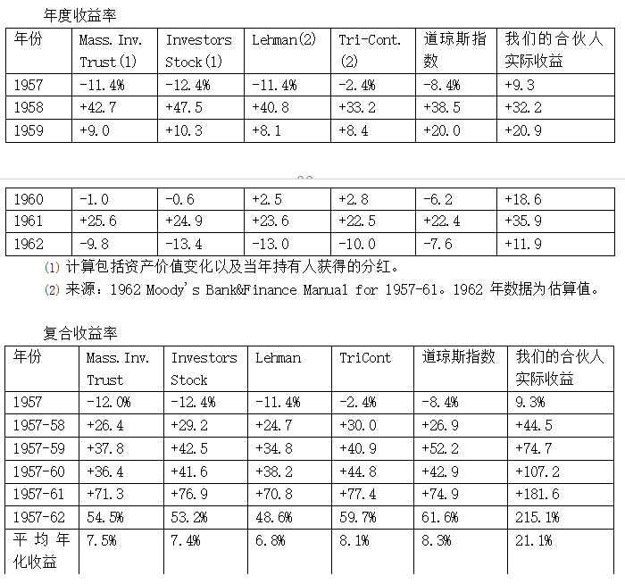
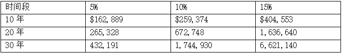
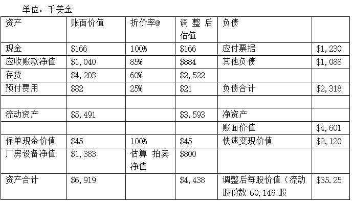
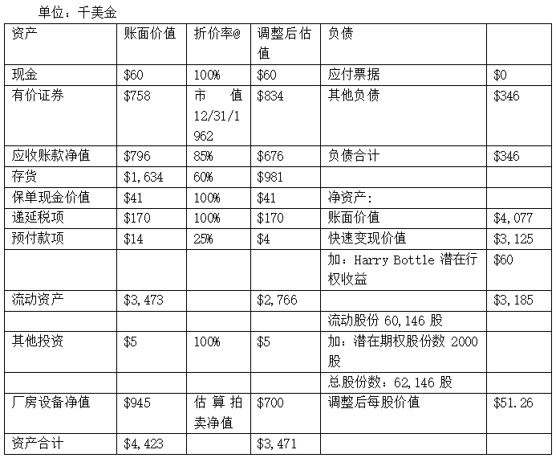

# 巴菲特致合伙人的信1962

**1962年7月6日信**

BUFFETT PARTNERSHIP,LTD.810 KIEWIT PLAZA OMAHA 31,NEBRASKA

1962年7月6日

回顾和提醒：

在写于1962年1月24日的1961年信中，有一段讲了我的“一个预测”。我不想残忍地折磨读者，但一字不差地把这部分搬过来，非常有必要：

> 一个预测
>
>
>
> 老读者（我王婆卖瓜，自卖自夸了）可能很奇怪，我怎么一反常态开始预测了呢？我一直都不预测，现在我一般也不预测。我肯定不会预测明后年宏观经济或股市行情会怎么样，我根本不知道。
>
>
>
> 我认为今后十年，有几年大盘肯定会涨20%到25%，有几年大盘肯定会跌20%到25%，其余年份则在二者之间。至于哪年涨、哪年跌，我完全不知道，长期投资者也不关心某一年的涨跌。
>
>
>
> 长期来看，算上股息和市值增长，道指的年复合收益率可能在5%到7%之间。虽然这几年道指涨得很多，但如果你期望道指的年复合收益率高于5%到7%，道指很可能让你失望。
>
>
>
> 我们的工作是年复一年的超越道指，集小胜为大胜，不特别在意某一年的绝对收益率是正是负。与我们和指数都上涨20%的年份相比，我认为，在指数下跌30%而我们下跌15%的年份，我们的表现更出色。我和合伙人强调这一点的时候，能看得出来，他们有的深信不疑，有的将信将疑。你一定要完全理解我为什么这么想，不但要在脑子里认同，而且要在心底里认同。
>
>
>
> 在讲我们的投资方法时，我已经说过了，与道指相比，我们表现最好的年份可能出现在下跌或平盘的市场中。因此，我们取得的相对收益可能时高时低，相差很大。有些年份，我们肯定会落后道指。如果长期来看，我们能平均每年战胜道指10个百分点，我对我们的业绩就很满意了。
>
>
>
> 某一年市场下跌35%或40%（今后十年里某一年出现这种情况的概率很大，但谁都不知道是哪年），我们应该只下跌15%或20%；某一年道指平盘，我们应该上涨10%；某一年道指上涨超过20%，我们很难跟上。长期来看，只要我们能有上述表现，如果道指的年化复合收益率在5%到7%之间，我们的业绩应该是每年15%到17%。
>
>
>
> 你可能觉得我的预测不对，等到1965年或1970年时回头来看，我的预测可能就是不对，甚至是完全错的。我还是要说出我的真实想法，我觉得应该让合伙人知道，但是投资这行就是这样，预期总是很可能出错。单独某一年，波动幅度可能很大。1961年波动就很大，幸运的是波动是向上的。但不可能年年如此！

> 1962年上半年：

从1961年末到1962年6月30日，道指从731.14下跌到561.28，期间股息约为11个点，投资道指的整体收益率为亏损21.7%。附录A列出了合伙基金成立以来道指每年的收益率，喜欢研究数字的可以看一下。

如上所述，道指下跌的时候，正是我们显身手的时候，我们可以在此时与道指拉开差距，多赢几个百分点。等到市场上涨的时候，只要能跟上，最后我们就能取得非常令人满意的长期收益率。我们的目标是道指每跌1%，我们只跌0.5%。这样的表现能说明，与任何其他投资股票的途径相比，我们做的都是非常保守的。

附录B列出了合伙基金前几年的业绩。自成立以来，1962年上半年是合伙基金业绩最好的一段时期，道指整体下跌21.7%，而我们分成之前的收益率是负7.5%。1962年下半年，如果市场继续下跌，我们这14.2个百分点的领先优势可能扩大；如果市场好转，则可能缩小。我嘱咐大家很多遍了，六个月或一年的业绩，别看得太重。用短期表现衡量表现，只能放大偶然的业绩波动。虽说机缘巧合，上半年我们的表现异常出色，但相对表现较差的时候，我们一定会有。我们持有登普斯特风车制造公司(Dempster Mill Manufacturing Company)的控股权益。这部分控股权益的估值，在计算业绩时我们没调整，但最近几个月已经有了进展，我们可能会实现更高的价值。

> 基金公司上半年的表现：

我们在往年的信里多次强调，我们相信，作为衡量投资业绩标准的道指不是那么容易战胜的。只要资金是投资股票，无论是什么形式，基金公司、投资顾问、银行信托还是自己打理，我们认为，绝大部分人的业绩也就是和道指不相上下。那些业绩偏离道指的，大幅跑输的多，大幅跑赢的少。

为此，我们一直都拿最大的两只开放式股票型基金和最大的两只封闭式股票型基金的业绩，与道指和合伙基金的收益率做对比。从附录C中这四家基金公司五年的业绩可以看出来，它们的收益率和道指非常接近。它们管理的资产规模合计约35亿美元。

为了让大家尽快看到这封信，我们邮寄出去的时候两家封闭式基金的业绩还没出来。两只开放式基金的业绩都不如道指，Massachusetts Investors Trust亏损23%，Investors Stock Fund亏损25.4%。这个现象很正常。1962年6月13日，《华尔街日报》在头版刊发了一篇文章“基金vs.市场”(Funds vs.Market)。文章研究了17只股票基金，从道指734点起到撰文时止，它们全军覆没，都输给了道指，差别就是输多输少而已。

上半年，最受伤的是所谓的“成长”基金，它们比道指跌得惨多了，几乎无一幸免。前几年业绩最好的三只“成长”（这里真该用引号）基金，Fidelity Capital Fund、Putnam Growth Fund和Wellington Equity Fund，上半年平均下跌32.3%。说句公道话，这些成长基金在1959-61年业绩亮丽，到现在为止，它们的总业绩还是比指数高，将来也可能领先指数。

令人匪夷所思的是，许多人被这几只基金前几年傲人的业绩吸引，争先恐后地买入，正好赶上了今年的业绩大跌，那些能享受到前几年优异业绩的人肯定是少数。这恰好证明了我的观点：评判投资业绩必须看经过一个牛熊周期的长期表现。股市总有牛熊，和六个月前相比，可能大家现在更能明白这个道理。

之所以列出基金公司的业绩，不是因为我们的投资方法和它们的一样，也不是因为我们投资的股票和它们一样，而是因为它们代表了管理200亿美元证券的高薪职业基金经理人的打击率(batting average)。我认为，它们的表现也能代表管理更大资产规模的投资机构。如果合伙人没选择我们的合伙基金，很多合伙人选择的就是类似的投资管理方式。

> 资产价值：

上述业绩计算未扣除总合伙人的分成和每月向合伙人支付的利息。若按市值计算的合伙基金整体收益率未达到6%以上（亏损将在下一年度抵减），总合伙人没有分成。因此，在本年度前六个月，没有提现的合伙人市值权益减少7.5%，按照年利率6%提现的合伙人市值权益减少10.5%。如果本年业绩低于6%（除非道指大涨，否则很可能），1962年12月31日，获得每月利息的合伙人的市值权益会减少。按照新市值权益，明年以6%的利率每月支付的利息同样会相应减少。假如我们今年整体亏损7%，一位获得每月利息的合伙人1962年1月1日拥有市值权益100,000美元，1962年12月31日，他的权益则是87,000美元。权益下降是因为亏损7%减少7,000美元，再扣除每月500美元，全年6,000美元的利息。1963年1月1日，新的市场权益为87,000美元，明年每月的利息就是435美元。

以上计算完全不适用于1962年收到的预先存入资金，因为这部分资金只是获得6%的利息，不参与盈亏。

沃伦·E巴菲特谨上

1962年7月6日

(1)1957-61年的数据包含全年管理的所有有限合伙人综合业绩，已扣除营业费用，未扣除有限合伙人和总合伙人分成。

(2)1957-61年的数据在前一列合伙基金业绩基础上计算，按照当前合伙协议扣除总合伙人分成。

附录C

两个最大的开放基金和两个最大的封闭基金的业绩表现。

***

**1962年11月1日信**

BUFFETT PARTNERSHIP,LTD.810 KIEWIT PLAZA OMAHA 31,NEBRASKA

1962年11月1日

各位合伙人：

我们一年一度的文书工作又开始了。（下面讲和合同确认，以及要求有限合伙人选择是否提现或投资等，省略。）

…………

读到这里，我该向各位报告一下我们从年初到现在的投资情况了。从年初到10月31日，将股息计算在内，道指整体下跌16.8%。我们持有登普斯特风车制造公司(Dempster Mill Manufacturing Company)的控股权益。本年末，我们打算仍使用去年末的方法对这部分控股权益估值。在计算时，我使用不同的折价率对资产负债表中的各个项目估值，得出短期内清算可实现的价值。在去年的计算中，我将存货打6折，应收账款打8.5折，再加上固定资产拍卖估算价，得到的估值是每股35美元左右。

1962年，我们已成功将登普斯特的大量资产按原价变现，这是今年工作中的亮点。例如，去年的存货账面价值是420万美元，折价后252万美元，今年末存货账面价值可能是160万美元，库存减少92万美元。我将在1962年信中详细介绍这笔投资的进展。现在看来，按照去年同样的折价率，登普斯特年末的估值应该至少有每股50美元。我们的资产变现工作做得如何？或许只要看现金和负债的变化就很明了了。1961年11月30日（登普斯特财年年末），我们拥有16.6万美元的现金，231.5万美元的负债。预计今年末，我们会有相当于100万美元的现金和投资（投资风格与合伙基金一致）和25万美元的负债。我们看好1963年登普斯特的前景，明年将加快扩大登普斯特的投资组合。

按登普斯特每股50美元的估值，截止到10月31日（不计算支付给合伙人的利息），合伙基金的收益率是5.5%。如果能将跑赢道指22.3个百分点的这个成绩保持到年末，这将是我们成立以来取得的最大领先优势。在这22.3个百分点的中，登普斯特的估值增加贡献了40%，投资组合中的其他部分贡献了60%。

无论是老合伙人，还是新加入的，我希望大家都清楚地认识到，上述业绩纯属异常的极少数情况。我们能取得这个业绩，主要是因为在道指下跌时，我们将大部分资金投入到了控制类和套利类中。如果道指1962年是大幅上涨，我们的相对业绩会很差。到现在为止，我们1962年的业绩优异，这不是因为我能猜出市场的涨跌（我从来不猜），只是因为当时低估类价格太高，我没的选择，只能加大其他类型的仓位配置。要是后来道指继续飙升，我们现在就只能仰视道指了。我们肯定会有跟不上指数的时候，我们已经做好了充分的心理准备。我相信从长期来看，我们不可能落后道指，否则我早就低头认输买指数了。

我就不多说了，只是希望大家别以为我们能一直保持过去几年的业绩记录，我们将来不会领先道指这么多。

每封信的最后，我都会说，各位合伙人如果有疑问，请随时找我。这封信也一样，有不清楚的就问我。我们有了秘书，买了新打字机，希望大家都能对信中的内容一清二楚。

沃伦E.巴菲特谨上

***

**1962年12月24日信**

BUFFETT PARTNERSHIP,LTD.810 KIEWIT PLAZA OMAHA 31,NEBRASKA 1962年12月24日

尊敬的各位有限合伙人：

下列税收信息非常重要。如果你亲自报税，请务必读懂下列内容。如果你请别人代为报税，请转达以下用于报税的信息。

(1)在报税时，合伙人不必申报本年度从合伙基金收到的股息。

(2)1月20日之前，我或我们的审计会将所有需要缴纳联邦所得税的项目寄给各位。我们会告知各位如何申报。在此之前，请勿报税。

(3) 内布拉斯加州居民无需将合伙基金权益申报为个人财产税。合伙基金直接支付个人财产税，各位合伙人无需支付。

(4) 如果来自合伙基金的潜在收益（按市值计算持有权益的15%或20%）占你总收入的比重很大，比较稳妥的做法是，按照你1962年实际纳税金额填写1963年的各季度估算金额。这样可以避免因估算额过低而受罚。你要为自己能从合伙基金所得收益的季度估算负责。如果你对今年的估算和去年实际支付税款相同，就不会因为估算额过低而受罚。

如有任何疑问，请告诉我。1月份，你会收到我们寄出的下列文件：

(1) 毕马威会计师事务所出具的审计报告。

(2) 上文所说的税务数据。

(3) 将增资和提现计算在内，你的合伙基金权益于1月初的市值对账单。

(4) 我特立独行的年度信。

上一封信写于11月1日，此后股市大涨，我们相对道指的领先优势有所减少。截止目前，道指的整体收益率约为-8.5%。我们的整体收益率大概是11.5%。扣除总合伙人分成和有限合伙人的利息，有限合伙人的收益率约为10%。如果年末仍然保持这一水平，与年初相比，以每月0.5%获得利息的合伙人的资本将增值4%左右。

上述数据仅为估算，一切都要到12月31日才能最终确定。如对本信内容有任何疑问，请在12月31日前写信或当面联系我。

沃伦·E巴菲特谨上

***

**1963年1月18日信**

BUFFETT PARTNERSHIP,LTD.810 KIEWIT PLAZA OMAHA 31,NEBRASKA

1963年1月18日

> 基本原则

有几个合伙人向我坦白（是该坦白），说我的年度信太长了，他们都读不完。我好像确实一年比一年啰嗦，于是我决定在第一页就把最重要的基本原则列出来。所有人都应该把这些原则完全看明白。大多数合伙人可能觉得没必要一再重复，但我还是要这么做。我宁愿10位合伙人里有9位略感厌倦，也不愿剩下的1位对基本原则存在误解。

1.合伙基金绝对不向合伙人做任何收益率保证。按照每月0.5%利率提现的合伙人就是在提取自己的现金。如果我们的长期收益率高于每年6%，合伙人的盈利金额会大于提现金额，合伙人的本金会增加。如果我们收益率达不到6%，则每月的利息部分是或全部是本金的返还。

2.对于获得利息的合伙人而言，某一年我们的业绩没达到6%以上，下一年他们得到的利息会减少。

3.我们在讲每年的收益或亏损时，说的都是市值变化，也就是年末与年初相比，按市值计算的资产变化。报税时使用的是实现的损益，在任何一年中，我们所说的合伙基金的年度收益与应税所得额基本无关。

4.我们做的好坏与否，不能用我们某一年的盈亏衡量。衡量我们表现的标准是投资股票的普遍业绩，即与道指和大型基金对比。只要我们的业绩比标准高，无论我们盈亏，我们都认为这一年做得很好。如果我们低于标准，我应该受到责备。

5.我认为评价表现应该看五年，至少要看三年，低于三年的业绩没有意义。我们的合伙基金肯定有落后道指的年份，甚至是远远落后。除非处于投机炽热的疯牛市，如果三年或三年以上，我们表现不如道指，我们都应该把钱拿出来，另寻门路。

6.我不做预测股市涨跌或经济波动的事。如果你觉得我能预测出来，或者认为不预测就做不了投资，合伙基金不适合你。

7.我无法向合伙人承诺业绩。我能做出承诺并保证做到的是：

a.我们选择投资的依据是价值高低，不是流行与否。

b.我们在每一笔投资中都追求极大的安全边际并分散投资，力图将永久性资本损失（不是短期账面亏损）的风险降到绝对最小值。

c.我的妻子、子女和我把我们的所有净资产都投在合伙基金里。

> 1962年业绩

我一直告诉合伙人我的这个期望：道指下跌的年份，我们要大显身手；道指上涨的年份，无论涨多少，我们都可能羞得脸红。1962年符合我的预期。

由于市场在最后几个月大涨，按照道指涨跌幅来看，大盘的下跌幅度没有很多人想的那么恐怖。道指年初731点，六月份下探到535点，但年终收于652点。道指1960年的收盘价是616点，虽然过去几年上蹿下跳，从整体来看，股市投资者又回到了1959或1960年附近。1961年持有道指的投资者市值下跌79.04点或10.8%。去年，还有人在炒那些股价在天上的股票，我猜他们里面应该有人后悔还不如买指数。持有道指的投资者还得到了大约23.30点的股息，加上股息，去年道指的整体收益率是下跌7.6%。我们的整体业绩是上涨13.9%。下面是道指收益率、Buffett Partnership,Ltd总合伙人分成前合伙基金收益率、我全年管理的有限合伙人的收益率、以及合伙基金早年收益率的逐年对比情况。

(1)1957-61年的数据是之前全年管理的所有有限合伙人账户的综合业绩，其中扣除了经营费用，未计算有限合伙人利息和总合伙人分成。

(2)1957-61年的数据按前一列合伙基金收益率计算得出，按照当前合伙协议，扣除了总合伙人分成。

下表显示的是三者的累计收益率或复合收益率以及平均年化复合收益率：

累积收益率：

我有个不科学的观点，我认为，投资的长期收益率能超越道指10个百分点就顶天了，所以请各位读者自行在心里调整上述某些数字。

有的合伙人担心我们的规模会影响业绩。我在去年的年度信中讲过这个问题。当时我的结论是：有的投资类型，规模大有帮助，有的投资类型，规模大是拖累，此消彼长，规模不会影响我们的业绩。

我说了，如果我的看法变了，我会告诉大家。从1957年初到1962年初，有限合伙基金的总资产从303,726美元增长到7,178,500美元。我们的资产一直在增加，尽管如此，到目前为止，我们相对道指的优势并没有减少的迹象。

> 基金公司的业绩

除了与道指对比，我们通常还会列出两家最大的开放式股票型基金和两家最大的分散型封闭式投资公司的业绩。Massachusetts Investors Trust、Investors Stock Fund、Tri-Continental Corp.和Lehman Corp.这四家公司管理着30多亿美元的资金，基金行业管理的总资产是200亿美元，这四家公司应该能代表大多数的基金公司。银行信托部门和投资咨询机构管理的资产总规模更大，我认为它们的业绩也和这四家基金公司不相上下。

我想用下面的表格说明，作为衡量投资业绩的指数，道指不是那么容易战胜的。上述四家基金由能力出众的经理人管理，它们每年收取的管理费是700万美元左右，整个基金行业收取的管理费数额就更庞大了。我们可以看看这些高薪人才的打击率(batting average)，他们的业绩和道指相比略逊一筹。我在这里绝不是要批评别人。基金经理在机构的条条框框内要管理几十亿上百亿的资金，根本不可能取得更高的平均业绩。基金经理的贡献不在于更高的收益率。我们的投资组合和投资方法都与上述基金差别很大。对于我们的大多数合伙人来说，如果不把资金投到我们的合伙账户中，其他的选择可能就是基金等投资公司，获得与基金类似的收益率，因此，我认为与基金对比来检验我们的业绩很有意义。

> 复利的喜悦

据说西班牙的伊莎贝拉女王(Isabella)最初投资了30,000美元给哥伦布。人们认为女王的这笔风险投资做得相当成功。不考虑发现新大陆的成就感，必须指出的是，即使“逆权侵占”(squatters rights)最后成立了，这笔投资也没那么了不起。粗略计算，30,000美元，按照每年4%的收益率投资，年复一年复利积累，到1962年就会增加到2,000,000,000,000美元左右（不是政府的统计员，不认识这么大的数，这是2万亿美元）。按照同样的计算方法，可以说明曼哈顿的印第安人没吃亏。这种神奇的几何级递增效应说明要想非常有钱有两个办法：要么活得很长，要么以相当高的收益率让资金复利增长。对于前者，我没什么有用的建议。

下面列出了100,000美元以5%、10%和15%的复合收益率增长10年、20年和30年的情况。差别很小的收益率，日积月累，最后得出的数字相差如此悬殊，我总是觉得这太神奇了。就是因为这个道理，尽管我们追求更高的收益率，我觉得能领先道指几个百分点，我们的努力就很值了。经过十年、二十年，这就是巨大的财富了。

> 我们的投资方法

我们做的投资可以分为三个类型：这几种类型的投资各有各的特性，我们如何在这几类投资中分配资金会对我们每年相对道指的业绩产生重要影响。每类投资的占比事先有一定的计划，但实际分配时会见机行事，主要视投资机会情况而定。

第一类是低估的股票，在此类投资中，我们对公司决策没有话语权，也掌控不了估值修复所需时间。这些年来，在我们的投资中，低估的股票是占比最大的一类，这类投资赚的钱比其他两类都多。我们一般以较大仓位（每只占我们总资产的5%到10%）持有5、6只低估的股票，以较小的仓位持有其他10或15只低估的股票。

此类投资获利的时间有时候很短，很多时候则需要几年。在买入时，很难找到任何令人信服的理由来解释这些低估的股票怎么就能涨。但是，正因为黯淡无光，正因为看不到任何短期上涨的希望，才有这么便宜的价格。付出的价格低，得到的价值高。在低估类中，我们买入的每只股票价值都远远高于价格，都存在相当大的安全边际。每只都有安全边际，分散买入多只，就形成了一个既有足够安全保障，又有上涨潜力的投资组合。对于低估类，我们本来就没打算赚到最后一分钱，能在买入价与产业资本评估的合理价值中间的位置附近卖出，我们就很满意了。

很多时候，我们买低估的股票是跟着大股东吃肉喝汤，我们觉得大股东有计划优化资源，转化没盈利能力或利用率低的资产，我们就跟着买。在桑伯恩和登普斯特这两笔投资中，我们亲自动手优化资源，但是在其他条件一样的情况下，我们更愿意让别人做这个工作。做这样的投资，不但价值要足够高，而且跟谁也要选好。

低估类的涨跌受大盘影响很大，就算便宜，也一样会下跌。当市场暴跌时，低估类的跌幅可能不亚于道指。我相信低估类能长期跑赢道指，也能在1961年那样的牛市中跑赢道指。在我们的投资组合中，低估类对收益率的贡献最大。在市场下跌时，低估类也是最脆弱的。1962年，低估类不但没给我们赚到钱，可能连道指都没跟上。

我们的第二类投资是“套利类”。在套利类投资中，投资结果取决于公司行为，而不是股票买卖双方之间的供给和需求关系。换言之，此类股票有具体的时间表，我们可以在很小的误差范围内，事先知道在多长时间内可以获得多少回报，可能出现什么意外，打乱原有计划。并购、清算、重组、分拆等公司活动中可以找到套利机会。近些年来，套利机会主要来自大型综合石油公司收购石油生产商。

无论道指涨跌如何，套利投资每年基本上都能带来相当稳定的收益。在某一年，如果我们把投资组合中大部分资金用于套利，这年大市下跌，我们的相对业绩会很好；这年大市上涨，我们的相对业绩会很差。

1962年，我们运气很好，我们的投资组合中套利类占比很高。我以前说过，这不是绝对不是因为我预见到了市场会怎么走，而是因为我发现套利类的投资机会比低估类更好。下半年市场上涨，集中于套利类投资拖累了我们的业绩。

多年以来，套利是我们第二大投资类别。我们总是同时进行10到15个套利操作，有的处于初期阶段，有的处于末期阶段。无论是从最终结果，还是过程中的市场表现来讲，套利类投资具有高度安全性，我相信完全可以借钱作为套利类投资组合的部分资金来源。

在收到审计报告后，大家可以看到我们今年向银行和券商支付了75,000美元的利息。我的借款利率是5%左右，借款总额1,500,000美元。1962年是跌市，你可能觉得在这样的行情里借钱会降低收益率。实际上，我们的所有借款都用于补充套利资金，套利类今年的收益很高。不考虑借钱对收益的放大作用，套利类的收益率一般在10%到20%之间。我自己规定了一个限制条件，借来的钱不能超过合伙基金净值的25%，但是如果出现特殊情况，我可能在短期内破例。

在大家即将收到的审计文件中包含我们年末的资产负债表，从中可以看出，做空的证券总额是340,000美元左右。今年年底我们做了一笔套利，这笔做空交易是做这笔套利同时做的。在这笔投资中，在一段时间里，我们几乎没有任何竞争对手，投入资金几个月就能获得10%以上的收益率（毛利率，不是年化收益率）。在这笔套利中同时做空可以消除大盘下跌的风险。

最后一类是“控制类”。在此类投资中，我们或是拥有控股权或者是大股东，对公司决策有话语权。衡量此类投资肯定要看几年时间。当我们看好一只股票，在收集筹码时，它的股价最好长期呆滞不动，所以在一年中，控制类投资可能不会贡献任何收益。此类投资同样受大盘影响相对较小。有时候，一只股票，我们是当做低估类买入的，但是考虑可能把它发展成控制类。如果股价长期低迷，很可能出现这种情况。我们经常还没买到足够的货，就涨起来了，我们就在涨起来的价格卖掉，成功完成一笔低估类投资。

> 登普斯特风车制造公司(Dempster Mill Manufacturing Company)

1962年，我们持有登普斯特73%的控股权益，这笔投资的表现是1962年的亮点。登普斯特主要经营农具（大部分产品零售价格在1,000美元以下）、灌溉系统、水井设备以及管道铺设。

过去十年，这家公司销售额增长停滞、存货周转率低、投入的资本根本没创造任何收益。

1961年8月，我们取得了登普斯特的控股权，买入均价是每股28美元，一部分是早些年以每股16美元买的，大部分是8月份通过一笔大宗交易以30.25美元买的。在取得一家公司的控股权后，公司的资产价值就上升到了首要地位，股票这张纸的市场报价就没那么重要了。

去年，我们按照以不同折价率评估各项资产的方法来给登普斯特估值。在估值中，我没看各项资产的盈利潜力，只把它们当成没盈利能力的资产，计算在短期内清算可以获得多少价值。我们要做的是以较高的复利，让这些资产增值。以下为登普斯特去年的合并资产负债表和公允价值计算。

登普斯特的财年结束于11月30日，由于当时完整的审计报告还没出来，我估算了一些数字，最后得出登普斯特去年的价值是每股35美元。

起初，我们希望能和原有管理层共同努力提升资本效率、提高利润率、降低开支。我们的努力毫无成效。在徒劳无功的努力了六个月后，我们发现管理层要么是能力不行、要么是不愿改变，对我们的目标只是嘴上应付，什么都没做成。这个状况必须改变。

我有个好朋友，他从来都不夸大其词，但是他向我强烈推荐哈里·博特尔(Harry Bottle)，说他能解决我们的问题。1962年4月17日，我在洛杉矶见到了哈里，我和他谈好了目标和报酬，4月23日他就来到阿特丽斯出任登普斯特总裁。

哈里绝对是我们的年度之星。我们给他设定的每个目标，哈里都达到了，而且总是给我们带来意外的惊喜。他完成了一个又一个看似不可能的任务，而且总是先挑最硬的骨头啃。我们的盈亏平衡点降低了一半，销售缓慢或毫无价值的存货被清仓或核销，营销流程整肃一新，没盈利能力的设备统统卖掉。

哈里的贡献从下面的资产负债表中可见一斑。表中呈现的仍然是不能盈利的资产，依旧按照去年的方法估值。

值得注意的有三点：

(1) 虽然由于资产清理和核销（存货核销了550,000美元，固定资产出售价格高于账面价值），净资产略有减少，但是我们将资产变现的速度是相当快的，比我们年初估值时的预期要快多了。

(2) 可以说，我们把不赚钱的制造业务中的资产变现，投入到了能赚钱的股票投资生意里。

(3) 我们廉价买入资产，用不着变戏法，就能获得极高的收益率。这是我们的投资理念之本：“永远不指望卖出好价钱。就是要买的很便宜，卖出价格不高也能很赚钱，多赚的就算锦上添花了。”

1963年1月2日，登普斯特获得了1,250,000美元的无抵押定期贷款。再加上从登普斯特“释放”出来的资金，我们可以给登普斯特构建一个折合每股35美元的投资组合，远高于我们买入整个公司时支付的价格。因此，我们当前给登普斯特的估值包括两部分：一部分是制造业务，每股16美元；另一部分是证券组合，与合伙基金投资方式类似，每股35美元。

我们会争取让16美元的制造业务以较高的复利增长。我们相信我们有能力实现这个目标。如果按照现在的状况，制造业务将来能赚钱，那就好办了。就算它不赚钱，我们也有办法。

有一点需要大家注意，去年，我们主要是解决登普斯特的资产转化问题，影响登普斯特的不是股市波动，而是我们处置资产的成果如何。1963年，制造业务中的资产仍然重要，但是从估值角度来说，因为我们像在合伙基金所做的投资一样，将登普斯特的大量资金用于买入低估的股票，它的表现会明显更接近低估类。考虑到纳税问题，我们可能不会将登普斯特的资金用于投资套利类。今年道指的涨跌会严重影响登普斯特的估值，这和去年不一样。最后，还有一个很重要的问题要告诉大家。我们的合伙基金现在找到了一个善于经营公司的人才，有了他的帮助，我们将来的控股类投资会做得更好。我去邀请哈里之前，他从没想过要管理一家农具公司。他善于适应新环境、工作努力、执行能力强。他希望自己工作做得好，报酬也要高，我喜欢他这种人，他们不像有的经理人，就知道要在总裁办公室配备镀金洗手间。

哈里和我惺惺相惜，他与我们合伙基金的合伙是共赢。

> 关于保守

我觉得经过了1962年，大家可能会对保守更有体会，因此我要在这里重复一遍去年信中关于保守的内容：

“从上述三类投资中，大家可以对我们投资组合的保守程度有个大概了解。很多年前，许多人买了中期或长期市政债券或国债，以为自己很保守。这些债券的市值多次大跌，这些人很多肯定也没做到资产保值或提升实际购买力。

现在，很多人意识到通货膨胀的问题了，但可能又担心过头了，他们几乎不看市盈率或股息率就买入蓝筹股，以为自己很保守。那些以为买债券就是保守的人，我们看到他们后来的结果了，现在以为买蓝筹股就是保守的人，结果如何还不得而知，但我认为这么投资风险很大。猜测贪婪善变的大众会给出多高的市盈率，毫无保守可言。

不是因为很多人暂时和你意见一致，你就是对的。不是因为重要人物和你意见一致，你就是对的。当所有人都意见一致时，正是考验你的行为是否保守的时候。

在很多笔投资的过程中，只要你的前提正确、事实正确、逻辑正确，你最后就是对的。只有凭借知识和理智，才能实现真正的保守。

我们的投资组合和一般人的不一样，完全不能证明我们是否比一般人更保守。是否保守，必须看投资方法如何，投资业绩如何。

我认为，要客观评判我们投资的保守程度，就应该看我们在市场下跌时业绩如何，最好是看我们在市场大跌时的表现。1957年和1960年，市场温和下跌，从我们的业绩可以看出来，我说的没错，我们的投资方法确实极为保守。

我欢迎任何合伙人提出客观评判保守程度的方法，看一下我们做的如何。我们实现的亏损从来没超过净资产总额的0.5%或1%，我们实现的收益总额与亏损总额之比约为100：1。这表明我们一直处在上行的市场中，但是，在这样的市场里，一样可能出现很多亏钱的交易（你自己就能找到一些例子），所以我觉得这个比例还是能说明一些问题的。

1962年，我们确实在一笔投资中出现了1.0%的亏损，我们实现的收益与亏损之比仅略高于3:1。但是，对比一下常见（常见不等于保守）的股票投资方法，你会发现我们的投资方法风险要低得多。去年，我们相对道指的优势都是在市场下跌时取得的，市场上涨后，我们的领先优势则略微缩小。

> 例行预测

我肯定不会预测明后年宏观经济或股市行情会怎么样，我根本不知道。我认为今后十年，有几年大盘会涨20%或25%，有几年大盘会跌20%或25%，其余年份则在二者之间。我完全不知道哪年涨、哪年跌，长期投资者也不关心某一年的涨跌。请看一下前面的第一张表格，把每年的顺序打乱，复合收益率仍然不变。如果今后四年道指的收益率是+40%、-30%、+10%和–6%，具体顺序如何对我们来说根本不重要，只要四年后我们还在。长期来看，算上股息和市值增长，道指的年复合收益率可能在5%到7%之间。虽然过去十年道指涨得很多，但如果你期望道指的年复合收益率高于5%到7%，道指很可能让你失望。

我们的工作是年复一年的超越道指，集小胜为大胜，不是特别在意某一个年的绝对收益率是正是负。与我们和指数都上涨20%的年份相比，我认为，在指数下跌30%而我们下跌15%的年份，我们的表现更出色。

在讲我们的投资方法时，我已经说过了，与道指相比，我们表现最好的年份可能出现在下跌或平盘的市场中。因此，我们取得的相对收益可能时高时低，相差很大。有些年份，我们肯定会落后道指，但是如果长期来看，我们能平均每年战胜道指10个百分点，我觉得我们的业绩就很好了。

具体来说，某一年市场下跌35%或40%（我觉得今后十年里某一年出现这种情况的概率是很大的，谁都不知道是哪年），我们应该只下跌15%或20%；某一年道指平盘，我们应该上涨10%；某一年道指上涨超过20%，我们很难跟上。要是道指从1962年12月31日的点位上涨20%或25%，我们很可能落后。长期来看，只要我们能有上述表现，如果道指的年化复合收益率在5%到7%之间，我们的业绩应该是每年15%到17%。

你可能觉得我的预测不对，等到1965年或1970年时回过头来看，我的预测可能就是不对，就算我的长期预测是准确的，任何一年的表现都可能存在巨大波动。另外，我的预期可能存在严重的个人偏见，这个大家也要清楚。

> 其他事项

我以前在家办公，今年有了像样的办公室。没想到的是，重新回到朝九晚五的生活，我并不觉得不适应。现在不用什么事都将就了，我很高兴。

今年年初，合伙基金的净资产是9,405,400美元。1962年初，苏茜和我有三笔较大的“非有价证券”投资，现在已经把其中两笔卖出去了，剩下的那笔投资永远不卖。我们将卖出这两笔投资获得的收益全部投入到合伙基金中，现在我们的权益是1,377,400美元。我的三个子女、我的父母、两个姐妹、两个姐夫、岳父、三个姑姑、四个表亲、五个侄子侄女的直接或间接权益总和是893,600美元。

比尔·斯科特(Bill Scott)在我们的投资工作中表现出色，他和他妻子一共持有167,400美元的权益，占他们净资产的很大一部分。我们都是和大家在一个锅里吃饭。

审计报告中写了，他们今年进行了一次突击检查，今后这将成为惯例。毕马威会计师事务所再次出色完成审计工作，赶在我们要求的时间之前完成了任务。

苏茜负责装修办公室，所以说办公室没按照我要求的装成“木头箱子”的风格。我们有的是百事可乐，欢迎合伙人随时光临。

贝丝·菲恩(Beth Feehan)的出色工作让我们见识了“特许秘书”的专业水准。

合伙人都非常配合，及时回函确认协议和承诺书，谢谢大家。你们让我的工作轻松了很多。请查阅附件中的合伙人协议日程“A”。各位很快就会收到审计报告和税务数据。如果有任何疑问，请随时告诉我。

沃伦E.巴菲特谨上

