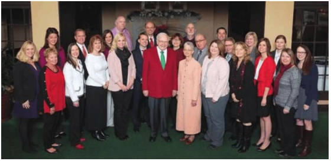

# 2014年信后附件：经营伯克希尔50年的总结

**伯克希尔.哈撒韦收购标准**

我们渴望从企业负责人或者其代理人那里，听到有关符合我们所有如下标准的企业：

（1）大型收购（至少7500万美元的税前利润，除非此生意可纳入我们现存的部门之一）

（2）显示出持续的盈利能力（我们对未来的预测并不感兴趣，我们对“经营好转”的情况同样不感兴趣）

（3）企业有好的净资产收益率，同时负担着少量债务，甚至没有债务。

（4）已有恰当的管理层（我们不能提供它）

（5）简单的生意（如果有许多技术，我们无法理解它）

（6）一个报价（我们不想在浪费我们的，或者卖方的时间，去谈论，纵使只是初步地谈论，一个价格未知的交易）。

公司越大，我们的兴趣越大：我们希望收购规模在50到200亿美元之间的企业。然而，我们对于接收我们可以在一般股票市场上进行购买的建议不感兴趣。

我们不会参与恶意收购。我们可以保证完全保密，并快速回答——通常是五分钟内——我们是否感兴趣。我们更喜欢现金收购，但是当我们所收到的内在商业价值，和我们所付出的一样多的时候，我们会考虑发行股票。我们不会参与拍卖。

查理和我经常接触到那些不接近我们标准的收购：我们发现如果你刊登广告，有兴趣买柯利牧羊犬，许多人将打电话给你，打算卖给你他们的可卡猎犬。一首乡村歌曲的歌词表达了我们对于新企业，经营好转，或者拍卖式销售的感受：“当电话不响的时候，你就知道是我。”

> **伯克希尔：过去、现在和未来**

一切的开始

1964年5月6日，伯克希尔.哈撒韦，当时是由一个叫做Seabury Stanton的人经营。他送了一封信给股东，打算用11.375元每股的价格，从股东手中，买225，000股。我期待着这个信件，但却惊讶于这个价格。

伯克希尔当时有1，583，680股的外在股本。巴菲特合伙人企业，即我管理的投资实体，并实际上是我的所有净资产的企业，大约拥有其7％的股份。在那个投标寄给我前不久，Stanton询问我，要让我的企业出售所持股份，要给出什么价格。我回答说11.50元。他说：“好。成交。”而后，伯克希尔的信件来了，价格少了0.125元（即还是11.375）.我对Stanton的行为感到愤怒，所以没有投标。

这是个巨大的愚蠢决定。

伯克希尔当时是一个北方的纺织品制造企业，处于困境之中。这个行业正在向南方转移，不论是隐喻的，还是物理上的。伯克希尔呢，因为多方面的原因，不能相应做出改变。

行业的问题，长期以来都被广泛地理解。伯克希尔自身的董事会会议记录，1954年7月29日，记录下了惨淡的事实：“新英格兰地区的纺织行业在40年前就开始停业。在战争期间，这个趋势停止了。然而，这个趋势一定会继续，直到供给需求处于平衡为止。”

大约是董事会议一年后，两家19世纪就成立的公司，伯克希尔公司和哈撒韦公司，走到了一起，用了我们现在采用的名字。拥有14个工厂和10，000名员工，合并后的公司变成新英格兰地区的纺织巨头。然而，两家公司视为合并协议的文书，很快变成了自杀的契约。在合并后的七年间，伯克希尔的经营整体上是亏损的，净值减少了37％。

与此同时，公司关闭了九个工厂，有时候用清偿的收入去回购股票，这个模式，引起了我的关注。

1962年12月，我用巴菲特合伙人企业，第一次购买了伯克希尔股票，预计更多的关闭工厂和回购行为。那时候，股价是7.5美元，相比于运营资本10.25元和账面价值20.20元，是大幅度折价的。在这个价格买他家的股票，就像是捡让人抛弃的烟蒂，还可以再吸一口。尽管烟蒂可能难看或者乏味，吸的那口却是免费的。然而，一旦享受了短暂的愉悦，就再也没有什么能够被期待的了。

伯克希尔随后如预想的那样：它很快地关闭了其他2个工厂，在1964年的运动中，它开始用关闭公司的收入来回购股票。Stanton那时候给的报价，是我们原始买入成本的50％以上。它们，我免费吸烟蒂的机会，正在等着我呢，在吸几口后，我可以去别处寻找那些被抛弃的烟蒂。

相反地，愤怒于Stanton的欺骗，我忽视了他的回购报价，并开始大量地买入更多的伯克希尔的股票。

到1965年4月，巴菲特合伙人企业拥有392，633股（当时有1，017，547股外发股本），并且在5月上旬的董事会上，我们正式地控制了公司。通过Seabury和我的孩子气的行为——毕竟，1/8美元，对于我或者他而言，算得了什么？——他丢掉了他的工作，而我发现我自己用了多于25％的巴菲特合伙人企业的资本，投资在一个糟糕的生意，而且我对此生意知之甚少。我变成了那只追逐汽车的小狗。

因为伯克希尔的运营损失和股票回购，它的净资产，在1964年的财务年度末期，从1955年合并的5500万美元的高峰，降到了2200万美元。2200万美元全部都用在了纺织方面的运营上，公司没有多余的现金，并且倒欠银行250万美元（伯克希尔1964年年报，在本年报的130－142页重新印制。

有段时间我很幸运：伯克希尔很快就享受了两年的好的运营状况。更好的是，它在那几年的收入是不需要缴交收入税收的，因为它拥有大量的延后亏损，源于前几年的灾难后果。

很快蜜月结束。在1966年之后的18年时间里，我们在纺织行业，经历了持续不断的挣扎，却全无效果。但是倔强——愚蠢？——是有限度的。在1985年，我终于认输了，关闭了运营。

我第一个错误，即把巴菲特合伙人的资源投入到将死的生意中，并未阻止我继续犯错，我快速地恶化错误。事实上，我的第二个错误，要远远比第一个严重，最终是我职业生涯中最昂贵的一个。

早在1967年，我让伯克希尔支付860万美元去购买国家赔偿公司NICO，一个小型的，但有前途的奥马哈的保险公司（一个小的姐妹公司同样包括在这笔交易中）保险行业是在我的舒适区的：我理解并喜欢这个行业。

Jack Ringwalt，NICO的拥有者，是我的长期朋友，他想把公司卖给我——我个人。他的报价，决不是给伯克希尔这个公司的。所以，为什么我为伯克希尔购买NICO，而不是为巴菲特合伙人企业呢？我有48年时间去想这个问题，始终没想到好的答案。我只是犯了一个大错误。

如果巴菲特合伙人是购买者，我的伙伴和我，将会拥有一个100％的好生意，注定会形成构造现今伯克希尔这样的基础。此外，我们的成长，将不会受到将近二十年时间的，困于纺织运营中的无效资本的妨碍。最后，我们接下来的并购将会由我和我的合伙人完全拥有，而不是还被其他39％伯克希尔公司股东拥有，对于他们，我们是没有义务的。尽管这些事实盯着我的脸，我选择将100％好生意NICO给予了我拥有61％股份的烂生意（伯克希尔.哈撒韦），这个决定最终将1000亿美元左右，从巴菲特合伙人那儿，移给了一大堆陌生人。

再说一个忏悔，而后我就会进入到更加让人开心的话题：你相信么，在1975年，我买了Waumbec Mills公司，另一个新英格兰地区的纺织企业？当然，这次购买的价格，是个“便宜货”的价格，之所以说是便宜货，是基于我们获得的资产，和协同它与伯克希尔现存的纺织生意的计划。然而——意外地，意外地——Waumbec是一个灾难，因为工厂几年后就被关闭了。

好，现在有一些好消息了：北方的纺织行业终于消失了。如果你听到我在英格兰地区的困境感到痛苦，你从此不必再痛苦了。

> **查理理顺了我的思路**

当我管理小规模资金的时候，我的烟蒂策略非常的有效。事实上，我1950年代所获得的许多免费的烟蒂，使得那10年至今为止，是我人生中最好的10年，从相对和绝对投资表现上来看。

然而，纵使是在当时，我也有一些非烟蒂类型的投资，最重要的是盖可公司(政府雇员保险公司)。多亏了1951年我和Lorimer Davidson的谈话，他是一个很好的人，后来成为了该公司的CEO。从谈话中，我得知盖可是个极好的公司，并且很快地将我净资产9800美元的65％投入去购买它的股票。我早期岁月的大部分收益，来自于以低廉价格交易的普通的公司。本杰明格雷厄姆教我这个技巧，而它是有效的。但是，这个方法的一个主要的弱点逐渐地变得明显起来：烟蒂投资法的可扩展性，仅仅只到了某个程度。对大规模资金，它可能就不那么好用。

另外，尽管用便宜的价格购买不良的生意，作为短期投资可能具有吸引力。它们是构造庞大而且持久的企业的错误基础。挑选可以结婚的伙伴，相比于约会，显然需要更多严格的条件（伯克希尔，应该在此标明，可能是一个非常令人满意的“约会”：如果我们将股份以11.375元卖给了Seabury Stanton，巴菲特合伙人企业在伯克希尔身上的加权年回报，将会到达大约40％左右。）

上天派了芒格，来打破我的烟蒂投资习惯，并且为建立一个可以将大的投资规模和满意利润相结合的方式，指明了方向。查理生长在距离我现在所住的地方大约几百英尺的地方，年轻时候，和我一样，在我祖父的杂货店里工作过。然而，直到1959年我们才第一次见面，那时候他早已经离开奥马哈，定居洛杉矶了。我那时候28岁，他是35。介绍我们认识的奥马哈医生预测说，我们会合得来——我们确实是。如果你参加我们的年会，就知道查理有着多样的才华，惊人的记忆力，和一些坚定的看法。我并不真的是思路不清，我们有时候也不是意见一致。然而，在56年里，我们没有争吵过。当我们意见分歧，查理往往用这句话结束我们的对话：“沃伦，再考虑看看，你会赞成我的，因为你是个聪明人，而我是对的。”

你们大多数人所不知道的是，建筑是查理的爱好之一。尽管他以执业律师身份开始自己的职业生涯（那时候薪水15美元一小时），查理第一次真的赚到钱，是在他三十几岁的时候，通过设计并且建造了洛杉矶附近的5个公寓楼项目。同时，他设计了他自己现在住的房子——大约55年之后。（像我一样，如果他对周围环境感到满意，他就不愿意挪动。）在最近几年，查理设计了斯坦福和密歇根大学的大的宿舍群，今天，91岁高龄的他，正在建设其他项目。

依我看来，查理最重要的建筑功绩，是设计了今天的伯克希尔。他给我的设计图很简单：忘记你所知道的，以极好的价格买入普通生意，相反地，以合理的价格买入极好的生意。

改变我的行为，不是一个容易的计划（问问我的家人）。我在没有查理的教诲以前，获得了还不错的成功，所以为什么我应该去听一个律师的话，他又没有在商学院待过（而我——咳咳——待过三个）。但是查理不厌其烦地对我重复他的商业和投资的箴言，而且他的逻辑是不可反驳的。结果，伯克希尔依据查理的设计图建立了。我的角色变成了总承包人，而伯克希尔诸多子公司的CEO们，则作为次承包人，做着实际工作。

1972年，是伯克希尔的一个转折年（尽管还是有我的偶然的滑坡——还记得我1975年买Waumbec的故事么）。我们那时候有了机会为蓝筹邮票公司购买喜诗糖果，芒格，我和伯克希尔拥有蓝筹邮票公司的大量股票，并且蓝筹邮票后来并入了伯克希尔。

喜诗是传奇的西海岸制造商和零售商，主营盒装巧克力，那时候年盈利大约400万税前利润，但是却仅仅用了800万美元的净有形资产。另外，公司拥有未曾体现在它财报上的巨大的资产：广泛的，持久的竞争优势，赋予它巨大的定价能力。这个优势实际上长期确定了喜诗糖果盈利上的主要收益。更好的是，仅仅需要很小的投资增量，这些收益就将会实现。换句话说，喜诗糖果在未来几十年里，可以被期待会有巨大的现金流。

控制喜诗糖果的家族，希望要价3000万美元，查理正确地指出它值这个价钱。但我并不想支付超过2500万美元的价格，并且纵使真的是2500万美元卖给我，我也不是真的那么热情（三倍于有形资产的价格让我倒吸一口凉气）。我的错误的谨慎，差一点破坏了这桩极好的收购。但是，幸运的是，卖方决定同意我们2500万美元的报价。

迄今为止，喜诗糖果赚取了19亿税前利润，而它的成长，仅仅需要增加4000万美元而已。喜诗因此可以分派大量金钱，帮助伯克希尔去购买其他生意，而这些生意反过来，又可以为伯克希尔提供大量可分配利润（像小兔繁殖一样）。另外，经由观察喜诗的交易，我获得了有关强大品牌的商业教育，开拓了我的眼光，投向许多其他富有利润的投资。

纵使有了查理的设计，自Waumbec之后，我还是犯了很多错了。最可怕的错误是Dexter鞋业。当我们于1993年购买该公司的时候，它有很好的记录，在我眼中，全然不像烟蒂股。然而，因为外国的竞争，它的竞争优势，很快蒸发。而我根本没有发现这点。

结果，伯克希尔支付了4.33亿美元给Dexter，并且，非常迅速地，它的价值降到了0.然而，GAAP会计准则，却没有很好地反映出我错误的巨大。事实是我给了Dexter伯克希尔股票，而不是现金，我用于购买的那部分股票，现在价值大约57亿美元。作为一场金融灾难，这是那种值得被写进吉尼斯世界纪录的。

我随后的几个错误，同样包括使用伯克希尔的股票去购买那些利润注定会衰退的公司。这类的错误是致命的。用好的公司的股票——伯克希尔必然是的——去交换一般般的，不可挽回地会毁灭价值的公司股票。

我们同样遭受财务上的损失，当这个错误由伯克希尔参股的公司犯下的时候（有时候，这些错误发生在当我是他们的董事的时候）。太经常地，CEO们看上去对一个基本的现实视而不见：在并购中，你所给出的股份的内在价值，不应当高于你所获得的公司股份的内在价值。

我至今没有看到，有投资银行家量化这个重要的数学依据，当他面对潜在的收购者的董事会，做一个换股收购演说的时候。相反地，这些银行家的专注点，将是描述“通常的”，最近被用于兼并收购的市场价格溢价——一种绝对愚蠢的方式来衡量兼并的吸引力——或者是否这个交易将会增加收购者的每股收益（它本身应该不是决定性的）。在努力获得想要的每股收益数字的过程中，气喘吁吁的CEO和他的“帮助者”将会经常地变出美好的“协同效应”。（多年来，作为19个公司的董事，我至今没有听过“不协同”被人提到过，虽然我见过许多这样的事情在收购完成之后发生。）兼并收购的事后剖析，即现实会被诚实地与原本的计划相比较，很少出现在美国的董事会会议室里。

而这一过程（兼并收购的事后评估）应当成为标准惯例。我可以向你保证，在我走后多年之内，在为任何兼并发行股份以前，伯克希尔的CEO和董事会，将会仔细地做好内在价值的计算。你不可能通过支付100美元，去交易80美元的方式，变得富裕。（即使你的顾问曾经帮你出具昂贵的“公平交易”的意见，为这种交换背书）。

总的来说，伯克希尔的兼并做得不错——并且就一些大的交易来说，做得非常不错。所以，同样的，我们会在证券市场上投资。后者总是在我们的财报上以市场价值计算，所以任何的收益——包括那些尚未实现的——将很快在我们的净资产上体现出来。但是那些我们完全买断的公司，从来不会在我们的财报上向上地重计，即使当我们能出售它们，获得多于它们现存账面价值几十亿美元的收入。这些不被记录的收益，在伯克希尔的子公司中的价值是非常巨大的，在过去的十年里，增长特别迅速。听查理的话有了回报。

> **伯克希尔的今天**

伯克希尔现在是个庞杂的企业集团（conglomerate），并且持续不断地试图变得更为庞杂。

企业集团，应当承认，在投资者中有着糟糕的声誉。并且，它们确实应该得到这种声誉。让我们先解释一下，为什么它们收到冷落，然后我将继续描述为什么企业集团的形式会给伯克希尔带来巨大的，持续的优势。

自从我进入了商业世界，企业集团享受了很长一段时间的，极端受欢迎的状态，其中，最为愚蠢的阶段发生在1960年末期。那时候，大型联合企业CEO的把戏非常的简单：依靠人格魅力，依靠宣传，或者依靠可疑的会计操作——经常是三者一起用——这些管理者把一个新组建的企业集团股价推升到，比如说，20倍的净利（即市盈率20），然后尽快地发行股票，用以收购其他的市盈率10倍上下公司。它们立即应用“股权联营法”（pooling）的会计方法处理收购，使得尽管被兼并的公司价值完全没有任何的变化，但是其每股收益却自动地增加，并把这种增加作为自己管理才华的体现。他们接着对投资者解释说，这种才能，证明收购公司的P/E倍数的持续，甚至增加的合理性。最后，他们许诺会无尽地重复这个过程，所以会创造一直增长的每股收益。

60年代后，华尔街对这种把戏的喜爱大大增加。华尔街的居民们，总是愿意放弃对增加每股收益的可疑方法的怀疑，特别是，如果这些把戏，能为投资银行家们制造大量报酬的时候。会计师们愿意在企业集团的会计报表上泼洒他们的圣水，有时候，甚至为如何进一步合理解释这些数字提供建议。

正是因为扩张的企业集团中，每股收益的增加，是源于P/E的差异，它的CEO不得不寻找低P/E的公司。这些，当然了，是典型的平庸生意，有着很差的长期前景。这种冲动，甚至连海底的鱼都不放过，往往使得企业集团所收购的企业，变得越来越垃圾。

对兼并收购活动结果，盲目崇拜的媒体煽风点火。诸如ITT,Litton Industies，Gulf\&Western和LTV等公司受到了追捧，它们的CEO变成了名人（这些曾经出名的企业集团早就不在了。就像Yogi Berra说的，“每个拿破仑都会遇到水门。”）

在当时，各种各样的会计诡计——它们中许多都很可笑，很容易识破的——被原谅了，或者被忽视了。事实上，在快速扩张的企业集团的领导位置中，有个会计造假专家，被视为是巨大的优势：股东在那种情况下，能够被确保的是，报告的利润将不会让人失望，不管运营的实际状况可能变得多坏。

在1960年末期，我参加了一个会议，会议上一个兼并公司的CEO吹嘘着他的“大胆的，富有想象力的会计”大多数的分析师听着他的话，报以赞赏的点头，认为他们发现了一个其预期一定会实现的经理人，不论经营结果是如何。

然而，结果，时钟卡在了十二点，一切变回了南瓜和老鼠，再一次地，显而易见地，基于一系列的高价股份发行而撑起来的商业模式——就像连锁信模式——最确实地重新分配了财富，但不论如何，不会创造它。然而，所有的现象，都在我们国家短暂地盛行过——它们是每个倡导者的梦——虽然它们往往以精心设计的骗局出现。

结局纵使相同的：金钱从轻信的人流向行骗者。对于股票，不像连锁信，被绑架的金额是令人震惊的。在巴菲特合伙企业和伯克希尔公司，我们从未投资于拼命发行股票的公司。这种行为，是以下情况的，最确定的标志之一——有推销想法的管理层，糟糕的会计，高估的股价，还有——往往地——全然地不诚实。

所以，查理和我发现了什么，才会认为伯克希尔企业的集团结构如此吸引人？简单地说：如果企业集团形式被明智地使用，它是一种最大化长期资金增长的理想形式。

资本主义所能宣告的美德之一，就是能有效地分配资金。市场将会直接地投资到有希望的生意中，并且拒绝那些注定要凋零的生意。这是真的：纵然是有过度的情况，市场主导的资金分配往往远胜过其他的方法。

然而，它们往往是理性的资本流动的障碍。就像1954年，伯克希尔公司所清晰体现的那样，在纺织工业中的资本撤离，早就应当发生，然而却被自私的管理层的空虚期盼，延后了好几十年。确实地，我自己大大推迟了放弃我们废弃的纺织工厂的时间。

一个资金配置在衰退产业的CEO，很少选择大规模地重新分配资本于不相关的活动中。这样的行为，往往需要开除长期的伙伴，并且需要他承认错误。此外，那个CEO不太可能就是你希望承担重新配置工作的经理人，即使这个CEO想要承担这个工作。

在股东的层面，税收和摩擦成本，对于个人投资者具有重要作用，当他们打算重新分配资本于公司和行业的时候。即使免税的机构投资者也面临比较大的费用，当他们运作资本的时候，因为他们往往需要中介去完成这个工作。无数张嘴，进行了昂贵的品尝，而后吵吵嚷嚷——在他们中间，是投资银行家，会计师，咨询师，律师和诸如杠杆收购者的资本重新分配者。金钱洗牌可不便宜。

相反地，一个企业集团，比如伯克希尔，是完美的设置，用以理性地配置资本，并且以是最小的成本配置。当然，仅仅形成它，并不保证会成功。我们犯了无数错误，并且我们将会犯更多。然而，我们的结构优势，是令人敬畏的。

在伯克希尔，我们能够－在不承受税负或者其他花费的情况下——从纵使增加投资也机会有限的生意，向有更大希望的其它部门那里，转移巨大的资本。

另外，我们不因为一生都投身于一个特定行业，而受到历史偏见的影响，也不会遭受来自同伴的压力，他们有既定利益，希望保持现状。这是重要的：如果马儿能控制投资决定，那么可能就不会有汽车行业了。

其他由我们所拥有的主要优势，是购买好生意的一部分的能力——又称为普通股。这不是大多数管理层的所作所为。在我们的历史中，这种策略性的取舍显得非常的有益；广泛的选择总是使得决策更好。股票市场每天给予我们的企业报价——一小部分的，确然——经常远远地，比我们同时地收到它们公司整体的报价，还要具有吸引力。另外，我们从股票市场上实现的收益，帮助我们做了许多大型的收购，没有这些收益，这些收购就会超出我们的财务能力。

事实上，世界是属于伯克希尔的——世界提供给我们范围广泛的机会，远远超出大多数的企业。我们，当然，会限制只投资于那些我们能够评估其经济前景的企业。这是一个重要的限制：查理和我不知道很多企业未来十年将会如何。但是这个限制，大大地小于，那些经验被限定在一个领域的管理者。

我刚才提到了相比于它的商业模型的资本需求，喜诗糖果产生了大量利润。我们喜欢，当然了，明智地使用那些资金，去扩张我们的糖果生产。但是我们多次尝试如此去做，大体上却是无效的。所以，在没有招致无效税负或摩擦成本的情况下，我们使用这些喜诗糖果产生的多余资金去购买其他的企业。如果喜诗仍然是一个单独的企业，它的收益就要分配给投资者，用来重新配置，有时候是在被抽取了重税之后，而且几乎总是要耗费巨大的摩擦成本和代理成本。

伯克希尔有一个更进一步的优势，多年来，这个优势变得越来越重要：我们现在成为了很多杰出企业拥有者和管理者的选择。

当拥有成功的企业的家族，想要出售他们的企业时，他们有多种选择。往往地，最好的选择是什么也不做。在生命中，的确是有比拥有一个自己极为了解的，有前途的企业更加糟糕的事情，但是端坐着是不受华尔街待见的（不要问理发师你需不需要理发）。

当家庭成员的一部分人想要出售，而另一部分人想要继续经营的时候，公开发行股票往往变得有理了。但是，当所有者想要完全地出售，他们通常考虑两个途径之一。

第一个途径，是出售给那些垂涎三尺，正想通过合并两家公司，达到“协同效应”的竞争对手。这种收购者总是考虑排除卖方的大量伙伴，即那些帮助所有者建立这个事业的人。然而，一个体贴的所有者——有很多这样的人——往往不想让他的长期伙伴悲伤地唱旧的乡村音乐：“她得到了金矿，我得到了不公平对待”。

第二种选择是华尔街的买家。多年来，这种收购方准确地称他们自己为“杠杆收购公司”。当这词汇在1990年代获得了恶名——记得RJR收购案和门口的野蛮人——这些买家匆忙地将他们自己标记为“私募股权”。

名字可能改变，但是核心一直不变：事实上在所有的私募股权收购案中，权益（equity）大幅度地减少，负债（debt）堆积。实际上，私募股权购买者提供给出售者的数额，部分地，是由购买者评估计算，被收购的公司所能承受的债务最大数额所决定的。

接着，如果事情发展顺利，权益（equity）开始建立，杠杆收购方往往将寻求利用新的借贷来进行重新杠杆。他们通常接着使用收益的一部分去支付巨大的利息，使得权益大幅度减少，有时候甚至到了负值。

事实真相是，对以许多私募股权购买者，“权益”是一个可恨的词汇；他们喜爱的是负债。并且，因为负债现在如此便宜，这些收购者经常能够支付高价。接着，公司会被重新出售，经常卖给其他的杠杠收购者。事实上，公司变成了一件商品。

伯克希尔提供了想卖出的公司所有者第三种选择：永久的家，在这个家里公司的人和文化将被保留（虽然，偶尔地，管理上的变化将是需要的）。除此之外，我们收购的任何商业，大幅度地增加他的金融优势和增长能力。面对银行和华尔街分析师的日子也永远地结束了。

一些出售者不考虑这些事情。但是，当出售者考虑的时候，伯克希尔就不会有很多竞争对手了。

有时候评论员提议伯克希尔剥离一部分的公司。这些建议没有道理。我们所拥有的公司，作为伯克希尔的一部分，比作为独立的实体要更有价值。一个原因是，我们能够立即而且不用付税地，在企业之间移动资本，或者投入新的公司。另外，一些花费会全部或者部分地重复，如果运营是分离的话。这儿有个最明显的例子：伯克希尔花费微不足道的钱在单一的董事会上；如果我们几十个的子公司都被分离出来，总的董事会花费将增加。所以，一样地，监管和管理支持也会增加。

最后，对于子公司A，有时候会因为我们拥有子公司B，而产生重要的税负效能。例如，一些税收计入贷方方式，之所以可以在我们的事业公司使用，只是因为在伯克希尔的其他公司的运营中，我们产生了巨大数额的税收收入。这给予了伯克希尔.哈撒韦能源一个巨大的优势，相比于发展风能和太阳能的大多数公共事业公司。

投资银行家，因他们的参与而获得报酬，持续不断地催促着收购方，支付高于公众持股公司市场价20％至50％的溢价。银行家们告诉购买者，这个溢价是有道理的，因为“控制价值”，并且因为一旦收购方的CEO控制了被收购公司，好的事情就要发生了（急于收购的管理者将怎样挑战这个臆断？）

一些年以后，银行家们——绷着张脸——又一次出现了，并且热切地催促分拆早期兼并的公司，目的是要“解锁股东的价值”。分拆，当然，剥离了它宣称的有“控制价值”的母公司，没有任何赔偿性支付。银行家解释说，分拆后的公司将会繁荣，因为它的管理将会更加具有企业家精神，从令人窒息的官僚的母公司中解脱出来（我们早前见到的有才干的CEO就这么点本事）

如果这些已经剥离的公司日后希望重新收购分拆的业务，它大概将又一次被银行家所催促，为了这种特权支付庞大的“控制”溢价。（银行界的这类心理“弹性”引起了一种说法，费用常常导致交易，而不是交易导致了费用）

如果可能的话，当然，有一天监管层会要求伯克希尔公司的分拆或者出售。伯克希尔于1979年实施了这种分拆，当时新的，有关持有银行的监管要求，迫使我们剥离一家位于Rockford市,Illinois州的银行。

然而，自发的分拆，对我们而言毫无道理。我们将损失控制价值，资本分配的弹性，并且，在一些情况下，重要的税收优势。考虑到源于伯克希尔的所有权的运营和财务优势，如果运营分拆后的公司，我们子公司那群聪明的CEO们，现在将面临困境，而不能如此有效运营。另外，母公司和分拆后的公司，一旦分离，将可能被课以适量地更多花费，相比于现存的合并状况。

在我离开分拆话题以前，让我们看个从企业集团中学到的教训：LTV。我将在这儿做总结，但那些想看好的金融故事的人应当阅读在1982年10月D Magazine发表的有关Jimmy Ling的文章。上网查查。经过一些列眼花缭乱的公司操作，Ling将LTV从1965年仅仅3600万美元销售额，带到了世界500强第14名，仅仅花了2年时间。Ling，应当注明，从未展现过任何的管理技巧。但是查理很久以前对我说，不要低估那些高估自己的人。并且，Ling在那方面无人可比。

Ling策略，他标名为“项目重新部署”，是买入大公司，然后部分地分拆它的各种部门。在LTV的1966年度报告，他解释了接下来将要发生的魔法：“最重要的是，兼并一定要满足2＋2＝5（或6）的公式。”媒体，公众和华尔街喜欢这类的讲话。

在1976年，Ling买了Wilson\&Co.一个巨大的肉类包装企业，同时也有高尔夫设备和药业的权益。很快地，和分拆母公司成三家公司，Wilson\&Co.(肉类包装),Wilson体育用品和Wilson制药，每一个都被部分地分拆。这些公司很快被华尔街称为肉球，高尔夫球，呆瓜。

随后很快，很清楚的是，就像Icarus一样，Ling飞得太靠近太阳了。在1970年代初期，Ling的帝国消散，他本人也被分拆出了LTV，就是，被解雇了。定期地，金融市场会和现实脱离－你可以依赖它。更多的Jimmy Ling们会出现。他们将看起来和听起来很权威。媒体将抓住他们的每一个字。银行家们将为他们的生意打架。他们说的话将近期“发挥作用”。他们早期的跟随着将会觉得非常明智。我们的建议是：不论他们说什么，永远不要忘记2＋2将会永远等于4.并且当某些人告诉你这个数学公式如何落伍——拉上皮包拉链，去度假，几年后回来以便宜的价格购买股票。

今天的伯克希尔拥有

（1）无与伦比的一系列公司，它们中的大部分，有着很好的经济前景。

（2）骨干的管理层，他们少有例外地，往往投身于他们所经营的子公司和伯克希尔母公司。

（3）一个极好的多样化收入，极佳的财务优势，和大量的流动资金，这些我们会在所有情况下保持。

（4）对于许多的所有者和管理者来说，在考虑出售他们的生意的时候，我们公司是他们的第一选择

（5）和前面有关的一点是，文化，在许多方面，和大多数的大公司不同，我们公司花了50年时间去发展公司文化，现在它坚如磐石。

这些优势为我们提供了发展的美妙基础。

> **伯克希尔未来50年**

现在让我们看看前方的道路。记住，如果我打算在五十年前判断接下来的事，我的预测当然将会大大偏离实际。在这点告诫之后，我将会告诉你，如果我的家庭问我伯克希尔的未来，我说些什么。

首先和必然最为重要的是，我相信对于耐心的伯克希尔投资者而言，永久性的资本损失的机率，是对单一公司的投资中所能找到最低的。这是因为我们的每股内在商业价值，随着时间推移，几乎是确定增加的。

然而，这个让人欢快的预言，却伴随着一个重要的谨慎因素：如果伯克希尔投资者的买入点不同寻常地高——在一个价格，也就是说，几乎接近了两倍的账面价值，虽然伯克希尔的股票只是偶尔地到达这个价格——它可能需要很多年才能让投资者能够实现盈利。换句话说，一个明智的投资可能变成匆忙的投机，如果股票是被高价购买的。伯克希尔也不会豁免于这个真理。

然而，投资者在比于公司回购股份稍微高一点的价格购买伯克希尔的股票，应当在一个合理的时间内产生收益。伯克希尔的董事们仅会在他们相信回购价格远低于内在价值时，才会批准回购。（在我们的观念中，这是回购的基本标准，这标准经常被其他管理者忽视）

对于那些打算在买入后一两年内出售股票的投资者而言，我不能够提供任何保证，不论他们的买入价格是多少。在如此短的时间内，总体股票市场的变动，对于你结果的影响，将可能远远重要于伯克希尔股份内在价值相伴发生的变化。就像本杰明格雷厄姆几十年前说的：“在短期内，市场是台投票机；在长期内，市场表现得像台称重机。”（注，此名句原文是As Ben Graham said many decades ago:“In the short-term the market is a voting machine;in the long-run it acts as a weighing machine.”）偶然地，投资者的投票决定——业余者和投资者都一样——近似于神经病。

因为我知道没有方法能够可靠地预测市场变动，我推荐除非你打算持有它们至少五年，否则你别买伯克希尔的股票。那些谋求短期利润的人应当到别处看看。

另一个告诫：不应当用借来的钱购买伯克希尔的股票。自从1965年以来，曾经有过三次，我们的股价是从高点跌下大约50％的。有朝一日，像这类的下跌事情将会再次发生，并且没人知道是何时。伯克希尔将几乎确定地，会成为投资者满意的持有标的。但是它同样能成为运用杠杆的投机者的灾难性选择。

我相信，发生导致伯克希尔遭遇财务问题的事件机率大体为零。我们总是为千年的洪水做准备；事实上，如果它发生了，我们将把救生衣卖给那些没有准备的人。在2008－2009的崩溃中，伯克希尔作为一个“第一反应者”发挥着重要作用，并且我们此后多于一倍地增强了我们的资产负债表和盈利能力。你们的公司是美国商业的直布罗陀并且将会继续如此。

维持财务能力要求一家公司在所有情况下保持三个优势：（1）一个巨大且可靠的盈利流（2）大量的流动资产并且（3）没有重大的近期现金需求。忽视了最后一条，常常导致公司经历意想不到的问题：太经常地，赚钱的公司的CEO们，感觉他们将总是能够偿还到期债务，不论它们规模多大。在2008－2009年，许多管理者领教了这个思维模式有多么危险。

以下是我们无论如何将始终坚持的三个原则：首先，我们的盈利流是巨大的并且来自一大批企业。我们的股东现在拥有许多具备持续竞争优势的大型公司，并且我们在未来将收购更多。我们的多元化保证了伯克希尔持续的盈利能力，纵使发生一个大灾难，产生远远超越过去任何经历的保险损失。

接下来是现金。在一个运作良好的企业中，现金有时候被认为是需要最小化的东西——作为没有收益的资产，拖累净资产收益率之类的收益标志。然而，现金，对于企业而言，就像空气对于人：当它存在的时候，从来不想它，但当缺了它的时候，却是心里唯一想的事物。

美国企业在2008年提供了这方面的案例研究。在那年九月份，许多长期兴盛的公司突然想知道，是否它们的支票会在未来的日子里拒付。一夜之间，它们的财务空气消失了。

在伯克希尔，我们的“呼吸”毫无阻碍地进行着。事实上，在九月末、十月初期的三个星期时间内，我们提供了156亿美元的新资金给美国的企业。我们能够做到这点，因为我们总是保持最少200亿美元——并且常常远多于此——的现金等价物。并且在此，我们说的是美国国债，而不是那些声称提供流动性，并且实际上能够这么做的现金替代物，除了当它们真的被需要的时候。当债务到期，只有现金是法定货币。出行不能没有它。

最后——到达我们的第三点——我们从不参与运营或投资会导致突然需要大量资金的企业。那意味着，我们将不会把伯克希尔暴露在短期到期的债务，不会进入衍生品契约，或者其他需要大量抵押物的企业协议。

几年以前，我们参与了某些衍生品合约，我们相信是大幅地被错误定价，并且只需要少量的抵押物。这些已经被证明相当地有利可图。然而，最近，新订立的衍生品合约需要完全的抵押物。这终结了我们对于衍生品的兴趣，不论它们可能提供何种的盈利潜力。几年来，我们没有签署这些合约，除了少数是因为我们的公共事业公司的运营需要。

此外，我们将不会签署那些客户可以选择取出现金的保险合约。一些人寿保险产品包含了赎回特征，使得它们在极端恐慌的时候易受“流动”的影响。然而，那类的合同，不会出现在我们所采用的财产保险世界中。即使我们的保费数量会减少，我们的浮存金会减少——但是只以很慢的速度。

对于一些人而言，这种保守是极端的，我们保守的原因，是因为完全地可以预测，人们会偶尔地恐慌，但完全不可预测，何时会发生。虽然实际上所有的日子相对地无事，明天总是不确定的。（在1941年12月6日，或者2001年9月11日，我没有感到特别不安。）如果你不能预测明天会发生什么，你必须为无论发生什么做好准备。

一个64岁并且打算在65岁退休的CEO，可能有他自己的特殊计算，以评估在一年内仅有很小发生概率的风险。他可能，实际上，99％的时间都是“正确”的。然而，那些几率，对我们没有吸引力。我们将永远不会用你们托付给我们的资金，玩财务的俄罗斯轮盘，即使隐喻的枪有100个枪膛，且仅有一发子弹。在我们看来，冒着损失你需要的，去追求你仅仅渴望的，是疯狂的。

尽管我们保守，我想我们将能够每年继续增加伯克希尔潜在的每股盈利能力。这并不意味着经营收益将每年增加——远非如此。美国经济将起起伏伏——虽然主要是上涨——并且，当它减弱的时候，我们当前的盈利也会减弱。但是我们将继续取得逐步的收益，做追加并购，并且进入新的领域。所以，我相信，伯克希尔将会每年增加它的潜在盈利能力。

在一些年里，收益将会是大量的，在其他时候，它们将是少量的。市场，竞争和机会将会决定何时机会出现在我们面前。尽管这些，伯克希尔将继续保持前进，由一批我们现在拥有的可靠的企业，和我们将购买的新企业所驱动。此外，在多数年份里，我们国家的经济将为公司提供强烈的助力。上帝保佑，我们有美国作为主场。

坏消息是，伯克希尔的长期收益——用百分比衡量，而不是美元——不能够急剧的增长，并且将不会接近在过去50年里取得的收益。其数字已经变得过于庞大。我想伯克希尔将超越平均的美国公司的表现，但是我们的优势，如果有的话，不会太大。

最终——可能从现在起十年到二十年的时间——伯克希尔的盈利和资本资源将到达一个水平，将使得管理者不能明智地重新投资所有的公司盈利。在那时候，我们的主管将需要决定是否最好的分配多余盈利的方式是通过股息，股份回购，或者二者皆是。如果伯克希尔的股份是低于内在商业价值的价格出售，大量的回购将几乎确定地是最好的选择。你能够放心的是你的主管们将会做出正确的决定。

没有公司会比伯克希尔公司更加重视股东。在超过30年的时间里，我们每年重申我们的股东原则（参见117页），总是以此开头：“虽然我们的形式是公司，我们的态度是合伙制。”这个与你们之间的协议，是刻在石头上的。

我们有个很博学的和以商业为导向的董事会，准备执行合伙制的承诺。没有人为了金钱而做工作：在一个几乎不存在于别处的安排之下，我们的董事仅仅收取象征性的费用。取而代之的是，他们通过伯克希尔股份的所有权，接受他们的回报，并且从当好一个重要企业的管家中，获得满足感。

他们和他们的家庭所拥有的股份——在很多情况下，价值非常大的金额——是从市场中购买的（而不是通过他们的期权或者补助实现的）。另外，不像几乎所有其他大型上市公司，我们没有董事和职员的责任保险。在伯克希尔，董事们站在你的立场看问题。

为了继续保证我们文化的延续性，我建议我的儿子，霍华德，接替我作为公司的非执行主席。我希望如此的唯一原因是，如果错误的CEO被聘用，需要主席强制解聘他，改变起来会更加简单。我可以对你们保证，这个问题在伯克希尔发生概率很低——就像在任何上市公司发生的概率一样低。然而，在我所服务的十九家上市公司的董事会中，我曾见过要替代一个平庸的CEO是多么困难，如果那人又是主席的话。(换人行为通常会完成，但是几乎总是非常晚。)

如果当选，霍华德将会无偿服务并且将不在此工作上花费任何时间，除非所有的董事要求。他将仅仅成为安全阀，任何董事都能够找他，如果他或者她担忧CEO的情况，并且希望知道是否其他的董事也同样表示出疑虑。如果多个董事表示担忧，霍华德的主席地位将使得事情快速和合理地解决。选择正确的CEO是非常重要的，并且在伯克希尔的董事会中是一件值得花费很多时间的事情。管理伯克希尔主要是资本配置的工作，还有选择和保留出色的管理者，去领导我们的运营子公司。显然地，工作同样需要替换子公司的CEO，如果需要的话。这些职责需要伯克希尔的CEO是个理性的，镇静的和果断的人，并且知道自己的局限性。（正如Tom Watson，IBM的高管说的，“我不是天才，但我在某些领域方聪明，并且我在那些领域坚持。”）

品格是最重要的：一个伯克希尔的CEO必须为了公司“投入所有”，而不是为了他自己。（我使用男性代词以避免笨拙的措辞，但性别不应当决定谁成为CEO。）他不得不赚取远多于可能需要的金钱。但重要的是，自大和贪婪都不会促使他伸手索要报酬，以赶上他那些用最奢侈的方式补偿的同辈，纵使他的成就远胜于他们的。一个CEO的行为对经理人有巨大的影响：如果他们清楚，对CEO而言，股东的利益是至高无上的，他们将，少有例外地，同样抱有这样的想法。

我的继任者将需要具备一个其他的特殊优点：有能力摆脱企业衰退的因素，即傲慢，官僚和自满。当这些公司癌症转移，纵使最强的公司都会衰退。有众多的例子去证明这个观点，但为了保持友谊，我将仅仅从那些遥远的过去发掘案例。

在巅峰时期，通用汽车，IBM,西尔斯罗巴克，和美国钢铁在几大行业排行榜首。它们的优点看上去无懈可击。但是我上文所谴责的破坏性行为，最终使得它们中的每一个，都掉入了其CEO和董事在不久前都认为不可能的深渊。它们一时的财务优势，和他们历史的盈利能力被证明毫无保护作用。

当伯克希尔变得更加庞大的时候，仅有警惕的和坚定的CEO能够避开此种削弱力量。他必须永远不忘查理的请求：“告诉我，我会在哪里死去，所以我将永远不会去那儿。”如果我们的非经济价值会损失，大部分的伯克希尔经济价值同样会崩塌。“高层基调”将是保持伯克希尔特殊文化的关键。

幸运的是，使得我们未来的CEO们成功，所需要的结构已经切实地准备好了。现在存在于伯克希尔的，特别授权的权限是对官僚主义的理想解药。在运营的意义上，伯克希尔不是一个大的公司，而是一群大公司。在总部，我们从未有委员会，也从不要求我们的子公司提交预算（虽然许多公司使用它们作为重要的内部工具）。我们不拥有法律办公室，也不拥有其他公司认为理所应当的部门：人力关系，公共关系，投资者关系，战略，并购，但凡你想得起来的。

我们，当然，有定期进行的审计职务；没道理成为一个积累问题的傻瓜。然而，我们以一种不寻常的程度，相信我们的经理们会以热情的管家观念，进行他们的运营。毕竟，他们正在做的，正是我们收购他们企业前的事情。此外，除了偶尔的例外，相比于一连串的指令，无尽的检查，层层的官僚制度所取得的成绩，我们的信任要产生更好的结果。如果位置颠倒的话，查理和我尝试以我们所希望的被对待的方式，和我们的管理者互动。

我们的董事相信，我们未来的CEO们，将来自伯克希尔董事会已经逐步了解清楚的内部候选人中。我们的董事同样相信，新任的CEO应当相对地年轻，所以他或者她能够长期工作。如果CEO们领导企业的时间平均远超十年，伯克希尔将最好地运营。（很难教会一只新狗旧的把戏。）并且他们也不可能在65岁退休（或者你已经注意到了什么吗？）

在伯克希尔的企业并购和大型的，为伯克希尔量身定制的投资行动中，重要的一点是，我们的对手方熟悉并放心于伯克希尔的CEO。形成那种的信任并且巩固关系需要时间。然而，回报可能是巨大的。

董事会和我都相信我们现在有合适的人选去继承我CEO的位置——在我死后或者退位之后，有一个继承者准备好担当此项工作。在某些重要的方面，这个人将做得比我现在做的还要好。

对伯克希尔而言，投资将总是非常重要的，并将由多位专家处理。他们将对CEO报告，因为他们的投资决定，在广阔意义上，需要和伯克希尔的运营和并购项目相协调。然而，总的来说，我们的投资经理将享受很大的自主权。在这方面，同样，我们未来几十年将处于良好的情况。Todd Combs和Ted Weschler，他们都在伯克希尔的投资团队花了许多年时间，在所有方面都是一流的，能够在评估并购方面，给予CEO特别的帮助。

总之，为了查理和我离开舞台后的岁月，伯克希尔被完美地安置。我们准备了正确的人选——正确的董事们，管理者们和那些管理者们可能的继任者。另外，我们的文化，是根植于他们全体成员的。我们的系统同样是可再生的。在大的程度上，好和坏的文化都自我选择永存它们自身。那些和我们价值观相同的企业所有者和运营管理者，将继续被伯克希尔，一个独一无二的和永恒的家所吸引，是有理由的。

如果我没有像其他重要的，使伯克希尔特别的关键支持者们致敬，那我将是不负责的：我们的股东。伯克希尔的确具有一个不同于任何其他巨型企业的所有者基础。这个事实在去年年会上被肯定地证实，那时候股东收到一个代理人的解决方案：

解决方案：鉴于公司已有的资金多于它所需要的，并且因为所有者们不像巴菲特那样是亿万富翁，董事会应当考虑支付有意义的每年分红。

倡议此解决方案的股东从未出现在会议上，所以他的提议没有被正式地提出。然而，代理投票还是被清点了，并且它们是富有启发性的。不出意外地，A股——由相对少数股东持有，他们每一个人都有大的经济利益——在分红问题上投了“不”，差额是89比1。

引人注目的投票是我们B股股东的投票。他们的数量成千上万——可能甚至总数一百万人——他们投票是660,759,855“不”和13,927,026“是,”比例大约47比1。

我们的董事们推荐“不”票但除此之外，公司没有打算影响股东。然而，98％的股份实际上投票说，“不要给我们红利，而是取而代之地，重新投资所有的盈利。”拥有我们的股东——大的和小的——都和我们的管理哲学如此同步，是不同寻常的，也是有回报的。

有你们做伙伴，我真是幸运的家伙。

沃伦.巴菲特

***

**副董事长的想法:过去和未来**

致伯克希尔.哈撒韦股东：

我近距离地观察了伯克希尔在沃伦巴菲特领导下过去五十年不同寻常的成功。现在看上去是合适的时候，让我独立地补充，不论他本人会做出何种的纪念性评论。我将尝试着做5件事情。

（1）描述其管理系统和政策，使得一个小型的，注定要失败的纺织商品企业，变成现在的庞大的伯克希尔。

（2）解释管理系统和政策如何形成。

（3）解释，在某种程度上，为什么伯克希尔做得如此之好。

（4）如果巴菲特很快就卸任的话，预测是否不同寻常的好结果会继续，并且，

（5）考虑是否伯克希尔过去50年的优异成绩有些启示，可能在别处也被证明有用。

巴菲特领导下的伯克希尔的管理系统和政策（在此统称为“伯克希尔系统”）很早就就固定，并且描述如下：

(1)伯克希尔将是一个分散的企业集团,其仅会反对那些不能做出令人满意预测的业务类型。

（2）它的母公司将会做几乎所有类型的生意，通过独立的股份有限子公司，子公司CEO们的经营将会有极大自治权。

（3）企业集团的总部几乎没有任何东西，除了一个小办公司套间，包括一个主席，一个CFO，一些主要帮助CFO做审计，内部控制的助手。

（4）伯克希尔子公司将显著地总会包括灾害保险公司。这些成群的保险公司将被期待着及时产生可靠的承保收入，并且也会产生大量的“浮存金”（来自还未支付的保险负债）用于投资。

（5）没有显著的，系统性的人员系统，股票期权系统，其他激励系统，退休系统，或者诸如此类系统，因为子公司将有他们自己的系统，而系统常常是不同的。

（6）伯克希尔主席自己将仅做很少的事情：

（i）他将管理几乎所有的证券投资，它们通常属于伯克希尔的灾害保险公司。

（ii）他将选择所有重要子公司的CEO，他将会确定他们的报酬，并且从他们每个人的私人推荐中获得继任者（人选），如果突然需要继任者的话。

（iii）他将在子公司增加了它们的竞争优势之后，配置其不需要的大部分现金，理想的配置是使用那些现金去收购新的子公司。

（iv）若子公司CEO有任何联络的需要，他将立即能够被联络，并且他将几乎不需要另外的联络。

（v）他将在他的年度报告中撰写长篇的，有逻辑的，有用的信件，此信件将被设计成，如果他本人是一个仅仅被动持有的股东，所希望成为的样子，并且他将能花几小时的时间，在年度股东大会上回答问题。

（vi）他将尝试着成为，一个对顾客、股东和其他在职者而言，长期运作良好的文化的榜样，在他卸任前后都是如此。

（vii）他的首要任务将是保留大量时间安静地阅读和思考，特别是那些可能提高他的决策的学习，不论他变得多老，并且

（viii）他也将花费许多时间在热情地钦佩他人的成就。

（7）新的子公司将通常被现金收购，而不是新发行股票。

（8）只要能用一美元的留存利润，为股东创造多于一美元的市场价值，伯克希尔就将不会支付股利。

（9）关于购买新子公司，伯克希尔将寻求以合理的价格购买好的生意，此生意是主席能够很好地理解的。伯克希尔将同样希望（该公司）有一个好的CEO在任，他被期待继续长期留任，并且能在不需要总部帮助的情况下，很好地管理公司。

（10）关于选择子公司的CEO，伯克希尔将设法确保其可靠，有技能，有活力并热爱CEO所在企业和环境。

（11）作为重要的优先选择的方式,伯克希尔将几乎不会出售子公司。

（12）伯克希尔几乎不会将子公司的CEO调到其他不相关子公司（任职）。

（13）伯克希尔将不会强迫子公司的CEO仅因为年龄退休。

（14）伯克希尔将少有债务未清偿，因为它试图保持（i）在任何状况下，实质上完美的信誉和（ii）当出现不同寻常的机会的时候，容易获得可以调配的现金和贷款。

（15）对潜在的大公司的卖家而言，伯克希尔将总是友好的。一个此类公司的报价，将获得快速的关注。在伯克希尔，只有主席和一两个其他人，会知道这个报价，如果此报价没有导致交易的话。并且他们将不会告诉局外人有关交易的事。

伯克希尔系统的要素和它们聚集的规模都是如此不同寻常。据我所知，没有其他的大型企业具备一半这样的要素。

> 伯克希尔如何恰好拥有一个如此与众不同的企业性格呢？

嗯，巴菲特，即使当年仅有34岁而已，控制了大约45％的伯克希尔股份，并且完全被其他大股东所信任。他能够建立任何他所想要的系统。并且他也这么做了，创造了伯克希尔系统。

几乎每个要素的选择，都是因为巴菲特相信，在他的领导下，它将帮助最大化伯克希尔的成就。他不打算为其他的企业，创造一个适用于所有的系统。事实上，伯克希尔的子公司们并不需要在它们自身的运营中使用伯克希尔的系统。并且即使采用不同的系统，一些公司也很兴盛。

> 当巴菲特设计伯克希尔系统的时候，他的目标是什么？

嗯，这些年来，我分析了几个重要的因素：

（1）他特别希望，持续最大化多数此系统中重要人员的理性，技巧和奉献精神，从他自己开始。

（2）他希望处处都有双赢的结果——比如说，用忠诚待人的方式，去获得忠诚。

（3）他希望做出最大化长期结果的决定，从通常持续在位足够长时间，以承担决定结果的决策者那里寻求（决策答案/参考）。

（4）他希望最小化总部内，来自庞大官僚机构的，几乎不可避免的负面影响。

（5）他希望亲身地做出贡献，像本杰明格雷厄姆教授那样，传播他所获得的智慧。

当巴菲特开发伯克希尔系统的时候，他预见到了所有后来发生的好处么？不。巴菲特磕磕绊绊地通过实践的进化，才获得了一些好处。但是，当他看到有用的结果时，他强化了它们的成因。

> 为什么伯克希尔在巴菲特的领导下做得如此出色？我只想到四大因素：

（1）巴菲特有益的特性。

（2）伯克希尔系统有益的特性。

（3）好运，以及，

（4）一些股东和其他崇拜者，包括一些媒体界人士，不寻常地强烈的，有传染性的忠诚。

我相信所有四个因素都存在且有用。但是沉重的货物，是由有益的特性，不寻常的忠诚，和他们之间的关系，所承载的。

特别地,巴菲特决定限制他的业务于少数类型，而且最大化他的注意力于此类类型，并持续如此做了50年，非常出色。巴菲特的成功和罗杰费德勒成为网球高手的原因是一样的。

巴菲特，事实上，使用了著名棒球教练John Wooden的致胜方法。John Wooden在学会分配几乎所有的上场时间给他最好的七名球员之后，基本上就经常地获得胜利。采用这种方式，对手总是面对他最好的球员，而不是次好的。并且，因有额外的比赛时间，最好的球员比一般球员提升更多。

而且巴菲特的情况大大超越了Wooden，因为技能的练习集中于一个人，而不是七个，随着他50年间变得越来越老，他的技能提升再提升，而不是像棒球运动员的技能那样退化。

此外，以在长期服务的，重要子公司的CEO身上集中如此多才华和权力的方式，巴菲特也创造了强大的Wooden式效果。并且此类效果提高了CEO的能力和子公司的成绩。

然后，因为伯克希尔系统授予了许多子公司和它们的CEO所渴望的自治，以及伯克希尔变得成功且著名，这些结果吸引更多，更好的子公司进入到伯克希尔，也吸引了更好的CEO。

更好的子公司和CEO需要总部更少的关注，创造常被称为“良性循环”（的局面）。

> 总是将灾害保险公司，作为重要的子公司，对伯克希尔的发展而言有多么好？

不可思议地好。伯克希尔的雄心是无由地强烈，并且，纵使如此，它得到的它所想要的。

灾害保险经常投资于普通股，其价值大概以股东权益计算，正如伯克希尔的保险子公司做的那样。并且，在过去50年里，标准普尔500指数每年提供大约10％的税前收益，创造了重要的推力。

并且，在巴菲特时代早期的几十年里，伯克希尔保险子公司内的普通股大幅地胜过指数，正如巴菲特所期待的那样。随后，当伯克希尔庞大的持股规模和收入税收考虑，导致战胜指数部分的收益退化到不重要的时候（或许不是永远的），其他的和更好的优势出现了。Ajit Jain从零开始创造了一个庞大的再保险公司，产生巨量的“浮存金”和大量承保收益。并且盖可整个并入了伯克希尔，随后盖可的市场价值变成原来的四倍。还有，其他的伯克希尔保险运营大幅度地提高，主要是凭借企业的声誉优势，承保条款，寻找和留在好的利基市场，并招募和保留杰出的人才。

随后，晚些时候，因为伯克希尔几乎独特且很可靠的企业人格和大的规模，变得非常著名，它的保险子公司获得并抓住了许多吸引人的，其他公司所不能获得的机会，去购买非公开发行的有价证券。这些有价证券的大多数，有固定的到期期限，并产生良好的结果。

伯克希尔在保险领域不可思议的结果不是自然而然的。通常地，一个灾害保险公司是平庸结果的制造者，纵使是在相当好地管理下。此种结果没什么作用。伯克希尔的更好结果，是如此令人震惊地巨大，我相信巴菲特现在难以再次创造它，如果其变回到一个小公司，纵使巴菲特保持他的聪明且回复年轻。

> 伯克希尔因为成为分散的企业集团而痛苦么？

不，通过范围更广泛的经营，它的机会有效地扩大了。并且，在其他地方很普遍的负面影响，通过巴菲特的技能得以避免。

为什么伯克希尔倾向于用现金购买公司，而不是它自己的股票？嗯，通过交换获得的任何股份，要与所让出的伯克希尔股份价值相当，是很困难的。

> 为什么在保险公司之外，伯克希尔为股东而进行的公司收购，进展如此顺利，当此类收购的通常结果，对于（其他公司的）收购者的股东而言是坏的时候？

嗯，伯克希尔，依据设计，有方法论上的优势，以补充它更好的机会。它从未设立与“收购部门”等价的部门，在压力下购买公司。并且它从不依赖于“帮助者”的建议，他们一定有支持交易的偏见。而且巴菲特自以为走投无路，正如他声称没有专业知识，但是他知道的比大多数公司管理者还要多，知道哪些在商业中有用，哪些没用，借助于他作为一个被动投资者的长期经验。并且，最后地，即使当伯克希尔比其他公司获得更好的机会，巴菲特经常表现出几乎非人的耐心，并很少购买。举例说来，在他控制伯克希尔公司的前十年里，巴菲特看着一个公司（纺织）走向死亡，两家新公司进入，净增一家公司。

在巴菲特的领导下，伯克希尔所犯的大错有哪些？嗯，虽然主动作为的错误是普遍的，但几乎所有大的错误都是源于没有购买，包括当沃尔玛一定会发展极为顺利的时候，没有购买它的股票。遗漏的错误是同样重要的。伯克希尔如果能够足够聪明，认识到那些事实上确定的机会，并且抓住一些，其净值现在将至少多出500亿美元。

在我清单上，接着上一个任务的是：如果巴菲特很快就卸任的话，预测是否不同寻常的好结果会继续。

回答是：是的。伯克希尔在它的子公司中已经具备许多公司（可延续的）势头，根植于许多长期竞争优势。

另外，它的铁路和公共事业子公司现在提供非常令人满意的机会，以在新的固定资产上，投资大量金额。并且许多子公司现在正参与明智的“附加的”并购。

假设大部分的伯克希尔系统保持原样，现在所展现的势头和机会的结合是如此巨大，以至于伯克希尔将几乎肯定会继续在非常长时间内，优于一般的企业，纵使（1）巴菲特明天离开，（2）他的继任者是只有平庸能力的人，并且（3）伯克希尔决不再购买一个大公司。

但是，在这个巴菲特很快离开的假设之下，他的继任者将不是“仅有平庸能力”的。例如，Ajit Jain和Greg Abel是已经证明表现的人，他们的表现可能将会被描述为“世界级”。如果让我选择，我会用“世界领先”描述。在一些重要的方面，他们中每一个都是比巴菲特更好的企业管理者。

并且我相信Jain和Abel都不会（1）离开伯克希尔，不论其他人开价如何（2）要求大幅改变伯克希尔系统。

我也不认为令人满意的新企业购买将会随着巴菲特离开而结束。鉴于伯克希尔现在如此庞大，和我们面临的激进投资主义时代，我认为一些令人满意的收购机会将会来到，并且伯克希尔的600亿美元现金将有益地减少。

我最后的任务是考虑是否伯克希尔过去50年的优异成绩有些启示，可能在别处也被证明有用。

答案显而易见的是。在巴菲特的早期几年，伯克希尔面前有一个大任务：将一个小的储藏物，变成一个巨大而有用的企业。而且它会采用长期避免官僚主义，和很大程度上依赖于深思熟虑的领导人的方式，去解决问题，因为他会继续进步，并且请来更多像他自己一样的人。

与典型的大公司系统相比较，它们的总部很官僚，并有一串CEO在大约59岁入职，此后很少停下来安静思考，且很快因固定的退休年龄而被迫离职。

我相信，伯克希尔系统版本将会被更加经常地在别处尝试，并且官僚主义最坏的属性将会被更经常地像癌症般对待，它们是如此类似。一个好的修正官僚主义的例子，是乔治马歇尔创造的，当时他从议会获得权力，忽略选择将军所需的级别，从而帮助赢得了二战。

查理·芒格

