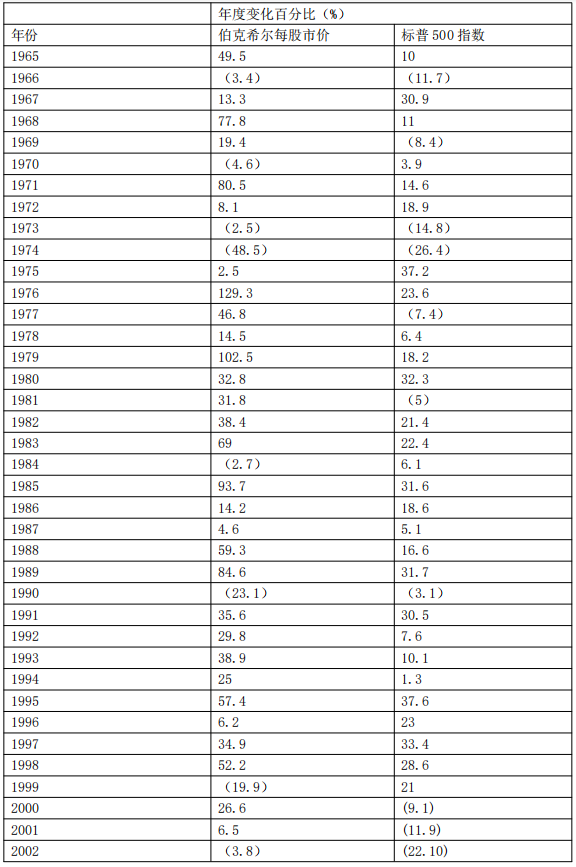
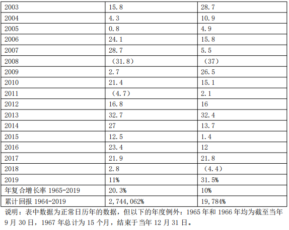
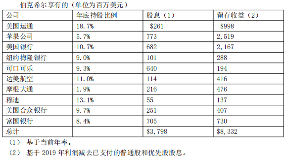
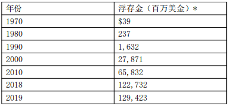
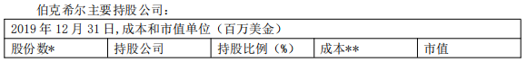
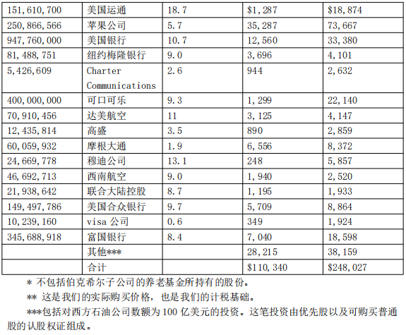

# 巴菲特致股东的信 2019

伯克希尔与标普 500 指数对比表

致伯克希尔·哈撒韦公司的股东：

伯克希尔 2019 财年基于通用会计准则（GAAP）的盈利为 814 亿美元。具体而言，这一总数当中包含 240 亿美元运营盈利，以及我们所持有股票产生的 37 亿美元已兑现资本利得和 537 亿美元的未兑现资本利得。前列所有均为税后数据。

关于这 537 亿美元利得，必须做一个补充说明。根据 2018 年生效的新版通用会计准则，一家企业所持有的证券，即便是尚未兑现的利得和亏损净变化也必须计入盈利数据。正如我们在去年股东信当中所澄清的，无论是我，还是和我一起管理伯克希尔的伙伴查理·芒格，我们对这种新规其实都持保留态度。

这种新规会被推出和采用，本质上说来，其实是标志着会计专业理念的一次重大改变。 2018 年之前，通用会计准则坚持认为，除非一家企业的生意就是证券交易本身，不然的话，投资组合当中未兑现的资本利得任何时候都不该被计入盈利，而未兑现的亏损也只有在被认为是“非暂时性”的情况下才可以计入。现在，根据新规，伯克希尔必须将这些数据计入每个季度的盈利之中，不管这些证券的涨涨跌跌不管有多么起伏不定，可能会造成怎样的影响——对于众多投资者、分析师和评论家来说，这也成了他们必须掌握的新知识。

伯克希尔 2018 年和 2019 年的具体数据其实正清楚地证明了我们对新规的判断的正当性。正如我们发布的数据所显示的，2018 年是股市遭遇不顺的一年，我们未兑现的利得缩减了 206 亿美元之多，于是我们当年度的通用会计准则盈利就只剩下了 40 亿美元。至于 2019年，如前所述，由于股票价格的上涨，我们未兑现的利得猛增了 537 亿美元，使得通用会计准则盈利达到了前面所报告的 814 亿美元。换言之，股市行情的变化使得我们的通用会计准则盈利猛增了令人瞠目结舌的 1900％！

然而，与会计世界不同的是，在我们认为的现实世界当中，伯克希尔所持有的股票总规模这两年一直保持在大约 2000 亿美元的水平，这些股票的内在价值也基本上都是在稳步而坚实地增长。

查理和我呼吁大家专注于运营盈利——我们的这一数据 2019 年较之前一年基本没有大的变化——同时不要去在意投资的季度或年度的利得或亏损，不管是已经兑现的还是尚未兑现的。

我们的这种建议绝不是忽视或贬低伯克希尔这些投资的价值。查理和我都预计，我们的股票投资，虽然其一时间表现出的具体形态可能难以预测，高度不规律，但是长期角度而言，注定会为我们创造巨大的利得。我们为何会如此乐观？下面的章节将会展开讨论。

> 保留盈利的力量

1924 年，一位名声并不是那么显赫的经济学家、理财顾问埃德加·劳伦斯 ·史密斯（Edgar Lawrence Smith）完成了一本《普通股的长期投资》（Common Stocks as Long Term Investments），这虽然只是一本薄薄的册子，但是却改变了整个投资世界的面貌。事实上，撰写这本书的经历也改变了史密斯本人，迫使他开始重新评估自己的投资信条。

刚开始写作的时候，他最初想要说明的观点是，在通货膨胀周期当中，股票的表现要好于债券，而在通货紧缩周期当中，债券的回报则好过股票。看上去，这样的观点是合情合理的。可是接下来，史密斯自己都吃了一惊。

事实上，在这本书的最开头，史密斯就承认：“这些研究本身就是对失败的记录——事实并不能支持预设的观点。”然而，这却是投资者的幸事，因为失败迫使史密斯更加深入地思考，去探索到底该如何评估股票的价值。

要把握住史密斯到底洞见了些什么，我想最好还是引述一段关于他著作的最早期评论，来自约翰·梅纳德·凯恩斯（John Maynard Keynes）：“我一直读完全书，才大致搞清楚了史密斯先生最新奇的，当然也是最重要的观点到底是什么。那些真正优秀的工业企业管理层是不会将他们每年所获的利润都全部派发给股东的，这是一个基本原则。哪怕不是所有年景，至少在好的年景下，这些企业都会留下一部分利润，将其重新投入到其业务本身。这样就创造出一种有利于可靠的工业投资的复利运营模式。经年累月，这笔可靠的工业财富的真实价值就会以复利速度增长，更不必说股东们还得到了源源不断的股息。”得到了这位经济学大家的加持，史密斯一夜成名。

在史密斯的这本著作出版之前，保留盈利的做法居然会让股东们都感到不满，这样的逻辑，今人已经很难理解了。毕竟，我们现在都知道，当年的卡耐基、洛克菲勒和福特等大家族之所以能够积累起令人瞠目结舌的巨大财富，靠的就是保留住很大一部分企业盈利，将其投入未来的成长，创造出更大的利润。事实上，不光是这些巨头们，在全美的范围内，真不知有多少具体而微的资本家们是靠着重复同样的剧本而发家致富的。

然而，事实就是，在史密斯之前的年代当中，当企业所有权被分割成无数小片——“股票”，后者的购买者们通常都将自己的投资视作是针对市场行情变动的短期赌博，往最好听里说也不过就是投机而已——真正的绅士们青睐的是债券。

不管投资者们变聪明的速度有多么迟缓，到今天，保留盈利用于再投资的数学公式都已经被大家充分理解了。曾经被凯恩斯评为“新奇”的观念，对于现在的高中生都已经是常识了——将储蓄和复利结合，就可以创造奇迹。

在伯克希尔，查理和我一直以来都高度重视有效地运用保留盈利。有些时候，这份工作其实是很轻松的，可是在另外一些时候，这份工作用“困难”来形容都嫌不足——尤其是我们面对着体量巨大，而且还在持续膨胀的现金的时候。

我们想要将自己所保留的这些资金投入使用，首选的目标就是投资于我们业已拥有的数量众多、种类繁杂的生意当中。单单在过去十年时间里，伯克希尔的折旧支出就累计达到 650 亿美元，而内部的地皮、厂房和设备投资累计更达到 1210 亿美元。再投资于运营资产永远都是我们的优先考虑对象。

此外，我们还在持续寻求买进新的企业的机会，只要后者能够符合三个标准。首先，他们运营的净有形资本必须能够创造得体的回报。其次，经理人必须是德才兼备，既有能力又诚实。最后，买进价格必须合理。

一旦我们找到了这样的企业，只要条件允许，我们都会希望将其 100％全部收购下来。遗憾的是，符合我们前面全部要求的大规模收购机会其实颇为稀有。在更多的时候，我们还是只能去把握住股市波动当中涌现出的机会，去收购那些符合标准的上市公司的大量股份，但是往往并不能达到控股的程度。

无论我们到底是如何进行的投资——是控股了这些企业，还是只通过市场购入了一大笔股权——伯克希尔的财务表现很大程度上都将取决于我们所投资的这些企业的未来盈利能力。只不过，投资者必须明白，这两种投资方式在会计层面是存在着巨大差异的。

那些我们控股的企业（具体定义为伯克希尔持有 50％以上股权），他们各自的盈利都会直接计入我们报告的运营盈利数据。各位看到的就是实实在在的盈利。

至于那些非控股企业，即我们拥有相当数量股票的企业，只有他们的股息才会被计入伯克希尔报告的运营盈利数据。当然，他们也会有自己的保留盈利，用来投入运转、创造更多附加值，但是这一切都不会从伯克希尔发布的盈利数据当中直接体现出来。

在几乎所有其他的大企业财报当中，投资者都不会看到伯克希尔这种高度重视和列出 “未实现盈利”的做法。可是，对于我们而言，这却是一项非常重大，不容忽略的内容，必须详细列出如下。

在这里，我们列出我们在股票市场上持股比重最大的 10 家企业。根据美国通用会计准则（GAAP），该表格向你分别报告了收益 —— 这些是伯克希尔从这 10 个投资对象获得的股息，以及我们在投资对象保留并投入运营的利润中所占的份额。通常，这些公司使用留存收益来扩展业务并提高效率。有时候，他们用这些资金回购自己的股票中的很大一部分，此举扩大了伯克希尔公司在其未来收益中的份额。

显然，这些我们只是部分拥有的企业，我们最终能够记录下来的已兑现利得是不会与他们保留盈利当中根据“我们”持股比例计算出的结果准确对应的。虽然遗憾，但是也不能不承认，有些时候，保留盈利也可能会无功而返。只不过，不管是根据逻辑常识，还是根据我们过往的经验，我们都更加倾向于相信，这些企业和股票最终将实现的资本利得至少会与他们保留盈利当中属于我们的份额相当，很可能还会犹有过之。（需要补充的是，当我们最终卖掉这些股票，实现利得，我们必须按照当时的税率缴纳联邦所得税，目前的适用税率为 21％。）

可以肯定地说，伯克希尔从这 10 家公司，以及我们做了股票投资的其他许多家公司所获取的回报未来还将以极不规则的形态持续呈现。有时可能是基于某家企业自身的问题，有时可能是因为股市大盘的缘故，亏损总会周期性发生。与此同时，在另外一些时间段当中，我们的利得则可能会爆炸式增长，比如去年就是个例子。整体而言，我们投资兑现的保留盈利对于伯克希尔自身价值的增长无疑是具有重大意义的。史密斯完全正确。

> 非保险业务

汤姆·墨菲（Tom Murphy）是伯克希尔的重要董事，他是史上伟大的经理人之一。很早之前，他就给过我一些有关收购的重要建议：“要获得优秀经理人的美誉，只需确保你收购的是好企业即可。”

多年来，伯克希尔收购了许多公司，最初我全部将它们视为“好生意”。” 但是，最后有些公司却令人失望，有不少简直是彻底的灾难。另一方面，有不少公司却超出了我的期望。

回顾我时好时坏的投资记录时，我得出的结论是，收购就好比婚姻：当然，一开始婚姻是令人开心的，但随后，现实开始偏离婚前的期望。美妙的是，有些时候，新婚夫妇为双方带来了超出预期的幸福。而在另外一些情况下，幻灭也来得很快。将这些画面放到公司收购上面，我不得不说，一般是收购者遇到不愉快的意外情况。在追求收购的阶段，我们总是容易满眼乐观。

按照这种类比，我想说我们的“婚姻”记录大部分还算差强人意，各方皆大欢喜，都很满意很久之前所做的决定。我们的一些合作关系如同田园般惬意。但是，有不少情况，事后很快会使我很纳闷我在“求婚”时到底在想什么，才会做出当时的决定。

幸运的是，我的许多错误导致的后果因大多数令人失望的业务所具有的特点而有所减小：随着时间的流逝，“表现不佳”的公司趋于停滞，随即进入一种状态：即它们的业务对伯克希尔资本的需要占比越来越小。与此同时，“表现良好”的公司往往会继续增长，并以有吸引力的速度找到投资更多资本的机会。由于这两种截然相反的轨迹，伯克希尔的投资胜出者使用的资产逐渐成为我们总资本的一部分。

我们拿伯克希尔最初的纺织业务为例，这是金融运作的一个极端例子。我们于 1965 年初获得了该公司的控制权，而这个陷入困境的业务几乎需要伯克希尔的全部资本。因此，在一段时间内，伯克希尔的未盈利纺织资产给我们的总体回报拖了严重的后腿。好在最终我们收购了一批“表现良好”的企业，1980 年代初的这一转变使得萎缩的纺织业务仅占去了我们一小部分资本。

如今，我们将你们的大部分资金投在能为运营所需的净有形资产带来良好乃至优异回报的可控制企业。我们的保险业务一直是佼佼者。这一业务具有特殊的特征，赋予其校准成功的独特指标，这是许多投资者不熟悉的。我们将在下一章节再作具体讨论。

在接下来的几段中，我们将各种非保险业务按收入规模分组（扣除利息、折旧、税项、非现金补偿、重组费用之后 – 所有这些令人讨厌但非常实际的成本，公司的首席执行官们和华尔街有时会告诉投资者们不要理会）。你们可在 K-6 – K-21 和 K-40 – K-52 页上阅读有关这些业务的更多信息（不在此书中）。

我们的 BNSF 铁路和伯克希尔哈撒韦能源公司（ BHE） – 伯克希尔非保险业务的两大领头羊--2019 年的共计净利润 83 亿美元（仅纳入我们占 BHE 的 91％份额），较 2018 年增长 6％。 按照盈利排名（但下文中是按字母顺序排列的），接下来的五家非保险子公司 Clayton Home、International MetalWorking、Lubrizol、Marmon 和 Precision Castpart 在 2019年的总盈利为 48 亿美元，与它们在 2018 年的收入相比变化不大。

再下来的五家子公司（Berkshire Hathaway Automotive、Johns Manville、NetJets、 Shaw 和 TTI，同样是按字母顺序排列的）2019 年的总盈利为 19 亿美元，高于 2018 年的 17亿美元。 伯克希尔拥有的其余非保险业务——此类业务有很多——2019 年的总盈利为 27 亿美元，相比之下 2018 年为 28 亿美元。&#x20;

2019 年，我们控制的非保险业务净利润总额为 177 亿美元，较 2018 年的 172 亿美元增长了 3％。收购和出售对这些结果几乎没有净影响。

我必须补充一点，强调伯克希尔公司的广泛业务范围。2011 年，我们收购了总部位于俄亥俄州的 Lubrizol 公司，这是一家在全球范围内生产和销售石油添加剂的公司。2019 年 9 月 26 日，Lubrizol 所属的一家法国大型工厂遭遇了一场大火。这场大火造成了严重的财产损失，路博润的业务也因此遭到了严重破坏。即使如此，公司的财产损失和业务中断损失将通过路博润大量的保险追偿得到缓解。 但是，正如已故的保罗·哈维（Paul Harvey）在他著名的广播节目中所说的，“接下来是故事的结局。” Lubrizol 最大的保险公司之一是伯克希尔旗下的公司。在马太福音 6： 3 中，圣经指示我们：“你施舍的时候，不要让你的左手知道右手所做的。” 你们的董事长显然是遵照了圣经的嘱咐。

> 财产/意外险&#x20;

1967 年以来，财产/意外险（P / C）业务一直是伯克希尔业绩增长的引擎。1967 年，伯克希尔以 860 万美元收购了国民保险公司（National Indemnity）及其姊妹公司国民火灾及海事保险公司（National Fire＆Marine）。如今，以净资产衡量，国民保险公司是世界上最大的财产/意外险公司。保险业务重在履行承诺，而伯克希尔履行承诺的能力是无人能比的。 我们被 P / C 业务吸引的原因之一是该行业的商业模式：P / C 保险公司先收取保费后赔付。在极端情况下，一些理赔（如接触石棉，或严重的工作场所事故）的赔付可能持续数十年。 这种“先收取保费，后赔付”的模式让 P / C 公司持有大笔资金 - 我们称之为“浮存金” - 最终会赔付给其他人。与此同时，保险公司会将这笔浮存金拿去投资获利。虽然个人的保单和理赔来来去去，但保险公司持有的保费收入相关的浮存金一般较为稳定。因此，随着保险业务的增长，浮存金也随之增长。下表所示为浮存金的具体增长情况：

我们偶尔也会遇到浮存金回落。如果浮存出现下滑，下滑幅度将是非常缓慢的 - 单一年度最多不超过 3％。我们的保险合同的性质决定了我们拥有的现金资源肯定可以满足短期或即时的偿付需求。这种结构是精心设计的，是我们保险公司无与伦比的财力的关键组成部分。这方面的能力绝不会受到冲击。 如果保费收入超过我们的费用和最终损失的总额，保险业务就实现承保利润，从而增加浮存金产生的投资收入。当赚得这样的利润时，我们就可以使用免费资金，而且更好的是，我们还会因为持有这些资金而获得回报。

对于整个财产与意外险行业而言，目前浮存金的财务价值远低于多年前。这是因为几乎所有财产与意外险企业的标准投资战略都严重且恰当地倾向于高级别债券。因此，利率变化对这些企业至关重要，而在过去十年里，债券市场提供的利率低得可怜。

由于保险公司年复一年地被迫（通过到期日或发行人赎回条款）将其“旧”投资组合转换成收益率更低的新持仓，所以保险公司也受到了影响。这些保险公司曾经可以安全地从每一美元的浮存金中赚取 5 美分或 6 美分，但现在他们只赚到 2 美分或 3 美分（如果他们的业务集中在深陷负利率泥潭的国家，甚至更少）。

一些保险公司可能会试图通过购买低质量债券或承诺高收益的非流动性“另类”投资来减少收入损失。但是，这些都是危险的游戏和活动，大多数机构都没有足够的装备参与这样的危险游戏和活动。

伯克希尔的情况总体上比保险公司要好。最重要的是，我们无与伦比的巨额资本、充裕的现金和多样化的非保险收入，使我们拥有比业内其他公司更大的投资灵活性。我们拥有很多选择，这些选择总是对我们很有利，有时会给我们提供重大的机会。 与此同时，我们的财产与意外险公司有着良好的承保记录。在过去的 17 年里，伯克希尔有 16 年实现了承保利润运营，只有 2017 年例外，当时我们的税前亏损高达 32 亿美元。在整整 17 年的时间里，我们的税前利润总计 275 亿美元，其中 2019 年实现了 4 亿美元。

这种记录并非偶然：严格的风险评估是我们保险经理日常关注的焦点，他们知道，糟糕的承保业绩可能会淹没浮存金的回报。所有保险公司都只是嘴上说说而已。但在伯克希尔，这是一种宗教，旧约风格的宗教。正如我过去一再做过的那样，我现在要强调的是，保险业的美好结局远非一件确定无疑的事情：在未来 17 年的 16 年里，我们几乎肯定不会获得承保利润。危险总是隐藏其中。

评估保险风险的错误可能是巨大的，可能需要很多年甚至几十年的时间才能显现和成熟。（想想石棉。）一场使卡特里娜飓风和迈克尔飓风相形见绌的大灾难将会发生，也许是明天，也许是几十年后。“最大的灾难”可能来自传统来源，如风或者地震，也可能是完全出乎意料的，比如网络攻击的灾难性后果超出了保险公司目前的预期。当这样的大灾难来袭时，伯克希尔就会得到它的损失份额，而且损失将会很大，非常大。然而，与许多其他保险公司不同，处理损失不会接近于耗尽我们的资源，我们将急于在第二天就增加我们的业务。

闭上眼睛，试着想象一个可能会产生动态财产与意外险保险公司的地方。纽约？伦敦？硅谷？ 威尔克斯-巴里（Wilkes-Barre）怎么样？

2012 年末，我们保险业务非常宝贵的经理阿吉特-杰恩（Ajit Jain）打电话告诉我， 他将以 2.21 亿美元（约合当时公司的资产净值）的价格收购宾夕法尼亚州那个小城的一家小公司 - GUARD Insurance Group。他还说，GUARD 首席执行官-福格尔（Sy Foguel）将成为伯克希尔的明星。GUARD 和都是我的新名字。

转眼之间：2019 年，GUARD 的保费收入达到 19 亿美元，较 2012 年增长了 379％，承保利润也令人满意。自从加入伯克希尔以来，带领公司进入了新产品和新地区，并将 GUARD的浮存金增加了 265％。 1967 年，奥马哈似乎不太可能成为一个财产与意外险的巨头跳板。威尔克斯-巴里很可能会带来类似的惊喜。

> 伯克希尔哈撒韦能源公司（BHE）&#x20;

伯克希尔哈撒韦能源公司正在庆祝其在我们旗下的第 20 个年头。周年纪念日表明我们应该在赶超公司的成就。

我们就从电价这个话题开始。当伯克希尔在 2000 年进入公用事业领域时，它收购了 BHE 76％的股份，该公司在爱荷华州的居民客户的平均千瓦时电价为 8.8 美分。自那之后，居民客户的电价每年上涨不到 1％，我们承诺，到 2028 年，基本电价不会上涨。相比之下，爱荷华州另一家大型投资公司的情况是：去年，该公司对居民客户收取的电价比 BHE 高出 61％。最近，公用事业公司的费率上涨，将使这一差距扩大到 70％。

我们和他们之间的巨大差异很大程度上是由于我们在将风能转化为电能方面取得的巨大成就。2021 年，我们预计 BHE 在爱荷华州的运营将通过其拥有和运营的风力涡轮机产生约 2520 万兆瓦时的电力。这样的电力产量将完全满足其爱荷华州客户的年度需求，其约为2460 万兆瓦时。换句话说，我们的公用事业公司将在爱荷华州实现风能自给自足。

与此形成鲜明对比的是，爱荷华州的另一家公用事业公司，风力发电不足总发电量的 10％。此外，据我们所知，到 2021 年，无论在哪里，其他投资者拥有的公用事业公司都不可能实现风能自给自足。2000 年，BHE 服务于农业经济；如今，它的五大客户中有三个客户是高科技巨头。我认为，他们在爱荷华州建厂的决定部分是基于 BHE 提供可再生、低成本能源的能力。

当然，风是断断续续的，我们在爱荷华州的叶片只转动了部分时间。在某些时段，当空气静止时，我们依靠非风力发电的能力来保证我们所需的电力。在情况相反的时候，我们将风能提供给我们的多余电力卖给其他公用事业公司，通过所谓的“电网”为他们服务。我们卖给他们的电力替代了他们对碳资源的需求，比如煤或者天然气。

伯克希尔哈撒韦目前与小沃尔特-斯科特（Walter Scott， Jr.）和格雷格-阿贝尔（Greg Abel）共同持有 BHE 91％的股份。自从我们收购以来，BHE 从未向伯克希尔哈撒韦支付过股息，而且随着时间的流逝，BHE 保留了 280 亿美元的盈利。这种模式在公用事业领域是个例外，公用事业公司通常会支付高额股息，有时甚至超过 80％的盈利。我们的观点是：我们可以投资的越多，我们就越青睐它。

今天，BHE 拥有运营人才和经验来管理真正的大型公用事业项目，这些项目需要 1000亿美元或更多的投资，能够支持造福我们的国家、我们的社区和我们的股东的基础设施。我们随时准备、愿意和有能力接受这样的机会。

> 股票投资&#x20;

以下所列出的是截至去年年底我们所持市值最大的 15 只普通股。在此，我们排除了卡夫亨氏的持股（325442152 股），因为伯克希尔本身只是控股集团的一部分，所以必须用“股权”的方法来解释这笔投资。在伯克希尔的资产负债表上，若按通用会计准则计算，伯克希尔所持卡夫亨氏的股份价值 138 亿美元，相当于 2019 年 12 月 31 日伯克希尔在卡夫亨氏经审计的净值中所占份额。到去年年底，我们在卡夫亨氏的持股市值仅为 105 亿美元。

查理和我都没有把以上这些股票（总计持股市值 2480 亿美元）当作是精心收集的潜力股。当前这场金融闹剧将要结束，因为“华尔街”的降级、美联储可能采取的行动、可能出现的政治动向、经济学家的预测，或者其他任何可能成为当前热门话题的东西，都将终止这场闹剧。

相反，我们把这些公司看作是一个我们进行部分持股的集合。若按加权计算，这些公司运营业务所需的有形净资产净利超过 20％。这些公司不需要过度举债就可以盈利。

在任何情况下，那些规模巨大、成熟且易于理解的企业的订单回报率都是引人瞩目的。与很多投资者在过去十年里所接受的债券回报率（比如说 30 年期美国国债的收益率是 2.5％或更低）相比，这些公司的回报率的确令人感到兴奋。

查理和我从来不喜欢玩预测利率的游戏，因为我们不知道未来一年、十年或三十年里利率的平均值是多少。我们或许有些偏见地认为，在这个话题上发表意见的权威人士，恰恰是通过这种行为，透露出的更多的是和他们自己有关的信息，而不是关于未来的信息。

我们可以说的是，如果在未来几十年里和当前利率接近的利率占上风，公司税也维持在企业当下正在享受着的低水平，那么几乎可以肯定的是，随着时间的推移，股票的表现将远远好于长期固定利率债务工具。

在给出这一乐观预测的同时，我们也要发出一项警告：未来股价可能会发生任何变化。有时，股市会暴跌，幅度可能是 50％，也可能会更大。但是，对于那些不用借钱来炒股、且能够控制自己情绪的人来说，去年我曾在文章中写过的“美国经济顺风车”，再加上史密斯所谓的“复合奇迹”，会助推股票成为更好的长期选择。其他人呢？当心！

> 未来的路

30 年前，我的朋友约瑟夫·罗森菲尔德（家住美国中西部），收到了当地一家报纸发来的一封信。这封信让罗森菲尔德很恼火，当时他已经 80 多岁了。报纸直截了当地要求乔提供一些生平数据，准备在他去世后用在他的讣告中。罗森菲尔德没有回信。接下来怎么样呢？1 个月后，他收到了那家报纸发来的第二封信，而且还是封加急信。

查理和我很早就已经进入了类似的“加急”阶段。对于我们来说，这显然不是什么喜讯。但是，伯克希尔的股东们不必焦虑：你的公司已经为我们的离开做好了百分百的准备。

我们之所以如此乐观，主要基于五大原因： 第一，伯克希尔的资产部署在各种各样的全资或部分拥有的企业身上，这些企业的资本回报率很吸引人。 第二，伯克希尔将旗下所控制业务定位在一个单一实体，这种现状赋予了该公司一些重要且持久的经济优势。 第三，伯克希尔将一如既往地以一种可让本公司抵御极端外部冲击的方式来管理财务事务。 第四，我们拥有经验丰富且忠心耿耿的顶尖经理人。对于他们来说，管理伯克希尔远远不止是一份高薪和/或有声望的工作。 第五，伯克希尔的董事们——你们的监护人——一直专注于股东的福利，以及培育一种在超大型企业中很罕见的文化。（拉里-坎宁安和斯蒂芬妮-古巴在合著的新书《信任的边缘》中探讨了这种文化的价值。在我们的年会上，可以看到这本书。） 还有一些特别实际的原因促使查理和我想要确保伯克希尔在我们离开后的日子里继续繁荣昌盛：芒格家族持有的伯克希尔股票规模，远超过该家族的其他投资；我高达 99％的净身价靠的是伯克希尔股票。我从来没有卖过伯克希尔股票，以后也不打算这么做。

除了慈善捐赠和送人小礼物之外，我唯一一次动过伯克希尔股票，是在 1980 年。当年，我和其他被选出的伯克希尔股东们，用伯克希尔的一些股票换了伊利诺斯州一家银行的股票。早在 1969 年，伯克希尔收购了这家银行。1980 年，因为银行控股公司法的变化，我们必须卸载该行。

今天，我在遗嘱中已经明确指明了执行人——以及在遗嘱关闭后接替他们管理我的遗产的受托人——不要出售伯克希尔股票。我的遗嘱还免除了遗嘱执行人和受托人的责任，因为他们要维持的显然是极度集中的资产。

根据我的遗嘱，执行人以及受托人每年会将我的一部分 A 股转换成 B 股，然后将 B 股分发给不同的基金会。这些基金会将被要求迅速分配所获得的捐款。总的来说，据我估算，在我去世 12 年-15 年后我所持有的伯克希尔股票会进入市场。

没有我遗嘱的指令，直到安排好的分配日期之前，我所持有的所有伯克希尔股票应该不会易主。在安排好的日期，我的遗嘱执行人和受托人将会在他们的临时控制下出售伯克希尔股票，并且对到期的美国国债进行再投资。这样的策略将使受托人免受公众的批评，也免于因未能按照“谨慎的人”标准行事而承担个人责任的可能性。

我本人感到安心的是，在处置期内，伯克希尔的股票将可提供一种安全的、有回报的投资。也许会发生一些事件证明我是错的，这种可能性总是存在的——可能性不大，但也不能忽略不计。但我相信，与传统的行动方案相比，我的指示很可能会为社会提供更多的资源。

就我“只限伯克希尔”的指示而言，其关键在于我对伯克希尔的董事们未来的判断力和忠诚度抱有信心。他们经常都会面临华尔街人士的考验，与其争夺服务费。对许多公司来说，这些华尔街“超级销售员”可能会胜出。但我预计，在伯克希尔不会出现这种情况。

董事会 近年以来，企业董事会的构成及其宗旨都已成为人们关注的热点问题。在以前，有关董事会责任的争论在很大程度上仅限于在律师们之间展开；而在今天，机构投资者和政治家们也加入了进来。

就讨论企业治理的问题而言，我的资历包括，在过去 62 年时间里，我曾担任 21 家上市公司（详见下文横线以下部分）的董事。除了两家公司之外，我在其他公司中都持有并代表着大量股权。在少数公司中，我曾试图实施重要的改变。

在我服务于这些公司的最初 30 年左右的时间里，董事会中很少会有女性，除非她代表着企业的控股家族。应该指出的是，今年是第 19 修正案出台 100 周年，该修正案保障了美国妇女投票发声的权利。她们在董事会中获得类似地位的工作则仍在进行中。

多年以来，许多有关董事会组成和职责的新规则和指导方针已经出台。然而，董事们面临的根本挑战一如既往：找到并留住一位才华横溢的首席执行官——当然，还需要诚实正直的品质——并将自己的整个商业生涯都奉献给公司。通常情况下，这项任务是艰巨的。但是，一旦董事们做对这件事情，其他就什么都不用做了。但是，如果他们搞砸了这件事........

审计委员会会比以往更加努力地工作，并且几乎总是以严苛的态度看待这项工作。尽管如此，但是这些委员会的目标与管理者的期望不符，这实际上是一种“犯罪行为”，因为收益“指导”的祸害和首席执行官“达到预期数字”的愿望鼓励了这一行为。 根据我与曾与公司数字 CEO 打交道的直接经验（谢天谢地，只是有限的经验）表明，更多情况下，他们通常是自我推动，而不是出于对经济利益的渴望。

薪酬委员会现在比以往更多地依赖顾问。 因此，补偿安排变得更加复杂-哪个委员会成员能够解释为一个简单的计划年复一年地支付大笔费用？而且阅读代理材料已成为一种令人麻木的经历。

公司治理方面的一项非常重要的改进已得到授权：定期组织董事“执行会议”，禁止首席执行官参加。 在此之前，很少有关于首席执行官的职能，收购决策和薪酬的坦率讨论。

收购提案对于董事会成员而言仍然是一个特别棘手的问题。 进行交易的法律流程已得到完善和扩展。 但是我还没有看到渴望进行收购的首席执行官会招来一位熟悉内情且理智的批评家来反对他。是的，这一点也包括我在内。

***

伯克希尔、蓝筹印花、资本城-ABC、可口可乐、Data Documents、Dempster、General Growth、吉列、卡夫亨氏、Maracaibo Oil、Munsingears、奥马哈国民银行、Pinkerton’s、Portland Gas Light、所罗门公司、Sanborn Map、Tribune Oil、美国航空、Vornado、华盛顿邮报公司、Wesco Financial。（巴菲特担任过董事的公司）

总体而言，如今台面上摆满了首席执行官和他/她员工们喜闻乐见的交易方案。对于一家公司来说，聘请两名“专家”收购顾问（一名赞成，一名反对）向董事会传达他或她对拟议中交易的看法将是一项有趣的做法。比方说，最终意见获得采纳的顾问将获得另一位顾问酬劳的 10 倍作为奖励。但不要屏息等待这项改革（的到来）：当前的制度，无论对股东来说有什么缺点，对首席执行官和许多享受交易的顾问和其他专业人士来说都非常有效。当我们考虑到华尔街的建议时，一个古老的警告永远是正确的：不要问理发师你是否需要理发。

多年来，董事会“独立性”已成为一个新的值得关注的话题。然而，与这个话题相关的一个关键点几乎总是被忽视，那就是董事薪酬现在飙升到了一个水平，一个不可避免地使薪酬成为影响许多并不富裕董事成员潜意识行为的水平。试想一下，一位董事一年六次左右，花上几天“舒适”时间开董事会会议，收入就可以在 25 万至 30 万美元之间。通常，拥有一个这样董事职位人的收入是美国家庭年收入中位数的三到四倍（我曾错过了这样一个富足的机会：在 20 世纪 60 年代初，作为 Portland Gas Light 的董事，我每年的服务报酬为 100美元。为了赚到这笔可观的收入，我每年需要往返缅因州四次）。

现在（董事）工作有保障吗？是的。董事会成员可能会被“礼貌地”忽视，但他们却很少被解雇。取而代之的是，相当宽松的年龄限制（通常是 70 岁或更高）被视为是礼貌驱逐公司董事的标准行事方法。

难怪一位不富有的董事（non-wealthy director，简称“NWD”）现在希望、甚至渴望被邀请加入第二家公司的董事会，从而帮助自己跃升至 50-60 万美元的收入阶层。为了实现这一目标，NWD 将需要一些帮助。一家寻找董事会成员的公司 CEO 几乎肯定会向 NWD 的现任 CEO 核实 NWD 是否是一个“好”董事。当然，所谓的“好”只是个暗号。如果 NWD 严重挑战他/她现任 CEO 的薪酬或收购梦想，他/她的（董事）候选人资格将悄无声息地抹去。在寻找董事时，首席执行官们并不是在寻找斗牛犬，只有可卡犬会被带回家。

尽管不合逻辑，但如今几乎所有董事都被归类为“独立（董事）”，然而许多拥有与公司兴衰密切相关的董事又被认为缺乏这一独立性。不久前，我查看了一家美国大公司的委托书材料，发现有 8 名董事从未用自己的钱购买过该公司股票（当然，他们得到了股票奖励，作为自己丰厚现金薪酬的补充）。这家公司长期以来一直（表现）落后，但董事们待遇却非常好。

当然，用自己的钱购买所有权并不能创造智慧，也不能确保商业成功。然而，当我们投资组合内公司的董事有用他们自己钱购买股票的经验，而不是简单地获赠时，我会感觉更好。 在这里，我应该停顿一下：我想让你知道，这些年来我见过的几乎所有董事都很像样、讨人喜欢且聪明。他们衣着光鲜，是好邻居、也是好公民，我很享受他们的陪伴。在这群人中，有一些人如果不是因为我们共同的董事会服务，我是不会认识他们的，他们如今已经成为了我亲密的朋友。

然而，这些善良的人中有许多是我永远不会选择来处理金钱或商业事务的人。因为这根本不是他们的游戏场。

反过来，他们也永远不会在拔牙、装修房子或改善高尔夫球技方面向我求助。此外，如果我被安排在“与星共舞”（Dancing With The Stars）节目中露面，我会立即寻求证人保护计划的庇护。我们总会在这件事或那件事上无所建树。对于我们大多数人来说，这个（无所建树的）清单很长。但需要认识到的重要一点是，如果你是鲍比·费舍尔（Bobby Fischer，美国国际象棋棋手），你必须为了钱而下棋。

在伯克希尔，我们将继续寻找精通商业的董事，他们以主人翁精神为导向，并对我们的公司有强烈的特定兴趣。思想和原则，而不是机器人般的“流程”将指导他们的行动。当然，在代表你的利益（进行投资）时，他们会寻找用心取悦客户、珍惜自己同事、努力成为自己所在社区和国家好公民的经理人。 这些目标并不新鲜。这是 60 年前有能力 CEO 们的目标，现在仍是如此。否则又有谁该具备这些能力呢？

其他内容 在过去的报告中，我们已经讨论了股票回购的意义和无用性。我们的想法归结为：伯克希尔只有在以下情况下才会回购股票：a）查理和我认为它的售价低于其价值，以及 b）公司在完成回购后，仍会拥有充足的现金。

（股票）内在价值的计算很不精确。因此，我们两人都没有对以非常真实的 95 美分购买估值为 1 美元的商品感到任何紧迫性，。2019 年，伯克希尔的价格/价值等式有时是适度有利（股票回购）的，我们花了 50 亿美元回购了公司约 1％的股份。

随着时间的推移，我们希望伯克希尔的股票数量下降。如果股价低于实际价值的情况（正如我们估计的那样）继续发生，我们很可能会在回购股票上变得更加积极。然而，我们不会在任何水平支撑股价。

持有价值至少 2000 万美元 A 类股或 B 类股，并有意向伯克希尔出售股票的股东可能希望他们的经纪人联系伯克希尔的马克·米勒德（Mark Millard），电话是 402-346-1400。我们需要您在打定主意出售股票的情况下，在中部时间上午 8：00-8：30 或下午 3：00-3： 30 之间给马克打电话。

2019 年，伯克希尔向美国财政部汇出 36 亿美元，用于支付当前所得税。同期，美国政 府收到了 2430 亿美元的企业所得税。从这些统计数据中，你可以为你的公司缴纳了美国所有公司缴纳联邦所得税的 1.5％而感到自豪。

55 年前，当伯克希尔进入当下的企业集团结构时，公司无需缴纳联邦所得税（这也是有充分理由的：因为在此前十年里，这家苦苦挣扎的企业录得净亏损）。从那时起，由于伯克希尔保留了几乎所有的收益，这项政策的受益者已不仅仅是公司股东，联邦政府也同样受益。（因为）在未来的大部分时间里，我们都希望并期待着向财政部上缴更大的金额。

在 A-2-A-3 页（不在此书中），您可以找到我们将于 2020 年 5 月 2 日举行年会的详细情况。像往常一样，雅虎将在全球范围内直播这一活动。然而，我们的形式将有一个重要的变化：股东、媒体和董事会成员建议，让我们的两位关键运营经理阿吉特·贾因（Ajit Jain）和格雷格·阿贝尔（Greg Abel）在年会上有更多的曝光率。这一变化非常有意义。无论是作为经理人还是个人，他们都是杰出的个体，你应该从他们那里听到更多。

今年发送问题给我们三名长期任职新闻人员的股东可以指定向阿吉特或格雷格提出问题。就像查理和我一样，他们也将完全不知道这些问题是什么。 记者将与观众轮流提问，观众也可以直接向我们四个人中的任何一个提问。所以，请擦亮你的獠牙。

今年 5 月 2 日，欢迎来奥马哈。在这里见见你的资本家同行，购买一些伯克希尔产品，尽情享受。查理和我，还有整个伯克希尔家庭都期待着见到你。

2020 年 2 月 22 日

沃伦.巴菲特。

董事局主席
