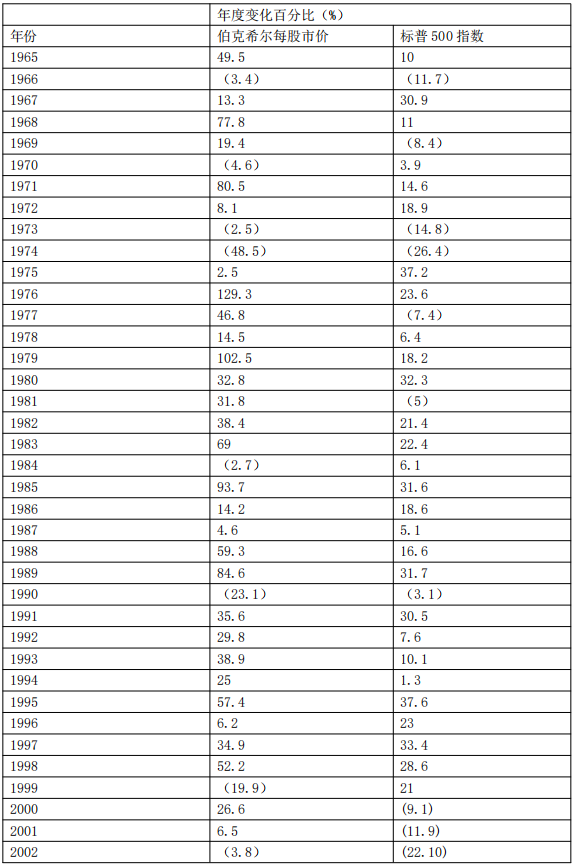
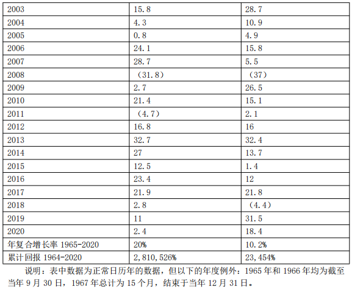
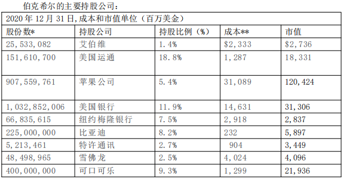
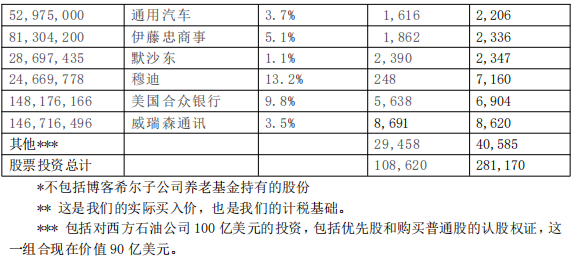

# 巴菲特致股东的信 2020

伯克希尔与标普 500 指数对比表

致伯克希尔·哈撒韦公司的股东: 根据公认会计原则（GAAP），伯克希尔在 2020 年的全年净利润为 425 亿美元，这其中包括 219 亿美元的营业利润，资本利得利润的 49 亿美元，来自我们持有的股票中未实现的净资本利得增加的267 亿美元收益，以及一些亏损子公司和附属企业110 亿美元的价值减记，所有项目均在税后基础上列示。

营业利润是最重要的，即使它们不是我们公认会计准则总额中最大的项目。但伯克希尔的重点是增加这部分收入和收购大的有利位置的业务。但去年，我们两个目标都没有实现:伯克希尔没有进行大规模收购，营业利润下降了 9％。不过，通过保留收益和回购约 5％的股票，我们确实提高了伯克希尔的每股内在价值。 与资本利得或损失（无论是已实现或未实现）相关的两个公认会计准则组成部分每年都在反复波动，反映了股票市场的波动。无论今天的数据如何，我和我的长期合作伙伴查理·芒格都坚信，随着时间的推移，伯克希尔的投资收益将是可观的。

正如我多次强调的那样，查理和我将伯克希尔持有的上市股票（年底价值 2,810 亿美元）视为一个企业集合。我们并不控制这些公司的运营，但我们确实按比例分享了它们的长期繁荣。然而，从会计的角度来看，我们的那部分利润并没有包括在伯克希尔的收入中。相反，只有这些投资者支付给我们的股息才会被记录在我们的账簿上。根据公认会计准则，投资者代表我们保留的巨额资金变得无形。

然而，看不见的不应该不去想：那些未记录的留存收益通常正在为伯克希尔创造大量的价值。被投资企业利用扣留的资金扩大业务收购，偿还债务，通常还会回购股票（这一行为增加了我们在他们未来收益中所占的份额）。正如去年文中指出的那样，留存收益在整个美国历史上推动了美国企业的发展。对卡内基和洛克菲勒起作用的方法多年来对数百万股东也起了作用。

当然，我们的一些投资公司会让人失望，他们保留收益的做法几乎不会增加公司的价值。但其他公司会超额完成任务，其中少数公司表现出色。总而言之，我们预计自己在伯克希尔非控股业务（别人会认为是我们的股票投资组合）留存的巨额收益中所占的份额，最终会给我们带来等量或更多的资本利得。在我们 56 年的任期中，这一期望得到了满足。

我们 GAAP 数据的最后一个组成部分——丑陋的 110 亿美元减记。几乎完全是我在 2016年犯的一个错误的量化。那一年，伯克希尔收购了 Precision Castparts（“PCC”），我为这家公司花了太多钱。没有人以任何方式误导我——我只是对 PCC 的正常盈利潜力过于乐观。去年，作为 PCC 最重要的客户来源，整个航空航天业的不利发展，暴露了我的误判。

在收购 PCC 的过程中，伯克希尔收购了一家很好的公司——公司业务中最好的一家。PCC的首席执行官马克多尼根是一位充满激情的经理，他一如既往地将同样的精力投入到我们收购之前的业务中。我们很幸运有他来管理。

我认为我的结论是正确的，PCC 将随着时间的推移，在其运营中部署的净有形资产上获得良好的回报。然而，我对未来平均收益的判断是错误的，因此，我也就错误地计算出了为企业支付的合理价格。PCC 远非我犯的第一个错误，但这是一个大问题。

伯克希尔有两条盈利的线路 伯克希尔哈撒韦经常被贴上“综合企业集团”的标签，这是一个贬义词。综合企业集团指的是拥有大量不相关业务的控股公司。是的，这是对伯克希尔的描述——但只是部分。为了理解我们如何以及为什么不同于原型企业集团，让我们回顾一下历史。

长期以来，综合企业集团通常会局限于收购整个企业。然而，这一战略带来了两个主要问题。有一个问题是无法解决的：大多数真正伟大的企业都无意让任何人接管它们。因此，渴望收购的企业集团不得不专注于那些缺乏重要和持久竞争优势的一般公司，那不是一个钓鱼的大池塘。

除此之外，当联合企业陷入这个平庸的业务领域时，他们常常发现自己需要支付惊人的 “控制权”溢价，以诱捕他们的猎物。有抱负的企业集团知道如何解决这个“超额支付”的问题：他们只需要制造出自己估值过高的股票，作为昂贵收购的“货币”。（“我愿意花 1万美元买你的狗，把我给你两只价值 5000 美元猫。”）

通常，促进企业集团股票估值过高的手段包括促销手段和“富有想象力的”会计操作，往好了说也不过是欺骗性的，有时甚至会越界成为欺诈。当这些招数“成功”后，这家企业集团就会把自己的股票推高到商业价值的三倍，以达到这样的目的让目标物的价值翻倍。

投资幻想可以持续相当长的时间。华尔街喜欢交易产生的费用，而媒体喜欢丰富多彩的推广者提供的故事。同样在某一点上，一只被推销的股票飙升的价格本身也可以成为一种错觉就是现实的“证据”。

当然，最终聚会结束了，许多商业“皇帝”被发现没有穿衣服。金融史上充满了著名的企业集团的名字，他们最初被记者、分析师和投资银行家奉为商业天才，但他们的作品最终却成了商业垃圾场。但最终这些可怕的名声被赋予了联合企业。

查理和我希望我们的企业集团是一个具有良好经济特征和优秀经理人的多元化企业集团。而伯克希尔是否控制这些业务对我们来说并不重要。

我花了好一会儿才明白过来。但查理以及我接手纺织业务 20 年的经历——最终让我相信，与 100％掌控一家挣扎在边际的企业相比，拥有一家出色企业的非控制部分更有利可图，更令人愉快，而且工作量也少得多。

基于这些原因，我们的企业集团将继续由控制和非控制业务组成。查理和我会根据一家公司持久的竞争优势，管理能力和特点，以及价格，把资金配置到我们认为最合理的地方。

如果这一战略不需要我们付出多少努力，那就更好了。这与跳水比中使用的计分系统不同，你在商业活动中不会因为“难度”而得分。正正如罗纳德·里根曾告诫的那样:“’努力从来不会死人，但是为什么要冒险？

> 家族珠宝以及我们如何增加珠宝份额&#x20;

在开篇第一页，我们列出了伯克希尔旗下的子公司，这些公司截止年底雇佣了 36 万名员工。您可以在本报告后面的 10-K 中（不在本书中）阅读更多关于这些受控操作的信息。我们在我们部分拥有但不控制的公司中的主要头寸列在这封信的第 7 页（后面的投资组合表格）。这种业务组合也非常庞大和多样化。

伯克希尔的大部分价值存在于四家公司，其中三家公司为控股公司，还有一家是我们仅持有 5.4％的股权。有趣的是这四家公司都是珠宝行业。

价值最大的是我们的财产/意外险业务，53 年来一直是伯克希尔的核心业务。我们的家族保险在保险领域是独一无二的。管理这些的是经理阿吉特杰恩，他于 1986 年加入伯克希尔。

总的来说，保险公司的运营资金远远超过其全球竞争对手。这种财务实力，加上伯克希尔每年从其非保险业务中获得的巨额现金流，使我们的保险公司能够安全地遵循股权重的投资策略，这对绝大多数保险公司来说是不可行的。那些竞争对手，出于监管和信用评级的原因必须关注债券。

现在债券也不是好去处。你能相信最近 10 年期美国国债的收益——年底的收益率是 0.93％——比 1981 年 9 月的 15.8％的收益率下降了 94％吗？在某些重要的大国，如德国和日本，投资者从数万亿美元的主权债务中获得负回报。全球范围内的固定收益投资者——无论是养老基金、保险公司还是退休人员——都面临着暗淡的未来。

一些保险公司以及其他债券投资者，可能会试图通过将转移投资来刺激目前可怜的回报，他们购买由摇摇欲坠的借款人支持的债务。然而，高风险贷款并不是解决利率不足问题的办法。30 年前，一度强大的储蓄和贷款行业毁了自己，部分原因就是忽视了这条箴言。伯克希尔现在拥有 1380 亿美元的保险“浮动”资金——这些资金不属于我们，但我们可以配置，包括债券、股票还是美国国库券等现金等价物。流通股与银行存款有一些相似之处：保险公司每天都有现金进进出出，保险公司持有的现金总额变化很小。伯克希尔持有的巨额资产很可能会在未来许多年保持在目前的水平，而且累积起来可以看成是一直不花钱的。但是随着时间的推移，这个令人高兴的结果可能会改变。

在我每年给你们的信中，我已经重复地有些人可能会说没完没了的解释我们的保险业务。因此，今年我希望更多了解我们保险业务和"浮动"的新股东阅读 2019 年报告的相关部分。重要的是您要了解我们从事保险业务所存在的风险和机会。

我们第二和第三大最有价值的资产是伯克希尔对美国最大铁路公司BNSF 的 100％持股，以及我们对苹果公司 5.4％的持股。排名第四的是我们持有 91％的伯克希尔哈撒韦能源公司 （BHE）。这是一个非常不同寻常的公用事业公司，在我们拥有它的 21 年里，它的年收入从 1.22 亿美元增长到了 34 亿美元。

我将更多关于 BNSF 和 BHE 在这封信的后面。现在，我想把重点放在伯克希尔会定期使用的一种做法上，以提高你对它的“四大”以及伯克希尔拥有的许多其他资产的兴趣。

去年，我们回购了 80,998 股伯克希尔 A 类股，总共花费 247 亿美元，展示了我们对伯克希尔资产扩张的热情。而这一行动使你在伯克希尔旗下所有企业的持股比例增加了 5.2％，而你根本不需要动动钱包。

按照查理和我长期以来推荐的标准，我们进行了这些收购。因为我们相信，它们既能持续提高持股人的每股内在价值，也能让伯克希尔拥有充足的资金，应对可能遇到的任何机会或问题。

我们绝不认为伯克希尔的股票应该以任何价格回购。我之所以强调这一点，是因为美国的 CEO 们有过这样一个尴尬的记录：在股价上涨时，他们投入更多的公司资金用于回购，而不是股价下跌时。我们的做法恰恰相反。

伯克希尔对苹果的投资生动地说明了回购的力量。我们从 2016 年末开始购买苹果股票，到 2018 年 7 月初，我们持有的苹果股票（经拆股调整后）略多于 10 亿股。说到这里，我指的是伯克希尔总账户中持有的投资，而不包括随后被出售的非常少的、由单独管理的苹果股票。当我们在 2018 年年中完成收购时，伯克希尔的一般账户持有苹果 5.2％的股份。

我们的投资成本是 360 亿美元。从那以后我们享受了定期股息，平均每年约 7.75 亿美 元。而且在 2020 年，通过出售我们头寸的一小部分还获得了额外的 110 亿美元。

尽管有增幅——伯克希尔目前持有苹果 5.4％的股份。但这一增长对我们来说是没有成本的，因为苹果一直在回购其股票，从而大幅减少了目前的流通股票数量。

但这还远远不是所有的好消息，因为我们还在回购了伯克希尔的股票。与 2018 年 7 月相比，你现在间接持有的苹果资产和未来收益比例整整高出 10％。

而且这种令人愉快的动态仍在继续。伯克希尔自去年年底以来回购了更多股票，未来可能会进一步这样做，而且苹果也公开表示有意回购其股票。随着这些削减的发生，伯克希尔的股东不仅在我们的保险集团、BNSF 和 BHE 中拥有更大的利益，而且还会发现他们对苹果的间接所有权也在增加。

回购的数学计算慢慢地进行，但随着时间的推移可能会变得强大。这一过程为投资者提供了一种简单的方式，让他们拥有不断扩大的特殊企业份额。正如性感的梅·韦斯特向我们保证的那样:“好东西越多越美好。”

> 投资&#x20;

下面我们列出了截止 2020 年年底的 15 笔市值最大的普通股投资。这里不包括我们持有的卡夫亨氏 325,442,152 股，因为它是伯克希尔集团的一部分，必须使用“权益”法来计算这笔投资。

在伯克希尔的资产负债表上，卡夫亨氏持有的卡夫亨氏资产按公认会计准则计算为 133亿美元，这一数字代表伯克希尔在 2020 年 12 月 31 日经审计的卡夫亨氏资产净值中所占的份额。但请注意，那天我们股票的市值只有 113 亿美元。

《双城记》 美国到处都有成功的故事。自诞生以来，那些有理想、有抱负。但往往只有很少的人通过创造新事物或改进旧事物取得了超出他们梦想的成功。

查理和我走遍全国，与这些人或他们的家人团聚。在美国西海岸，我们从 1972 年购买喜诗糖果开始了这一惯例。一个世纪前，玛丽开始推出一种古老的产品，她用特殊的配方对其进行了改造。除了她的商业计划之外，她还开设了一些古色古香的商店，里面配有友好的销售人员。她在洛杉矶开的第一家小专卖店最终开了几百家店，遍布整个西部。

今天，她的作品继续取悦客户，同时为成千上万的男女提供终身就业机会。伯克希尔的工作就是不干涉公司的成功。当企业生产和分销一种非必需的消费品时，客户就是老板。100年后，客户向伯克希尔传递的信息依然清晰:“不要乱动我的糖果。”

让我们跨越大陆来到华盛顿特区。1936 年，利奥·古德温和他的妻子开始相信，汽车保险——一种通常从代理商那里购买的标准化产品——可以直接以低得多的价格出售。两人拿着 10 万美元，与拥有 1000 倍甚至更多资本的大型保险公司展开了较量。政府雇员保险公司（后来简称为 GEICO）也在发展之中。

幸运的是，我在整整 70 年前就发觉到了这家公司的潜力。它立刻成为了我的初恋（投资方面的）。接下来的故事大家都知道了：伯克希尔最终成为了 GEICO 的 100％所有人，这家 84 岁高龄的公司一直在调整，但从未改变利奥和妻子的愿景。

然而，这家公司的规模发生了变化。1937 年也就是 GEICO 运营的第一个全年，它完成了 238,288 美元的业务。这个数字在去年变成 350 亿美元。

如今，许多金融、媒体、政府和科技都位于沿海地区，人们很容易忽视美国中部发生的许多奇迹。让我们关注两个地区，它们将给所有人提供令人惊叹的例证。

我们从奥马哈开始，相信不会感到惊讶。

1940 年，毕业于奥马哈中心高中（也是查理、我父亲、我第一任妻子、我们的三个孩子和两个孙儿的母校）的杰克·林格沃特（Jack Ringwalt）决定用 125000 美元的资本创办一家财产/意外保险公司。

杰克的梦想是荒谬的，给自己的小公司起了一个有点浮夸的名“国民保险公司”——与大型保险公司竞争，而这些保险公司都拥有充足的资本。此外，这些竞争对手凭借遍布全国的、资金雄厚的、历史悠久的当地代理商网络而牢固地确立了自己的地位。在杰克的计划中，国民保险会使用任何屈尊接受它的机构，因此在收购业务时没有成本优势，这些与 GEICO不同。为了克服这些可怕的障碍，“国民保险”将重点放在了被“大公司”认为不重要的“古怪”风险上。这一策略出人意料地成功了。

杰克诚实、精明、讨人喜欢，还有点古怪。他尤其不喜欢监管机构。当他对他们的监督感到厌烦时，他就会有卖掉公司的冲动。

幸运的是，有一次我就在附近。杰克喜欢加入伯克希尔的想法。于是我们在 1967 年达 成了一笔交易，只用了 15 分钟就达成了协议，而且我从来没要求过审计。

今天，国民保险公司是世界上唯一一家准备为某些巨大风险承保的公司。它的总部仍然在奥马哈，距离伯克希尔的总部只有几英里。

多年来，我们又从奥马哈家族手中收购了四家企业，其中最著名的是内布拉斯加州家具市场（“NFM”）。该公司的创始人罗斯·布卢姆金（Rose Blumkin）说：1915 年作为一名俄罗斯移民来到西雅图，既不会读也不会说英语。几年后她定居在奥马哈，到 1936 年她攒下了 2500 美元，用这笔钱开了一家家具店。

竞争对手和供应商忽视了她，而且一段时间内他们的判断似乎是正确的：第二次世界大战让她的生意停滞了。截止 1946 年底，公司的净资产仅增长到 72,264 美元。将不论是在收银台里还是在存款里现金加起来，总共是 50 美元（不是打错字）。

然而，有一笔无价的财富没有在 1946 年的数字中记录：Rose Blumkin 夫人唯一的儿子路易·布卢姆金（Louie Blumkin）在美国军队服役四年后重新加入了这家商店。路易在诺曼底登陆日之后的奥马哈海滩作战中负伤，并赢得了紫心勋章，最终他在 1945 年 11 月乘船回国

当 Rose Blumkin 夫人和路易重聚后，就没有什么能阻止 NFM。在梦想的驱使下，母亲和儿子不分昼夜地工作，而结果就是他们创造了零售业的一个奇迹。

到 1983 年，他们两人已经创造了价值 6000 万美元的业务。那一年我生日当天，伯克希尔收购了 NFM 80％的股份，而且还是没有进行审计。我希望 Blumkin 的家族成员来经营企业，直到今天的第三代和第四代也一直这样。需要指出的是，Blumkin 夫人每天都在工作，直到 103 岁。

NFM 目前拥有美国最大的三家家居用品商店，尽管 NFM 的门店因新冠疫情关闭了六周多，但这三家商店在 2020 年都创下了销售记录。

这个故事的后记说明了一切：当 Blumkin 夫人的一大家人聚在一起过节吃饭时，她总是要求他们在吃饭前唱首歌。她的选择从未改变过:欧文·柏林（Irving Berlin）的《上帝保佑美国》（God Bless America）。

让我们往东移步至田纳西州的第三大城市诺克斯维尔，让我们往东搬到田纳西州的第三大城市诺克斯维尔。在那里，伯克希尔拥有两家著名公司——克莱顿之家（Clayton Home，伯克希尔 100％持股）和领航旅行中心公司（Pilot Travel Centers，目前伯克希尔持股 38％，但到 2023 年将达到 80％）。 这两家公司都是由一位毕业于田纳西大学，并定居在诺克斯维尔的年轻人创建的。这两个年轻人当时都没有足够多的创业资金，父母也都不是富人。

但是，那又怎样？如今，克莱顿之家和领航旅行中心公司的年度税前利润都超过了 10 亿美元。这两家公司共雇用约 4.7 万名男女员工。

吉姆-克莱顿（Jim Clayton）在经历了数次商业冒险之后，于 1956 年以小本经营的方式创建了克莱顿之家。1958 年，“大个子吉姆”哈斯拉姆（Big Jim Haslam）以 6000 美元的价格购买了一个服务站，创建了后来的领航旅行中心公司。吉姆和“大个子吉姆”哈斯拉姆后来都把自己的儿子带进这自己的企业，儿子们有着和父亲一样的激情、价值观和头脑。有时候基因是有魔力的。

现年 90 岁的“大个子吉姆”哈斯拉姆最近写了一本励志书，在书中讲述了吉姆-克莱顿的儿子凯文是如何鼓励哈斯拉姆一家将领航旅行中心公司的大部分股份出售给伯克希尔的。每个零售商都知道，满意的顾客是商店最好的销售员。在企业易主的问题上，也是如此。

当你下次飞到诺克斯维尔或奥马哈上空时，请向克莱顿、哈斯拉姆和布卢姆金斯家族以及遍布美国各地的成功企业家们致敬。这些建设者需要美国的繁荣框架来实现他们的潜力。反过来，美国也需要像吉姆、“大个子吉姆”、B 女士和路易这样的公民来实现美国所追求的奇迹。

今天，在世界各地有许多人创造了类似的奇迹，创造了惠及全人类的广泛繁荣。然而，在短暂的 232 年历史中，还没有一个像美国这样释放人类潜能的孵化器。尽管有一些严重的中断，美国的经济发展还是令人惊叹的。

除此之外，我们仍保留宪法所赋予我们的成为“一个更完美的联邦”的愿望。在这方面的进展是缓慢的、不均衡的，而且常常令人沮丧的。然而，我们已经向前迈进，并将继续这样做。我们始终坚持的结论是：永远不要赌美国输。

伯克希尔哈撒韦公司伙伴关系 伯克希尔是特拉华州的一家公司，我们的董事必须遵守州法律。其中一项要求是，董事会成员必须以公司及其股东的最佳利益行事。我们的董事们信奉这一信条。

此外，当然伯克希尔的董事们希望公司能取悦客户，培养并奖励其 36 万名员工的才能，与贷款人保持良好的关系，并在我们经营的许多城市和州被视为好公民。我们重视这四个重要的选区。

然而，在决定股息、战略方向、首席执行官选择或收购和剥离等问题上，这些集团都没有投票权。这些责任完全落在伯克希尔的董事身上，他们必须忠实地代表公司及其所有者的长期利益。

除了法律要求之外，查理和我觉得对伯克希尔的许多个人股东负有特殊义务。一点个人经历可能会帮助你理解我们不同寻常的依恋，以及它如何塑造我们的行为。

在我进入伯克希尔之前，我通过一系列合伙企业为许多人管理资金，其中最早的三个合伙企业是在 1956 年成立的。随着时间的推移，使用多个实体变得难以处理。在 1962 年，我们将 12 个合伙企业合并为一个单位，巴菲特合伙有限公司（“BPL”）。

到那一年，我和我妻子的几乎所有的钱，都和许多有限合伙人的基金一起投资了。我没有工资，也没有任何费用。相反作为普通合伙人，我只有在有限合伙人的年回报率超过 6％时才会得到补偿。如果回报率达不到这一水平，差额将结转到我未来的利润份额上。（幸运的是，这种情况从未发生过:合伙企业的回报率总是超过 6％这一“不可预测的指标”。）随着时间的推移，我的父母、兄弟姐妹、叔叔阿姨、堂兄弟姐妹和姻亲将很大一部分资源投入到了合伙企业中。

查理在 1962 年成立了合伙公司，运作方式和我差不多。我们都没有任何机构投资者，我们的合作伙伴中也很少有金融行家。那些加入我们公司的人相信我们会像对待自己的钱一样对待他们的钱。这些人——要么凭直觉，要么依靠朋友们的建议——正确地得出了这样的结论：查理和我对资本的永久亏损有着极端的厌恶，除非我们预期他们的钱会做得相当不错，否则我们不会接受他们的钱。

1965 年 BPL 收购伯克希尔哈撒韦的控制权后，我无意中进入了企业管理领域。后来，在 1969 年，我们决定解散 BPL。年底后，这家合伙企业按比例分配了所有现金和三支股票，其中价值最高的是 BPL 在伯克希尔哈撒韦的 70.5％股权。

与此同时，查理在 1977 年结束了运营。在他分配给合伙人的资产中，有 Blue Chip Stamps的主要股份，这是他的合伙人、伯克希尔和我共同控制的一家公司。Blue Chip 也是我的合伙公司解散时分配的三支股票之一。 1983 年，伯克希尔和蓝筹股合并，使伯克希尔的注册股东基础从 1900 人扩大到 2900人。查理和我希望所有人——新老股东和潜在股东——都能达成共识。

因此，在 1983 年的年报中——首当其冲列出了伯克希尔的“主要商业原则”。第一条原则开始了:“虽然我们的形式是公司，但我们的态度是合作关系。”这定义了我们 1983年的关系直到现在。查理和我、以及我们的董事们——相信这句格言在未来几十年里将对伯克希尔大有裨益。

伯克希尔的所有权现在分为五个大“桶”，其中一个由我作为“创始人”占据，而这一桶肯定会空，因为我拥有的股票每年都会分配给各种慈善机构。其余四桶中有两桶由机构投资者持有，各自负责管理他人的资金。然而，这就是这两个桶之间唯一的相似之处，因为它们的投资程序截然不同。

一个机构类别是指数基金，这是投资界一个规模庞大、迅速发展的领域。这些基金只是模仿它们追踪的指数。指数投资者最喜欢的是标普 500 指数，伯克希尔哈撒韦是该指数的成份股。应该强调的是，指数基金之所以持有伯克希尔的股票，只是因为它们被要求这么做。他们处于自动驾驶状态，买卖只是为了“加权”的目的。

综上所述，如果查理和我对我们的第五桶没有特别的亲缘感，那我们就没有人性了。第五桶就是百万以上的个人投资者，他们相信我们会代表他们的利益，不管未来会发生什么。他们加入我们并不打算离开，他们的心态与我们最初的合作伙伴相似。事实上，我们合伙期间的许多投资者，以及/或他们的后代，仍然是伯克希尔的主要所有者。

斯坦·特鲁尔森（Stan Truhlsen）就是这些老兵的典型代表，他是奥马哈市一位开朗慷慨的眼科医生。也是我的朋友，他在 2020 年 11 月 13 日庆祝了自己 100 岁生日。1959 年， 斯坦和其他 10 名年轻的奥马哈医生与我结成了合作伙伴关系。他们创造性地将自己的公司命名为 Emdee，Ltd。每年，他们都会和我，我的妻子一起在家里吃庆祝晚餐。

当我们的合伙人在 1969 年分配伯克希尔股票时，所有的医生都保留了他们得到的股票。他们可能不知道投资或会计的来由，但他们知道在伯克希尔他们将被视为合伙人。 斯坦在 Emdee 的两名同志现在都 90 多岁了，仍然持有伯克希尔的股票。这一群体惊人的持久性——加上查理和我分别是 97 岁和 90 岁的事实——提出了一个有趣的问题:持有伯克希尔会让人长寿吗？

伯克希尔不同寻常且备受重视的个人股东家族，可能会让你更加理解我们不愿讨好华尔街分析师和机构投资者。我们已经有了我们想要的投资者，总的来说，我们不认为他们会被替代品升级。可供伯克希尔拥有的席位有限，也就是流通股。我们非常喜欢已经占领了它们的人。

当然，“合伙人”也会发生一些变动。不过，查理和我希望这不会太严重。毕竟，谁会寻求朋友、邻居或婚姻的快速转变呢？

1958 年，菲尔·费舍尔写了一本关于投资的极好的书。在这篇文章中，他将经营一家上市公司比作经营一家餐厅。他说，如果你在寻找食客，你可以吸引顾客，以搭配可口可乐的汉堡或搭配带有异国情调的葡萄酒的法国美食来获得成功。但是，费雪警告说，你不能随意地从一个转换到另一个：你给潜在客户的信息必须与他们进入你的场所后会发现的一致。

在伯克希尔，我们提供汉堡和可乐已经 56 年了，我们珍惜这一票价所吸引的顾客。 美国和其他地方的数千万其他投资者和投机者有各种各样的股票选择，以符合他们的口味。他们将会找到拥有诱人想法的首席执行官和市场专家。如果他们想要价格目标，管理收益和“故事”，他们不会缺少追求者。“技术人员”将充满信心地指导他们，告诉他们图表上的一些波动预示着股票的下一步走势。要求采取行动的呼声永远不会停止。

我要补充的是，这些投资者中的许多人会做得很好。毕竟，持有股票在很大程度上是一个“正和”游戏。事实上，一个耐心且头脑冷静的猴子，通过向标普 500 的上市公司投 50个飞镖来构建投资组合，随着时间的推移，将享受股息和资本利得，只要它不受诱惑改变原来的“选择”。

生产性资产，如农场、房地产，当然还有企业所有权，都能产生财富——大量的财富。大多数拥有这些房产的人都会得到回报。所需要的只是时间的流逝、内心的平静、充足的多元化以及交易和费用的最小化。不过，投资者决不能忘记，他们的支出就是华尔街的收入。而且，和我的猴子不一样，华尔街的人可不是为了微薄的收入而工作的。

当伯克希尔有空位的时候——我们希望空位很少——我们希望新来者能占据。他们了解并渴望我们提供的服务。经过几十年的管理，查理和我仍然不能保证结果。然而，我们可以并确实保证将你们视为合作伙伴。

我们的后继者也将如此。

> 伯克希尔的数字可能会让你大吃一惊

最近，我学习到了一个关于我们公司且我从未怀疑过的事实：伯克希尔哈撒韦公司拥有美国财产，厂房和设备的资产构成美国国家“商业基础设施”——GAAP 估值超过任何其他美国公司。伯克希尔对这些国内“固定资产”的折旧成本为 1540 亿美元。紧随其后的是美国电话电报公司（AT\&T），它拥有资产、厂房和设备，价值 1270 亿美元。

我应该补充一点，我们在固定资产所有权方面的领导地位，本身并不意味着投资取得了胜利。最好的结果出现在那些只需要很少资产就能开展高利润业务的公司，以及那些只需要很少额外资本就能扩大销售额的产品或服务的公司。事实上，我们拥有一些这样的杰出企业，但它们相对较小，发展也比较缓慢。

然而，重资产的公司可能是很好的投资。事实上，我们很高兴看到我们的两大巨头—— BNSF 和 BHE：2011 年，伯克希尔拥有 BNSF 的第一个全年，这两家公司的利润合计为 42 亿美元。2020 年，对许多企业来说都是艰难的一年，但这对夫妇却赚了 83 亿美元。

BNSF 和 BHE 在未来几十年将需要大量的资本支出。好消息是，这两种投资都可能带来适当的增量投资回报。

让我们先看看 BNSF，公司铁路运输了美国境内所有非本地货物的 15％，无论是通过铁路、卡车、管道、驳船还是飞机。在一个显著的差额，BNSF 的负载超过任何其他承运人。美国铁路的历史很有趣。在经历了 150 年左右的疯狂建设、欺诈、过度建设、破产、重组和合并之后，铁路行业终于在几十年前成熟并合理化了。

BNSF 于 1850 年开始运营，在伊利诺斯州东北部修建了一条 12 英里长的线路。如今，已 有 390 家 铁 路 公 司 被 收 购 或 合 并 。 该 公 司 的 广 泛 的 历 史 进 程 可 以 是 在 http://www.bnsf.com/bnsf-resources/pdf/about-bnsf/History\_and\_Legacy.pdf 查看。

伯克希尔在 2010 年初收购了 BNSF。自从我们被收购以来，BNSF 铁路公司在固定资产上投资了 410 亿美元，超过了折旧费用 200 亿美元。铁路是一项户外运动，火车必须在极冷和极热的环境下可靠地行驶，因为它们总是会遇到从沙漠到山脉的各种地形。大规模洪水周期性发生。BNSF 拥有 23000 英里的铁路，遍布 28 个州，必须不惜一切代价在其庞大的系统中最大化安全和服务。

尽管如此，BNSF 还是向伯克希尔哈撒韦支付了大量股息——总计 418 亿美元。然而，铁路公司只会在满足其业务需求和保持 20 亿美元现金余额后，再付给我们剩下的钱。这种保守的政策允许 BNSF 以较低的利率借款，而不依赖伯克希尔对其债务的任何担保。

关于 BNSF 还有一点：去年，该公司首席执行官卡尔伊斯（Carl Ice）和他的二号人物凯蒂法默（Katie Farmer）在控制开支方面做了出色的工作，同时躲过了业务的严重低迷。尽管载货量下降了 7％，但公司实际利润率提高了 2.9 个百分点。卡尔如计划的那样在年底退休了，凯蒂接任了首席执行官一职。所以说这家铁路公司管理得很好。

与 BNSF 不同的是，BHE 不支付普通股股息，这在电力行业是非常不寻常的做法。这种斯巴达式的政策贯穿了我们 21 年的所有权。与铁路不同，我们国家的电力设施需要大规模的改造，最终的成本将是惊人的。这一努力将在未来几十年吸收 BHE 的全部收入。我们欢迎挑战，相信增加的投资将得到适当的回报。

让我来告诉你一个 BHE 的努力——它承诺投入 180 亿美元，对已经过时的电网进行返工和扩建，这些电网现在正在向整个西部输送电力。BHE 在 2006 年开始这个项目，预计在 2030年完成——是的，2030 年。

可再生能源的出现使我们的项目成为社会的必需品。从历史上看，长期以来盛行的燃煤发电都位于人口密集的地区。然而，新世界风能和太阳能发电的最佳地点往往是在偏远地区。当 BHE 在 2006 年评估情况时，对西部输电线路进行巨额投资已不是什么秘密。然而，很少有公司或政府机构在计算完项目成本后有财力举手。

应该指出的是，BHE 的决定是基于它对美国政治、经济和司法体系的信任。要获得可观的收入，需要投入数十亿美元。输电线路必须跨越各州和其他司法管辖区的边界，每个州都有自己的规则和选区。BHE 还需要与数百名土地所有者打交道，并与生产可再生能源的供应商和向客户输送电力的远方公用事业公司签订复杂的合同。相互竞争的利益和旧秩序的捍卫者，以及渴望立即出现一个新世界的不切实际的梦想家，都必须加入进来。

惊喜和延迟都是肯定的。然而同样可以肯定的是，BHE 有管理才能、机构承诺和财力来履行其承诺。虽然我们的西部输电项目要多年才能完成，但我们今天正在寻找其他类似规模的项目来承担。

无论遇到何种障碍，BHE 都将成为提供更清洁能源的领导者。

> 年度会议

去年 2 月 22 日，我写信告诉你，我们计划召开一个盛大的年会。不到一个月，这个计划就被废弃了。

由梅丽莎·夏皮罗（Melissa Shapiro）和伯克希尔首席财务官马克·汉伯格（Marc Hamburg）领导的总部小组迅速重组。他们的即兴表演奇迹般地奏效了。伯克希尔副董事长之一格雷格·阿贝尔（Greg Abel）和我一起上台，面对着一个黑暗的舞台、1.8 万个空座位和一台摄像机。没有彩排：我和格雷格在“表演时间”开始前 45 分钟到达。

我令人难以置信的助手 Debbie Bosanek 于 47 年前加入伯克希尔，当时她年仅 17 岁，她整理了约 25 张幻灯片，这些幻灯片展示了我在家中整理的各种事实和人物。幻灯片由一个匿名但非常能干的计算机和摄像头操作团队以适当的顺序投影到屏幕上。

雅虎将整个过程向创纪录的国际听众直播。CNBC 的 Becky Quick 在新泽西州的家中工作，在 Greg 和我上台的四个小时内，从观众通过她的电子邮箱提交的成千上万个问题中挑选出问题。See’s 花生脆和软糖，以及可口可乐，为我们提供食品。

今年，5 月 1 日，我们计划举办一次更好的活动。同样，我们将依靠 Yahoo 和 CNBC 完美无缺的表现。雅虎将于美国东部时间下午 1 点开始直播。直播网址请登录 https：

//finance.yahoo.com/brklivestream

我们的正式董事会议将于美东时间下午 5：00 开始，应在下午 5：30 结束。在此之前，在 1：30-5：00 之间，我们将回答 Becky Quick 转交的问题。和往常一样，我们不知道问题是什么。将您有趣的话发送到 BerkshireQuestions@cnbc.com。雅虎直播将在 5：30 之后结束。

现在——此处应有掌声——惊喜来了。今年，我们的会议将在洛杉矶举行……而查理将会上台，在整个 3 个半小时的问答环节中回答问题并发表意见。去年（他没来）我想念他，更重要的是，你们显然也想念他。我们宝贵的副主席 Ajit Jain 和 Greg Abel 也将与我们一起回答有关其业务领域的问题。

欢迎通过 Yahoo 观看我们的会议。将您真正棘手的问题转给查理！我们会很开心的，希

望您也一样。

当然，更好的是我们面对面相见的那一天，我希望并期待能在 2022 年相见。奥马哈市民、我们的参展子公司以及我们所有在总部工作的人，都迫不及待地希望您参加真正的伯克希尔式大会。

2021 年 2 月 27 日

沃伦·巴菲特

董事会主席
