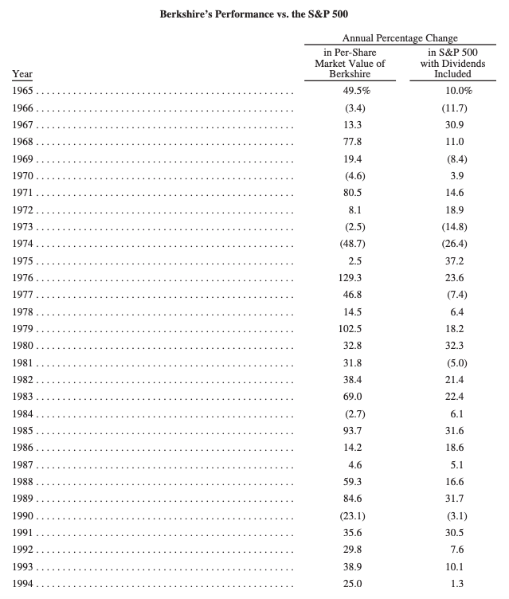
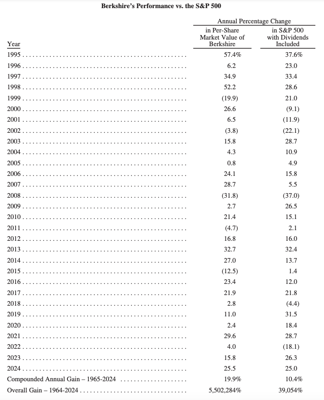
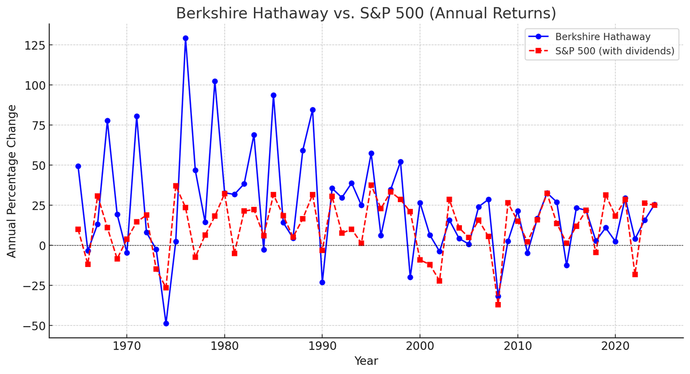

# 巴菲特致股东的信 2024

伯克希尔与标普 500 指数对比表

**伯克希尔·哈撒韦公司**

致伯克希尔·哈撒韦公司的股东们：

这封信作为伯克希尔年度报告的一部分呈现给你们。作为一家上市公司，我们需要定期向你们披露许多具体的事实和数据。

然而，“报告”一词意味着更大的责任。除了依法披露的数据外，我们认为我们还应该向你们提供额外的评论，说明你们所持有的资产及我们的思考方式。我们的目标是以一种我们希望你们在角色互换时也会采用的方式与大家沟通——也就是说，如果你们是伯克希尔的首席执行官，而我和我的家人是被动投资者，将我们的积蓄托付给你们，我们希望你们如何与我们沟通。

这种方式促使我们每年都会回顾你们通过伯克希尔股份间接持有的众多企业的好坏发展情况。在讨论特定子公司的问题时，我们会尽量遵循汤姆·墨菲在60年前给我的建议：“表扬要指名道姓，批评要泛泛而谈。”

> **错误——是的，我们在伯克希尔也会犯错**

有时，我在评估伯克希尔所收购企业的未来经济状况时犯了错误——这每一次都意味着资本分配的失误。这种情况既可能出现在对可交易股票的判断上——我们将其视为对企业的部分所有权——也可能出现在对公司100%收购的判断上。

在其他时候，我在评估伯克希尔所聘请经理人的能力或忠诚度时也曾犯错。忠诚度方面的失望有时甚至比财务损失更让人痛苦，其痛苦程度可与失败的婚姻相提并论。

在人事决策方面，所能期待的最好结果只是一个体面的“击球率”。最严重的错误是拖延对错误的纠正，或者用查理·芒格的话来说，就是“吮拇指”（拖延不决）。他告诉我，问题不会因为逃避而自行消失。它们需要采取行动来解决，无论这有多么让人不舒服。

在2019年至2023年期间，我在致你们的信中使用了16次“错误”或“失误”这两个词。而许多其他大公司在这段时间里从未使用过这两个词。我必须承认，亚马逊在其2021年信中做出了一些极为坦诚的表述。但除此之外，大多数公司一般都只是发布充满正面信息的内容和图片。

我还曾担任过一些大型上市公司的董事，在这些公司，“错误”或”失误”这类词在董事会会议或分析师电话会议上是被禁止的。这种禁忌暗示着管理层的完美无缺，而这总让我感到不安。（当然，在某些时候，出于法律问题的考虑，限制讨论可能是明智的。毕竟，我们生活在一个诉讼频繁的社会。）

在94岁的年纪，我很快就会由格雷格·阿贝尔（Greg Abel）接替我的首席执行官职位，并由他来撰写年度股东信。格雷格与伯克希尔的信条一致，他认为“报告”是伯克希尔首席执行官每年应当向股东提供的内容。他也深知，如果你开始欺骗股东，最终你会相信自己的谎言，从而欺骗自己。

> **皮特·里格尔——独一无二的人物**

让我停下来，讲述一个关于皮特·里格尔（Pete Liegl）的非凡故事。对于大多数伯克希尔股东来说，皮特可能是个陌生的名字，但他为股东的整体财富贡献了数十亿美元。皮特于去年11月去世，去世时仍在80岁的高龄工作着。

我第一次听说Forest River——皮特创办并管理的一家印第安纳州公司——是在2005年6月21日。那天，我收到了一封来自中间人的信，信中详细介绍了这家公司的相关数据。这家公司是一家房车（RV）制造商。信的作者提到，皮特作为Forest River的100%所有者，明确希望将公司出售给伯克希尔，并告诉我皮特的预期售价。我很欣赏这种直截了当的方式。

我随后向几家房车经销商进行了调查，对所了解到的情况感到满意，于是安排了6月28日在奥马哈的会面。皮特带着他的妻子莎伦（Sharon）和女儿丽莎（Lisa）一同前来。我们见面时，皮特向我保证，他希望继续经营这家公司，但更希望能为家人确保财务安全，从而感到更安心。

接着，皮特提到，他还拥有一些房地产，这些房地产租赁给了Forest River，但并未在6月21日的信中提及。在几分钟内，我们就这些资产达成了价格协议。我表示伯克希尔无需进行估值评估，而是直接接受他的定价。

然后，我们讨论了另一项需要明确的问题。我问皮特，他希望自己的薪酬是多少，并补充道，无论他提出什么金额，我都会接受。（不过，我必须补充一句，这种方法并不适用于大多数情况。）

皮特停顿了一下，他的妻子、女儿和我都向前倾身等待他的回答。然后，他的回答让我们大吃一惊：“嗯，我查阅了伯克希尔的代理声明（proxy statement），我不想比我的老板挣得更多，所以给我每年10万美元就行。”当我从震惊中回过神来后，皮特补充道：“但我们今年的盈利将达到X（他报了一个数字），我希望能拿到超出公司当前盈利部分的10%作为年度奖金。”

我回答道：“好的，皮特，但如果Forest River进行了任何重大收购，我们会对额外投入的资本进行适当调整。”我并未对“适当”或“重大”进行明确定义，但这些模糊的术语从未成为问题。

随后，我们四个人一起去奥马哈的Happy Hollow Club餐厅共进晚餐，并从此过上了幸福的生活。在接下来的19年里，皮特的表现惊艳绝伦，没有任何竞争对手能与他相提并论。

并不是每家公司都有一个易于理解的业务模式，也极少有像皮特这样的所有者或管理者。当然，我预计自己在伯克希尔的收购决策中会犯错，有时也会误判我所接触的人的能力和品格。

但与此同时，我也曾在企业潜力以及管理者的能力和忠诚度方面收获了许多意外的惊喜。我们的经验表明，一个成功的决策，随着时间推移，可能带来惊人的影响。（比如，GEICO是一次成功的商业决策，Ajit Jain是一次卓越的管理决策，而我有幸找到查理·芒格作为独一无二的合伙人、私人顾问和忠实朋友。）错误会被遗忘，而赢家会永远开花结果。

关于伯克希尔的CEO继任，还有一点：我从不在乎候选人曾在哪所学校就读。绝不！

当然，许多优秀的管理者确实毕业于世界知名学府，但也有许多管理者像皮特一样，可能就读于不那么知名的学校，甚至根本没有完成学业，但他们仍然取得了巨大成功。看看我的朋友比尔·盖茨，他认为在一个即将改变世界的行业中快速行动，远比留在学校里获取一张挂在墙上的文凭更重要。（顺便说一句，可以读一读他的新书 《源代码》（Source Code）。）

不久前，我通过电话认识了一位名叫Jessica Toonkel的人，她的继祖父Ben Rosner曾经为查理和我管理过一家公司。Ben是个零售行业的天才。在撰写本报告时，我向Jessica核实了Ben的学历情况，我记得他受的教育相当有限。Jessica的回复是：“Ben 从未念过六年级以上的课程。”

我有幸在三所优秀的大学接受过教育，也坚定地相信终身学习的价值。然而，我观察到，在商业世界里，许多成功的才能天生就具备，先天的禀赋远远超过后天的培养。

皮特·里格尔是个天生的赢家。

> **去年的业绩**

在2024年，伯克希尔的表现好于我的预期，尽管189家运营企业中有53%报告了盈利下降。我们的收益得到了可预见的大幅增长，主要来自投资收益的增加，因为国债收益率的提高，我们大幅增加了对这些高流动性短期证券的持有量。

我们的保险业务也实现了大幅盈利增长，其中GEICO的表现尤为突出。在过去五年中，Todd Combs对GEICO进行了重大改革，提高了运营效率，并使承保业务更加现代化。GEICO一直是伯克希尔的一颗长期持有的璀璨明珠，但它亟需一次彻底的重新打磨，而Todd为此付出了不懈努力。尽管改革尚未完成，但2024年的改进可谓惊人。

总体而言，2024年，财产-意外险（P/C）业务的定价有所提升，这反映出对流风暴（convective storms）造成损害的显著增加。气候变化或许正在宣告它的到来。不过，在2024年，并未发生任何“灾难级”事件。然而，总有一天，甚至任何一天，都会发生一次极其惊人的保险损失，而且并无保证每年只发生一次。

财产-意外险业务对伯克希尔至关重要，因此，我将在后文对此进行进一步讨论。

伯克希尔的铁路和公用事业业务是公司除保险以外的两大核心业务，2024年的总体盈利有所改善。然而，这两个业务仍有许多方面需要改进。

在2024年年底，我们将对公用事业业务的持股比例从约92%提高到100%，这一增持花费了约39亿美元，其中29亿美元以现金支付，其余部分以伯克希尔B类股票支付。

总的来说，我们在2024年录得了474亿美元的运营利润。我们始终强调这一指标，而不是GAAP（公认会计原则）要求披露的盈利数据（详见K-68页），有些读者可能对此感到厌倦。

我们的运营利润指标不包含我们所持有的股票和债券的资本利得或损失，无论是已实现的还是未实现的。从长期来看，我们认为这些投资大概率会带来收益——否则我们为什么要买这些证券呢？——尽管年度数据会剧烈波动，且难以预测。

我们的投资几乎总是以长期为视角，在很多情况下，我们的思考周期长达数十年。而正是这些长期持有的投资，有时候会带来“响彻教堂钟声般”的回报。

> **2023-2024 年盈利明细**

以下是我们对2023-2024 年盈利情况的分析。所有计算均已扣除折旧、摊销和所得税。EBITDA（息税折旧摊销前利润）是华尔街最喜欢的，但我们不采纳这一指标。

（单位：百万美元）

* 非控股业务：指伯克希尔持股 20%-50% 的公司，例如卡夫亨氏（Kraft Heinz）、西方石油（Occidental Petroleum） 和 Berkadia。

其他：包括外汇收益，其中 2024 年约 11 亿美元，2023 年约 2.11 亿美元，这些收益源自我们使用非美元计价的债务。

> **惊喜，惊喜！一项重要的美国纪录被打破**

60 年前，现管理层接管了伯克希尔。这一决定是个错误——我的错误，而且这个错误困扰了我们长达 20 年。我要特别强调，查理.芒格立刻就察觉到了我显而易见的错误：尽管我当初支付的伯克希尔股价看似便宜，但它的业务——一家位于美国北部的大型纺织厂——正走向衰亡。

美国财政部（U.S. Treasury）当时其实已经默默收到了伯克希尔衰落的信号。1965 年，伯克希尔没有缴纳一分钱的所得税，而且这种情况在伯克希尔已经持续了十年。如果是一家炙手可热的初创企业，这种经济状况也许可以理解；但对于一家曾经是美国工业支柱的公司来说，这就是一个明显的黄灯警示。伯克希尔，正走向“经济废墟”。

快进 60 年，想象一下财政部的惊讶：这家公司依然叫伯克希尔·哈撒韦（Berkshire Hathaway），但如今，它缴纳的公司所得税总额，超过了美国历史上任何一家公司——甚至超过了那些市值数万亿美元的科技巨头。

确切地说，伯克希尔去年向美国国税局（IRS）支付了四笔公司税款，总计 268 亿美元。这相当于全美所有企业所得税的 5%。（此外，我们还向外国政府以及美国 44 个州缴纳了可观的所得税。）

有一个至关重要的因素促成了伯克希尔缴纳的这一创纪录的税款：在 1965-2024 这 60 年间，伯克希尔仅向股东派发过一次现金股息。

1967 年 1 月 3 日，我们发放了唯一的一次现金股息——总计 $101,755，相当于每股 A 股派息 10 美分。（我已经不记得当初为什么会向董事会建议这项决策了。现在回想起来，感觉像是一场噩梦。）

60 年来，伯克希尔股东始终支持公司不断地将利润进行再投资，这才使得公司得以不断提升应税收入。在最初的 10 年间，我们向美国财政部缴纳的现金所得税微乎其微，但如今，这一累计金额已经超过 1010 亿美元……并且仍在增长。

巨额数字往往难以直观理解。让我们换一种方式来思考伯克希尔在2024 年支付的 268 亿美元税款：

假设，我们在2024 年的每 20 分钟就向财政部寄出一张100 万美元的支票，而且全年无休（2024 年是闰年，共有 366 天）。即便如此，到了年底，我们仍然会欠美国联邦政府一笔巨款。事实上，等到 2025 年 1 月的某个时候，财政部才会告诉我们，我们可以稍微喘口气、休息一下，并为 2025 年的纳税做准备。

> **你的钱在哪里？**

伯克希尔的投资策略是“双手并用”：

一方面，我们控股了许多企业，通常持股比例至少 80%，大多数情况下高达 100%。

这些189 家子公司在某些方面类似于可交易的普通股，但与之并不完全相同。这些控股子公司的总价值数千亿美元，其中有一些“稀世珍宝”级别的企业，也有一些优质但并非卓越的业务，当然，还有一些让我们失望的投资。虽然我们没有任何“拖后腿的”业务，但确实也有一些公司，我本不该买下。

另一方面，我们持有十几家全球知名且极具盈利能力的公司的少量股份，这些公司包括：苹果、美国运通、可口可乐、穆迪，这些公司在其运营所需的有形净资产上创造了极高的回报。截至 2024 年底，我们的部分持股总市值达 2720 亿美元。

从投资角度来看，真正卓越的企业几乎不可能被整体出售，但我们可以在华尔街的周一至周五随时买入它们的一小部分股份。偶尔，它们甚至会以“折扣价”出售。我们对投资标的并不偏袒，只在最能有效利用资金的地方下注——无论是控股整个公司，还是买入一部分优质企业的股份。

通常，市场上不会有太多吸引人的机会；但在极少数时候，我们会发现自己置身于投资良机的“深水区”。在这样的时刻，Greg（阿贝尔）已经证明了他能做出果断决策，正如查理.芒格当年所做的那样。

在市场化股票（可交易股票）方面，当我犯错时，更容易调整方向。但需要强调的是，伯克希尔目前的规模削弱了这种灵活性。我们无法瞬间进出某个投资标的，有时候需要一年甚至更长时间才能完成一项投资的建立或退出。此外，当我们仅持有少数股权时，我们无法更换管理层，即便我们认为这样做是必要的；同样，如果我们对资本流向的决策感到不满，我们也无法直接控制其资金的使用方式。

而对于控股企业，我们可以决定管理层和资金流向，但处置错误投资的灵活性远远不如市场化股票。

事实上，伯克希尔几乎从不出售控股企业，除非我们认为该业务面临无休止的困境。不过，这种长期持有的策略也带来了一定的优势：有些企业主会主动选择伯克希尔，正是因为我们始终如一的投资风格。在某些情况下，这种稳定性反而对我们有利。

尽管一些评论员认为伯克希尔目前的现金持有量“异常庞大”，但绝大部分股东的资金仍然投向了股票，这种偏好不会改变。2023 年底，我们的市场化股权投资规模为 3540 亿美元，到 2024 年下降至 2720 亿美元，但与此同时，我们的非上市控股企业的价值略有增长，并且总价值仍然远远超过市场化股票投资。

伯克希尔的股东可以放心：我们始终会将绝大多数资金投向股票——主要是美国企业的股票，尽管其中许多公司本身也具有重要的国际业务。

伯克希尔永远不会将现金等价物资产置于优质企业所有权之上，无论是完全控股的企业，还是部分持股的公司。

如果财政政策出现严重失误，纸币的价值可能会大幅缩水。在某些国家，这种鲁莽的财政管理已经成为一种惯例，而在美国相对短暂的历史中，我们也曾多次接近财政失控的边缘。固定收益债券（如国债）无法抵御货币贬值的风险。

相比之下，真正优质的企业——以及个人所掌握的稀缺技能——在应对货币波动方面，往往能找到生存之道，前提是它们能持续满足社会需求。

个人能力也是类似的道理：无论是顶级运动员、卓越的歌手、杰出的医生、优秀的律师，还是任何其他专业领域的顶尖人才，他们的价值通常不会因货币波动而受到影响。

然而，我既不擅长运动，也没有天籁之音，更没有医学或法律技能。因此，我只能依靠股权投资，依靠美国企业的成功，并且我将继续坚持这一选择。

无论如何，公民如何合理、甚至富有想象力地运用储蓄，决定了一个社会是否能持续创造人们所需要的商品和服务。这一体系被称为“资本主义”。资本主义有缺陷，也有被滥用的地方，某些方面的问题比以往更加严重，但在创造社会财富方面，它仍然是无可匹敌的。

美国就是资本主义的最佳案例。在短短 235 年的历史中，美国取得的进步，远超 1789 年（宪法制定时）最乐观的殖民者所能想象的。

在美国早期的发展过程中，我们确实有时需要依赖外部借款，以补充国内储蓄的不足。但与此同时，美国也需要本国公民保持储蓄，并且需要这些储蓄能被明智地配置到合适的投资中。如果美国当时把所有产出都用于消费，那么国家的发展将停滞不前。

当然，资本主义体系从来都不是完美无瑕的——在美国历史上，一直存在着骗子、投机者，他们利用投资者的信任来牟取私利，这种行为至今依然存在。除此之外，激烈的市场竞争和技术创新，也导致了大量资本最终被错误地配置，使得一些企业倒闭。然而，即便存在这些问题，美国人民的储蓄仍然推动了超乎任何殖民者梦想的经济增长。

美国在建国之初只有 400 万人口，即便经历了一场残酷的内战（让美国人自相残杀），美国依然在短时间内改变了世界格局。

> 伯克希尔的角色：长期复利增长的力量

在伯克希尔的小范围内，我们的股东也参与了这一“美国奇迹”，他们选择不领取分红，而是持续让资本进行再投资，从而实现长期的增长。最初，这种再投资规模微乎其微，几乎可以忽略不计。

但随着时间的推移，再投资产生了滚雪球效应，伯克希尔的影响力也随之不断增长，如今，它的业务已经遍及整个美国。然而，这还不是终点。

企业的消亡有多种原因，但与人类不同，“年龄”并不会直接导致企业的死亡。

事实上，相比于 1965 年，伯克希尔今天反而更加年轻。不过，伯克希尔的成功很大程度上归功于美国，而美国的成功却并不依赖伯克希尔。即便伯克希尔从未存在，美国依然会取得今天的成就。

所以，谢谢你，美国。未来，伯克希尔的股东们希望能缴纳比 2024 年更高的税款，因为这将意味着我们变得更成功。请合理使用这些税款，帮助那些因非自身过错而拿到“坏牌”的人，他们值得一个更好的未来。同时，请不要忘记维护货币稳定，这不仅需要智慧，还需要时刻保持警惕。

> 核心业务：财产保险（Property-Casualty, P/C）

财产保险（P/C 保险）仍然是伯克希尔的核心业务，这一行业的商业模式极其罕见，尤其是在大型企业中。通常情况下，企业在销售产品或服务之前，需要先承担各种成本，包括劳动力、原材料、库存、厂房、设备等。因此，企业的 CEO 在销售产品前，通常已经能大致了解自己的成本。

如果产品售价低于成本，管理层很快就会发现问题，因为现金流会迅速出现亏损，这是一种不可能被忽视的信号。

> 财产保险的独特性：资金先到，风险后知

当伯克希尔承保 P/C 保险（财产与意外保险）时，我们会先收到保费，但真正的成本要多年后才能完全显现。在某些情况下，这个“真相时刻”可能会延迟 30 年或更久。（我们至今仍在支付50 多年前的石棉相关赔偿。）

这种商业模式的一个好处是：保险公司在承担大部分支出前，就已经持有大量现金。但这种模式也伴随着巨大的风险：公司可能在持续亏损，甚至亏损达到惊人的程度，而CEO 和董事会却要很久之后才能意识到问题的严重性。

> 不同类型的保险：短期 vs. 长期风险

某些保险种类可以尽量减少这种“资金-风险”错配，比如农作物保险或冰雹保险，因为这些损失很快就会被发现、评估并支付。但某些保险业务则可能导致管理层和股东陷入虚假的幸福感，即使公司实际上正在走向破产。

典型的“长尾”保险业务包括：

* 医疗事故责任险（Medical Malpractice）

* 产品责任险（Product Liability）

在这些领域，保险公司可能连续多年、甚至几十年向股东和监管机构报告“虚假的盈利”。如果 CEO 是个盲目乐观主义者，甚至是个骗子，这种情况可能会变得更加危险。历史已经证明，这样的 CEO 和公司比比皆是。

> 伯克希尔如何管理保险“浮存金”

在过去几十年里，伯克希尔的这种“先收钱、后赔付”模式，让我们能够投资大笔资金（“浮存金”），同时通常还能实现小幅的承保盈利。

我们会预留一部分资金，以应对可能的意外，而截至目前，我们的估算都是准确的。我们并不会被日益增长的赔付额吓倒。（比如我写这篇文章时，正发生着野火灾害。）

我们的责任是：

* 合理定价保险，确保能覆盖这些风险。

* 冷静接受损失，当意外发生时不带情绪地面对。

* 抵制滥判、高额诉讼和欺诈行为，勇敢对抗这些行业乱象。

在 Ajit Jain 的领导下，伯克希尔的保险业务已经从一个默默无闻的奥马哈小公司，成长为一家全球领先的保险巨头，以敢于承保风险和如直布罗陀般稳固的财务状况闻名。

此外，Greg（CEO）、董事会成员和我，都将个人财富的大部分投资在伯克希尔，这远超我们从公司领取的任何薪酬。我们不使用期权或其他单向奖励机制，所以如果你亏钱，我们也亏钱。这种模式让我们更加谨慎，但并不能确保我们总能提前预见风险。

> 保险业的增长依赖于经济风险的增加

保险业务的增长取决于经济风险的增加。没有风险，就没有保险需求。想象一下135 年前的世界：当时根本没有汽车、卡车或飞机。但如今，仅美国就有 3 亿辆机动车，每天都在造成大量事故和财产损失。同时，飓风、龙卷风和野火等自然灾害，导致的财产损失越来越大，而且其发生模式和最终成本也变得更加难以预测。

> 保险业：定价、风险与伯克希尔的优势

在某些保险领域，提供长期保单是愚蠢的——甚至是疯狂的。例如，十年期的汽车或自然灾害保险几乎不可想象，但我们认为，一年期的承保风险通常是可控的。如果未来情况变化，我们也会调整我们的承保方式。

事实上，在我有生之年，许多汽车保险公司已经从一年期保单转向六个月期，这虽然减少了浮存金，但却提升了精算和定价的精准度。

> 伯克希尔的风险承受能力与承保纪律

没有哪家私人保险公司能像伯克希尔一样承担如此巨额的风险。在某些时候，这种能力确实是一个关键优势。但同样重要的是，当市场价格不合理时，我们必须收缩业务。我们绝不能为了维持市场份额，去承保定价不合理的保单。这是一条通向破产的道路，而伯克希尔绝不会踏上这条路。

正确地定价 P/C 保险是一门科学与艺术结合的生意，绝不是适合乐观主义者的行业。伯克希尔的一位高管 Mike Goldberg 说得很好：

“我们希望我们的核保人员每天上班时都感到紧张，但不会被吓瘫。”

> 伯克希尔在保险行业的独特竞争力

综合来看，我们非常喜欢 P/C 保险业务，原因如下：

1. 伯克希尔能够承受极端损失，并且心理上毫无压力。

2. 我们不依赖再保险，这让我们拥有长期的成本优势。

3. 我们有顶级的管理团队（没有乐观主义者！），能够高效利用保险业务产生的大量浮存金进行投资。

过去 20 年，伯克希尔的保险业务：

* 创造了 320 亿美元的税后承保利润（相当于每 1 美元保费利润 3.3 美分）。

* 浮存金从 460 亿美元增长到 1710 亿美元，并可能继续增长。

* 如果核保精准（再加上一点运气），浮存金的使用成本可以为零。

> 伯克希尔在日本市场的投资增长

尽管伯克希尔主要专注于美国市场，但我们在日本的投资是一个重要的例外。

自近六年前，伯克希尔开始购买 五家日本企业的股份：伊藤忠商事（ITOCHU）、丸红（Marubeni）、三菱商事（Mitsubishi）、三井物产（Mitsui）、住友商事（Sumitomo），这五家公司与伯克希尔的运营模式类似，它们拥有庞大而多元化的业务版图，部分在日本，部分遍布全球。

> 伯克希尔的日本投资：长期战略与资本管理

伯克希尔首次投资这五家日本企业是在 2019 年 7 月。当时，我们审阅了它们的财务状况，惊讶地发现这些公司的股票价格远低于其实际价值。随着时间推移，我们对它们的管理水平、资本运作和投资者友好度的认可持续上升。

Greg 与这些企业的高管会面多次，而我也密切关注它们的经营动态。

这五家公司有几个值得欣赏的特点：

* 在合适的时机增加股息

* 在合理的情况下回购股票

* 高管薪酬远低于美国同行的激进水平

我们的投资计划是 长期持有，并支持它们的董事会。伯克希尔最初承诺持股比例不超过 10%，但随着我们接近这个上限，五家公司同意适度放宽这一限制。因此，未来你可能会看到伯克希尔在这五家企业的持股比例进一步增长。

截至 2024 年底：

* 伯克希尔的总投资成本为 138 亿美元

* 持股的市场价值已达 235 亿美元

> 伯克希尔的日元债务策略

与此同时，伯克希尔持续增加以日元计价的债务，但并没有遵循任何固定的增持公式。

我们采用的策略：

1. 所有借款都是固定利率（无浮动利率债务）。

2. 不对未来汇率做预测，保持货币中性。

3. 根据 GAAP 规则，需要定期反映因汇率变化带来的账面损益。

2024 年底的外汇收益：23 亿美元（税后），其中 8.5 亿美元 来自 2024 年。目前，我们的日元资产负债结构非常合理。

2025 年，我们预计：

* 日本投资的年股息收入：8.12 亿美元

* 日元债务的年利息成本：1.35 亿美元

从这个角度看，这项投资的数学逻辑十分吸引人。我相信，Greg 及他的继任者将会持有这些日本投资数十年，并且伯克希尔未来可能找到更多方式，与这五家公司展开更深入的合作。

> 奥马哈年会：期待与你相聚！

我们期待在 5 月 3 日 欢迎你来到奥马哈！

今年的会议安排略有调整，但核心保持不变：回答你的问题、让你与朋友相聚、让你对奥马哈留下美好印象。

整个城市都在期待你的到来！我们将在 5 月 3 日（周五）中午 12 点至下午 5 点，以及 5 月 4 日（周六）上午 7 点至下午 4 点，在年会现场欢迎各位股东，并提供各种伯克希尔旗下的产品！你可以期待：可爱的 Squishmallows 毛绒玩具、Fruit of the Loom 内衣、Brooks 跑步鞋、以及许多其他让你心动的商品 。

特别推荐：伯克希尔 60 周年纪念书籍 📖

去年，我们出售了 《Poor Charlie’s Almanack》（穷查理宝典），5,000 本在周六结束前被抢购一空！今年，我们将带来 《60 Years of Berkshire Hathaway》，这本书由 Carrie Sova 精心编写，她曾在 2015 年创作了一本幽默而富有创意的伯克希尔历史书，当时让我惊喜不已。

Carrie 后来离开伯克希尔专心照顾家庭，但今年，我鼓起勇气邀请她编写60 周年纪念版，特别收录 查理·芒格的照片、金句和少见的故事，她立刻答应了！我们将提供 5,000 本新书，欢迎大家购买！

限量签名版募捐活动&#x20;

* Carrie 和我将 联名签署 20 本特别版，

* 每位股东只要向南奥马哈的 Stephen Center（为无家可归者提供帮助）捐款 $5,000，

* 就能获得一本签名书籍，

* 我会匹配所有捐款，让善款翻倍！

会议直播与 Q\&A 互动

今年 CNBC 的 Becky Quick 仍将负责会议直播和采访，她会与伯克希尔的管理层、投资者、股东，甚至特别嘉宾对话，并通过 CNBC 全球传播并存档年会内容。今年没有年会电影，但我们会提前开始，会议 8:00 AM 准时开场，我会做简短的开场白，之后立即进入 股东问答环节（Q\&A），问题将由 Becky 和现场股东交替提问。

伯克希尔 2025 年会日程更新

上午 8:00 – 会议开始，沃伦·巴菲特开场致辞，

Q\&A 环节 – 由 Greg、Ajit 和我一同回答股东问题

上午 10:30 – 11:00 – 休息时间

上午 11:00 – 会议继续，Greg 将继续陪同回答问题

下午 1:00 – 会议结束

展区购物开放至下午 4:00

详细周末活动安排请见 第 16 页，

Brooks 周日晨跑 依然精彩（但我会继续睡觉 ）。

特别嘉宾：巴菲特家族传奇人物——Bertie

我那聪明又漂亮的姐姐 Bertie（91 岁） 今年也会出席会议，她的 两个同样光彩照人的女儿 也会陪同。（据观察，家族中所有耀眼的基因似乎只遗传给了女性 。）

Bertie 和我每周日都会用 老式电话 交流，我们聊聊 老年生活的乐趣，甚至深入探讨 手杖的优劣之处。

Bertie 的独门秘诀：她说，女性用手杖的额外好处 是可以避免男性搭讪。她认为，男性自尊心不允许他们对拄着拐杖的女士“出手”。我对这个理论 持怀疑态度……

在会议上，我从舞台上看不清楚，所以请各位股东 帮我留意一下：Bertie 是否真的能靠手杖拒绝“追求者”？我赌她依然会被一群男士包围！（这场面可能会让人想起《乱世佳人》里，斯嘉丽·奥哈拉身边围满男士的场景！）

董事会和我都期待与你在奥马哈相聚！这将是一次愉快的盛会，也许你还会结识新朋友。

2025 年 2 月 22 日

沃伦·E·巴菲特

伯克希尔董事会主席
