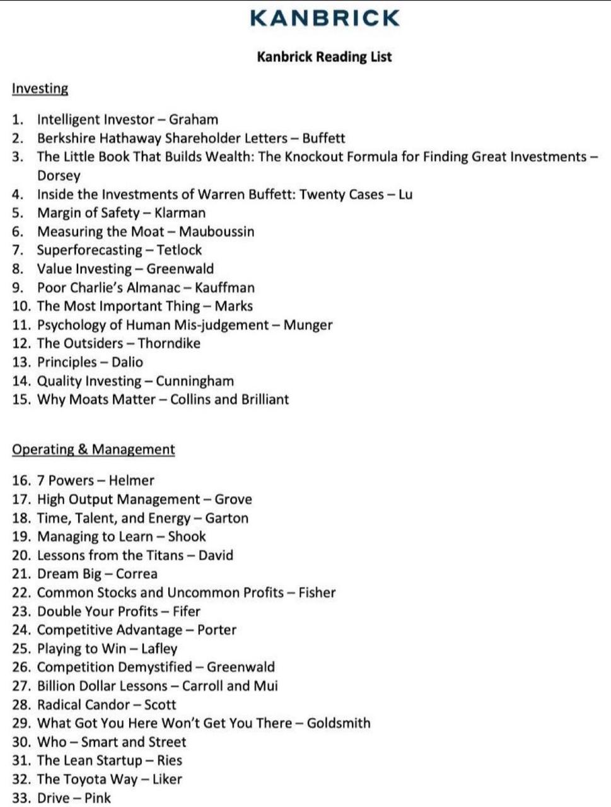

**🌟 Tracy Britt Cool：29岁加入伯克希尔，37岁离职创立Kanbrick**

1984 年生于堪萨斯州，毕业于哈佛学院与哈佛商学院，曾任伯克希尔哈撒韦多家子公司的董事及 Pampered Chef 首席执行官，2020 年离职后联合创办 Kanbrick 。

> 彦鑫：整理了Tracy Britt Cool的推荐书单及资源，分享给大家。Tracy Britt Cool在历年发布的5封股东信中，都会列出几本推荐书籍，其中2023年和2024年只是列出书单，未写明推荐理由。
>
> Tracy Britt Cool的股东信及更多内容：[ 特蕾西·布里特·库尔（Tracy Britt Cool）：Kanbrick创始人](https://y4pc2g8csc.feishu.cn/wiki/ES3bw7JHxi4N0jktPlActiMAnib)

**下载地址：**

飞书链接：https://y4pc2g8csc.feishu.cn/docx/YMXFdGDl9o4gGgxhpdzcjjfRnjb?from=from\_copylink  &#x20;

密码：bmyls666

**下载方式：**

**1、手机端：使用飞书app打开本页面，点击以下相关“书籍”，再点击右上角“...”图标，再点击“下载”按钮即可。**

**2、电脑端：**&#x9F20;标移动到书籍上，就有下载图标，如下图，点击后下载：

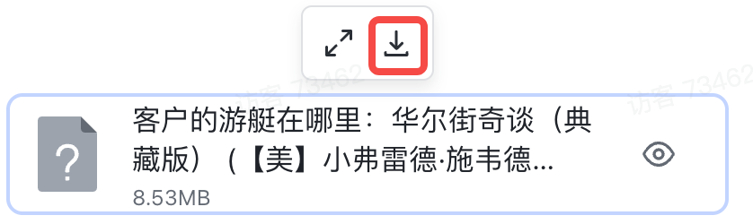

1. **《商界局外人》（The Outsiders – by Thorndike）**

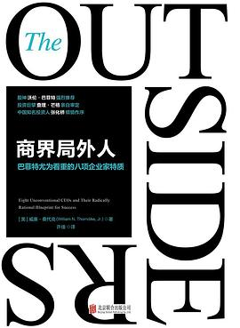

**特蕾西·布里特·库尔：**&#x6211;们经常被问到读书推荐。因此，借此首封股东信之际，我们想分享一本我们投资人和经营者都喜欢的书：《局外人》，作者 Will Thorndike。这本书出版于2012年，记录了8位非典型CEO如何创造巨大价值。如果你还没读过，强烈推荐买一本；如果你已经读过，建议你再读一次，甚至读两遍。

***

* **《客户的游艇在哪里》（Where are the Customers' Yachts?  by Fred Schwed）**

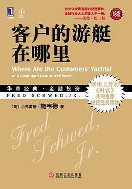

**特蕾西·布里特·库尔：**&#x7406;解激励机制，查理·芒格谈到过激励机制的超强力量。过去一年，许多新发行的公司都有着华丽的预测和理想化的愿景，承诺让普通人触及潜在的世界级成果。揭开激励背后的本质，我们看到的是《Where Are All the Customers’ Yachts?》这本书中的现代再现——即推动者往往获得巨额报酬，而股东却只能承受业绩不佳。

&#x20;

***

* **《超级预测：预测的艺术与科学》（Superforecasting: The Art and Science of Prediction  by  Philip E. Tetlock）**

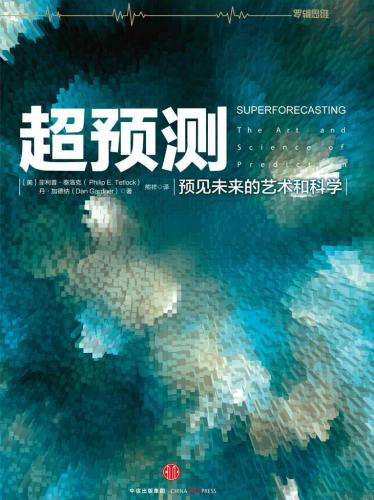

**特蕾西·布里特·库尔：**&#x4F5C;者为 Tetlock 和 Gardner，这本书分享了如何提升预测能力的经验，包括使用基准率的方法。

***

* **&#x20; 《人类误判心理学》（The Psychology of Human Misjudgment），（知识库已经收录）**

**特蕾西·布里特·库尔：**&#x67E5;理·芒格的演讲，这是一堂关于认知偏差和提升决策能力的精彩大师课。你可以在网上找到该演讲，或在 Peter Kauffman 编辑的优秀文集《穷查理宝典》中阅读到。

[ 查理芒格：2005年人类误判心理学](https://y4pc2g8csc.feishu.cn/wiki/FZmuwZXE3iImXjkKSKtcppFhneg?from=from_copylink)

***

* **《沉浮的巨轮：十大工业巨头的转型之路》（Lessons from the Titans: What Companies in the New Economy Can Learn from the Great Industrial Giants to Drive Sustainable Success  by Scott Davis ），**

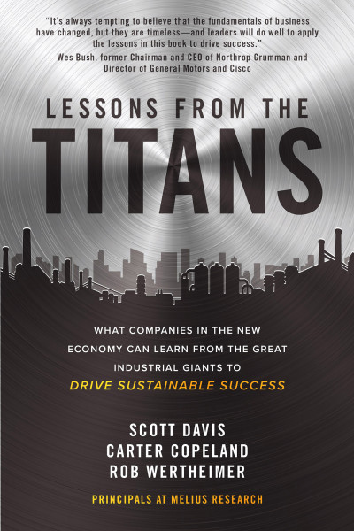

**特蕾西·布里特·库尔：**&#x4F5C;者为 David、Copeland 和 Wertheimer：通过多个案例研究，深入探讨了工业企业如何构建可持续的成功系统。

***

* **《芯片战争》（Chip War: The Fight for the World’s Most Critical Technology） by Chris Miller**

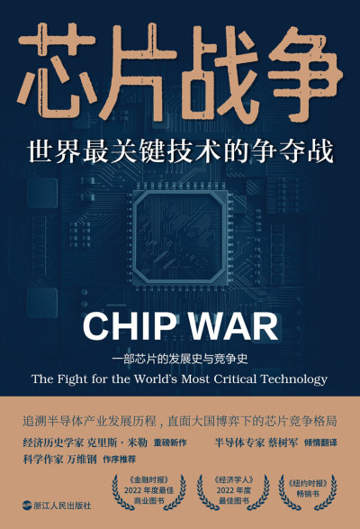

**特蕾西·布里特·库尔：**&#x4E00;本从历史、经济与政治视角探讨现代芯片如何影响全球格局的好书

***

* **《倍增效应》（Multipliers: How the Best Leaders Make Everyone Smarter）by Liz Wiseman**

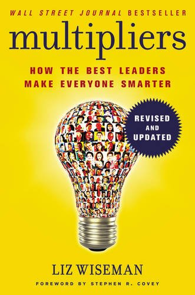

**特蕾西·布里特·库尔：**&#x5173;于领导者如何放大团队价值的管理书籍

***

* **《穷查理宝典》（Poor Charlie’s Almanac）**

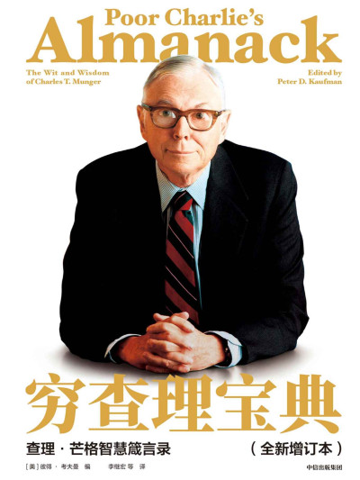

***

* **《非理性好客》（Unreasonable Hospitality: The Remarkable Power of Giving People More Than They Expect by Will Guidara）**

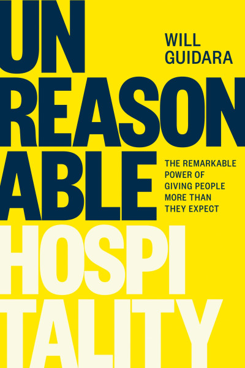

***

* **《超越百岁：长寿的科学与艺术》（Outlive: The Science and Art of Longevity  by Peter Attia）**

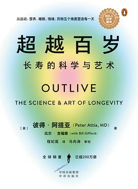

***

* **《正念领导力》（The 15 Commitments of Conscious Leadership: A New Paradigm for Sustainable Success  by Jim Dethmer ）**

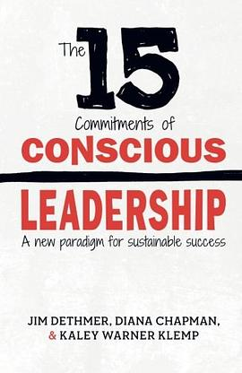

***

* **《失控的焦慮世代：手機餵養的世代，如何面對心理疾病的瘟疫 》（The Anxious Generation: How the Great Rewiring of Childhood Is Causing an Epidemic of Mental Illness）by Jonathan Haidt**

***

* **《至高无上：一场颠覆世界的人工智能竞赛》 （Supremacy: AI, ChatGPT, and the Race that Will Change the World） by Parmy Olson**

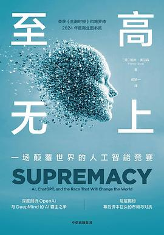

***

* 《安全边际：有思想投资者的价值投资避险策略》（*Margin of Safety* – Klarman）

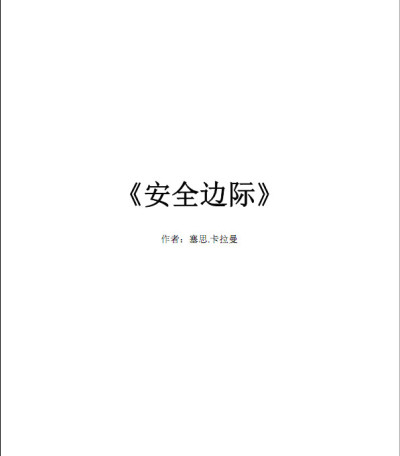

***

* **《巴菲特的护城河》（The Little Book That Builds Wealth: The Knockout Formula for Finding Great Investments）  by Pat Dorsey**

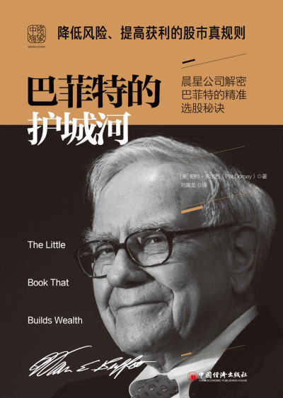

***

* **《提高利润的78个方法》（Double Your Profits –by  Fifer）**

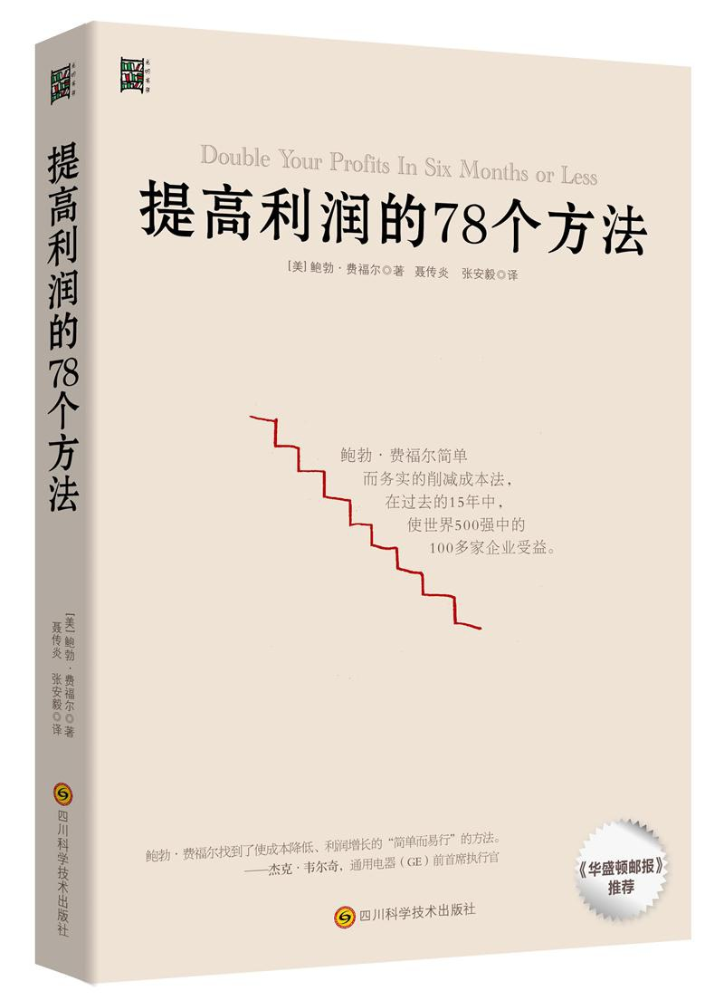

***

* **《绝对坦率：一种新的管理哲学》（Radical Candor – by Scott）**

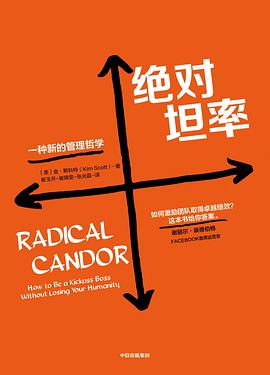

***

* **《习惯力：我们因何失败，如何成功？》（ *What Got You Here Won’t Get You There* – by Goldsmith）**

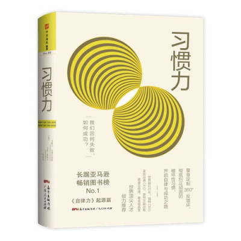

***

* **《街头智慧：罗杰斯的投资与人生》（Smart and Street - by Jim Rogers）**

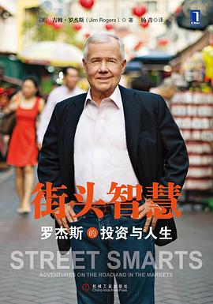

***

* **《精益创业：新创企业的成长思维》（The Lean Startup – by Ries）**

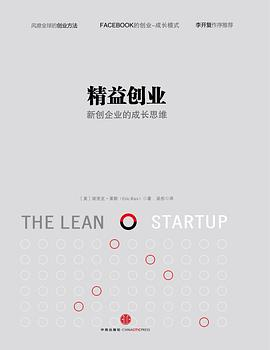

***

* **《Drive：The Surprising Truth About What Motivates Us  》by  Daniel H. Pink**

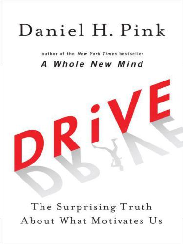

***

* **《原则》（ Principles: Life and Work  ）byRay Dalio**

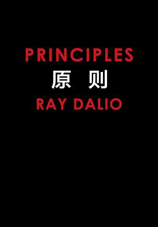

***

* **《丰田模式：精益制造的14项管理原则》（The Toyota Way 14 Management Principles from the World's Greatest Manufacturer ）by Jeffrey Liker**

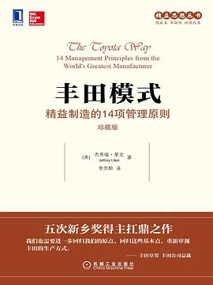

***

* **《聪明的投资者》（Intelligent Investor – Graham）**

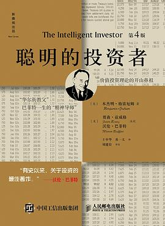

***

* **《投资最重要的事》（ The Most Important Thing Illuminated） by Howard Marks**

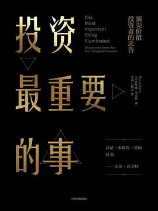

***

* **《宝洁制胜战略》（Playing to Win – Lafley）**

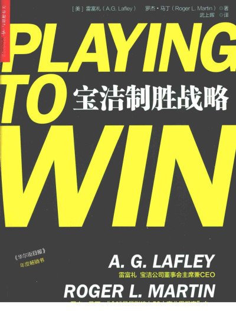

***

* **《竞争优势》（ *Competitive Advantage* – Porter）**

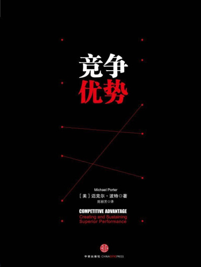

***

* **《竞争优势：透视企业护城河》 *Competition Demystified* – Greenwald**

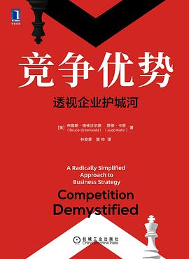

***

* **《学习型管理：培养领导团队的A3管理方法》 （ *Managing to Learn* – Shook）**

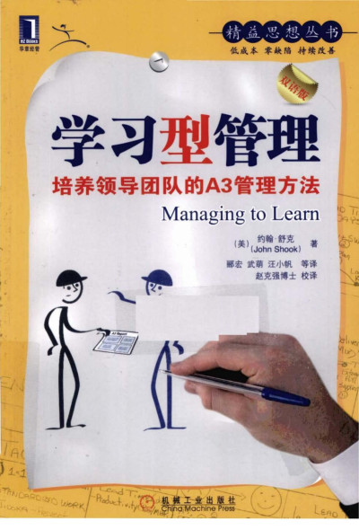

***

* **《价值投资者的护城河》（Quality Investing – Cunningham）**

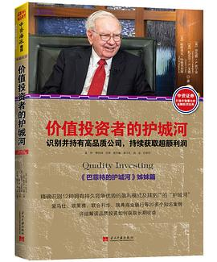

***

