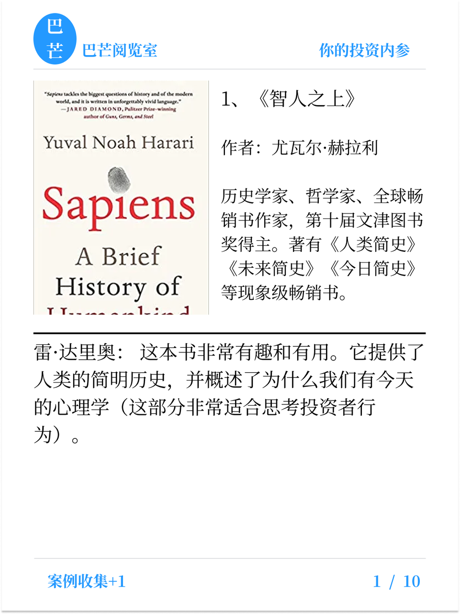
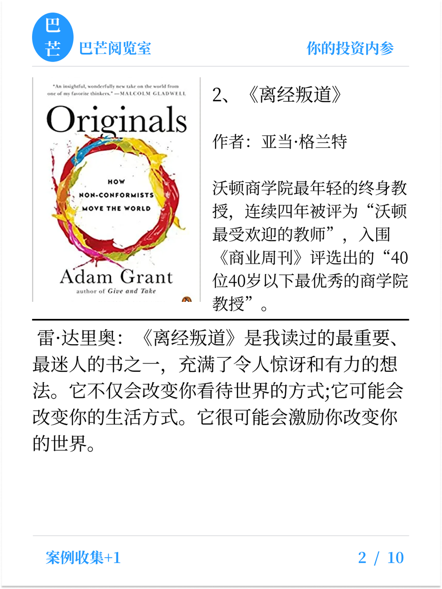
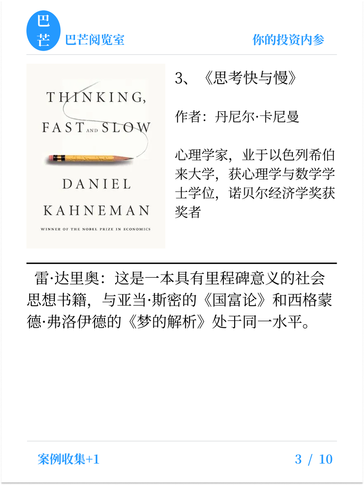
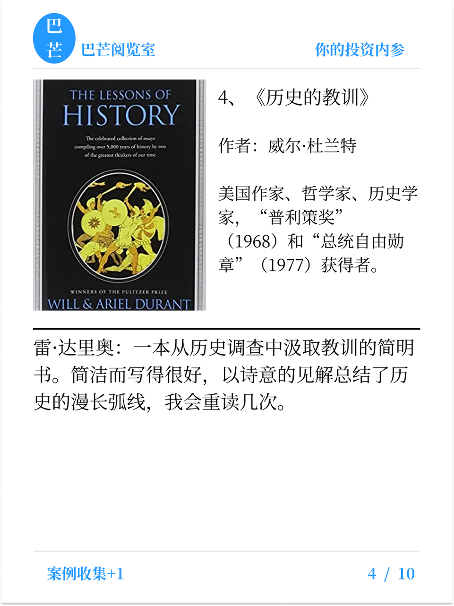
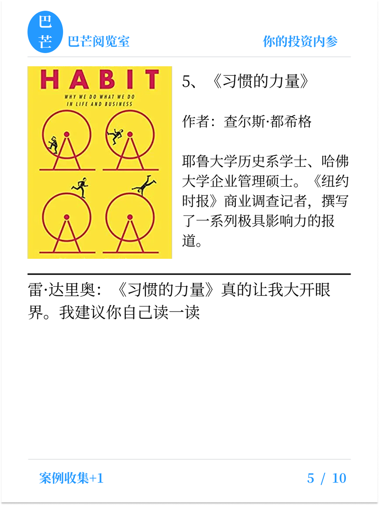
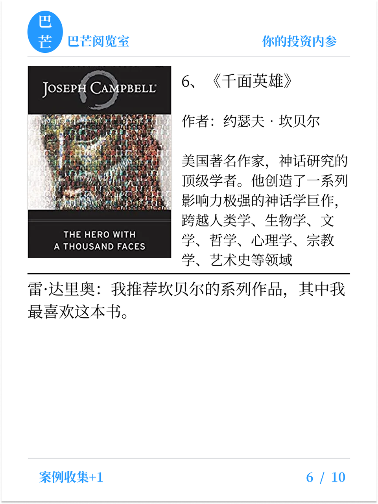
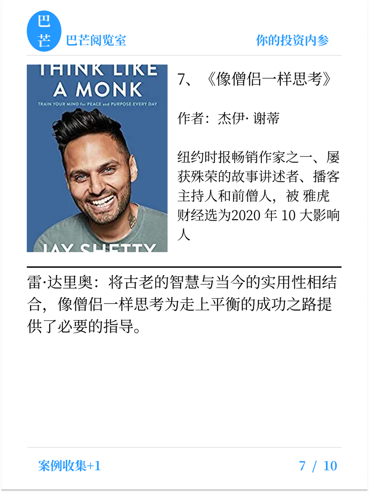
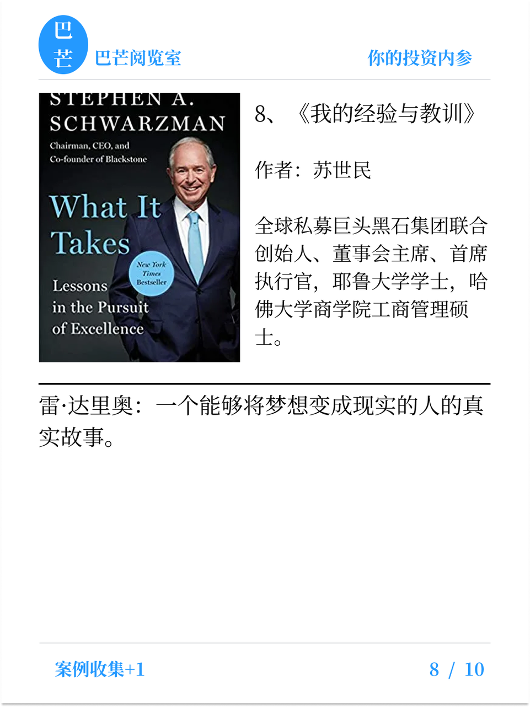
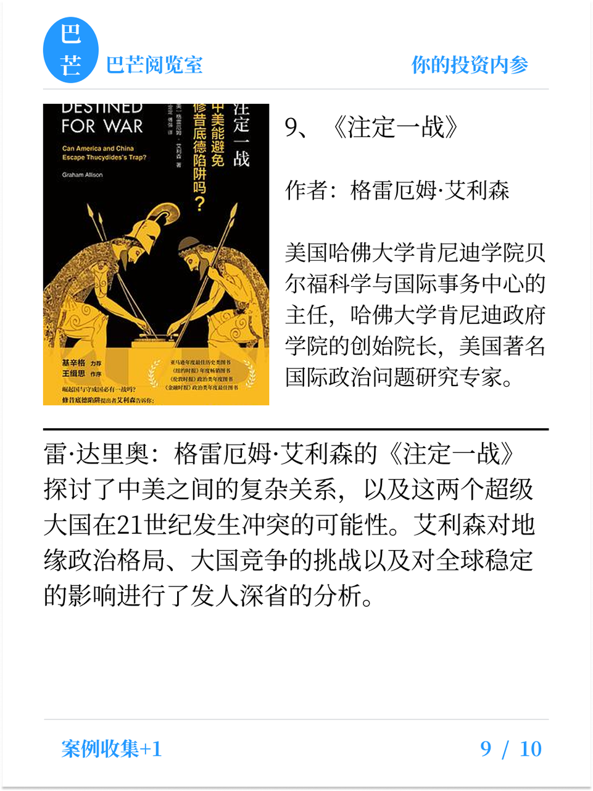
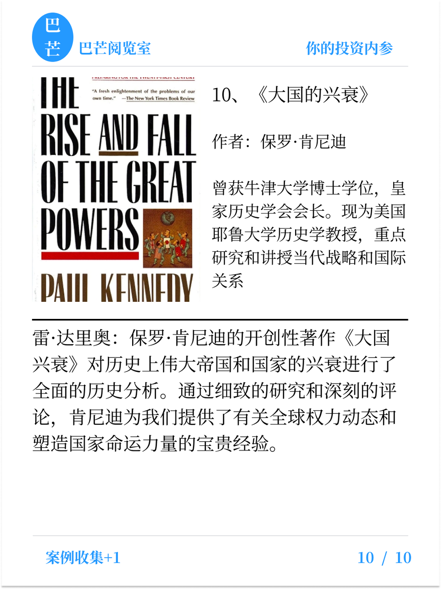

飞书链接：https://y4pc2g8csc.feishu.cn/docx/OkKJdyg2QoDnEDxn4uecE9DCnWf?from=from\_copylink  &#x20;

密码：bmyls666

> 彦鑫：整理了桥水基金创始人雷.达里奥的推荐书单，分享给大家。雷·达里奥（Ray Dalio）是全球知名投资人、经济思想家，桥水基金（Bridgewater Associates）创始人。桥水成立于1975年，总部位于美国康涅狄格州，目前管理资产规模超过1600亿美元，是全球最大对冲基金。达里奥以“全天候策略”和“宏观对冲”理念著称，主张通过资产多元化应对经济周期波动。其代表基金“Pure Alpha”长期年化收益率约10%以上，多次在金融危机中保持正收益。

**下载方式：**

**1、手机端：使用飞书app打开本页面，点击以下相关“书籍”，再点击右上角“...”图标，再点击“下载”按钮即可。**

**2、电脑端：**&#x9F20;标移动到书籍上，就有下载图标，如下图，点击后下载：

**雷·达里奥：“阅读的价值，在于让你站在伟大的头脑旁边思考。”**

