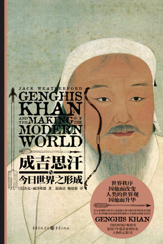
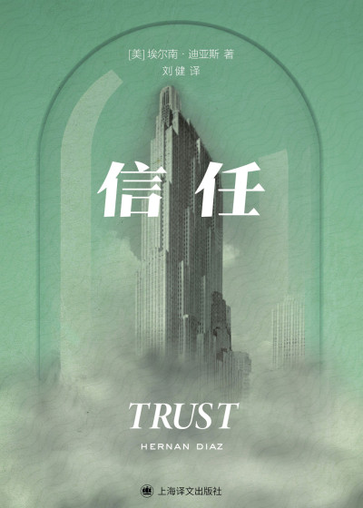
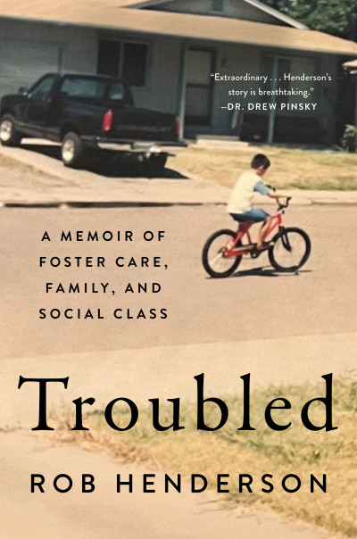
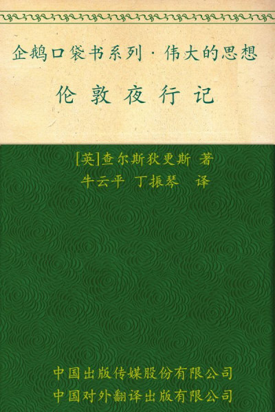
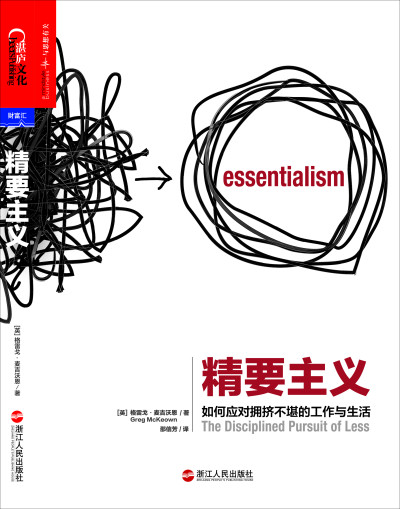
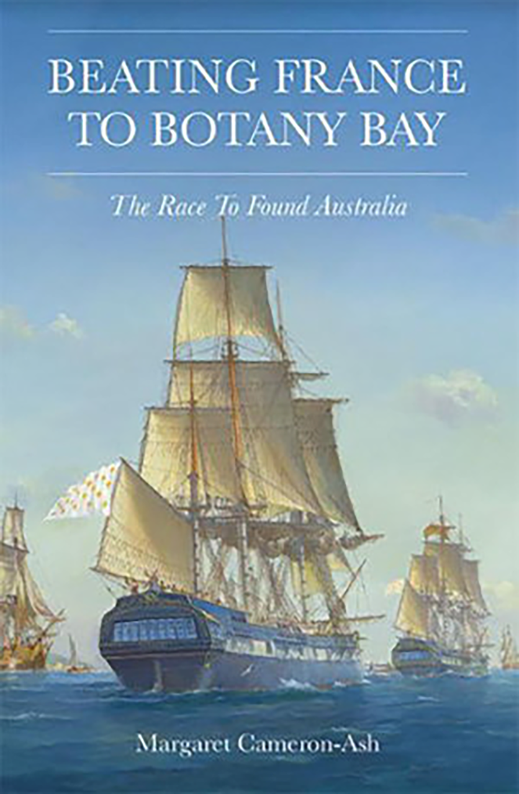
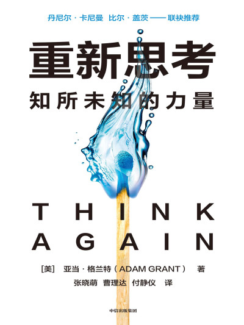

### **Oaktree在读什么？2024年年终图书推荐**

下载链接：https://y4pc2g8csc.feishu.cn/docx/PMwvdPhpgoDtv3xRHYecqkgAnIf?from=from\_copylink  &#x20;

密码：bmyls666

在2024年，面对深刻的全球变革——从文化与技术的进步，到地缘政治和经济的不确定性——书籍依旧为我们提供了新的视角和宝贵的启示。在信息爆炸、不断变化的时代，阅读依然是一种经久不衰的方式，帮助我们获取洞察、理解复杂问题。

以下是十本Oaktree团队成员在这一快速变化的世界中，用以应对挑战、汲取灵感的重要读物。

1、《成吉思汗与今日世界之形成》（Genghis Khan and the Making of the Modern World by Jack Weatherford）

作者：杰克·威泽福德—— 阿尔缅·帕诺西安（Armen Panossian））

Performing Credit 联合首席执行官兼主管

推荐理由：

对于那些对历史叙述感兴趣、并希望从中汲取有价值经验的人来说，这本书无疑是一部引人入胜的作品。它深入探讨了成吉思汗那既辉煌又短暂的帝国。尽管成吉思汗曾取得了令人惊叹的成就——其统治范围甚至超过了后来的罗马帝国——但这种迅猛的扩张最终导致了帝国难以为继。

本书不仅是一部精彩的历史回顾，也为现代世界提供了富有洞察力的启示。尤其对于企业而言，其中一个重要的启示是：稳健且有节制的增长至关重要。盲目的扩张虽看似辉煌，却可能埋下崩溃的隐患。

***

2、《勇往直前》 （Good Power: Leading Positive Change in Our Lives, Work, and World by Ginni Rometty）

—— 珍妮·李（Jenny Li），

亚太区房地产主管

推荐理由：

这本书由IBM前董事长兼首席执行官吉妮·罗曼提（Ginni Rometty）撰写，讲述了她从艰难童年一路走到成为公司首位女性CEO的奋斗历程。她在书中深刻反思了推动她不断前行的“善的力量”——始终寻找前进的方向、勇于迎接不适、重视进步胜于追求完美。

作为一位致力于打造更公平组织和社会的领导者，罗曼提始终以尊重与信念来引导他人。对我而言，书中最触动人心的部分，是她亲笔写下的一封信，真切地传达了她的信念：积极的改变不仅取决于你做了什么，更在于你是如何去做的。

***

3、《信任》（Trust by Hernan Diaz）

作者：赫尔南·迪亚兹（Hernan Diaz）—— 凯瑟琳·格林（Katherine Green），

环境、社会与治理事务副总裁

推荐理由：

这部引人入胜的小说讲述了华尔街金融大亨本杰明·拉斯克（Benjamin Rask）和他才智过人的妻子海伦（Helen）之间的故事，背景设定在1920年代的纽约。这段传奇通过四个不同的视角层层展开，深刻探讨了关于财富、成功、心理健康与父权社会规范等重大主题。

《信任》不仅生动还原了“咆哮的二十年代”中华尔街的繁华与喧嚣，更敏锐地揭示了外界认知与内心真实之间的巨大反差，是一部兼具文学魅力与思想深度的佳作。

***

4、《芯片战争：世界最关键技术的争夺战》（Chip War: The Fight for the World’s Most Critical Technology by Chris Miller）

作者：克里斯·米勒（Chris Miller）—— 肖恩·里根（Sean Regan），

市场副总裁

推荐理由：

《芯片战争》被《金融时报》评为 2022 年最佳商业图书，这并不令人意外。真正令人惊讶的是，这本书竟然在我书架上落灰了这么久才被翻开阅读。这本书深入剖析了半导体行业——一个对全球供应链、国际商业乃至世界权力格局都产生深远影响的关键领域。

在当前的地缘政治背景和人工智能迅猛发展的时代，这本书无疑是一部及时且至关重要的读物，帮助我们理解这项正在塑造未来世界格局的核心技术。

***

5、《动荡：一段关于寄养、家庭与社会阶层的回忆录》（Troubled: A Memoir of Foster Care, Family, and Social Class）

作者：罗布·亨德森（Rob Henderson）—— 托德·莫尔茨（Todd Molz），

首席运营官

推荐理由：

罗布·亨德森在这本回忆录中讲述了自己动荡不安的成长经历。他的母亲吸毒成瘾，父亲长期缺席，在被收养之前，他辗转于十个寄养家庭之间。尽管他曾一度渴望获得稳定的生活，现实却是童年充满了离婚、悲剧、贫困与暴力。

亨德森的故事在讲述他如何走向军旅生涯、就读耶鲁大学并最终获得剑桥博士学位的同时，也反衬出那些童年好友最终锒铛入狱或不幸早逝的悲惨命运。他的回忆录为我们提供了一个发人深省的视角，探讨了在当今社会中，社会阶层、家庭稳定与特权之间相对重要性的复杂关系。

***

6、《瞬变：如何让你的世界变好一些》（Switch: How to Change Things When Change Is Hard by Chip Heath and Dan Heath）

作者：奇普·希思（Chip Heath）、丹·希思（Dan Heath）—— 玛德琳·霍顿（Madeleine Horton），

全球人力资源主管

推荐理由：

《转变》提供了一套引人入胜的框架，帮助个人实现积极的改变。书中指出，我们大脑的理性与感性部分在面对改变时需要不同的激励：理性需要明确的方向，而情感则依赖于直觉的力量。更重要的是，书中强调，外部环境也必须支持改变的发生。

作者通过许多贴近现实且具有操作性的案例，让理论变得易于理解和应用。这本书尤其适合那些希望深入了解“影响力”机制，并希望在面对复杂项目、多元团队与多重优先事项时，更有效地推动变革的人士。

***

7、《夜行记》（Night Walks by Charles Dickens）

作者：查尔斯·狄更斯（Charles Dickens）—— 哈里·怀特劳（Harry Whitelaw），

企业传播与品牌助理副总裁

推荐理由：

《夜行记》是一部由狄更斯创作的短篇随笔集，与他以长篇小说闻名的形象略有不同。在这本书中，狄更斯带领读者走进他因失眠而踏上的夜间漫步旅程。他常常在夜深人静时穿行于伦敦街头，一边沉思，一边观察这座城市的细节与苦难。

这些夜行随笔不仅勾勒出一幅生动的城市画卷，也体现出狄更斯作为一名记者的意图——尽管有时显得笨拙——去揭露维多利亚时代伦敦社会的残酷不平等。时隔150多年，对社会差异的理解依旧重要。而对于渴望暂时逃离科技干扰的现代人来说，狄更斯所倡导的“清空思绪的散步”理念，也仍具有深刻的共鸣。

***

8、《精要主义： 如何应对拥挤不堪的工作和生活》（Essentialism: The Disciplined Pursuit of Less by Greg McKeown）

作者：格雷格·麦基昂（Greg McKeown）—— 布兰登·比尔（Brendan Beer），

结构性信贷联合投资经理

推荐理由：

在这本管理类作品中，麦基昂为读者提供了一份巧妙的指南，帮助我们识别那些常常充斥在职业生活中的低效因素，并提出了如何为自己争取空间与视角，从而提升工作质量的建议。我尤其被他提出的“最慢的登山者”这一类比所打动。

在每一家企业，甚至每一个部门中，往往都会出现某些能力被过度配置，而另一些则被忽视的现象。要识别出到底哪项能力是“最慢的登山者”，往往需要面对一种令人不适却必要的理智诚实。

***

9、《抢在法国之前抵达波特尼湾：建立澳大利亚的竞赛》（Beating France to Botany Bay）

作者：玛格丽特·卡梅伦-阿什（Margaret Cameron-Ash）—— 杰里米·博尔顿（Jeremy Bolton），

企业与科技服务部助理副总裁

推荐理由：

《抢在法国之前抵达波特尼湾》讲述了1788年英国与法国争夺澳大利亚大陆主权的历史竞赛。作者玛格丽特·卡梅伦-阿什是一位成功的律师，她在业余时间开始研究这个话题，并写出了这本引人入胜的历史著作。

书中不仅描绘了这一历史事件的全过程，还强调了决策往往受到猜测与误解的影响。当时几位英国与法国政府官员所做出的决定，彻底改写了历史。通过我祖国——澳大利亚的建国过程来审视个体决策的深远影响，这段历史让我感到格外引人入胜。（暂无资源）

***

10、《重新思考：知所未知的力量》（Think Again: The Power of Knowing What You Don’t Know by Adam Grant）

作者：亚当·格兰特（Adam Grant）—— 温奥菲利娅（Ophelia Wen），

基金会计与运营部高级经理

推荐理由：

《再想一想》是一部发人深省的作品，探讨了“重新评估”和“放下固有观念”所带来的转变力量。格兰特以娴熟的写作技巧，生动展示了质疑自身假设如何促使个人与职业成长。

书中充满了引人入胜的故事和实用的建议，使得这不仅是一本富有洞察力的著作，也是一段引人入胜的阅读旅程。它鼓励读者欣然接受“犯错的乐趣”，并认识到改变观点的价值。这本书深深地挑战并启发了我，促使我以更加积极的方式去“再想一想”。

